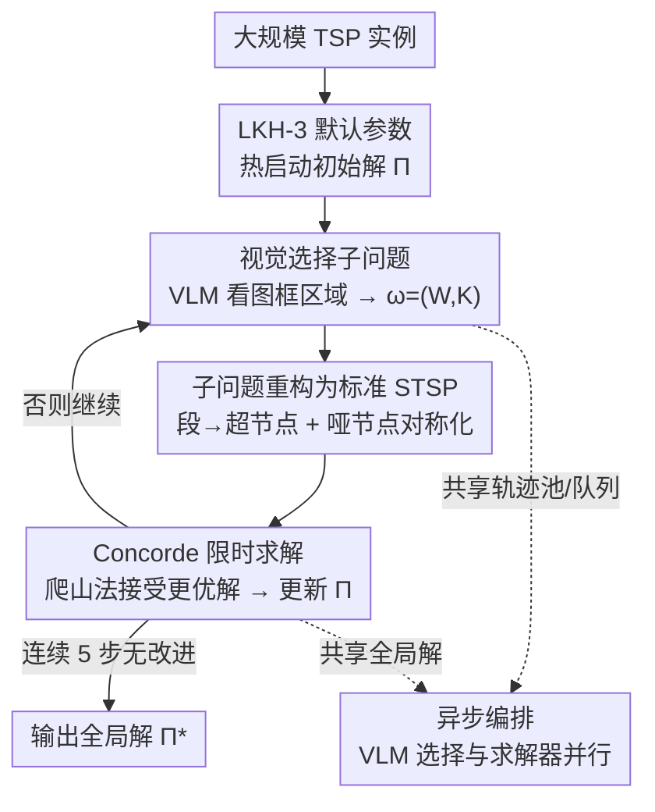

# ViTSP: 用视觉语言模型引导求解大规模旅行商问题

**会议**: ICLR 2026  
**OpenReview**: [https://openreview.net/forum?id=2LoaiaGKuV](https://openreview.net/forum?id=2LoaiaGKuV)  
**代码**: https://github.itap.purdue.edu/uSMART/ViTSP_ICLR2026  
**领域**: 组合优化 / 视觉语言模型应用  
**关键词**: 旅行商问题, 视觉语言模型, 问题分解, 精确求解器, 异步编排

## 一句话总结
ViTSP 把大规模 TSP 实例画成一张图喂给预训练 VLM，让 VLM "看图"框出有希望优化的小区域作为子问题，再交给现成精确求解器（Concorde）反复求解来改进全局解；在 1k–88k 节点的真实 TSPLIB 上平均最优性 gap 仅 0.24%，无需任何任务训练就超过了 LKH-3 和一众学习型求解器。

## 研究背景与动机

**领域现状**：TSP 是 NP-hard 的经典组合优化问题，求解路线大致三类。精确求解器（Concorde、Gurobi）能保证最优但规模一大就算不动；启发式（LKH-3）是当前 SOTA，但效果高度依赖针对实例的参数调校；近年的学习型神经求解器（端到端构造 / 局部改进）用 GNN 嵌入实例后监督或强化训练。

**现有痛点**：神经求解器只在与训练分布同源、规模小（节点 < 1000）的实例上表现好，一旦真实问题偏离训练数据就泛化崩盘，几乎没有工作敢在 N > 5000 的 TSPLIB 上报结果。已有的 LLM/VLM 方法要么把坐标当文本让模型直接吐路线（N=50 都 gap 巨大），要么让 VLM 读图上的节点编号连边（节点一密就认错），要么纯文本让 LLM 设计启发式（忽略空间结构、跨实例方差极大）——都没能在大规模实际 TSP 上可靠工作。

**核心矛盾**：让生成式模型"端到端出解"这条路根本走不通——它既保证不了可行性也保证不了质量；但启发式求解器最贵的恰恰是 90% 精力花在的"针对实例的分解 / 调参"上，而好的分解既要考虑空间局部性，又要考虑能跳出局部最优的组合邻域。

**本文目标**：不让 VLM 去解题，而让它去做它擅长的事——给定一个可视化的 TSP 当前解，自适应地指出"接下来该重点优化哪一块"，把这块小区域交给精确求解器保质保量地重解。

**切入角度**：VLM 天然能把 TSP 实例当成 2D 图像来读，解释其空间结构，且作为通才不需要任何针对图嵌入的专门训练或数据采集。子问题被框得足够小，精确求解器就能可靠求解、避开神经求解器在大规模上的退化。

**核心 idea**：把 VLM 从"不靠谱的端到端求解器"重新定位为"OR 求解器的分解启发式提供者"——VLM 看图选区域、求解器解子问题，两者异步协同迭代改进全局解。

## 方法详解

### 整体框架

ViTSP 要解决的是：给一个上万节点的大规模 TSP，如何在不训练任何模型的前提下，持续逼近最优解。它的整条流水线是一个"看图选块 → 重解小块 → 接受更优解 → 再看图"的迭代循环。

具体地，先用 LKH-3 默认参数热启动得到一个初始全局解 $\Pi$；把节点和当前连线按 2D 坐标画成一张图作为视觉提示，连同文本提示一起喂给 VLM，VLM 输出若干个矩形框坐标 $C=(x_{min}, x_{max}, y_{min}, y_{max})$，每个框圈出一个待优化的子问题 $\omega=(W, K)$（$W$ 是框内被解开连接的自由节点，$K$ 是框外保持连接的路段）；这个子问题被重构成一个标准对称 TSP，交给 Concorde 在限定时间 $T_{max}$ 内求最优；若新解更短就用爬山法接受、更新 $\Pi$。由于 VLM 调用是 I/O 密集（等 API 响应）、求解器是 CPU 密集，两者计算特性差异大，ViTSP 用**异步编排**把它们分配到不同 CPU 核上，通过共享的全局解、轨迹池、子问题队列协调，连续 $K=5$ 步无改进则终止。

### 关键设计

**1. 视觉选择子问题：让 VLM 看图框出值得重解的区域**

这一步针对的痛点是"好的分解既要空间局部性又要能跳出局部最优，而人工调分解规则极贵"。ViTSP 把当前全局解 $\Pi$ 连同节点画成图作为视觉提示，文本提示则给三样东西：① 元指令 $I$（任务描述 + 输出格式）；② 选择轨迹 $\Phi=\{\phi_1, \phi_2, \dots\}$，每条记录"选过的子问题、含多少节点、优化带来的增益、求解器耗时"，因为 API 式 VLM 调用是无状态的，这段轨迹相当于记忆，让 VLM 从历史选择中读出实例特定结构、做出更好的后续选择；③ 待解队列 $\Omega$，列出已选但还没解的子问题，避免重复选。VLM 输出一个或多个四元组 $C=(x_{min}, x_{max}, y_{min}, y_{max})$ 表示框区域（每次可生成 $Q\ge 2$ 个）。框定后，框内节点的连接被移除得到自由节点集 $W$，框外保持连接的部分形成路段集 $K$，于是产出子问题 $\omega=(W, K)$。

为应对超大规模实例（节点极密、初始可视化里连线难辨），ViTSP 还设计了**放大重选（zoom-in reselection）**：若首轮框出的区域覆盖节点数 $|W|$ 超过阈值 $\alpha$，VLM 就对这个子区域再放大看一遍细粒度结构，重新框出更精细的 $C'$。这让"看图选块"在 8 万节点尺度上仍然可用。

**2. 子问题重构为标准对称 TSP：让现成精确求解器能直接吃**

VLM 框出的 $\omega=(W, K)$ 不是一个标准 TSP——它混了自由节点和必须保持内部顺序的固定路段，直接求解器解不了。这一步把它变形成精确求解器（多为对称 TSP 设计）能处理的形式。先把每个路段 $(\pi^k_1, \dots, \pi^k_{c_k})$ 聚合成一个超节点 $s_k$，得到 $|K|+|W|$ 个节点的新列表，这构成一个**部分非对称 TSP（ATSP）**：因为超节点有"入口端"和"出口端"之分，从自由节点到段起点、从段终点到自由节点、段终点到另一段起点的距离都不对称，形成一个分块非对称距离矩阵 $D_{ATSP}$。

由于现成求解器主要面向对称 TSP，ViTSP 进一步把这个部分 ATSP 转成标准 STSP：沿用 Jonker & Volgenant 的做法，给每个超节点 $s_k$ 引入一个哑节点 $s'_k$，节点集扩展为 $\{s_1, \dots, s_{|K|}, s'_1, \dots, s'_{|K|}, w_1, \dots\}$，构造对称分块矩阵 $D_{STSP}$，并把 $\hat D_{|K|\times|K|}$ 的对角元设成相对很小的值，**诱导超节点 $k$ 和其哑节点紧邻相连**，从而在对称解里编码出原来的方向性。Concorde 解出 $\Pi^*_{STSP}$ 后，去掉所有哑节点恢复成 $\Pi^*_{ATSP}$，再把每个超节点展开回原路段，得到原 TSP 的更新解。求解器有时间上限 $T_{max}$，到点就返回当前最优 incumbent，避免在某个子问题上卡死太久；只有当新解目标值更低时才用爬山法接受。这套重构让 ViTSP 能借精确求解器"保质量"的能力，避开神经求解器在子问题上的退化。

**3. 异步编排：让等 API 的 VLM 和算 CPU 的求解器都不闲着**

选择模块是 I/O 密集（瓶颈在等 VLM 服务器响应），求解模块是 CPU 密集，顺序执行会让求解器干等 VLM、或反之，互相拖累。ViTSP 把两个模块异步部署在多核上，通过三个共享组件协调——全局解 $\Pi$、轨迹池 $\Phi$、子问题队列 $\Omega$——它们提供各模块执行所需的上下文。

为进一步提速，选择侧同时用快思考 VLM（GPT-4.1）和推理 VLM（o4-mini），发挥两类模型互补的优势，每个 VLM 每次提示生成 $Q\ge 2$ 个框；求解侧用多个相同求解器从共享队列并行取子问题解。为避免并发更新全局解冲突，ViTSP 设 $P$ 个"从求解器（slave）"负责优化并筛选取回的子问题——无改进的直接丢弃，有净增益的转交唯一的"主求解器（master）"去更新 $\Pi$。如此既保证新生成的子问题不被闲置，又让全局解的更新串行无冲突。

### 一个完整示例

以 88k 节点的 pla85900 为例走一遍：LKH-3 默认参数先给出一个初始解 $\Pi$；由于节点极密，VLM 先框出一个较大区域 $C$，发现框内节点数超阈值 $\alpha$，于是放大重选得到更精细的 $C'$；该区域内连接被解开，框内得自由节点 $W$、框外得固定路段 $K$，形成子问题 $\omega$；$\omega$ 聚合路段为超节点、加哑节点转成对称 TSP 后交 Concorde 限时求解；新解更短就更新 $\Pi$ 并把这次"选了多大区域、增益多少、耗时多少"写进轨迹池 $\Phi$，供 VLM 下一轮参考。与此同时，另一些从求解器正在并行处理队列里 VLM 已框好的其它子问题——整个过程持续到连续 5 步无改进。

## 实验关键数据

### 主实验

评测集为 TSPLIB 中 $N\ge 1000$ 的 33 个真实实例（1k–88k 节点，按规模分为 22 个"大"实例与 11 个"超大"实例）外加合成 TSP-10K。指标为最优性 gap（相对 TSPLIB 证明最优值）和墙钟时间（含 LKH 初始化 + 所有 VLM API 延迟 + Concorde 求解）。ViTSP 用 GPT-4.1 + o4-mini 作选择器、Concorde 作子问题求解器、$Q=2$、$K=5$、五次运行取平均。

| 方法 | 平均 gap | 说明 |
|------|---------|------|
| **ViTSP** | **0.24%** | 33 个实例中 11 个找到全局最优，20 个取得最低 gap |
| LKH-3 (more RUNS) | 0.31% | SOTA 启发式，对齐到 ViTSP 同等运行时 |
| Concorde | 0.34% | SOTA 精确求解器，同等或更长时限 |
| SIT | 1.17%–7.55% | 学习型局部改进，OOD 退化明显 |
| INViT / DIFUSCO / UDC / DeepACO | 6%–100%+ | 端到端 / 神经局部改进，泛化崩盘 |
| EoH | 高方差（最高 596%） | LLM 文本设计启发式，跨实例极不稳定 |

相对 LKH-3 的逐实例 gap，ViTSP 进一步缩小了 3.57%–100.00%；规模越大优势越明显——在 $N<4000$ 时 LKH-3 仍很高效，但 $N>4000$ 后 ViTSP 显著加快 gap 下降并稳定取得更低 gap。在合成 TSP-10K 上，ViTSP gap 0.70%，优于 LKH-3 (more RUNS) 的 1.06% 和专门在 TSP-10K 上训练过的 SIT（1.81%）。

### 消融实验

| 配置 | 关键结论 | 说明 |
|------|---------|------|
| ViTSP（VLM 选择器） | gap 持续下降并跑赢两种随机策略 | 完整模型 |
| 随机序列选择 | 收敛到局部最优 | 随机选等长路段，匹配 ViTSP 平均选块大小 |
| 随机框选择 | 收敛到局部最优 | 随机框 $Q=2$ 个矩形子问题 |
| LKH 初始化 | gap 一致更低 | 完整设置 |
| FI 初始化 | gap 显著更差（如 rl1304 8.01% vs 0.14%） | 换成更弱的初始解 |

### 关键发现

- **VLM 的选择确实"有脑子"而非乱框**：把 VLM 选择器换成随机序列 / 随机框两种启发式后，虽然也能降一些 gap，但都早早卡在局部最优，而 ViTSP 持续下降并超越——证明 VLM 在利用实例特定的空间结构做有意义的分解。
- **初始化质量影响起点但不影响"VLM 分解能改进"这一结论**：LKH 初始化一致优于 FI 初始化（FI 在 rl1304 上 8.01% vs LKH 的 0.14%），但无论哪种初始化，VLM 引导的分解都能在其对应基线上持续改进。
- **TSP 结构本身决定难度**：pr2392 虽是 pcb1173 两倍大，Concorde 求最优却只用后者 26% 的时间；ViTSP 和 LKH-3 都在 fl1400 上难做、ViTSP 在 d2103、rl5915 上降 gap 吃力——说明分布结构比单纯规模更关键。
- **早期阶段未必最快**：pla85900 上随机序列选择在前期降 gap 比 ViTSP 还快，暗示框选之外的操作（如序列型算子）仍有挖掘空间。

## 亮点与洞察
- **"重新定位"而非"硬上"生成式模型**：不让 VLM 端到端出解（注定不可行/低质），而让它只做分解启发式，把可行性和质量交还给精确求解器——这个分工是全文最聪明的地方，绕开了 LLM/VLM 解组合优化最致命的两个坑。
- **轨迹池当记忆破解 API 无状态**：把"选过哪块、增益多少、耗时多少"喂回 VLM，让无状态的 API 调用获得跨步上下文，等于给 VLM 装了一个针对当前实例的在线学习闭环，且无需任何梯度训练。
- **ATSP→STSP 的哑节点对称化技巧可复用**：把"含固定路段的局部重连"问题统一编码进对称距离矩阵，让任意成熟对称求解器即插即用，这套重构对其它"部分固定、部分自由"的路由子问题都适用。
- **异步 + 主从求解器**是把异构计算（I/O 密集 VLM + CPU 密集求解器）吞吐拉满的工程关键，主从分工又顺手解决了并发更新全局解的冲突。

## 局限与展望
- 框选（box-region）这一种算子未必最优：pla85900 上随机序列选择前期更快，作者自己指出序列型等其它算子可能更好——当前只用矩形框限制了分解算子的多样性。
- 对某些结构（fl1400、d2103、rl5915）ViTSP 降 gap 仍吃力，说明 VLM 的视觉理解对特定空间分布存在盲区。
- 依赖在线 VLM API，端到端时间里含不可控的 API 延迟，且有调用费用（作者在附录给了开销分析）；离线 / 本地部署场景下不可直接套用。
- 方法专为 2D 欧氏 TSP 设计（要能画成图），推广到非欧氏、带约束的路由问题（如 VRP、带时间窗）还需重新设计可视化与子问题编码。

## 相关工作与启发
- **vs 学习型神经求解器（AM / DIFUSCO / INViT / SIT / UDC）**：它们用 GNN 在固定数据集上训练，OOD 实例上泛化崩盘（gap 普遍 5%–100%+）；ViTSP 用预训练 VLM 的通用推理零训练做分解，在所有 TSPLIB 实例上一致更优。
- **vs 纯文本 LLM 方法（Yang et al. 坐标当文本 / EoH 设计启发式）**：纯文本忽略实例空间结构，要么小规模都解不对、要么跨实例方差极大（EoH 最高 596%）；ViTSP 把实例当图像让 VLM 直接读空间结构，稳定得多。
- **vs LKH-3（SOTA 启发式）**：LKH-3 在中等规模高效但需针对实例调参、改进很快触顶；ViTSP 用 LKH-3 默认参数热启动后靠 VLM 分解持续改进，规模越大优势越明显，且免去了参数调校的领域知识依赖。
- **vs Concorde（SOTA 精确）**：Concorde 大规模算不动；ViTSP 把它用在足够小的子问题上，既借其质量保证又规避其规模瓶颈。

## 评分
- 新颖性: ⭐⭐⭐⭐⭐ "把 VLM 从求解器降级为分解器"的重新定位是真正原创的视角，混合生成式模型与 OR 求解器开辟了新范式。
- 实验充分度: ⭐⭐⭐⭐⭐ 33 个真实 TSPLIB 实例（1k–88k）+ 合成集 + 12 个基线 + 选择器/初始化双消融，是该尺度上少见的全面评测。
- 写作质量: ⭐⭐⭐⭐ 方法分模块清晰、ATSP→STSP 推导完整，但部分关键细节（阈值 $\alpha$、提示模板）放在附录。
- 价值: ⭐⭐⭐⭐⭐ 零训练、即插即用、可扩展到 8 万节点，对真实物流系统有直接落地潜力。

<!-- RELATED:START -->

## 相关论文

- [\[ICLR 2026\] The Potential of Second-Order Optimization for LLMs: A Study with Full Gauss-Newton](the_potential_of_second-order_optimization_for_llms_a_study_with_full_gauss-newt.md)
- [\[ICLR 2026\] High-Probability Bounds for the Last Iterate of Clipped SGD](high-probability_bounds_for_the_last_iterate_of_clipped_sgd.md)
- [\[ICLR 2026\] Toward Principled Flexible Scaling for Self-Gated Neural Activation](toward_principled_flexible_scaling_for_self-gated_neural_activation.md)
- [\[ICLR 2026\] Shuffling the Data, Stretching the Step-Size: Sharper Bias in Constant Step-Size SGD](shuffling_the_data_extrapolating_the_step_sharper_bias_in_constant_step-size_sgd.md)
- [\[ICLR 2026\] Towards Efficient Optimizer Design for LLM via Structured Fisher Approximation with a Low-Rank Extension](towards_efficient_optimizer_design_for_llm_via_structured_fisher_approximation_w.md)

<!-- RELATED:END -->
