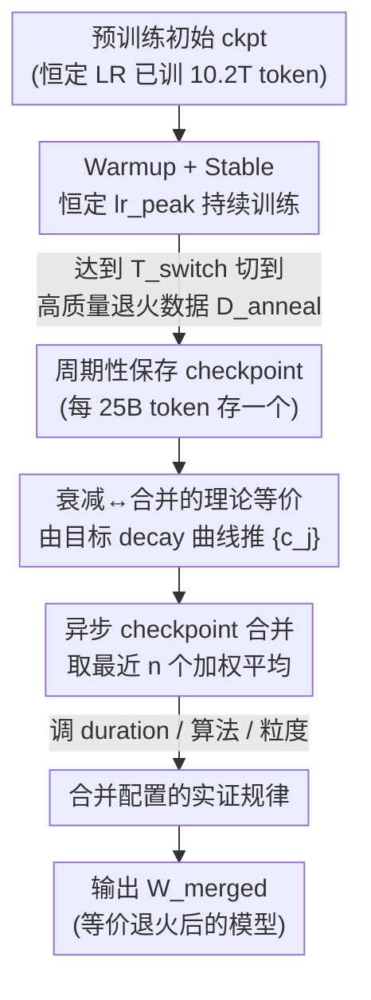

# WSM: Decay-free Learning Rate Schedule via Checkpoint Merging for LLM Pre-training

**会议**: ICLR 2026  
**论文**: [OpenReview](https://openreview.net/)（ICLR 2026 录用，缓存无 arXiv 号，⚠️ 链接以原文为准）  
**代码**: 无（论文未公开）  
**领域**: LLM效率 / 预训练优化  
**关键词**: 学习率调度, checkpoint merging, 模型平均, decay-free, 预训练退火

## 一句话总结
WSM 把"学习率衰减"和"checkpoint 加权平均"从理论上画了等号——只要恒定学习率训练，再把最近若干个 checkpoint 按推导出的权重合并，就能模拟出余弦/线性/1-sqrt 等任意衰减曲线，从而彻底去掉训练中的 decay 阶段，并在 MATH/HumanEval/MMLU-Pro 等基准上稳定超过主流的 WSD 方案。

## 研究背景与动机

**领域现状**：LLM 预训练里学习率调度（LR schedule）至关重要。最经典的余弦衰减（cosine decay）需要在开训前就把总训练步数 $T_{max}$ 定死，一旦要加新数据继续训练，整条衰减曲线作废、必须从头重启。为了解耦总步数，WSD（Warmup-Stable-Decay）在 warmup 和 decay 之间插了一段恒定学习率的 stable 阶段，DeepSeek-V3、ERNIE 4.5 都在用。

**现有痛点**：WSD 虽然能灵活地从 stable 阶段任意一点启动 decay，但它把调度复杂度从"定总步数"换成了"定 decay 怎么走"——研究者得手动决定**什么时候开始衰减、分配多少 token 给衰减、用哪个衰减函数**。更糟的是，一旦 decay 已经开始又想继续训，必须把模型回滚到 decay 之前的状态、重新设计衰减策略。这跟"全自动、连续训练"的目标背道而驰。

**核心矛盾**：decay 阶段本质上是为了"退火"（让模型收敛到更平坦的最优区），但它被硬绑在**在线训练过程**里——衰减一旦发生，学习率就被改了，训练状态就被改了，没法回退也没法复用。能不能把"退火带来的收益"从在线训练里剥离出来？

**切入角度**：已有工作发现，恒定学习率 + 权重平均（如 EWA 指数加权平均）就能逼近 WSD 的效果。作者顺着这条线追问：权重平均和学习率衰减之间，是不是存在**精确的数学对应**，而不只是经验上"差不多"？

**核心 idea**：把 checkpoint 合并的权重 $\{c_j\}$ 通过梯度展开换算成"对各步梯度的有效衰减系数"$\{w_i\}$，证明二者一一对应——于是"用什么衰减曲线"等价于"用什么合并权重"。恒定学习率训练 + 离线合并 checkpoint，就能模拟任意 decay，且与优化器无关（optimizer-agnostic）。

## 方法详解

### 整体框架

WSM（Warmup-Stable and Merge）把传统的"warmup → stable → decay"三阶段砍成两阶段：**warmup → stable（恒定学习率，永不衰减）**。学习率达到峰值 $lr_{peak}$ 后就一直保持不变，训练过程中周期性保存 checkpoint；真正的"退火"由一个**异步的合并进程**完成——它不断取最近 $n$ 个 checkpoint，按某条目标衰减曲线推导出的权重做加权平均，产出最终模型 $W_{merged}$，整个过程**从不改动在线学习率**。

在 stable 阶段后期（达到 $T_{switch}$ 步），数据可以从通用预训练集 $D$ 切换到小而精的高质量退火数据集 $D_{anneal}$，让"退火"聚焦在精选数据上——这一步是 WSM 实际超过 WSD 的关键来源。

### 关键设计

**1. 学习率衰减 ↔ checkpoint 合并的理论等价：把"退火"翻译成"加权平均"**

这是全文地基，针对的痛点是：以前大家只知道"权重平均经验上能逼近 decay"，但说不清为什么、也没法定制成任意曲线。作者从最一般的合并形式出发——合并后的模型是若干 checkpoint 的加权和 $\hat{\theta}_{n+k} = \sum_{j=0}^{k} c_j \theta_{n+j}$（权重非负且 $\sum c_j = 1$）。关键一步是把每个中间 checkpoint 用初始点 $\theta_n$ 加上后续梯度更新展开：$\theta_{n+j} = \theta_n - \sum_{l=1}^{j} g_{n+l-1}$（$g_i$ 是含学习率的第 $i$ 步梯度更新）。代入合并公式、交换双重求和顺序后得到：

$$\hat{\theta}_{n+k} = \theta_n - \sum_{i=1}^{k} \Big(\sum_{j=i}^{k} c_j\Big) g_{n+i-1} = \theta_n - \sum_{i=1}^{k} w_i \cdot g_{n+i-1}$$

也就是说，第 $i$ 步梯度的有效系数是 $w_i = \sum_{j=i}^{k} c_j$。这个 $w_i$ 恰好扮演了"合成的学习率衰减曲线"的角色：合并 checkpoint 等价于给训练后期的梯度施加一条由 $\{w_i\}$ 定义的衰减。反过来，**Theorem 3.1** 给出从目标衰减系数反解合并权重的唯一公式：给定单调非增的 $1\ge w_1\ge\cdots\ge w_k\ge 0$，则 $c_k = w_k$、$c_j = w_j - w_{j+1}$（$j\in[1,k-1]$）、$c_0 = 1 - w_1$。于是想模拟余弦/线性/1-sqrt 衰减，只要写出对应的 $\{w_i\}$ 再换算成 $\{c_j\}$ 即可——这就把"模型合并"从经验技巧升格成了"可定制任意衰减曲线"的原理性工具，且推导里不依赖任何具体优化器，天然 optimizer-agnostic。

**2. WSM 两阶段 pipeline：恒定学习率训练 + 异步合并退火**

有了理论等价，WSM 的工程实现就很干净（论文 Algorithm 1）：学习率只走 warmup 线性升到 $lr_{peak}$，之后**永远保持 $lr_{peak}$ 恒定**，公式上 decay 段被整段删掉。stable 阶段一边训练一边每隔固定 token 数（实验里 25B）存一个 checkpoint；到 $T_{switch}$ 后把训练数据切到高质量退火集 $D_{anneal}$。与此同时，一个**异步合并进程**持续从存储里拉最近 $n$ 个 checkpoint，按设计 1 推出的权重合成 $W_{merged}$。

这样设计的好处是把"退火"彻底从在线训练里解耦：在线学习率从不被改动，所以训练可以**无缝继续**（图 1 里的灰色区域——想加数据直接接着恒定 LR 训就行，不用回滚、不用重设 decay）；而"退火后的模型"随时能通过合并即时得到。相比之下 WSD 一旦进入 decay 就把学习率改了、状态改了，继续训得回滚重来。论文还据此指出一个额外价值：因为 WSM 合并能高保真地逼近真实 decay 的结果，它可以在预训练任意时刻**廉价估计"如果现在退火能到什么水平"**，省掉为评估而反复发起昂贵 decay 跑的开销。

**3. 合并配置的实证规律：duration 是头号因子，算法选择映射 decay 曲线优劣**

理论说了"能模拟"，但具体怎么配才好需要实测，作者系统扫了合并算法、频率、时长、粒度。最重要的发现是 **merge duration（被合并 checkpoint 覆盖的训练窗口）是影响性能的首要因素**，其重要性显著超过 checkpoint 间隔和合并数量——窗口越大越好但边际收益递减（对应 decay 里"退火数据越多越好但会饱和"的经验）。其次，**合并算法的优劣顺序与 decay 曲线的优劣顺序完全一致**：1-sqrt（凹）> Mean（线性）> EMA（凸），印证了"凹/线性衰减优于凸衰减"这一已知规律在合并世界里同样成立——这反过来证明 checkpoint 合并确实是 decay 的"原理性模拟"而非巧合。粒度上，保存越细（间隔越小）逼近真实衰减曲线越准、效果越好，但要权衡存储开销。作者还测了 merge 与 decay 能否叠加（Decay-then-Merge / Merge-then-Decay），结论是两者**不互补、是通往同一优化目标的替代路径**，组合不带来额外收益。

### 损失函数 / 训练策略
WSM 不引入任何新的训练损失或正则项，是纯调度层方法。训练用 AdamW（$\beta_1=0.9$, $\beta_2=0.95$，weight decay 0.1），峰值学习率 4.78e-4、batch size 2048（由 scaling law 预实验定）。主实验模型是 16.3B 总参/1.4B 激活参的 MoE，从已用 10.2T token 恒定 LR 预训的 checkpoint 出发，再在 400B token 高质量退火数据上分两支对比：WSD 支用标准 decay（含 continual pre-training 的 re-warmup），WSM 支保持恒定 LR、最后合并最近若干 checkpoint（默认每 25B 存一次、mean 平均，等价线性衰减）。

## 实验关键数据

### 主实验

Base 模型（取平均分最高的 checkpoint）：WSM 全面超过 WSD，最大增益来自 Professional Knowledge 和 Math。

| 能力类别 | WSD | WSM | 提升 |
|----------|------|------|------|
| General Knowledge | 69.06 | 70.22 | +1.68% |
| Language Modeling | 67.78 | 68.67 | +1.31% |
| Math | 57.49 | 58.81 | +2.30% |
| Code | 64.88 | 65.58 | +1.08% |
| Professional Knowledge | 53.46 | 56.04 | +4.83% |
| **Overall Average** | **62.67** | **63.95** | **+2.04%** |

> 摘要口径下（不同 checkpoint 选取/对比方式）报告 +3.5% MATH、+2.9% HumanEval、+5.5% MMLU-Pro；正文表格为类别平均口径，⚠️ 两套数字口径不同，以原文为准。

Instruct 模型（SFT 5 epoch 后，取最佳 epoch）：优势延续到后训练阶段，仅 Code 略降。

| 能力类别 | WSD | WSM | 提升 |
|----------|------|------|------|
| Language | 81.12 | 84.78 | +4.51% |
| Knowledge | 60.00 | 61.73 | +2.88% |
| Math | 61.43 | 62.28 | +1.38% |
| Code | 58.23 | 57.95 | -0.48% |
| Reason | 63.21 | 64.94 | +2.74% |
| Agent | 68.16 | 69.33 | +1.72% |
| **Overall Average** | **62.90** | **64.07** | **+1.86%** |

### 消融实验

合并算法对比（Table 3，与 1-sqrt decay 基线对照）：合并整体优于 decay，且 1-sqrt > Mean > EMA 的次序与 decay 曲线优劣一致。

| 配置 | Overall Avg | 说明 |
|------|-------------|------|
| Decay (1-sqrt) | 62.67 | WSD 基线 |
| Merge - EMA | 63.01 | 凸衰减，最弱 |
| Merge - Mean | 63.95 | 线性衰减 |
| Merge - 1-sqrt | **64.06** | 凹衰减，最佳 |

合并粒度对比（Table 4，固定 80B token 窗口；(间隔, 合并数)）：保存越细效果越好，(80B,1) 即只用单个 checkpoint 几乎退化。

| 粒度 (间隔, 数量) | Overall Avg | 说明 |
|-------------------|-------------|------|
| (5B, 16) | 63.63 | 最细粒度 |
| (10B, 8) | **63.78** | 最佳 |
| (20B, 4) | 63.36 | |
| (40B, 2) | 62.77 | |
| (80B, 1) | 60.33 | 退化为单 ckpt，明显掉点 |

### 关键发现
- **merge duration 是头号因子**：影响显著大于 checkpoint 间隔和合并数量；窗口越大越好但收益递减，与"退火数据越多越好但会饱和"的规律对齐。
- **真正让 WSM 超过 WSD 的是高质量退火数据**：在恒定 LR、不切数据的中间阶段，WSM 合并几乎完美复现真实 decay 的结果（高保真代理），但增益不大；一旦在合并阶段引入高质量退火数据，才拉开对 WSD 的优势。
- **EMA 是劣选**：凸衰减性质使其显著弱于其它算法，且对 merge duration 几乎不敏感。
- **merge 与 decay 不互补**：Decay-then-Merge 和 Merge-then-Decay 都不带来额外提升，二者是同一优化目标的替代路径。
- **MoE load balancing**（Table 5）：WSM 改善了专家利用率（load balancing violation 更低），代价是测试语言建模 loss 略高。

## 亮点与洞察
- **把"调度"问题转成"合并"问题**：最漂亮的地方是 Eq.3→Eq.4 那次双重求和换序，直接证出"合并权重 $c_j$"与"梯度有效衰减系数 $w_i$"的精确对应，让模型平均从经验 trick 变成可定制任意 decay 的原理工具。
- **Theorem 3.1 是可直接复用的配方**：任何想模拟的单调衰减曲线，写出 $\{w_i\}$ 就能反解出合并权重 $\{c_j\}$，工程上即插即用、且与优化器无关。
- **"廉价退火预言机"**：WSM 合并能高保真预测"现在退火能到多少分"，可省掉为评估反复发起昂贵 decay 跑的算力——这对大模型训练的过程监控很实用。
- **可迁移性**：恒定 LR + 离线合并的范式天然适合 continual pre-training 和长期模型迭代——不用回滚、不用重设衰减，加数据就接着训。

## 局限与展望
- **核心增益依赖高质量退火数据**：作者自己承认，不引入退火数据时 WSM 相对 WSD 的优势并不显著，方法的"超越"很大程度建立在数据质量上。
- **存储开销**：细粒度合并效果好，但频繁存 checkpoint 带来不小的存储压力，论文只点出 trade-off 没给出系统性解法。
- **理论假设较强**：推导里假设不同 step 之间的更新相互独立、且忽略优化器状态（如 Adam 的动量/二阶矩），实际 Adam 训练并不严格满足，等价关系是近似的。⚠️ 这一简化的实际影响以原文为准。
- **验证范围**：主实验集中在单个 16.3B MoE 模型上，跨规模、跨架构（dense 模型）的普适性还需更多验证。

## 相关工作与启发
- **vs WSD（Hu et al., 2024）**：WSD 用在线 decay 阶段做退火，需手动定 decay 起点/时长/函数，且 decay 后想续训要回滚；WSM 删掉 decay 段、用离线合并替代，调度更简单、可无缝续训，且实测全面更优。
- **vs EWA / 朴素权重平均（Li et al., 2025）**：以往工作只分析特定平均策略（如 EWA）的优化性质，经验上"逼近 WSD"；WSM 给出 decay↔合并的一般性等价定理，能定制任意衰减曲线，且系统揭示了"1-sqrt > Mean > EMA"的算法优劣序与 duration 主导规律。
- **vs 余弦衰减（Loshchilov & Hutter, 2016）**：余弦需开训前定死总步数、加数据要从头重启；WSM 彻底解耦总步数与退火策略。

## 评分
- 新颖性: ⭐⭐⭐⭐⭐ 把 LR 衰减与 checkpoint 合并建立精确数学等价并给出反解定理，视角新且根基扎实。
- 实验充分度: ⭐⭐⭐⭐ 16.3B MoE 上系统扫了算法/时长/粒度/兼容性，但模型规模与架构覆盖偏单一。
- 写作质量: ⭐⭐⭐⭐ 理论推导清晰、图示直观；部分数字口径（摘要 vs 表格）需读者自己对齐。
- 价值: ⭐⭐⭐⭐⭐ 给出可即插即用、optimizer-agnostic 的 decay-free 调度方案，对大模型连续预训练和过程评估都很实用。

<!-- RELATED:START -->

## 相关论文

- [\[ICLR 2026\] Weight Decay May Matter More Than µP for Learning Rate Transfer in Practice](weight_decay_may_matter_more_than_µp_for_learning_rate_transfer_in_practice.md)
- [\[ICLR 2026\] Seesaw: Accelerating Training by Balancing Learning Rate and Batch Size Scheduling](seesaw_accelerating_training_by_balancing_batch_size_and_learning_rate_schedulin.md)
- [\[ICLR 2026\] Convex Dominance in Deep Learning I: A Scaling Law of Loss and Learning Rate](convex_dominance_in_deep_learning_i_a_scaling_law_of_loss_and_learning_rate.md)
- [\[ICLR 2026\] Cutting the Skip: Training Residual-Free Transformers](cutting_the_skip_training_residual-free_transformers.md)
- [\[CVPR 2026\] ACE-Merging: Data-Free Model Merging with Adaptive Covariance Estimation](../../CVPR2026/optimization/ace-merging_data-free_model_merging_with_adaptive_covariance_estimation.md)

<!-- RELATED:END -->
