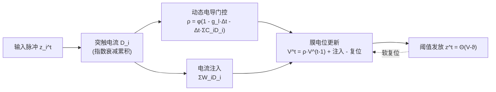

# A Brain-Inspired Gating Mechanism Unlocks Robust Computation in Spiking Neural Networks

**会议**: ICLR 2026  
**OpenReview**: [https://openreview.net/forum?id=5h741EyfQM](https://openreview.net/forum?id=5h741EyfQM)  
**代码**: 待确认  
**领域**: 脉冲神经网络 / 类脑计算  
**关键词**: 脉冲神经网络, 动态电导, 门控机制, 鲁棒性, LIF 神经元, 时序建模  

## 一句话总结
把生物神经元里"随活动变化的膜电导"重新引入 LIF 模型，构造出一个会自适应门控信息流的脉冲神经元 DGN，理论上证明它对噪声有更强的抑制能力，实验上在语音/神经形态时序任务上又准又抗噪。

## 研究背景与动机
**领域现状**：脉冲神经网络（SNN）号称生物启发、能耗低，但主流实现几乎都用最简化的 Leaky Integrate-and-Fire（LIF）神经元——固定漏电导 $g_l$、固定衰减率、线性突触叠加。这类被称为 "Gateless SNN" 的模型本质上没有任何内部门控机制来调节神经元动态。

**现有痛点**：生物学早已证明离子通道电导**不是静态的**——持续的神经活动会通过钙信号、基因表达（如 fos/ras）等机制动态调节钾、钙电导。而 LIF 把这套动态电导一笔抹掉，导致 SNN 在面对噪声、时序扰动时鲁棒性差，也无法表达生物神经元真正的动态优势。已有的改进（ALIF 自适应阈值、GLIF 静态通道门控、异质 LIF 可学习时间常数）要么是工程化堆参数、要么门控是静态的，都谈不上"生物上合理的动态门控"。

**核心矛盾**：一边是生物神经元靠动态电导实现的自然门控与鲁棒性，一边是 SNN 为了算得快而把这套机制丢掉了——领域里始终缺一个**既有生物依据、又能动态门控**的脉冲神经元模型。

**本文目标**：从功能视角重新审视动态电导，把它当成一种"调节信息流"的门控机制重新塞回 LIF，并从理论上证明它为什么更抗噪。

**核心 idea**：**动态电导即门控**——让膜电导随输入活动实时演化，从而自适应地决定"留住多少过去信息、衰减多少"，功能上等价于 LSTM 的遗忘门，但来源于生物神经物理而非人工设计。

## 方法详解

### 整体框架
DGN（Dynamic Gated Neuron）在 LIF 的基础上引入一条"动态电导通路"：膜电位的衰减率不再固定，而是由当前的突触活动 $D_i$ 实时调制，形成 $g_l + \sum_i C_i D_i$ 的门控项；同时保留传统的电流注入通路 $\sum_i W_i D_i$。这条双通路结构让单个神经元就具备了门控能力，无需引入复杂的网络架构。论文进一步在理论上用随机微分方程证明这种动态电导能压制噪声，并在结构上指出它与 LSTM 同源。

### 关键设计
**1. 动态电导门控：让衰减率随输入活动实时变化。** 传统 LIF 的膜电位衰减系数 $\rho_m = e^{-g_l \Delta t}$ 是个常数，信息按固定速率漏掉。DGN 把衰减系数改成依赖突触活动的动态量 $\rho^t = \phi(1 - g_l \cdot \Delta t - \Delta t \sum_i C_i D_i^t)$，其中 $D_i^t = e^{-\Delta t/\tau_s} D_i^{t-1} + z_i^t$ 是第 $i$ 个突触指数衰减累积的电流，$\phi$ 是 Sigmoid 之类的截断函数。直观地说，输入越强、$\sum C_i D_i$ 越大，有效电导越高，膜电位衰减越快——神经元因此能根据上下文动态地决定"该记住还是该忘掉"，这正是门控的本质。膜电位更新写成 $V^t = \rho^t V^{t-1} + \Delta t \sum_i W_i D_i^t - \vartheta z^{t-1}$，把动态门控、电流注入、软复位三件事统一在一个迭代式里。

**2. 与 LSTM 的同源对应：给"门控为何普适"一个生物解释。** 论文不满足于工程上有效，而是指出 DGN 与 LSTM 在结构上拓扑同构：自适应衰减系数 $\rho^t$ 对应 LSTM 的遗忘门 $f^t$（决定旧状态保留多少），动态突触电流累积对应输入门 $I^t$，脉冲软复位对应 cell state 更新。区别在于，LSTM 的门控是为解决 RNN 梯度消失而**人为设计**的，而 DGN 的门控源自生物神经元的动态电导行为（钙信号调制等）。这一对应把"门控是调节信息流的普适计算原理"从工程经验上升为跨人工/生物系统的统一视角，也为门控的功能起源给出了生物学说法。

**3. 随机稳定性理论：证明动态电导就是抗扰动机制。** 这是全文最硬核的部分。论文把输入扰动建模成叠加在确定信号上的高斯白噪声 $\hat{I}_i(t) = \mu_i + \sigma_i \xi(t)$，用线性噪声近似（$V = V_{steady} + \delta V$）把非线性电导动态线性化，再用伊藤积分求出稳态膜电位方差的闭式解。DGN 的方差为 $\langle V^2 \rangle_{DGN} = \frac{\sum_i \sigma_i (W_i - \frac{C_i \sum_j W_j \mu_j}{G_0})^2}{2 G_0}$，而 LIF 为 $\langle V^2 \rangle_{LIF} = \frac{(\sum_i W_i \sigma_i)^2}{2 g_l}$，其中 $G_0 = g_l + \sum C_i \mu_i$。对比两式可见两个协同的降噪机制：分母 $G_0$ 实现**输入依赖的漏电导缩放**（输入越强、有效电导越大、电压波动越被压制）；分子里的补偿项 $\frac{C_i \sum W_j \mu_j}{G_0}$ 提供**负反馈**，当 $W_i$ 与 $C_i$ 正相关时能抵消突触噪声传播。LIF 因为漏电导固定又没有补偿项，只能做静态的噪声缩放，无法适应输入统计。

**4. S-DGN 参数精简变体：证明收益来自机制而非堆参数。** 为了回应"是不是单纯多了参数才变好"的质疑，论文设计了 S-DGN——让连到同一神经元的所有突触共享一个平衡电位 $E$（而非每个突触各自独立），动态简化为 $\frac{dV}{dt} = -V(g_l + \sum_i C_i D_i) + E \sum_i C_i D_i$。这把可学习参数压到 LIF 水平，却仍保留动态电导这一核心机制，用来证明性能提升源于神经元设计本身的高效性。

## 实验关键数据

### 主实验表格（分类准确率 %，Rec=Y 为循环网络）

| 数据集 | 方法 | Rec | 隐层 | Acc(%) |
|---|---|---|---|---|
| TIDIGITS | LIF+BPTEI | N | 400-11 | 98.10 |
| TIDIGITS | **DGN(Ours)** | N | 100 | **98.59** |
| TIDIGITS | LSTM* | Y | 100 | 97.88 |
| TIDIGITS | **DGN(Ours)** | Y | 100 | **99.10** |
| SHD | TC-LIF | N | 128-128 | 83.08 |
| SHD | **DGN(Ours)** | N | 128 | **85.18** |
| SHD | **DGN(Ours)** | Y | 128-128 | **88.98** |
| SSC | TC-LIF | N | 128-128 | 63.46 |
| SSC | **DGN(Ours)** | N | 128-128 | **67.54** |
| SSC | LSTM | Y | 128-128 | 73.10 |
| SSC | **DGN(Ours)** | Y | 128-128 | **75.63** |

DGN 用更少的神经元和更简单的结构（单隐层 100 节点）就达到甚至超过 SOTA，TIDIGITS 上循环 DGN 达 99.10%，SSC 上双层循环 DGN 75.63% 还超过了 LSTM。

### 抗噪/对抗鲁棒性表格（TIDIGITS，准确率 %）

| 模型 | Clean | Additive | Mixed | FGSM | PGD | BIM |
|---|---|---|---|---|---|---|
| LIF (FF) | 97.02 | 46.83 | 44.20 | 39.53 | 15.39 | 15.95 |
| HeterLIF (FF) | 96.52 | 77.49 | 72.78 | 52.48 | 43.94 | 43.68 |
| **DGN (FF)** | **98.59** | **95.34** | **78.12** | **90.35** | **86.76** | **86.88** |
| LSTM (Rec) | 97.88 | 65.12 | 64.77 | 64.97 | 60.66 | 61.01 |
| **DGN (Rec)** | **99.10** | **94.84** | **93.86** | **89.40** | **87.52** | **87.68** |

所有模型都只在干净数据上训练、用未见过的噪声模式测试（更贴近真实场景）。前馈 DGN 在加性噪声下保持 95.34%，比 LIF 高出 48.51%；在 FGSM/PGD/BIM 等对抗攻击下，DGN 的退化幅度也远小于 LIF、ALIF、HeterLIF 乃至 LSTM。

### 消融实验表格（SHD，参数量 vs 鲁棒性）

| FF 模型 | 参数(K) | Clean Acc(%) | 总体鲁棒性(%) |
|---|---|---|---|
| LIF | 92.16 | 77.30 | 44.17 ± 9.96 |
| ALIF | 92.16 | 78.02 | 48.53 ± 6.24 |
| DLIF (250 step) | 92.66 | 79.96 | 49.93 ± 5.91 |
| **s-DGN (ours)** | 92.31 | **84.30** | **58.28 ± 2.33** |
| **DGN (ours)** | 184.32 | **85.18** | **61.54 ± 1.95** |

### 关键发现
- s-DGN 在与 LIF **几乎相同的参数量**（92.31K vs 92.16K）下，clean 准确率从 77.30% 提到 84.30%，鲁棒性从 44.17% 提到 58.28%，且方差更小（±2.33 vs ±9.96）——证明收益来自动态门控机制本身，不是堆参数。
- 门控架构普遍更鲁棒：SHD 的 PGD 攻击下，LSTM 比 vanilla RNN 高 20.08%，循环 DGN 比循环 LIF 高 35.54%，侧面印证"门控带来鲁棒性"的论点。

## 亮点与洞察
- **把工程经验回填进生物原理**：不是又发明一个门控，而是论证 LSTM 那套门控其实生物神经元早就用动态电导实现了，给"门控为何普适"提供了神经科学解释，思想上很优雅。
- **理论扎实**：用随机微分方程 + 伊藤积分给出 DGN 和 LIF 稳态方差的闭式对比，把"为什么抗噪"讲清楚了——自适应漏电导缩放 + 突触噪声负反馈补偿两个机制，而不是仅靠实验堆数字。
- **单神经元承载门控**：把门控能力放进神经元而非网络结构，用更少参数、更简单架构达到 SOTA，对神经形态硬件部署友好。
- **鲁棒性评测设定严谨**：只在干净数据训练、用未见噪声测试，避免了"训练时见过噪声→记住噪声模式"的虚高评估。

## 局限与展望
- **任务范围偏窄**：实验集中在语音/神经形态时序分类（TIDIGITS、SHD、SSC、Ti46），未验证视觉、大规模或更长时序任务，泛化性待考。
- **理论近似的前提较强**：稳定性分析依赖小扰动线性化与高斯白噪声假设，真实对抗扰动（FGSM/PGD）并不满足这些条件，理论与对抗实验之间存在一定解释 gap。
- **截断函数与超参敏感性未充分讨论**：$\phi$（Sigmoid 截断）、$C_i$、$\tau_s$ 等的选择对动态门控的影响缺少系统分析。
- **计算开销**：动态电导每步都要重算 $\sum C_i D_i$，相比固定 $\rho$ 的 LIF 有额外开销，论文未给出能耗/延迟的量化对比，这对标榜"低能耗"的 SNN 略显遗憾。

## 相关工作与启发
- **参数化脉冲神经元**：ALIF（活动依赖阈值）、GLIF（静态通道门控）、异质 LIF（可学习时间常数）、FS-neuron（全参数可训）、HetSyn（把时序积分搬到突触电流）。DGN 的区别是门控来自生物动态电导而非纯工程参数化。
- **SNN 鲁棒性**：结构建模（调阈值/时间窗）、训练策略（对抗训练、Lipschitz 正则）、生物启发（随机门控、频率编码注意力）。DGN 属于生物启发一路，但额外给出了理论保证。
- **启发**：这条"用生物机制解释/替代工程模块"的路线值得迁移——比如能否从神经科学角度重新解读 attention、normalization；动态电导的负反馈降噪思想也可能启发对抗鲁棒性的网络设计。

## 评分
- **新颖性**: ⭐⭐⭐⭐ — 把动态电导重构为门控机制并与 LSTM 建立同源对应，视角新颖且有思想深度；不过动态电导本身在计算神经科学里并非全新概念。
- **实验充分度**: ⭐⭐⭐⭐ — 4 个数据集 + 6 种噪声/攻击 + 参数对齐消融，鲁棒性评测设定严谨；但任务局限于语音时序，缺视觉/大规模验证与能耗对比。
- **写作质量**: ⭐⭐⭐⭐ — 动机—机制—理论—实验逻辑清晰，理论推导完整；公式较密集，部分推导放在附录。
- **价值**: ⭐⭐⭐⭐ — 为鲁棒、生物合理的 SNN 提供了既有理论又有实证的门控范式，对神经形态计算与类脑研究有实际推动意义。

<!-- RELATED:START -->

## 相关论文

- [\[ICLR 2026\] Breaking Gradient Temporal Collinearity for Robust Spiking Neural Networks](breaking_gradient_temporal_collinearity_for_robust_spiking_neural_networks.md)
- [\[ICLR 2026\] Fractional-Order Spiking Neural Network](fractional-order_spiking_neural_network.md)
- [\[ICLR 2026\] Online Pseudo-Zeroth-Order Training of Neuromorphic Spiking Neural Networks](online_pseudo-zeroth-order_training_of_neuromorphic_spiking_neural_networks.md)
- [\[ICLR 2026\] Beyond Linear Processing: Dendritic Bilinear Integration in Spiking Neural Networks](beyond_linear_processing_dendritic_bilinear_integration_in_spiking_neural_networ.md)
- [\[ICLR 2026\] On the Lipschitz Continuity of Set Aggregation Functions and Neural Networks for Sets](on_the_lipschitz_continuity_of_set_aggregation_functions_and_neural_networks_for.md)

<!-- RELATED:END -->
