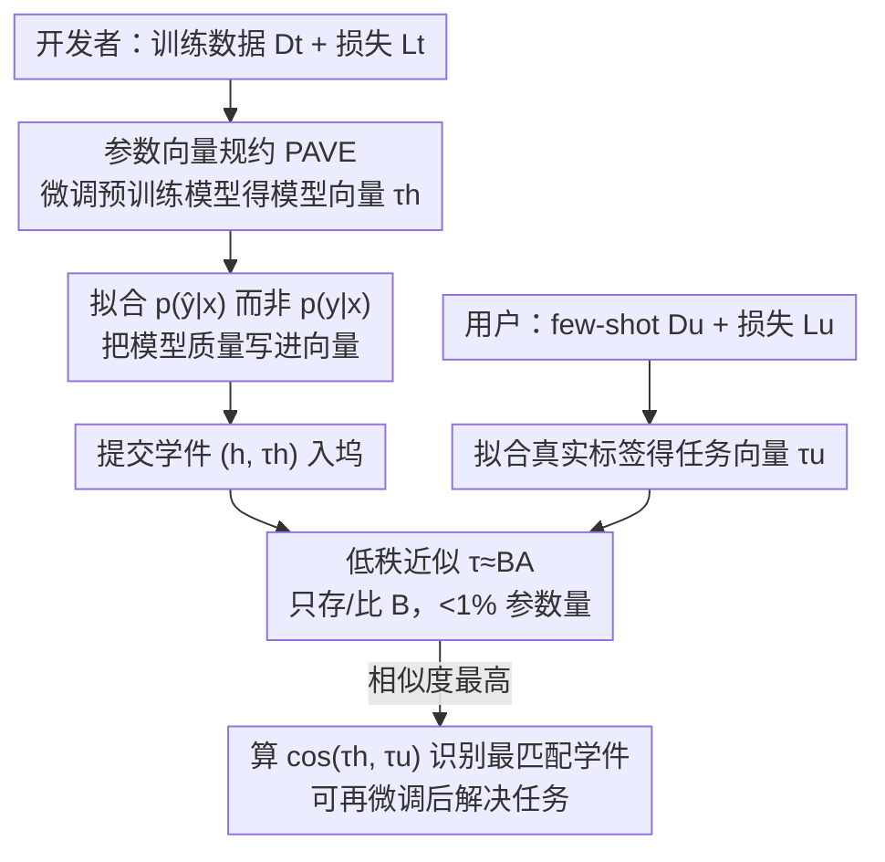

# A Study on PAVE Specification for Learnware

**会议**: ICLR 2026  
**OpenReview**: [https://openreview.net/forum?id=JkKkquv5lw](https://openreview.net/forum?id=JkKkquv5lw)  
**代码**: 待确认  
**领域**: 学件 / 模型选择  
**关键词**: 学件, 参数向量规约, 模型识别, 神经正切核, 低秩近似

## 一句话总结
针对"学件 = 模型 + 规约"范式中如何在不接触训练数据的前提下从海量模型里挑出对用户任务有用的模型，本文系统研究了参数向量规约（PAVE）——用微调引起的参数变化同时编码模型能力与任务需求，证明它与经典 RKME 规约在 NTK 视角下同源，并用 LoRA 式低秩近似把存储/计算压到原模型参数的 1% 以下，识别出的学件在小样本场景甚至能超过用户自己微调的预训练模型。

## 研究背景与动机
**领域现状**：学件（Learnware）范式设想一个"学件坞系统"（Learnware Dock System, LDS），开发者把训练好的模型连同一份**规约**（specification）一起提交，规约在不泄露训练数据的前提下粗略刻画模型能力；未来用户只需提交自己的任务规约，系统就能匹配出有用的模型供复用，从而免去从零训练，也免去对每个模型做昂贵的逐一评测。

**现有痛点**：早期规约方法（RKME，约简核均值嵌入）在表格数据上很成功——它用一个显式核生成保护隐私的约简数据集来刻画"模型擅长的数据分布"。但面对图像、文本这类高维非结构化数据，经典通用核所需的样本复杂度高得不可承受。

**核心矛盾**：开放真实场景里，识别有用学件难在两点。其一，**任务语义五花八门**，输出 $y$ 的含义各不相同、难以统一编码——同一张人脸数据集训出的模型可能做年龄预测、也可能做情绪分类，要判断哪个更适合"发色识别"几乎无从下手。其二，**模型质量没有保证**，仓库里混着训练不充分的低质模型，而出于任务多样性和隐私顾虑，又不可能用统一测试集逐一评估质量。

**本文目标**：找到一种规约，既能跨越异构任务语义做模型—任务对齐，又能内在地把"模型质量"也编码进去，同时计算/存储要可负担。

**切入角度**：作者观察到，用任务自定义损失去微调一个共享预训练模型，**参数的变化量**（即参数向量 Parameter Vector）天然把 $p(\hat y|x)$ 的信息"只能且全部"写进了这组增量里——因为微调过程中关于条件分布的信息最终只体现为参数的偏移。于是模型与任务可以被统一地表示成同一空间里的向量。

**核心 idea**：把"模型能力"和"用户任务需求"都规约成参数向量（PAVE），用两者的**余弦相似度**衡量匹配度来识别学件；再从 NTK 视角证明它与 RKME 同源，并用低秩近似让它在大规模仓库上跑得动。

## 方法详解

### 整体框架
整套流程围绕"把模型和任务都投影到同一个参数向量空间，再比相似度"展开，分三步（对应原文 Figure 1）：开发者侧把模型微调出的参数增量作为**模型向量** $\tau_h$ 随模型一起提交为学件；用户侧用少量样本把任务微调出**任务向量** $\tau_u$；系统在参数向量空间里算 $\cos(\tau_h,\tau_u)$，相似度最高者即被识别为最匹配的学件，必要时再在用户少量数据上微调一下去解决任务。关键在于，开发者侧的模型向量拟合的是模型自己的预测 $p(\hat y|x)$（从而把模型质量也写进向量），用户侧的任务向量拟合的是真实标签 $p(y|x)$（表达"我需要的能力"）；而当模型参数动辄上亿时，直接构造/比较参数向量不现实，于是再叠一层 LoRA 式低秩近似把开销压下来。

### 关键设计

**1. 参数向量规约 PAVE：用微调的参数增量统一刻画模型与任务**

痛点是异构任务的输出 $y$ 语义各异、无法直接对齐比较。PAVE 的做法是不去碰输出空间，而是把"模型能力"和"任务需求"都映射成同一个东西——微调一个共享预训练模型 $f$ 时产生的参数偏移量。对训练任务 $(L_t, D_t)$ 上的模型 $h$，其模型向量由下式构造：

$$\tau_h = \arg\min_{\tau} \sum_{(x,y)\in D_t} L_t\big(g_t \circ f(x, \theta_0 + \tau),\, h(x)\big)$$

其中 $g$ 是把特征空间 $Z$ 桥接到输出空间 $Y$ 的映射（常用 Prompt-Tuning 免训练得到）。任务向量 $\tau_u$ 用同样的式子，只是把目标从模型预测 $h(x)$ 换成真实标签 $y$。识别时直接比余弦相似度 $\cos(\tau_h,\tau_u)=\mathrm{Similarity}(p(h(x)|x), p_u(y|x))$，相似度最高者即被选中。这样一来，无论原任务输出空间结构多么不同，模型与任务都被拉到统一的参数增量空间里可比，绕开了"输出语义无法对齐"的死结。

**2. 拟合 $p(\hat y|x)$ 而非 $p(y|x)$：让规约内在地编码模型质量**

仅靠"数据分布匹配"无法剔除低质模型——这是 RKME 类方法的盲区。本文的关键选择是：模型向量拟合的是**模型自己的预测** $p(\hat y|x)$，而不是训练数据的真实分布 $p(y|x)$。这一步把"模型质量"自动注入了向量：如果一个模型训得很差，它的能力 $p(\hat y|x)$ 就会显著偏离真实任务语义 $p(y|x)$；于是即便它的训练集恰好匹配用户任务（$p(y|x)=p_u(y|x)$），它的模型向量也会和用户任务向量对不上，从而不会被识别出来。消融实验（PAVE♣ 拟合 $p(y|x)$）证实，一旦改回拟合数据分布，在混入腐坏模型的仓库上性能大幅下滑——说明"拟合模型预测"正是过滤低质学件的关键。

**3. PAVE 与 RKME 的理论统一：NTK 视角下参数向量即核均值嵌入**

为说明 PAVE 不是凭空的工程技巧，作者从神经正切核（NTK）视角建立了它与经典 RKME 的等价性。在 NTK 区域里，微调时梯度函数近似固定，参数更新可写成梯度的累加：

$$\nabla_\tau L_t(y'_i,\hat y_i) = \nabla_{y'_i}L_t\,\nabla_z g_t\,\nabla_\theta f(x_i,\theta_0) \in \mathbb{R}^{|\theta|}$$

由此两个参数向量的内积对应到样本空间上的一个隐式核 $\tilde k_{f,L,g}$，它由经验 NTK $\tilde K_f$ 和一个由损失/映射诱导的"一致性权重矩阵" $\tilde K_{L,g}$ 逐元素相乘构成——后者鼓励"与解任务相关性相同"的特征对相似、惩罚其余。于是归一化后的参数向量 $\tau=\frac1Z\sum_i \tilde k_{f,L,g}(z_i,\cdot)$ 恰是一个经验核均值嵌入（KME）。最终的 Theorem 3 给出：在 NTK 区域下，PAVE 相似度与 RKME 所用的最大均值差异（MMD）**序一致**——即两者对"哪个模型更匹配"给出相同偏好排序。这把一个看似全新的参数空间度量，接回了学件范式既有的分布匹配理论。

**4. 低秩近似 + 只用 $B$ 算相似度：把开销压到 1% 以下**

现代预训练模型动辄上亿参数，直接构造和比较参数向量不现实。本文以 LoRA 方式把参数向量近似为低秩形式：

$$\tau \approx \tilde\tau \triangleq [\,(B_1A_1)\ (B_2A_2)\ \dots\ (B_LA_L)\,] \triangleq BA$$

其中 $A$ 随机初始化（实际取满足 Kaiming 初始化的均匀分布 $A\sim U(-\sqrt{3s/n},+\sqrt{3s/n})$）、$B$ 零初始化。但若把 $BA$ 展开成全尺寸再算余弦相似度，开销和不近似时一样。作者更进一步证明：因为 $\mathbb{E}[A_l A_l^\top]=sI$，所以 $\mathbb{E}[\langle\tilde\tau_1,\tilde\tau_2\rangle]=s\langle B_1,B_2\rangle$，进而 $\cos(\tilde\tau_1,\tilde\tau_2)\approx\cos(B_1,B_2)$。也就是说，**只需存储和比较低秩的 $B$**（共享的随机 $A$ 不必逐模型保存），就能高概率保持原始相似度排序，规约尺寸降到预训练模型参数的 1% 以下（常常不到 100 万）。Theorem 4 给出了这一近似的误差界。

## 实验关键数据

数据集覆盖 15 个经典 NLP 数据集（主要来自 GLUE）、12 个 CV 数据集（含 EuroSAT 卫星图、GTSRB 交通标志、SUN397 场景识别等异构语义）以及 9 个医学 LLM benchmark。对比对象包括用户自己微调的预训练模型（BERT-B/L、RoBERTa-B/L、ResNet-152、ViT-B-32/L-14、CLIP）、上一代 RKME 规约，以及 Random（随机识别，代表平均能力）和 Oracle（事后最优，代表上限）两个基线。每个数据集都构造了**优质版**和**腐坏版**（低质模型）两套学件。

### 主实验：超越原始功能（NLP，Table 1）

把候选集中所有"训练过对应数据集"的学件移除，强迫系统用"非本职"的学件解决任务，PAVE♦ 表示识别后再微调的结果。

| 方法 | 平均分(↑) | 平均排名(↓) |
|------|-----------|-------------|
| BERT-B | 0.572 | 6.389 |
| RoBERTa-B | 0.682 | 3.333 |
| RoBERTa-L | 0.699 | 2.444 |
| Random | 0.668 | 4.056 |
| RKME | 0.659 | 3.389 |
| **PAVE♦** | **0.709** | **2.111** |
| Oracle（上限） | 0.739 | — |

PAVE♦ 平均分 0.709、平均排名 2.111，均优于所有微调基线和 RKME；相对 RKME 平均提升 **7.59%**。在对齐实验中，PAVE 在 18 个用户任务里有 14 个与 Oracle 持平（识别到了最优学件）。

### 消融实验：模型质量过滤（CV + 腐坏学件，Table 2）

| 方法 | 平均分(↑) | 平均排名(↓) |
|------|-----------|-------------|
| ViT-L-14（微调） | 0.733 | 2.167 |
| Random | 0.580 | 4.750 |
| PAVE♣（拟合 p(y\|x)） | 0.745 | 2.583 |
| **PAVE（拟合 p(ŷ\|x)）** | **0.887** | **1.500** |
| Oracle（上限） | 0.894 | — |

在 EuroSAT/GTSRB/MNIST/SVHN 等任务上，PAVE 几乎贴着 Oracle（0.991/0.987/0.997/0.970），而拟合数据分布的 PAVE♣ 明显落后（如 GTSRB 0.656 vs 0.987）——直接验证了"拟合模型预测 $p(\hat y|x)$"对剔除腐坏模型的必要性。

### 关键发现
- **拟合 $p(\hat y|x)$ 是质量过滤的命门**：去掉这一设计（PAVE♣）后在腐坏仓库上平均分从 0.887 跌到 0.745，掉点最严重的设计就是它。
- **学件集合 > 单一预训练模型**：识别出的学件经微调后能超过用户直接微调 RoBERTa-L，作者归因于"学件候选集作为整体覆盖了比单个预训练模型更广的能力范围"。
- **低秩近似几乎无损**：Figure 3 的相似度热图显示，全参数微调的精确相似度、低秩展开 $BA$、只用 $B$ 三者的相对关系高度一致，存储/计算大幅下降而性能基本不变。
- 附加的分层线性回归与精确多项检验进一步统计验证了"相似度—性能"显著正相关、PAVE 识别有用学件具统计显著性。

## 亮点与洞察
- **把"模型选择"问题转译成"参数增量空间里的向量比相似度"**：绕开异构输出空间无法对齐的死结，是最巧妙的一步——只要共享同一个预训练底座，再异构的任务都能被拉到同一空间可比。
- **质量信号"免费"内嵌**：仅靠"拟合模型自己的预测而非真实标签"这一个选择，就让规约自动具备了过滤低质模型的能力，无需任何额外的质量评估模块或测试集，这在隐私受限的真实场景里极其实用。
- **理论不是装饰**：NTK→核均值嵌入→与 RKME 序一致的推导，把一个新工程方法接回了学件范式的既有理论谱系，也解释了"为什么参数向量相似度能代表能力匹配"。
- **可迁移思路**："用 $\mathbb{E}[AA^\top]=sI$ 把低秩积的相似度退化为只比 $B$"这一招，对任何需要在 LoRA/低秩空间里做大规模相似度检索的场景（模型检索、任务向量去重、merge 前的冲突筛查）都可复用。

## 局限与展望
- **强依赖 NTK 假设**：理论结论（与 RKME 序一致、低秩近似无损）都建立在微调处于 NTK 区域、梯度函数近似固定的前提上；真实大模型的微调往往偏离线性化动力学，假设的稳健性边界没有充分刻画。
- **需要共享预训练底座**：模型向量和任务向量都靠微调"同一个" $f$ 得到，对接入异构底座（不同架构、不同预训练模型）的学件如何统一规约，本文未展开。
- **医学 LLM 场景退而求其次**：因为破坏性微调会触发输出退化（自我重复），医学 LLM 实验只用了高质量模型、且直接拟合训练数据来构造模型向量——说明"拟合模型预测"的质量过滤机制在生成式 LLM 上还不能直接照搬。
- 作者也指出资源受限场景下"高效生成规约"仍是未来方向。可改进点：探索非 NTK 区域的近似误差刻画，以及跨底座的参数向量对齐。

## 相关工作与启发
- **vs RKME（约简核均值嵌入）**：RKME 匹配的是"数据分布" $p(y|x)$，在高维非结构化数据上样本复杂度爆炸，且无法感知模型质量；PAVE 匹配"模型能力" $p(\hat y|x)$ 的参数增量，既省样本又内嵌质量信号，本文还证明二者在 NTK 下序一致——PAVE 是 RKME 的"参数空间升级版"。
- **vs 可迁移性度量（LEEP / LogME / TransRate / Model Spider 等）**：这些方法估计预训练模型到目标任务的可迁移性，但普遍需要直接访问用户数据、且逐模型前向评测开销大；PAVE 在学件范式下靠规约比对完成，既保护隐私又免去逐模型评测。
- **vs 任务向量 / 模型合并（Task Arithmetic、TIES 等）**：同样利用"参数变化量"，但那条线的目标是把多个模型的能力**合并**成多任务模型；本文方向相反——不合并，而是用参数向量相似度从仓库里**识别**最适合某个用户任务的单个模型。

## 评分
- 新颖性: ⭐⭐⭐⭐ 把参数向量相似度系统化为学件规约，并理论统一到 RKME，是扎实的范式内创新而非颠覆性新概念
- 实验充分度: ⭐⭐⭐⭐ 跨 NLP/CV/医学 LLM、含腐坏仓库与"超越原功能"设定，主实验+消融完整，但理论强依赖 NTK 假设的实证检验偏弱
- 写作质量: ⭐⭐⭐⭐ 动机—方法—理论—实验链条清晰，图示直观
- 价值: ⭐⭐⭐⭐ 为隐私保护的模型市场/学件坞提供了可落地且省算力的识别方案，识别结果在小样本下能超用户自微调，实用价值高

<!-- RELATED:START -->

## 相关论文

- [\[ICML 2026\] Functional Equivalence in Attention: A Comprehensive Study with Applications to Linear Mode Connectivity](../../ICML2026/others/functional_equivalence_in_attention_a_comprehensive_study_with_applications_to_l.md)
- [\[ACL 2025\] Anything Goes? A Crosslinguistic Study of (Im)possible Language Learning in LMs](../../ACL2025/others/anything_goes_a_crosslinguistic_study_of_impossible_language_learning_in_lms.md)
- [\[ACL 2025\] What Matters in Evaluating Book-Length Stories? A Systematic Study of Long Story Evaluation](../../ACL2025/others/what_matters_in_evaluating_book-length_stories_a_systematic_study_of_long_story_.md)
- [\[ACL 2025\] Understanding Common Ground Misalignment in Goal-Oriented Dialog: A Case-Study with Ubuntu Chat Logs](../../ACL2025/others/understanding_common_ground_misalignment_in_goal-oriented_dialog_a_case-study_wi.md)
- [\[ICLR 2026\] Noisy-Pair Robust Representation Alignment for Positive-Unlabeled Learning](noisy-pair_robust_representation_alignment_for_positive-unlabeled_learning.md)

<!-- RELATED:END -->
