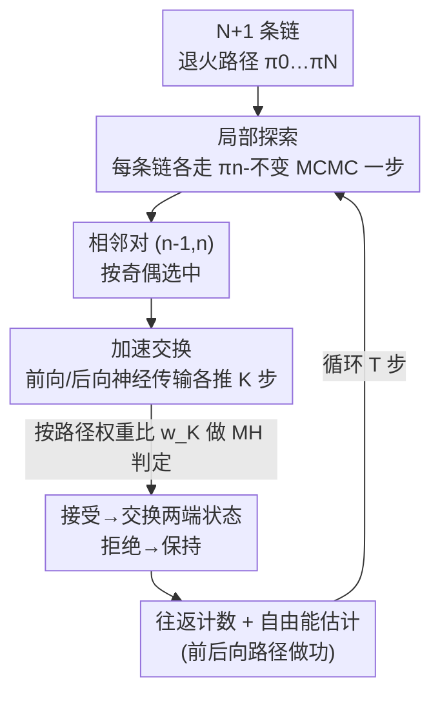

# Accelerated Parallel Tempering via Neural Transports

**会议**: ICLR2026  
**OpenReview**: [https://openreview.net/forum?id=CODnlyYUli](https://openreview.net/forum?id=CODnlyYUli)  
**代码**: 待确认  
**领域**: 采样 / MCMC / 概率方法  
**关键词**: 并行回火, 神经传输, MCMC 采样, 自由能估计, 多模态采样

## 一句话总结
把并行回火（Parallel Tempering, PT）里那个"直接对换两条链当前状态"的死板交换动作，换成"先用神经传输（归一化流 / 受控扩散 / 扩散模型）把两个状态各自往中间推几步、再做 Metropolis 接受判定"，从而在相邻退火分布几乎不重叠时也能高概率交换，在保持 MCMC 渐近无偏的前提下大幅提升参考分布到目标分布的往返次数（round trip），并顺带得到低方差的自由能估计。

## 研究背景与动机
**领域现状**：从非归一化分布 $\pi(x)=\exp(-U(x))/Z$ 采样是统计与科学计算的基本任务。MCMC 用局部移动构造遍历链，理论上渐近收敛，但目标一旦是高维、多峰、模式之间被高能垒隔开，局部移动就困在单个模式里出不来。并行回火（PT）是应对多峰的经典方案：它在参考分布 $\pi_0=\eta$（如标准高斯）和目标 $\pi_N=\pi$ 之间排一条退火路径 $\pi_0,\dots,\pi_N$（常用几何路径 $\pi_\beta\propto\eta^{1-\beta}\pi^{\beta}$），并行跑 $N{+}1$ 条链，靠"相邻链交换状态"把参考端容易混合的样本一路传到目标端。

**现有痛点**：PT 的交换动作只看相邻两个分布的似然比，接受率为 $\alpha_n=\min\{1,\,w_n(x')/w_n(x)\}$，其中增量权重 $w_n(x)=\tilde\pi_n(x)/\tilde\pi_{n-1}(x)$。当相邻分布 $\pi_{n-1}$ 与 $\pi_n$ **重叠很小**时（困难问题里很常见），这个比值剧烈波动、接受率塌到接近 0，交换几乎不发生，参考到目标的"往返"被卡死。要补救只能加链数 $N$ 来让相邻分布靠得更近，但 $N$ 受算力限制不能无限加。

**核心矛盾**：PT 的瓶颈在于**交换机制本身太僵硬**——它只允许"原样对换"，而原样对换的成功率被相邻分布的重叠度死死锁住。另一条路线"神经采样器"（归一化流、扩散模型把高斯一步映到目标）虽然灵活，却普遍**有偏、丢失 MCMC 的理论保证、且容易模式塌缩**，被作者引用的工作证明连标准 PT 都打不过。于是问题变成：能不能既要 PT 的渐近一致性、又要神经采样器的灵活性？

**切入角度**：作者注意到物理里 Ballard & Jarzynski（2009/2012）的"带非平衡切换的副本交换"思想——交换前先让两个状态沿一条非平衡路径各走一段，用做功（work）来做接受判定。把它形式化、并接上现代神经传输，就得到 **Accelerated Parallel Tempering（APT）**。

**核心 idea**：用"神经传输驱动的加速交换"替换 PT 的直接交换——交换前让两端状态分别沿前向/后向传输被推到对方附近，使两条路径的分布尽量重合，从而把接受率从"取决于 $\pi_{n-1},\pi_n$ 的重叠"解放成"取决于前向/后向路径测度的重合度"，而后者可以通过训练逼近到接近 1；且这些神经传输是**逐对相邻链并行**调用的，绕开了神经采样器昂贵的串行代价。

## 方法详解

### 整体框架
APT 复用 PT 的两阶段循环——**局部探索**（每条链各自用 $\pi_n$-不变的 MCMC 核 $K_n$ 走一步）和**非可逆通信**（按奇偶 $n\equiv t \bmod 2$ 只在匹配步提交相邻交换）——唯一改动是把"通信阶段的交换动作"换成**加速交换**。

直接交换之所以失败，是因为它要求 $\pi_{n-1}$ 的样本"原封不动"被 $\pi_n$ 接受。APT 的做法是：在判定前，先给两端状态各搭一座"桥"。对第 $n$ 个交换，取局部探索后的 $X^{n-1}_t$ 和 $X^{n}_t$，分别用一族**前向加速器** $P^{n-1}_k$ 把 $X^{n-1}_t$ 往前推 $K$ 步、用**后向加速器** $Q^{n}_{k}$ 把 $X^{n}_t$ 往后推 $K$ 步，得到两条长度 $K$ 的路径 $\overrightarrow{X}^{n-1}_{t,0:K}$ 与 $\overleftarrow{X}^{n}_{t,0:K}$。然后用两条路径的**路径权重比**做一次 Metropolis 判定（接受就把两端状态替换成对方路径的终点）。当 $K=0$ 时加速交换退化为原始 PT 交换；当前向路径测度 $\mathsf P^{n-1}_K$ 与后向路径测度 $\mathsf Q^{n}_K$ 完全重合时，即便 $\pi_{n-1}\neq\pi_n$ 接受率也能达到 1。整套流程仍由一条遍历、$\boldsymbol\pi$-不变的马尔可夫链实现（Theorem 1），所以渐近一致性原样保住。

### 关键设计

**1. 加速交换：用前向/后向神经传输把"重叠"做大，再判接受**

PT 的死结是接受率被相邻分布重叠度锁死。加速交换的破法是：不再比较 $\pi_{n-1}$ 与 $\pi_n$ 本身，而是比较"$\pi_{n-1}$ 前向演化出的路径测度 $\mathsf P^{n-1}_K$"和"$\pi_n$ 后向演化出的路径测度 $\mathsf Q^{n}_K$"。两者定义为

$$\mathsf P^{n-1}_K(dx_{0:K})=\pi_{n-1}(dx_0)\prod_{k=1}^{K}P^{n-1}_k(x_{k-1},dx_k),\quad \mathsf Q^{n}_K(dx_{0:K})=\pi_{n}(dx_K)\prod_{k=1}^{K}Q^{n}_{k-1}(x_k,dx_{k-1}).$$

路径增量权重 $w^n_K(x_{0:K})=\frac{Z_n}{Z_{n-1}}\frac{d\mathsf Q^n_K}{d\mathsf P^{n-1}_K}(x_{0:K})$ 推广了原来的标量权重 $w_n$，接受概率取 $\min\{1, w^n_K(x'_{0:K})/w^n_K(x_{0:K})\}$。关键洞察由 Theorem 1 给出：**该交换在平稳态的拒绝概率恰等于两条路径测度的总变差距离** $r(\mathsf P^{n-1}_K,\mathsf Q^n_K)=\|\mathsf P^{n-1}_K\otimes\mathsf Q^n_K-\mathsf Q^n_K\otimes\mathsf P^{n-1}_K\|_{TV}$，并被对称 KL 上界控制（Pinsker 不等式）：

$$r(\mathsf P^{n-1}_K,\mathsf Q^n_K)^2\le \tfrac12\mathsf P^{n-1}_K[-\log w^n_K]+\tfrac12\mathsf Q^n_K[\log w^n_K]=:\mathrm{SKL}(\mathsf P^{n-1}_K,\mathsf Q^n_K).$$

这把"提升交换成功率"翻译成了一个**可训练的目标**：只要把前向、后向加速器训得让两条路径分布尽量重合（SKL→0），拒绝率就趋于 0，而这与 $\pi_{n-1},\pi_n$ 原本是否重叠**无关**——重叠度被神经传输人为"撑大"了。

**2. 逐对并行的神经传输：绕开神经采样器的串行代价、保住一致性**

神经采样器单独用之所以贵又有偏，是因为它要从参考一口气串行积分到目标、且没有 Metropolis 校正。APT 把神经传输切成"每对相邻链各管一小段"：第 $n$ 个加速器只负责在 $\pi_{n-1}$ 与 $\pi_n$ 之间架桥，所有 $N$ 对桥在通信阶段**并行**执行。由于 PT 本身就靠并行抵消 $N$ 条链的开销，APT 只是在每对链上再叠 $K$ 步传输，最大并行化下其等效计算成本约等于"$K$ 步积分"而非"整条退火路径积分"。更关键的是，无论神经传输训得好坏，最外层那次基于路径权重的 Metropolis 判定都保证链对 $\boldsymbol\pi$ 不变——传输差只会让接受率低、往返慢，**绝不引入偏差**，这正是 APT 相对纯神经采样器的本质优势。

**3. 三种神经传输实例化：NF / CMCD / 扩散，覆盖确定性与随机桥**

加速器的设计空间很大，论文在 $\mathcal X=\mathbb R^d$ 上给了三种现成实现。**NF-APT**（$K=1$）用一个可逆映射 $T^n$ 当确定性传输，前向是 $\delta_{T^n(x_0)}$、后向是 $\delta_{(T^n)^{-1}(x_1)}$，权重含雅可比行列式 $w^n_1=\frac{\tilde\pi_n(x_1)}{\tilde\pi_{n-1}(x_0)}|\det J_{T^n}(x_0)|$；它和 SMC 里的退火流传输同源，但因为 APT 同时拿得到 $\pi_{n-1},\pi_n$ 两侧样本，可用**对称 KL** 训练，从而缓解了那些工作常见的模式丢弃。**CMCD-APT** 用受控蒙特卡洛扩散：前/后向核是带学习漂移 $b^n_s$、扩散系数 $\sigma^n_s$ 和插值势 $U^n_s=(1-\phi^n_s)\log\tilde\pi_{n-1}+\phi^n_s\log\tilde\pi_n$ 的高斯转移，离散成 $K$ 步随机桥。**Diff-APT** 借方差保持（VP）扩散：用能量模型 $\pi^\theta_s$ 满足边界 $\pi^\theta_0=\mathcal N(0,I),\pi^\theta_1=\pi$，前向加速器取时间反演 SDE 的 $K$ 步积分、后向取前向 SDE，并用从 Diff-APT 自身采到的近似目标样本迭代地做分数匹配训练。三者把"确定性映射 vs 随机桥""一步 vs 多步"都覆盖了，$K$ 越大随机桥越细、重叠越好。

**4. 往返率—全局壁垒理论与自由能估计：既给调参依据，又白送一个估计量**

APT 不只是个 trick，它配了一套可指导实践的理论。在"高效局部探索"假设下，往返率 $\tau=\lim_{T\to\infty}\mathbb E[R_T]/T$（每步发生一次参考↔目标往返的期望比例）可写成所有相邻拒绝率的函数 $\tau=\big(2+2\sum_n \frac{r_n}{1-r_n}\big)^{-1}$（Proposition 2）。固定 $N$ 增大 $K$ 时，若加速器来自某 SDE 的离散，则 $r(\mathsf P^{n-1}_K,\mathsf Q^n_K)\le r(\mathsf P^{n-1}_\infty,\mathsf Q^n_\infty)+O(1/\sqrt K)$，而设计良好时 $r_\infty\approx 0\ll r(\pi_{n-1},\pi_n)$——所以**加 $K$ 能在困难问题上把拒绝率压到几乎为零**。增大 $N$ 时（Theorem 2），往返率被**全局壁垒** $\Lambda_K=\int_0^1\frac12\mathbb E|\dot w^\beta_K(\overleftarrow X)-\dot w^\beta_K(\overrightarrow X)|\,d\beta$ 控制，$\bar\tau_K=(2+2\Lambda_K)^{-1}$，而 $\Lambda_K$ 随 $K$ 减小——这意味着 APT 能用比 PT 更小的"问题难度不变量"。$\Lambda_K$ 可由经验拒绝率估出，从而**直接复用 PT 的退火 schedule 自动调参算法**。此外，前/后向路径的做功 $\overrightarrow w^n_{K,t},\overleftarrow w^n_{K,t}$ 顺手给出对 $Z$ 的前/后向一致估计，取几何平均得 $\hat Z_T=(\overrightarrow Z_T\overleftarrow Z_T)^{1/2}$；它把经典自由能微扰（FEP, $K=0$）、目标 FEP（确定性流）、Jarzynski 等式（随机桥）统一起来，还能套 Bennett 接受比进一步降方差。

### 一个完整示例
设想第 $n$ 对相邻链，$\pi_{n-1}$ 是较"热"的中间分布、$\pi_n$ 稍"冷"，两者峰位略错开、直接交换接受率只有约 1%。局部探索后取出当前状态 $X^{n-1}_t$（落在热分布的某个峰）和 $X^n_t$（落在冷分布的另一峰）。以 CMCD-APT、$K=2$ 为例：前向加速器把 $X^{n-1}_t$ 沿学习到的漂移走两步 $\overrightarrow X_{0}\to\overrightarrow X_1\to\overrightarrow X_2$，让它漂向冷分布的高概率区；后向加速器把 $X^n_t$ 倒着走两步 $\overleftarrow X_2\to\overleftarrow X_1\to\overleftarrow X_0$，漂向热分布。算两条路径的做功 $\overrightarrow w_K,\overleftarrow w_K$，抽 $U\sim\mathrm{Uniform}[0,1]$，若 $\log U<\log\overrightarrow w_K-\log\overleftarrow w_K$ 就接受，把两端替换成 $\overleftarrow X_0,\overrightarrow X_2$。因为两条路径终点已经被推到彼此分布的高概率区，做功比不再剧烈波动，接受率从 1% 跃到接近 1——一次本来几乎不可能的跨峰交换就此发生，参考端的多样性得以继续往目标端传。

### 损失函数 / 训练策略
三种实例化统一以**对称 KL**为训练目标：$\mathcal L=\sum_{n=1}^{N}\mathrm{SKL}(\mathsf P^{n-1}_K,\mathsf Q^n_K)$，即直接最小化 Theorem 1 里控制拒绝率的那个上界。NF-APT 学可逆映射 $T^n$；CMCD-APT 同时学漂移 $b^n_s$、插值时间表 $\phi^n_s$ 与扩散系数 $\sigma^n_s$（作者发现把 $\sigma^n_s$ 也设为可学能显著稳住训练）；Diff-APT 因初始没有目标样本，采用"边采样边训"的迭代分数匹配——用当前 Diff-APT 采到的近似目标样本去训练能量模型 $\pi^\theta_s$。退火 schedule $\{\beta_n\}$ 用从 Theorem 2 继承的 PT 自动调参法优化。

## 实验关键数据

### 主实验
在 10 维、40 峰高斯混合（GMM-10）、标准高斯参考、$T=100{,}000$ 步上对比 PT 与三种 APT（往返数 R↑、计算归一化往返 CN-R↑、每步每链神经调用数↓、$\hat\Lambda_K$↓）：

| 方法 | 神经调用 | $\hat\Lambda_K$ | R (N=6) | R (N=10) | R (N=30) |
|------|---------|------|---------|----------|----------|
| PT | 0 | 8.346 | 17 | 681 | 1888 |
| Diff-PT (K=0) | 2 | 8.932 | 204 | 734 | 1586 |
| NF-APT | 1 | 7.198 | 194 | 1655 | 2441 |
| CMCD-APT (K=2) | 3 | 5.932 | 526 | 3287 | 4767 |
| CMCD-APT (K=5) | 6 | **4.822** | **1743** | 5525 | **6231** |
| Diff-APT (K=5) | 6 | 5.795 | 1565 | 3080 | 4334 |

链数受限时（N=6）APT 相对 PT 有 **10×～100×** 的往返提升（17 → 最高 1743）；CMCD-APT(K=5,N=30) 的 6231 次甚至超过 Theorem 2 给出的经典 PT 理论上限 $T/(2+2\Lambda)\approx 5349$。即便用 CN-R 把额外神经计算折算进去，APT 仍全面占优；只有在 $N\gg\Lambda$、PT 本就接近最优时，额外神经调用才可能不划算。

### 消融实验

| 配置 | 关键发现 | 说明 |
|------|---------|------|
| 增大 $K$（0→5） | 往返单调上升、$\hat\Lambda_K$ 单调下降 | 路径越细、重叠越好，验证 Proposition 3 |
| 维度 $d$=2→100（Diff-APT，N=30） | $K$ 越大往返率越高，且 $d$ 越大增益越大 | 高维下加速交换相对直接交换优势更明显 |
| 直接用学到的神经传输（去掉 MH 校正） | 性能骤降、模式权重分配错误（尤其小 $K$） | APT 的 Metropolis 校正才是无偏关键 |

### 关键发现
- **加 $K$ 比加 $N$ 更值**：在困难/受限链数场景，把单次交换做"厚"（多步传输）比堆并行链更高效，且 CN-R 表明额外算力花得值。
- **无偏来自校正而非传输质量**：把训练好的前向核直接当采样器用（CMCD/Diffusion）会模式塌缩、错配概率质量；同样的核装进 APT 则能恢复正确模式权重并贴合真值。
- **自由能估计低方差低偏差**：在 DoubleWell-4、ManyWell-32 上，CMCD/Diff-APT 的 $\Delta F$ 估计方差与偏差都明显低于 PT，且随 $K$、$N$ 增大持续改善（验证 Proposition 1）。
- **真实分子可用**：在 Alanine Dipeptide（22 原子、66 维、1200K 参考→300K 目标）上，CMCD-APT 把往返从 PT 的 199 提到 465–627，CN-R 也更高。

## 亮点与洞察
- **把"提升交换接受率"变成"最小化对称 KL"**：Theorem 1 把平稳态拒绝率精确等同于前后向路径测度的总变差，再用 Pinsker 上界给出可微目标——理论保证和训练 loss 一线贯通，这是全文最漂亮的一步。
- **神经采样器的"用法"被换掉了**：以往是"用神经网络一步到位地采样"，APT 改成"用神经网络当相邻分布间的局部桥、外面再包一层 MCMC 校正"。这套"灵活但有偏"的工具被改造成"灵活且无偏"，思路可迁移到任何需要在两个分布间架可学传输、又怕引入偏差的场景。
- **PT 与 SMC 的对偶被利用**：作者点明 PT 是 SMC 的"并行/时间互换"对偶——SMC 里粒子并行、退火串行，PT 里粒子串行、退火并行。既然神经采样器早已接进 SMC，把它接进 PT 是自然的对偶补全，且 PT 的并行天然吸收了神经传输的开销。
- **$K=0$ 优雅退化**：整套框架在 $K=0$ 时无缝回到经典 PT、自由能估计回到 FEP，说明它是 PT 的严格推广而非另起炉灶。

## 局限与展望
- **依赖神经网络训得好**：作者明确承认，传输训练不到位会拖垮性能（虽不引入偏差但往返慢）；何时该信 PT、何时该上 APT 缺少原则性判据，是留给未来的稳健性问题。
- **额外神经评估有成本**：APT 每步多 $K$ 次神经调用，在 $N\gg\Lambda$、PT 已接近最优时这笔开销可能不划算；论文用 CN-R 诚实地折算了这一项，但"自动决定 K"仍未解决。
- **实验规模偏理论验证**：目标多为合成多峰分布与小分子（最大 66 维 Alanine Dipeptide），尚未在大规模真实科学采样（如大蛋白、格点 QCD 的完整流程）上系统验证。
- **训练-采样耦合（Diff-APT）**：Diff-APT 要用自身采样迭代地训分数模型，存在自举不稳风险，论文靠学 $\sigma_s$ 缓解，但收敛性分析有限。
- **展望**：作者提出把 APT 用于生成模型的推理时控制（类比 SMC 的同类应用），是有意思的延伸方向。

## 相关工作与启发
- **vs 经典 PT（Geyer 1991；Syed 等 2021/2022）**：它们优化的是退火 schedule / 通信顺序，但始终用原始"直接交换"；APT 直接换掉交换动作本身，把全局壁垒从 $\Lambda_0$ 降到 $\Lambda_K$，并继承了它们的 schedule 调参理论。
- **vs 纯神经采样器（归一化流 / 扩散 / 受控扩散，He 等 2025b 综述）**：它们一步采样、灵活但有偏且常模式塌缩，被证明连标准 PT 都打不过；APT 用同类网络当局部桥、外加 MCMC 校正，既保留灵活性又恢复渐近无偏。
- **vs SMC + 神经传输（Arbel 等 2021；Phillips 等 2024；Chen 等 2025）**：这些是在 SMC 框架里去偏神经采样器；APT 是其"并行/时间对偶"的 PT 版本，且因双侧可采样而能用对称 KL 训练、缓解模式丢弃。
- **vs Invernizzi 等 2022 / Abbott 等 2024**：前者训一个流直接把最高温参考映到最低温目标、跳过中间退火分布；后者用流加速格点 QCD 采样（等价于本文的 NF-APT）。APT 严格更一般，容纳相邻分布间任意可学/近似传输，而非只做端到端单一映射。

## 评分
- 新颖性: ⭐⭐⭐⭐⭐ 把物理里的非平衡切换思想形式化并接上现代神经传输，给 PT 换了核心交换机制，理论与算法都成体系。
- 实验充分度: ⭐⭐⭐⭐ 合成多峰、维度缩放、自由能、真实分子都覆盖，消融扎实；但规模偏验证性，缺大规模真实采样压力测试。
- 写作质量: ⭐⭐⭐⭐⭐ 理论陈述清晰，往返率/全局壁垒/自由能三条线索织得严密，$K=0$ 退化叙述帮助理解。
- 价值: ⭐⭐⭐⭐⭐ 在保持 MCMC 无偏的前提下显著加速多峰采样，并白送低方差自由能估计，对计算统计/分子模拟有实用价值。

<!-- RELATED:START -->

## 相关论文

- [\[AAAI 2026\] ParaRevSNN: A Parallel Reversible Spiking Neural Network for Efficient Training and Inference](../../AAAI2026/others/pararevsnn_a_parallel_reversible_spiking_neural_network_for_efficient_training_a.md)
- [\[ICML 2026\] Inference of Online Newton Methods with Nesterov's Accelerated Sketching](../../ICML2026/others/inference_of_online_newton_methods_with_nesterovs_accelerated_sketching.md)
- [\[ICML 2026\] ParalESN: Enabling Parallel Information Processing in Reservoir Computing](../../ICML2026/others/paralesn_enabling_parallel_information_processing_in_reservoir_computing.md)
- [\[ICLR 2026\] Breaking Gradient Temporal Collinearity for Robust Spiking Neural Networks](breaking_gradient_temporal_collinearity_for_robust_spiking_neural_networks.md)
- [\[ICLR 2026\] Beyond Linear Processing: Dendritic Bilinear Integration in Spiking Neural Networks](beyond_linear_processing_dendritic_bilinear_integration_in_spiking_neural_networ.md)

<!-- RELATED:END -->
