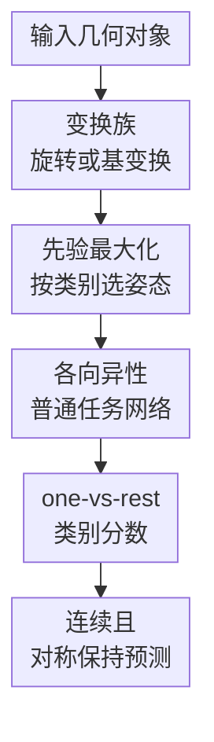

# Adaptive Canonicalization with Application to Invariant Anisotropic Geometric Networks

**会议**: ICLR 2026  
**OpenReview**: [https://openreview.net/forum?id=j2DHdrsRXI](https://openreview.net/forum?id=j2DHdrsRXI)  
**代码**: https://github.com/ywelld/_ac  
**领域**: 几何深度学习 / 等变学习  
**关键词**: 自适应规范化、几何深度学习、对称性、谱图神经网络、点云分类

## 一句话总结

这篇论文提出自适应规范化（adaptive canonicalization）：不再只由输入决定标准姿态，而是让输入和当前任务网络共同选择最有信心的变换，从而在保持对称性不变性的同时缓解传统规范化的不连续问题，并在谱图网络、分子/蛋白图分类和旋转点云分类上取得优于等变架构、数据增强和固定规范化的结果。

## 研究背景与动机

**领域现状**：几何深度学习通常要处理数据里的对称性，例如图的节点排列、谱分解里的特征向量符号/基选择、3D 点云的旋转、分子结构的姿态变化等。主流路线大致有三类：直接设计等变/不变网络，把群作用写进层结构；用数据增强让模型看见许多变换版本；或者先把输入映射到某个标准形，再交给普通神经网络处理。

**现有痛点**：规范化看起来很简洁，但在很多常见对称群上，想给每个轨道连续地选一个唯一代表几乎做不到。输入发生很小扰动时，选出来的“标准姿态”可能突然跳到另一个分支，导致端到端模型不连续。训练时这种跳变会带来不稳定，测试时会伤害泛化，理论上也让“用连续网络逼近连续对称函数”这件事变得别扭。

**核心矛盾**：传统规范化把所有压力都放在一个输入相关映射 $\beta_x$ 上：同一类对称等价输入必须被压到同一个标准形，但这个标准形又不能随着输入剧烈跳变。论文的观察是，分类网络本身对不同姿态的偏好并不相同。一个非等变网络可能在某个方向上识别“马”、分子图谱模式或点云局部几何更容易，如果标准姿态完全不看网络，就会错过这种可利用的方向性。

**本文目标**：作者希望构造一种新的规范化框架，使模型既能像规范化方法一样使用普通非等变 backbone，又能避免固定规范化带来的不连续；同时，这个框架需要有清楚的对称保持性质、连续性证明和通用逼近性质，并能落到谱图神经网络和 3D 点云网络这样的具体几何模型中。

**切入角度**：论文把“标准形”从输入的属性改成输入和网络共同决定的属性。对于每个输入，网络可以在允许的变换空间里搜索，让某个类别头或输出通道最有信心的变换成为该通道的规范姿态。直觉上，这像人识别物体时会把纸转到自己最容易看的角度，而不是强迫所有物体服从某个预先固定的几何规则。

**核心 idea**：用“最大化当前网络输出先验”的自适应规范化替代固定输入规范化，让普通各向异性网络在自己擅长的姿态上做判断，同时由最大值操作保证最终预测对原始对称变换保持不变。

## 方法详解

### 整体框架

整套方法可以分成理论框架和两个实例化应用。理论上，给定一个普通连续函数或神经网络 $f$，规范化映射不再写成只依赖输入 $g$ 的 $\rho(g)$，而写成依赖网络和输入的 $\rho_f(g)$，端到端模型为 $f(\rho_f(g))$。实践上，论文主要使用 prior maximization：在一族变换 $\kappa_u$ 中搜索让某个输出通道 $f_d$ 最大的变换，再把该变换后的输入交给同一个通道分类。

在分类问题中，论文采用 one-vs-rest 形式。若有 $D$ 个类别，每个类别头 $\Psi_d$ 都可以为同一个输入选择自己的最优变换。这样做的结果是：类别 $d$ 的分数来自 $\max_u \Psi_d(\kappa_u(g))$，不同类别可以对应不同“最像该类”的规范姿态。这个机制既解释了图 1 里的多分类流程，也直接连接到后面的谱图网络和点云网络。

落到具体模型时，谱图网络版本先把图信号投影到拉普拉斯谱空间，把每个频带内的特征向量基看成可变的正交基，然后为每个类别选择一组带内正交变换，使该类别头输出最大。点云版本则把 SO(3) 旋转作为变换空间，对 PointNet 或 DGCNN 这样的置换不变但非旋转不变 backbone 搜索最有利的旋转。两者共同点是：backbone 本身可以保留方向敏感性，最终模型通过外层最大化获得不变性。

### 关键设计

**1. 自适应规范化：把标准形从“输入属性”改成“输入-网络属性”**

传统规范化试图为每个输入轨道选一个固定代表，例如给点云选一个 PCA 姿态、给谱图特征向量选一套固定符号或基。问题在于，很多对称空间里不存在处处连续的唯一选择：接近退化点、重特征值、对称物体或边界样本时，标准形会突然翻转。本文改成让规范化依赖待训练函数本身，形式上定义 $\rho_f(g)$，端到端输出是 $f(\rho_f(g))$。这个小改动改变了问题的数学结构：规范化器本身可以不连续、甚至最大点可以不唯一，但只要最终值是“最大输出值”，模型输出仍能保持连续。

论文给出一般定义：若对每个输入 $g$，映射 $f \mapsto f \circ \rho_f(g)$ 关于函数 $f$ 是等度连续的，那么 $\rho$ 就是 adaptive canonicalization。这个定义看起来抽象，但核心含义很直接：当网络函数 $f$ 稍微变化时，经过自适应规范化后的输出不能剧烈变化。由此可以证明，如果普通网络族能逼近 $C_0(K, \mathbb{R}^D)$ 中的连续函数，那么自适应规范化后的网络也能逼近对应的 canonicalized continuous functions。

**2. 先验最大化：用“最有信心的变换”实现连续的对称保持预测**

prior maximization 是论文主推的可实现版本。给定变换族 $\kappa_u(g)$ 和单调先验 $h_d$，第 $d$ 个输出通道选择

$$
\rho^d_{f_d}(g) \in \arg\max_{u \in U} h_d(f_d(\kappa_u(g))).
$$

分类里通常取 $h_d(x)=x$，也就是直接最大化第 $d$ 个类别头的 logit 或概率。最终第 $d$ 类分数可以理解为 $\max_u f_d(\kappa_u(g))$。关键是，最大值算子对被最大化函数是 1-Lipschitz 的：如果两个函数 $f$ 和 $y$ 的无穷范数相差不超过 $\epsilon$，它们在同一变换集合上的最大值也相差不超过 $\epsilon$。因此，即使 argmax 选到的变换发生跳变，最大值本身仍然稳定。

在对称性方面，若变换族来自群作用，例如 $\kappa_u=P \circ \pi(u)$，那么对输入先施加任意群变换只会重新参数化搜索空间，最大值不变。因此 $f \circ \rho_f$ 是 symmetry preserving 的。论文进一步证明，这类 prior maximization 不只是能产生某些对称函数，而是可以表示所有连续对称保持函数，并继承普通网络的通用逼近能力。这是本文区别于“经验上转一转、挑最大”的地方：它把测试时搜索、规范化和 UAT 放进同一个理论框架。

**3. 各向异性谱图滤波：让谱图网络利用频带内方向，同时消除基选择歧义**

谱图神经网络常用图拉普拉斯 $L$ 的特征向量作为频域坐标，但特征向量并不唯一。单个特征向量可以翻号，重特征值对应的特征空间可以选任意正交基；即便把谱划成多个 band，同一 band 内的正交基仍有任意旋转自由度。若网络直接读取这些坐标，输出就可能依赖 eigensolver 的任意选择，而不是只依赖图本身。

A-NLSF 的做法是先把谱分成 $B$ 个频带，对每个 band 计算图信号 $S$ 在基 $V_k$ 上的谱系数 $C_k(V_k,S)=V_k^\top S$，再通过 padding/truncation 统一成固定大小 $J_k \times T$，拼接后送入普通 MLP 或任务网络 $\Psi$。真正的自适应部分发生在每个 band 内：对类别 $d$，搜索正交矩阵 $U_k^{(d)}$，使 $\Psi_d$ 在变换后的谱系数上最大。因为 $\Psi$ 不被强制做谱空间内的各向同性处理，它可以区分同一 eigenspace 里的不同方向；因为外层对所有合法基变换取最大，最终预测又不依赖初始基选择。这解释了为什么论文称它为 anisotropic nonlinear spectral filters：内部是方向敏感的，外部是基不变的。

**4. 旋转点云自适应规范化：保留 PointNet/DGCNN 的方向敏感性，再用 SO(3) 搜索获得旋转不变性**

点云分类里，PointNet 和 DGCNN 天然对点的排列不敏感，但不保证对 3D 旋转不变。传统做法要么用旋转数据增强，让模型见过很多姿态；要么换成 SO(3) 等变/不变架构；要么学习一个固定 canonicalizer。本文的方法更直接：保留原来的置换不变 backbone $\Psi$，对每个类别 $d$ 搜索旋转 $R_d^\star \in SO(3)$，使 $\Psi_d(XR^\top)$ 最大，然后用 $\Psi_d(XR_d^{\star\top})$ 作为该类别分数。

这个设计的微妙点在于，模型并不要求所有类别共享同一个最佳旋转。一个点云在“看起来像椅子”的旋转下和“看起来像桌子”的旋转下，类别头可以各自选择自己的证据最强姿态。训练时也同步使用这种自适应旋转，而不是只在测试时后处理，所以 backbone 会逐渐学会在自己偏好的规范视角上识别局部几何。实现上，论文用随机采样若干旋转候选，再对最优候选做少量局部梯度优化；谱图实验采样 32 个变换，点云实验采样 50 个旋转。

### 一个完整示例

以 ModelNet40 上的一个任意旋转椅子点云为例，输入 $X \in \mathbb{R}^{N \times 3}$ 先经过一组随机 SO(3) 旋转候选。对于“chair”类别头，AC-DGCNN 会并行评估 $\Psi_{chair}(XR_1^\top), \ldots, \Psi_{chair}(XR_{50}^\top)$，选出让 chair logit 最大的旋转 $R_{chair}^\star$，再可选地做几步局部优化。对于“table”类别头，同一个点云会重新搜索 $R_{table}^\star$，因为 table 头关注的几何证据不同。

最后模型得到一组 one-vs-rest 分数，例如 chair 头在某个规范视角下看到靠背和椅腿关系很清楚，score 高；table 头即使转到自己最有利的视角，score 仍低。若原始点云整体再被任意旋转一次，候选搜索空间只是整体平移到另一组等价旋转，最大 chair 分数不应改变。这样，网络内部仍然可以使用“上/下/左/右”等方向敏感特征，输出却对输入的全局旋转保持不变。

### 损失函数 / 训练策略

分类训练采用 one-vs-rest 二元交叉熵。对 $D$ 个类别，模型输出每个类别头经过自适应规范化后的分数 $s_d$，再用 sigmoid 得到 $\hat{y}_d=\sigma(s_d)$。真实类别 $d^\star$ 的标签为 $y_{d^\star}=1$，其他类别为 0，训练损失为

$$
\sum_{d=1}^{D} -y_d \log \hat{y}_d - (1-y_d)\log(1-\hat{y}_d).
$$

先验最大化本身用随机候选近似。给定输入 $g$、网络 $f$、先验 $h$ 和采样器，算法先从变换空间采样 $K$ 个候选 $u_1,\ldots,u_K$，选择 $h(f(\kappa_{u_i}(g)))$ 最大的候选，再执行一步或少量步梯度下降/流形优化细化该变换。论文强调，这只是实现 prior maximization 的一种方便方式；只要能近似求解同一个最大化问题，也可以替换为其他优化策略。

## 实验关键数据

### 主实验

论文实验分三组：谱图网络的 toy + TUDataset 图分类、OGB 分子/蛋白图分类、ModelNet40 点云分类。最能说明问题的是，A-NLSF 在专门考查方向信息的 grid signal orientation toy task 上从几乎随机猜测提升到 99.38%，说明固定等变或各向同性谱滤波确实会丢掉任务所需的方向差异。

| 任务/数据集 | 指标 | 本文 | 之前最好/强基线 | 提升 |
|--------|------|------|----------|------|
| Grid signal orientation | Accuracy | 99.38±0.2 | ChebNet 50.12±0.1 | +49.26 |
| TUDataset MUTAG | Accuracy | 87.94±0.9 | OAP+GIN 84.95±2.0 | +2.99 |
| TUDataset PTC | Accuracy | 73.16±1.2 | NLSF 68.17±1.0 | +4.99 |
| TUDataset ENZYMES | Accuracy | 73.01±0.8 | NLSF 65.94±1.6 | +7.07 |
| TUDataset PROTEINS | Accuracy | 85.47±0.6 | OAP+GIN 83.41±1.4 | +2.06 |
| TUDataset NCI1 | Accuracy | 82.01±0.9 | OAP+GIN 80.97±1.1 | +1.04 |

在 OGB 上，A-NLSF 也稳定超过图神经网络、图 Transformer 类强基线和 OAP+GatedGCN。尤其 ogbg-ppa 从 GPS 的 0.8015 提升到 0.8149，说明这种基选择自适应不只在小型 toy 或 TUDataset 上有效，也能用于更大的蛋白图分类。

| 数据集 | 指标 | 本文 A-NLSF | 强基线 | 提升 |
|--------|------|------|----------|------|
| ogbg-molhiv | AUROC | 0.8019±0.0152 | PNA 0.7905±0.0132 | +0.0114 |
| ogbg-molpcba | Avg. Precision | 0.2968±0.0022 | GPS 0.2907±0.0028 | +0.0061 |
| ogbg-ppa | Accuracy | 0.8149±0.0067 | GPS 0.8015±0.0033 | +0.0134 |
| ModelNet40 / PointNet | Accuracy | AC-PointNet 81.1±0.7 | CN-PointNet 79.7±1.3 | +1.4 |
| ModelNet40 / DGCNN | Accuracy | AC-DGCNN 91.6±0.6 | VN-DGCNN 90.2 | +1.4 |

### 消融实验

主文没有给出传统“删掉模块 A/B”的完整消融表，但附录包含实现方式、采样近似、额外设置和算力比较。结合主表可以把关键对照理解为三类：没有对称处理的 backbone、固定/学习规范化或 frame averaging、以及本文自适应规范化。它们比较的是“是否让标准姿态依赖当前任务网络”。

| 配置 | 关键指标 | 说明 |
|------|---------|------|
| 普通 MLP/GCN/GAT/GIN/ChebNet | Grid task 约 50%；TUDataset 多数低于 A-NLSF | 没有解决谱基/方向歧义，toy 任务基本随机 |
| FA+GIN / OAP+GIN | ENZYMES 52.64 / 58.40，PROTEINS 79.53 / 83.41 | frame averaging 和固定规范化能提升 GIN，但仍受固定标准形或平均化限制 |
| NLSF / S2GNN | ENZYMES 65.94 / 63.26，NCI1 80.51 / 75.62 | 谱方法更接近问题结构，但没有本文这种按网络输出自适应选基 |
| A-NLSF | ENZYMES 73.01，PROTEINS 85.47，NCI1 82.01 | 在所有 TUDataset 对照列中最好，说明各向异性表达 + 自适应基选择有效 |
| PointNet-Aug / DGCNN-Aug | ModelNet40 75.8 / 89.0 | 静态旋转增强只能鼓励鲁棒性，不能显式为每个输入选最佳视角 |
| CN-PointNet / CN-DGCNN | ModelNet40 79.7 / 90.0 | canonicalization 优于增强，但低于 AC，可能因为标准形不随任务头自适应 |
| AC-PointNet / AC-DGCNN | ModelNet40 81.1 / 91.6 | 每个类别头搜索最有利旋转，兼顾方向敏感特征和旋转不变输出 |

### 关键发现

- 最强信号来自 grid signal orientation toy task：大多数基线都在 50% 左右，A-NLSF 达到 99.38%，说明当任务真正依赖“同一谱空间内的方向关系”时，各向同性或固定基处理会从表示层面丢信息。
- 在真实图分类上，A-NLSF 对 MUTAG、PTC、ENZYMES、PROTEINS、NCI1 都是表中最优，且 ENZYMES 提升最明显。这类数据的结构模式可能受谱基选择影响较大，自适应基变换能让网络在更有判别力的频域坐标下工作。
- OGB 分子/蛋白实验说明方法并非只适合小图。虽然提升幅度没有 toy task 那么夸张，但对 molhiv、molpcba、ppa 都保持一致正增益。
- 点云实验表明，AC 不是简单替代 backbone，而是可以叠加到 PointNet 和 DGCNN 上。DGCNN 本身已经较强，AC-DGCNN 仍从 88.6/89.0/90.2/90.0 这一档提升到 91.6。
- 代价也很明确：prior maximization 需要为 $D$ 个类别做 $D$ 次优化或搜索，推理成本随类别数增加。这是论文在局限里重点承认的问题。

## 亮点与洞察

- 本文最漂亮的地方是把“argmax 的变换可能不连续”和“max 的值可以连续”区分开来。很多规范化方法卡在要连续地选代表元，而 prior maximization 绕开了这个要求：只关心最大分数，不要求最优变换本身稳定。
- adaptive canonicalization 给了普通非等变网络一个合理位置。过去几何学习常默认“尊重对称性就要把每一层都做成等变”，本文则说明可以让 backbone 保持方向敏感，再在输出层面通过搜索恢复不变性。
- 谱图网络应用很有启发：处理特征向量符号或重特征空间基选择时，不必预先规定一个固定规则，而可以让任务信号决定哪组谱坐标最利于分类。这对所有依赖拉普拉斯 PE、谱滤波或特征向量输入的 GNN 都有迁移价值。
- 点云应用说明该框架是 plug-in 风格的：不需要重写 PointNet/DGCNN 的层，只需要在输入或中间向量表示上加一个变换搜索环节。这为已有模型补旋转不变性提供了轻量路径。
- one-vs-rest 每类独立选姿态这一点很反直觉但很实用。它不强迫一个“全局最佳视角”服务所有类别，而是让每个类别头问“有没有某个视角让我确信它属于我”。这比单一 canonical pose 更贴近多类识别的证据结构。

## 局限与展望

- 当前理论主要覆盖分类，特别是 one-vs-rest 形式。回归任务没有在主理论中完整处理，而几何深度学习里很多重要任务，如分子性质回归、力场预测、点云配准，都不是纯分类。
- 推理成本较高。若有 $D$ 个类别，每个类别都要在变换空间做一次最大化；点云实验中还要评估 50 个旋转候选。类别数很大或 backbone 很重时，这会成为主要瓶颈。
- 随机最大化只是近似 true maximum。论文给出高概率近似分析，但实际效果仍依赖采样数、局部优化质量、变换空间维度和 prior landscape 是否平滑。
- 每个类别独立选择变换有表达优势，但也可能带来解释上的复杂性：模型最终并没有给出一个统一的规范姿态，而是给出多个类别条件姿态。对需要可视化、物理一致性或下游几何对齐的任务，这一点未必总是合适。
- 实验覆盖图分类和点云分类，但与更大规模 3D 分子、蛋白结构预测、场预测或动态图任务的结合还需要验证。特别是严格等变物理任务中，输出本身可能也要按群作用变换，不能只做不变分类。

## 相关工作与启发

- **vs 等变架构**: 等变网络把群表示、张量约束或 steerable filter 写进每一层，优点是结构上干净，缺点是实现复杂、计算重、可能限制普通非线性和方向敏感表达。本文把对称性处理外置成 prior maximization，让 backbone 可以是普通网络，但最终输出仍保持不变。
- **vs 数据增强**: 数据增强通过训练分布鼓励模型对变换稳定，但并不保证不变性，也可能让模型把参数容量分散到很多姿态上。本文显式选择每个输入的最佳代表元，让网络集中学习规范视角上的判别模式。
- **vs 固定规范化 / learned canonicalization**: 固定或学习规范化通常为每个输入选一个标准形，容易遇到不连续和边界跳变。本文允许最优变换跳变，但通过最大值输出维持连续性，并且标准形随任务网络变化。
- **vs frame averaging / weighted frame averaging**: frame averaging 对一组变换输出求平均，连续性更容易处理，但可能平均掉有用的方向敏感特征，且对点云旋转可能需要很多 frame。本文选择最大而不是平均，保留“某个视角证据最强”的判别逻辑。
- **vs test-time canonicalization**: 一些方法只在测试时用 CLIP/SAM 或已有模型搜索标准视角，训练时模型并不知道这个流程。本文在训练和测试中都使用自适应规范化，使 backbone 可以主动适配这种决策方式。

## 评分

- 新颖性: ⭐⭐⭐⭐⭐ 把规范化从输入依赖扩展到输入-网络依赖，并用 prior maximization 给出连续性和通用逼近证明，思想清晰且有理论分量。
- 实验充分度: ⭐⭐⭐⭐ 覆盖 toy、TUDataset、OGB 和 ModelNet40，结果一致；但分类以外任务和更细的效率/采样消融还可以更多。
- 写作质量: ⭐⭐⭐⭐ 理论定义较抽象，但主线、应用和附录教程衔接不错；对非理论读者来说部分符号负担偏重。
- 价值: ⭐⭐⭐⭐⭐ 对几何深度学习里的“想用普通 backbone 又要尊重对称性”非常有启发，尤其适合谱图网络、点云和其他存在规范化不连续问题的场景。

<!-- RELATED:START -->

## 相关论文

- [\[ICLR 2026\] SONIC: Spectral Oriented Neural Invariant Convolutions](sonic_spectral_oriented_neural_invariant_convolutions.md)
- [\[CVPR 2026\] Adaptive Bayesian Early-Exit Networks for Efficient Non-Transferable Learning](../../CVPR2026/others/adaptive_bayesian_early-exit_networks_for_efficient_non-transferable_learning.md)
- [\[ICLR 2026\] Buckingham $\pi$-Invariant Test-Time Projection for Robust PDE Surrogate Modeling](buckingham_pi-invariant_testtime_projection_for_robust_pde_surrogate_modeling.md)
- [\[ICLR 2026\] Adaptive Conformal Guidance for Learning under Uncertainty](adaptive_conformal_guidance_for_learning_under_uncertainty.md)
- [\[ICML 2025\] GLGENN: A Novel Parameter-Light Equivariant Neural Networks Architecture Based on Clifford Geometric Algebras](../../ICML2025/others/glgenn_a_novel_parameter-light_equivariant_neural_networks_architecture_based_on.md)

<!-- RELATED:END -->
