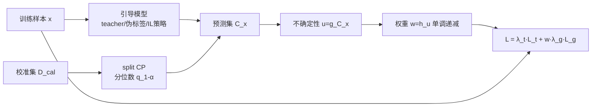

# Adaptive Conformal Guidance for Learning under Uncertainty

**会议**: ICLR 2026  
**OpenReview**: [https://openreview.net/forum?id=1gxP0WtOoO](https://openreview.net/forum?id=1gxP0WtOoO)  
**代码**: 待确认  
**领域**: 不确定性量化 / 共形预测 / 通用学习框架  
**关键词**: 共形预测, 不确定性加权, 知识蒸馏, 半监督学习, 模仿引导强化学习  

## 一句话总结
把分割共形预测（split CP）直接嵌进训练循环，用"预测集大小"量化引导信号（teacher 软标签 / 伪标签 / 专家策略）的不确定性，再据此自适应调低不可靠引导的权重——一套框架同时覆盖监督、半监督、模仿引导 RL 三类带引导的学习场景。

## 研究背景与动机
**领域现状**：大量机器学习系统靠"引导信号"来提升性能或加速学习——监督学习用预训练 teacher 的软标签做知识蒸馏，半监督学习用模型自产的伪标签 bootstrap 小标注集，强化学习用模仿学习（IL）策略给探索做先验。这些引导默认是可信的。

**现有痛点**：引导信号在域偏移、标注稀缺、分布外泛化时会变得噪声化甚至误导。Teacher 在 student 目标域上可能比 student 还差；伪标签会因早期错误自我强化；IL 策略一旦走出示范分布就给出错误动作。盲目信任噪声引导会让模型过拟合到错误信息，但直接丢弃引导又浪费了其中的有用知识。

**核心矛盾**：如何在"既不盲信、又不浪费"之间动态权衡？已有的不确定性感知方法要么用启发式估计（熵、最大 softmax 概率、MC dropout），这些在域偏移下过度自信、校准很差；要么只针对单一窄域（医学影像、人机交互）；而共形预测虽然给出分布无关、模型无关的严格不确定性，却几乎只用于训练后的后处理校准（post-hoc），没人把它放进训练动态里实时驱动。

**本文目标**：提出第一个把 split CP 嵌入训练循环、跨监督/半监督/模仿引导 RL 三类场景自适应加权引导的统一框架。

**核心 idea**：**[不确定性即权重]** 用引导模型在校准集上的共形预测集大小 $|C(x)|$ 度量该样本的引导不确定性 $u$，再用单调递减映射把 $u$ 转成引导损失的权重 $w$——预测集越大（越不确定）权重越低，从而让模型在不可信处自主探索、在可信处吸收引导。

## 方法详解

### 整体框架
AdaConG（Adaptive Conformal Guidance）在每个训练步做三件事：先用一个保留的校准集 $D_{cal}$ 把引导模型的启发式输出"共形化"，算出阈值分位数 $q_{1-\alpha}$；对训练样本构造预测集 $C(x)$，把集合大小转成不确定性 $u(x)$ 再转成权重 $w(x)$；最后用 $w(x)$ 缩放引导损失 $L_g$，与任务损失 $L_t$ 相加去更新模型。三类学习场景共用这一骨架，差别只在"引导信号是什么、校准集怎么取、权重怎么组合"。

### 关键设计

**1. 共形化引导信号 → 预测集大小当不确定性：** AdaConG 的根基是把任意"启发式不确定度"通过 split CP 转成有覆盖保证的严格度量。给定校准集 $D_{cal}$ 与非一致性分数 $s'$（回归用残差 $|\bar y-\hat y|$，分类用 $s'=1-p_{\bar y}$），计算分位数 $q_{1-\alpha}=\text{Quantile}_{1-\alpha}(s'_1,\dots,s'_{|D_{cal}|})$，对测试输入构造预测集 $C(x)=\{y:s'(x,y)\le q_{1-\alpha}\}$，在可交换性假设下满足覆盖保证 $P(y\in C(x))\ge 1-\alpha$。关键洞察是：**预测集越大说明模型越不确定**，于是定义引导不确定性 $u(x)=g(|C(x)|)$，其中 $g$ 把集合大小归一化到 $[0,1]$，例如 $K$ 类问题取 $g(n)=\frac{n-1}{K-1}$。相比熵或 MSP 这类直接读 softmax（在域偏移下过度自信）的做法，CP 给出的是分布无关、即使分布漂移也成立的可靠估计。

**2. 单调递减权重把不确定性"翻译"成引导强度：** 拿到 $u(x)$ 后用单调递减函数 $h$ 转成权重 $w(x)=h(u(x))$，论文默认指数衰减 $h(u)=\exp(-\kappa u)$，温度 $\kappa>0$ 控制衰减陡峭度（蒸馏实验取 $\gamma=10$，SSL 取 $\gamma=8$）。高不确定 → 低权重 → 引导被压制，模型转而靠任务损失自主学习；低不确定 → 权重接近 1 → 充分吸收引导。在监督蒸馏里总损失写成 $L=\lambda_{task}L_t+w(x)\cdot\lambda_{guide}L_g$，$L_t$ 是交叉熵、$L_g$ 是 student 与 teacher logits 的 KL。论文还给出一个 hard 变体——$w=1$ 当 $u=0$、否则 $w=0$，只信"预测集塌缩成单元素"的样本，效果相当。这一步把抽象的不确定性落成可微的损失重加权，是"自适应"二字的具体实现。

**3. 三场景适配——校准集与权重组合的差异化：** 同一骨架在三类场景按各自的引导结构变形。*监督蒸馏* 下把目标域数据切成 train/calibration/test 三份，用校准集把预训练 teacher 共形化，确保校准集代表引导将作用的输入分布。*半监督* 下校准集由"标注数据 + 与无标注同款的弱增强"构成，对弱增强视图算伪标签的预测集，无监督损失 $L_u=\frac{1}{|D_u|}\sum_{x}w(x)\,\ell(f(x_{strong}),\tilde y)$ 让一致性正则按伪标签置信度加权。*模仿引导 RL* 最特殊：非一致性分数取 $s(s,a)=-\log\pi(a|s)$，IL 策略用固定校准集算常数分位 $\hat q_I$，而 RL 策略因为在训练中不断变化，采用 **adaptive CP**——维护一个滑动窗口校准集、用 EMA 更新分位 $\hat q_R^{(t)}\leftarrow(1-\rho)\hat q_R^{(t-1)}+\rho\,\tilde q_R^{(t)}$，并用 IL 分位 $\hat q_I$ 热启动。最终权重做成 IL/RL 的相对不确定性竞争 $w(s)=\frac{\exp(-u_I(s))}{\exp(-u_I(s))+\exp(-u_R(s))}$，并同时驱动数据采集（以概率 $w$ 选 IL 动作、$1-w$ 选 RL 动作）。这套设计让 RL 在 IL 不确定的状态上自动减少对模仿的依赖。

## 实验关键数据

### 主实验表格

**知识蒸馏（CIFAR-100，teacher 因 0.05 高斯噪声域偏移而欠拟合）** —— Top-1 准确率，∆ 为接入 AdaConG 后的增益：

| 方法（homogeneous） | ResNet110→20 | ResNet32×4→8×4 | WRN40-2→16-2 |
|---|---|---|---|
| 从头训练 student | 66.51 | 69.14 | 70.34 |
| KD | 57.23 | 58.90 | 59.40 |
| KD + AdaConG | 66.53 (**+9.30**) | 68.45 (**+9.45**) | 70.29 (**+10.89**) |
| LS-KD | 63.38 | 63.49 | 66.58 |
| LS-KD + AdaConG | 67.17 (+3.79) | 70.33 (+6.84) | 71.48 (+4.90) |

关键反差：原始 KD 在 teacher 欠拟合时比"从头训练"还差，AdaConG 把它救回到 from-scratch 之上，最高 +10.89%。

**半监督分类（交叉熵引导）** —— Top-1 准确率，∆ 为平均增益：

| 方法 | CIFAR-10 (40 lab) | CIFAR-100 (400 lab) | STL-10 (40 lab) |
|---|---|---|---|
| FixMatch | 64.18 | 40.36 | 58.03 |
| FixMatch + AdaConG | 70.16 (**+5.98**) | 41.98 (+1.62) | 62.70 (+4.67) |
| FlexMatch | 73.24 | 51.25 | 62.55 |
| FlexMatch + AdaConG | 76.98 (+3.74) | 55.63 (**+4.38**) | 65.98 (+3.43) |

**Gridworld 导航（IL 引导 RL）**：在 Lava 1/Lava 2/Door 三环境、10 个随机种子下，AdaConG 与 Hard AdaConG 均比 SAC、IBRL、Soft IBRL 收敛更快、奖励更高；摘要给出"比最强 baseline 高 6× 奖励"。在 IL 未见过的偏移环境 Lava 2（不收集示范、无 IL 策略），IBRL/Soft IBRL 因不感知不确定性只能收敛到受限 IL 水平，AdaConG 仍能突破。

### 消融实验表格

| 消融维度 | 设置 | 结论 |
|---|---|---|
| teacher-student 结构 | heterogeneous（ResNet↔ShuffleNet） | 所有 KD 方法接入 AdaConG 均提升 |
| 权重函数 | hard 版 $w\in\{0,1\}$ | 与软指数衰减效果相当 |
| SSL 引导损失 | 交叉熵 → MSE | 换 MSE 仍持续提升（如 FlexMatch+AdaConG 在 CIFAR-100 2500 lab +2.77） |
| RL 权重组合 | soft 概率 vs hard argmax | 两者表现接近 |

### 关键发现
- 用 CP 预测集大小做不确定性，比熵 / MSP / MC dropout 等启发式更抗域偏移，且不需要 MC dropout 那样多次前向（开销更低）。
- 框架的价值集中体现在"引导本身不可靠"的场景：teacher 欠拟合、伪标签噪声大、IL 策略泛化失败时增益最大。
- RL 里 CP 集衡量的是策略"自一致性"而非动作正确性，但作为不确定性驱动权重已足够引导探索。

## 亮点与洞察
- **把 post-hoc 的 CP 拉进训练循环**：这是 AdaConG 最核心的概念转移——CP 一直被当作训练后校准工具，本文证明它能实时驱动训练动态、当作可微的引导权重模块。
- **一套机制三类场景**：监督蒸馏、半监督、模仿引导 RL 共用"共形化→预测集→权重→重加权损失"骨架，只换引导信号定义，体现了框架的通用性。
- **adaptive CP 处理非平稳引导**：RL 策略在训练中不断变化，用滑动窗口 + EMA 分位 + IL 热启动优雅地解决了"被校准对象本身在漂移"的难题。
- **简单到可即插即用**：几乎是给任意带引导损失的方法加一个权重项，迁移成本极低，却能把失败的 baseline 救回基准线之上。

## 局限与展望
- **依赖校准集的代表性与可交换性**：CP 覆盖保证建立在校准集能代表引导作用的输入分布、且满足可交换性之上；在严重分布外或极小标注预算下，校准集本身可能失真。
- **预测集大小≠引导正确性**：论文自己指出 RL 中 CP 集衡量的是自一致性而非动作对错，用它当权重是一种代理，理论上可能在"自信但错误"的引导上失效。
- **超参敏感性**：温度 $\kappa/\gamma$、显著性水平 $\alpha$、EMA 平滑 $\rho$、窗口大小等需按任务调（蒸馏 $\gamma=10$、SSL $\gamma=8$），缺乏自适应设定。
- **任务规模偏小**：实验集中在 CIFAR/STL-10/gridworld 与自动驾驶转向预测，尚未验证大规模 LLM 蒸馏或复杂连续控制等更现实的引导场景。

## 相关工作与启发
- **带引导的学习**：知识蒸馏（Hinton 软标签、FitNet 中间特征、跨模态/多智能体蒸馏）、半监督（FixMatch/FlexMatch 伪标签）、模仿引导 RL（IBRL）——共同缺陷是把引导当作静态可信，AdaConG 针对的正是这一假设。
- **共形预测**：RAPS（Angelopoulos 2020）等主要做分类器后处理出预测集，adaptive CP（Gibbs & Candès 2021；Zhou 2025）处理分布漂移；本文把它们从"评估时"挪到"训练时"。
- **不确定性感知学习**：MC dropout、熵 / MSP 重加权、PTLoss、EA-KD 等用启发式或后处理校准，受限于单一域且抗漂移差，被本文作为对照刷新。
- **启发**：任何"信号可能噪声但又有价值"的训练流程（RLHF 奖励模型、自蒸馏、弱监督）都可借鉴"用 CP 集大小做即时可信度门控"的思路。

## 评分
- **新颖性**: ⭐⭐⭐⭐ —— 首个把 split CP 嵌入训练循环、跨监督/半监督/模仿 RL 统一做引导自适应加权；adaptive CP 处理非平稳 RL 策略是漂亮的细节，但底层组件（CP、损失重加权）均已存在，属巧妙组合而非全新机制。
- **实验充分度**: ⭐⭐⭐⭐ —— 四类任务 + 多 backbone + 多基准 + 软/硬权重与 CE/MSE 引导损失消融，覆盖面广且增益显著；但任务规模偏小、自动驾驶部分着墨少。
- **写作质量**: ⭐⭐⭐⭐ —— 动机递进清晰、三场景公式统一、图 1 把骨架讲透，可读性高。
- **价值**: ⭐⭐⭐⭐ —— 即插即用、迁移成本低、在"引导不可靠"这一普遍痛点上稳定见效，对蒸馏/SSL/IL 社区都有实用价值。

<!-- RELATED:START -->

## 相关论文

- [\[ICLR 2026\] Regulating Internal Alignment Flows for Robust Learning Under Spurious Correlations](regulating_internal_alignment_flows_for_robust_learning_under_spurious_correlati.md)
- [\[ICLR 2026\] Measuring Uncertainty Calibration](measuring_uncertainty_calibration.md)
- [\[ICLR 2026\] Harpoon: Generalised Manifold Guidance for Conditional Tabular Diffusion](harpoon_generalised_manifold_guidance_for_conditional_tabular_diffusion.md)
- [\[ICLR 2026\] Learning Adaptive Distribution Alignment with Neural Characteristic Function for Graph Domain Adaptation](learning_adaptive_distribution_alignment_with_neural_characteristic_function_for.md)
- [\[ICML 2026\] Possibilistic Predictive Uncertainty for Deep Learning](../../ICML2026/others/possibilistic_predictive_uncertainty_for_deep_learning.md)

<!-- RELATED:END -->
