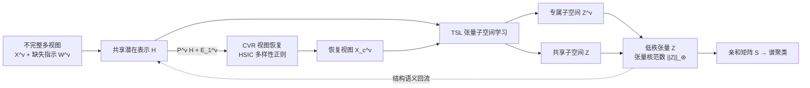

# Aligning Collaborative View Recovery and Tensorial Subspace Learning via Latent Representation for Incomplete Multi-View Clustering

**会议**: ICLR 2026  
**OpenReview**: [https://openreview.net/forum?id=a5aRjldX9l](https://openreview.net/forum?id=a5aRjldX9l)  
**代码**: [https://github.com/caoyu110/ARSL-IMVC](https://github.com/caoyu110/ARSL-IMVC)  
**领域**: 不完整多视图聚类 / 张量子空间学习  
**关键词**: incomplete multi-view clustering, view recovery, tensor subspace, low-rank tensor, HSIC, latent representation  

## 一句话总结
ARSL-IMVC 用一个共享潜在表示 $H$ 作"桥梁"，把缺失视图恢复（CVR）和张量子空间学习（TSL）显式对齐到同一框架里互相促进，从而在视图大量缺失的场景下做出更鲁棒的多视图聚类。

## 研究背景与动机
**领域现状**：多视图聚类（MVC）靠跨视图的一致性（consistency）与互补性（complementarity）把无标签样本分簇，其中多视图子空间聚类因鲁棒、性能强而最受关注。但开放场景下传感器失效、标注缺失、数据损坏会让某些视图的样本丢失，于是**不完整多视图聚类（IMVC）**成为研究热点，分两派：填补式（先恢复缺失视图再聚类）和免填补式（只用可观测的部分视图）。

**现有痛点**：免填补式简单但判别力受限，缺失率高时尤其吃亏。填补式提供了更完整的数据基础，不少方法把视图恢复和聚类表示学习放进同一框架联合优化，效果不错——但有两个硬伤：其一，恢复出来的视图结构保真度有限、对一致性/多样性的重塑不够；其二也是更关键的，**视图恢复与子空间表示学习之间缺乏显式对齐和协同交互**，二者在挖掘互补与一致信息时只是"弱耦合"，没有一个明确的桥梁让二者的语义对齐起来。

**核心矛盾**：恢复模块想填出"高质量、信息丰富"的视图，子空间模块想学出"判别力强"的聚类结构，但它们各干各的，恢复出来的视图不一定服务于聚类语义，子空间学到的结构语义也回流不到恢复过程。

**本文目标**：让视图恢复和张量子空间学习在跨视图一致性/互补性建模上**显式对齐、双向协商**。

**核心 idea（加粗标签）**：
- **潜在表示当桥梁**：引入一个所有视图共享的潜在表示 $H$，它既是恢复缺失视图的"虚拟基底"，又直接参与子空间学习当全局语义锚点，把两个模块缝合在一起。
- **特征级一致+多样**：用投影 $P^v H$ 重塑跨视图一致性，用视图专属估计器 $E_1^v$ 加 HSIC 正则保证视图间多样性。
- **张量低秩建模高阶相关**：把视图共享和视图专属子空间表示堆成统一低秩张量，捕捉全局/局部多层次的跨视图高阶相关。

## 方法详解

### 整体框架
ARSL-IMVC 由两大模块组成并用共享潜在表示 $H$ 对齐：**协同视图恢复（CVR）**从 $H$ 线性推断每个视图、用 HSIC 保证多样性；**张量子空间学习（TSL）**在 $H$ 和恢复视图上做自表示学习，把共享/专属子空间表示压进低秩张量。两个模块通过 $H$ 这条信息流双向传递语义——恢复质量帮助子空间判别，子空间结构语义又回流改善填补保真度，最后用统一目标函数经 ADMM 迭代求解。

### 关键设计

**1. 协同视图恢复 CVR：从潜在表示线性重建 + HSIC 撑开多样性。** MVC 的经典假设是多视图数据嵌在同一个共享潜在空间里，作者反用这个假设——让每个视图都从"虚拟"潜在表示 $H \in \mathbb{R}^{k\times n}$ 经重建算子 $P^v \in \mathbb{R}^{d_v \times k}$ 线性推断出来，再加一个视图专属估计器 $E_1^v$ 给恢复留自由度，于是视图重建写成 $P^v H + E_1^v$。光有一致性还不够，恢复出来的各视图如果太像就丢了互补信息，所以引入 Hilbert-Schmidt 独立性判据（HSIC）作多样性正则，惩罚任意两个估计器 $E_1^v$、$E_1^w$ 之间的依赖：$\mathrm{HSIC}(E_1^v, E_1^w) = \mathrm{Tr}(K^v \tilde{H} K^w \tilde{H})/(n-1)^2$，其中 $K^v$ 是 $E_1^v$ 的内积核、$\tilde H$ 是中心化矩阵。整个 CVR 在"已观测样本必须精确重建"的等式约束 $X^v W^v = (P^v H + E_1^v)W^v$ 和正交约束 $(P^v)^T P^v = I$ 下，最小化所有视图对的 HSIC，从而在特征层面同时压实一致性、撑开多样性。

**2. 张量子空间学习 TSL：共享与专属表示堆成低秩张量。** 拿到共享潜在 $H$ 和恢复视图 $P^v H + E_1^v$ 后，TSL 做自表示学习——对潜在表示有 $H = HZ + E_H$（学共享子空间 $Z$），对每个恢复视图有 $P^v H + E_1^v = (P^v H + E_1^v)Z^v + E_2^v$（学视图专属子空间 $Z^v$），$E_H$、$E_2^v$ 是噪声项。关键一步是把这些表示通过张量构造函数 $\Phi(\cdot)$ 堆叠并旋转成一个子空间表示张量 $\mathcal{Z} \in \mathbb{R}^{n\times(V+1)\times n}$，再对它施加张量核范数 $\|\mathcal{Z}\|_\circledast$ 求低秩。在低秩张量空间里，不同层次（全局共享 vs 局部专属）的高阶跨视图相关被统一捕捉，实现全局与局部结构信息的协同交互。噪声项则用 $\ell_{2,1}$ 范数约束以抗离群。

**3. 统一目标 + ADMM 迭代求解。** 把 CVR 和 TSL 合到一个目标里：$\min_\Upsilon \|\mathcal{Z}\|_\circledast + \lambda_1(\|E_H\|_{2,1} + \sum_v \|E_2^v\|_{2,1}) + \lambda_2 \sum_{w\neq v}\mathrm{HSIC}(E_1^v, E_1^w)$，约束含观测重建、自表示、正交和张量构造。这里 $H$ 同时是两个模块的耦合枢纽和语义锚点，让信息在恢复↔子空间之间双向流动。由于变量多（$\{H, P^v, E_1^v, Z, E_H, Z^v, E_2^v\}$）难以直接求解，引入辅助变量 $\mathcal{J}$、$X_c^v$ 后用 ADMM 交替优化：$P^v$ 有 SVD 闭式解，$H$ 化为 Sylvester 方程求解，张量核范数子问题用张量奇异值阈值（t-SVT）求解，$\ell_{2,1}$ 项用逐列软阈值算子。收敛后用 $S = (|Z| + |Z^T| + \sum_v |Z^v| + \sum_v |(Z^v)^T|)/(V+1)$ 构造亲和矩阵送谱聚类。

## 实验关键数据

### 主实验表格
7 个数据集（BBCSport、HW、BDGP、Yale、NGs、100leaves、Scene-15），对比 9 个代表性方法，重复 10 次取均值。缺失率 0.1 下部分 ACC 结果：

| 数据集 | 指标 | IMSC-AGL | HCP-IMSC | BWIC-TIMC | RMoGL | **Ours** |
|--------|------|----------|----------|-----------|-------|----------|
| BBCSport | ACC | 84.30 | 91.91 | 90.75 | 89.19 | **96.51** |
| BBCSport | NMI | 72.63 | 79.84 | 82.10 | 83.18 | **89.77** |
| HW | ACC | 88.59 | 79.80 | 81.85 | 76.73 | **96.90** |
| HW | NMI | 87.21 | 75.73 | 82.87 | 74.61 | **92.77** |
| BDGP | ACC | 41.67 | 21.08 | 29.88 | 45.94 | **56.07** |

缺失率 0.1 时 ACC 相比次优方法在 BBCSport / HW / BDGP 上分别提升约 **4.60% / 8.31% / 5.41%**；随缺失率升高（图 2），多数方法明显退化而 ARSL-IMVC 保持更高稳定性。

### 消融实验表格
设计变体 ARSL-IMVC-1（去掉在 $H$ 上的子空间学习，即砍掉潜在表示对齐），缺失率 0.1：

| 数据集 | 指标 | ARSL-IMVC-1 | ARSL-IMVC |
|--------|------|-------------|-----------|
| BBCSport | ACC | 84.03 | **96.51** |
| HW | ACC | 70.15 | **96.90** |
| Yale | ACC | 76.55 | **86.06** |
| NGs | ACC | 89.96 | **96.20** |
| 100leaves | ACC | 78.61 | **89.24** |

去掉潜在表示对齐后 ACC 在五个数据集分别掉 12.48% / 26.75% / 9.51% / 6.24% / 10.63%，证明"用 $H$ 对齐视图恢复与子空间学习"是性能的核心来源。

### 关键发现
- **对齐是关键**：相比免填补方法，CVR 的特征级一致+多样重塑带来更可靠的视图恢复；相比填补式方法，$H$ 同时当恢复基底和语义锚点，让两模块深度交互。
- **大规模可扩展**：在 1 万样本的 HDigit 上 ACC 达 99.00%，比次优 HCLS-IMSC 高约 0.7%，验证可扩展性。
- **效率与收敛**：运行时间与其他 IMVC 方法相当；收敛曲线显示有限迭代内达局部最优，数值稳定。参数 $\lambda_1$、$\lambda_2$ 在合理范围内不敏感。

## 亮点与洞察
- **"桥梁"思想很干净**：用一个共享潜在表示同时充当视图重建的虚拟基底和子空间学习的全局语义锚点，把过去"弱耦合"的恢复+聚类两步真正缝成一个双向协商的闭环，消融提升 26% 直接印证了这个对齐的价值。
- **HSIC 用得巧**：在视图恢复阶段就用 HSIC 在特征级显式撑开各视图多样性，避免恢复出"一致但冗余"的视图，照顾到了互补性这一容易被忽视的维度。
- **多层次张量建模**：把 $V$ 个专属子空间 + 1 个共享子空间一起塞进低秩张量，用张量核范数统一捕捉全局/局部高阶相关，比单纯逐视图建图更能挖跨视图结构。

## 局限与展望
- **传统优化范式**：方法是经典自表示 + 张量低秩 + ADMM 路线，谱聚类 + $n\times n$ 表示矩阵在超大规模数据上仍有 $O(n^2)$ 乃至更高的存储/计算压力，虽在 1 万样本上验证了可扩展，但相对深度 IMVC 的端到端可扩展性仍有差距。
- **线性恢复假设**：视图从 $H$ 线性重建（$P^v H + E_1^v$），对高度非线性的视图关系表达力可能不足，未来可考虑核化或深度化重建算子。
- **超参数搜索**：$\lambda_1$、$\lambda_2$ 在 $\{1,...,50\}$、$k$ 在 10–20 网格搜索，虽声称不敏感，但仍需调参；自适应确定潜在维度 $k$ 是可改进方向。

## 相关工作与启发
- **免填补 IMVC**（DAIMC、IMSC-AGL、HCLS-CGL）：只用可观测视图学共识表示或自适应图，简单但缺失率高时判别力受限——本文的对比基线，凸显恢复的价值。
- **填补式 IMVC**（UEAF、HCP-IMSC、BWIC-TIMC、RMoGL）：先恢复再聚类，UEAF 用统一嵌入对齐推断缺失样本，HCP-IMSC/BWIC-TIMC 用低秩张量挖高阶相关——本文指出它们恢复与表示学习仍是弱耦合，缺显式对齐桥梁。
- **HSIC 多样性正则**：把核独立性判据用于鼓励视图间互补，这一思路对任何需要"既一致又多样"的多视图/多模态表示学习都有借鉴意义。
- **启发**：把"恢复"和"下游任务表示"通过一个共享潜在变量显式对齐、双向回流的思路，可迁移到缺失模态补全、多模态融合等更广的不完整数据建模场景。

## 评分
- 新颖性: ⭐⭐⭐⭐ — 共享潜在表示当桥梁显式对齐视图恢复与张量子空间学习的框架设计干净且有针对性，HSIC 特征级多样性 + 多层次低秩张量组合合理，但单个组件多沿用已有技术。
- 实验充分度: ⭐⭐⭐⭐ — 7 数据集 + 多缺失率 + 9 基线 + 消融 + 大规模 + 运行时间/收敛分析较完整，消融提升幅度有说服力；缺与深度 IMVC 方法的对比略显遗憾。
- 写作质量: ⭐⭐⭐⭐ — 动机—框架—公式—实验逻辑清晰，图 1 框架图直观；部分英文表述（如 typo "exapmle"）和符号密度偏高。
- 价值: ⭐⭐⭐⭐ — 在传统张量 IMVC 路线里把"恢复↔聚类对齐"做扎实，开源代码 + 稳定性 + 可扩展性使其对缺失数据聚类的实践有参考价值。

<!-- RELATED:START -->

## 相关论文

- [\[CVPR 2026\] Scalable Multi-View Subspace Clustering with Tensorized Anchor Guidance](../../CVPR2026/others/scalable_multi-view_subspace_clustering_with_tensorized_anchor_guidance.md)
- [\[AAAI 2026\] Deep Incomplete Multi-View Clustering via Hierarchical Imputation and Alignment](../../AAAI2026/others/deep_incomplete_multi-view_clustering_via_hierarchical_imputation_and_alignment.md)
- [\[ICLR 2026\] Permutation-Consistent Variational Encoding for Incomplete Multi-View Multi-Label Classification](permutation-consistent_variational_encoding_for_incomplete_multi-view_multi-labe.md)
- [\[CVPR 2026\] Plug-and-Play Incomplete Multi-View Clustering via Janus-Faced Affinity Learning with Topology Harmonization](../../CVPR2026/others/plug-and-play_incomplete_multi-view_clustering_via_janus-faced_affinity_learning.md)
- [\[NeurIPS 2025\] Incomplete Multi-view Clustering via Hierarchical Semantic Alignment and Cooperative Completion](../../NeurIPS2025/others/incomplete_multi-view_clustering_via_hierarchical_semantic_alignment_and_coopera.md)

<!-- RELATED:END -->
