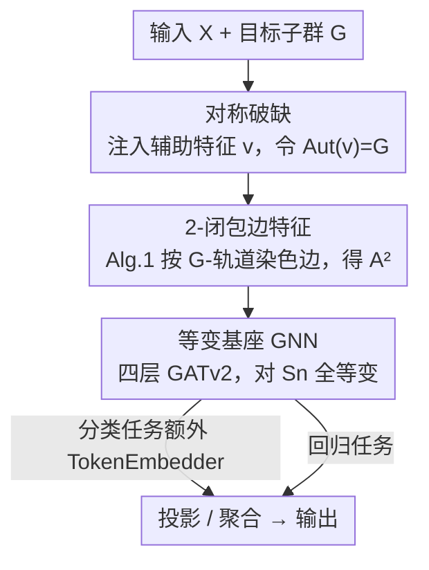

# Any-Subgroup Equivariant Networks via Symmetry Breaking

**会议**: ICLR 2026  
**OpenReview**: [https://openreview.net/forum?id=jz3d7nvtGz](https://openreview.net/forum?id=jz3d7nvtGz)  
**代码**: https://github.com/amgoel21/perm_equivariance_graph_formulation  
**领域**: 等变网络 / 几何深度学习  
**关键词**: 等变网络, 对称破缺, 置换子群, 2-闭包, 图神经网络

## 一句话总结
本文提出 ASEN（Any-Subgroup Equivariant Network），用一个对大群等变的基座网络 + 一个"自对称群恰好等于目标子群"的破缺输入，让**单个网络**通过切换辅助输入就能等变到任意置换子群，并用 2-闭包给出高效近似算法，在图、图像的对称选择以及序列多任务/迁移学习上同时超过分立的等变模型和单个非等变模型。

## 研究背景与动机

**领域现状**：把对称性当作归纳偏置（即"等变性"）是几何数据上提升泛化的经典做法——GNN/DeepSets 对置换等变、CNN 对平移等变、原子势模型对欧氏群等变。每类对称都有专门设计的等变层。

**现有痛点**：这些等变架构有两个根本性的"死板"：(I) 每来一种新对称，就要重新推导、实现一套群专属的等变层，工程和研究成本极高；(II) 一个等变模型通常只对**一个**群等变，而且不同对称下的架构差异巨大，导致它无法在"对称不同"的领域间迁移知识——这恰恰挡死了基础模型（foundation model）范式在等变学习上的落地：你没法做一个能同时、灵活处理多种对称数据的多模态基础模型。

**核心矛盾**：等变架构的"约束强度"与"灵活性"互相打架。约束越死（对称群越大、层越专用），越没法表达只对某个**子群**等变、对其补集不等变的函数；想灵活就得放松约束，但放松又没有现成、统一的办法。

**本文目标**：造一个**单一**模型，只靠"调一个辅助输入特征"就能在多个置换子群之间切换等变性，同时保持理论上正确的等变性与表达力。

**切入角度**：作者反过来想——与其为每个子群 $G$ 从头设计等变层，不如从一个**对更大的群 $\mathcal{G}$ 等变**（约束过强）的基座网络出发，再往输入里**注入一个破缺特征 $v$**，让 $v$ 把 $\mathcal{G}\setminus G$ 里的对称破掉、只留下 $G$。一个大家天天用却没意识到的例子就是 Transformer 的位置编码：正弦位置编码每个分量都不同，自对称群是平凡群，于是它把置换对称**彻底**破掉了；如果让 $v$ 有非平凡的自对称，就能**保留一部分**对称。

**核心 idea**：让破缺输入 $v$ 的自对称群（automorphism group）恰好等于目标子群，即 $\mathrm{Aut}(v)=G$，则 $f_\theta(x)=h_\theta(x,v)$ 自动对 $G$ 等变；又因为精确构造 $v$ 计算上不可行，改用 **2-闭包** 做近似破缺，并落到 $K=2$ 的边特征上用 GNN 实现。

## 方法详解

### 整体框架

ASEN 要解决的是"一个网络等变到任意子群"。整条管线可以这样转：拿一个**对大群 $\mathcal{G}=S_n$（全体置换）等变**的基座 GNN —— 它过度约束，只能表达对所有置换都等变的函数；再额外喂进一个破缺输入 $v$（这里实现成图的位置/边特征），$v$ 的自对称群被构造成目标子群 $G$；于是合成模型 $f_\theta(x)=h_\theta(x,v)$ 就只对 $G$ 等变。要换一个子群，只需换一个 $v$，基座网络一字不改。

破缺输入怎么来？理论上要让 $\mathrm{Aut}(v)=G$ 精确成立，可能需要阶数高达 $K\le n$ 的超图，计算上不可行。本文固定 $K=2$（即普通带权图的边），用 **Algorithm 1** 把节点对按 $G$-轨道染色：同一 $G$-轨道里的节点对赋同一边特征。这样得到的边特征 $A^{(2)}$，其自对称群正好是 $G$ 的 **2-闭包** $G^{(2)}$（满足 $G\le G^{(2)}$，很多群还有 $G=G^{(2)}$）。落地架构（图 2）很朴素：`EdgeEmbedder` 调用 Algorithm 1 算边轨道并学其嵌入，`TokenEmbedder` 把离散节点特征映射成 token（分类任务用），中间是四层 GATv2 消息传递，最后投影/聚合输出。

### 关键设计

**1. 对称破缺：把"对大群等变"收缩成"对子群等变"**

这一招直接打掉痛点 (I)（每种对称都要重造架构）：你只需提供一个新输入 $v$，不用动基座网络。形式上，取一个对大群 $\mathcal{G}$ 等变的"提升"函数 $h_\theta:\mathcal{X}\times\mathcal{V}\to\mathcal{Y}$，满足 $h_\theta(gx,gv)=g\,h_\theta(x,v),\ \forall g\in\mathcal{G}$。再找一个破缺输入 $v$ 使其自对称群 $\mathrm{Aut}(v)=\{g\in\mathcal{G}:gv=v\}=G$，定义 $f_\theta(x)=h_\theta(x,v)$。它对 $G$ 等变是因为对任意 $g\in G$：

$$f_\theta(gx)=h_\theta(gx,v)=h_\theta(gx,gv)=g\,h_\theta(x,v)=g\,f_\theta(x),$$

其中第二个等号用了 $g\in\mathrm{Aut}(v)\Rightarrow gv=v$，第三个等号用了 $h_\theta$ 的 $\mathcal{G}$-等变。反过来，若 $g\in\mathcal{G}\setminus G$ 且 $h_\theta$ 对输入 $v$ 是单射，则 $gv\neq v$ 会让等式破裂，从而 $f_\theta$ **恰好**只对 $G$ 等变、不对补集等变（Prop. 1）。这比"近似等变/软等变"那一类把约束当先验、对称会泄漏的做法更干净——它给出的是精确子群等变性。

**2. 2-闭包近似破缺：用 $K=2$ 边特征绕开"找 $v$ 是 NP 难"**

设计 1 漂亮，但"找一个自对称群恰为 $G$ 的输入"计算上很硬，精确实现可能要超高阶超图。本文的关键工程突破是**退而求其次**：把破缺对象建成超图 $H=(A^{(1)},\dots,A^{(K)})$（$A^{(1)}$ 是节点位置编码、$A^{(k\ge2)}$ 是超边特征），其自对称群 $\mathrm{Aut}(H)=\{P\in S_n: P^{\otimes k}A^{(k)}=A^{(k)}\}$；固定 $K=2$ 时它退化为标准图自对称群 $\{P:PA^{(1)}=A^{(1)},\,PA^{(2)}P^\top=A^{(2)}\}$。Algorithm 1 用 SymPy 直接算：把 $G$ 的生成元提升到作用在 $n^2$ 个节点对上的置换、构成对角子群 $\Delta(G)$、求其轨道，即可给每条边按 $G$-轨道上色（$A^{(2)}_{ij}=A^{(2)}_{mn}\iff (i,j)\sim_G(m,n)$）。这样得到的 $\mathrm{Aut}(A^{(2)})$ 正是 $G$ 的 **2-闭包** $G^{(2)}$——一个"贴着 $G$"的群，满足 $G\le G^{(2)}$；当 $G$ 是"全 2-闭"的群（如某些有限幂零群）时 $G=G^{(2)}$ 精确成立。预处理代价仅 $O(rn^2)$（$r$ 是生成元个数）。当 $G<G^{(2)}$ 时会多引入对称、产生群失配，可借 Huang et al. 2023 的近似-泛化权衡来分析。

**3. 表达力与普适性：ASEN 不止"能等变"，还"够强"**

光有正确等变性还不够，得证明这套破缺方案不会牺牲表达力。本文给了两层保证。其一（Lemma 1），当基座是单层 MPNN、且边更新 $\psi_e$、节点更新 $\phi$、边多重集聚合 $\tau$ 都是单射、节点特征互异时，$h_\theta$ 对 $S_n\setminus G$ 中的置换**不**等变——即拿到的是"正确"等变性（这些单射条件与 MPNN 达到 1-WL 表达力的充分条件如出一辙）。其二，ASEN 能以任意精度逼近一阶 $G$-等变 MLP（Thm. 1，$K=2$ + MPNN 即可），且**普适性可继承**：若基座族 $f_\theta$ 在 $\mathcal{G}$-等变函数空间上普适，则固定破缺输入 $H$ 后的 $f_\theta(\cdot,H)$ 在 $G$-等变函数空间上同样普适（Thm. 2）。换句话说，基座有多强，子群模型就有多强。

**4. 单一主干跨任务共享：把对称当作可迁移的结构知识**

设计 1–3 让"一个网络对任意子群等变"成立，本文进一步把它用成"对称感知的基础模型雏形"。因为基座 GNN 与对称无关、只有 `EdgeEmbedder`/`TokenEmbedder` 是任务专属的轻量模块，所以**同一套主干权重可以在多个任务间共享**：多任务训练时随机从各任务采 batch、均衡更新；迁移学习时先在一组带不同对称的任务上联合预训练，再在新任务上微调（微调时压低主干学习率、放开嵌入层）。更妙的是，由于 `EdgeEmbedder` 是可学习的，当指定的 $G^{(2)}$ 比真实目标群**小**时，模型还能**从数据里发现**缺失的对称（实验里从 $(S_{n/2})^2$ 训出了额外的 $S_2$ 棋盘格结构）。

### 一个完整示例

以 4 节点路径上的镜像对称 $G=S_2$ 为例（图 1）：序列 `[1,2,3,4]` 在镜像下应满足节点 1↔4、2↔3。Algorithm 1 把生成元（这个对换）提升到节点对上、求轨道，于是边特征 $A^{(2)}$ 里 $(1,2)$ 和 $(4,3)$ 被染成同一类、位置特征 $A^{(1)}$ 也按对称配对。把这套 $(A^{(1)},A^{(2)})$ 喂给对 $S_4$ 全等变的 GNN 基座，得到的模型就只对这个镜像 $S_2$ 等变。换成 $G=S_{n/2}\times S_{n/2}\times S_2$（前后两半各自可置换 + 整体可镜像），只要重跑 Algorithm 1 得到对应的边/位置染色即可——基座网络完全不变。

## 实验关键数据

实验围绕两问：Q1 单任务下能否用一个架构探索不同对称、看群选择的影响；Q2 能否跨任务利用共享对称结构，在多任务/迁移学习里超过任务专属等变模型和非等变基线。

### 主实验

**人体姿态估计（Human3.6M，P-MPJPE↓）**：单个 ASEN 通过切换骨架边的自对称群，复现了 Huang et al. 2023 需要多个分立等变 MLP 才能得到的结果；"弱稀疏"边构造常给出最强结果，体现一个模型同时承载多套对称的灵活性。

| 对称群 | 全连接 | 稀疏 | 弱稀疏 |
|--------|--------|------|--------|
| $I$（无等变） | 34.71 | **33.39** | 34.75 |
| $S_2$（左右镜像） | 39.48 | 40.52 | 38.80 |
| $S_2^2$ | 43.24 | 42.37 | 40.67 |
| $S_2^6$ | 47.54 | 49.45 | 46.52 |

**交通流预测（METR-LA，MAE↓）**：在节点位置特征上编码不同群结构，选**比全置换更小**的合适对称能超过全置换对称，也优于 DCRNN（$S_n$，2.77）。

| 模型 / 群 | MAE |
|-----------|-----|
| 全连接, $S_{n_1}\cdot S_{n_2}$ | 2.72 |
| 稀疏, $S_{n_1}\cdot S_{n_2}$ | **2.69** |
| 全连接, $S_{n_1}\cdots S_{n_9}$ | 2.79 |
| 稀疏, $S_{n_1}\cdots S_{n_9}$ | 2.77 |
| DCRNN, $S_n$ | 2.77 |

**Pathfinder-64（Transformer 局部对称，Acc↑）**：把同一 $p\times p$ patch 内像素共享位置向量，相当于在 patch 内保留置换对称、patch 间区分。相比 1D-PE（$G=I$，0.656）和 2D-PE（$G=I$，0.818），局部对称变体 $G=(S_4)^{1024}$ 达 0.824、$G=(S_9)^{455}$ 达 0.827，且略微减少参数量。

### 消融 / 分析实验

**合成序列任务（多任务 & 迁移）**：在 Intersect / Cyclic Sum / Palindrome 等任务（各对应一个置换子群，见 Tab. 3）上：

| 配置 | 关键发现 |
|------|----------|
| 正确群 vs 非等变 | 带正确对称的等变模型在所有任务上收敛更快、loss 更低（Fig. 4） |
| 误设小群 $(S_{n/2})^2$ vs 真群 $(S_{n/2})^2\times S_2$ | 训练后边权收敛到棋盘格，**从数据中自动发现** $S_2$ 对称（Fig. 5） |
| 多任务 $n_{task}=3$ vs 单任务 | 低数据（$r\le1.0$ unit）下 Intersect 收敛与测试精度显著提升；Cyclic Sum/Palindrome 收益不明显 |
| 增加任务数 $n_{task}\in\{4,5,6\}$ | 低数据下更多任务更好，但随训练规模增大收益递减 |
| 迁移：预训练 vs 从头训（0.15 unit） | 预训练 ASEN 泛化显著更好；不变设定下带正确对称的预训练优于平凡对称（Fig. 7/8） |

### 关键发现
- **群选择是一个可调旋钮**：同一架构下，"选对子群"比"用最大对称（全置换）"或"无对称"都更好——交通预测里更小的群反而赢，姿态估计里弱稀疏 + 适当镜像群最优。
- **对称可以被当作可迁移知识**：共享对称结构的任务做多任务/迁移时，等变主干在低数据下收益最大；但收益随数据量增大而递减，存在"训练规模 vs 任务数"的实际权衡。
- **可学习边嵌入能补救误设**：当指定群偏小（$G^{(2)}<G$）时模型还能从数据学回缺失对称；反过来若 $G^{(2)}$ 比 $G$ 大很多，则会失败（App. C.5）。

## 亮点与洞察
- **位置编码的统一视角**：把 Transformer 位置编码解释为"自对称群为平凡群的破缺输入"，一下把"位置编码"和"等变设计"接到同一框架下——保留部分对称只需让 $v$ 的自对称非平凡，这个再诠释很优雅。
- **2-闭包是点睛之笔**：精确破缺是组合难题，作者用群论里的 2-闭包 $G^{(2)}$ 把它降到 $O(rn^2)$ 的边轨道计算，且对"全 2-闭"群还精确，是把抽象群论工具用进深度学习的漂亮一例。
- **"换 $v$ 不换网络"的解耦**：对称由辅助输入承载、表达力由基座承载，二者解耦后才有可能做"对多种对称统一的基础模型"，这个工程抽象可迁移到点云（O(3)→O(2)）等非置换场景。

## 局限与展望
- **只建模全局对称**：当前 $v$ 对整个输入全局作用，分子图等需要**局部对称**的场景尚未覆盖（作者列为下一步）。
- **破缺输入与输入无关**：$v$ 对所有样本固定，input-dependent 的破缺（如图生成、物理建模里更灵活的破缺）未纳入。
- **群失配的代价**：$G<G^{(2)}$ 会引入多余对称，$G^{(2)}\gg G$ 时直接失效；对"对称误设"的鲁棒性与缩放行为仍需系统研究。
- **主要落在 $K=2$ / 置换子群**：高阶超图（$K>2$）与置换之外的群（如连续群在图特征上的实现）只有理论提示，未充分实证。

## 相关工作与启发
- **vs Blum-Smith et al. 2025 / Ashman et al. 2024 / Lim et al. 2024（子群等变 + 辅助输入）**：这些工作也用"破缺辅助输入"造子群等变模型，但都局限于**单任务**；本文给出可跨任务复用的统一配方，并把 2-闭包近似算法和多任务/迁移系统化。
- **vs Smidt et al. 2021 / Lawrence et al. 2024（输入相关破缺）**：他们做的是 input-dependent 破缺、且通常只针对单个群；ASEN 对所有输入**统一破缺**，并用不同 $v$ 适配不同应用，目标是"一个模型多种对称"。
- **vs 近似/自适应等变（Wang 2022 / Huang 2023 / Finzi 2021）**：那一类把等变约束软化成先验或按任务自适应；ASEN 走"精确子群等变 + 2-闭包近似破缺"路线，等变性可证明，近似只发生在 $G\to G^{(2)}$ 这一步且可分析。

## 评分
- 新颖性: ⭐⭐⭐⭐⭐ 用"破缺输入 + 2-闭包"把任意置换子群等变统一进一个网络，并接上基础模型范式，视角新颖。
- 实验充分度: ⭐⭐⭐⭐ 覆盖图/图像/序列与多任务/迁移多设定，但多为合成或中小规模任务，缺大规模/分子等真实硬场景验证。
- 写作质量: ⭐⭐⭐⭐⭐ 理论（Prop/Lem/Thm）与算法、图例、实验衔接清晰，位置编码的统一诠释讲得很透。
- 价值: ⭐⭐⭐⭐ 为"对称灵活、可迁移的等变基础模型"提供了干净的框架与可落地算法，方向价值高。

<!-- RELATED:START -->

## 相关论文

- [\[ICML 2026\] Identifiable Equivariant Networks are Layerwise Equivariant](../../ICML2026/others/identifiable_equivariant_networks_are_layerwise_equivariant.md)
- [\[AAAI 2026\] Faster Certified Symmetry Breaking Using Orders With Auxiliary Variables](../../AAAI2026/others/faster_certified_symmetry_breaking_using_orders_with_auxiliary_variables.md)
- [\[ICLR 2026\] Breaking Gradient Temporal Collinearity for Robust Spiking Neural Networks](breaking_gradient_temporal_collinearity_for_robust_spiking_neural_networks.md)
- [\[ICLR 2026\] A Single Architecture for Representing Invariance Under Any Space Group](a_single_architecture_for_representing_invariance_under_any_space_group.md)
- [\[NeurIPS 2025\] On Universality Classes of Equivariant Networks](../../NeurIPS2025/others/on_universality_classes_of_equivariant_networks.md)

<!-- RELATED:END -->
