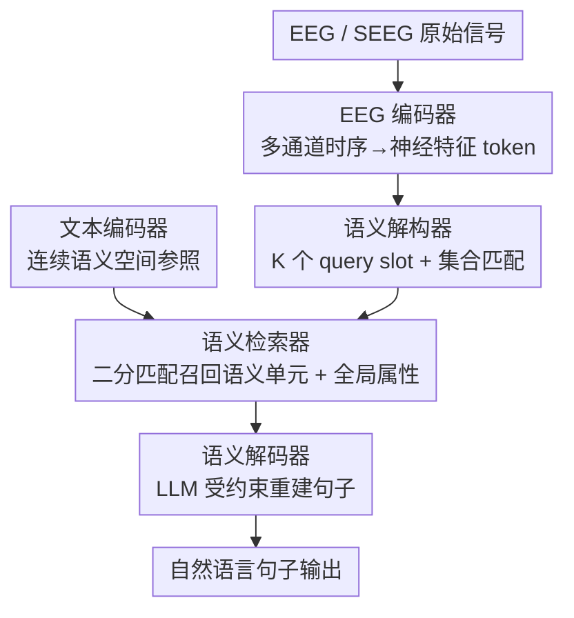

# Assembling the Mind's Mosaic: Towards EEG Semantic Intent Decoding

**会议**: ICLR2026  
**OpenReview**: [https://openreview.net/forum?id=8OgJ2uhiu8](https://openreview.net/forum?id=8OgJ2uhiu8)  
**代码**: 待确认  
**领域**: 脑机接口 / EEG 解码 / 神经科学应用  
**关键词**: EEG 语义解码, 脑机接口, 集合匹配, 连续语义空间, LLM 重建

## 一句话总结
本文提出语义意图解码框架 SID，把"脑信号→语言"重新定义为先把 EEG/SEEG 解码成一组无序的语义单元、再在连续语义空间里检索、最后用 LLM 重建成句子，并给出具体实现 BrainMosaic，在多语种 EEG 与临床 SEEG 数据上的概念级与句子级指标都大幅超过分类式和端到端生成式基线。

## 研究背景与动机
**领域现状**：脑机接口（BCI）想帮失语、闭锁综合征患者绕过受损的发声/书写通路，直接把脑活动翻译成语言。现有路线大致两类：一是**语音解码**（Speech Decoding），从运动相关皮层重建说出来或想象的语音，但只覆盖了大脑语言网络中很小一块运动区，又依赖音素级重建，跨语言能力差；二是**概念解码**（Concept Decoding），直接从分布式神经活动里抽取想表达的"意思"。

**现有痛点**：概念解码自身又分裂成两套都不理想的做法。第一套把它当成**固定类别分类**——预先定义一批概念/话题标签，简单但极其僵硬，离散标签根本装不下意义那种连续、可重叠的本性，常常和真实交流意图对不上。第二套把神经信号直接映射进大语言模型（LLM）的隐空间做**端到端生成**，表达力上去了，却要海量配对的"神经-语言"数据，而且是黑箱，缺乏可解释性与科学透明度，输出难以验证和控制。

**核心矛盾**：可解释性与表达力之间存在 trade-off——分类法可解释但表达力弱，端到端生成法表达力强但不可解释。问题根源在于这两种表征都没抓住"意义"在大脑里的真实组织方式：意义既不是单个离散标签，也不是一团不可拆的隐向量。

**本文目标**：找到一种既可解释、又有开放词表表达力的概念解码表征，并把它落地成一个能从 EEG 真正解码出连贯句子的系统。

**切入角度**：作者把"语义意图"（Semantic Intent）定义为**一组核心语义单元的柔性集合**——例如"我每天吃苹果"可表示为集合 $\{我, 吃, 苹果, 每天\}$。这一视角同时呼应语言学与认知神经科学三条证据：意义是组合性的（Compositionality）、语义空间是连续可扩展的（Continuity & Expandability）、重建必须忠实（Fidelity）。

**核心 idea**：用"先把脑信号解构成一组无序语义单元、再在连续语义空间检索、最后用 LLM 受约束重建句子"的三段式管线，取代"固定分类"或"无约束生成"，让解码既透明又能开放词表表达。

## 方法详解

### 整体框架
BrainMosaic 是 SID 框架的具体实现，要解决的是"如何把一段 EEG/SEEG 信号变成一句忠实于原意、又语法通顺的自然语言"。它沿三条 SID 原则串成五个组件、三阶段管线：**EEG 编码器**把多通道时序信号编成一组神经特征 token；**语义解构器**（Semantic Decomposer）借助一组可学习 query 产出 $K$ 个候选 slot，每个 slot 代表一个潜在语义单元；**文本编码器**（Text Encoder）提供参照用的连续语义空间（单元级嵌入 + 句子级目标）；**语义检索器**（Semantic Retriever）通过二分匹配把每个 slot 对齐到该空间里的真实语义单元，同时预测全局意图属性；**语义解码器**（Semantic Decoder）把检索到的单元集组织成结构化 prompt，交给 LLM 重建成句。整个网络以组合损失端到端训练；推理时信息从 EEG 一路流经五个组件，最终输出连贯且语义忠实的句子。

### 关键设计

**1. 语义解构器：用集合匹配把脑信号拆成无序、不定长的语义单元**

针对"固定分类装不下意义、又不该强加词序"的痛点，本文按组合性原则（Principle 1）把意图建模成一个无序、无重复、大小可变的集合 $S=\{u_1,\dots,u_n\}$。心理语言学证据支撑这一近似：阅读并非严格串行、读者优先抓语义要旨而非精确词序，工作记忆也只能同时维持有限"块"，所以短句的核心意义在适度换序下仍可保持。BrainMosaic 因此把 EEG 特征解码成固定 $K$ 个 query slot（$K$ 取数据集中单句语义单元的上界），实际激活数 $1\le n\le K$ 自由变化。借鉴 DETR 的集合式目标检测思路，它用**二分（匈牙利）匹配**处理这种不定长、无序的目标：训练时每个真值单元唯一匹配到至多一个预测 slot，未匹配 slot 被指派为特殊的"no-object"类。最优匹配与训练损失为

$$\hat{\sigma}=\arg\min_{\sigma\in S_K}\sum_{i=1}^{K}\mathcal{L}_{\text{match}}(y_i,\hat{y}_{\sigma(i)}),\qquad \mathcal{L}_{\text{Hungarian}}(y,\hat{y})=\sum_{i=1}^{K}\mathcal{L}_{\text{match}}(y_i,\hat{y}_{\hat{\sigma}(i)})$$

这样无论语义单元的顺序和数量如何，监督信号都稳定，从而同时获得置换不变性与有界基数——这正是分类式（单标签）和序列式（强加词序）都做不到的。

**2. 语义检索器：在连续语义空间里对齐与召回，换来开放词表的泛化**

针对"离散标签无法表达连续、可扩展语义"的痛点，本文按连续性原则（Principle 2）把语义单元解码进一个开放连续空间 $V\subset\mathbb{R}^d$，相近概念在空间里也相近、相似度与嵌入距离成反比，从而支持基于相似度的检索并平滑泛化到新概念。该空间直接用大规模预训练 LLM 的嵌入空间（默认 doubao-embedding-large）实例化。检索器在二分匹配框架下给每个 slot 算一个匹配损失 $\mathcal{L}_{\text{match}}$，由两项组成——让预测嵌入 $\hat{y}$ 在余弦相似度上靠近目标词嵌入 $E(u)$ 的**语义对齐项**，以及区分"激活单元 vs no-object"的 **slot 活跃度分类项**：

$$\mathcal{L}_{\text{match}}\big(E(u),\hat{y},t,\hat{p}\big)=t\big(1-\text{sim}(E(u),\hat{y})\big)+\lambda_{\text{cls}}\big(-t\log\hat{p}-(1-t)\log(1-\hat{p})\big)$$

其中 $t\in\{0,1\}$ 是匹配指示符、$\hat{p}$ 是预测的活跃概率。与此并行，检索器还预测一个全局嵌入 $\hat{s}$，对齐真值句子嵌入 $E(s)$ 并经多个分类头预测全局属性（如语气、主观性），用全局损失 $\mathcal{L}_{\text{global}}$ 把 token 级信息和句子级高层属性整合：

$$\mathcal{L}_{\text{global}}(E(s),\hat{s},Z,\hat{Z})=\big(1-\text{sim}(E(s),\hat{s})\big)+\lambda_{\text{attr}}\sum_{c=1}^{C}\text{CE}(z^{(c)},\hat{z}^{(c)})$$

检索器总损失 $\mathcal{L}_{\text{retriever}}=\mathcal{L}_{\text{Hungarian}}+\lambda_{\text{global}}\cdot\mathcal{L}_{\text{global}}$。因为检索发生在连续空间，即便缺乏精确匹配，模型也能召回语义相近的替代词，这是面对成千上万词表时离散分类做不到的可扩展性来源。

**3. 语义解码器：用 LLM 把召回的语义单元受约束地重组成忠实句子**

针对"端到端生成不可控、易漂移"的痛点，本文按忠实性原则（Principle 3）让解码既语义落地（输出受解码单元约束、不跑偏到无关词）又语言通顺（语法合理）。检索器对每个 slot 在整个语义空间检索，返回带概率（反映重要性）的候选单元，汇成最终召回集 $S_{\text{retrieved}}=\{u_{1'},\dots,u_{m'}\}$ 及概率 $\{p_1,\dots,p_m\}$；再把这些 token 级候选与全局句子属性 $Z$（句型、语气等）拼成结构化 prompt，交给 LLM $G$ 生成：

$$\text{Prompt}=P(S_{\text{retrieved}},Z),\qquad T=G(\text{Prompt})$$

LLM 在这里扮演"逆向语义解构"的角色——把离散单元缝合成流畅句子，且因为生成被解码出的语义单元锚住，输出对召回噪声更鲁棒、也比无约束生成更可解释（中间的语义单元是透明的可验证产物）。

### 损失函数 / 训练策略
整个网络端到端联合优化：语义解构器/检索器侧用确定性的二分匹配产生稳定监督，损失为 token 级匈牙利损失 $\mathcal{L}_{\text{Hungarian}}$ 加全局监督 $\mathcal{L}_{\text{global}}$（含全局对齐与多属性分类，由 $\lambda_{\text{global}},\lambda_{\text{attr}},\lambda_{\text{cls}}$ 平衡）。文本编码器提供参照语义空间，神经特征、语义 slot 与语言目标在统一目标下被联合塑形。LLM 解码阶段在推理期工作（默认 GPT-4o-mini，对每条样本生成 5 个候选句并报告平均 SRS）。所有实验均为受试者内（in-subject）评测。

## 实验关键数据

### 主实验
在三个公开多语种 EEG 数据集（Chisco 中文日常、ChineseEEG-2 中文文学、ZuCo 英文，并细分 SR/NR/TSR 三种阅读条件）和一个私有临床 SEEG 数据集上评测。鉴于连续开放词表空间下 BLEU/ROUGE 等 n-gram 指标不合适，作者设计了三个基于嵌入的指标：**UMA**（Unit Matching Accuracy，相似度超阈值 $\tau$ 才算对的硬概念正确率）、**MUS**（Mean Unit Similarity，单元相似度均值的软对齐度，并定义理论下界 MUSexp 表征语料语义密度）、**SRS**（Sentence Reconstruction Similarity，生成句与参照句嵌入的余弦相似度），另报 BERTScore-F1。

| 数据集 | 指标 | BrainMosaic | 最强基线 | 说明 |
|--------|------|------------|----------|------|
| Clinical | UMA | **0.6596** | 0.1786 (Seq-Decode) | 概念级硬正确率，约 3.7× |
| Clinical | MUS | **0.8124** | 0.6739 (Multi-Cls) | 概念级软对齐 |
| Clinical | SRS | **0.6651** | 0.5976 (Cls-Align) | 句子级语义忠实 |
| Chisco | UMA | **0.5617** | 0.0301 (Seq-Decode) | 约 18× |
| Chisco | SRS | **0.6206** | 0.5439 (Seq-Decode) | — |
| ZuCoSR | UMA | **0.7506** | 0.0451 (Seq-Decode) | 英文阅读，约 16× |
| ZuCoSR | SRS | **0.6982** | 0.5211 (Neuro2Semantic) | — |

所有数据集上 BrainMosaic 在四项指标全部领先，且对最强基线的双侧 t 检验均 $p\le 0.001$（标 ***）。概念级 UMA 的提升最为悬殊——分类式 Multi-Cls 的 UMA 普遍在 0.01~0.04 量级、接近随机，序列式 Seq-Decode 也只有 0.03~0.18，说明把意图建模成无序集合的关键作用。

### 消融实验

| 配置 | UMA (Clinical) | MUS (Clinical) | SRS (Clinical) | 说明 |
|------|---------------|----------------|----------------|------|
| Full Model | 0.6596 | 0.8124 | 0.6651 | 完整模型 |
| w/o Set | 0.0792 | 0.7052 | 0.5721 | 去集合解构器：直接对齐句嵌入，UMA 崩塌 |
| w/o ContSpace | 0.0137 | 0.6393 | 0.4604 | 去连续空间：退化成多标签分类，最差 |
| w/o LLM | 0.6596 | 0.8124 | 0.5456 | 去 LLM 重建：单元不变但句子 SRS 明显下降 |

### 关键发现
- **连续空间是地基**：去掉连续语义空间（w/o ContSpace）后模型退化为多标签分类器，UMA 从 0.66 直接掉到 0.01，是掉点最狠的消融，证明"在连续空间检索"才是开放词表表达力的来源。
- **集合解构决定概念级正确率**：去掉集合解构器（w/o Set）后 UMA 从 0.66 掉到 0.08——只能对齐句子级嵌入时，纠缠的句义缺乏语义单元那种结构化组织。
- **LLM 主要管句子级忠实**：w/o LLM 时语义单元（UMA/MUS）不变、只有 SRS 下降，说明解码出的单元信息量足但是碎片化，LLM 负责把碎片缝成连贯句子。
- **开放词表与可扩展性**：把检索词表从基础扩到 +30000 个未见高频词时 UMA 仅小幅下降、MUS/SRS 基本稳定甚至略升（缺精确匹配时召回语义近邻替代）；MUS 在 MUSexp（随词表密度上升的随机期望）增大时仍保持稳定，说明检索靠真实语义结构而非随机邻近；训练数据从 10% 提到 100% 时性能一致提升，且不损害已学单元。

## 亮点与洞察
- **把"意义"重定义为无序集合，再借 DETR 集合匹配落地**：这是全文最"啊哈"的迁移——目标检测里"图中有几个物体、什么顺序无所谓"的二分匹配，恰好对上"一句话由几个语义单元构成、顺序可松弛"的脑信号解码，一举绕开了固定分类的僵硬和序列建模强加的词序。
- **可解释性来自透明的中间语义单元**：相比端到端把 EEG 灌进 LLM 隐空间的黑箱，本文的语义单元集是人能读、能验证、能控制的中间产物，把"可解释 vs 表达力"的二选一变成了兼得。
- **用 LLM 嵌入空间当解码目标**：直接拿预训练 LLM 的语义流形作为"连续语义空间"，既免去自建空间，又天然支持开放词表的相似度检索，这个把神经解码"挂靠"到现成语义流形的思路可迁移到其他跨模态对齐任务。

## 局限与展望
- **受试者内评测**：所有实验均为 in-subject，跨受试者/跨被试泛化（真实临床更关心的设置）未充分检验。
- **临床 SEEG 仅一名被试**：私有侵入式数据只有 1 名参与者、515 句日常中文，统计代表性有限。
- **"集合近似"对长难句的边界**：把句子拆成近似置换不变的语义单元，对短句成立，但长句被切成多个语义意图后单元间的精确语序/语法关系如何保证仍依赖 LLM 重建，存在漂移风险。
- **依赖外部 LLM 与其嵌入**：连续空间与重建都绑定特定 LLM（doubao 嵌入、GPT-4o-mini 生成），换模型的稳健性虽在附录有验证，但部署时仍是外部依赖。

## 相关工作与启发
- **vs 固定分类（Cls-Align / Multi-Cls）**: 他们给整句指派单个预定义话题或预测 top-k 离散标签，本文改成在连续空间检索无序语义单元；区别在于离散标签装不下连续重叠的意义，本文 UMA 高出一两个数量级，优势是开放词表与可扩展，代价是需要一个高质量语义嵌入空间。
- **vs 端到端生成（Neuro2Semantic）**: 他们把 EEG 直接映射进文本嵌入空间做无约束生成，本文先解码出透明的语义单元再受约束重建；本文优势是可解释、对召回噪声鲁棒、不受预训练生成器语言（仅英文）限制，劣势是多了检索/匹配阶段、流程更复杂。
- **vs 序列解码（Seq-Decode）**: 他们用 LSTM 预测有序语义单元序列，本文用集合匹配；强加词序反而约束了 EEG 能表达的语义意图，导致更低的 UMA/MUS 与更不连贯的输出。

## 评分
- 新颖性: ⭐⭐⭐⭐⭐ 把脑信号解码重构成"无序语义单元集合 + 连续空间检索 + LLM 受约束重建"，并用集合匹配落地，范式层面的创新
- 实验充分度: ⭐⭐⭐⭐ 覆盖多语种 EEG + 临床 SEEG、设计了贴合连续空间的三项指标、消融与可扩展性实验扎实；扣分在受试者内、临床仅 1 被试
- 写作质量: ⭐⭐⭐⭐⭐ 三原则↔三阶段↔五组件的对应清晰，方法与动机环环相扣
- 价值: ⭐⭐⭐⭐ 为可解释、开放词表的 BCI 语言解码提供了可落地范式，对失语/闭锁患者沟通有现实意义

<!-- RELATED:START -->

## 相关论文

- [\[ICLR 2026\] Learning Structure-Semantic Evolution Trajectories for Graph Domain Adaptation](learning_structure-semantic_evolution_trajectories_for_graph_domain_adaptation.md)
- [\[AAAI 2026\] CAE: Hierarchical Semantic Alignment for Image Clustering](../../AAAI2026/others/hierarchical_semantic_alignment_for_image_clustering.md)
- [\[ACL 2025\] S3 - Semantic Signal Separation](../../ACL2025/others/s3_-_semantic_signal_separation.md)
- [\[ACL 2025\] Decoding Reading Goals from Eye Movements](../../ACL2025/others/decoding_reading_goals_from_eye_movements.md)
- [\[ACL 2025\] Theoretical Guarantees for Minimum Bayes Risk Decoding](../../ACL2025/others/theoretical_guarantees_for_minimum_bayes_risk_decoding.md)

<!-- RELATED:END -->
