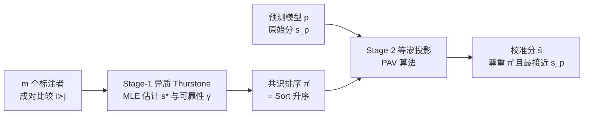

# AtC: Aggregate-then-Calibrate for Human-centered Assessment

**会议**: ICLR 2026  
**OpenReview**: [https://openreview.net/forum?id=XNbVoi9mfr](https://openreview.net/forum?id=XNbVoi9mfr)  
**代码**: 待确认  
**领域**: 人本评估 / 评分聚合与校准  
**关键词**: 人本评估, 排序聚合, 等渗回归, 标注者异质性, 单调投影  

## 一句话总结
AtC 提出"先聚合、再校准"两阶段框架：先用考虑标注者可靠性的异质 Thurstone 模型把人的成对比较聚成一个共识排序，再把任意预测模型的打分通过等渗投影对齐到这个排序上，从而在没有可验证真值时同时拿到"人给的可靠次序"和"模型给的一致量纲"。

## 研究背景与动机
**领域现状**：在外卖配送工作量估计、会议论文质量评审等"人本评估"任务里，真值要么代价高昂、要么要等多年后才显现，决策时根本拿不到 ground truth，只能依赖人的判断或模型的预测。

**现有痛点**：两类方法各有死穴。只用人判断的评分聚合算法虽能按专长给标注者加权，却被不一致的打分量纲污染——一个宽松的专家和一个严苛的新手可能对相对优劣意见一致，但绝对分数差很多。只用模型打分的方法则陷入"监督危机"：真值常与难以大规模测量的潜在因素（如认知负荷）相关，模型只能从带噪代理标签学习，把系统性偏差传进评估里。

**核心矛盾**：人判断容易获取但缺乏统一标尺，模型预测量纲一致但需要监督信号——两者优势恰好互补，却长期被割裂使用。

**本文目标**：在真值不可观测时，把"人的结构（次序）"和"模型的标尺（量纲）"拼起来，给出一个既尊重人共识排序、又尽量保留模型量化信息的最终打分。

**核心 idea**：作者抓住心理物理学的 Weber–Fechner 规律——**人擅长比较、不擅长绝对打分**。因此只从噪声人输入里抽取**序数信息**（排序），而不信任其原始评分值；再用这个排序去**约束**模型分数的单调性，做"模型无关的校准"。

## 方法详解

### 整体框架
AtC 把问题拆成两步串联。Stage-1 把 $m$ 个标注者对 $n$ 个物品的成对比较，用考虑可靠性的排序聚合模型炼成共识排序 $\hat\pi$；Stage-2 把任意预测模型给出的原始分数 $s_p$ 等渗投影到与 $\hat\pi$ 一致的单调集合上，得到校准分 $\hat s$。最终输出既满足人共识的次序，又在欧氏距离上离模型原分最近。

### 关键设计

**1. 异质 Thurstone 模型做排序聚合：把"标注者不一致"当信号而非噪声。** 不同标注者对同一物品的判断分歧，反映的是专长差异而非主观偏好，所以 AtC 不去过滤新手意见，而是从数据里学每个标注者的精度参数 $\gamma_u$。在 HTM 下，标注者 $u$ 偏好物品 $i$ 胜 $j$ 的概率被建模为 $\Pr\{u: i\succ j\}=F(\gamma_u(s_i-s_j))$，其中 $F$ 是对称 CDF（正态对应 Thurstone、logistic 对应 Bradley–Terry），$\gamma_u$ 越大代表该标注者越可靠、噪声越小。对全体数据的对数似然 $\ell(s,\gamma)=\sum_u\sum_{i\succ j\in D_u}\log F(\gamma_u(s_i-s_j))$ 做 MLE（加上 $\frac1n\sum_i s_i=0$ 之类约束保证可辨识），交替更新 $s$ 和 $\gamma$ 直到收敛，得到共识分 $s^*$，升序排序即共识排序 $\hat\pi$。理论上 Theorem 3.3 证明：当标注者真实可靠性不全相等时，正确指定的 HTM 估计量在 Loewner 序下严格优于错误假设同质性的估计量，即异质建模带来严格更高的统计效率。

**2. 等渗回归做模型无关校准：把模型分"最小侵入"地掰回共识次序。** 拿到 $\hat\pi$ 后，AtC 把模型原始分 $s_p$ 投影到按 $\hat\pi$ 单调不减的集合 $\widehat{\mathcal M}=\{y: y_{\hat\pi(1)}\le\cdots\le y_{\hat\pi(n)}\}$ 上：$\hat s=\Pi_{\widehat{\mathcal M}}(s_p)=\arg\min_{y\in\widehat{\mathcal M}}\|y-s_p\|_2^2$。这是一个等渗回归，用 Pool-Adjacent-Violators（PAV）算法高效求解——沿 $\hat\pi$ 顺序扫描，遇到违反单调的相邻对就取平均压平，直到没有违反。若 $s_p$ 本就符合 $\hat\pi$ 则原样保留，否则以平方误差意义下最小的改动消除次序冲突。注意这里的"校准"不是概率校准，而是强制序数一致性，从而把模型的量纲和人的次序合二为一。

**3. 误差可控 + 严格占优的理论保证：拼起来一定不更差。** 作者给出鲁棒性界 Theorem 3.5，把总期望平方误差分解成三项：Stage-1 排序逆序数 $E[\mathrm{Inv}(\hat\pi,\tilde\pi)]$ 带来的投影误差、零均值有效噪声贡献的统计误差（约以 $(\ln n)/n$ 衰减）、以及系统偏差 $\nu$ 贡献的偏差误差（以 $1/n$ 衰减）；即使排序完美，$\tilde\sigma^2$ 和 $\nu$ 的误差也不会消失，但都可缓解。进一步 Theorem 3.9（最优性保证）证明：以至少 $1-\delta_1-\delta_2$ 的概率有 $\|\hat s-s\|_2^2<\|s_p-s\|_2^2$，即校准输出严格比未校准模型更接近真值；其中 $\delta_1$（排序出错概率）和 $\delta_2$（投影被噪声扰坏概率）都随 Stage-1 样本量增大、真实分数间隔 $\Delta_{\min}$ 压过噪声而趋于 0，改进概率趋于 1。

## 实验关键数据

### 主实验表格（半合成 Reading-Level 数据集，490 文档 / 624 标注者 / 12728 成对判断）

| Stage-1 方法 | Kendall τ↑ (s\*/s_p/ŝ) | Wasserstein↓ (s\*/s_p/ŝ) | KS↓ (s\*/s_p/ŝ) | MSE↓ (s\*/s_p/ŝ) |
|---|---|---|---|---|
| HRA-G | 0.375 / 0.399 / **0.410** | 2.250 / 2.831 / **0.839** | 0.500 / 0.300 / **0.163** | 8.658 / 29.00 / **8.122** |
| HRA-E | 0.375 / 0.399 / **0.403** | 2.243 / 2.831 / **0.827** | 0.498 / 0.300 / **0.163** | 8.658 / 29.00 / **8.191** |
| HRA-N | 0.368 / 0.399 / 0.399 | 2.351 / 2.831 / **0.738** | 0.563 / 0.300 / **0.192** | 8.985 / 29.00 / **7.919** |
| CrowdBT | 0.354 / 0.399 / 0.399 | 2.150 / 2.831 / **0.843** | 0.455 / 0.300 / 0.269 | 8.301 / 29.00 / **7.555** |
| BTL（同质） | 0.340 / 0.399 / 0.373 | 2.186 / 2.831 / **0.894** | 0.461 / 0.300 / 0.300 | 7.764 / 29.00 / 8.097 |

校准分 $\hat s$ 在几乎所有方法、所有指标上压过人共识 $s^*$ 和模型分 $s_p$；尤其 Wasserstein/KS 上 $\hat s$ 把 $s_p$ 的 2.8/0.30 大幅降到 0.7~0.9/0.16 量级（RQ1）。异质模型（HRA、CrowdBT/TCV）的校准结果优于同质模型 BTL/TCV，且校准后异质模型在分布指标上反超 4 个 baseline，验证"优先用 $s^*$ 的排序信息而非数值"的设计正确（RQ2）。

### 真实数据表格（Dots-activity 数据集，300 参与者 / 30 图像 / 8700 成对比较）

| Stage-1 方法 | Kendall τ↑ (ŝ) | Wasserstein↓ (ŝ) | MSE↓ (ŝ) |
|---|---|---|---|
| HRA-G | **0.940** | **2.53** | **9.61** |
| HRA-E | **0.943** | **2.53** | **9.59** |
| GPPL | 0.931 | 64.50 | 4220.36 |
| Rank-SVM | 0.923 | 61.20 | 3814.49 |
| BARCW | 0.940 | 64.62 | 4236.16 |

AtC 把模型分（HRA-E：Wasserstein 2.53、MSE 11.75）进一步校准到 MSE 9.59，远低于 GPPL/Rank-SVM/BARCW 上千的 MSE。

### 关键发现
- **鲁棒性**：人为注入成对逆序时，AtC 在 400 个逆序内 Kendall τ/MSE 平缓退化、仍靠模型信号产出有意义结果；超过约 500 逆序才崩溃（τ 转负、分布塌平）（RQ3、RQ4）。
- **排序 vs 评分**：4 种图像损坏下，用排序校准的 $\hat s$(Rank) 始终优于用聚合评分校准的 $\hat s$(Rate)，实证"排序比评分更可靠"的核心假设（RQ5）。
- 用 OpenCV 轮廓检测作为带噪预测器，在严重图像损坏下 AtC 仍保持高精度，证明把模型分锚定到人共识能有效抵抗噪声（RQ6）。

## 亮点与洞察
- **理论扎实**：三条定理把"异质聚合更高效""校准误差可分解可控""校准严格占优"全部证出来，且 Theorem 3.5 把等渗回归理论推广到"投影到随机锥 + 有偏有效噪声"两个新场景，本身有方法论贡献。
- **模型无关**：Stage-2 对任意 off-the-shelf 预测模型即插即用，无需重训，把"人判断"和"任意模型"解耦组合。
- **直觉清晰**：抓 Weber–Fechner"人擅长比较不擅长打分"这一条心理物理学规律，推出"只用序数、不用数值"的设计，简单且站得住。

## 局限与展望
- **依赖成对比较**：Stage-1 需要足够多且不太corrupted 的成对判断，逆序超过临界阈值（实验中约 500）后校准失效。
- **单调约束的天花板**：等渗投影只能修正违反次序的部分，若模型分本身量纲整体错位但次序对，校准空间有限；且即使排序完美，$\tilde\sigma^2$ 与系统偏差 $\nu$ 的误差仍残留。
- **真值不可观测下的评测**：半合成实验依赖模拟的 ground truth，真实任务里"对不对"本身难以验证，对方法的最终效用评估存在固有困难。

## 相关工作与启发
- **评分聚合**：HTM、CrowdBT、CrowdTCV 等异质排序聚合是 Stage-1 的基础，AtC 的贡献在于证明异质建模的严格效率优势并把它接入校准。
- **等渗回归/校准**：借鉴 Bellec(2018) 的 oracle 不等式与 PAV 算法，但把校准重新定义为"序数一致性投影"而非概率校准。
- **启发**：当真值稀缺/不可验证时，"用人定序、用模型定标尺"是一种通用配方——任何"标注者比较 + 弱监督模型"的场景（众包、LLM-as-judge 的偏好聚合、推荐排序校准）都可借鉴这种"先聚合排序、再单调投影"的解耦思路。

## 评分
- **新颖性**: ⭐⭐⭐⭐ —— "聚合排序 + 等渗校准"的组合简单但视角新，把判断聚合与模型无关校准首次系统桥接，并配三条新理论。
- **实验充分度**: ⭐⭐⭐⭐ —— 半合成 + 真实双数据集、7 种聚合方法、4 类损坏、6 个 RQ 覆盖完整；但数据集规模偏小（30~490 物品），缺真实大规模/LLM 评审场景验证。
- **写作质量**: ⭐⭐⭐⭐ —— 动机—方法—理论—实验逻辑顺畅，符号体系清晰，理论与实验一一对应（RQ 编号回收）。
- **价值**: ⭐⭐⭐⭐ —— 为"无可验证真值的人本评估"提供了即插即用、有理论保证的校准范式，在众包/评审/弱监督评估上有现实落地价值。

<!-- RELATED:START -->

## 相关论文

- [\[AAAI 2026\] Align When They Want, Complement When They Need! Human-Centered Ensembles for Adaptive Human-AI Collaboration](../../AAAI2026/others/align_when_they_want_complement_when_they_need_human-centere.md)
- [\[CVPR 2026\] Modeling the Visual Ambiguity of Human Sketches](../../CVPR2026/others/modeling_the_visual_ambiguity_of_human_sketches.md)
- [\[ACL 2025\] FRACTAL: Fine-Grained Scoring from Aggregate Text Labels](../../ACL2025/others/fractal_fine-grained_scoring_from_aggregate_text_labels.md)
- [\[ICML 2026\] Position: Evaluation of ML Resource Utilization Requires Model Life Cycle Assessment](../../ICML2026/others/evaluation_of_ml_resource_utilization_requires_model_life_cycle_assessment.md)
- [\[ACL 2025\] A Multi-Persona Framework for Argument Quality Assessment](../../ACL2025/others/a_multi-persona_framework_for_argument_quality_assessment.md)

<!-- RELATED:END -->
