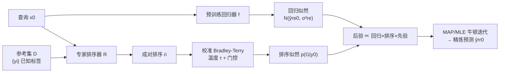

# Bayesian Post Training Enhancement of Regression Models with Calibrated Rankings

**会议**: ICLR 2026  
**OpenReview**: [https://openreview.net/forum?id=b2tBRLic4V](https://openreview.net/forum?id=b2tBRLic4V)  
**代码**: [https://github.com/ktirta/regref](https://github.com/ktirta/regref)  
**领域**: 回归增强 / 贝叶斯推断 / 排序学习  
**关键词**: Bradley-Terry, 贝叶斯后处理, 成对排序, 温度校准, 分子性质预测  

## 一句话总结
RANKREFINE++ 把"回归器预测"与"专家成对排序"通过贝叶斯推断融合成一个严格对数凹的后验，并用温度校准 + 准确率门控解决 Bradley-Terry 在大参考集下的尺度失配与曲率支配问题，在不重训回归器的前提下显著提升预测精度。

## 研究背景与动机
**领域现状**：回归模型在材料科学、药物发现等领域是替代昂贵实验/仿真的关键代理，但精确的绝对数值标签（如"分子 x 在 1 nM 下有毒"）采集慢且贵，导致数据稀缺、模型精度受限。相比之下，成对排序（"x 是否比 y 更毒？"）易于从人类专家或 LLM 评委处低成本获得——对人类降低认知负担、缓解尺度解读偏差，对 LLM 则在技术领域展现出强成对比较能力。

**现有痛点**：已有的"用排序增强回归"方法各有缺陷。Projection（Yan et al. 2024）把回归预测约束到非矛盾排序蕴含的可行区间；RankRefine（Wijaya et al. 2025）用逆方差加权融合回归输出与"纯排序估计"。这些方法要么是启发式约束，要么对排序信息的建模缺乏统一概率框架，更没有诊断出排序似然在何时会反而拖累性能。

**核心矛盾**：直接把 Bradley-Terry 排序似然加进来看似免费午餐，但**参考集规模 $k$ 越大、排序器越准，排序似然的曲率（Fisher 信息）越会"支配"回归似然**——一旦 Bradley-Terry 模型与真实排序器行为失配，这种支配会把预测拽向一个有偏的"伪真值"，导致性能不升反降。

**本文目标**：在不重训回归器、只用极少绝对标签 + 廉价成对排序的前提下，建立一个有理论保证、能自适应排序器质量的逐查询后处理增强方法。

**核心 idea**：**[贝叶斯融合 + 校准]** 把回归器和排序器各自看作对未知标量 $y_0$ 的一条似然，用贝叶斯规则相乘得到一维后验；再针对 Bradley-Terry 的失配引入"温度校准"对齐 sigmoid 斜率与标签尺度，并用"准确率门控"按排序器可信度调节其影响。

## 方法详解

### 整体框架
给定预训练回归器 $f$（对查询 $x_0$ 给出预测 $\hat{y}^{re}_0$）和一个对 $x_0$ 与 $k$ 个已知标签参考项做成对比较的专家排序器 $R$，RANKREFINE++ 把"高斯回归似然"和"Bradley-Terry 排序似然"相乘构成后验，通过 MAP/MLE（牛顿法）求出精炼预测 $\hat{y}^{rr}_0$，全程不改回归器参数。

### 关键设计

**1. 贝叶斯一维后验：把融合重构成概率推断而非启发式约束。** 假设回归器与排序器在给定真值 $y_0$ 下条件独立，贝叶斯规则给出 $p(y_0\mid\hat{y}^{re}_0,G)\propto p(\hat{y}^{re}_0\mid y_0)\,p(G\mid y_0)\,p(y_0)$。回归似然取高斯 $\mathcal{N}(\hat{y}^{re}_0;y_0,\sigma^2_{re})$；排序似然取 Bradley-Terry 全成对乘积 $p(G\mid y_0)=\prod_{i=1}^k s(y_0-y_i)^{r_i}(1-s(y_0-y_i))^{1-r_i}$，其中 $s$ 是 sigmoid。对应的对数后验目标 $L(y)=-\frac{1}{2\sigma^2_{re}}(\hat{y}^{re}_0-y)^2+\sum_i[r_i\log s(y-y_i)+(1-r_i)\log(1-s(y-y_i))]+\log p(y)$ 被证明**严格对数凹**（Lemma 3.1），从而解唯一存在（Corollary 3.2），可用快速牛顿步求最大值。这个框架还把 SOTA 统一进来：对 Bradley-Terry 似然在纯排序 MLE $\hat{y}^{ra}_0$ 处做二阶展开会得到一个高斯近似 $\mathcal{N}(y;\hat{y}^{ra}_0,\sigma^2_{ra})$，两高斯相乘即恢复 RankRefine 的逆方差加权估计（Proposition 3.3）——证明 RankRefine 只是本框架在"高斯化排序似然"下的特例。

**2. 失效模式诊断：尺度失配 + 曲率支配会把预测拽向伪真值。** 作者把退化拆成两个可证明的机制。其一是**软-硬计数失配**（Lemma 3.4）：纯排序 MLE 满足 $\sum_i s(\hat{y}^{ra}_0-y_i)=m$，其中 $m=\sum_i r_i$ 是被排在 $y_0$ 之下的参考数（硬计数），而左边是 sigmoid 软计数，二者相等的解 $\tilde{y}_0$ 即使在排序器完全准确时也可能落在真正的可行区间 $(y_m,y_{m+1})$ 之外，形成有偏的"伪真值"。其二是**曲率支配**：排序似然的 Fisher 信息 $I_{rank}(y)=\sum_i u_i(y)(1-u_i(y))$ 随 $k$ 线性增长（Lemma 3.5），而牛顿步本质是用 Fisher 信息作权重的信息加权平均 $y\leftarrow\frac{I_{reg}\hat{y}^{re}_0+I_{rank}(y)\tilde{y}^{ra}(y)}{I_{reg}+I_{rank}(y)}$（Lemma 3.6）。由于回归项信息 $I_{reg}=1/\sigma^2_{re}$ 是常数，$k$ 一大排序项就主导更新；且支配所需的准确率阈值 $a_{thr}(y)=\tfrac12+\tfrac{|y-\hat{y}^{re}_0|}{2k\sigma^2_{re}|p^*-\hat{p}(y)|}$ 随 $k$ 以 $1/k$ 速率下降（Lemma 3.7）。两者叠加（Corollary 3.8）：当 $k$ 和 $a$ 都够大时，有偏的伪真值被放大主导，base 版本反而比纯回归器更差。

**3. 温度校准：对齐 sigmoid 斜率与标签尺度，消除软-硬计数失配。** 退化的根因是当许多成对差 $(y_a-y_b)$ 落在 sigmoid 的过渡区（而非饱和尾部）时排序目标有偏，这是一个单位/尺度问题。作者引入温度 $\tau$ 把 $u_i(y)=s(y-y_i)$ 替换为 $v_i(y;\tau)=s((y-y_i)/\tau)$，使温度化软计数 $\sum_i v_i$ 能匹配硬计数 $m$，并把排序曲率变为 $I_{rank}(y;\tau)=\tau^{-2}\sum_i v_i(1-v_i)$，从而可在大 $k$ 下控制支配。$\tau$ **无需额外标注**：直接在参考集已知标签对上做单参数逻辑回归 $\Pr(r=1\mid y_a,y_b;\hat\omega)=s(\hat\omega(y_a-y_b))$，取 $\tau=\hat\tau_{cal}=1/\hat\omega$。$\tau<1$ 会增大排序曲率、把更新推向排序目标——当排序器准确时这允许"无偏的排序支配"，提升性能。

**4. 准确率门控：按排序器可信度平滑插值，避免噪声排序反噬。** 温度校准在排序器准确时有效，但排序器不准时过大的曲率会让噪声排序信号主导而伤害性能。作者加一个准确率感知软门控 $\tau(a)=1+(\hat\tau_{cal}-1)(w(a))^\gamma$，其中 $w(a)=\max(0,2a-1)\in[0,1]$，$\gamma\ge1$。于是 $a\approx0.5$（排序器无信息）时 $\tau(a)\approx1$（退回未校准、不放大），$a\to1$ 时 $\tau(a)\to\hat\tau_{cal}$（充分校准），中间准确率平滑插值。最终算法（MLE-GatedTemp）即：估温度 → 估准确率算门控 $\tau$ → 用 $s(\cdot/\tau)$ 替换跑牛顿迭代，并附带后验不确定度 $\sigma^2_{post}\approx(I_{reg}+I_{rank}(\hat{y}^{rr}_0;\tau))^{-1}$。

## 实验关键数据

### 主实验（Oracle 排序器，9 个 TDC ADMET 分子数据集，$k=30$）
评测指标 $\beta\equiv\text{MAE}_{post}/\text{MAE}_{base}$（越低越好）。

| 方法 | 表现概述（$\beta$ 越低越好） |
|------|------|
| Regressor-only | $\beta=1$（基线） |
| Projection (Yan 2024) | 中准确率区常 $>1$（退化），仅在完美准确率收敛到好 |
| Bradley-Terry / Thurstone（纯排序） | 大 $k$ 下明显退化 |
| RankRefine (Wijaya 2025, 前 SOTA) | 高准确率处性能**饱和**不再提升 |
| **RANKREFINE++ (MLE-GatedTemp)** | **全准确率区 $\beta<1$，中等准确率(65%–90%)增益最大，高准确率持续提升** |

**核心数字**：在 30 个参考样本 + 65% 准确率排序器的现实设置下，RANKREFINE++ 取得 **19.33% 的 MAE 中位降幅**，相对 RankRefine 的 9.78% 降幅是 **97.65% 的相对提升**；跨 12 个数据集中位提升 97.65%，且在消费级 CPU 上高效运行。

### 消融实验（Clearance Hepatocyte，四个变体 × $k\in\{3,10,20,30,50,100\}$）

| 变体 | 行为 |
|------|------|
| MAP（高斯先验） | 大 $k$ 退化，但**先验起正则作用**，比 MLE 退化更轻 |
| MLE | 大 $k$ 下因曲率支配 + 软硬计数失配最易退化 |
| MLE-Temp | 温度校准修复尺度失配，缓解高准确率退化，但**低准确率时反而更差** |
| **MLE-GatedTemp（完整版）** | 门控消除上述权衡，全准确率区稳健，**$k=3$ 即有效** |

### 关键发现
- **退化源被验证**：纯 Bradley-Terry/Thurstone 也随 $k$ 退化，证实退化来自排序似然本身（Corollary 3.8）；准确率退化阈值随 $k$ 增大而下移，印证 Lemma 3.7。
- **跨域跨模型泛化**：在 3 个非分子表格数据集（农业产量/学生成绩/留学成本）上，对 Random Forest 和 MLP 两类回归器均 $\beta<1$。
- **真实 LLM 排序器可用**：用 ChatGPT5、Claude4 做 SMILES 成对比较（成对排序准确率 PRA 约 52%–72%），RANKREFINE++ 在多数数据集上仍优于 RankRefine 与 Projection（如 VDss 上 $\beta\approx0.85$）。

## 亮点与洞察
- **把启发式融合升级为有理论保证的概率推断**：严格对数凹 → 唯一解 + 快速牛顿，并证明前 SOTA RankRefine 是其高斯特例，框架统一性强。
- **诊断与解法闭环**：不是只提方法，而是先用 Fisher 信息/软硬计数严格刻画"排序似然何时反噬"，再针对性地用温度 + 门控对症下药，理论与工程一一对应。
- **零额外标注的校准**：温度直接从参考集已知标签对拟合，门控只需估排序器准确率，落地成本极低，且能跑在消费级 CPU 上。
- **契合 LLM-as-a-judge 趋势**：成对排序正是 LLM 的强项，本方法把廉价 LLM 排序转化为可量化、可校准的回归增益。

## 局限与展望
- **依赖参考集质量与覆盖**：温度校准依赖参考集已知标签对能代表查询附近的尺度分布，参考集偏置或覆盖不足时校准可能失准。
- **准确率估计的可得性**：门控需要先验/验证估计排序器准确率 $a$，真实场景中 $a$ 本身有估计误差，其敏感性论文未深入探讨。
- **单标量回归为主**：核心推导针对一维标量标签，多目标回归仅在附录讨论，高维/结构化输出的推广待验证。
- **条件独立假设**：回归器与排序器条件独立的假设在二者共享特征/同源（如同一 LLM 既打分又排序）时可能不成立。

## 相关工作与启发
- **回归 + 排序增强**：Projection（Yan 2024，可行区间约束）与 RankRefine（Wijaya 2025，逆方差加权）是直接前驱，本文证明后者是自己的特例。
- **成对比较模型**：Bradley-Terry（logistic link）与 Thurstone-Mosteller（Gaussian link）是经典一维比较似然来源。
- **LLM-as-a-judge**：LLM 在成对比较上优于直接打分（Zheng 2023 等），是本方法廉价排序信号的现实来源。
- **与 RLHF 的区别**：RLHF 同样用 Bradley-Terry 建模成对偏好，但目标是学全局奖励模型并微调参数；本文是**逐查询、不改参数**的后处理校正，产出一维后验，定位完全不同。
- **启发**：把"任意两个异质预测源"建模为各自似然再贝叶斯融合 + Fisher 信息诊断支配 + 廉价校准，是一个可迁移到多模态/多专家融合的通用范式。

## 评分
- **新颖性** ⭐⭐⭐⭐：贝叶斯统一框架 + 严格诊断排序似然失效模式 + 温度/门控对症校准，理论与方法都有原创性，但建立在 RankRefine 等已有工作的延长线上。
- **实验充分度** ⭐⭐⭐⭐：12 个跨域数据集、oracle 与真实 LLM 双排序器、四变体消融、$k$ 扫描、双回归器，覆盖全面；主表多为图示 $\beta$ 曲线、数值表格略少。
- **写作质量** ⭐⭐⭐⭐⭐：从动机到失效诊断（Lemma 链）再到解法逻辑严密，公式与图示（Fig.1 软硬计数、Fig.2 流程）清晰，定理-工程对应明确。
- **价值** ⭐⭐⭐⭐：在数据稀缺科学领域（药物/材料）即插即用、零重训、CPU 可跑、契合 LLM 排序趋势，实用价值高；适用边界（需参考集 + 准确率估计）限制了普适性。

<!-- RELATED:START -->

## 相关论文

- [\[ICLR 2026\] Learning Distributions over Permutations and Rankings with Factorized Representations](learning_distributions_over_permutations_and_rankings_with_factorized_representa.md)
- [\[ICML 2025\] Regression for the Mean: Auto-Evaluation and Inference with Few Labels through Post-hoc Regression](../../ICML2025/others/regression_for_the_mean_auto-evaluation_and_inference_with_few_labels_through_po.md)
- [\[ICLR 2026\] Federated ADMM from Bayesian Duality](federated_admm_from_bayesian_duality.md)
- [\[ICLR 2026\] Learning Survival Distributions with Individually Calibrated Asymmetric Laplace Distribution](learning_survival_distributions_with_individually_calibrated_asymmetric_laplace_.md)
- [\[AAAI 2026\] TaylorPODA: A Taylor Expansion-Based Method to Improve Post-Hoc Attributions for Opaque Models](../../AAAI2026/others/taylorpoda_a_taylor_expansion-based_method_to_improve_post-hoc_attributions_for_.md)

<!-- RELATED:END -->
