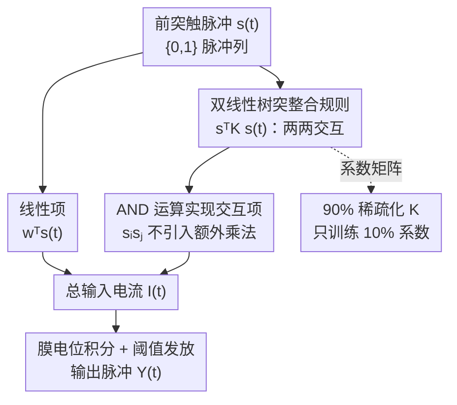

# Beyond Linear Processing: Dendritic Bilinear Integration in Spiking Neural Networks

**会议**: ICLR2026  
**OpenReview**: [https://openreview.net/forum?id=5MB5vakrhB](https://openreview.net/forum?id=5MB5vakrhB)  
**代码**: https://github.com/majingyang0119/DLIF  
**领域**: 脉冲神经网络 / 类脑计算 / 神经元模型  
**关键词**: 脉冲神经网络, 树突非线性, 双线性整合, LIF 模型, 类脑计算

## 一句话总结
这篇论文给脉冲神经网络里最常用的 LIF 神经元加了一项符合生物实验的"双线性树突整合"——除了把突触输入线性相加，还额外算上两两输入之间的交互项 $s^T K s$，让单个神经元就能完成 XOR 这类非线性计算；理论上证明它能利用输入的相关性结构、并在层间传播这种结构，实验上在 ResNet/VGG/Transformer 三类架构、静态与神经形态数据集上都稳定超过 LIF 及一众改进神经元，平均精度从 83.95% 提到 85.18%，能耗只多约 3%。

## 研究背景与动机
**领域现状**：脉冲神经网络（SNN）被看作下一代类脑网络，靠离散脉冲做事件驱动计算，比传统 ANN 更省能。而 SNN 里绝大多数都用 Leaky Integrate-and-Fire（LIF）神经元——一个把树突处理整个砍掉、只对突触电流做线性求和的极简模型。

**现有痛点**：真实的生物神经元在树突上对输入的整合是**非线性**的，正是这种非线性让单个神经元能完成方向选择、重合检测、甚至逻辑运算（如 XOR）这类复杂计算。一个纯线性求和的 LIF 神经元做不到 XOR，必须靠堆深度和宽度去硬凑非线性，这既丢掉了生物合理性，也限制了 SNN 的表达力。

**核心矛盾**：LIF 的"线性求和"假设 $I(t)=\sum_i w_i s_i(t)$ 与生物树突的"非线性整合"事实之间存在根本鸿沟。已有的改进神经元（PLIF 学时间常数、GLIF 加门控、QIF/EIF 引入非线性动力学、多隔室 DH-LIF 等）要么在膜电位动力学上做文章、要么靠多隔室结构，**没有一个是从"树突如何整合多路输入"这个源头去改的**，更没人用神经生理实验观测到的"双线性"形式。

**本文目标**：找到一个既符合生物实验、又能直接嵌进大规模 SNN 训练、还几乎不增加算力的非线性整合机制，并从理论上说清它到底强在哪。

**切入角度**：作者抓住一条具体的神经生理学发现——当树突同时收到两路突触输入 $a$ 和 $b$ 时，整合结果不是 $a+b$，而是 $a+b+kab$，多出一个**双线性交互项** $kab$，其中系数 $k$ 只取决于两个突触的相对空间位置、与输入强度无关。这给了一个干净的、可数学化的非线性形式。

**核心 idea**：把这条双线性整合规则写进 LIF 的输入电流里，得到 Dendritic LIF（DLIF）模型——用一个二次型 $s^T K s$ 显式建模输入之间的两两交互，让神经元天然具备捕捉相关性、做非线性分类的能力。

## 方法详解

### 整体框架
DLIF 的思路非常直接：标准 LIF 神经元的膜电位由输入电流驱动，而输入电流原本只是突触权重对脉冲的线性加权和；DLIF 在这个电流里**额外加一项二次型**，把"任意两个前突触神经元同时放电"这件事也算进去。整套方法分三块：(1) 给出 DLIF 的电流公式和膜电位动力学；(2) 从理论上证明这个二次项让神经元能利用输入相关性做分类、并在网络里逐层传播相关性；(3) 为了不让二次项的参数量爆炸、同时贴合生物事实，对系数矩阵做 90% 稀疏化。最终它可以无缝替换任意 SNN 架构里的 LIF 神经元。

下面这张图按"输入脉冲 → 线性项 + 双线性项 → 膜电位积分 → 发放脉冲"的流向，把 DLIF 单个神经元一个时间步的计算串起来：

### 关键设计

**1. 双线性树突整合规则：给 LIF 的输入电流加一项 $s^T K s$**

LIF 的根本短板是它假设输入电流只是线性求和 $I(t)=\sum_i w_i s_i(t)=w^T s(t)$，这等于默认树突对各路输入互不干涉，于是单神经元做不了 XOR。DLIF 直接照搬神经生理实验里的双线性规律：两路输入 $a,b$ 的整合结果是 $a+b+kab$。推广到 $n$ 路脉冲输入，每一对 $(i,j)$ 都会贡献一个交互项 $s_i(t)s_j(t)$，对应一个对角线为零的对称系数矩阵 $K=(K_{ij})$，于是输入电流变成

$$I(t)=\sum_{i=1}^{n} w_i s_i(t) + \sum_{i=1}^{n}\sum_{j>i} 2K_{ij}\,s_i(t)s_j(t) = w^T s(t) + s^T(t)\,K\,s(t).$$

膜电位动力学相应写成 $\tau\,\frac{dV(t)}{dt} = -(V(t)-V_{rest}) + R\,[\,w^T s(t) + s^T(t)Ks(t)\,]$。这个二次型 $s^T K s$ 就是非线性的来源：它显式编码了"哪两个输入同时放电"这种二阶统计信息，而系数 $K$ 是可学习的，等价于让每个神经元自己去学该放大或抑制哪些输入对的共激活。

**2. AND 运算实现交互项：多出非线性却不多一次乘法**

一个很自然的担心是：加了二次项 $s_i(t)s_j(t)$ 会不会把 SNN 引以为傲的"只做加法、避免乘法"的能效优势毁掉？作者点出关键：因为 $s_i(t),s_j(t)\in\{0,1\}$ 是二值脉冲，乘积 $s_i(t)s_j(t)$ 完全等价于一次**逻辑 AND 运算**——两路都放电才为 1，否则为 0。这意味着 Eq.(3) 里的交互项不引入任何额外的浮点乘法，依旧只靠脉冲通信里天然偏好的加法/按位操作完成。正是这一点保证了 DLIF 在拿到非线性表达力的同时，单步计算成本和 LIF 几乎一致，实测能耗仅多约 3%。

**3. 理论保证：单神经元能抓相关性、网络能逐层传播相关性**

光有公式不够，作者用两个定理说明这个二次项到底强在哪。设两类输入脉冲分布 $D_1,D_2$ 有**完全相同的平均放电率**、但两两相关结构不同（$C_1\neq C_2$）——这是 LIF 最难办的情形，因为它只看一阶放电率、对二阶相关性完全无感。**定理 1** 证明：总存在一个双线性矩阵 $K$ 让 DLIF 神经元对两类输入产生不同的平均电流从而可区分，且在 $\|K\|_F\le 1$ 约束下，最优解恰好是 $K^*=\pm\frac{C_1-C_2}{\|C_1-C_2\|_F}$——也就是说 $K$ 学到的正是两类相关矩阵之差的方向。**定理 2** 进一步把结论推到多层网络：对任意权重矩阵，总存在 $K$ 使得 DLIF 隐层输出的两类相关矩阵之差 $\|P_1^{DLIF}-P_2^{DLIF}\|_F$ 不仅大于零，还严格大于 LIF 的对应量 $\|P_1^{LIF}-P_2^{LIF}\|_F$，即 DLIF 能把输入里的相关性差异**放大并传到读出层**。数值实验里，单个 DLIF 神经元成功解出 XOR（LIF 失败），且学到的 $K$ 与理论预测的 $\frac{C_1-C_2}{\|C_1-C_2\|_F}$ 高度吻合；二维/十维相关性传播实验里 DLIF 的输入-输出相关性保持得也明显更好（斜率 0.292 vs LIF 的 0.038）。

**4. 90% 稀疏化 $K$：生物启发又省参数**

完整的 $K$ 是个 $n\times n$ 矩阵，对大网络来说参数量会显著膨胀。作者借用一条生物证据：Li et al.(2019) 报告树突双线性交互本身就**天然稀疏（约 90%）**。据此 DLIF 只让 $K$ 中一小部分系数可训练，把稀疏度直接设到 90%。这个选择是双重正当的——既贴合生物事实，又被消融实验验证：在 CIFAR-100/ResNet-18 上把稀疏度从 0% 扫到 100%，ACC/FLOPs 比值在 90% 处达到峰值（42.02），说明 90% 稀疏在"算力 vs 精度"上是最划算的点。进一步的参数化对比还发现，低秩参数化虽然压得更狠但掉点明显，而对角块、随机稀疏在同等稀疏度下表现相当，于是最终采用简单有效的"90% 随机稀疏矩阵"。

## 实验关键数据

### 主实验
在静态与神经形态两类数据集、跨 ResNet/VGG/Transformer 三类架构和十余种训练范式下，把每个网络里的 LIF 替换为 DLIF（其余配置不变），DLIF 全面胜出。下表摘取代表性结果：

| 数据集 | 训练范式/网络 | LIF | DLIF | 能耗(LIF→DLIF, mJ) |
|--------|--------------|------|------|------|
| CIFAR-10 | SLTT / ResNet-18 | 94.44 | **95.51** | 1.77 → 1.78 |
| CIFAR-100 | OTTT / VGG-11 | 71.05 | **74.71** | 7.42 → 7.91 |
| ImageNet | TET / ResNet-34 | 64.79 | **67.32** | 3.56 → 3.74 |
| DVS-Gesture | STBP-tdBN / ResNet-17 | 96.87 | **98.05** | 1.67 → 1.68 |
| DVS-CIFAR10 | STBP-tdBN / ResNet-19 | 67.8 | **70.88** | 1.88 → 1.89 |

整体上，静态集 CIFAR-10 提升 0.33%–1.19%、CIFAR-100 提升 0.48%–3.66%、ImageNet 提升 0.52%–3.07%；神经形态集 DVS-Gesture 提升 0.13%–1.36%、DVS-CIFAR10 提升 0.28%–3.08%。跨架构平均精度从 LIF 的 83.95% 提到 DLIF 的 85.18%（+1.23%），而平均能耗只多约 0.17–0.23 mJ（相对增加约 2.6%–3.2%）。

与其他先进脉冲神经元的横向对比同样占优：

| 神经元 | CIFAR-10 | CIFAR-100 | ImageNet | DVS-CIFAR10 | DVS-Gesture |
|--------|----------|-----------|----------|-------------|-------------|
| PLIF | 93.50 | - | 69.26 | 74.80 | 97.92 |
| GLIF | 95.03 | 77.35 | 69.09 | 78.10 | - |
| QIF | 92.98 | 75.91 | 67.49 | 73.27 | 96.18 |
| EIF | 93.08 | 76.18 | 67.14 | 76.27 | 97.01 |
| **DLIF** | **95.78** | **78.27** | **71.27** | **80.46** | **98.61** |

此外对多隔室神经元 DH-LIF，在脉冲语音数据集 SHD/SSC 上 DLIF 也分别以 92.71/83.13 胜过 92.10/82.46；在 Atari 上把 DLIF 嵌进 deep spiking Q-network（DSQN）后也优于 LIF 版本，说明这套机制能跨视觉、语音、强化学习多种范式迁移。

### 消融实验

| 配置 | 关键指标 | 说明 |
|------|---------|------|
| 稀疏度 90%（默认） | ACC 76.89 / ACC-FLOPs 42.02 | 在 CIFAR-100/ResNet-18 上 ACC/FLOPs 比值峰值 |
| 稀疏度 0%（全稠密 $K$） | ACC 78.67 / ACC-FLOPs 40.97 | 精度略高但算力换得不划算 |
| 稀疏度 100%（无 $K$，退化为 LIF） | ACC 74.38 | 去掉双线性项后明显掉点 |
| 去掉 $K$（训练前/后置零） | 精度一致下降 | 证实双线性系数是性能来源 |
| 低秩参数化 $K$ | 明显弱于随机稀疏 | 压缩更强但表达力受损 |

### 关键发现
- **双线性系数 $K$ 是性能的根本来源**：无论训练前还是训练后把 $K$ 清零，精度都一致下降，去掉它整个模型就退化回 LIF。
- **90% 稀疏是甜点**：ACC/FLOPs 比值在 90% 处取最大，既能效最优又恰好和"树突交互天然约 90% 稀疏"的生物证据对上。
- **越靠时序、提升越大**：在天然带时序的神经形态数据集（DVS-CIFAR10）上提升幅度（最高 +3.08%）比静态集更明显，印证 DLIF 捕捉的二阶共激活信息对时空模式格外有用。
- **代价可控**：交互项靠 AND 实现、不引入额外乘法，整体只多约 3% 能耗、约 10% 的训练时间与显存。

## 亮点与洞察
- **从"树突源头"而非"膜动力学"改 LIF**：以往改进神经元几乎都在膜电位动力学、门控、时间常数上做文章，DLIF 是少见地从"树突如何整合多路输入"这个更上游的环节切入，且直接用了神经生理实验的双线性规律——这让改进既有生物依据又形式干净。
- **二值脉冲让二次项免费**：把 $s_i s_j$ 等价成 AND 运算，是整套方法能"加非线性却不加乘法"的关键 trick；它本质利用了 SNN 输入是 $\{0,1\}$ 这一特性，换成连续值 ANN 就没这个便宜。这个观察可迁移到任何想在二值/脉冲表示上引入二阶交互的场景。
- **理论与可视化对得上**：定理 1 预测最优 $K^*\propto C_1-C_2$，数值实验里学到的 $K$ 真的逼近这个方向——理论不是装饰，而是能被实验直接验证的强约束，这种"可证 + 可视"的闭环在 SNN 神经元设计里不多见。
- **"相关性"是统一视角**：把 DLIF 的优势统一解释成"捕捉并传播输入的二阶相关结构"，比单纯说"更强的非线性"更具体、更可操作。

## 局限与展望
- **任务范围仍偏视觉**：主战场是图像/神经形态视觉分类，虽补了 RL 和语音，但作者自己也承认尚未扩到 NLP/大语言模型；二次型 $s^T K s$ 在长序列、大词表场景下的参数与计算行为还未知。
- **$K$ 的稀疏结构靠经验设定**：90% 稀疏来自生物证据 + 单数据集消融，是否对所有架构/数据集都最优、稀疏的"位置"该如何选（随机 vs 结构化）还缺更系统的研究；随机稀疏虽简单有效，但可能不是最优解。
- **硬件落地未验证**：DLIF 的能效优势是在算法层面（FLOPs/理论能耗）估的，真正部署到神经形态芯片上能否兑现低功耗低延迟，作者列为待解问题。
- **改进思路**：可以探索让 $K$ 的稀疏模式随空间位置/层深自适应，或把双线性推广到更高阶交互（但需警惕算力反弹），以及在 NLP/序列任务上验证相关性传播理论是否依然成立。

## 相关工作与启发
- **vs LIF / PLIF / GLIF / QIF / EIF**: 这些都是"点神经元"，改的是膜电位动力学（时间常数、门控、非线性发放）；DLIF 改的是树突输入整合方式，引入显式的二阶交互 $s^T K s$，在五个数据集上一致超过它们。
- **vs 多隔室模型 DH-LIF**: DH-LIF 靠多隔室建模时间维度上的树突异质性、结构更复杂；DLIF 用单一二次型在可比参数下就超过它（SHD/SSC 上 92.71/83.13 vs 92.10/82.46），更简洁也更易嵌进现成架构。
- **vs ANN 里的双线性网络**: 此前双线性主要用于特征融合/池化或作为架构原语，作者把双线性首次引入脉冲框架，并从"保持输入相关性"角度给出理论分析——这是过往 ANN 双线性工作所没有的视角。
- **vs Li et al.(2019) 的电导模型**: 后者用电导基、电压依赖的突触动力学刻画双线性整合，生物更精细但难扩到大 SNN；DLIF 用电流基抽象去掉这些生物物理依赖，在保留双线性规律的同时换来可扩展、可训练。

## 评分
- 新颖性: ⭐⭐⭐⭐⭐ 首次把神经生理实验的"双线性树突整合"引入 SNN 神经元，且配套可证可视的理论。
- 实验充分度: ⭐⭐⭐⭐⭐ 跨三类架构、十余训练范式、静态+神经形态+语音+RL，横向纵向消融都齐。
- 写作质量: ⭐⭐⭐⭐ 理论与实验衔接清晰，公式与生物动机讲得透；部分附录细节（能耗/参数化）需回查原文。
- 价值: ⭐⭐⭐⭐⭐ 几乎零成本即插即用地提升 SNN，且为类脑神经元设计提供了"相关性"这一可操作的统一视角。

<!-- RELATED:START -->

## 相关论文

- [\[ICLR 2026\] Breaking Gradient Temporal Collinearity for Robust Spiking Neural Networks](breaking_gradient_temporal_collinearity_for_robust_spiking_neural_networks.md)
- [\[ICLR 2026\] Online Pseudo-Zeroth-Order Training of Neuromorphic Spiking Neural Networks](online_pseudo-zeroth-order_training_of_neuromorphic_spiking_neural_networks.md)
- [\[ICLR 2026\] A Brain-Inspired Gating Mechanism Unlocks Robust Computation in Spiking Neural Networks](a_brain-inspired_gating_mechanism_unlocks_robust_computation_in_spiking_neural_n.md)
- [\[ICLR 2026\] Fractional-Order Spiking Neural Network](fractional-order_spiking_neural_network.md)
- [\[ICLR 2026\] Training Deep Normalization-Free Spiking Neural Networks with Lateral Inhibition](training_deep_normalization-free_spiking_neural_networks_with_lateral_inhibition.md)

<!-- RELATED:END -->
