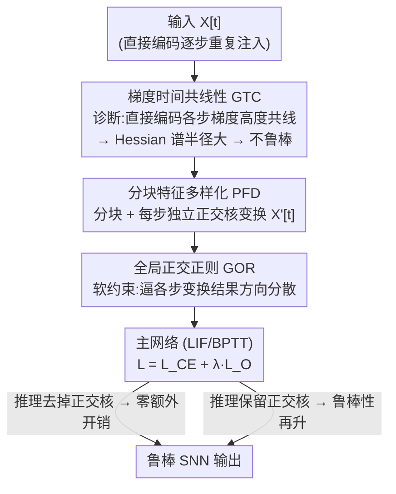

# Breaking Gradient Temporal Collinearity for Robust Spiking Neural Networks

**会议**: ICLR2026  
**OpenReview**: [https://openreview.net/forum?id=udTDFAshNM](https://openreview.net/forum?id=udTDFAshNM)  
**代码**: https://github.com/Apple26419/SNN_STOD  
**领域**: 脉冲神经网络 / 对抗鲁棒性  
**关键词**: 脉冲神经网络, 直接编码, 对抗鲁棒性, 梯度时间共线性, 正交核

## 一句话总结
针对直接编码（direct encoding）脉冲神经网络（SNN）鲁棒性差的问题，本文提出"梯度时间共线性"（GTC）这一可量化指标解释了它为什么不如速率编码（rate encoding）耐攻击，并设计 STOD——在输入层为每个时间步插入参数化正交核 + 全局正交正则，从结构上打散跨时间步的梯度方向，使 CIFAR/ImageNet/DVS 上 FGSM、PGD 等攻击下的精度大幅领先现有 SOTA，且推理几乎零额外开销。

## 研究背景与动机
**领域现状**：SNN 用二值脉冲随时间传递信息，低功耗、适合神经形态硬件，已被用在自动驾驶、机器人、边缘计算等场景。它的性能很大程度由"输入编码方式"决定。早期主流是速率编码（rate encoding）：把输入用随机脉冲的发放频率表示，需要很长的脉冲序列才能保真，在 BPTT（沿时间反向传播）训练下序列越长开销越爆炸。为了提效，直接编码（direct encoding）成了如今的主流——它把同一份原始数据在少数几个时间步里**重复注入**网络，几乎不损失原始特征，只用很短的序列就能达到高精度。

**现有痛点**：直接编码虽快虽准，鲁棒性却明显比老旧的速率编码差。原因在于：每个时间步喂的是同一份输入，膜电位不断累积高度相关的信号，网络退化成一个"被放大的静态特征提取器"，没有真正利用时间动态去捕捉互补信息。结果就是缺乏时间多样性，小扰动会沿时间步反复累积、放大，表征非常脆弱。相反，速率编码的随机脉冲天然起到"特征去相关"作用——不同时间步的脉冲模式相互独立，扰动无法在所有步上保持一致，从而抑制了误差累积。

**核心矛盾**：效率/精度（要直接编码）与鲁棒性（速率编码更强）之间存在 trade-off。能不能把速率编码自带的去相关机制"借"到直接编码里，既不牺牲效率又补上鲁棒性？而且光做经验对比不够，需要一个有原理依据的指标来刻画这道鲁棒性鸿沟。

**切入角度**：作者从**训练动态**入手。鲁棒性与参数 Hessian 的谱半径密切相关，而谱半径又由梯度的时间结构主导。直接编码把整段梯度 $\nabla_\theta L$ 拆成各时间步分量 $G[t]$ 之和后，这些分量方向高度一致（共线），正是这种共线性放大了 Hessian 谱半径、拖垮了鲁棒性。

**核心 idea**：定义并量化"梯度时间共线性"（GTC）作为诊断指标；再用一组**参数化正交核 + 结构化约束**在输入层结构性地打散各时间步的特征方向，把 GTC 降下来，从而在不增加推理开销的前提下提升 SNN 鲁棒性。

## 方法详解

### 整体框架
方法分两部分：先用一个新指标 **GTC** 把"为什么直接编码不鲁棒"讲清楚（分析侧），再据此提出 **STOD（Structured Temporal Orthogonal Decorrelation）** 来修复（方法侧）。

GTC 衡量任意两个时间步梯度分量 $G[i],G[j]$ 的方向一致程度，定义为它们的 Frobenius 内积归一化：

$$C(G[i],G[j])=\frac{\langle G[i],G[j]\rangle_F}{\|G[i]\|_F\cdot\|G[j]\|_F}\in[-1,1].$$

$C\to1$ 表示两个梯度分量越共线。实验观察到：直接编码的 epoch 平均 GTC 长期维持在 0.8–0.9 的高位，而速率编码只在 0.2–0.3。作者进一步给出 Hessian 谱半径的结构化上界 $\lambda_{\max}(\hat H_\theta)\lesssim T\cdot(\max_t\|G[t]\|_F^2)\cdot[1+(T-1)\max_{i\ne j}C(G[i],G[j])]$，说明 GTC 越高、谱半径越大、鲁棒性越差——把"现象"上升成了"机制"。

STOD 据此在直接编码的输入层动手：输入 $X[t]$ 先被分块，每个时间步套一个独立的参数化正交核做特征变换（PFD），把各步特征方向"撑开"；同时用一个软正则（GOR）逼迫不同步的变换结果方向更分散。训练时正交核作为可学习参数被约束在 Stiefel 流形上更新；推理时既可以去掉正交核（鲁棒性已"焊进"网络权重、几乎零开销），也可以保留它们换取更高鲁棒性。

### 关键设计

**1. 梯度时间共线性 GTC：把"直接编码为何脆弱"变成可量化、可优化的指标**

直接面对的痛点是：直接编码鲁棒性差，但过去只有"重复注入导致特征单一"这种定性说法，无法指导设计。作者把整段参数梯度按时间步拆开 $\nabla_\theta L=\sum_{t=1}^T G[t]$，定义任意两步分量的共线性 $C(G[i],G[j])$（见上式），并进一步给出 batch 平均与 epoch 平均的 GTC $\bar C_b=\frac{2}{T(T-1)}\sum_{i<j}C(G_b[i],G_b[j])$、$\bar C=\frac1B\sum_b\bar C_b$ 作为训练全过程的稳定刻画。

它之所以有效，是因为作者把 GTC 和**鲁棒性的优化本质**接上了：通过推导 Hessian 谱半径上界 $\lambda_{\max}(\hat H_\theta)\lesssim T\cdot(\max_t\|G[t]\|_F^2)\cdot[1+(T-1)\max_{i\ne j}C]$，证明 GTC 越高谱半径越大、损失面越尖锐、越不耐扰动。这样"降低 GTC"就成了一个有理论支撑的优化目标，而不是拍脑袋的启发式。GTC 曲线还解释了一个现象：直接编码训练中 GTC 缓慢下降，恰好对应鲁棒性逐渐变强——梯度分量在"逐步分散"。

**2. 分块特征多样化 PFD：用结构化正交变换而非随机噪声来制造时间多样性**

既然高 GTC 源于"每步喂同一份输入"，最朴素的修法是往输入或梯度里加随机噪声打破重复。但作者明确反对：随机噪声没有机制意识、不保证产生有意义的时间多样性，且这种人工扰动并不对应网络真实会遇到的变化，反而可能造成梯度混淆（gradient obfuscation，一种"假鲁棒"）并损害可解释性。

PFD 的做法是：在每个时间步对输入施加一个**独立的参数化正交核**来变换特征方向。为降复杂度和稳定优化，先把输入 $X[t]\in\mathbb R^{C\times H\times W}$ 切成 $N=\frac Hp\cdot\frac Wp$ 个不重叠 patch（patch 大小 $p$ 为超参），每个 patch 展平到 $d=C\times p^2$ 维，再用 Kronecker 积施加正交核 $O[t]\in\mathbb R^{d\times d}$：$X'[t]=\mathrm{vec}(P^{-1}(P(X[t])\otimes O[t]))$。正交核受三条结构化约束：①$t=1$ 用单位阵初始化，作为稳定锚点，保证一部分原始信息始终被保留、避免初始化时全部时间步同时被扭曲；②各核在初始化时**互相正交**，用 Householder 反射 $Q[j]=I_d-2k_jk_j^\top/(k_j^\top k_j)$ 构造，从一开始就最大化跨步特征多样性、避免早期训练梯度分量重叠导致不稳；③训练中每个核保持**自正交** $O[t]O[t]^\top=I_d$，保证变换只改方向不改能量（$\|X'[t]\|_2=\|X\|_2$），避免无意义的缩放畸变和像素强度漂移（哪怕轻微强度偏移都可能让 SNN 预测翻车）。实现上把核注册为 Stiefel 流形上的 ManifoldParameter，用 RiemannianSGD 更新。

**3. 全局正交正则 GOR：用软约束维持"跨核互相正交"，避开硬约束的刚性与天价开销**

理想情况下还想要第四条约束——训练**全程**保持各核互相正交，否则训练中各核可能彼此趋同、重新把 GTC 拉高。但若把"自正交 + 互正交"都当硬约束，系统会过度刚性、参数更新失去灵活性、训练受阻；而且要在训练中维持互正交，需把所有核拼起来约束在维度 $d^2T$ 的 Stiefel 流形上，计算与显存开销不可接受。

于是作者把"互正交"放成软约束 GOR：直接惩罚不同步变换结果之间的方向相似度，

$$L_O=\sum_{1\le i<j\le T}\cos^2(\hat X'[i],\hat X'[j]),$$

其中 $\hat X'$ 是归一化后的变换输入。最终训练目标 $L=L_{CE}+\lambda_O L_O$，$\lambda_O$ 控制去相关强度。这样既引导各时间步的输入往更分散的方向走、持续压低 GTC，又保留了参数更新的自由度，规避了硬约束的巨额代价。

### 损失函数 / 训练策略
总损失为交叉熵加正交正则：$L=L_{CE}+\lambda_O L_O$。正交核约束在 Stiefel 流形上、以 RiemannianSGD 优化；训练用 BPTT + 代理梯度（surrogate gradient）。主超参为时间步 $T$、patch 大小 $p$、正则强度 $\lambda_O$，主实验设 $T=4,p=8$。推理可选"去核（STOD w.o. OK，零额外开销）"或"留核（STOD，约 +0.15M 参数换更高鲁棒）"。

## 实验关键数据

### 主实验
数据集涵盖 CIFAR-10/100、ImageNet 及 DVS 事件相机数据集 DVS-CIFAR10、DVS-Gesture；攻击用 FGSM 与 PGD（$\varepsilon=8/255$，PGD 迭代 7 次），并测黑盒攻击与针对 SNN 的 RGA 攻击。白盒下与 AT、DLIF、HoSNN、FEEL、StoG 等 SOTA 比较（推理去核版 STOD w.o. OK）：

| 数据集 | 攻击 | 普通SNN | 最强baseline | STOD w.o. OK |
|--------|------|---------|--------------|--------------|
| CIFAR-10 | FGSM | 8.19 | 54.76 (HoSNN) | **55.80** |
| CIFAR-10 | PGD | 0.03 | 28.35 (FEEL) | **32.97** |
| CIFAR-100 | FGSM | 4.55 | 16.31 (AT) | **26.26** |
| CIFAR-100 | PGD | 0.19 | 8.49 (AT) | **13.13** |
| ImageNet | FGSM | 4.99 | 15.74 (AT) | **19.08** |
| ImageNet | PGD | 0.01 | 6.39 (AT) | **6.44** |

baseline 往往"按下葫芦浮起瓢"：HoSNN 在 CIFAR-10 FGSM 上 54.76% 不错，但 PGD 暴跌到 15.32%；FEEL 在 PGD 上 28.35% 强，FGSM 却只有 44.96%。STOD 在两种攻击下都全面领先且更均衡。代价是 clean 精度略低（如 CIFAR-10 91.43% vs baseline ~93%），因为去相关替换了部分纯净输入，但下降很小、鲁棒收益远大于此。DVS 数据集上同样超过 SOTA 的 SR 方法。

### 消融实验

| 配置 | CIFAR-10 FGSM/PGD | 说明 |
|------|-------------------|------|
| STOD w.o. OK（去核） | 55.80 / 32.97 | 鲁棒性已焊进权重，零额外开销即超 SOTA |
| STOD（留核） | 59.16 / 36.72 | 推理保留正交核再升约 +3.4/+3.8，仅 +0.15M 参数 |
| patch $p=8$ | 峰值 | $p$ 太小抓不到空间结构、太大变换过粗丢细节，$p=8$ 最优 |
| 加大 $\lambda_O$ | GTC 进一步下降 | 正则越强 GTC 越低，但 clean 精度需权衡 |

### 关键发现
- **GTC 确实是因果旋钮**：调大 $\lambda_O$ 直接把 GTC 曲线压低、鲁棒性随之上升，验证了"降 GTC → 提鲁棒"的机制链。
- **正交核可拆可留**：去核版即超 SOTA 说明鲁棒性来自训练阶段对参数的塑形；留核再加一档但成本极小（+0.15M）。
- **不是假鲁棒**：在黑盒攻击与针对 SNN 脉冲率的 RGA 攻击下 STOD 依旧坚挺（如 CIFAR-10 白盒 RGA-PGD 49.40% vs 普通 SNN 1.01%），且可视化显示其梯度分量呈现清晰、多样的结构而非梯度混淆的噪声，排除了"梯度混淆"导致的虚假鲁棒。

## 亮点与洞察
- **把定性直觉变成可优化指标**：GTC 用 Frobenius 内积量化跨时间步梯度共线性，并通过 Hessian 谱半径上界把它和鲁棒性的优化本质钩住——这套"指标 + 上界"是可迁移的诊断范式，凡是 BPTT 多步展开的模型都能借鉴这种"看梯度分量方向一致性"的思路。
- **正交核而非随机噪声**：用结构化、能量守恒的正交变换制造时间多样性，既避免随机噪声带来的梯度混淆/假鲁棒，又用 Stiefel 流形参数化让多样性可学习——比"加噪去相关"高明得多。
- **硬约束拆成软约束的工程取舍**：自正交当硬约束（廉价、逐核独立）、互正交当软正则（避开 $d^2T$ 维流形的天价开销），这种"该硬则硬、该软则软"的拆分值得借鉴。
- **训练塑形、推理可丢**：把鲁棒性"焊进"权重，使部署时零额外开销，对边缘/神经形态硬件极友好。

## 局限与展望
- **clean 精度有小幅损失**：去相关换鲁棒，纯净样本上精度比 baseline 低 0.x–1 个点，作者承认这是机制带来的固有代价。
- **ImageNet 增益偏小**：高分辨率 + 深 backbone 本身表征更丰富、时间冗余低，STOD 改进空间被压缩，PGD 上仅微超 AT。
- **聚焦视觉分类静态/DVS 数据**：方法主要在图像/事件分类上验证，是否迁移到检测、序列控制等任务待验证。
- **超参敏感**：patch 大小 $p$、正则强度 $\lambda_O$ 需调，$p$ 的最优值（=8）可能随分辨率/数据变化，跨数据集的自适应选取值得探索。

## 相关工作与启发
- **vs 速率编码 (rate encoding)**：速率编码靠随机脉冲天然去相关、鲁棒但需长序列、开销大；STOD 把"去相关"以结构化正交核的形式注入高效的直接编码，鱼和熊掌兼得。
- **vs 神经元/正则类鲁棒方法 (DLIF / HoSNN / StoG / SR / AT)**：它们多在约束神经元动力学（改 LIF、稳膜电位、限 Lipschitz）或加正则上做文章；STOD 另辟蹊径，从**输入编码的时间结构**入手降低 GTC，与这些方法正交，且可与 AT 叠加获得额外增益。
- **vs 加噪去相关**：直接往输入/梯度加随机噪声会导致梯度混淆、可解释性差；STOD 用能量守恒的正交变换替代，提供可解释、稳定的时间多样性。

## 评分
- 新颖性: ⭐⭐⭐⭐⭐ GTC 指标 + Hessian 谱半径上界把"直接编码为何脆弱"上升为可优化机制，正交核去相关角度新颖
- 实验充分度: ⭐⭐⭐⭐ 覆盖 CIFAR/ImageNet/DVS 多数据集与 FGSM/PGD/黑盒/RGA 多攻击，并排查梯度混淆；clean 精度代价与 ImageNet 小增益如实呈现
- 写作质量: ⭐⭐⭐⭐ 从动机到机制到方法层层递进，图文（GTC 曲线、梯度可视化）支撑清晰
- 价值: ⭐⭐⭐⭐ 推理零额外开销即提升鲁棒，对安全攸关、边缘/神经形态部署的 SNN 有实用价值

<!-- RELATED:START -->

## 相关论文

- [\[ICLR 2026\] A Brain-Inspired Gating Mechanism Unlocks Robust Computation in Spiking Neural Networks](a_brain-inspired_gating_mechanism_unlocks_robust_computation_in_spiking_neural_n.md)
- [\[ICLR 2026\] Beyond Linear Processing: Dendritic Bilinear Integration in Spiking Neural Networks](beyond_linear_processing_dendritic_bilinear_integration_in_spiking_neural_networ.md)
- [\[ICLR 2026\] Online Pseudo-Zeroth-Order Training of Neuromorphic Spiking Neural Networks](online_pseudo-zeroth-order_training_of_neuromorphic_spiking_neural_networks.md)
- [\[AAAI 2026\] DS-ATGO: Dual-Stage Synergistic Learning via Forward Adaptive Threshold and Backward Gradient Optimization for Spiking Neural Networks](../../AAAI2026/others/ds-atgo_dual-stage_synergistic_learning_via_forward_adaptive_threshold_and_backw.md)
- [\[ICLR 2026\] Fractional-Order Spiking Neural Network](fractional-order_spiking_neural_network.md)

<!-- RELATED:END -->
