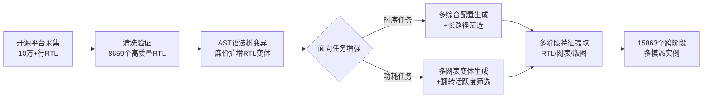

# CircuitNet 3.0: A Multi-Modal Dataset with Task-Oriented Augmentation for AI-Driven Circuit Design

**会议**: ICLR 2026  
**OpenReview**: [https://openreview.net/forum?id=lEDb4gQ4dB](https://openreview.net/forum?id=lEDb4gQ4dB)  
**代码**: [https://github.com/sklp-eda-lab/iclr-circuitnet_3.0](https://github.com/sklp-eda-lab/iclr-circuitnet_3.0)  
**领域**: AI for EDA / 数据集与基准  
**关键词**: 芯片设计, EDA, 多模态数据集, 时序预测, 功耗预测, AST 数据增强, 跨阶段表示学习  

## 一句话总结
把 8,659 个验证过的开源 RTL 设计，通过 Verilog 语法树变异 + 面向任务的筛选扩增成 15,863 个跨阶段（RTL/网表/版图）多模态实例，构成首个大规模公开的 AI4EDA 时序/功耗预测基准 CircuitNet 3.0。

## 研究背景与动机
**领域现状**：芯片设计要把高层规格逐级转换成物理版图，传统"瀑布流"要走完 RTL 设计→逻辑综合→物理设计三个阶段才能验证性能（PPA：功耗/性能/面积），一旦不达标就要触发工程变更单（ECO）反复迭代，动辄数周到数月。业界正转向"shift-left"范式——在 RTL 早期就用 ML 模型预测时序/功耗违例，提前优化。

**现有痛点**：ML 驱动的 EDA 落地卡在数据上。一是**数据稀缺**——芯片设计受知识产权限制，没有像 CV/NLP 那样的大规模公开数据集；二是**生成代价高**——造一个真实的 EDA 数据集需要昂贵的商业工具（Synopsys DC、Cadence Innovus）、领域专家和大量算力，还要跑几个月迭代；三是**现有数据集各有残缺**——CircuitNet 2.0 有完整多阶段版图数据但 RTL 只有 8 个，RTLCoder 有 26,532 个 RTL 却完全没有网表/版图，VerilogEval/RTLLM 只评估 LLM 的代码生成、没有性能标签。

**核心矛盾**：早期预测最有价值，但 RTL 阶段缺乏关键物理信息（版图寄生电阻/电容尚未生成），模型必须能跨 RTL→网表→版图三个模态学到"早期设计选择→最终物理结果"的复杂映射；可现实是**既没有 RTL-to-Layout 全链路可追溯的数据，又缺少能逼出模型极限的高难度样本**——工业界看重的是模型在那些"卡在时序/功耗预算边缘"的临界设计上的准确率，而非平均表现。

**本文目标**：构造一个大规模、多阶段、多模态、且面向 EDA 任务（时序/功耗预测）做了针对性增强的开源数据集。

**核心 idea**：**用"高抽象层廉价生成 + 低抽象层精准筛选"两段式增强**——先在 RTL 这一粗粒度层用语法树变异低成本地扩增大量合法电路变体，再在网表/版图这一细粒度层用商业 EDA 工具做面向任务的筛选，专门保留时序紧张（长路径）和功耗有意义（翻转活跃）的"硬样本"。

## 方法详解

### 整体框架
CircuitNet 3.0 的构建是一条"采集清洗→AST 快速生成→面向任务增强→多阶段特征提取"的流水线。先从 GitHub/HuggingFace/OpenCore/RISC-V 收集 10 万+ 行 RTL，清洗出 8,659 个高质量原始设计；再用 Verilog AST 变异在 RTL 层廉价地扩增结构多样的电路；最后在网表/版图层用 Synopsys DC + Cadence Innovus/Voltus 跑工业流程，针对时序和功耗两个任务分别做多阶段生成与样本筛选，并抽取文本（RTL/规格）、图（RTL/网表）、图像（版图）三种模态，对齐成最终的 15,863 个跨阶段实例。

### 关键设计

**1. 三阶段三模态对齐表示：把一个设计在 EDA 流程上"摊开"** EDA 流程天然有三种递进的电路表示——RTL（行为级 Verilog 代码，文本模态）、网表（综合后的门级标准单元连接图，图模态）、版图（物理放置布线的几何图像，图像模态）。CircuitNet 3.0 让每个设计都贯通这三个阶段，并配上真值性能指标：时序侧给出到达时间 AT、最差负裕量 WNS、总负裕量 TNS，功耗侧给出动态功耗（$P_{\text{Switching}} = \alpha \times f \times C_L \times V_{DD}^2$，$\alpha$ 为翻转活跃度、$f$ 为时钟频率、$C_L$ 为负载电容、$V_{DD}$ 为供电电压）。这种"RTL-to-Layout 全链路可追溯"正是单阶段数据集（只有 RTL 或只有版图）给不了的，让模型能学跨抽象层的信息融合。

**2. 基于 Verilog AST 的快速电路生成：在最便宜的层做扩增** 与其随机生成 RTL（极易综合失败、价值低），不如对已验证的设计做局部语法树重写。论文设计了一组类型安全、上下文感知的变异算子：算术算子双向替换（+/−/×/÷ 互换，保持类型）、逻辑算子跨类替换（&&/‖/&/| 等）、关系算子取反（==/!=/>/< 等）、时序边沿翻转（posedge↔negedge）、阻塞/非阻塞赋值互换（<=↔=）、常数 ±1 微调（保位宽）。利用 RTL 的"粗粒度"特性，少量代码改动就能撬动显著的门级结构变化，既高效又因为基于验证过的母本而大幅提升综合成功率——这是"用高抽象层换生成效率"的核心。

**3. 面向时序任务的增强：专攻长路径硬样本** 时序闭合往往由电路的最长路径决定，只在时序裕量充足的设计上训练，模型学不会工程师真正头疼的临界场景。增强分两步：多阶段生成上，对每个 RTL 跑完整的逻辑+物理优化（Innovus 优化到密度 >90%），产出时序最优的网表和版图作为高质量标签；样本筛选上，优先保留路径长度大的电路，剔除平凡的短路径设计，把训练资源集中到"逼近时序预算极限"的最坏情形上。增强后 WNS 分布从原本挤在 −2~0 ns 拉开到 −6~0 ns，版图密度覆盖 86%~100%。

**4. 面向功耗任务的增强：靠多综合配置造拓扑多样性 + 翻转活跃度筛选** 功耗取决于门级翻转活跃度，而单条 RTL 语句可能映射到天差地别的门级实现，所以功耗增强落在网表层：对同一份 RTL 用不同综合约束（DC 的不同 compile config）生成多个功能等价但拓扑各异的网表变体，捕捉逻辑拓扑对功耗的影响。筛选上用 Cadence Voltus 做无向量动态功耗分析，挑出"无效逻辑占比低"的设计——如果某模块逻辑不可达或在任何输入下都不翻转（可能是重写引入的逻辑不可达），它对训练几乎无贡献甚至降低效率，故予以排除。增强后功耗分布从集中在 60 mW 以下扩展到 0~160 mW 的均匀覆盖。

## 实验关键数据

### 主实验表格
在原始数据上对比单模态 vs 多模态模型（多模态显著占优）：

**时序预测（RTL 阶段输入，RTLDistil 用跨阶段知识蒸馏）**

| 模型 | AT PCC↑ | AT MAPE↓ | WNS PCC↑ | WNS MAPE↓ | TNS PCC↑ | TNS MAPE↓ |
|------|---------|----------|----------|-----------|----------|-----------|
| MasterRTL | 0.520 | 43.25% | 0.698 | 65.12% | 0.593 | 68.45% |
| RTL-Timer | 0.835 | 26.48% | 0.842 | 44.36% | 0.801 | 43.92% |
| **RTLDistil** | **0.887** | **19.72%** | **0.871** | **35.28%** | **0.918** | **40.15%** |

**功耗预测（网表阶段，MOSS 多模态学习）**

| 模型 | Toggle Rate PCC↑ | Toggle MAPE↓ | Total Power PCC↑ | Power MAPE↓ |
|------|------------------|--------------|------------------|-------------|
| DeepSeq2 | 0.759 | 29.5% | 0.872 | 22.2% |
| MOSS (w/o 多模态) | 0.674 | 34.7% | 0.815 | 27.7% |
| **MOSS (Full)** | **0.871** | **14.4%** | **0.948** | **7.4%** |

### 消融实验表格
三个数据集变体（Resyn-27k / 原始数据 / 增强后）验证增强的作用——同一模型在增强数据上一致更优：

**时序（RTLDistil）**

| 数据集 | AT PCC↑ | AT MAPE↓ | WNS PCC↑ | WNS MAPE↓ | TNS PCC↑ | TNS MAPE↓ |
|--------|---------|----------|----------|-----------|----------|-----------|
| Resyn-27k | 0.842 | 23.86% | 0.825 | 40.73% | 0.876 | 44.27% |
| 原始数据 | 0.887 | 19.72% | 0.871 | 35.28% | 0.918 | 40.15% |
| **增强数据** | **0.935** | **15.28%** | **0.926** | **28.96%** | **0.968** | **35.42%** |

**功耗（Total Power）**

| 数据集 | 模型 | PCC↑ | R²↑ | MAPE↓ |
|--------|------|------|-----|-------|
| Resyn-27k | VIRTUAL | 0.675 | 0.704 | 27.48% |
| 增强数据 | VIRTUAL | **0.753** | **0.867** | **23.92%** |

### 关键发现
- **多模态完胜单模态**：时序上 RTLDistil 相对最强 RTL-only 基线（RTL-Timer）平均 PCC +8.0%、MAPE −18.2%；功耗上 MOSS 完整版相对单模态 MOSS toggle rate 提升 31.1%。
- **增强切实有效**：相对 Resyn-27k，增强数据让时序 MAPE 降 36.0%、功耗 MAPE 降 12.9%；MasterRTL 的 R² 从负值（−0.384）翻正，说明真正学到了时序关系。
- **分布更丰富**：增强把时序覆盖从 −2~0 ns 拉到 −6~0 ns、功耗从 <60 mW 拉到 0~160 mW，且保持 EDA 工具验证有效性。
- **严格防泄漏**：测试集只含原始未增强设计，且某源设计若进测试集，其全部增强变体都排除出训练/验证，还额外补了数据集外的开源子模块。

## 亮点与洞察
- **"贵的层筛选、便宜的层生成"是个很务实的分工**：RTL 改一行代码就能撬动结构变化（便宜），版图层跑商业工具才有真值（贵），把生成放 RTL、把面向任务的筛选放网表/版图，最大化了昂贵 EDA 算力的边际价值。
- **面向任务增强 ≠ 单纯扩量**：它显式地把数据分布往"工业界真正在意的硬样本"（长路径、高翻转）推，直击"模型价值由临界设计上的准确率决定"这一工业痛点。
- **AST 变异天然保证合法性**：基于已验证母本做类型安全的局部变换，综合成功率远高于随机生成 RTL，这是数据质量的关键保障。

## 局限与展望
- **强依赖商业 EDA 工具**：DC/Innovus/Voltus/PrimePower 是数据生成的命脉，没有这些昂贵许可证的团队难以复现或扩展数据，开源的只是产出数据而非生成能力。
- **设计偏模块化、规模偏小**：论文有意避开大规模 CPU（重复结构多），主打模块化设计，对超大规模 SoC 的代表性存疑。
- **AST 变异可能引入"无效"语义**：重写会造成逻辑不可达，虽然功耗任务靠 Voltus 筛掉了，但变异多样性与功能"真实性"之间的权衡仍值得深究。
- **任务面较窄**：目前聚焦时序/功耗预测两类任务，可路由/IR-Drop/面积等其他 EDA 任务的支持尚待扩展。

## 相关工作与启发
- **vs CircuitNet 1.0/2.0**：前作有完整版图数据但 RTL 极少（仅 8 个），偏后端任务；3.0 补齐了大规模 RTL 源头和 RTL-to-Layout 全链路。
- **vs RTL 生成数据集（VerilogEval/RTLLM/RTLCoder）**：那些数据集只评/训 LLM 的代码生成，没有网表、版图和性能标签；本文是面向预测任务而非生成任务。
- **vs ForgeEDA/EDALearn**：ForgeEDA 缺最终物理实现且不开源，EDALearn 规模太小；CircuitNet 3.0 在"完整工业链路 + 规模 + 多样性"上更全。
- **启发**：在数据稀缺的垂直领域（EDA、生物、材料等），"基于已验证母本的结构化增强 + 面向下游任务的硬样本筛选"可能比盲目扩量或随机生成更有效，这套"高抽象层生成、低抽象层筛选"的分工思路有迁移价值。

## 评分
- **新颖性**: ⭐⭐⭐⭐ — 首个大规模公开的多阶段多模态 AI4EDA 时序/功耗预测基准，AST 变异 + 面向任务筛选的组合在数据集构造层面有清晰创新，虽非全新算法但工程与方法论价值突出。
- **实验充分度**: ⭐⭐⭐⭐ — 覆盖时序/功耗两任务、多个 SOTA 基线、三数据集变体消融、分布可视化，且防泄漏切分严谨；不足是任务种类和超大设计的覆盖有限。
- **写作质量**: ⭐⭐⭐⭐ — 背景动机层层递进，三大挑战与对应方法对齐清晰，图表（流程图/分布图/对比表）支撑到位。
- **价值**: ⭐⭐⭐⭐⭐ — 直击 AI4EDA 最大瓶颈"没有公开高保真数据"，开源数据 + 可复现协议能切实推动整个领域，是基础设施级贡献。

<!-- RELATED:START -->

## 相关论文

- [\[ICLR 2026\] OSIRIS: Bridging Analog Circuit Design and Machine Learning with Scalable Dataset Generation](osiris_bridging_analog_circuit_design_and_machine_learning_with_scalable_dataset.md)
- [\[ICLR 2026\] Ensemble Prediction of Task Affinity for Efficient Multi-Task Learning](ensemble_prediction_of_task_affinity_for_efficient_multi-task_learning.md)
- [\[ICLR 2026\] The Hot Mess of AI: How Does Misalignment Scale With Model Intelligence and Task Complexity?](the_hot_mess_of_ai_how_does_misalignment_scale_with_model_intelligence_and_task_.md)
- [\[ICLR 2026\] SONIC: Spectral Oriented Neural Invariant Convolutions](sonic_spectral_oriented_neural_invariant_convolutions.md)
- [\[ICLR 2026\] Consistency-Driven Calibration and Matching for Few-Shot Class Incremental Learning](consistency-driven_calibration_and_matching_for_few-shot_class_incremental_learn.md)

<!-- RELATED:END -->
