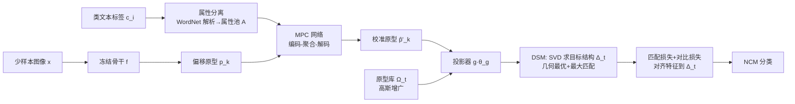

# Consistency-Driven Calibration and Matching for Few-Shot Class Incremental Learning

**会议**: ICLR 2026  
**OpenReview**: [https://openreview.net/forum?id=LxO83jNZKk](https://openreview.net/forum?id=LxO83jNZKk)  
**代码**: [https://github.com/wire-wqz/ConCM](https://github.com/wire-wqz/ConCM)  
**领域**: 少样本类增量学习 / 持续学习  
**关键词**: FSCIL, 原型校准, 神经坍缩, 动态结构匹配, 元学习, 联想记忆  

## 一句话总结
ConCM 把少样本类增量学习的核心困境重新拆成"特征—结构双重一致性"问题：先用受海马联想记忆启发的记忆感知原型校准修正少样本原型的偏移，再用动态结构匹配在每个增量会话里求解一个同时满足几何最优与最大匹配的可演化嵌入结构，从而在 mini-ImageNet / CIFAR100 / CUB200 上把增量会话的调和均值刷到 SOTA。

## 研究背景与动机
- **领域现状**：少样本类增量学习（FSCIL）要求模型在基础会话用充足数据训练骨干网络后冻结，再用每个增量会话仅 5 张样本的新类持续扩展，既不能忘旧也要学新。主流做法是冻结骨干 + 原型分类器，或用"前瞻学习"（prospective learning）在基础会话提前为新类预留嵌入空间，如 FACT 造虚拟原型、NC-FSCIL 预设等角紧框架（ETF）、OrCo 构造全局正交空间。
- **现有痛点**：作者通过 mini-ImageNet 上的初步实验暴露两个症结。其一是**特征不一致**——少样本原型与真实类中心存在偏移（原型偏差 $1-\cos(p,p_{real})$ 越大，新类准确率越低）；其二是**结构不一致**——即便校准了原型，新类样本仍被大量误判为旧类（false positive），根因是固定结构对新类施加了刚性先验，限制了匹配灵活性。
- **核心矛盾**：前瞻学习类方法靠"压缩旧类嵌入"换取新类性能，缺乏跨会话的全局结构优化；ETF/正交这类固定结构又把新类锁死在预设几何里，二者都没真正消解新旧知识冲突。
- **本文目标**：从统一的"一致性结构化学习"视角出发，同时解决原型偏差（特征侧）与结构固化（结构侧）两类不一致，实现稳健的持续学习。
- **核心 idea**：**双重一致性视角**——把 FSCIL 优化困境重述为特征一致性与结构一致性的联合保证；**记忆驱动**——模仿海马联想记忆的"分离—补全"两阶段对原型做语义校准；**结构可演化**——每个会话动态求解一个无需类别数先验、且理论上保证几何最优与最大匹配的目标结构。

## 方法详解

### 整体框架
ConCM 在冻结骨干之上串联两个模块：先用记忆感知原型校准（MPC）修正每个新类的原型，再把校准后的特征喂给一个可训练投影器 $g(\cdot;\theta_g)$，由动态结构匹配（DSM）在当前会话生成目标几何结构并把特征对齐过去。推理时用最近类均值（NCM）分类器按特征到几何向量的距离判类。

### 关键设计

**1. 记忆感知原型校准（MPC）：把基础类的语义属性"搬运"到新类上。** 海马联想记忆的工作方式是先把感知信息编码分离成高层表征建立记忆索引，再在收到局部信号时检索整合还原完整表征。MPC 据此分两步：**属性分离**阶段用 WordNet 解析基础类文本标签，抽取同义词、上位词等潜在语义属性构成候选属性池 $A=\{a_i\}$，并为每个属性算一个视觉原型 $f_{a_i}=\frac{1}{|D_{0a_i}|}\sum_{(x,y)\in D_{0a_i}} f(x,\theta_f)$（拥有该属性所有样本的均值特征），同时用二值关联矩阵 $R_t$ 记录"类—属性"归属。**属性补全**阶段由一个编码—聚合—解码网络做交叉注意力检索：相关性权重 $w_{a_i}^k$ 同时融合语义关联（属性词嵌入与类标签词嵌入的相似度）和视觉关联（属性视觉原型与类原型的距离），并用 $r_{a_i,k}$ 做掩码，聚合输出 $\xi_k = h_e(p_k)+\sum_i \mathrm{Softmax}(w_{a_i}^k)\cdot h_e(f_{a_i})$ 再解码成校准原型 $\hat p_k$。网络在基础会话用元学习训练——构造 K-shot 情节任务得到偏移原型 $p_k^{meta}$，以真实基础原型 $p_k^{base}$ 为监督，最小化 $L_{MSE}=\mathrm{MSE}(h(p_k^{meta},\Pi_0;\theta_h),p_k^{base})$ 学会"补全缺失属性"。最终原型按 $\hat p'_k=\alpha p_k+(1-\alpha)\hat p_k$ 加权融合，再经高斯采样增广出训练集供投影器使用。

**2. 动态结构匹配（DSM）：每个会话现场求一个最优可演化结构。** 作者把目标几何结构 $\Delta_t=[\delta_1,\dots,\delta_{N_t}]$ 约束在两个性质上。**几何最优**借神经坍缩理论，要求原型等距分离：$\delta_i^\top\delta_j=\frac{N_t}{N_t-1}\lambda_{i,j}-\frac{1}{N_t-1}$（$i=j$ 时 $\lambda=1$ 否则 $0$）；**最大匹配**则要求嵌入新类时结构变化最小，即最大化目标结构与含新类历史初始结构 $\Delta'_t$ 的相似度 $\arg\max\sum_i\langle\delta'_i,\delta_i\rangle$。关键在于这两个目标有闭式解（Theorem 1）：对 $\Delta'_t(I_{N_t}-\frac{1}{N_t}\mathbf{1}\mathbf{1}^\top)$ 做紧凑 SVD 得 $W\Lambda V^\top$，令 $U_t=WV^\top$，则 $\Delta_t=\sqrt{\frac{N_t}{N_t-1}}U_t(I_{N_t}-\frac{1}{N_t}\mathbf{1}\mathbf{1}^\top)$。证明把最大匹配化归成正交约束下的迹最大化经典问题，SVD 给出最优解。这套机制不需要预知总类别数 $T$，让结构随会话"长出来"而非提前钉死。

**3. 特征—结构联合优化：把投影特征拽向当前结构。** 有了目标结构 $\Delta_t$，投影器用两项损失把特征对齐过去。**匹配损失**是以结构向量为类中心的分类损失 $L_{Match}(z_i)=-\log\frac{\exp(\langle z_i,\delta_k\rangle)}{\sum_j\exp(\langle z_i,\delta_j\rangle)}$，拉近投影类均值与对应 $\delta_k$；**监督对比损失**把结构向量 $\delta_k$ 当作锚点放进正样本集 $L_{Cont}$，显式注入结构信息、增强类内紧致。两者相加 $L_{Proj}=L_{Match}+L_{Cont}$ 联合训练投影器。训练数据来自原型库 $\Omega_t$（存基础类原型与协方差对角）的高斯增广，缓解旧类样本不可见、新类样本不足的问题。

## 实验关键数据

### 主实验（增量会话调和均值 HM / AHM / 末会话准确率 FA）

mini-ImageNet（节选）：

| 方法 | AHM↑ | FA↑ |
|------|------|-----|
| NC-FSCIL (2023) | 52.62 | 57.97 |
| OrCo (2024) | 57.30 | 56.04 |
| **ConCM** | **59.78** | **59.92** |

CIFAR100（节选）：

| 方法 | AHM↑ | FA↑ |
|------|------|-----|
| NC-FSCIL | 47.89 | 56.11 |
| OrCo | 57.12 | 52.19 |
| **ConCM** | **59.05** | **58.33** |

ConCM 在三个数据集全面领先，增量会话的最高单会话提升达 mini-ImageNet +3.20%、CIFAR100 +3.41%、CUB200 +1.70%；相对静态结构的 NC-FSCIL，AHM 提升 5.04%–11.16%；相对仅做家族级知识迁移的 PA，在 CUB200 提升 6.17% 且能泛化到无家族标签的通用数据集。

### 消融实验（Table 4，mini-ImageNet）

| g(·) | MPC | DSM | AHM↑ | FA↑ | NAcc↑ | PD↓ |
|------|-----|-----|------|-----|-------|-----|
| - | - | - | 22.00 | 52.62 | 12.84 | 31.35 |
| ✓ | - | - | 47.83 | 56.22 | 35.17 | 27.75 |
| ✓ | ✓ | - | 52.35 | 57.23 | 40.65 | 26.74 |
| ✓ | - | ✓ | 56.79 | 58.29 | 46.81 | 26.68 |
| ✓ | ✓ | ✓ | **59.78** | **59.92** | **51.74** | 24.05 |

MPC 与 DSM 单独分别带来 +4.52% 与 +8.96% AHM，二者合一（双重一致性）累计 +11.95%。

### 关键发现
- **缓解知识冲突**：以平衡错误率 BER 量化新旧冲突，ConCM 取得最低误分类率和最高新类准确率，全增量平均 NAcc 比次优高 2.8%（Table 3）。
- **结构一致性**：用结构匹配率 SMR 衡量初始与目标结构偏差，对比随机匹配 RM、贪心匹配 GM、固定结构 FS，ConCM 在所有增量会话取得最高 SMR 与 HM，即"用最小结构调整换最大匹配"。
- **可视化**：校准后原型明显贴近真实类中心，嵌入空间从杂乱散布变为紧致分布，直观印证特征与结构双重一致性。

## 亮点与洞察
- 把 FSCIL 的"稳定—可塑"权衡重新诊断为**特征不一致 + 结构不一致**两个可量化的子问题，并各给一记，视角清晰、可证伪（初步实验直接画出偏差—准确率曲线和误分类来源）。
- DSM 最漂亮的地方是把"几何最优 + 最大匹配"两个看似要 trade-off 的目标证明成有 SVD 闭式解的统一问题，无需类别数先验、无需迭代搜索，工程上干净。
- MPC 用 WordNet + 视觉原型双通道关联做属性检索，把"语义先验"以可解释的属性形式注入，比单纯靠文本嵌入融合（TEEN）更细粒度，也比家族级迁移（PA）更通用。

## 局限与展望
- 属性分离依赖 WordNet 对类标签做语义扩展，对没有良好词典覆盖或标签语义稀薄的领域（细粒度工业类别、非英语标签）可能退化；属性视觉原型还需基础会话有足量样本。
- DSM 的几何最优建立在神经坍缩理论之上，要求投影维度 $d_g>N_t$，当总类别数极大时维度与存储成本会上升；最大匹配以"最小结构变化"为目标，是否在所有任务分布下都是最优策略仍待检验。
- 实验集中在三个标准 FSCIL 基准与 5-shot 设定，更换 shot 数、跨域增量、长会话序列下的表现论文未充分展开。

## 相关工作与启发
- **前瞻学习类**（FACT、NC-FSCIL、OrCo）为新类预留固定/正交/ETF 空间，ConCM 的反例是把"固定结构"换成"可演化结构"，提示固定先验是 FSCIL 误分类的隐藏元凶。
- **特征融合类**（TEEN、PA、语义子空间正则）用语义关系融合新旧原型，MPC 与之同源但走得更细——做到属性级检索而非类级/家族级。
- 启发：本文"把优化困境拆成可量化的多重一致性，再各给闭式/可学习模块"的范式，可迁移到其他存在稳定—可塑权衡的持续学习场景；DSM 的 SVD 闭式结构求解也值得迁移到需要动态扩展原型空间的开放世界识别。

## 评分
- **新颖性**: ⭐⭐⭐⭐ 双重一致性视角 + DSM 的几何最优/最大匹配闭式解组合是真新东西，记忆感知属性校准也有记忆神经科学的独特动机。
- **实验充分度**: ⭐⭐⭐⭐ 三基准全面 SOTA，消融、BER/SMR 量化、可视化、理论证明齐全；扣分在 shot 数与跨域设定未充分扫描。
- **写作质量**: ⭐⭐⭐⭐ 问题诊断—方法—理论的逻辑链清晰，初步实验把动机讲得很实；公式密度偏高、部分符号需对照附录。
- **价值**: ⭐⭐⭐⭐ 在 FSCIL 这个强基准方向把 SOTA 推进 3%+ 且开源，动态结构思想对持续学习社区有借鉴意义。

<!-- RELATED:START -->

## 相关论文

- [\[ICLR 2026\] Neural Force Field: Few-shot Learning of Generalized Physical Reasoning](neural_force_field_few-shot_learning_of_generalized_physical_reasoning.md)
- [\[ICLR 2026\] Random Anchors with Low-rank Decorrelated Learning: A Minimalist Pipeline for Class-Incremental Medical Image Classification](random_anchors_with_low-rank_decorrelated_learning_a_minimalist_pipeline_for_cla.md)
- [\[CVPR 2026\] Data-Centric Meta-Learning for Robust Few-Shot Generalization](../../CVPR2026/others/data-centric_meta-learning_for_robust_few-shot_generalization.md)
- [\[AAAI 2026\] DcMatch: Unsupervised Multi-Shape Matching with Dual-Level Consistency](../../AAAI2026/others/dcmatch_unsupervised_multi-shape_matching_with_dual-level_consistency.md)
- [\[ICLR 2026\] Measuring Uncertainty Calibration](measuring_uncertainty_calibration.md)

<!-- RELATED:END -->
