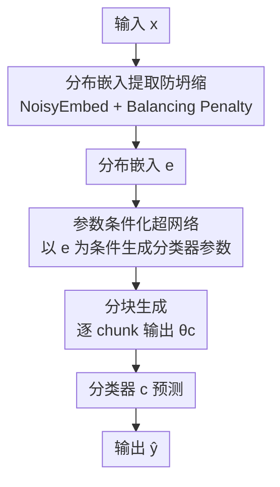

# Deploying Models to Non-participating Clients in Federated Learning without Fine-tuning: A Hypernetwork-based Approach

**会议**: ICLR2026  
**OpenReview**: [https://openreview.net/forum?id=9XkmuBR0r1](https://openreview.net/forum?id=9XkmuBR0r1)  
**代码**: https://github.com/Soptq/hyperfedzero-public  
**领域**: 联邦学习 / 分布泛化  
**关键词**: 联邦学习, 超网络, 零样本个性化, 域内分布偏移, 非参与客户端

## 一句话总结
HyperFedZero 用一个以"分布嵌入"为条件的超网络，在联邦学习里直接为没参与训练、且数据分布有域内偏移的新客户端**动态生成分类器参数**，从而在零微调、几乎零额外开销的前提下完成个性化部署，在 7 个数据集、5 个模型上稳定超过现有方法。

## 研究背景与动机
**领域现状**：联邦学习（FL）让多个客户端在不共享原始数据的前提下协作训练，主流的难点是数据异质性（non-i.i.d.）。现有方法基本都在"参与训练的客户端"上做文章——要么学一个个性化模型（pFedMe、Ditto），要么对全局模型做微调（基础微调、正则化微调、选择性微调），让模型更贴合本地数据。

**现有痛点**：这套范式假设"谁用模型，谁就参与过训练、且能微调"。但真实部署里，模型常常被推到**没参与训练的边缘设备（非参与客户端）**上，这些设备有两个硬约束：(1) 它们的数据虽然同域，但分布和训练时见过的不一样（类别频率不同、特征偏移，即**域内分布偏移**）；(2) 算力/通信受限，做不起本地微调。作者在 Figure 1a 里观察到一个尴尬现象：SOTA 个性化 FL 方法在见过的客户端上表现极好，但一搬到有域内分布偏移的新客户端上就**灾难性崩溃**——说明它们根本没有"零样本个性化"能力。

**核心矛盾**：现有方法把个性化做成了一次性的、依赖微调的"事后适配"，而部署场景要的是**对未见分布的即时适配**。MoE 路线（FedJets）虽然能用专家分工实现零样本个性化，但要在服务端/客户端维护大量专家、频繁同步专家参数，开销大到不实用。

**本文目标**：在严格资源约束下，把训练好的模型部署到非参与客户端，不微调、不显著增加开销，还能扛住域内分布偏移。

**切入角度**：与其"针对每个客户端的数据单独微调"，不如换个角度——**能不能把"分布感知"这件事直接编码进模型的前向过程？** 即模型不再死板地学"输入→标签"，而是学"输入→最优模型参数→标签"，让参数本身随输入分布而变。

**核心 idea**：用一个超网络（hypernetwork）以输入的"分布嵌入"为条件，**现场生成**适配该分布的分类器参数，把分布感知的归纳偏置直接注入前向传播，从而免微调地完成零样本个性化。

## 方法详解

### 整体框架
HyperFedZero 在每个客户端上只放两个**共享**模块：一个分布提取器 $f: \mathcal{X}\to\mathcal{E}$（参数 $\theta_f$）和一个超网络 $h: \mathcal{E}\to\Theta_c$（参数 $\theta_h$）。一次前向分三步走：① 分布提取器把输入 $x_i$ 编码成归一化的分布嵌入 $e_i$（相似嵌入意味着相似分布），过程中用 NoisyEmbed 和 Balancing Penalty 防止特征坍缩；② 超网络以 $e_i$ 为条件，**分块（chunk-by-chunk）生成**一套分类器参数 $\theta^c_i$；③ 用这套生成的参数初始化分类器 $c$，对 $x_i$ 输出预测标签 $\hat{y}$。训练阶段三个模块联合优化（交叉熵 + Balancing Penalty）；部署到非参与客户端时，$f$ 和 $h$ 全部冻结，仅凭新客户端自己的数据就能在本地生成贴合其分布的分类器，全程不上传任何个性化权重。

关键的范式转变是：传统 FL 学的是 $\arg\min_{\theta_c}\sum_i w_i F_i((x_i,y_i),\theta_c)$，一套全局参数 $\theta_c$ 通吃所有分布；HyperFedZero 把目标改写为 $\arg\min_{\theta_c}\sum_i w_i F_i((x_i,y_i),\theta_c, e_i)$，让预测显式地条件于输入分布 $e_i$。

### 关键设计

**1. 参数条件化的分布感知预测：让参数随分布变，而不是让一个分类器硬扛所有分布**

把"条件于分布 $e$"落地有两条路：Opt.1 把 $e$ 拼进分类器的输入（$\Pr(y_i=\hat{y}_i\mid\{x_i,e_i\};\theta_c)$），Opt.2 把 $e$ 作用到分类器的参数上（$\Pr(y_i=\hat{y}_i\mid x_i;\theta_c\mid e_i)$）。HyperFedZero 选 Opt.2。原因有两点：一是 Opt.1 里只有**一个**分类器要服务所有输入，相当于在 Pareto 前沿上来回折中，表达力受限；二是 Opt.1 的分类器可以干脆**忽略** $e_i$，让分布嵌入形同虚设。Opt.2 等价于"为不同的 $e_i$ 显式地启用不同模型"，相比之下有指数级的参数效率，论文实验也验证了 Opt.2 一致优于 Opt.1。形式上目标变为 $\arg\max_{\theta_c}\sum_i w_i \Pr(y_i=\hat{y}_i\mid x_i; h(e_i;\theta_h))$——分类器参数完全由超网络 $h$ 在 $e_i$ 条件下生成。这正是"学输入→参数→标签"取代"学输入→标签"的具体兑现。

**2. NoisyEmbed + Balancing Penalty：根治分布嵌入的特征坍缩**

直接用 $f(x_i)$ 当分布嵌入会出大问题——**特征坍缩**：所有 $e_i$ 挤进嵌入空间里一个很窄的区域。根因很微妙：训练时所有客户端的分布都被 Equation 1 充分看到了（此时根本没有"非参与客户端"），既然所有分布都可见，为不可见分布定制模型的收益就接近零，提取器于是退化到把所有 $x_i$ 映射到几乎相同的 $e_i$ 这种平凡解。作者借鉴 MoE 里防专家坍缩的负载均衡思路，用两招联手破解。NoisyEmbed 显式往 $f(x_i)$ 注入可学习噪声以增加随机性与鲁棒性：$e=\mathrm{softmax}(f(x_i;\theta_f)+z\cdot\mathrm{softplus}(\mathrm{noisy}(x_i)))$，其中 $z\sim\mathcal{N}(0,1)$，$\mathrm{noisy}(\cdot)$ 是一个额外的全局噪声网络，按输入定制噪声幅度。Balancing Penalty 则隐式鼓励对嵌入空间的探索，把一项正则加进损失：

$$F_i(\cdot, e_i) = F_i(\cdot) + \alpha\,\frac{\mathrm{var}(P e_i)}{\mathrm{mean}(P e_i)} + \beta\,\mathbb{E}(-e_i\log e_i)$$

第一项（变异系数）鼓励 $e_i$ 在嵌入空间里均匀铺开、避免都挤一块；第二项（熵）促使嵌入沿特定维度聚簇，让结构更清晰。两者一推一聚，保证嵌入既分散又有判别性。

**3. 分块超网络：在灵活性与设备开销之间找平衡**

Opt.2 虽好，但天然带来两个麻烦：分类器之间相互独立、丢掉了知识共享；而且为不同 $e_i$ 维护多套模型会违背 FL 对模型效率和资源占用的要求。HyperFedZero 用**分块超网络（chunked hypernetwork）**化解：$h$ 就是一个结构可配、带可配 chunk 大小的简单 MLP，它把要生成的分类器参数按固定大小切成若干组（余数丢弃），给每组分配一个唯一的 chunk 嵌入；生成时 $h$ 不是一次吐出全部参数，而是**逐块（chunk-by-chunk）生成**，每块的 MLP 输出由对应 chunk 嵌入引导。这样既能依 $e_i$ 生成"千人千面"的模型，又通过共享的 $h$ 维持全局知识共享，还把要在设备上管理的参数量压下来。复杂度上，由于训练时每个客户端同时最小化经验风险和 Balancing Penalty、不引入额外步骤，时间复杂度与 FedAvg 持平（$O(NEK)$）；提取器和分块超网络都可以做得很紧凑，使 $|\theta_f|+|\theta_h|\approx|\theta_c|$，空间复杂度也保持 $O(N)$。

### 损失函数 / 训练策略
训练时每个客户端同时优化分类交叉熵损失与 Balancing Penalty（含变异系数项与熵项，权重 $\alpha,\beta$），NoisyEmbed 的噪声网络也随之学习。$f$ 与 $h$ 通过标准 FedAvg 协议在服务端聚合后广播，整个过程客户端不共享原始数据，隐私攻击面与 FedAvg 完全一致，secure aggregation、差分隐私等技术可直接套用。部署时冻结 $f$、$h$，仅在本地按客户端自身数据生成分类器，生成的个性化权重永不上传。

## 实验关键数据

### 主实验
在 7 个数据集（MNIST/FMNIST/EMNIST/SVHN/Cifar10/Cifar100/Tiny-ImageNet）、5 个模型（MLP/LeNet-S/LeNet/ZenkeNet/ResNet）上评测，核心指标是 **zACC（零样本准确率，非参与客户端上）**，并附 gACC（全局）、pACC（个性化）。下表摘录 $N=10$ 时 zACC 的代表性对比（数字越大越好）：

| 数据集 / 模型 | 指标 | HyperFedZero | FedAvg | FedJets (MoE) |
|--------------|------|--------------|--------|---------------|
| MNIST / MLP | zACC | **95.49** | 93.06 | 93.75 |
| EMNIST / MLP | zACC | **76.82** | 70.18 | 69.14 |
| Cifar100 / ResNet | zACC | **57.24** | 43.32 | 54.69 |
| Tiny-ImageNet / ResNet | zACC | **16.06** | 13.41 | 13.15 |

HyperFedZero 在 zACC 这一行对所有 baseline 保持一致领先；在难数据集（Cifar100、Tiny-ImageNet）上对 FedAvg 的提升尤为明显（如 Cifar100 ResNet 提升约 14 个点），同时 gACC / pACC 保持与最强 baseline 相当。

### 消融实验

| 配置 | 关键作用 | 说明 |
|------|---------|------|
| Full model | 完整 HyperFedZero | NoisyEmbed + Balancing Penalty + 分块超网络（Opt.2） |
| w/o NoisyEmbed | 去掉显式噪声 | 嵌入更易坍缩、零样本适配变差（详见原文消融） |
| w/o Balancing Penalty | 去掉均匀/聚簇正则 | 嵌入空间探索不足、判别性下降 |
| Opt.1（输入条件化） | 换成把 $e$ 拼进输入 | 一致弱于 Opt.2，验证"参数条件化"的必要性 |

### 关键发现
- **特征坍缩是核心障碍**：去掉 NoisyEmbed 或 Balancing Penalty 后分布嵌入会塌进窄区域，零样本个性化随之退化，二者缺一不可。
- **参数条件化 > 输入条件化**：Opt.2（超网络生成参数）一致优于 Opt.1（拼接输入），印证了"让参数随分布变"比"让一个分类器硬扛所有分布"更有效。
- **开销几乎为零**：时间复杂度与 FedAvg 相同（$O(NEK)$），总参数量与单独用分类器相当（$|\theta_f|+|\theta_h|\approx|\theta_c|$），相比 MoE 路线（FedJets）省掉了大量专家管理与同步开销。

## 亮点与洞察
- **把"分布感知"塞进前向传播**：不靠事后微调、而是让模型在前向里就根据输入分布生成参数，这个"输入→参数→标签"的重构是全文最"啊哈"的地方，直接绕开了非参与客户端无法微调的死结。
- **对特征坍缩的归因很到位**：作者指出训练阶段"所有分布都可见"导致定制收益趋零、提取器退化到平凡解——这个解释把 NoisyEmbed + Balancing Penalty 的必要性说得很硬。
- **分块超网络是可复用的 trick**：用 chunk 嵌入逐块生成大模型参数、既保留全局共享又控制设备开销，这套思路可迁移到任何"需要为不同条件生成大量个性化参数但又不想爆显存"的场景。
- **隐私面与 FedAvg 等价**：只共享 $f$、$h$ 的全局参数，个性化权重全程本地，secure aggregation / 差分隐私可直接套用，落地友好。

## 局限与展望
- **聚焦域内分布偏移**：方法针对"同域、分布不同"的非参与客户端，对真正的跨域（out-of-domain）泛化是否同样有效，论文未深入。
- **生成的是分类器参数**：超网络主要生成分类器（head）参数，对整网/骨干的动态生成扩展性、以及在更大模型上的稳定性仍待验证。
- **数据集规模偏经典**：实验以 MNIST 系列、Cifar、Tiny-ImageNet 为主，向更大规模、更复杂模态（如大模型微调场景）迁移的效果是值得跟进的方向。
- **超参敏感性**：Balancing Penalty 的 $\alpha,\beta$ 与 chunk 大小如何选，跨任务的鲁棒性还需要更系统的刻画。

## 相关工作与启发
- **vs 个性化 FL（pFedMe / Ditto / FedProx）**: 它们为参与客户端学个性化模型或微调全局模型，本文则面向**非参与**客户端、且免微调，靠超网络现场生成参数，区别在于把个性化从"事后适配"变成"前向内生"。
- **vs MoE 路线 FedJets**: FedJets 也能零样本个性化，但要维护大量专家、频繁同步专家参数，开销大；HyperFedZero 用一个紧凑的分块超网络在本地生成**样本级**权重，时间/空间复杂度与 FedAvg 持平。
- **vs 超网络生成客户端权重的 OD-PFL / PeFLL**: 它们生成的是客户端级权重，可能带来额外通信成本或本地数据共享的隐私风险；HyperFedZero 完全在客户端本地生成、不上传个性化权重，隐私面与 FedAvg 一致。
- **vs 域泛化 / 测试时自适应（FedSR / FedTHE+ / ATP）**: 这两条线分别学域不变特征或在测试时动态调整，但都没处理"资源受限下的域内分布偏移"这一实际痛点，正是本文的切口。

## 评分
- 新颖性: ⭐⭐⭐⭐⭐ 把分布感知归纳偏置编码进前向、用超网络免微调生成参数，是 FL 非参与客户端部署的新颖切入。
- 实验充分度: ⭐⭐⭐⭐ 覆盖 7 数据集 5 模型、含消融与可视化，但数据集规模偏经典。
- 写作质量: ⭐⭐⭐⭐ 问题刻画（域内分布偏移 vs 跨域）和坍缩归因清晰，公式与动机对应紧密。
- 价值: ⭐⭐⭐⭐⭐ 直击"训练好的模型如何零成本部署到未见设备"这一 FL 落地核心痛点，且开销几乎为零。

<!-- RELATED:START -->

## 相关论文

- [\[ICLR 2026\] Layerwise Federated Learning for Heterogeneous Quantum Clients using Quorus](layerwise_federated_learning_for_heterogeneous_quantum_clients_using_quorus.md)
- [\[ICLR 2026\] HippoTune: A Hippocampal Associative Loop–Inspired Fine-Tuning Method for Continual Learning](hippotune_a_hippocampal_associative_loopinspired_fine-tuning_method_for_continua.md)
- [\[ICLR 2026\] Federated ADMM from Bayesian Duality](federated_admm_from_bayesian_duality.md)
- [\[ICLR 2026\] A Federated Generalized Expectation-Maximization Algorithm for Mixture Models with an Unknown Number of Components](a_federated_generalized_expectation-maximization_algorithm_for_mixture_models_wi.md)
- [\[ICML 2026\] Markov Chain Monte Carlo without Evaluating the Target: An Auxiliary Variable Approach](../../ICML2026/others/markov_chain_monte_carlo_without_evaluating_the_target_an_auxiliary_variable_app.md)

<!-- RELATED:END -->
