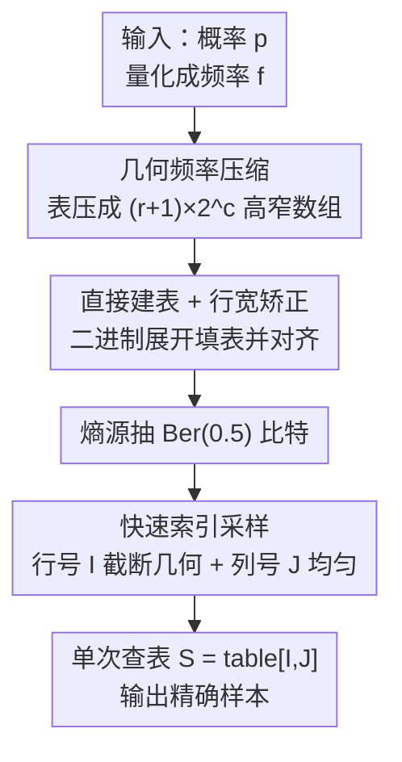

# Energy-Efficient Random Variate Generation via Compressed Lookup Tables

**会议**: ICLR 2026  
**OpenReview**: [https://openreview.net/forum?id=hRY0ytSnM0](https://openreview.net/forum?id=hRY0ytSnM0)  
**代码**: 无  
**领域**: 高效采样 / 概率机器学习 / 系统与硬件能效  
**关键词**: 随机变量生成, 压缩查找表, 能效, 熵最优采样, 精确采样

## 一句话总结
本文提出 cLUT（compressed lookup table）方法：用一种对查找表做无损压缩的「几何频率」方案，把朴素查找表压成「高而窄」的二维数组，再配一个只需若干随机比特、单次内存查表的采样步骤，实现对任意有限离散分布的精确采样，速度比主流 Python 采样器快 10–100×，比 SOTA 的 C 实现省 25–50% 能耗。

## 研究背景与动机

**领域现状**：从概率分布中采样是变分自编码器、对比学习负采样、扩散模型、贝叶斯推断等几乎所有概率机器学习方法的底层操作。主流库（NumPy / PyTorch / JAX）的离散采样普遍基于 Inversion（逆变换）等方法，在数据中心和终端设备上被海量、高频地调用。

**现有痛点**：采样在很多任务里是吞吐和能耗的主要瓶颈，但学界长期只关注「采样质量」而忽视「单次采样的能量成本」。更隐蔽的问题是精度：标准库的算法建立在「实数 RAM」假设和「能从单位区间取到无限精度均匀样本」这两个理论前提上，而真实硬件只有有限位浮点，导致生成分布以无法量化的方式偏离目标分布，无法给出理论保证——它们其实是**近似采样器**。

**核心矛盾**：精确采样和高效率之间存在张力。理论上熵最优的离散采样（Knuth-Yao 生成树）每个样本只需 $H(p)$ 到 $H(p)+2$ 比特，但需要随分布精度**指数级**增长的内存；后续工作（区间算法、FLDR、ALDR）虽把内存降到线性，却要在采样时做昂贵的二分查找或多表搜索，实际效率受限。朴素查找表方案虽是单次查表、极快，但要表示 $b$ 比特精度的概率就要 $N=2^b$ 大小的表，内存随精度指数爆炸。

**本文目标**：造一个对任意有限离散分布都适用、且同时做到「精确 + 快 + 省能 + 精度可控」的采样器，关键是要绕开「内存指数爆炸」和「采样时昂贵搜索」这两个老问题。

**切入角度**：作者注意到朴素查找表的结构里藏着巨大冗余——一个频率为 $f_i$ 的元素被重复存了 $f_i$ 份。如果按频率的二进制展开来组织表，就能用「一行代表一个 2 的幂次频率」的方式无损地压掉这种冗余，把 $N=2^{r+c}$ 的表压成 $(r+1)\cdot 2^c$，压缩比随行数 $r$ 指数增长。

**核心 idea**：用「几何频率压缩」把查找表压成高而窄的二维数组，采样时只需「按截断几何分布抽一个行号 + 均匀抽一个列号」，一次直接索引取值——既保留单次查表的速度，又消除了内存爆炸，还是精确采样。

## 方法详解

### 整体框架
cLUT 把采样拆成一次性的**预处理（建表）**和高频重复的**采样**两个阶段。输入是 $n$ 个结果 $x_1,\dots,x_n$ 及其概率 $p_1,\dots,p_n$；预处理把概率量化成频率 $f_i=\mathrm{round}(p_i\cdot 2^b)$（满足 $\sum_i f_i=2^b=N$），再直接从频率的二进制展开构造出**压缩查找表**——不必先建出会撑爆内存的朴素表。采样阶段从熵源取若干 i.i.d. 的 $\mathrm{Ber}(0.5)$ 比特，算出一个行号 $I$ 和一个列号 $J$，在压缩表上做**单次查表** $S=\mathrm{compressedTable}[I,J]$ 即得一个样本。

整张表被组织成 $r+1$ 行、$2^c$ 列，满足 $2^{r+c}=2^b=N$。前 $r$ 行中第 $i$ 行对应频率 $2^{r-i}$，第 $r+1$ 行与第 $r$ 行一样对应频率 1。采样时行号 $I$ 服从截断几何分布、列号 $J$ 服从均匀分布，二者独立，因此抽到表项 $(I,J)=(i,j)$ 的概率恰为 $2^{-\min(i,r)-c}$，整体复现目标分布。

### 关键设计

**1. 几何频率压缩：用二进制展开把指数大小的表无损压成高而窄的数组**

这针对「朴素查找表内存随精度 $b$ 指数爆炸」的痛点。核心观察是：朴素表里频率为 $f_i$ 的元素被冗余地复制了 $f_i$ 份，而任何频率都能写成 2 的幂次之和（即二进制展开）。于是把表组织成 $r+1$ 行的二维数组，第 $i$ 行代表频率 $2^{r-i}$，一个元素 $x_i$「出现在第 $j$ 行」当且仅当 $f_i$ 的第 $j$ 个比特为 1。这样原本 $N=2^{r+c}$ 的表被压到 $(r+1)\cdot 2^c$ 项，压缩比为

$$\rho = \frac{2^r}{r+1}.$$

压缩比随 $r$ 指数增长（仅有 $r+1$ 的线性修正）：$r$ 越大，表越「高而窄」。论文给的例子里，频率 $f=(7,5,3,1)$、$b=4$ 时 $\rho=2^3/4=2$，表小一半；而把标准高斯按 16 位浮点、$b=20$ 离散化得到 $n=20136$ 个值，压缩后只有 114688 项（约 229 kB，$\rho\approx 9.14\times$）；Gamma 分布在 $b=24$ 时甚至能压到 $\rho\approx 170.67\times$。这套压缩是无损的，因为压缩表里每个元素的总频率恰好等于它在朴素表里的频率（如例子中「a」的频率 $4+2+1=7$）。

**2. 快速索引采样：一次截断几何 + 一次均匀，单比特级开销取代昂贵搜索**

这针对「FLDR/ALDR/区间算法等在采样时要做二分查找或多表搜索」的痛点。压缩表的「按 2 的幂次分行」结构让行号能用一个极廉价的过程抽出来：行号 $I$ 服从截断几何分布

$$P(I=i)=\max(2^{-i},2^{-r}),\quad i=1,\dots,r+1,$$

实现上就是不断抛公平硬币、抛到 1 就停（Algorithm 1 第 2–8 行的 while 循环），无需查找；列号 $J$ 在 $\{1,\dots,2^c\}$ 上均匀采，用任意均匀采样器一步取得。两个索引独立组合后，表项被抽中的概率正好是 $2^{-\min(i,r)-c}$，精确还原目标分布。最终只做**一次内存查表**取值，没有条件分支、没有跨表搜索——这也是它比 ALDR（要多次访问扁平化搜索树）更省能的根因：单次基于索引的内存访问翻转的晶体管更少。

**3. 直接建表与行宽矫正：不建朴素表、并把不等长的行对齐成矩形**

这解决两个工程问题。其一是建表本身不能先建出指数大的朴素表，否则预处理就先把内存撑爆——作者直接从频率 $f_i$ 的二进制展开填表，配合一个「保和舍入」方案把 $f$ 调到恰好等于 $2^b$，使采样**无需拒绝（rejection-free）**。其二是初始构造时各元素二进制展开里「为 1 的比特数」不同，导致每行宽度不等，破坏了「列号均匀采样」所需的规整结构。于是做一步**行宽矫正**（Algorithm 2 / Figure 2）：把高行里的元素往低行搬、每下移一行频率减半就复制一份（如频率 8 的「a」被换成第 2 行 1 个「a」+ 底行 4 个「a」），在保持每个值总频率不变的前提下让所有行等长，构成规整的 $(r+1)\times 2^c$ 矩形表，保证采样阶段的均匀列采样成立。

### 一个完整示例
以分布 $x=(a,b,c,d)$、$p=(7/16,5/16,3/16,1/16)$、$b=4$ 为例。频率 $f=(7,5,3,1)$，朴素表要存 16 项（7 个 a、5 个 b、3 个 c、1 个 d）。按二进制展开压缩后得到一张 4 行（$r=3$）、2 列（$c=1$）的压缩表，只有 8 项。采样时：先抛硬币定行号——50% 概率停在第 1 行（频率最高的元素聚集处），否则继续往下；再均匀抽列号从该行 2 个槽位里选一个；最后单次查表取出对应的符号。验证频率：压缩表里「a」分布在频率 4、2、1 的三行，合计 $4+2+1=7$，与朴素表一致——压缩无损、采样精确。

## 实验关键数据

### 主实验
评测在 Intel i7-1255U + 16 GiB 笔记本上进行，用 RAPL 硬件计数器读能耗，测试分布为 $n\in[10^1,10^7]$ 的离散化指数分布。

对比主流 Python 采样器，生成 $10^7$ 个样本的墙钟时间（秒）：

| 方法 | $n\in[10^1,10^5)$ 采样 | $n\in[10^6,10^7)$ 采样 |
|--------|------|------|
| NumPy | 0.668 | 9.625 |
| PyTorch | 0.607 | 3.377 |
| JAX | 0.365 | 0.798 |
| **cLUT** | **0.037** | **0.102** |

小分布约 10× 提速，到 $10^6\sim10^7$ 量级提速超过 100×，且 cLUT 是精确采样而三者均为近似。

对比 SOTA 的 C 实现（Alias / ALDR / FLDR），单次采样的能耗、时间、功率：

| 方法 | $n\in[10^7,10^8)$ 能耗(nJ) | 时间(ns) |
|--------|------|------|
| ALDR | 1223.5 | 102.8 |
| Alias | 887.7 | 55.9 |
| FLDR | 1214.4 | 101.4 |
| **cLUT** | **450.2** | **33.0** |

cLUT 在所有分布尺寸上采样时间最短，相比 SOTA 省 25–50% 能耗、快 30–40%，且大分布优势更明显。

### 消融 / 分析实验

| 分析维度 | 关键结果 | 说明 |
|------|---------|------|
| 比特效率 | 期望 $b-r+2-2^{-(r-1)}$ 比特/样本 | 逼近信息论下界 $H(p)$，高熵分布近最优 |
| 峰值内存 | 略高于其他 SOTA | 预处理期内存占用稍大 |
| 压缩后表大小 | 低熵分布远小于对手 | 高压缩比带来小常驻内存 |
| 时间盈亏平衡点 $n^*$ | 与分布尺寸近似线性 | cLUT 预处理成本最高，需足够采样次数摊销 |
| 能耗盈亏平衡点 | 1 到 $<10^3$ | 能效收益很快盖过预处理开销，即便大分布也仅需少量采样即回本 |

TrueSkill 真实应用（用重要性采样扩展到任意先验）：相比 NumPy 离散采样器，cLUT 把总执行时间降 72%、总能耗降 34%；即便对上专门的高斯混合采样器，也省 48% 采样时间、17% 总能耗，且后验分布几乎一致。

### 关键发现
- **能耗不等比于时间**：能耗是动态功率对时间的积分，cLUT 的单次索引内存访问翻转更少晶体管，因此省能比省时更显著。
- **大分布是甜区**：分布越大、精度越高，传统采样越低效，而 cLUT 的查表+压缩优势越突出。
- **预处理是唯一短板**：cLUT 建表时间在所有方法里最高，但属一次性成本，靠后续海量采样摊销，能耗维度上回本极快。

## 亮点与洞察
- **把「频率的二进制展开」直接当成查找表的物理结构**：一行 = 一个 2 的幂次频率，既是无损压缩又天然支持「截断几何抽行 + 均匀抽列」的廉价采样，一个结构同时解决内存和搜索两个老问题，非常优雅。
- **采样的随机性消费贴近熵下界**：期望 $b-r+2-2^{-(r-1)}$ 比特/样本，且 50% 的样本只花 $b-r+1$ 比特，把「精确」和「熵高效」少见地同时拿下。
- **把能耗当一等公民来测**：用 RAPL + 外接功率计同时测 CPU 和墙插能耗，而非只看时间，这种「为高频底层操作省能」的视角可迁移到任何被海量调用的算子（量化、查表、激活函数近似等）。
- **索引方案还能复用到浮点均匀采样**：把行号、列号解释为浮点的指数和尾数，可对单位区间做真正均匀、覆盖最多可表示值的采样，绕开经典方法在均匀性统计检验上的失败。

## 局限与展望
- 作者承认 cLUT 的**预处理时间在所有对比方法里最高、峰值内存也略大**，对「采样次数很少」的场景不划算（盈亏平衡点在时间维度上随分布线性增长）。
- 方法**只直接适用于有限离散分布**，连续/无限离散分布要先经附录的离散化与尾部截断处理，离散化引入的误差与精度 $b$ 的权衡是额外负担。
- 评测集中在**单核、无多线程/向量化的 CPU** 设定（为公平对比刻意不开 SIMD），在真实多线程或 GPU 上相对优势是否保持，正文只给了附录指引，需进一步验证。
- 高压缩比依赖**低熵分布**；接近均匀的高熵分布里 $r$ 很小、压缩收益有限，此时优势主要来自采样路径而非内存。

## 相关工作与启发
- **vs Knuth-Yao 生成树**: 二者都追求熵最优的精确采样，但生成树要随精度指数级内存；cLUT 用几何压缩把内存降到 $(r+1)\cdot 2^c$，在保持近熵下界的同时可实际部署。
- **vs FLDR / ALDR**: 它们用线性内存但采样时要在扁平化搜索树上多次访存/二分；cLUT 是单张压缩表 + 单次直接索引，无条件分支，因而更快更省能。
- **vs Alias 方法**: Alias 预处理快、采样也快，但产出**近似**样本且无可控误差界；cLUT 是精确采样且精度可控，代价是更高的预处理开销（但能效维度很快回本）。
- **vs Marsaglia 等的压缩查找表**: 前人压缩方案需要条件分支并跨多张表搜索，效率受损；cLUT 用单张压缩表 + 直接索引消除了这些开销。

## 评分
- 新颖性: ⭐⭐⭐⭐ 「二进制展开即表结构」的几何压缩 + 截断几何抽行的组合简洁而新颖
- 实验充分度: ⭐⭐⭐⭐ 速度/能耗/内存/比特效率多维度对比 + TrueSkill 真实应用，唯 GPU/多线程留在附录
- 写作质量: ⭐⭐⭐⭐ 图例（Figure 1/2）把压缩与矫正讲得很直观，理论与工程衔接清楚
- 价值: ⭐⭐⭐⭐ 针对被海量调用的底层采样操作做能效优化，工程落地价值高

<!-- RELATED:START -->

## 相关论文

- [\[ICLR 2026\] From Fields to Random Trees](from_fields_to_random_trees.md)
- [\[AAAI 2026\] Deadline-Aware, Energy-Efficient Control of Domestic Immersion Hot Water Heaters](../../AAAI2026/others/deadline-aware_energy-efficient_control_of_domestic_immersion_hot_water_heater.md)
- [\[ICLR 2026\] Deterministic Bounds and Random Estimates of Metric Tensors on Neuromanifolds](deterministic_bounds_and_random_estimates_of_metric_tensors_on_neuromanifolds.md)
- [\[CVPR 2026\] Learning Long-term Motion Embeddings for Efficient Kinematics Generation](../../CVPR2026/others/learning_long-term_motion_embeddings_for_efficient_kinematics_generation.md)
- [\[ACL 2025\] ERU-KG: Efficient Reference-aligned Unsupervised Keyphrase Generation](../../ACL2025/others/eru-kg_efficient_reference-aligned_unsupervised_keyphrase_generation.md)

<!-- RELATED:END -->
