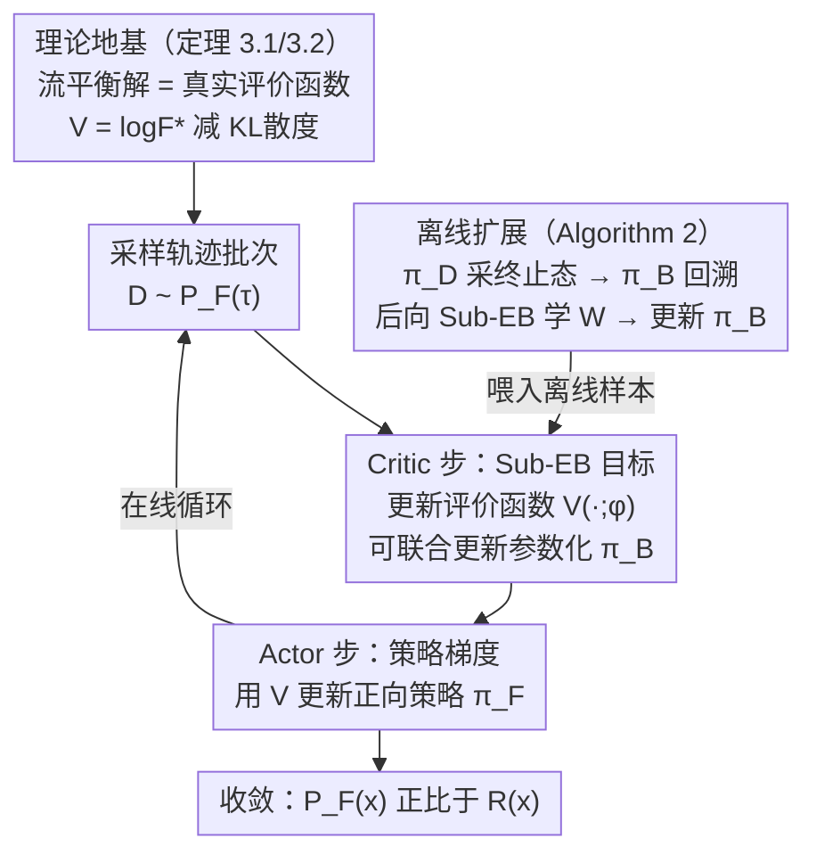

# Evaluating GFlowNet from Partial Episodes for Stable and Flexible Policy-Based Training

**会议**: ICLR 2026  
**arXiv**: [2603.01047](https://arxiv.org/abs/2603.01047)  
**代码**: [github.com/niupuhua1234/Sub-EB](https://github.com/niupuhua1234/Sub-EB)  
**领域**: 其他  
**关键词**: GFlowNet, 策略梯度, 评价函数, 流平衡, 组合优化

## 一句话总结

建立GFlowNet中状态流函数与策略评价函数之间的理论联系，提出子轨迹评价平衡（Sub-EB）目标用于可靠学习评价函数，增强策略基GFlowNet训练的稳定性和灵活性。

## 研究背景与动机

### GFlowNet简介

生成流网络（GFlowNet）是一种在组合空间 $\mathcal{X}$ 上采样的生成模型，目标是以正比于奖励函数 $R(x)$ 的概率采样 $x \in \mathcal{X}$。生成过程被分解为有向无环图（DAG）上的增量轨迹，正向策略 $\pi_F$ 逐步构建对象。

### 两大训练范式

**值基方法（Value-based）**：引入流函数 $F(s)$，通过流平衡条件（如Sub-TB）来隐式最小化分布差异。优点是支持off-policy采样，但流平衡不直接反映奖励的真实信息

**策略基方法（Policy-based）**：借鉴RL的Actor-Critic框架，引入评价函数 $V(s)$ 来估计策略在状态 $s$ 处的KL散度，然后用策略梯度更新 $\pi_F$。优点是on-policy训练更高效

### 核心挑战

策略基方法的关键瓶颈在于**如何可靠地学习评价函数 $V(s)$**。现有方法（$\lambda$-TD目标）基于边级别的不匹配度，只考虑状态 $s$ 之后的事件和边级错配，学习信号不够充分，且要求后向策略 $\pi_B$ 固定。本文的关键洞察是：流函数 $F(s)$ 和评价函数 $V(s)$ 之间存在深层联系——对固定的 $\pi_F$，流平衡条件的解恰好等于真实评价函数。

## 方法详解

### 整体框架

本文要解决的是策略基（policy-based）GFlowNet 里"评价函数 $V(s)$ 怎么学才稳"这个老大难——现有 $\lambda$-TD 目标只看一条边的错配，信号太弱、还逼着后向策略 $\pi_B$ 固定。作者的破局点是把值基（value-based）方法里行之有效的"流平衡"思想搬进策略基框架，提出 **Sub-EB（Subtrajectory Evaluation Balance，子轨迹评价平衡）** 条件与目标。

整体训练沿用 Actor-Critic 的两步循环：每一轮先从当前正向策略采一批轨迹，Critic 步用 Sub-EB 目标优化评价函数 $V(\cdot;\phi)$，Actor 步再拿学好的 $V$ 算策略梯度去更新正向策略 $\pi_F(\cdot;\theta)$，如此往复直到 $\pi_F$ 采样分布正比于奖励。整套循环立在一条理论地基上——只要把流平衡解证明等于真实评价函数，"学 $V$"就等价于"求最优流"，后一步的策略更新自然稳。在这个框架之上，Sub-EB 还顺带松开了两道旧约束：后向策略 $\pi_B$ 可被参数化、与 $V$ 一起更新；off-policy 数据也能借一个后向评价函数 $W$ 接进训练（离线版 Algorithm 2）。

### 关键设计

**1. 流函数与评价函数的理论联系：把 $V$ 钉在最优流上**

这是全文的地基，对应框架图最上方那一块。值基方法学的是流函数 $F(s)$，策略基方法学的是评价函数 $V(s)$，过去二者被当成两套独立机制。定理 3.1 指出它们其实只差一个 KL 散度——对任意 $V$，它满足 Sub-EB 条件当且仅当

$$V(s_h) = \log F^*(s_h) - D_{\text{KL}}(P_F(\tau_{h:}|s_h) \| P_B(\tau_{h:}|s_h))$$

直白地说，评价函数等于最优流的对数减去从 $s_h$ 出发的当前策略偏差，于是 $V(s)$ 一身二职：既编码了"这个状态有多重要"（流的大小），又编码了"当前策略偏得有多远"（KL）。定理 3.2 给出对称的一面：值基里的流函数 $F$ 与最优策略 $\pi_F^*$ 一起满足 Sub-TB，当且仅当 $\log F(s_h) = \log F^*(s_h) - D_{\text{KL}}(P_{F^*}(\tau_{h:}|s_h) \| P_B(\tau_{h:}|s_h))$ 且 $\pi_F = \pi_F^*$。两条定理一起把"流平衡解 = 真实评价函数"这件事坐实了，也就给后面把流平衡目标直接拿来学 $V$ 提供了理论许可。

**2. Sub-EB 条件与训练目标：从单边错配升级到整段子轨迹的平方损失**

有了理论联系，作者把它写成一个可对齐的平衡式，再落成可优化的损失——这就是框架图里 Critic 步做的事。Sub-EB 条件要求对所有 $i < j \in [H+1]$ 满足

$$\mathbb{E}_{P_F(\tau_{i:j})} \left[ \log(P_F(\tau_{i:j}|s_i) \exp V(s_i)) \right] = \mathbb{E}_{P_F(\tau_{i:j})} \left[ \log(P_B(\tau_{i:j}|s_j) \exp V(s_j)) \right]$$

它说的是 $V(s_i)-V(s_j)$ 这个差，应当恰好等于子轨迹 $\tau_{i:j}$ 从 $s_i$ 走到 $s_j$ 累积的真实散度。和 $\lambda$-TD 只盯 $s_h$ 之后一条边的错配不同，Sub-EB 把任意一段子轨迹两端的评价值绑在一起约束、同时吸收 $h$ 前后的事件——学习信号覆盖整段而非单步，这正是它比边级目标更可靠的来源。把平衡式两边求差、平方再加权求和，就得到 Critic 的训练目标：

$$\mathcal{L}_V(\phi) = \mathbb{E}_{P_F(\tau)} \left[ \sum_{\tau_{i:j}} w_{j-i} \left( \log \frac{P_F(\tau_{i:j}|s_i) \exp V(s_i; \phi)}{P_B(\tau_{i:j}|s_j) \exp V(s_j; \phi)} \right)^2 \right]$$

它和值基的 Sub-TB 目标形式几乎一模一样，但分工不同：Sub-EB 在 $\pi_F$ 固定的前提下只更新 $\phi$ 来学 $V$，而 Sub-TB 联合优化 $(\pi_F, \log F)$、更新 $\theta$；并且 Sub-EB 的期望取在当前 $P_F$ 下（on-policy），Sub-TB 则可在数据分布 $P_\mathcal{D}$ 下取（off-policy）。这种"同形不同岗"的对应，正是作者说 Sub-EB 之于策略基、正如 Sub-TB 之于值基的依据。

**3. 参数化后向策略支持：让 $\pi_B$ 不再被钉死**

$\lambda$-TD 目标有个硬约束——后向策略 $\pi_B$ 必须固定，否则评价函数学习就不成立；Niu et al. (2024) 为此不得不额外开一个两阶段（前向/后向）算法。Sub-EB（以及 Sub-TB）天生没有这个限制：目标里 $\pi_B$ 出现在可微的对数项中，它可以和 $V$ 一起顺着 Sub-EB 的梯度被联合更新（对应框架图 Critic 步里"可联合更新参数化 $\pi_B$"那一笔），不需要单开后向训练阶段或引入辅助目标，还能让 $\pi_B$ 在优化中动态适应。这把灵活性从口号变成了可训练的参数，也使 TRPO 这类原本要求 $\pi_B$ 固定的高级策略基方法能用上参数化 $\pi_B$。

**4. 离线策略基训练：用后向评价函数把 off-policy 数据接进来**

策略基方法通常被认为只能在线（on-policy），无法用一个不同于 $\pi_F$ 的数据收集策略 $\pi_\mathcal{D}$。本文借一个后向评价函数 $W$（专评 $\pi_B$ 的质量，定义 $W^\dagger(s_0):=\log F(s_0)$）打通离线路径，对应框架图右侧那条支路：先用 $\pi_\mathcal{D}$ 采到终止状态 $x$，从 $x$ 用 $\pi_B$ 回溯生成整条轨迹，再用后向版 Sub-EB 目标学 $W$，最后拿 $W$ 的策略梯度去更新 $\pi_B$。当 $\pi_B$、$\pi_F$ 都到最优时 KL 项归零、$F(x)=R(x)$，恰好达成 GFlowNet 的训练目标。整条链路把离线样本喂给了原本只吃在线数据的策略基框架，让它也能复用经验回放、local search 这类离线探索技术。

### 损失函数 / 训练策略

在线训练（Algorithm 1）每轮三步：① 采批次 $\mathcal{D} \sim P_F(\tau)$；② 用 $\nabla_\phi \hat{\mathcal{L}}_V(\phi)$ 更新评价函数 $V$；③ 用策略梯度 $\hat{\nabla}_\theta V^\dagger(s_0;\theta)$ 更新 $\pi_F$。离线训练（Algorithm 2）则把方向反过来：$\pi_\mathcal{D}$ 采终止态 → $\pi_B$ 回溯轨迹 → 后向 Sub-EB 更新 $W$ → 更新 $\pi_B$。两者共用的权重系数 $w_{j-i} = \lambda^{j-i} / \sum_{i<j} \lambda^{j-i}$，由 $\lambda$ 控制对短/长子轨迹的偏好——这也是 Sub-EB 比 $\lambda$-TD 更灵活之处：$\lambda$-TD 只能用 $\lambda$ 衰减形式，Sub-EB 允许任意加权方案。

## 实验关键数据

### 主实验

**Hypergrid实验（精确计算 $D_{\text{TV}}$）**

| 方法 | 256×256 收敛性 | 128×128×128 稳定性 | 64×64×64 最终性能 |
|------|:-:|:-:|:-:|
| CV（经验梯度） | 较差 | 较差 | 一般 |
| RL（$\lambda$-TD） | 中等（不稳定） | 不稳定 | 好 |
| **Sub-EB** | **好（稳定且快速）** | **稳定且快速** | **好** |
| Sub-TB（值基） | 中等 | 一般 | 一般 |

Sub-EB显著提升策略基方法的稳定性和收敛速度，特别在高维/大规模网格中优势明显。

**贝叶斯网络结构学习（真实任务，10/15个节点）**

| 方法 | 10节点 平均奖励 | 10节点 多样性 | 10节点 FCS |
|------|:-:|:-:|:-:|
| Sub-TB | 中等 | 中等 | 一般 |
| Q-Much | 中等 | 中等 | 一般 |
| RL | 高 | 好 | 好 |
| **Sub-EB** | **最高** | **好** | **好** |
| **Sub-EB-B** | **最高（+离线增强）** | 略降 | - |

### 消融实验

**参数化 $\pi_B$ 消融（256×256, 128×128, 64×64×64）**

| 方法 | 性能表现 |
|------|---------|
| Sub-EB-P（参数化 $\pi_B$） | 所有方法中最好，训练最稳定 |
| RL-P（两阶段） | 次优，额外后向阶段增加复杂度 |
| RL-MLE（最大似然） | 不如Sub-EB-P |
| Sub-TB-P（参数化 $\pi_B$） | 与Sub-TB类似 |

证实Sub-EB天然支持参数化后向策略的优势。

### 关键发现

1. **Sub-EB vs $\lambda$-TD**：利用子轨迹级别的平衡信息（而非仅边级别）显著提升评价函数学习的可靠性
2. **策略基 vs 值基**：策略基方法（RL、Sub-EB）在收敛速度和分布建模质量上通常优于值基方法（Sub-TB、Q-Much）
3. **离线增强的有效性**：Sub-EB-B（集成local search）在BN结构学习中达到最高奖励，验证了Sub-EB对离线技术的兼容性
4. **分子图设计**（$|\mathcal{X}| \approx 10^{16}$）：Sub-EB在大规模任务中表现稳健，实现更高平均奖励和更快收敛

## 亮点与洞察

1. **理论优雅**：揭示了流函数和评价函数之间"差一个KL散度"的关系，统一了值基和策略基视角
2. **即插即用**：Sub-EB目标可直接替换 $\lambda$-TD目标，几乎不改变训练流程
3. **三重灵活性**：支持（1）参数化后向策略，（2）离线数据采集，（3）灵活的子轨迹权重方案
4. **与值基方法的深度对应**：Sub-EB之于策略基方法，正如Sub-TB之于值基方法——形式对称，语义互补

## 局限与展望

1. 权重系数 $w_{j-i}$ 的选择策略可进一步优化（目前用固定的 $\lambda$-衰减）
2. 理论分析基于分级DAG假设（虽然一般DAG可转化），实际实现需加入dummy状态
3. 尚未集成到更高级的策略基方法（如TRPO的完整实现）
4. Hypergrid实验依赖精确计算，更大规模下需要FCS等近似度量
5. 对策略梯度的方差-偏差权衡尚未有理论最优的 $\gamma$ 选择指导

## 相关工作与启发

- **Sub-TB**（Madan et al., 2023）：值基方法的子轨迹平衡目标，Sub-EB的形式灵感来源
- **GFlowNet策略梯度**（Niu et al., 2024）：提出Actor-Critic框架和 $\lambda$-TD目标，Sub-EB直接改进其critic学习
- **Q-Much / RFI**：值基方法的RL变体，本文在BN实验中作为对比
- 启发：能否将Sub-EB的"平衡条件→评价函数"思路推广到一般RL中的value function学习？

## 评分

| 维度 | 分数 |
|------|------|
| 新颖性 | ★★★★☆ |
| 技术深度 | ★★★★★ |
| 实验充分性 | ★★★★☆ |
| 写作质量 | ★★★★☆ |
| 实用价值 | ★★★★☆ |

<!-- RELATED:START -->

## 相关论文

- [\[ICLR 2026\] Fast and Stable Riemannian Metrics on SPD Manifolds via Cholesky Product Geometry](fast_and_stable_riemannian_metrics_on_spd_manifolds_via_cholesky_product_geometr.md)
- [\[ICLR 2026\] Stable and Scalable Deep Predictive Coding Networks with Meta-Prediction Errors](stable_and_scalable_deep_predictive_coding_networks_with_meta-prediction_errors.md)
- [\[NeurIPS 2025\] Hybrid-Balance GFlowNet for Solving Vehicle Routing Problems](../../NeurIPS2025/others/hybrid-balance_gflownet_for_solving_vehicle_routing_problems.md)
- [\[ICML 2026\] Private and Stable Test-Time Adaptation with Differential Privacy](../../ICML2026/others/private_and_stable_test-time_adaptation_with_differential_privacy.md)
- [\[NeurIPS 2025\] Uncertainty Estimation by Flexible Evidential Deep Learning](../../NeurIPS2025/others/uncertainty_estimation_by_flexible_evidential_deep_learning.md)

<!-- RELATED:END -->
