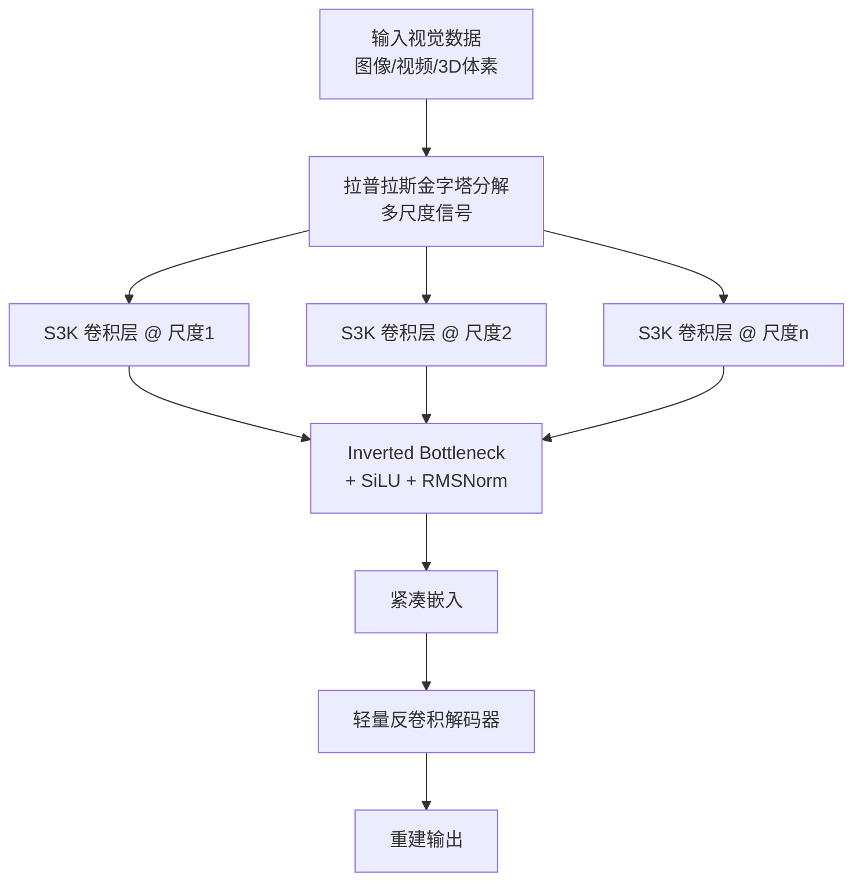

# Exploring State-Space Models for Data-Specific Neural Representations

**会议**: ICLR 2026  
**OpenReview**: [https://openreview.net/forum?id=R5xBLfD9Dv](https://openreview.net/forum?id=R5xBLfD9Dv)  
**代码**: 待确认  
**领域**: 隐式神经表示 / 数据特定神经表示  
**关键词**: 状态空间模型, 隐式神经表示, 神经压缩, S3K, NeRV, 拉普拉斯金字塔  

## 一句话总结
本文首次把状态空间模型（SSM）引入"数据特定神经表示"（把单个图像/视频/3D 实例过拟合进一个紧凑网络），从理论上证明 SSM 的隐状态本质上编码了输入信号本身，并提出结构化状态空间核 S3K，把 SSM 蒸馏成卷积核以支持多维输入与下采样，在图像、视频、3D 重建上全面超越现有方法。

## 研究背景与动机
- **领域现状**：数据特定神经表示（隐式神经表示 INR、神经压缩）的核心目标是用**最少参数**换**最高重建质量**地存下单个视觉数据。一条经典思路是把视觉数据看成连续信号在离散点上的采样，再把信号投影到一组基函数上、只保存系数——这正是傅里叶/小波等传统压缩的根基。
- **现有痛点**：现代 INR 方法**丢掉了"投影到基函数"这个本质**，退化成单纯的坐标→RGB 映射、比特量化或靠堆容量隐式消冗余，缺少能把"基函数投影"思想内化进网络的架构。
- **核心矛盾**：SSM 天生契合这个思路——它的隐状态最初就被设计成"用一组正交多项式基重建观测数据的系数"，但**直接套用 SSM 有两道硬伤**：(1) 只能处理 1D 序列，多维数据需要不自然地展平/扫描；(2) 它**长度保持**（输出与输入等长），天然无法压缩。
- **本文目标**：系统探索 SSM 在数据特定神经表示中的潜力，并设计一个既保留 SSM 信号建模能力、又能多维处理与下采样的模块。
- **核心 idea**：**【信号建模视角】** SSM 隐状态编码的是输入信号本身（而非语义模式），因此天生适合重建；**【核蒸馏视角】** 把 SSM 的状态递推折叠进一个卷积核，只取最后一个隐状态即可同时完成"压缩 + 下采样"。

## 方法详解

### 整体框架
全文沿"先探索、后落地"两段展开：第一段（探索）用一个 SSM 编码器 + 轻量解码器的极简结构，验证各类 SSM 在图像重建上**普遍优于 Transformer**，并通过架构变体对比得出"多尺度 + 拉普拉斯金字塔"最适合 SSM；第二段（方法）提出 S3K 把 SSM 蒸馏为卷积核，扩展到多维、增强表达力，最终拼成 LPNet-S3K。

### 关键设计

**1. SSM 编码的是"输入信号本身"——重建友好的理论基石**：作者从经典正弦估计问题切入，证明（定理 4.1）当状态转移矩阵 $\mathbf{A}$ 可对角化且特征值 $\{\lambda_i\}$ 非零互异时，存在映射 $f:(\mathbf{A},\mathbf{B})\mapsto\mathbf{F}$ 使输入函数可被分解成复指数的线性组合 $\phi(t)=\sum_{n=1}^{N} c_n \overline{e^{\lambda_n(L-t)}}$，其中系数 $c_n$ 由隐状态 $h$ 算出。这说明 SSM 的参数 $\mathbf{A},\mathbf{B}$ 与隐状态共同捕获了输入的信号特征——它编码的是 $\phi(t)$ 本身，而非 Transformer 那种 token 间语义关系。这解释了一个反直觉的实验现象：在短序列输入重建上 SSM 反而**全面压过 Transformer**，因为重建任务里"信号建模"比"语义关系"更值钱。

**2. 架构探索：堆叠有害，拉普拉斯金字塔最优**：作者用固定解码器、只换编码器的方式对比三种变体。**堆叠式**（SSM 与卷积交替成深网络）反而掉点，原因是 SSM 把输入投影到隐式基函数上，多层堆叠等于反复投影，会像信息论里的"代际损失"一样放大伪影、压死可重建率。**图像金字塔**（在多分辨率上各放一个 SSM）有效，因为不必堆叠就能跨尺度增容。**拉普拉斯金字塔**（传统压缩常用的分解）最好——它跨尺度冗余更少，各级独立 SSM 能被更充分利用。这三条经验直接决定了最终架构选型。

**3. 结构化状态空间核 S3K：把 SSM 折叠成"压缩 + 下采样"卷积核**：SSM 离散化后隐状态递推 $h_i \approx \bar{\mathbf{A}}h_{i-1}+\bar{\mathbf{B}}\phi_i$ 可展开成卷积形式，末隐状态 $h_{L-1}=[\bar{\mathbf{A}}^{L-1}\bar{\mathbf{B}}\ \cdots\ \bar{\mathbf{A}}\bar{\mathbf{B}}\ \bar{\mathbf{B}}][\phi_0\ \cdots\ \phi_{L-1}]^\top$ 就是整段序列在基函数上的投影。既然已有工作证明仅凭末隐状态即可重建输入，作者干脆把核显式构造为 $\mathbf{K}=[\bar{\mathbf{A}}^{L-1}\bar{\mathbf{B}}\ \cdots\ \bar{\mathbf{B}}]\in\mathbb{C}^{N\times L\times C}$，一次卷积就**跳过所有中间隐状态、直接拿到压缩表示**。定理 5.1 进一步保证：给定末隐状态存在重建函数 $R(\mathbf{A},\mathbf{B},h)$ 能恢复原序列，使 S3K 成为有理论保证的有损压缩机制。实现上采用 $\mathbf{A}$ 对角化简化幂次计算，并用 MIMO 框架（$\bar{\mathbf{B}}\in\mathbb{C}^{N\times C}$）同时处理多通道。

**4. 多维扩展与表达力增强**：依据"nD 基函数 = 1D 基函数的外积"这一连续空间性质，多个独立 1D S3K 做外积即得 nD 核（维度 $L^{(1)}\times\cdots\times L^{(n)}\times N\times C$），从而像普通卷积一样直接处理图像/视频/3D 体素。由于结构核可学习参数太少导致表达力受限，作者再叠三招：**输入自适应的 $\mathbf{B}$**（核参数随输入动态调整，借鉴 Mamba）、**实值 SSM 参数**（提升数值稳定与表达力）、**后接 $1\times1$ 卷积**（解耦状态维 $N$ 与输出通道、增容）。最终把 S3K 嵌进拉普拉斯金字塔各级，配 inverted bottleneck、SiLU、RMSNorm，组成 LPNet-S3K。

## 实验关键数据

### 主实验表格
图像（Kodak/CLIC2020，PSNR/MS-SSIM）与 3D（Objaverse 体素）：

| 方法 | Kodak | CLIC2020 | Objaverse |
|------|-------|----------|-----------|
| ConvNeXt | 25.99/0.8830 | 24.39/0.8280 | 17.17/0.7536 |
| LPNet-Conv | 27.44/0.9132 | 25.41/0.8505 | 17.67/0.7815 |
| LPNet-Mamba | 27.51/0.9227 | 26.16/0.8694 | 17.74/0.7732 |
| **LPNet-S3K (Ours)** | **28.09/0.9331** | **26.33/0.8692** | **18.34/0.8492** |

视频 NeRV（UVG，PSNR）：Ours-S 仅 3.0M 参数达 33.66，超过更大的 DNeRV(3.4M)/PNeRV(3.3M)；Ours-P 3.3M 达 34.36，七个序列平均最高。Bunny 上各模型尺寸（0.35M~3.0M）均排第一，0.35M 时达 32.93 PSNR，大幅领先 SNeRV 的 30.88。

### 消融实验表格
SSM 类型 × 编码器变体（CIFAR-100 图像重建 PSNR），节选：

| SSM Block | Baseline | (a)堆叠 | (b)图像金字塔 | (c)拉普拉斯金字塔 |
|-----------|----------|---------|---------------|-------------------|
| Transformer | 24.75 | 24.87 | 23.96 | 24.67 |
| S4ND | 26.00 | 25.25 | 25.75 | **26.61** |
| Mamba | 24.90 | 24.82 | 24.78 | 26.58 |
| S4D | 25.49 | 24.99 | 25.48 | 26.06 |

- Baseline 下**所有 SSM 均胜过 Transformer**；堆叠普遍掉点；拉普拉斯金字塔普遍最高。

### 关键发现
- LPNet-S3K 在图像/3D/视频三种模态全面领先，且**性能增益完全来自 SSM 编码器**——视频实验直接复用 HNeRV/SNeRV/PNeRV 的解码器，故解码速度（FPS）与原方法完全相同，对实时流媒体友好。
- **架构与模块解耦的两段增益**：LPNet-Conv 相对 ConvNeXt 的提升证明 LPNet 架构本身有效；LPNet-S3K 相对 LPNet-Conv 的提升证明 S3K 卷积单独有效；而 LPNet-S3K 又优于 LPNet-Mamba，说明 S3K 作为"压缩专用 SSM"比通用 Mamba 更契合该任务。
- **率失真全程领先**：在 Bunny/UVG 上改变 bpp（每像素比特数），LPNet-S3K 在各压缩比下均优于基线，说明其压缩能力在宽压缩区间内稳健。
- 本方法与比特量化、大规模先验学习等技术**正交**，可叠加，具互补潜力。
- 定性结果上模型在更小尺寸下仍能保留高频纹理、招牌文字、3D 几何结构等细节。

## 亮点与洞察
- **把"为什么 SSM 适合重建"讲透了**：定理 4.1 给出 SSM 隐状态 = 输入信号的复指数分解，从信号处理角度解释了 SSM 压过 Transformer 的反直觉现象，思想上把现代 INR 重新接回傅里叶/小波的基函数压缩传统。
- **S3K 一石二鸟**：用末隐状态构核同时实现压缩与下采样，既省掉中间隐状态计算，又给出可重建的理论保证。
- **即插即用**：仅换编码器、不动解码器就能在标准 NeRV 基准上涨点且不增推理成本。

## 局限与展望
- **编码开销大**：构造输入尺寸的核约需 20× 内存、4× FLOPs（相比普通卷积），可扩展性受限——可用免显式建核的等价公式或硬件优化实现缓解。
- **解码器未专门设计**：目前用简单上采样或现成解码器，针对 SSM 编码特征定制解码器有望进一步涨点。
- **可推广到自编码器**：S3K 的压缩特性有望用于生成模型的压缩自编码器，用更少 token 编码输入。

## 相关工作与启发
- **SSM 谱系**：HiPPO→LSSL→S4/S4D/S4ND→S5→Mamba，本文区别于它们专注分类/序列翻译，转而把 SSM 当"压缩式紧凑表示"用。
- **INR 与神经压缩**：继承 INR"连续信号参数化"与神经压缩"编码器-解码器"传统，把 SSM 作为新的架构组件嵌入。
- **启发**：当一个新架构（SSM）的内部机制恰好对应某个经典数学工具（基函数投影）时，回到第一性原理推导其闭式（如 S3K 的核构造）往往比黑盒堆叠更有效。

## 评分
- **新颖性**: ⭐⭐⭐⭐⭐ 首次系统打通 SSM 与数据特定神经表示，理论（定理 4.1/5.1）与架构（S3K）双原创。
- **实验充分度**: ⭐⭐⭐⭐ 覆盖图像/视频/3D 三模态、多 SSM 变体与多架构消融，NeRV 多基准全面对比；但编码开销分析与大模型尺度验证略简。
- **写作质量**: ⭐⭐⭐⭐ "先探索后落地"的叙事清晰，理论与实验衔接自然，定理陈述完整。
- **价值**: ⭐⭐⭐⭐ 给 INR/神经压缩提供了一条有理论根基的新架构方向，且与现有量化/先验技术正交可叠加。

<!-- RELATED:START -->

## 相关论文

- [\[ICLR 2026\] Out of the Shadows: Exploring a Latent Space for Neural Network Verification](out_of_the_shadows_exploring_a_latent_space_for_neural_network_verification.md)
- [\[NeurIPS 2025\] Deep Continuous-Time State-Space Models for Marked Event Sequences](../../NeurIPS2025/others/deep_continuous-time_state-space_models_for_marked_event_sequences.md)
- [\[ICML 2025\] UnHiPPO: Uncertainty-Aware Initialization for State Space Models](../../ICML2025/others/unhippo_uncertainty-aware_initialization_for_state_space_models.md)
- [\[ICLR 2026\] Beyond Uniformity: Regularizing Implicit Neural Representations through a Lipschitz Lens](beyond_uniformity_regularizing_implicit_neural_representations_through_a_lipschi.md)
- [\[ICLR 2026\] From atom to space：面向材料空间性质的区域化读出函数 SpatialRead](from_atom_to_space_a_region-based_readout_function_for_spatial_properties_of_mat.md)

<!-- RELATED:END -->
