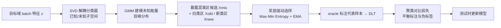

# Exposing Mixture and Annotating Confusion for Active Universal Test-Time Adaptation

**会议**: ICLR 2026  
**OpenReview**: [https://openreview.net/forum?id=89gxHJkCXk](https://openreview.net/forum?id=89gxHJkCXk)  
**代码**: 待确认  
**领域**: 测试时自适应 / 主动学习 / 迁移学习  
**关键词**: Universal Test-Time Adaptation, Active Learning, 双重偏移, 高斯混合模型, 开集识别  

## 一句话总结
本文提出主动通用测试时自适应（AUTTA）新范式，并用 EMAC 方法在测试阶段引入少量人工标注：先用 SVD 解耦 + GMM 暴露同时存在域偏移和类偏移的"混淆区"样本，再用奖励驱动策略挑选最值得标注的代表样本，最后用聚类对比损失平衡标注与伪标签，在双重偏移下取得 SOTA。

## 研究背景与动机
**领域现状**：通用测试时自适应（UTTA）要在没有源数据、数据流式到来的开放世界中同时应对**域偏移**（domain shift，风格/损坏变化）和**类偏移**（class shift，出现训练时未见的新类），目标是既准确分类旧类、又能拒识新类。现有 UTTA 方法（如 OPTTT、TTAC）主要依赖伪标签和启发式规则。

**现有痛点**：当域偏移和类偏移**同时发生**时，伪标签的错误率急剧上升，自训练随之崩溃。一个自然的想法是引入主动学习，让人工标注少量样本来纠偏——但本文通过分析发现（Fig.1），传统主动学习按熵/不确定性选样，在双重偏移下倾向于挑那些**类偏移很强**的样本，这些样本反而标注收益低、还会给训练引入偏差。

**核心矛盾**：真正高价值的样本位于域偏移与类偏移**交叠的"混淆区"**（mixed region），这里伪标签错误率最高（实验显示混淆区错误率 ~70-80%，而纯域偏移/纯类偏移区只有 ~12-15%），但现有主动学习方法恰恰覆盖不到这块区域，导致标注预算被浪费。

**本文目标**：在 UTTA 框架内引入少量人工标注，设计一套能精准定位并标注混淆区样本的机制，让有限标注发挥最大效用。

**核心 idea**：**【暴露混淆 + 标注代表】** 先把"哪些样本处于双重偏移混淆区"显式暴露出来形成候选池，再从候选池里用奖励信号挑最有信息量的去标注，最后用对比聚类把稀缺标注和伪标签拧成一股绳。

## 方法详解

### 整体框架
EMAC（Exposing Mixture and Annotating Confusion）是一条 coarse-to-fine 的两阶段标注 + 一步优化的流水线：**第一步（粗筛）**用 SVD 把分类器参数解耦成"已知/未知"子空间，再用 GMM 在未知能量上建模，暴露出落在新旧类之间的混淆区候选样本；**第二步（精选）**用奖励驱动的最大最小熵策略，从候选里挑出对区分新旧类贡献最大的代表样本交给 oracle 标注；**第三步（优化）**用聚类对比损失把标注信息和高置信伪标签联合起来，缓解标注稀缺导致的决策边界模糊。

### 关键设计

**1. 暴露混淆区候选：SVD 解耦 + GMM 双峰建模**
由于源数据不可用，本文借助分类器权重 $W_{cls} \in \mathbb{R}^{C \times D}$ 中蕴含的源域知识来定位未知信息。具体用奇异值分解把权重空间正交分解为 $W_{cls} = F_{known}\Sigma F_{unknown}^\top$，从而把"源域已知"基向量 $F_{known}$ 和"源域未知"基向量 $F_{unknown}$ 分离开。目标特征 $z$ 分别投影到两个子空间得到 $z_{known}$ 和 $z_{unknown}$，且满足 $\|z_{known}\|_2^2 + \|z_{unknown}\|_2^2 = 1$。关键观察是：未知能量 $\|z_{unknown}\|_2^2$ 的经验分布呈**双峰**——低均值峰对应旧类、高均值峰对应新类，于是用双峰高斯混合模型 $p(z_{unknown}) = \pi\mathcal{N}(\mu_{old}, \sigma_{old}^2) + (1-\pi)\mathcal{N}(\mu_{new}, \sigma_{new}^2)$ 来拟合。以两个均值 $\mu_{old} < \mu_{new}$ 为界把样本切成三块：低于 $\mu_{old}$ 的旧类区 $X_{old}$、高于 $\mu_{new}$ 的新类区 $X_{new}$、夹在中间的混淆区 $X_{mix}$。混淆区正是双重偏移叠加、伪标签最不可靠的地方，所以只把 $X_{mix}$ 作为标注候选，从源头避免把标注浪费在边缘区域——消融中 GMM 切出的 $X_{mix}$ 错误率高达 ~78-83%，而 $X_{old}/X_{new}$ 错误率仅 ~10-14%，验证了这种切分远比固定阈值的熵切分干净。

**2. 奖励驱动选样：用边际信息增益挑代表**
候选池内部仍有分布偏差，随机选会造成标注严重失衡，因此本文设计了一个最大最小熵（Max-Min Entropy）目标 $L_{MME} = \Gamma_{old} + \Gamma_{new}$ 来量化每个样本的边际信息增益。其中 $\Gamma_{old} = \sum_i H(f(X_{old}, \theta_t)) - H(f(X_{old}, \theta_{t-1}))$ 度量标注后模型对旧类置信度的提升（即**降低**旧类熵、保住已知决策边界），$\Gamma_{new} = \sum_i H(f(X_{new}, \theta_{t-1})) - H(f(X_{new}, \theta_t))$ 度量对新类的拒识能力提升（即**拉开**新旧类间隔）。进一步对新旧类标注样本定义带权平均奖励 $R'_{old}$、$R'_{new}$（用 $\omega_{old}$、$\omega_{new}$ 平衡两类贡献、防止经验风险方差偏向一侧），并用 EMA 平滑 $R_{old} = \alpha R'_{old,t} + (1-\alpha)R'_{old,t-1}$ 稳定选样、抑制短期波动。最终选样规则按奖励大小动态切换：当 $R_{old} > R_{new}$ 时从混淆区挑**熵最高**的旧类样本标注，否则挑**熵最低**的新类样本，从而在有限预算下优先标注最能减小自适应误差的样本。这套机制在理论上对应主动学习里的信息增益最大化 / 经验泛化误差上界最小化。

**3. 平衡真标签与伪标签：聚类对比优化**
标注样本极少，单靠它们做无监督自适应不现实，必须和伪标签一起用，但不当优化会引发类边界模糊甚至模型坍缩。本文用高置信伪标签特征 $F_p$ 和标注特征 $F_a$ 共同算类原型 $p_c = \frac{1}{|F_p||F_a|}(\sum_{u_i \in F_p} u_i + \sum_{v_i \in F_a} v_i)$，再设计聚类对比损失 $L_c = \sum_{i \in I_{old}} \frac{-1}{|Q(i)|}\sum_{p \in Q(i)} \log\frac{\exp(s_{ip})}{S(i)}$，其中负样本集 $N(i) = I_{new} \cup I_{old}$、$s_{ij}$ 为余弦相似度。这个损失一方面拉近同类样本、让它们向原型聚拢（最小化类内距离），另一方面把新类样本推离原型、保持发散（最大化类间距离），从而让稀缺的标注信息有效引导高置信伪标签。总目标为 $L = L_{MME} + L_c$。t-SNE 可视化显示，相比交叉熵/MSE/原型损失，聚类对比损失能让新旧类分离最清晰，还能增强旧类内部的类间区分度。

## 实验关键数据

### 主实验（DomainNet，AH 越高越好）

| 类别 | 方法 | Avg. AH | GPU(s) |
|------|------|---------|--------|
| TTA | TEST | 43.7 | 392 |
| TTA | TENT | 46.1 | 479 |
| TTA | SHOT | 46.0 | 564 |
| UTTA | TTAC | 46.7 | 651 |
| UTTA | OPTTT | 49.8 | 697 |
| ATTA | SimATTA | 47.1 | 747 |
| ATTA | EATTA | 47.7 | 738 |
| ATTA | BiTTA | 47.2 | 687 |
| **AUTTA** | **EMAC** | **52.2** | 735 |
| **AUTTA** | **EMAC\*** | **53.1** | 779 |

EMAC 比最强基线 OPTTT 高 2.4 个点，伪更新增强版 EMAC\* 再提升到 53.1。VisDA-C 上 EMAC 在 NOISE/MNIST/SVHN 三种偏移的 AH 分别为 79.8/77.4/72.3，均显著领先（OPTTT 为 77.8/75.2/69.2）。

### 主动学习方法对比（同 TENT 框架，B=标注预算）

| 方法 | DomainNet Avg. | VisDA-C |
|------|----------------|---------|
| Random (B=1000) | 46.8 | 66.7 |
| Entropy (B=1000) | 46.3 | 65.4 |
| Coreset (B=1000) | 49.4 | 68.7 |
| BADGE (B=1000) | 49.5 | 68.2 |
| SimATTA (B=1000) | 47.1 | 67.9 |
| **EMAC (B=800)** | **50.8** | **73.1** |
| **EMAC (B=1000)** | **52.2** | **76.5** |
| **EMAC (B=1500)** | **53.1** | **78.2** |

EMAC 仅用 800 标注预算就超过其他方法 1000 预算的表现，标注效率优势明显。

### 消融实验（EMSC=暴露混淆区 / SC=选样 / BTPO=平衡优化）

| EMSC | SC | BTPO | DomainNet AH | VisDA-C AH |
|------|-----|------|--------------|------------|
| ✓ | - | - | 43.7 | 65.0 |
| - | ✓ | - | 47.1 | 69.4 |
| - | - | ✓ | 47.9 | 71.2 |
| ✓ | ✓ | - | 49.1 | 71.7 |
| - | ✓ | ✓ | 50.8 | 73.1 |
| ✓ | ✓ | ✓ | **52.2** | **76.5** |

### 关键发现
- **混淆区切分有效**：GMM 切出的 $X_{mix}$ 伪标签错误率 ~78-83%，远高于 $X_{old}/X_{new}$ 的 ~10-14%，而固定阈值熵切分各区错误率都不可忽略，证明在混淆区标注收益最大。
- **三模块互补**：单用任一模块效果有限，三者叠加才达到最优，BTPO（平衡优化）单独贡献最大。
- **小 batch 鲁棒性**：batch≤8 时朴素 GMM 拟合不稳，加滑动窗口缓冲 + EMA 平滑后，batch=1 的 AH 从 16.3 提升到 47.3。

## 亮点与洞察
- **从"选不确定样本"到"选混淆样本"的视角转变**：本文最核心的洞见是揭示了双重偏移下"不确定性≠标注价值"——真正值钱的是新旧类交叠的混淆区，而传统熵/不确定性选样恰好避开了它，这个分析（Fig.1）很有说服力地立住了整篇文章的动机。
- **用分类器权重 SVD 来无源定位未知信息**：在源数据不可得的约束下，从分类器参数空间正交分解出"已知/未知"基，配合 $\|z_{unknown}\|^2$ 的双峰现象用 GMM 切分，是一个轻量又巧妙的工程化设计。
- **奖励驱动选样有理论锚点**：把 Max-Min Entropy 奖励和主动学习的信息增益/泛化误差上界挂钩，比纯启发式的置信度打分更有依据。

## 局限与展望
- **GMM 双峰假设的脆弱性**：方法依赖 $\|z_{unknown}\|^2$ 呈干净双峰，当新类比例极端、或新旧类未知能量重叠严重时，双峰可能退化为单峰，GMM 切分会失准（论文也承认小 batch 下需额外的窗口+EMA 补救）。
- **依赖人工标注预算**：AUTTA 本质引入了 human-in-the-loop，在无法实时获取 oracle 反馈的真实流式场景中适用性受限，标注延迟/成本未充分讨论。
- **只在两个 DA benchmark 上验证**：DomainNet 和 VisDA-C 都是经典图像分类 DA 数据集，方法在更复杂的检测/分割任务或更大规模类偏移下的可扩展性待考。
- **奖励权重超参较多**：$\omega_{old}$、$\omega_{new}$、$\alpha$、GMM 的 $\pi$ 等都需要设定，在无标注的测试时如何稳健调参是个隐忧。

## 相关工作与启发
- **UTTA / 开集 TTA**：OPTTT 首次显式建模类偏移、TTAC 做全局+类别级分布对齐，本文在它们基础上引入主动标注突破伪标签上限。
- **主动测试时自适应（ATTA）**：SimATTA、EATTA、BiTTA 都尝试在测试时引入少量标注或二值反馈，但都依赖置信度打分，在双重偏移下选样不可靠——这正是本文要解决的痛点。
- **主动学习**：Coreset、BADGE、CLUE 等经典主动学习在 ADA/AOL 场景下只考虑域偏移、不管类偏移，本文揭示了它们在双重偏移下的失效模式。
- **启发**：本文"先暴露高价值区域、再在区域内精选"的 coarse-to-fine 标注范式，对其他标注预算受限的开放世界学习任务（如持续学习、开集检测的主动标注）有借鉴意义；用模型参数空间分解来定位"未知"也是一条值得迁移的思路。

## 评分
- **新颖性**: ⭐⭐⭐⭐ 提出 AUTTA 新范式，"混淆区才是高价值标注区"的洞见+SVD/GMM 无源定位的组合很有新意，但各组件（GMM 选样、对比损失、奖励选样）本身偏组合式创新。
- **实验充分度**: ⭐⭐⭐⭐ 覆盖两个 DA 数据集、多种偏移类型，主实验/AL 对比/消融/小 batch/可视化都齐全，自建了 AUTTA benchmark；不足是任务类型局限于图像分类。
- **写作质量**: ⭐⭐⭐⭐ 动机分析（Fig.1）讲得清楚有力，方法流程层层递进；公式较密、部分符号（如 EMSC vs EMAC）略有笔误。
- **价值**: ⭐⭐⭐⭐ 在自动驾驶等需要人工干预的开放世界场景有实际意义，标注效率提升（B=800 超他人 B=1000）有应用价值。

<!-- RELATED:START -->

## 相关论文

- [\[ICLR 2026\] Prior-Free Tabular Test-Time Adaptation](prior-free_tabular_test-time_adaptation.md)
- [\[ICLR 2026\] PriorGuide: Test-Time Prior Adaptation for Simulation-Based Inference](priorguide_test-time_prior_adaptation_for_simulation-based_inference.md)
- [\[CVPR 2026\] Neural Collapse in Test-Time Adaptation](../../CVPR2026/others/neural_collapse_in_test-time_adaptation.md)
- [\[CVPR 2025\] Effortless Active Labeling for Long-Term Test-Time Adaptation](../../CVPR2025/others/effortless_active_labeling_for_long-term_test-time_adaptation.md)
- [\[ICML 2026\] TEMPORA: Characterising the Time-Contingent Utility of Online Test-Time Adaptation](../../ICML2026/others/tempora_characterising_the_time-contingent_utility_of_online_test-time_adaptatio.md)

<!-- RELATED:END -->
