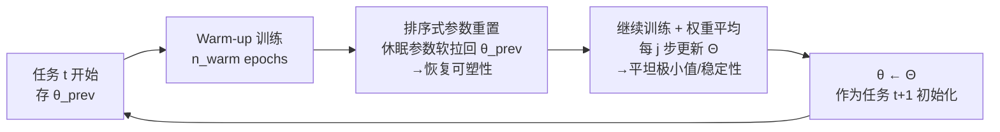

# Forget Forgetting: Continual Learning in a World of Abundant Memory

**会议**: ICLR 2026  
**OpenReview**: [https://openreview.net/forum?id=fvL8IIEPxG](https://openreview.net/forum?id=fvL8IIEPxG)  
**代码**: 待确认  
**领域**: 持续学习 / 终身学习  
**关键词**: 持续学习, 充足回放内存, 稳定性-可塑性, 权重空间, 参数重置, 权重平均, 计算高效

## 一句话总结
当存储便宜、GPU 才是瓶颈时，持续学习的真正难点从"防遗忘"翻转成"保可塑性"；本文用一个轻量的权重空间方法（排序式参数重置 + 训练中权重平均）以接近朴素 Replay 的成本同时拿回稳定性与可塑性。

## 研究背景与动机
**领域现状**：持续学习（CL）几十年来都把"压缩 exemplar 内存"当作第一约束——典型 class-IL benchmark 只允许每类存 20 个样本（约占全量数据 4%），LLM 持续学习也普遍用受限缓存或免存储机制来回避长期存储问题。整套评测与方法体系都建立在"内存极度稀缺"这个前提上。

**现有痛点**：这个前提在真实部署里站不住脚。云对象存储、本地 SSD 又便宜又能扩展——存 1TB 数据每月不到 \$25；而 GPU 训练才是真贵——8 张 A100 的 AWS 实例每小时超过 \$30。如果 CL 的目的本就是"避免从头联合训练（joint training）的昂贵代价"，那优化目标应该是降 GPU 成本，而不是省存储。可现有方法在内存放松后既没人系统研究，也没有对应的高效方案。

**核心矛盾**：当内存从"稀缺"走向"充足但非全量"这个**中间地带**时，作者发现矛盾发生了**翻转**——内存够多后遗忘（稳定性问题）基本被回放压住了，但模型变得严重偏向旧任务、学不动新任务，**可塑性反而成了新瓶颈**。更尴尬的是，此时最朴素的 Replay 反而以零头的 GPU 成本超过了一众 SOTA（DER/FOSTER/MEMO 这些扩张式方法又贵又只换来边际提升）。

**本文目标**：刻画"充足 exemplar 内存"这一现实 regime 下的稳定性-可塑性权衡，并给出一个**成本不超过 Replay**、却能把丢失的可塑性补回来的方法。

**核心 idea**：**「在权重空间里同时做两件互补的事」**——用排序式参数重置把"休眠"参数轻轻拨回预训练值以恢复可塑性，用训练中的权重平均把模型推向平坦极小值以巩固稳定性，全程不存多份模型、不加额外反传，几乎零开销。

## 方法详解

### 整体框架
方法叫 **Weight Space Consolidation（权重空间巩固）**，直接在单个模型的权重上操作，嵌进每个任务的训练流程。每进入新任务 $t$：先存下旧解 $\theta_{\text{prev}}$ 作为参照；正常用任务损失训 $n_{\text{warm}}$ 个 warm-up epoch；然后做**一次性的排序式重置**把不重要参数往 $\theta_{\text{prev}}$ 拉回（恢复可塑性）；剩余训练过程中持续维护一个**权重滑动平均** $\Theta$（增强稳定性）；任务结束时用 $\Theta$ 替换当前权重，作为下一任务的稳定初始化。两步都源自第 3 节的分析，且不需要存任务级模型副本。

### 关键设计

**1. 把问题重新定义在"充足内存"坐标系上：稳定性升、可塑性降的理论刻画** —— 作者把内存预算写成 $K \approx \kappa \sum_{j=1}^{t-1}|D_j|$，$\kappa\in(0,1]$ 决定能存多大比例的旧数据。当 $\kappa$ 足够大时，buffer 经验分布逼近真实旧任务分布，经验风险 $\tilde{R}_{1:t}$ 逼近理想联合风险，于是学到的解 $\tilde\theta^*_{1:t}$ 靠近联合最优 $\theta^*_{1:t}$——遗忘被自然压制（稳定性变好）。但训练分布是混合分布 $P^{(t)}_{\text{train}}\approx\lambda P_t+(1-\lambda)P^{(t)}_{\text{past}}$，内存越大 $\lambda$ 越小、旧分布越主导，使得 $P^{(t)}_{\text{train}}\approx P^{(t-1)}_{\text{train}}$。这导致新旧梯度高度对齐（余弦相似 $\rho_t\to 1$），平均梯度范数被压缩，参数更新量 $\|\theta^{(t)}-\theta^{(t-1)}\|=\eta\|\bar g_t\|\le\eta\|\bar g^{(\text{new})}_t\|$ 进一步随 $\lambda\to0$ 收缩——模型倾向"复用"旧参数而非学新表示，**可塑性退化**。这一刻画把"为什么 Replay 在大内存下反而强、SOTA 反而虚胖"讲清楚了，也直接指明解药应作用在"恢复可塑性"上。

**2. 排序式参数重置：用 Adam 矩信号挑出"休眠"参数，软拉回旧解** —— 关键在于"充足内存给了一个稳定起点，但赖在起点附近就学不动"。warm-up 后，为每个参数元素 $l$ 算一个矩based 重要度分数 $S_l = |\hat m_l|\cdot \hat v_l$，复用 Adam 已有的一阶/二阶动量 $(\hat m_l,\hat v_l)$，几乎零额外成本。直觉是：$\hat m_l$ 大说明梯度方向一致、$\hat v_l$ 大说明梯度能量高，两者相乘能同时捕捉"聚焦"和"持续"的学习信号；$S_l$ 低的参数即视为休眠。保留 top-$Q\%$（默认 $Q=20$），其余做**软重置**——按 $\theta[l]=\alpha\cdot\theta[l]+(1-\alpha)\cdot\theta_{\text{prev}}[l]$（$\alpha=0.5$）与旧解混合，而不是硬随机初始化。这等于把模型轻轻推出旧解的盆地以恢复可塑性，同时保住对旧任务关键的参数维持稳定性。消融显示该软重置稳定优于 random/hard revert/Shrink&Perturb/Continual Backprop。

**3. 训练中权重平均：把震荡轨迹收敛到平坦极小值以巩固稳定性** —— 重置后接着训剩余 epoch，并按 SWA 思路维护滑动平均 $\Theta\leftarrow(n_{\text{avg}}\cdot\Theta+\theta)/(n_{\text{avg}}+1)$，每 $j$ 步更新一次。充足内存带来高数据多样性、进而高梯度方差，warm-up 后模型常在多个低损失区域之间来回振荡；对这些区域做平均能落到更平坦、更鲁棒的极小值，把新旧任务知识一起巩固。关键是它**在单模型训练轨迹上就地完成**，是优化过程的副产物，不需要像传统 CL 模型合并那样存多份任务模型再 post-hoc 合并，因此对长任务序列也可扩展。任务结束用 $\Theta$ 替换 $\theta$，作为下个任务的稳定初始化。

**4. 两步互补，重置是为平均铺路** —— 消融（Table 3）揭示一个机制性结论：单独重置（w/o avg.）几乎不比 Replay 好，单独平均（w/o reset）能提稳定性但学不动新任务；只有两者合用才有显著增益。作者的解读是"权重重置主要是为了让权重平均真正有效"——先靠重置把模型推出旧盆地、制造有意义的轨迹多样性，再靠平均把这条轨迹收敛到好极小值，二者缺一不可。

## 实验关键数据

### 主实验表格（class-IL 平均准确率 %，5 seeds，加粗为最佳非扩张方法）

| Method | CIFAR100 20(4%) | 80(16%) | 200(40%) | 400(80%) | ImageNet100 200(16%) | 400(30%) | 600(46%) |
|---|---|---|---|---|---|---|---|
| Replay | 48.63 | 63.78 | 71.60 | 75.71 | 73.79 | 78.59 | 81.08 |
| iCaRL | 49.95 | 64.81 | 72.69 | 75.49 | 73.57 | 78.45 | 80.87 |
| BiC | 53.65 | 64.74 | 69.15 | 72.50 | 74.14 | 77.51 | 79.29 |
| WA | 61.32 | 66.19 | 71.42 | 73.83 | 75.85 | 78.79 | 80.21 |
| **Ours** | 52.16 | **66.89** | **74.49** | **77.71** | **76.43** | **80.26** | **82.64** |
| *DER（扩张）* | 63.95 | 70.13 | 74.64 | 75.60 | 78.59 | 79.61 | 80.53 |
| *FOSTER（扩张）* | 66.22 | 67.67 | 73.53 | 77.28 | 76.01 | 80.94 | 82.79 |

要点：在约束内存（4%）下传统方法领先；内存放大后差距迅速收窄，到 ≥20% 时多数方法与 Replay 持平。Ours 在 ≥20% 内存下稳定超过所有非扩张基线，且训练成本与 Replay 同级；而扩张式（DER/FOSTER/MEMO）虽强但训练时间是 Replay 的 4–5×。LLM 持续指令微调（TRACE，8 任务，LLaMA-3.2）上，Ours 在内存 >20% 时全面领先，比需要存全部任务模型（VRAM $\propto|W|\cdot T$）的 Task Arithmetic / MagMax 高 2–9%，而自身 VRAM 仅 $|W|\cdot 2$。

### 消融实验表格

| 配置（CIFAR-100） | mem 20 | 80 | 200 | 400 |
|---|---|---|---|---|
| Replay | 48.92 | 63.30 | 70.84 | 75.38 |
| w/o reset（只平均） | 50.23 | 65.01 | 72.33 | 76.98 |
| w/o avg.（只重置） | 48.73 | 63.43 | 70.81 | 74.99 |
| **Ours（两者）** | **52.00** | **66.51** | **73.57** | **77.42** |

重要度度量（Table 4）：矩based $S_l=|\hat m_l|\hat v_l$ 与昂贵的 Hessian based 分数持平，但成本远低；只用一阶或只用二阶矩则明显变差。重置策略（Table 5）：软重置 > random/revert/Shrink&Perturb/Continual Backprop，且优势随内存增大更明显；频率上"warm-up 后只重置一次"在多数设定最好，仅约束内存时多次重置才有额外收益。

### 关键发现
- **矛盾翻转**：充足内存下挑战从稳定性变为可塑性——这是全文最核心的实证发现（Figure 1/2）。
- **重置为平均铺路**：两组件互补，单用任一都接近 Replay，合用才显著。
- **CL vs 全量重训**（Table 6）：在 ≤40% 内存下 Ours（如 200 内存 74.49）甚至超过从头联合训练（69.96），说明 CL + 适当可塑性恢复在中等内存区间比昂贵重训更划算。

## 亮点与洞察
- **重新定义了问题，而不仅是加了个 trick**：把"内存稀缺"这一沉淀几十年的隐含假设挑明，并指出在 GPU 才是瓶颈的现实里，优化目标应是 GPU 成本而非存储——这把"Replay 居然打赢 SOTA"从尴尬现象变成了可解释的结论。
- **复用 Adam 现成动量做重要度评分**：$|\hat m_l|\hat v_l$ 不需要额外反传或 Hessian，却能匹配 Hessian based 精度，工程上极其廉价。
- **"训练中"权重平均而非"post-hoc 合并"**：天然规避了 CL 模型合并需存多份模型、且可能违反顺序约束的问题，对长序列可扩展。
- **图像 + LLM 双域验证**：从 ResNet class-IL 到 LLaMA-3.2 持续指令微调都成立，3–4× 成本下降，结论不挑模态。

## 局限与展望
- **依赖"充足但非全量"内存这一前提**：在真正受限内存（4%）下，Ours 反而不如 WA/BiC，方法的甜区是中等偏大内存；何时算"充足"仍需按经验探。
- **可塑性退化的解释偏 conjecture**：梯度对齐 $\rho_t\to1$ 导致更新收缩的论证基于若干近似假设（如 $P^{(t)}_{\text{train}}\approx P^{(t-1)}_{\text{train}}$），是 motivating analysis 而非严格定理。
- **超参（$Q$、$\alpha$、重置频率、平均间隔 $j$）较多**：虽然按统一协议在 20% 内存上调一次复用到其他设定，但跨域迁移到更大模型时的鲁棒性还需更多验证。
- **未触及无回放/在线流式**：方法本质仍是 rehearsal based，对完全不能存数据的隐私敏感场景不适用。

## 相关工作与启发
- **持续学习三大类**（正则化 EWC/MAS、回放 iCaRL、扩张 DER/FOSTER/MEMO）：本文站在回放一侧，但反过来质疑"严格内存约束"的必要性，与 Prabhu/Harun/Chavan 等"算成本账"的近期工作同向。
- **可塑性丢失**（Dohare et al. Continual Backprop、Shrink&Perturb、参数重置系）：以往多在极端全内存下只谈可塑性、忽略遗忘；本文主张现实 regime 下稳定性与可塑性都要管。
- **权重空间操作**（Model Soups、TIES、Task Arithmetic、SWA/Izmailov）：本文把这些 post-hoc 合并思路改造成"训练中就地操作"，既要 soup 的平坦极小值，又避开存多份模型的代价。
- **启发**：当某个领域的核心约束（这里是存储）随硬件演进而失效时，值得回头审视"benchmark 设定"本身——很多 SOTA 的优势可能只在过时约束下成立。

## 评分
- **新颖性**: ⭐⭐⭐⭐ — 方法本身（重置+平均）组件并不新，但"内存充足下矛盾从稳定性翻转为可塑性"这一问题重定位很有洞察，把朴素 Replay 的反常表现讲成了系统结论。
- **实验充分度**: ⭐⭐⭐⭐ — 跨内存谱系 + 图像/LLM 双域 + 充分消融（组件/度量/重置策略/频率/vs 全量重训），5 seeds 报告标准误，扎实。
- **写作质量**: ⭐⭐⭐⭐ — motivation 链条清晰、图表把"成本-精度"权衡讲得很直观，理论分析虽偏直觉但服务于论点。
- **价值**: ⭐⭐⭐⭐ — 给出"内存不再是瓶颈时"的成本高效 CL 新基线，对真实部署有直接指导意义，且方法零额外开销、易落地。

<!-- RELATED:START -->

## 相关论文

- [\[ICML 2026\] Continual Learning of Domain-Invariant Representations](../../ICML2026/others/continual_learning_of_domain-invariant_representations.md)
- [\[AAAI 2026\] Forget Less by Learning from Parents Through Hierarchical Relationships](../../AAAI2026/others/forget_less_by_learning_from_parents_through_hierarchical_relationships.md)
- [\[ICLR 2026\] HippoTune: A Hippocampal Associative Loop–Inspired Fine-Tuning Method for Continual Learning](hippotune_a_hippocampal_associative_loopinspired_fine-tuning_method_for_continua.md)
- [\[ICLR 2026\] Hippoformer: Integrating Hippocampus-inspired Spatial Memory with Transformers](hippoformer_integrating_hippocampus-inspired_spatial_memory_with_transformers.md)
- [\[AAAI 2026\] Why Isn't Relational Learning Taking Over the World?](../../AAAI2026/others/why_isnt_relational_learning_taking_over_the_world.md)

<!-- RELATED:END -->
