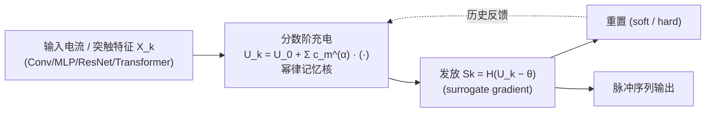

# Fractional-Order Spiking Neural Network

**会议**: ICLR 2026  
**OpenReview**: [https://openreview.net/forum?id=NJhBSLJ0nL](https://openreview.net/forum?id=NJhBSLJ0nL)  
**代码**: [https://github.com/PhysAGI/spikeDE](https://github.com/PhysAGI/spikeDE)  
**领域**: 脉冲神经网络 / 神经形态计算  
**关键词**: 脉冲神经网络, 分数阶微积分, 非马尔可夫动力学, 长程依赖, 鲁棒性  

## 一句话总结
把脉冲神经元膜电位演化背后的一阶 ODE 换成 Caputo 分数阶 ODE，让神经元天然带上幂律衰减的"长记忆"，从而严格泛化经典 IF/LIF（令 α=1 即退化回原模型），在神经形态视觉与图学习上同时拿到更高精度和更强抗噪鲁棒性。

## 研究背景与动机
**领域现状**：脉冲神经网络（SNN）通过离散脉冲通信、事件驱动计算，在神经形态硬件上能耗极低，且天然适合处理时序数据。当前几乎所有 SNN 都建立在 IF/LIF（漏积分发放）神经元之上，这类动力学由**一阶常微分方程**刻画。

**现有痛点**：一阶 ODE 隐含**马尔可夫假设**——膜电位的当前状态只依赖上一时刻的值，过去的历史信息以指数速度 $e^{-t/\tau}$ 被迅速遗忘。然而神经生理学研究表明真实神经元存在长程相关、分形树突结构和多种膜电导的相互作用，这些**非马尔可夫**行为根本无法被整数阶模型表达，等于人为砍掉了网络的一部分表达能力。

**核心矛盾**：分数阶微积分（fractional calculus）正好提供了刻画"带记忆"系统的数学工具，分数阶导数 $d^\alpha/dt^\alpha$ 会以幂律核加权整个历史。早有 f-LIF 单神经元研究证明它能解释生物神经元的频率适应、在噪声下产生更可靠的脉冲，但**把分数阶神经元系统性地融进 SNN 仍是空白**。

**本文目标**：构建一个泛化的分数阶 SNN（f-SNN）框架，把 IF/LIF 及其变体都收编为 α=1 的特例，并给出理论保证与开源工具箱。

**核心 idea**：**【一阶→分数阶】** 用 Caputo 分数阶导数 $D^\alpha$ 替换神经元动力学里的一阶导数 $d/dt$，让膜电位充电过程变成对历史的幂律卷积，从而捕获长程时序依赖；**【严格泛化】** α 是一个额外可调自由度，α=1 精确还原经典 SNN，α<1 引入持久记忆。

## 方法详解

### 整体框架
f-SNN 不改网络结构，只换"神经元内核"：把传统 SNN 中描述膜电位充电的一阶 ODE（IF/LIF）替换成分数阶 ODE（f-IF/f-LIF），再用分数阶 Adams–Bashforth–Moulton（ABM）数值方法离散化，得到一个对所有历史输入做幂律加权卷积的迭代式。由于只动充电（charge）阶段、发放（spike）和重置（reset）规则完全沿用，f-SNN 可即插即用地嵌进 CNN、ResNet、Transformer、MLP 等任意主干，且可训练参数量与原 SNN 完全一致。

### 关键设计

**1. 分数阶神经元动力学：用 Caputo 导数把"瞬时遗忘"改成"幂律记忆"。** 经典 LIF 写作 $\tau\,dU/dt = -U + R I_{in}$，f-SNN 把它替换为 $\tau\,D^\alpha U(t) = -U(t) + R I_{in}(t)$，其中 Caputo 分数阶导数定义为 $D^\alpha y(t) = \frac{1}{\Gamma(1-\alpha)}\int_0^t (t-\tau)^{-\alpha} y'(\tau)\,d\tau$。这个积分核 $(t-\tau)^{-\alpha}$ 意味着当前膜电位的演化取决于**整段历史**，并按幂律加权。直觉上，阶数 α 就是一个"记忆旋钮"：α=1 时退回标准 LIF，α<1 时引入越来越强的时序相关性。常输入下的弛豫解从指数衰减 $e^{-t/\tau}$ 变成 Mittag–Leffler 函数 $E_\alpha(-t^\alpha/\tau)$，后者带有 $\sim t^{-\alpha}$ 的幂律长尾——这正是"长记忆"的数学体现。

**2. 分数阶 ABM 离散化：把连续记忆变成可计算的幂律卷积。** 一阶 ODE 用前向 Euler 一步迭代即可，但分数阶 ODE 是非局部的，必须把所有过去项加权求和。本文采用分数阶 ABM 预测子，得到统一迭代 $y_k = y_0 + \frac{1}{\Gamma(\alpha)}\sum_{j=0}^{k-1}\mu_{j,k}\,f(t_j,y_j)$，其中权重 $\mu_{j,k} = \frac{h^\alpha}{\alpha}[(k-j)^\alpha - (k-1-j)^\alpha]$。设 $h=R=1$ 后整理出一个平稳幂律核 $c_m^{(\alpha)} = \frac{1}{\tau^\alpha\,\alpha\Gamma(\alpha)}[(m+1)^\alpha - m^\alpha]$，于是充电式变成 $U_k = U_0 + \sum_{m=0}^{k-1} c_m^{(\alpha)} X_{k-m}$（f-IF）。当 α→1 时 $c_m^{(1)}=1/\tau$ 退化为常数核，对它取一阶差分恰好还原 Euler 递推，从数值层面证明了框架与传统 SNN 的兼容性。训练上脉冲不可导的问题用 surrogate gradient（前向保留硬脉冲、反向用平滑替代）解决。

**3. 工程加速：短记忆截断 + FFT 卷积控制复杂度。** 直接对全历史求和会带来 $O(N^2)$ 的代价。作者用 short-memory 原则把求和窗口截到固定宽度 M（$\sum_{m=\max(0,k-M)}^{k-1}$），得到 $O(NM)$；若要保留全记忆则借助 FFT 把卷积降到 $O(N\log N)$。这一步让 f-SNN 在长时间步任务上仍然可训可用。

**4. 三条理论保证：从"更像生物"上升到"更强表达 + 更鲁棒"。** 论文不止给出框架，还证明了三个本质区别：**(i) 持久记忆**——命题 1 表明 f-LIF 的弛豫解是 Mittag–Leffler 函数，带幂律长尾，远古输入仍以代数速度（而非指数）影响当下；**(ii) 不可约性**——定理 2 证明阶数 α∈(0,1) 的单个 f-IF 神经元无法被任何**有限个**整数阶 LIF 的线性组合精确复现（误差以 $O(k^{\alpha-1})$ 缓慢衰减），等价需要无穷多个整数阶单元，即 f-SNN 严格超越整数阶模型的表达能力；**(iii) 鲁棒性**——定理 1 证明在常输入加扰动 ε 下，f-IF 的膜电位偏差按**亚线性** $\Delta U \propto t^\alpha$ 增长，而整数阶 IF 是**线性** $\Delta U \propto t$，且脉冲时刻对扰动的敏感度 $|\Delta t_s|\propto \epsilon\, I_c^{-(1+1/\alpha)}$ 比整数阶的 $I_c^{-2}$ 更小，理论上抑制了扰动的长期累积。

## 实验关键数据

### 主实验：神经形态数据分类（准确率 %，T=8~16）

| 数据集 | 架构 | LIF (SpikingJelly) | LIF (snnTorch) | **f-LIF (f-SNN)** |
|---|---|---|---|---|
| N-MNIST | CNN | 99.27 | 99.08 | **99.48** |
| DVS-Lip | CNN | 42.41 | 32.71 | **43.42** |
| DVS128Gesture | CNN | 93.40 | 88.99 | **94.80** |
| DVS128Gesture | Transformer | 95.14 | 87.15 | **95.83** |
| N-Caltech101 | CNN | 66.82 | 65.21 | **70.26** |
| N-Caltech101 | Transformer | 72.63 | 65.67 | **76.27** |
| HarDVS | CNN | 46.10 | 46.26 | **47.66** |

无论 CNN 还是 Transformer 主干，仅把 IF/LIF 换成 f-IF/f-LIF 就一致提升，N-Caltech101（Transformer）增益最大达 **+3.6%**。

### 图学习：节点分类（准确率 %，T=100，20 次平均）

| 方法 | Cora | Citeseer | Pubmed | Photo | Computers | ogbn-arxiv |
|---|---|---|---|---|---|---|
| SGCN (SJ) | 81.81 | 71.83 | 86.79 | 87.72 | 70.86 | 50.26 |
| **SGCN (f-SNN)** | **88.08** | **73.80** | **87.17** | **92.49** | **89.12** | **51.10** |
| DRSGNN (SJ) | 83.30 | 72.72 | 87.13 | 88.31 | 76.55 | 50.13 |
| **DRSGNN (f-SNN)** | **88.51** | **75.11** | **87.29** | 91.93 | 88.77 | **53.13** |

在 Computers 上 SGCN 提升高达 **+18.3%**，且分数阶适配不增加任何可训练参数。

### 鲁棒性与能耗
- **五维抗扰**：在噪声注入、遮挡块、时间截断、时间抖动、丢帧五类破坏下，f-SNN 在所有维度均显著优于两个整数阶基线，高强度噪声和大遮挡比例下优势尤为明显（Fig. 4）；遮挡场景的浅层特征图可视化显示 f-LIF 能更好保住物体特征。
- **能耗**：图学习任务上 f-SNN 在更高精度的同时**能耗显著更低**（Fig. 6a），验证了"comparable/superior energy efficiency"。

### 关键发现
- 增益来自记忆机制本身而非参数量：fair comparison 下只替换充电模块，参数完全对齐。
- α 作为额外自由度通过调参获得最优值，给模型提供了捕获更丰富时序模式的"旋钮"。

## 亮点与洞察
- **理论与方法高度自洽**：从"生物神经元是非马尔可夫的"这一观察出发，用分数阶微积分给出严格的数学落点，并配三条定理（长记忆、不可约、鲁棒）把"为什么更好"讲透，而不是只堆 benchmark。
- **严格泛化的优雅**：α=1 精确还原经典 SNN，离散化在 α→1 时退回 Euler，框架在数学上"包住"了整个整数阶 SNN 家族，落地阻力极小。
- **即插即用 + 开源工具箱**：只换神经元内核、不动主干、不加参数，配合 spikeDE 工具箱支持 CNN/ResNet/Transformer/MLP，复用成本低。
- **鲁棒性有理论而非玄学**：亚线性扰动增长 $t^\alpha$ vs 线性 $t$ 的对比，把"更抗噪"从经验现象提升为可证明的性质。

## 局限与展望
- **计算开销**：分数阶神经元需对历史做卷积，即便用短记忆截断（$O(NM)$）或 FFT（$O(N\log N)$）加速，相比一阶 SNN 的 $O(N)$ 仍更重，长时间步任务上的训练/推理成本值得关注。
- **非 SOTA 定位**：作者明确表示目标是"证明 f-SNN 能提升现有 SNN"而非刷大数据集 SOTA，ImageNet 等大规模静态数据上的绝对性能仍受限于 SNN 社区整体算力。
- **α 需调参**：最优分数阶 α 通过超参搜索获得，缺乏自适应或可学习 α 的端到端方案，留待后续。
- **神经形态硬件落地**：幂律记忆核的非局部性是否能在事件驱动硬件上高效实现、能否真正兑现低能耗承诺，论文层面尚未给出硬件验证。

## 相关工作与启发
- **SNN 神经元演进**：从 IF/LIF（Stein 1967）到自适应膜时间常数、阈值学习、三值脉冲等变体，本文把它们统一为分数阶框架的 α=1 特例。
- **分数阶神经元**：f-LIF 单神经元此前已在计算神经科学中被研究（Teka 2014；Deng 2022），证明能解释频率适应、噪声下脉冲更可靠；本文首次把它系统化进深度 SNN 框架。
- **神经 ODE / 分数阶 ODE 鲁棒性**：借鉴 neural f-ODE 拥有更紧的输入-输出扰动界（Kang 2024c）的结论，迁移到脉冲网络上得到鲁棒性保证。
- **启发**：分数阶"记忆旋钮"的思路可迁移到其他需要长程依赖又想保持能效的序列模型；α 可学习化、与神经形态硬件协同设计、以及把不可约性定理推广到多层网络的表达力分析，都是有价值的延伸方向。

## 评分
- **新颖性**: ⭐⭐⭐⭐⭐ 首次把分数阶微积分系统性地引入深度 SNN，严格泛化整数阶模型并配三条本质性定理，方向新且数学扎实。
- **实验充分度**: ⭐⭐⭐⭐ 覆盖神经形态视觉、图学习两大类共十余数据集，加五维鲁棒性与能耗分析，fair comparison 设计严谨；但绝对性能非 SOTA，大规模静态数据偏弱。
- **写作质量**: ⭐⭐⭐⭐ 从生物动机到数学框架再到理论保证逻辑清晰，公式与可视化（Mittag–Leffler、记忆核、特征图）配合得当。
- **价值**: ⭐⭐⭐⭐ 即插即用、不增参数、开源工具箱，为整个 SNN 社区提供了一个可直接复用的能力增强模块，落地与延伸潜力大。

<!-- RELATED:START -->

## 相关论文

- [\[ICLR 2026\] Online Pseudo-Zeroth-Order Training of Neuromorphic Spiking Neural Networks](online_pseudo-zeroth-order_training_of_neuromorphic_spiking_neural_networks.md)
- [\[ICLR 2026\] A Brain-Inspired Gating Mechanism Unlocks Robust Computation in Spiking Neural Networks](a_brain-inspired_gating_mechanism_unlocks_robust_computation_in_spiking_neural_n.md)
- [\[AAAI 2026\] ParaRevSNN: A Parallel Reversible Spiking Neural Network for Efficient Training and Inference](../../AAAI2026/others/pararevsnn_a_parallel_reversible_spiking_neural_network_for_efficient_training_a.md)
- [\[ICLR 2026\] Neural Dynamics Self-Attention for Spiking Transformers](neural_dynamics_self-attention_for_spiking_transformers.md)
- [\[ICLR 2026\] Breaking Gradient Temporal Collinearity for Robust Spiking Neural Networks](breaking_gradient_temporal_collinearity_for_robust_spiking_neural_networks.md)

<!-- RELATED:END -->
