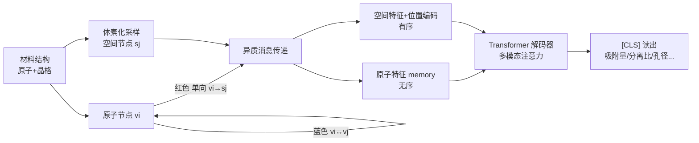

# From atom to space：面向材料空间性质的区域化读出函数 SpatialRead

**会议**: ICLR 2026  
**OpenReview**: [https://openreview.net/forum?id=v2oYZJ7Exo](https://openreview.net/forum?id=v2oYZJ7Exo)  
**代码**: [https://github.com/nankusa/SpatialRead](https://github.com/nankusa/SpatialRead)  
**领域**: AI for Science / 材料性质预测 / 图神经网络  
**关键词**: 读出函数, 空间性质, 异质图, 多孔材料, MOF, 气体吸附, 归纳偏置  

## 一句话总结
针对气体吸附等"按空间区域而非按原子分解"的材料性质，本文提出 SpatialRead：在体素化空间里插入"空间节点"、把原子图改造成原子—空间异质图，并用多模态注意力自适应融合原子与空间两种归纳偏置，使从零训练的小模型在这些任务上超越在 1.2 亿样本上预训练的基础模型。

## 研究背景与动机
- **领域现状**：消息传递—读出（message passing–readout）是 GNN 做材料性质预测的事实标准，绝大多数读出函数（sum/mean pooling、GraphTrans、GMT 乃至各种聚类/丢点池化）本质上都把"节点（原子）"当作聚合的基本单元，背后隐含**原子可分解归纳偏置**：材料级性质可以拆成每个原子的贡献之和。
- **现有痛点**：这个偏置对很多任务有效，却在**多孔材料**（金属有机框架 MOF、共价有机框架 COF、多孔聚合物网络 PPN、沸石）上失灵——气体吸附量、分离比、可及孔体积等性质天然应当拆成**每个空间区域**的贡献之和，而吸附最关键的孔道区域恰恰几乎不含原子，原子分解视角对它无能为力。
- **核心矛盾**：性质的物理分解方式（按区域）与读出函数的归纳偏置（按原子）不匹配；强行用空间分解又会损害那些本就该按原子分解的常规性质（如形成能）。
- **本文目标**：设计一个**物理上对得上目标性质**的读出函数，既能在空间性质上大幅领先，又不牺牲常规性质的表现。
- **核心 idea**：**把图级性质从"对节点求和"重写为"对空间积分"**——引入代表体素区域的"空间节点"，让原子单向地把消息传给空间节点，再用 Transformer 解码器自适应地在原子表征与空间表征之间做选择，从而同时容纳两种归纳偏置。

## 方法详解

### 整体框架
作者先给出一个经验观察作为动机：在标准 PaiNN 上看 MOF 吸附任务的逐原子贡献，发现贡献最高的前 1% 原子里有 86% 都贴在孔道（距孔 < 0.05 Å）——说明原子 GNN 其实**隐式地**在学"哪块区域重要"，那不如把区域**显式**建出来。SpatialRead 据此分三步：(1) 把"对空间积分"离散成"对若干体素区域求和"，每个区域落一个空间节点；(2) 原子图变成原子—空间异质图，做**单向**（原子→空间）的异质消息传递；(3) 把原子特征当 memory、有序的空间特征加位置编码后送入 Transformer 解码器，自适应融合两类偏置并由 [CLS] 读出性质。

### 关键设计

**1. 从节点分解到空间积分：先证等价再换偏置。** 常规读出把图级特征写成对节点特征的聚合 $h_{graph}=\sum f(h_{v_i}\mid H)$，本文把它重写成对连续空间的积分 $h_{graph}=\int g(r\mid S)\,d^3r=\int g(N(r))\,d^3r$，其中 $g$ 是一个有限感受野的区域贡献函数，$S$ 是材料结构。关键在于作者证明（Theorem 3.1）：当读出函数感受野有限时，"对节点求和"与"对空间积分"两种写法在**表达能力上完全等价**。这一点很重要——它说明换成空间视角只是**注入了一种新的归纳偏置**，而没有削弱模型的表达力；满足这种区域积分形式的性质被定义为"空间性质（spatial property）"，例如把 $g(r)$ 取作位置 $r$ 处吸附气体分子的密度，积分即得总吸附量。

**2. 区域化异质消息传递：体素化 + 原子单向喂给空间节点。** 把连续积分离散成 $p=\int g(r)d^3r\approx\sum_{j=1}^{N_s} g(r_j)\Delta V_j$，每个体素中心 $r_j$ 放一个空间节点 $s_j$。原子图随之变成原子—空间异质图，更新规则为 $h^{t+1}_{s_j}=U'_t\big(h^t_{s_j},\{h^t_{v_i},e_{v_i,s_j}\}_{v_i\in N(s_j)}[,\{h^t_{s_k},e_{s_k,s_j}\}_{s_k\in N(s_j)}]\big)$ 与 $h^{t+1}_{v_i}=U_t\big(h^t_{v_i},\{h^t_{v_j},e_{v_i,v_j}\}\big)$。这里的设计要点是**消息单向流动**：空间节点既接收邻近原子、也可选地接收邻近空间节点的消息，但**绝不反向影响原子节点**——这样空间节点是"读出侧"的纯采样器，不会污染骨干网络学到的原子表征。空间节点之间是否互传消息按物理性质决定（吸附时相邻区域气体有协同作用、可开；可及体积时区域独立、可关），本文因为后续 Transformer 已提供全局感受野，索性关掉空间节点间的消息传递。

**3. 性质自适应的多模态注意力读出：一套网络兼容两种偏置。** 最直接的做法是只对空间节点池化 $p=\sum_{j=1}^{N_s}\mathrm{MLP}(h_{s_j})$，这在空间性质上已经能涨点；但对那些本就原子可分解的常规性质，纯空间池化反而是错的归纳偏置、会掉点。为此作者给空间节点加位置编码使其**有序**，与**无序**的原子特征一起送进 Transformer 解码器：注意力机制让模型按目标性质**自适应地决定**更依赖原子表征还是空间表征。于是同一套 SpatialRead 在空间性质上保住增益、在非空间性质上也不退化；对孔径（PLD/LCD）这类既非原子可分解、又无法写成局部区域积分、而要看孔隙整体形状（符号距离函数）的性质，正是这个全局感受野的注意力读出在空间节点基础上进一步提供了大幅提升。

## 实验关键数据

### 主实验：空间性质（积分形式，R² 越高越好）

| 模型 | MOF C3H6/C3H8 分离 | MOF N2 吸附 | MOF CH4/N2 分离 | COF CH4 吸附 | PPN CH4 吸附 | 沸石 CH4 吸附热 |
|---|---|---|---|---|---|---|
| CGCNN (scratch) | 0.663 | 0.760 | 0.718 | 0.556 | 0.692 | 0.411 |
| GemNet (scratch) | 0.729 | 0.968 | 0.924 | 0.816 | 0.932 | 0.836 |
| MOFTransformer (预训练) | 0.817 | 0.918 | 0.905 | 0.967 | 0.942 | 0.836 |
| JMP (1.2 亿样本预训练) | 0.774 | 0.971 | 0.908 | 0.884 | 0.947 | 0.874 |
| PaiNN (scratch) | 0.691 | 0.925 | 0.867 | 0.736 | 0.856 | 0.791 |
| **PaiNN + SN (ours)** | 0.794 | 0.978 | 0.936 | 0.979 | 0.978 | 0.886 |
| **PaiNN + SN + MM (ours)** | 0.784 | 0.987 | 0.941 | 0.987 | 0.977 | **0.969** |
| **JMP + SN + MM (ours)** | **0.792** | **0.988** | **0.941** | 0.982 | **0.969** | 0.945 |

从零训练的 PaiNN+SpatialRead 在多数空间性质上直接超过在 1.2 亿样本上预训练的 JMP；把 SpatialRead 接到预训练 JMP 上还能进一步涨点，说明该读出与预训练骨干**即插即用**。

### 消融与几何性质（R²）

| 模型 | ASA 表面积 | VF 空隙率 | PLD 孔径 | LCD 最大空腔 |
|---|---|---|---|---|
| PaiNN (base) | 0.993 | 0.951 | 0.594 | 0.631 |
| PaiNN + SN | 0.974 | 0.999 | 0.856 | 0.913 |
| PaiNN + SN + MM | 0.996 | 0.999 | **0.965** | **0.975** |

消融把方法拆成 Base GNN → +SN（空间节点池化）→ +SN+MM（多模态 Transformer）。**积分型**性质（吸附量）上 +SN 就够、+MM 不再稳定加分（因为 $\sum\mathrm{MLP}(h_{s_j})$ 已物理对位）；而**非积分型**几何性质（PLD/LCD，依赖孔隙整体形状）则必须靠 +MM 的全局感受野，PLD 从 0.594→0.965。

### 关键发现
- **积分型 vs 非积分型的清晰分界**：对吸附量这类能写成区域积分的性质，纯空间池化（+SN）已逼近上限，再加注意力（+MM）不再稳定加分；而对孔径 PLD/LCD 这类要看孔隙整体形状的性质，必须靠 +MM 的全局感受野才能补足（PLD 0.594→0.965）。这条边界本身就是对"读出该怎么选"的一个可操作判据。
- **即插即用于预训练模型**：JMP 用简单 sum-pooling 预训练，却能无缝接上 SpatialRead 并显著涨点，且 JMP+SpatialRead 又压过 GemNet(JMP from scratch)+SpatialRead，说明大规模预训练的收益与下游读出的改造可以叠加。
- **常规性质不退化**：在 MatBench 上 JMP+SpatialRead 整体与 JMP 相当——形成能（原子可分解）略降，带隙（VBM/CBM 是多原子集体态）反而提升，印证读出偏置要"对得上性质物理"。
- **可解释性与 OOD 泛化**：贡献最高的前 10% 空间节点几乎都落在孔道里；分布外（高空隙率材料）泛化上，PaiNN+SpatialRead 仅训 3 epoch 就比训 40 epoch 的 sum-pooling 有更好的 Spearman 相关性。

## 亮点与洞察
- **把"换读出"上升成"换归纳偏置"并给出理论保证**：先证明区域积分与节点求和等价，再理直气壮地引入空间分解偏置——这让"空间节点"不是 trick，而是有物理与表达力依据的设计。
- **单向消息流**是个干净的工程决策：空间节点只读不写，既显式建模了孔道这种"无原子但关键"的区域，又不破坏骨干已学好的原子表征，因而能无痛接到预训练模型上。
- **多模态注意力把两类偏置的取舍交给数据**，使同一套读出同时覆盖"积分型空间性质 / 非积分几何性质 / 原子可分解常规性质"三种截然不同的物理场景。
- 实践冲击力强：小模型从零训练打过亿级预训练基础模型，说明在 AI for materials 里，**对得上物理的读出**可能比堆数据更划算。
- "先看标准 GNN 隐式学了什么、再把它显式化"的研究路径很值得借鉴：86% 高贡献原子贴在孔道这一观察，直接为"显式插空间节点"提供了经验依据，让方法动机扎实而非凭空设计。

## 局限与展望
- 空间节点靠体素化均匀采样，节点数与分辨率、计算开销直接相关；论文也提到 GemNet 四体交互算力高导致超参受限，JMP+SpatialRead 并不总能压过 PaiNN+SpatialRead。
- 自定义空间性质 benchmark（4 类多孔材料、27 个下游任务）虽新但仍偏多孔材料一隅，对更广材料体系的普适性有待验证。
- 体素分辨率、空间节点邻接构造（cutoff/最大邻居数）、是否开启空间节点间消息传递等都需按性质人工设定，缺少自动选择机制。
- 对"既非积分型、又非原子可分解"的性质（如 PLD/LCD）虽有效，但其有效性更多来自 Transformer 全局感受野，与"空间节点"本身的因果贡献值得进一步拆解。
- 空间节点之间是否传递消息、以及位置编码的选取目前依赖人工先验与对目标性质物理的判断，方法尚未给出端到端学习这些结构超参的途径。

## 相关工作与启发
- **读出/池化函数**：本文把已有读出归为三类——平铺池化（GMT、GraphTrans 的 [CLS] 注意力）、节点聚类池化（DiffPool、MinCutPool、SEP、ORC-Pool 等）、丢点池化（TopKPool 等），指出它们都没跳出"原子为聚合单元"的框架，SpatialRead 是首个把聚合单元换成空间区域的读出。
- **材料性质 GNN**：CGCNN、DimeNet、GemNet、PaiNN、ViSNet 等长期专注于打磨消息传递，读出几乎都用最简单的 sum/mean；MOFTransformer、JMP 等预训练基础模型也沿用简单池化——本文恰好补上了"读出端的物理归纳偏置"这块空白。
- **启发**：当任务的物理可分解方式与默认聚合单元不一致时，与其堆数据/堆消息传递层数，不如先把读出函数对齐到性质的物理本质；"引入辅助节点显式表征关键但稀疏的区域"这一思路也可迁移到其他存在"空腔/界面/缺陷"主导性质的场景。

## 评分
- 新颖性: ⭐⭐⭐⭐⭐ 把读出函数从"节点求和"重构为"空间积分"，并给出表达力等价证明，是对材料 GNN 一个长期被忽视的归纳偏置盲点的本质性纠正。
- 实验充分度: ⭐⭐⭐⭐ 覆盖 4 类多孔材料、空间/几何/常规三类性质，并验证即插即用与 OOD 泛化、可解释性；新建 benchmark 有价值但仍偏多孔材料领域。
- 写作质量: ⭐⭐⭐⭐ 动机—理论—架构—实验逻辑清晰，先用经验观察引出空间节点很有说服力；公式与消融分层（SN / MM）讲得明白。
- 价值: ⭐⭐⭐⭐⭐ 小模型从零训练超越亿级预训练基础模型，且方法可直接嫁接现有预训练 GNN，对气体吸附/分离等高价值材料筛选任务有直接实用意义。

<!-- RELATED:START -->

## 相关论文

- [\[ICLR 2026\] A Single Architecture for Representing Invariance Under Any Space Group](a_single_architecture_for_representing_invariance_under_any_space_group.md)
- [\[ICLR 2026\] Out of the Shadows: Exploring a Latent Space for Neural Network Verification](out_of_the_shadows_exploring_a_latent_space_for_neural_network_verification.md)
- [\[ICLR 2026\] Exploring State-Space Models for Data-Specific Neural Representations](exploring_state-space_models_for_data-specific_neural_representations.md)
- [\[CVPR 2026\] Consensus vs. Controversy: Mapping the Decision Space Where Architectures Diverge](../../CVPR2026/others/consensus_vs_controversy_mapping_the_decision_space_where_architectures_diverge.md)
- [\[ICML 2026\] Spatial Priors via Space Filling Curves for Small and Limited Data Vision Transformers](../../ICML2026/others/spatial_priors_via_space_filling_curves_for_small_and_limited_data_vision_transf.md)

<!-- RELATED:END -->
