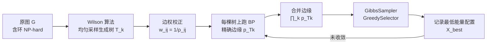

# From Fields to Random Trees

**会议**: ICLR 2026  
**OpenReview**: [https://openreview.net/forum?id=5VN11Hd3uY](https://openreview.net/forum?id=5VN11Hd3uY)  
**代码**: [https://github.com/LOGO-CUHKSZ/From-fields-to-random-trees](https://github.com/LOGO-CUHKSZ/From-fields-to-random-trees)  
**领域**: 概率图模型 / 组合优化  
**关键词**: MRF, MAP 推断, 随机生成树, 置信传播, 有效电阻, Wilson 算法  

## 一句话总结
本文提出 SPT 方法：通过从马尔可夫随机场（MRF）的底图上**均匀采样随机生成树**来打断环路，把原本 NP-hard 的 MAP 推断分解为一系列可精确求解的树上子问题，再用有效电阻校正边权后合并，在稀疏且局部连接的图上显著优于 LBP / TRBP。

## 研究背景与动机
**领域现状**：MRF 上的 MAP 推断（即在给定一元势 $\theta_i$ 和成对势 $\theta_{ij}$ 下最小化能量 $E(X)=\sum_i \theta_i(x_i)+\sum_{(i,j)\in E}\theta_{ij}(x_i,x_j)$）是计算机视觉、5G 通信网络、病理图像分析等领域的核心工具。无环图上 min-sum / Viterbi 可精确求解，但含环的一般图上该问题 NP-hard。

**现有痛点**：主流方法各有死穴——置信传播（BP）在有环图上变成 Loopy BP（LBP），既不保证收敛也缺乏理论保证；树重加权置信传播（TRBP/TRW）虽是长期 SOTA，但 TRW-E/TRW-T 可能无限循环，TRW-S 虽能达到弱树一致性却需要漫长时间收敛；Junction Tree 需找最大团生成树（本身 NP-hard）；Graph Cut、Mean-Field 等也都在精度与效率间各有取舍。**没有任何单一方法能在所有规模、拓扑、分布上稳居 SOTA**。

**核心矛盾**：环路是 MAP 推断难解的根源，但已有"用树打断环"的方法（如 outer-planar 分解、tree log-likelihood）要么只适用平面图/网格，要么**在用子树近似时没有对边消息做校正**，导致合并结果系统性偏离原问题。

**本文目标**：针对现实中广泛存在的**稀疏且局部连接图**（电网、5G、交通网、社交网），设计一个可扩展、有理论保证、且合并结果忠实于原问题的 MAP 推断算法。

**核心 idea**：**"采样随机树—在树上精确推断—合并"**。关键洞察是用**均匀随机生成树**（uniform spanning tree）逐次逼近原图，并用边在随机生成树中出现的概率 $\rho_{ij}$ 对成对势做重加权校正，使得合并后的期望能量恰好等于原图能量。

## 方法详解

### 整体框架
SPT（Spanning Tree message passing）把 MAP 推断拆成三步循环：先用 Wilson 算法从原图均匀采样一组生成树 $\{T_k\}$，在每棵无环树上跑置信传播得到精确边缘分布；然后把各树的边缘按乘积合并近似真实边缘；最后用 Gibbs 采样器和贪婪选择器从合并边缘里产生候选解，并始终记录迄今能量最低的配置作为输出。整个过程围绕"用多棵树的精确解拼出原图近似解"展开。

### 关键设计
**1. 随机生成树分解：把含环图拆成可精确求解的树上子问题。** 直接在含环原图上推断不可解，而生成树既能覆盖所有节点、又无环，于是在每棵树 $T$ 上的子问题 $\min_X \sum_{i\in V}\theta_i(x_i)+\sum_{(i,j)\in T}\theta_{ij}(x_i,x_j)$ 可用 BP 精确求解。多棵树合起来能尽量保留原图节点间的依赖关系，同时避免 Loopy BP 中环路带来的消息振荡。这是整个方法把"难问题分解为易问题"的骨架。

**2. 有效电阻边权校正：保证合并能量无偏地逼近原能量。** 朴素地把树上能量相加会系统性偏离原图——因为每条边只是以概率 $\rho_{ij}$ 出现在采样树里。本文给每条边的成对势乘上校正系数 $w_{ij}=1/\rho_{ij}$，使重加权后的子问题 $\min_X \sum_i\theta_i(x_i)+\sum_{(i,j)\in T} w_{ij}\theta_{ij}(x_i,x_j)$ 在对生成树分布求期望后恰好还原原能量。对应到 BP，节点 $i$ 收到的消息也被相应改写为 $\tilde{M}_{ji}=(M_{ji})^{w_{ij}}$。**Lemma 1** 证明当采样所有生成树（$|K|=|\mathcal{T}|$）时近似能量与原能量重合，**Lemma 2** 进一步说明用蒙特卡洛近似时期望仍等于原能量：$\mathbb{E}_{T_k}\big[\sum_i\theta_i+\tfrac{1}{|K|}\sum_k\sum_{(i,j)\in T_k}w_{ij}\theta_{ij}\big]=\sum_i\theta_i+\sum_{(i,j)\in E}\theta_{ij}$。这是方法区别于以往"不做边校正"树方法的核心。

**3. 用有效电阻高效估计边出现概率 $\rho_{ij}$。** 直接算 $\rho_{ij}$ 不可行，本文借助图论中的**有效电阻**（effective resistance）：由 Kirchhoff 公式可得 **Lemma 3**——对无权图，边 $(i,j)$ 出现在均匀生成树中的概率恰等于其有效电阻 $\rho_{ij}=R_{\text{eff}}(i,j)$。由于只需相邻节点间的电阻，可用高效近似算法（Vos 2016）一次性算出所有边权，无需对全图所有节点对计算。

**4. 概率合并与候选生成：从多棵树拼出原图解。** 各树的边缘按 $\tilde{p}(x_i\mid X\setminus\{x_i\})\propto \prod_k p_{T_k}(x_i\mid\cdot)$ 合并（能量相加对应概率相乘）。在合并边缘上，`GibbsSampler` 按边缘分布采样一组标签 $X_{\text{Gibbs}}$，`GreedySelector` 取每个节点边缘最大的标签 $X_{\text{Greedy}}$；因为采样有随机性、贪婪逐点最优不等于整体最优，算法迭代中持续记录能量最低的配置 $X_{\text{best}}$，终止时输出它。

**理论收敛保证。** **Theorem 1** 给出以至少 $1-\delta$ 概率成立的误差界 $|E(X)-\tilde{E}(X)|\le \sqrt{\tfrac{1}{|K|}\sum_{(i,j)\in E}\theta_{ij}^2\cdot\tfrac{1-\rho_{ij}}{\rho_{ij}}}\cdot\tfrac{1}{\sqrt{\delta}}$。其中 $\tfrac{1-\rho_{ij}}{\rho_{ij}}$ 一项解释了方法**为何在稀疏图上更优**：稀疏图中节点间替代路径少，每条边被选入生成树的概率 $\rho_{ij}$ 更高，该项更小、误差界更紧，仅需少量树即可获得高质量结果；稠密图中路径多、$\rho_{ij}$ 小，误差界变松。这与实验观察一致。

## 实验关键数据
对比方法：Mean-field、LBP、TRBP（TRW 精炼版，长期 SOTA）、mapMAP，本文方法记为 **SPT**。

### 主实验（UAI 2022 推断竞赛数据集，能量值越低越好）

| 实例 | #节点/#边 | LBP | TRBP | mapMAP | SPT |
|------|-----------|-----|------|--------|-----|
| Segmentation 11 | 228/624 | 346.6 | 348.1 | 286.0 | **200.9** |
| Segmentation 13 | 225/607 | 726.1 | 726.1 | 7689.7 | **596.6** |
| Segmentation 15 | 229/622 | 362.6 | 362.6 | 277.1 | **191.9** |
| Segmentation 17 | 225/612 | 392.8 | 370.9 | 296.1 | **187.4** |
| Segmentation 20 | 232/635 | 373.1 | 371.8 | 287.2 | **196.6** |
| GRIDS 19 | 1600/3200 | 7053.7 | **6056.5** | 7523.2 | 6275.6 |

在所有 Segmentation 实例（Potts 模型、结构稀疏局部）上 SPT **全面领先**；在 Grid / ProteinFolding 等实例上与 LBP/TRBP 持平。

### 真实 5G PCI 问题（整数规划转 MRF，能量越低越好）

| 实例 | #节点/#边 | LBP | TRBP | mapMAP | SPT |
|------|-----------|-----|------|--------|-----|
| PCI 1 | 30/165 | 3.73E8 | 3.73E8 | 101259 | **84383** |
| PCI 2 | 40/311 | 3.73E8 | 3.73E8 | 214875 | **186848** |
| PCI 3 | 80/1522 | 0.3035 | 0.3035 | 0.2995 | **0.2952** |
| PCI 4 | 286/10565 | 0.7511 | 0.7511 | 0.7256 | **0.5521** |

SPT 在四个工业级 PCI 实例上**全部取得最优能量**，LBP/TRBP 在 PCI 1/2 上完全失效（能量爆到 3.7E8）。

### 合成实验关键发现
- 在 Grid（70×70，4900 节点）、Cellular（4998 节点，平均度 2.96）、Cell（4900 节点，平均度 5.89）等**局部稀疏图**上，SPT 在最终能量和迭代效率上均超越 LBP/TRBP/mapMAP；SPT 只需 20 棵树、阻尼因子设为 0，迭代轮数仅 20（LBP/TRBP 需 40 轮、阻尼 0.8）。
- 在密度约为 cellular 两倍的 ER 随机图上仍表现稳健，误差棒显示 SPT 收敛后尤为稳定。
- **唯一短板**：能量函数为绝对差 $\theta_{ij}=\alpha|x_i-x_j|$ 时略逊于 LBP/TRBP——当不同选择代价相近时算法易收敛到次优。

### 时间开销（UAI 数据集）
SPT 推断时间明显高于 LBP/TRBP（如 Grids 19 上 SPT 112.9s + $\rho_{ij}$ 计算 89.1s，LBP 仅 3.3s），主要瓶颈在 Wilson 算法 $O(N^3)$ 与有效电阻计算。

## 亮点与洞察
- **把"采样 + 精确推断"两种范式优雅结合**：树上 BP 精确、采样带来灵活性，在精度与可行性间取得平衡，且整套流程有 Lemma 1–3 + Theorem 1 的理论支撑。
- **有效电阻边权校正是点睛之笔**：它把"采样偏差"用一个可解析估计的物理量 $\rho_{ij}=R_{\text{eff}}$ 精确补偿，理论上保证无偏，且实现上只需相邻节点电阻、无需重加权后再算。
- **误差界自洽地解释了适用边界**：$\tfrac{1-\rho_{ij}}{\rho_{ij}}$ 一项把"稀疏图更准"从经验观察提升为理论结论，定位清晰——专攻稀疏局部图而非追求全场景 SOTA。

## 局限与展望
- **计算开销大**：Wilson 算法 $O(N^3)$ 与有效电阻计算在大图上是主要瓶颈，推断时间比 LBP/TRBP 高一个数量级；作者指出可引入近似采样（如 Schild 2018）或 DFS（$O(M+N)$，但难以获得树分布）降复杂度。
- **能量函数敏感**：在绝对差能量上略逊主流方法，对"代价平坦"的问题易陷次优。
- **稠密图退化**：误差界在 $\rho_{ij}$ 小时变松，方法优势主要局限于稀疏局部图。
- **超参依赖采样数 $|K|$**：树数过少则近似不准，过多则更慢，需按图稀疏度权衡。

## 相关工作与启发
- **置信传播谱系**：从 Pearl 的 BP（1988）到 LBP、TRW-E/T/S、TRBP（长期 SOTA），本文延续"用树重加权打断环"的思路，但首次系统性地用均匀生成树采样 + 有效电阻校正给出无偏近似与误差界。
- **树分解类方法**：相比 Batra 等（2010，限平面图）、Pletscher 等（2009，tree log-likelihood）、Skurikhin（2014，限网格）等，本文强调**在边上做消息校正**以避免偏离原消息（Lemma 1 反例佐证），并能处理一般大规模图。
- **启发**：把组合优化的"难结构"用随机采样的"易结构"逼近、再用图论量（有效电阻）解析地补偿采样偏差，是一条可迁移到其他含环推断/优化问题的范式。

## 评分
- **新颖性**: ⭐⭐⭐⭐ — "均匀生成树采样 + 有效电阻边权校正 + 误差界"的组合在 MRF MAP 推断上是新颖且自洽的视角，把采样偏差用物理量精确补偿很有巧思。
- **实验充分度**: ⭐⭐⭐⭐ — 覆盖合成（4 种拓扑 × 3 种能量）、UAI 竞赛、真实 5G PCI 三类基准，对比 5 个方法并报告时间开销，较为全面；但缺少更大规模图与更多近代神经推断 baseline。
- **写作质量**: ⭐⭐⭐⭐ — 三步框架清晰，理论（3 个 Lemma + 1 个 Theorem）与直觉解释结合到位，pipeline 图明确。
- **价值**: ⭐⭐⭐⭐ — 在稀疏局部图（通信/电网/交通）这一现实重要场景上确有实用价值，PCI 实例上对 LBP/TRBP 的碾压尤为说明问题；计算开销是落地的主要障碍。

<!-- RELATED:START -->

## 相关论文

- [\[ACL 2025\] Bregman Conditional Random Fields: Sequence Labeling with Parallelizable Inference](../../ACL2025/others/bregman_conditional_random_fields_sequence_labeling_with_parallelizable_inferenc.md)
- [\[ICLR 2026\] Active Learning for Decision Trees with Provable Guarantees](active_learning_for_decision_trees_with_provable_guarantees.md)
- [\[ICLR 2026\] Deterministic Bounds and Random Estimates of Metric Tensors on Neuromanifolds](deterministic_bounds_and_random_estimates_of_metric_tensors_on_neuromanifolds.md)
- [\[ICLR 2026\] Refine Now, Query Fast: A Decoupled Refinement Paradigm for Implicit Neural Fields](refine_now_query_fast_a_decoupled_refinement_paradigm_for_implicit_neural_fields.md)
- [\[ICLR 2026\] Random Anchors with Low-rank Decorrelated Learning: A Minimalist Pipeline for Class-Incremental Medical Image Classification](random_anchors_with_low-rank_decorrelated_learning_a_minimalist_pipeline_for_cla.md)

<!-- RELATED:END -->
