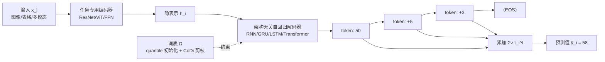

# GoR: A Unified and Extensible Generative Framework for Ordinal Regression

**会议**: ICLR 2026  
**OpenReview**: [https://openreview.net/forum?id=ys80cc2N5M](https://openreview.net/forum?id=ys80cc2N5M)  
**代码**: [https://github.com/snailma0229/GoR.git](https://github.com/snailma0229/GoR.git)  
**领域**: 序数回归 / 生成式建模 / 机器学习方法  
**关键词**: ordinal regression, autoregressive generation, vocabulary construction, bias-variance trade-off, model-agnostic  

## 一句话总结
把序数回归（预测有内在顺序的目标值，如年龄、美学评分、观看时长）从"连续空间离散化成固定 bin 再分类"重构成"自回归生成一串有序 token、累加得到预测值并由动态 ⟨EOS⟩ 决定何时停"，并用偏差-方差分解推出误差界与 CoDi 词表构建准则，在 5 大领域 15 个基准上一致超过 SOTA。

## 研究背景与动机
**领域现状**：序数回归（Ordinal Regression, OR）的目标标签带有天然顺序（年轻→年老、短→长），广泛见于人脸年龄估计、图像美学评估、观看时长预测、用户生命周期价值（LTV）预测等。它比普通分类/回归更难，因为既要建模标签间的有序结构，又要处理相邻类别之间非平稳的语义边界。

**现有痛点**：主流方法基于连续空间离散化（Continuous Space Discretization, CSD）——把连续目标量化成有限个有序 bin，输出 softmax 概率再做加权期望。沿此框架的两条路线各有硬伤：(1) **边界增强类**靠参考样本对比来区分边界附近的点，但严重依赖参考点选择的启发式，在宽值域场景里组合复杂度爆炸；(2) **rank-based 类**把 OR 拆成一系列"是否大于某阈值"的二分类子任务，虽有理论保证，但顺序依赖只藏在标签定义里，各 bin 的预测彼此独立（论文 Proposition 1 证明这会带来系统性 KL 误差）。更要命的是固定分桶的**刚性**：长尾分布下放大头部类误差，且性能对分桶粒度极敏感——宽区间糊掉语义、窄区间又造成稀疏。

**核心矛盾**：序数标签本质上是可无限分解、可叠加的数值，但 CSD 强行用一套预先切死的离散边界去近似它，既丢了 bin 之间的顺序依赖，又被固定分辨率绑死，无法随样本自适应粗细。

**本文目标**：设计一个跨域通用、对编码器/解码器架构无关、并能复用现成生成式优化技巧的序数回归范式，从根上绕开固定分桶的刚性。

**核心 idea**：**把序数回归当成序列生成任务**——受生成式语言模型启发，自回归地预测代表"序数值片段"的 token，累加这些 token 的数值贡献得到最终预测，由动态 ⟨EOS⟩ 决定序列长度，从而显式建模顺序依赖并实现自适应分辨率与可解释的逐步精化。

## 方法详解

### 整体框架
GoR 在标签连续空间与离散 token 序列空间之间建立双射：每个标签 $y_i$ 被编码成变长 token 序列 $\tau_i=\{\tau_i^t\}_{t=1}^{T_i}$，token 取自词表 $\Omega=\{\omega_j\}_{j=1}^{V}$，并通过加性查找表 $\nu:\Omega\to\mathbb{R}$ 重构数值 $y_i\approx r(\tau_i)=\sum_{t=1}^{T_i}\nu(\tau_i^t)$。训练时一个任务专用编码器把输入 $x_i$ 映射到隐表示 $h_i$，一个架构无关的自回归解码器在 $h_i$ 条件下逐 token 生成；推理时从 ⟨SOS⟩ 起步、生成到 ⟨EOS⟩ 停，累加得到 $\hat{y}_i$。直觉例子：人脸年龄先吐粗 token（50），再吐细修正（+5、+3），最终 50+5+3=58 岁，每步都在选一个让残差更小的 token，模拟人"从粗到精"的认知过程。

### 关键设计

**1. 自回归序数生成范式：用条件生成显式接回被 CSD 砍断的顺序依赖。** rank-based 方法假设各二分类决策条件独立 $P_{\text{naive}}(B_i|x_i)=\prod_m P(B_i^m|x_i)$，论文证明它与真实链式分布 $P_{\text{true}}(B_i|x_i)=\prod_m P(B_i^m|B_i^{<m},x_i)$ 的 KL 散度等于各步条件互信息的累加（Proposition 1），也就是说独立性假设系统性地丢掉了相邻区间的依赖。GoR 反其道而行，用概率链式法则把序列联合概率按自回归分解 $P_\theta(\tau_i|h_i)=\prod_{t=1}^{T_i}P_\theta(\tau_i^t|h_i,\hat{\tau}_i^{<t})$，每一步预测都显式条件在已生成的前缀上，把顺序依赖重新建进模型，同时靠动态 ⟨EOS⟩ 让不同样本用不同长度的序列、实现自适应分辨率。

**2. 偏差-方差误差界：给"该选什么样的 token"一个可证明的理论标尺。** 把 $\nu(\tau_i^t)$ 视为随机变量 $C_i^t$，记最大单步偏差 $B=\max_t|\mathbb{E}[\hat{C}_i^t|\theta]-C_i^t|$、单步方差 $V_{\text{var}}=\max V(C_i^t)\le\frac{(\omega_{\max}-\omega_{\min})^2}{4}$，论文证明 GoR 的均方误差满足

$$\mathbb{E}\big[(\hat{y}_i-y_i)^2\big]\le T_i^2 B^2 + T_i^2 V_{\text{var}}\le T_i^2 B^2 + T_i^2\frac{(\omega_{\max}-\omega_{\min})^2}{4}$$

这个界把误差拆成三个可控因子：序列长度 $T_i$、单步偏差 $B$、单步方差 $V_{\text{var}}$。由此提炼出词表设计三公理：词表要能用有限 token 覆盖所有目标值（控偏差）、要同时压偏差和方差（覆盖约束 + 稀疏控制）、要跨数据集尺度不变（抗分布漂移）。这把"词表怎么造"从拍脑袋变成了对误差界的显式优化。

**3. CoDi 词表构建：用覆盖度×独特性这一单指标做偏差-方差权衡的剪枝。** 先用基于分位数的策略初始化一个能充分覆盖标签分布的大词表（迭代地按剩余标签的固定百分位选 token 并从超出标签里减掉），但这样词表过大。于是定义 Coverage–Distinctiveness Index

$$\text{CoDi}_j=\underbrace{\Big(\frac{1}{N}\sum_{i=1}^N\frac{\text{count}(\omega_j,\tau_i)}{T_i}\Big)}_{\text{Coverage(关乎偏差)}}\cdot\underbrace{\log\frac{N}{|\{i\mid\omega_j\in\tau_i\}|+1}}_{\text{Distinctiveness(关乎方差)}}$$

Coverage 项衡量 token 使用频率（影响近似偏差），Distinctiveness 项衡量 token 独特性（影响模型方差），二者相乘后做 top-down 剪枝：每轮删掉 CoDi 最低的 token，用保留比例 $\beta$ 和阈值 $\epsilon$ 控制词表大小与重构保真度的折中。CoDi 的效果是让 token 频率分布更均匀，从而同时压低 token 级方差和单步偏差 $B$，与 Theorem 1 完全吻合。

**4. 序数目标序列化与训练目标：贪心分解保证短、准、单调的 token 序列。** 把标签 $y_i$ 编码成序列时遵循三原则——长度 $T_i$ 尽量短（好学）、重构相对误差受限 $\frac{|y_i-r(\tau_i)|}{y_i}\le\epsilon$（准）、token 数值降序排列以强制由粗到精的单调性 $\tau_i^t\ge\tau_i^{t+1}$。用贪心分解算法每步从残差里选最大可用 token $\tau_i^t=\max\{w\in\Omega\mid\nu(w)\le y_i-\sum_{k=1}^{t-1}\nu(\tau_i^k)\}$，残差小于 $\epsilon$ 即停，借预排序词表实现 $O(|\Omega|)$ 复杂度。训练上主目标是序列负对数似然 $L_{\text{NLL}}=-\sum_i\sum_t\log P_\theta(\tau_i^t|h_i,\hat{\tau}_i^{<t})$，再叠一个 Huber 回归损失把数值顺序关系注入预测，最终 $L_{\text{final}}=L_{\text{NLL}}+\lambda\cdot L_{\text{reg}}$。整个框架对编码器（FFN/ResNet/ViT 随模态换）和解码器（RNN/GRU/LSTM/Transformer 随需求换）都保持无关，还能近零成本接 curriculum learning、N-gram、GRPO/DPO 等生成式优化技巧。

## 实验关键数据

### 主实验表格（部分领域）

| 任务 | 数据集 | 指标 | 次优方法 | GoR | 提升 |
|------|--------|------|---------|-----|------|
| LTV | Criteo-SSC | MAE↓ | 14.764 (HiLTV) | **12.965** | -12.2% |
| LTV | Criteo-SSC | SRCC↑ | 0.2645 (HiLTV) | **0.3036** | +14.8% |
| WTP | KuaiRand | MAE↓ | 8.696 (CWM) | **7.032** | -19.1% |
| WTP | KuaiRec | XAUC↑ | 0.594 (CREAD) | **0.616** | +3.7% |
| FAE | FG-NET | MAE↓ | 4.95 (FaRL) | **4.68** | -14.1%(对应区间内) |
| FAE | MORPH | MAE↓ | 2.78 (Unimodal) | **2.69** | -5.8% |
| HID | HCI | MAE↓ | 0.53 (Ord2Seq) | **0.51** | -3.8% |

图像美学评估（IAA，TAD66K/AVA/ICAA17K/SPAQ 四基准）上，GoR 即使配老旧 TANet 编码器也能显著超 SOTA，配标准 ResNet50 即可媲美专家定制架构，配现代 AesMamba 则刷新 SOTA——验证范式与编码器无关。

### 消融实验表格
**词表构建（KuaiRec / CIKM16，MAE↓ / XAUC↑）**

| 词表设计 | KuaiRec MAE | KuaiRec XAUC | CIKM16 MAE | CIKM16 XAUC |
|---------|------------|--------------|-----------|-------------|
| Manual | 3.281 | 0.604 | 0.825 | 0.685 |
| Binary | 3.268 | 0.605 | 0.821 | 0.687 |
| Quantile | 3.221 | 0.609 | 0.820 | 0.688 |
| Quantile + CoDi | **3.194** | **0.616** | **0.808** | **0.696** |

CoDi 对三种初始化策略**普遍**有增益；$\beta$ 越小（剪得越狠）性能呈非单调——先因方差下降而变好、过度压缩又因偏差暴涨而变差，严格印证 Theorem 1 的偏差-方差权衡。

**生成式优化技巧兼容性（KuaiRec）**：仅 TF 时 MAE 3.359 / XAUC 0.588，叠加 CL+NP 后降到 3.194 / 0.616，再加 DPO（用 beam-search 候选的 MAE 当隐式偏好信号，无需显式奖励模型）在 Criteo-SSC 上 MAE 进一步降到 12.438、SRCC 升到 0.309——且**不增加任何模型参数**。

### 关键发现
- **架构无关**：RNN/GRU/LSTM/Transformer 四种解码器全部超过现有 SOTA，Transformer 最优，证明增益来自范式本身而非某种特定架构。
- **校准极好**：在 KuaiRec 上 GoR 预测分布均值 μ=7.73 几乎贴合 GT 的 7.69，而 CREAD(8.54)、TPM(9.11) 因刚性分桶系统性高估；这归功于粗到精 tokenization 能动态适配不同粒度。
- **细粒度更稳**：在占 80% 样本的 0–10s 短/中时段，GoR 各区间 MAE 全面优于 CREAD/TPM。

## 亮点与洞察
- **把"离散化分类"换成"加性序列生成"是个干净的范式跃迁**：顺序依赖不再藏在标签定义里而被显式建进自回归条件，分辨率不再被固定 bin 绑死而由 ⟨EOS⟩ 自适应——一举解掉 CSD 两条老路线的两个根因痛点。
- **理论不是装饰而是直接驱动设计**：Proposition 1 量化 rank-based 的独立性误差，Theorem 1 的三因子误差界直接推出词表三公理，CoDi 的两项恰好对应偏差项与方差项，理论与消融曲线（β 非单调）严丝合缝。
- **极强的工程可移植性**：编码器随模态换、解码器随需求换、还能近零成本嫁接 NLP 里成熟的 TF/CL/N-gram/DPO，等于把语言模型十年积累的优化武器库直接搬到序数回归。

## 局限与展望
- **自回归推理延迟**：推理代价随输出序列长度线性增长，对需要快速预测长序列的场景不友好（论文自述）。
- **生成式模型通病**：和语言生成模型一样可能受错误累积/暴露偏差影响（原文在 limitation 处提及）。
- 词表初始化与 CoDi 剪枝引入 $\epsilon$、$\beta$、$\lambda$ 等超参，跨域虽声称尺度不变，但实际调参与稳健性边界仍需更系统的分析。
- 未来可探索非自回归/并行解码以降延迟，以及把更多 RLHF/偏好优化范式迁移进来。

## 相关工作与启发
- **CSD 两条路线**：边界增强（POE、MWR 等参考对比）与 rank-based（OR-CNN、Ord2Seq 等阈值二分类）是本文的直接对标对象，GoR 的 Proposition 1 正是对 rank-based 独立性假设的理论批判。
- **生成式语言模型**：自回归 token 生成、⟨EOS⟩ 终止、Teacher Forcing/Curriculum Learning/N-gram/DPO 等都是从 NLP 借来的，启发在于"任何带顺序与可加结构的回归目标，都可能受益于序列生成视角"。
- **启发**：CoDi 这种"覆盖×独特性"的单指标词表剪枝思路，对其它需要把连续量离散成可学习 token 的任务（如时序、信号量化、向量量化码本设计）有迁移价值；用 beam-search 候选 + 任务指标当隐式偏好做 DPO 也是个无需奖励模型的轻量对齐范式。

## 评分
- **新颖性**: ⭐⭐⭐⭐⭐ 首次把序数回归形式化为自回归序列生成，配套偏差-方差误差界与 CoDi 词表准则，范式层面的原创贡献。
- **实验充分度**: ⭐⭐⭐⭐⭐ 横跨 5 大领域 15 个基准、四种解码器架构、词表/优化技巧/分布校准/细粒度区间等多维消融，覆盖面与一致性都很扎实。
- **写作质量**: ⭐⭐⭐⭐ 理论-方法-实验三段闭环清晰，公式与直觉例子配合好；唯方法细节（贪心序列化、CoDi 剪枝算法）较密集，需对照附录才完全跟上。
- **价值**: ⭐⭐⭐⭐⭐ 提供了一个模型无关、可扩展、理论有据的通用 OR 基线，对推荐（LTV/WTP）与视觉（年龄/美学）等高价值落地任务直接可用。

<!-- RELATED:START -->

## 相关论文

- [\[ICLR 2026\] DA-AC: Distributions as Actions — A Unified RL Framework for Diverse Action Spaces](distributions_as_actions_a_unified_framework_for_diverse_action_spaces.md)
- [\[ACL 2025\] MapQaTor: An Extensible Framework for Efficient Annotation of Map-Based QA Datasets](../../ACL2025/others/mapqator_an_extensible_framework_for_efficient_annotation_of_map-based_qa_datase.md)
- [\[ECCV 2024\] An Incremental Unified Framework for Small Defect Inspection](../../ECCV2024/others/an_incremental_unified_framework_for_small_defect_inspection.md)
- [\[ICML 2026\] iWorld-Bench: A Benchmark for Interactive World Models with a Unified Action Generation Framework](../../ICML2026/others/iworld-bench_a_benchmark_for_interactive_world_models_with_a_unified_action_gene.md)
- [\[NeurIPS 2025\] Neural Collapse in Cumulative Link Models for Ordinal Regression: An Analysis with Unconstrained Feature Model](../../NeurIPS2025/others/neural_collapse_in_cumulative_link_models_for_ordinal_regression_an_analysis_wit.md)

<!-- RELATED:END -->
