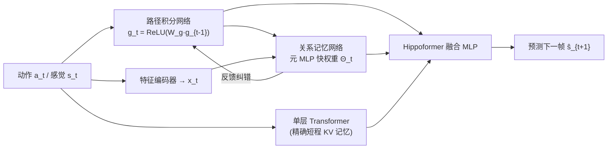

# Hippoformer: Integrating Hippocampus-inspired Spatial Memory with Transformers

**会议**: ICLR 2026  
**OpenReview**: [https://openreview.net/forum?id=hxwV5EubAw](https://openreview.net/forum?id=hxwV5EubAw)  
**代码**: 待确认  
**领域**: 类脑架构 / 序列建模 / 空间记忆  
**关键词**: 海马体, 内嗅皮层, TEM, 网格细胞, 空间推理, Transformer, 测试时记忆  

## 一句话总结
本文用一个「元 MLP 快权重」关系记忆替换 TEM 里昂贵的张量积 Hebbian 记忆，得到训练高效、自发涌现网格细胞、能泛化到长序列的结构化空间记忆 mm-TEM，再把它与单层 Transformer 并联组成 Hippoformer，用结构化长程记忆补 Transformer 的精确短程记忆，在 2D/3D 预测任务上获得更强的长程泛化。

## 研究背景与动机
- **领域现状**：Transformer 把 key-value 缓存当成联想记忆，靠自注意力检索，是现代生成式 AI 的基石；近期的 Titans 等用快 MLP 权重扩大记忆容量来改善长序列建模。神经科学这边，海马-内嗅（HC-EC）系统是空间与情景记忆的核心——内侧内嗅皮层（MEC）提供基于路径积分的「结构码」，海马（HPC）把它和外侧内嗅皮层（LEC）的「感觉码」绑定，从而实现灵活的空间推理；Tolman-Eichenbaum Machine（TEM）正是把这套机制做成了可学习的统一计算框架。
- **现有痛点**：一方面，Transformer/Titans 这类记忆结构是「扁平」的，缺少内在的空间先验，难以组织经验中的「what-where」结构；另一方面，海马类模型难以接进现代深度学习——原始 TEM 用张量积 Hebbian 权重做关系记忆，生物学合理但容量受限、训练慢；TEM-t 换成 key-value + 自注意力检索后效率虽升，却又继承了 Transformer 的上下文窗口限制，且都需要繁琐的新颖度存取与超参调校；Vector-HaSH 干脆不可微。
- **核心矛盾**：扩大记忆容量却忽略其**底层空间结构**是低效的；而生物学上优雅的结构化记忆又**无法规模化、无法可微地嵌入**现代架构——「结构先验」与「可扩展性 / 可微性」之间存在张力。
- **本文目标**：造一个既保留海马网格类结构先验、又训练高效可微、还能无缝接入 Transformer 的空间记忆模块，并验证它在长序列、大环境、多步预测下的泛化优势。
- **核心 idea**：**【用快权重重写关系记忆】** 把 TEM 的 Hebbian 张量积换成一个「在线最小化重构损失、用预测误差驱动更新与遗忘」的元 MLP（mm-TEM）；**【双记忆并联】** 再把它和单层 Transformer 并联（Hippoformer），让一个管结构化长程抽象、一个管精确短程记忆，分工互补。

## 方法详解

### 整体框架
mm-TEM 沿用 TEM 的两模块骨架：**路径积分网络**根据动作 $a_t$ 递推出结构码 $g_t$（对应 MEC 网格系统），**关系记忆网络**把 $g_t$ 与感觉码 $x_t$ 绑成联合表示并支持双向检索（对应 HPC 的结合编码）。关键替换在于关系记忆——用一个带分层快权重 $\Theta_t$ 的元 MLP 在线存取，而非张量积 Hebbian 权重。Hippoformer 则在此之上把 mm-TEM 与一层 Transformer **并联**：两者各自处理输入嵌入，输出拼接后由一个 MLP 融合。

### 关键设计

**1. 路径积分网络：把动作变成结构码递推** 受 MEC 网格系统启发，网络把动作 $a_t$ 经两层 ReLU MLP $f_g$ 映射成一个变换矩阵 $W^g_t=f_g(a_t)$，再用它递推结构码 $\tilde g_t=\mathrm{ReLU}(W^g_t g_{t-1})$ 并做 $\ell_2$ 归一化 $g_t=\tilde g_t/\lVert\tilde g_t\rVert_2$ 保持单位向量。这样把「上+下+左+右=0」这类空间一致性规则隐式编码进递推过程，结构码因此能在不同环境间复用、支持组合泛化——也正是网格类周期表示能涌现的地方。

**2. 元 MLP 关系记忆：用在线重构损失替代 Hebbian 记忆** 关系网络先把联合表示 $m_t=[g_t,x_t]$ 投影成 $k_t,v_t,q_t$，然后不直接存 $m_t$，而是让元 MLP 在线学会把 key 关联到 value，即最小化 $\mathcal L(k_t,v_t;\Theta_t)=\lVert f_{\mathrm{MLP}}(k_t;\Theta_t)-v_t\rVert_2^2$。快权重的更新带「遗忘 + 动量 + 误差驱动」三件套：$\Theta_t=(1-\alpha_t)\Theta_{t-1}+H_t$，其中 $H_t=\eta_t H_{t-1}-\beta_t\nabla_\Theta\mathcal L(k_t,v_t;H_{t-1})$。$\alpha_t$ 是数据相关的遗忘门（衰减不相关记忆腾出容量），$\nabla_\Theta\mathcal L$ 让只有「出乎意料」的输入才驱动更新（对应海马优先存储新异刺激），$\eta_t$ 是平滑预测误差的动量、$\beta_t$ 是学习率，三者都由 $m_t$ 经 sigmoid 投影得到。检索时 $q_t$ 经 $f_{\mathrm{MLP}}(q_t;\Theta_t)$ 取回联合重构 $\hat m_t=[\hat g_t;\hat x_t]$。这把 TEM 里复杂的记忆管理变成了一组可微的、测试时自适应的更新规则。

**3. 三路辅助关系损失：逼出真正的结构-感觉绑定** 为了让记忆学到「结构↔感觉」的真绑定而非死记硬背，作者加了三个掩码重构约束：仅给感觉码反推结构码 $\mathcal L_{x2g}=\lVert\hat g_t-g_t\rVert_2^2$、仅给结构码自重构 $\mathcal L_{g2g}=\lVert\bar g_t-g_t\rVert_2^2$、仅给结构码推感觉码 $\mathcal L_{g2x}=\lVert\hat x_t-x_t\rVert_2^2$。由于 $\mathcal L_{g2x}$ 已被主预测目标覆盖，可吸收掉，关系损失简化为 $\mathcal L_{rel}=\mathcal L_{x2g}+\mathcal L_{g2g}$。消融显示去掉任一项都会显著掉泛化，去掉全部则严重退化——这是 mm-TEM 能「理解空间结构」而非记忆的关键。

**4. mm-TEM 与 Transformer 的双记忆并联（Hippoformer）** 从记忆视角看，限定窗口的 Transformer 是靠精确 KV 缓存的「精确短程记忆」，mm-TEM 是「结构化但不那么精确的长程记忆」。Hippoformer 把二者并联：Transformer 这边不接路径积分输出 $g_t$，而是用单层 MLP 生成动作嵌入，与 $a_t,s_t$ 拼接作输入；两支输出拼接后由 MLP 融合。此外还有一个超参 $m_b$ 控制元 MLP 的更新频率——$m_b$ 越大更新越稀疏、训练越高效，但也把 mm-TEM 推向长程预测、牺牲短程精度，而短程的损失恰好由 Transformer 分支补上。

## 实验关键数据

### 主实验表格（3D 空旷环境预测，误差单位 1e-3，越低越好）

| 模型 | 1-step Full | 1-step Visible | 1-step Not Visible | m-step Full | m-step Visible | m-step Not Visible |
|---|---|---|---|---|---|---|
| Transformer | 1.29 | 0.67 | 2.15 | 36.13 | 11.49 | 38.07 |
| Titans | 1.32 | 0.69 | 2.20 | 33.42 | 10.60 | 35.21 |
| mm-TEM | 5.10 | 4.23 | 6.53 | 14.30 | 13.23 | 14.40 |
| **Hippoformer** | **1.27** | **0.67** | **2.09** | **9.71** | **2.72** | **10.27** |

单步预测 Hippoformer 略优于 Transformer/Titans，多步想象（imagination）则**大幅领先**：基线在 36–56 步出现误差震荡堆积，Hippoformer 保持连贯。

### 消融实验（2D 网格预测的辅助关系损失，Fig. 3C）

| 变体 | 效果 |
|---|---|
| 完整 mm-TEM | 长程泛化最好 |
| w/o $\mathcal L_{g2g}$ | 泛化显著下降 |
| w/o $\mathcal L_{s2g}$ | 泛化显著下降 |
| w/o rel（全去） | 严重退化 |

### 关键发现
- **训练效率**：mm-TEM 仅 5,000 梯度步即达近 90% 测试准确率，而 TEM 训练 20,000 步才约 60%。
- **长序列泛化**：1-step 预测中，Transformer/Titans 一旦上下文超过 128 步训练窗口就迅速崩溃，mm-TEM 在 4096 步仍保持约 40% 准确率。
- **分布偏移鲁棒**：圆形网格逆时针条件下 mm-TEM >90%，基线掉最多 30%；环境从 7×7 放大到 15×15 不再训练，mm-TEM 衰减最慢。
- **网格涌现与机制**：路径积分网络自发出现周期网格表示，网格尺度由更新频率 $m_b$ 调制（$m_b$ 越大网格越粗），首次在实现层把「网格尺度多样性」与「多时间尺度预测」联系起来；网格分数与多步预测准确率正相关（$r=0.647,p=0.0002$）。
- **网格质量≠唯一通路**：少数网格分数较低的模型仍取得较高准确率，可视化显示它们发展出「另类但仍规则」的表示，区别于既低分又低准确率模型的无结构散乱模式——说明强网格细胞是有效结构学习的一种体现，但不是唯一充分条件。
- **Hippoformer 的短长互补**：单独 $m_b=8$ 的 mm-TEM 在短上下文下单步预测偏弱（缺近期信息），并联 Transformer 后短/长上下文都拿到；而多步想象主要由 mm-TEM 分支决定，两模型差异不显著。

## 亮点与洞察
- **把「测试时学习」用对了地方**：Titans 式快权重原本用来扩容量，本文把它接到 HC-EC 的结构-感觉绑定上，既解决了 TEM 张量积的容量/效率瓶颈，又保留了可微性，是个干净的「用机器学习机制实现神经科学先验」的范例。
- **网格尺度 = 预测时域**：$m_b$ 越大→有效预测时域越长→网格越粗，这个在实现层涌现的关系，给了「腹背侧海马轴上网格尺度梯度」一个可计算的解释口子（不需要预设多尺度位置场）。
- **分工的双记忆很说明问题**：短程靠 Transformer 的精确 KV、长程靠 mm-TEM 的结构抽象，二者并联后单步和多步都拿到，验证了「记忆要带结构」而非一味扩容。
- **抽象 vs 记忆的协同**：传统 TEM/TEM-t 偏记忆存储与基于记忆的推理，mm-TEM 用参数化关系记忆迈向「抽象」，Hippoformer 把 Transformer 的短程记忆与 mm-TEM 的长程抽象合到一起，在 3D 任务上对「可见帧（靠记忆）」与「不可见帧（靠抽象）」都给出更低误差。

## 局限与展望
- **集成方式过于朴素**：Hippoformer 目前只是 Transformer 与 mm-TEM 的「直接并联」，没有探索更深的耦合方式。
- **单层、未规模化**：当前是单层设计，没有用上 LLM 已证关键的模型/计算规模化；多层堆叠与 scaling 效果未知。
- **任务仍偏受控**：评测集中在 2D 网格与 3D 空旷环境的预测任务，距离真实复杂时空任务仍有距离。
- **$m_b$ 的折中尚需自适应**：更新频率 $m_b$ 在「训练效率/长程偏好」与「短程精度」间是手工折中，目前靠 Transformer 分支兜底，缺乏端到端自适应调度。
- **作者展望**：研究更高效的集成方案与多层扩展，把 mm-TEM 当成大系统的可扩展基础模块；其简洁性也可能支撑海马的分层模型，为腹背侧表示梯度如何产生功能分化提供计算抓手。

## 相关工作与启发
- **HC-EC 计算模型谱系**：CSCG、Vector-HaSH、TEM、TEM-t 概念优雅但难规模化——TEM 张量积昂贵、TEM-t 受窗口限制且记忆管理复杂、Vector-HaSH 不可微；mm-TEM 用分层 MLP 关系记忆 + 辅助关系损失补齐了「可微 + 可扩展」。
- **长序列建模**：Mamba、Titans、Gated DeltaNet 通过结构化初始化 / 分层 MLP 记忆 / 新颖度 Hebbian 推进长序列，但都把记忆当扁平容量扩充；本文强调真实信息是时空结构化的，给长序列记忆引入空间先验。
- **网格尺度起源理论**：Waniek、Stachenfeld、Dordek 等从多尺度预测/位置场基函数解析推导网格尺度；mm-TEM 不预设多尺度结构，仅靠调更新频率就端到端涌现出多尺度网格，把这些理论搬到了更复杂任务里可检验。
- **生物机制启示**：作者进一步推测，记忆更新频率本身可能对应腹背侧海马轴上的振荡频率梯度或受体表达梯度，为「不同网格尺度的生物物理来源」提供了一个可计算的新假说。
- **对基础架构的意义**：把结构化空间记忆当成基础架构的「积木」而非外挂模块，与 Mamba/Titans 这条「重设计记忆」的主线呼应，但额外强调了空间结构先验对长程时空建模的价值。

## 评分
- **新颖性**: ⭐⭐⭐⭐ 把 Titans 式测试时快权重嫁接到 TEM 关系记忆、并联 Transformer 组双记忆系统，且发现网格尺度受更新频率调制——交叉得很巧。
- **实验充分度**: ⭐⭐⭐ 2D/3D、长序列、大环境、分布偏移、消融、网格-准确率相关性都覆盖了，但都是受控合成任务，缺真实大规模基准。
- **写作质量**: ⭐⭐⭐⭐ 神经科学动机与方法对应清晰，公式与图配合到位，叙述连贯。
- **价值**: ⭐⭐⭐⭐ 给「把结构化空间记忆嵌入基础架构」提供了可微、可扩展的初步路径，对类脑序列建模与空间智能方向有启发，但工程成熟度与规模化仍待证。

<!-- RELATED:START -->

## 相关论文

- [\[ICLR 2026\] The Counting Power of Transformers](the_counting_power_of_transformers.md)
- [\[ECCV 2024\] SpatialFormer: Towards Generalizable Vision Transformers with Explicit Spatial Understanding](../../ECCV2024/others/spatialformer_towards_generalizable_vision_transformers_with_explicit_spatial_un.md)
- [\[ICML 2026\] Spatial Priors via Space Filling Curves for Small and Limited Data Vision Transformers](../../ICML2026/others/spatial_priors_via_space_filling_curves_for_small_and_limited_data_vision_transf.md)
- [\[ICLR 2026\] Neural Dynamics Self-Attention for Spiking Transformers](neural_dynamics_self-attention_for_spiking_transformers.md)
- [\[ICLR 2026\] HippoTune: A Hippocampal Associative Loop–Inspired Fine-Tuning Method for Continual Learning](hippotune_a_hippocampal_associative_loopinspired_fine-tuning_method_for_continua.md)

<!-- RELATED:END -->
