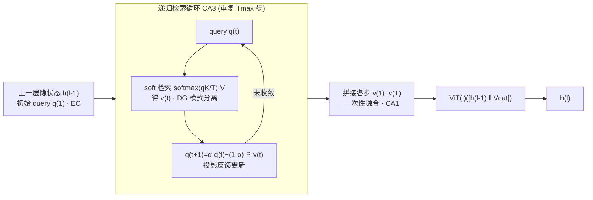

# HippoTune: A Hippocampal Associative Loop–Inspired Fine-Tuning Method for Continual Learning

**会议**: ICLR 2026  
**OpenReview**: [https://openreview.net/forum?id=MtDiLnnYgm](https://openreview.net/forum?id=MtDiLnnYgm)  
**代码**: [https://github.com/yan4xi1/HippoTune](https://github.com/yan4xi1/HippoTune)  
**领域**: 持续学习 / 参数高效微调 / 类脑启发  
**关键词**: Continual Learning, PEFT, 海马环路, 迭代检索, Krylov 子空间, 二阶预条件  

## 一句话总结
HippoTune 把"提示池单步检索"升级为模仿海马 EC–DG–CA3–CA1 环路的**层内迭代式潜空间检索循环**，用几轮"查询—检索—反馈"深度激活旧任务记忆，在仅约一半 FLOPs 下把 buffer-free PEFT-CL 的精度提升 5–8%。

## 研究背景与动机
- **领域现状**：持续学习里，PEFT-CL（L2P、DualPrompt、CODA-Prompt 等）冻结骨干、只插入少量可训练模块，靠维护一个"参数池/提示池"在推理时用样本表征做 query 检索并激活子模块，既省算力又抗遗忘，已成为主流路线。
- **现有痛点**：这些方法本质上都是**单步检索**——一次性用 query 选出一组提示就结束。单步检索对旧任务记忆"激活不足"，且为了拿到高层语义 query 往往要先跑一遍完整骨干前向，带来额外延迟。
- **核心矛盾**：人脑在执行已学任务时会做**多轮联想回忆**（稀疏线索 → 海马环路反复补全），从而更充分地重新激活历史知识；而现有方法只做"一锤子买卖"，无法在不重复构造高层特征的情况下深化检索。
- **本文目标**：在不增加骨干前向、不依赖 replay buffer、严格算力预算下，把检索"深度"做成可微、可控的过程，更彻底地唤醒旧任务记忆。
- **核心 idea**：**【类脑迭代检索】** 受 EC–DG–CA3–CA1 环路的模式分离/补全/整合机制启发，在每个 Transformer 层内嵌入一个轻量"查询—软检索—投影反馈"的联想循环（称为 Latent Deliberation），并在理论上证明这等价于**【Krylov 二阶预条件】**——多步迭代实现了对逆 Hessian 的多项式逼近。

## 方法详解

### 整体框架
HippoTune 先把所有 PEFT 模块统一成一个共享检索池（带可学习 key 矩阵），在每个 Transformer 层内把标准前向扩展成一个**可控的迭代联想循环**：以上一层隐状态作为初始 query，做几轮 soft key–value 检索并把检索结果投影反馈回 query，直到收敛或达到最大步数，最后把各步检索向量一次性融合送入 ViT block 输出。整个过程对应海马 EC（种子查询）→ DG（模式分离）→ CA3（递归补全）→ CA1（整合融合）四个阶段，端到端用分类+正交+熵三项损失训练，并用截断 BPTT 对齐训练与推理预算。

### 关键设计

**1. PEFT-CL 统一检索视角：把"提示池"抽象成 key–value 检索。** 作者把所有轻量模块收进一个池 $V=\{\theta^{(1)},\dots,\theta^{(m)}\}$，配一个可学习 key 矩阵 $K\in\mathbb{R}^{m\times d}$，给定冻结骨干隐状态 $x$ 算路由分数 $s=xK^\top/\tau$、$g=\mathrm{softmax}(s)$，再把各模块残差 $\Delta h^{(i)}=\phi(x;\theta^{(i)})$ 按权重混合更新 $h\leftarrow h+g^\top\Delta H$。这个统一形式把 L2P/DualPrompt/CODA-Prompt 都归约为"单步检索"特例，从而点明三件事：query 成本（用高层特征当 query 要额外算力）、检索深度（现有方法只检索一次，天然可以做深）、key-gating 设计（温度/Top-k/熵决定哪些模块被激活）。这一抽象正是后续"把检索做深"的出发点。

**2. Latent Deliberation：层内可微迭代检索循环。** 以上一层隐状态作初始 query $q^{(1)}=h^{(l-1)}$，每层维护 key/value 矩阵 $K^{(l)},V^{(l)}$ 编码旧任务子空间。第 $t$ 步软检索 $S^{(t)}=\mathrm{softmax}(q^{(t)}K^{(l)\top}/T)$、$v^{(t)}=S^{(t)}V^{(l)}$（温度 $T$ 调检索锐度，可选 Top-k 稀疏），再用层专属线性变换 $P^{(l)}$ 把检索结果反馈进 query：$q^{(t+1)}=\alpha q^{(t)}+(1-\alpha)P^{(l)}v^{(t)}$，当 $\|v^{(t)}-v^{(t-1)}\|_2<\varepsilon$ 或 $t=T_{\max}$ 时停。这对应 CA3 的自联想递归补全。为避免每步检索后重跑前向，采用**一次性融合**：把各步检索向量沿特征维拼接 $V_{cat}=v^{(1)}\|\cdots\|v^{(T)}$，与 $h^{(l-1)}$ 一起送进 ViT block：$h^{(l)}=\mathrm{ViT}^{(l)}(h^{(l-1)}\|V_{cat})$，对应 CA1 的整合。推理时通过 $T_{\max}$、$\varepsilon$、Top-k 显式调节检索质量与效率的权衡。

**3. Krylov 子空间预条件理论：多步迭代 ≈ 隐式二阶校正。** 作者把单层递归抽象成对光滑势函数的梯度下降 $q^{(t+1)}=q^{(t)}-\eta\nabla\phi(q^{(t)})$，证明在不动点附近、当 $\rho(I-\eta H)<1$ 时，$T_{\max}$ 步后对参数的梯度领项为 $\sum_{k=0}^{T_{\max}-1}(J^\top)^k\hat\theta=\mathcal{K}_{T_{\max}}(H)\hat\theta$，其中 $J=I-\eta H$。当 $T_{\max}\to\infty$ 时 Neumann 级数收敛到 $H^{-1}$，即迭代隐式实现了对逆 Hessian 的多项式逼近——一个**可微的二阶预条件器**，无需显式计算或存储二阶信息。推论指出有限步即有效：$T_{\max}=2\sim4$ 已能以线性代价拿到有效的二阶校正，这把"思考/检索越久旧任务越好"的直觉量化成关于步数、温度、熵正则的可调收敛/稳定性准则。

**4. 端到端三项损失 + 截断 BPTT。** 训练目标 $L=L_{cls}+\lambda_{orth}L_{orth}+\lambda_{ent}L_{ent}$：分类交叉熵 $L_{cls}$ 监督下游性能；正交正则 $L_{orth}=\sum_l\|K^{(l)\top}K^{(l)}-I\|_F^2$ 鼓励 key 正交、减少记忆干扰；熵正则 $L_{ent}=-\sum_l\sum_t\sum_i S_i^{(t)}\log S_i^{(t)}$ 控制检索权重的锐度与鲁棒。训练用截断 BPTT 只回传循环最后几步的梯度，使训练预算与推理动态预算（$T_{\max}$、Top-k）对齐，保证训练-部署一致性。

## 实验关键数据

### 主实验表格
ViT-Base/16 骨干，三个视觉持续学习基准（10 子任务，类增量），buffer-free 设置：

| 方法 | GFLOPs | Seq-CIFAR100 Acc/AAA | Seq-ImageNet-R Acc/AAA | Seq-CUB200 Acc/AAA |
|------|--------|------|------|------|
| DER++（带 buffer） | 16.88 | 84.50/90.16 | 54.21/65.26 | 77.42/83.61 |
| L2P | 35.20 | 82.76/88.48 | 71.26/76.13 | 68.39/78.29 |
| CODA-Prompt | 35.84 | 86.28/91.05 | 74.05/78.14 | 72.45/78.94 |
| HiDe-Prompt | 35.25 | **88.25/92.69** | 74.65/78.46 | **84.27/88.64** |
| **HippoTune** | **16.92** | 87.65/92.07 | **74.85/79.92** | 81.12/86.63 |

- 仅用约一半 FLOPs（16.92 vs ~35），HippoTune 在 Seq-ImageNet-R 上 Acc/AAA 全面最高，且超过算力翻倍的 HiDe-Prompt。
- 在 ImageNet-R 不同任务数（N=5/10/20）下，HippoTune 在 N=5（77.16/81.04）和 N=20（74.06/79.33）均领先所有 baseline，任务越多优势越稳。
- 训练时间在同硬件下平均缩短约 30%。

### 消融实验表格
Latent Deliberation 各组件移除（Acc/AAA）：

| 变体 | Seq-CIFAR100 | Seq-ImageNet-R |
|------|------|------|
| Full Method | 87.65/92.07 | 74.85/79.92 |
| w/o 迭代检索 (Tmax=1) | 86.51/90.63 | 72.89/78.10 |
| w/o 正交正则 | 87.32/91.87 | 74.09/78.77 |
| w/o 熵正则 | 87.43/91.30 | 74.67/79.55 |
| w/o 融合(仅末步) | 87.27/91.28 | — |

### 关键发现
- **迭代检索是核心**：退化成单步（Tmax=1）在 Seq-ImageNet-R 上掉到 72.89/78.10，下降最显著，证明多步检索对整合历史信息、抗遗忘至关重要。
- **正交正则在难域更关键**：去掉它在复杂的 Seq-ImageNet-R 上 AAA 掉约 1.2 点，说明保持检索向量多样性对充分利用旧知识很重要。
- **熵正则/融合策略是辅助**：去掉后影响 <0.6 点，主要起稳定与微调作用，可在资源/推理敏感场景灵活裁剪。
- **超参规律**：$T_{\max}\approx4$ 最优（太少/太多都退化），温度中间档（$10^{-1}$）最好，PEFT 插入浅+中层（1–7）优于纯浅/中/深，印证多层级记忆。

## 亮点与洞察
- **"把检索做深"这一抽象本身很有价值**：作者先证明现有提示池方法都是单步检索特例，再自然推出"迭代深化"，让方法动机清晰、可解释。
- **类脑映射 + 理论双锚定**：不是空谈 EC–DG–CA3–CA1 类比，而是把循环严格对上 Krylov 多项式逼近逆 Hessian，给"多轮联想"提供了二阶优化的数学解释。
- **效率优势真实**：迭代循环直觉上更贵，但通过潜空间内操作+一次性融合，反而只用一半 FLOPs，并通过 $T_{\max}/\varepsilon$/Top-k 提供了清晰的推理预算旋钮。

## 局限与展望
- **仅在视觉分类基准验证**：三个基准都是 ViT 图像类增量，未涉及 NLP/多模态/大模型 LoRA 场景，类脑环路在文本任务上的迁移性待证。
- **未直接对比记忆开销**：虽强调 buffer-free，但参数池规模、key/value 矩阵随任务增长的成本未充分讨论。
- **理论与实践有缝隙**：Krylov 分析建立在不动点附近、Hessian 正定且谱半径 <1 的假设上，实际训练是否满足、$\alpha/T$ 如何影响收敛仍偏经验。
- **相比最强 baseline 仍有取舍**：在 CIFAR100/CUB200 上略逊 HiDe-Prompt，作者归因于后者算力更高、提示设计更复杂——即"省一半算力"换来的是部分基准上的小幅让步。

## 相关工作与启发
- **PEFT-CL 提示池路线**：L2P / DualPrompt / CODA-Prompt 用可学习提示池 + key-query 检索选模块；LAE、HiDe、MoE-Adapter 进一步用动态扩展、模块合并、专家路由提升适应性。HippoTune 把它们统一为单步检索并做深。
- **海马—新皮层启发的持续学习**：CLS 理论、FearNet、CLS-ER、Triple Memory Networks、GATE 等用短/长期记忆模块平衡可塑性与稳定性，但多依赖 replay、架构复杂、少用于 PEFT。本文做的是 PEFT 范式下对海马联想记忆的细粒度模拟。
- **启发**：把"单步检索→多步可微迭代"的思路可迁移到 RAG、MoE 路由、prompt 选择等任何"一次性 query 选模块"的场景；而"递归 ≈ 隐式二阶预条件"的视角，也为深度均衡/迭代推理类模型提供了优化层面的解释工具。

## 评分
- **新颖性**: ⭐⭐⭐⭐ — "把提示池单步检索统一并做成层内迭代联想循环"思路新颖，且用 Krylov 二阶预条件理论把类脑直觉数学化，远超普通类比型工作。
- **实验充分度**: ⭐⭐⭐ — 三基准 + 多任务数 + 完整组件消融 + 超参分析较扎实，但局限在视觉分类、未触及 NLP/大模型，记忆开销对比也偏弱。
- **写作质量**: ⭐⭐⭐⭐ — 动机递进清晰（统一视角→做深→理论→实验），图示和海马环路映射讲得明白，公式与伪代码完整。
- **价值**: ⭐⭐⭐⭐ — 在严格算力预算下用一半 FLOPs 拿到 5–8% 提升，对资源受限持续学习有实用价值，统一检索视角对后续工作有方法论启发。

<!-- RELATED:START -->

## 相关论文

- [\[ICLR 2026\] Deploying Models to Non-participating Clients in Federated Learning without Fine-tuning: A Hypernetwork-based Approach](deploying_models_to_non-participating_clients_in_federated_learning_without_fine.md)
- [\[ICLR 2026\] Forget Forgetting: Continual Learning in a World of Abundant Memory](forget_forgetting_continual_learning_in_a_world_of_abundant_memory.md)
- [\[ICML 2026\] Continual Learning of Domain-Invariant Representations](../../ICML2026/others/continual_learning_of_domain-invariant_representations.md)
- [\[ICLR 2026\] Hippoformer: Integrating Hippocampus-inspired Spatial Memory with Transformers](hippoformer_integrating_hippocampus-inspired_spatial_memory_with_transformers.md)
- [\[ACL 2025\] Intuitive Fine-Tuning: Towards Simplifying Alignment into a Single Process](../../ACL2025/others/intuitive_fine_tuning.md)

<!-- RELATED:END -->
