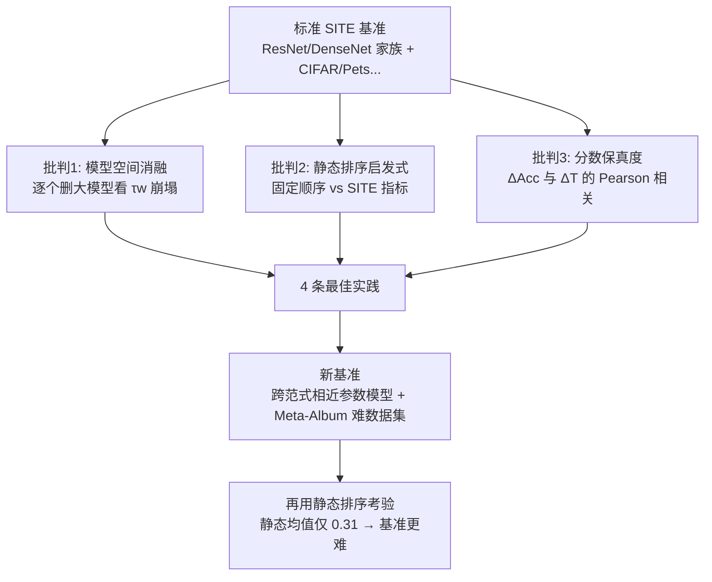

# How NOT to benchmark your SITE metric: Beyond Static Leaderboards and Towards Realistic Evaluation

**会议**: ICLR 2026  
**OpenReview**: [https://openreview.net/forum?id=ZHKVPkJMSI](https://openreview.net/forum?id=ZHKVPkJMSI)  
**代码**: 随补充材料提供（含复现脚本与 Jupyter notebook）  
**领域**: 迁移性评估 / 模型选择 / 基准方法学  
**关键词**: 可迁移性估计, SITE, 模型选择, 基准批判, 加权 Kendall's Tau, 静态排序  

## 一句话总结
本文用实证方法揭穿了"源无关可迁移性估计（SITE）"领域所依赖的标准基准的三大根本缺陷——不真实的模型空间、被静态排序就能刷爆的榜单、以及与真实精度差无关的分数刻度——并证明一个完全不看数据的静态启发式排序就能碾压所有精巧的 SITE 指标，进而给出构建更真实基准的最佳实践与一套新基准。

## 研究背景与动机

**领域现状**：用 ImageNet 这类大数据集预训练的模型已是深度学习标配，但不同架构/权重/源数据下迁移收益差异巨大，于是出现"预训练模型选择"问题。源无关可迁移性估计（Source Independent Transferability Estimation, SITE）就是要在**不微调、也不访问源数据集**的前提下，给模型库里每个候选模型算一个廉价分数 $T_m$，按预测的下游表现排序。这个方向近年在 ICML/NeurIPS/CVPR 高速产出，涌现了 LogME、TransRate、SFDA、ETran、NLEEP、H-Score、GBC 等一大批指标。

**现有痛点**：所有这些指标的"进步"几乎都靠同一套标准基准来衡量——固定的一池子 CNN（ResNet34/50/101/152、DenseNet121/169/201、MobileNet、Inceptionv3、MNASNet、GoogleNet）在 CIFAR10/100、Pets、Aircraft、Food、DTD 上微调，用加权 Kendall's Tau（$\tau_w$）衡量预测排序与真实微调精度排序的相关性。但这套基准本身从没被认真审视过。

**核心矛盾**：该基准的模型池由"同一架构家族的大小变体"主导（一堆不同大小的 ResNet/DenseNet）。而大模型可预测地优于浅模型——于是"选最好模型"这个本应复杂的任务，退化成了"识别出最大的那个模型"。这意味着指标刷出来的高分可能根本不是真本事。

**本文目标**：不为某个 SITE 指标背书或推荐"何时用谁"，而是**批判基准本身**，证明现有评测协议与真实世界模型选择严重脱节，并给出可操作的基准构建准则。

**核心 idea**：**(1) 证伪现有基准**——同时用"模型消融""静态排序启发式""分数保真度"三把刀实证地戳穿基准；**(2) 立靶子重建**——提出 4 条最佳实践 + 一套基于 Meta-Album 的更难基准，让连静态排序都刷不动。

## 方法详解

### 整体框架
本文不是提新指标，而是一套"先证伪、后重建"的基准方法学。第一阶段对标准基准发起三条独立的实证批判（模型空间不真实 / 被静态排序攻破 / 分数刻度无意义），每条都配一个可量化的验证实验；第二阶段把批判转化为 4 条最佳实践，并据此搭建一套用相近参数量、跨架构范式的模型 + Meta-Album 难数据集组成的新基准，再次用静态排序去考验它。

### 关键设计

**1. 批判一·模型空间消融：揭穿"选最大模型"的伪任务。** 作者主张标准模型池不真实——它被 ResNet 和 DenseNet 两个家族的不同尺寸变体主导，而实践者真正关心的是"在某种尺寸/速度/可得性约束下哪个架构更好"，不是"用大点还是小点的 ResNet"。为验证脆弱性，他们从过度代表的家族里**逐步删除最大的变体**（ResNet-152、ResNet-101、DenseNet-201、DenseNet-169），把 11 个模型砍到每家族只留 1 个、共 7 个，再重算 $\tau_w$。结果是几乎所有指标在消融后 $\tau_w$ 急剧下跌：除 DTD 和 Pets 外，去掉超大模型后所有指标都掉到 0.6 以下；对每个指标，都能找到某个数据集，删一个模型就让性能陡降。结论锋利——现有指标的高分是"脆弱且高度依赖于在一个有缺陷的基准里正确排好几个被过度代表的大模型"。

**2. 批判二·静态排序启发式：一个不看数据的固定顺序碾压所有指标。** 由于模型间存在依赖（同架构大小变体）且数据集缺乏多样性，榜单变成"静态"的——少数高容量模型（如 ResNet-152）不管什么目标数据集都霸榜（10 个数据集里 8 个第一名是 ResNet-152，第二名永远落在前 3 名模型里）。作者据此构造一个**完全数据无关的静态排序器**，仅按模型大小并在 ResNet/DenseNet 间交替排出固定序列：

$$\text{ResNet-152} \succ \text{DenseNet-201} \succ \text{ResNet-101} \succ \text{DenseNet-169} \succ \text{ResNet-50} \succ \cdots \succ \text{MNASNet}$$

这个排序器不计算任何特征、不看任何任务信息，却在标准基准的**每个数据集上都取得最高 $\tau_w$**，平均 $\tau_w=0.91$，而最好的 SITE 指标 LogME 仅 0.57。这直接说明标准基准奖励的是"记住一个固定模型层级"，而非真正的任务相关迁移性估计。

**3. 批判三·分数保真度：分数差与精度差脱钩。** 一个实用指标不仅要排序对，分数的**幅度**也该有意义——分数差大就该对应精度差大，用户才能判断"选高分模型值不值这份算力"。作者把这一性质形式化为"对精度差的保真度"：对模型空间里任意四个模型 $A,B,C,D$，理想指标应满足

$$\Delta\mathrm{Acc}(A,B;D) > \Delta\mathrm{Acc}(C,D;D) \implies \Delta T(A,B) > \Delta T(C,D)$$

其中 $\Delta\mathrm{Acc}(X,Y;D)=\mathrm{Acc}(X,D)-\mathrm{Acc}(Y,D)$、$\Delta T(X,Y)=T(X)-T(Y)$。他们对每个指标/数据集计算全部 $\{\Delta\mathrm{Acc}\}$ 与 $\{\Delta T\}$ 配对的 Pearson 相关，发现几乎所有指标相关性都很弱：例如 Pets 上 LogME 分数差 0.09 既可能对应 2.5% 的精度差、也可能只对应 0.5%。分数与性能间缺乏可靠映射，使这些指标对真正要做决策的终端用户几乎没有实用价值。

**4. 重建·四条最佳实践 + 新基准：让静态排序也刷不动。** 把批判落地为可执行准则：**(BP1)** 公开指标的代码、数据链接、分数与最终精度、所用预训练模型，保证可复现；**(BP2)** 构造多样且非平凡的模型空间——跨 CNN（ConvNeXt）/ ViT（ViT、Swin）/ MLP（MLP-Mixer）等不同范式，并按参数量/FLOPs/速度等实践约束让模型**尺寸相近**，迫使指标真正判断"哪种架构归纳偏置适合此任务"而非套用缩放律；**(BP3)** 数据集要有难度 headroom（避免接近 100% 饱和的数据集）和领域多样性（细粒度、医学、卫星、纹理、非网络爬取数据）；**(BP4)** 工程化"性能分散度与排名离散度"，让不同架构在不同数据集上各擅胜场，打破静态榜单。据此他们搭出新基准——模型用 Twins-SVT、XCiT、CoaT、DeiT、MaxViT、MViT v2（参数相近、互不为直接升级版），数据集从 Meta-Album 的 30 个里挑出不会被多模型刷到近 100% 的 15 个（Sports、PlantVillage、RESISC、Insects、PanNuke、Fungi、RSD、Boats、PlantDoc、Stanford Actions、DTD、PRTA、SPIPOLL、MPII、Dogs）。在这套新基准上，静态排序器只剩 $\tau_w\in[-0.3,0.77]$、均值 0.31，说明基准确实变难、不再被记忆性排序攻破。

## 实验关键数据

### 主实验：标准基准上静态排序 vs SITE 指标（加权 Kendall's $\tau_w$）

| Dataset | GBC | TransRate | SFDA | H-Score | NLEEP | LogME | **Static Ranking** |
|---|---|---|---|---|---|---|---|
| Aircraft | -0.12 | 0.14 | -0.22 | 0.60 | -0.51 | 0.41 | **0.84** |
| CIFAR10 | -0.02 | 0.51 | 0.85 | 0.91 | 0.76 | 0.85 | **0.91** |
| CIFAR100 | 0.09 | 0.20 | 0.79 | 0.80 | 0.84 | 0.72 | **0.98** |
| DTD | 0.14 | 0.20 | 0.63 | 0.04 | 0.70 | 0.66 | **0.99** |
| Food | 0.10 | -0.05 | 0.30 | 0.59 | 0.69 | 0.39 | **0.80** |
| Pets | -0.15 | 0.17 | 0.34 | 0.37 | 0.84 | 0.41 | **0.94** |
| **Average** | 0.007 | 0.195 | 0.448 | 0.552 | 0.553 | 0.573 | **0.91** |

> 不看任何数据的静态排序在每个数据集上都最高，平均 0.91 远超最佳指标 LogME 的 0.573。

### 新基准（Meta-Album 15 数据集）上的 $\tau_w$

| Dataset | TransRate | LogME | NLEEP | SFDA | HScore | GBC | **Static** |
|---|---|---|---|---|---|---|---|
| Sports | 0.39 | 0.25 | 0.30 | 0.70 | -0.08 | 0.38 | 0.46 |
| RESISC | 0.24 | 0.11 | 0.14 | 0.76 | 0.23 | 0.36 | 0.55 |
| Dogs | -0.71 | -0.41 | -0.62 | -0.32 | -0.30 | -0.59 | -0.15 |
| DTD | -0.53 | -0.37 | -0.37 | -0.48 | -0.33 | -0.42 | 0.01 |
| Fungi | 0.44 | 0.70 | -0.22 | 0.77 | 0.40 | 0.34 | 0.77 |
| RSD | 0.02 | -0.20 | -0.34 | -0.07 | -0.06 | -0.04 | 0.60 |
| **Average** | 0.13 | 0.061 | 0.04 | 0.15 | 0.06 | 0.17 | **0.31** |

> 在新基准上，没有任何 SITE 指标能稳定表现良好（均值都 ≤0.17），而静态排序也只剩 0.31，说明基准更难、不再被记忆性排序刷爆。

### 关键发现
- **静态排序碾压一切**：标准基准平均 $\tau_w$ 静态 0.91 vs 最佳指标 0.57，证明基准奖励"记住模型层级"而非真本事。
- **指标对模型空间不鲁棒**：去掉超大模型后几乎所有指标 $\tau_w$ 掉到 0.6 以下，每个指标都能被某数据集上删一个模型搞崩。
- **分数刻度无意义**：分数差与精度差仅弱相关（如 LogME 分差 0.09 对应精度差 0.5%~2.5% 不等）。
- **问题跨领域存在**：脉冲网络（MEAF 中 SEW-ResNet-152 霸榜）、NLP（LogME 每次一个静态赢家）、目标检测（YOLOv5m 5 任务赢 4）、ViT 迁移（ViT-B 11 任务霸榜 8）都有同样毛病。

## 亮点与洞察
- **"反向最佳实践"叙事**：标题"How NOT to benchmark"本身就是一种有力的科学修辞——用一个 trivial 的静态启发式当照妖镜，比堆砌新指标更能推动领域反思。
- **三把独立的刀**：模型消融（鲁棒性）、静态排序（任务相关性）、保真度相关（分数可解释性）三个角度互补，分别击中"排序怎么来的""排序有没有用任务信息""分数能不能用来决策"。
- **可证伪性**：静态排序器是一个极其简单、可复现、无需任何训练的对照基线，任何后续 SITE 基准都该把它当作必须超越的下限。
- **跨范式相近参数量的设计哲学**：BP2/BP4 的核心是"用参数量/FLOPs 对齐来隔离架构归纳偏置"，这把"选模型"从"选规模"中解耦出来，是真正逼近实践的关键。

## 局限与展望
- **只覆盖图像分类**：批判与新基准都聚焦视觉分类，NLP、目标检测、医学图像等领域的系统化验证留作未来工作（虽已给出零散证据）。
- **未纳入微调超参/优化器的影响**：当前 SITE 指标和基准都假设固定的微调流程，而学习率、优化器、weight decay 等对最终精度影响巨大，把这些纳入迁移性预测是公开难题。
- **新基准仍是"示例"而非定论**：作者明确说自己的 15-数据集基准是抛砖引玉，鼓励社区据最佳实践继续打磨，并提议借鉴社会选择理论（social choice theory）来设计更可靠的基准聚合。
- **可迁移性"真值"本身有噪声**：用一次微调精度当 ground truth，受随机性影响，第二名差距可小至 0.2%，这本身就削弱了 $\tau_w$ 的可信度。

## 相关工作与启发
- **大规模稳定性分析**：Agostinelli et al. (2022) 用 70 万+ 实验证明指标有效性高度依赖具体场景，但其规模难以复现；本文则用轻量、可复现的批判补充之。Ibrahim et al. (2021) 指出类别不平衡下指标不稳定。
- **ImageNet 精度与迁移**：Kornblith et al. (2019) 显示 ImageNet 高精度能预测网络爬取数据集上的迁移，而 Fang et al. (2023) 证明对非爬取的真实数据集这一相关性失效——这正是本文 BP3 强调要纳入非网络数据集的依据。
- **承前**：H-Score、NCE 是该领域早期工作，LogME/TransRate/SFDA/ETran/NLEEP 等是被批判的主流指标。
- **启发**：本文是"基准批判"这一元研究范式的范本，对任何"靠固定榜单衡量进步"的子领域（不限于 SITE）都有警示意义——先问"我的榜单会不会被一个 trivial baseline 刷爆"，再谈方法创新。其附录还提供了一份受 NAS Checklist 启发的 SITE 基准与评测清单，可直接用于审稿/自查。

## 评分
- **新颖性**: ⭐⭐⭐⭐ — 不提新指标却用静态排序器这把"照妖镜"系统性证伪整个子领域的基准，视角犀利且少见；"对精度差的保真度"形式化也是有价值的新评测维度。
- **实验充分度**: ⭐⭐⭐⭐ — 三条批判各有可量化验证（消融/静态排序/保真度），覆盖 6 指标 × 6 数据集并扩展到 Meta-Album 15 数据集，还旁证了 NLP/检测/SNN/ViT 的同类问题；略受限于只在图像分类做完整实验。
- **写作质量**: ⭐⭐⭐⭐ — 结构清晰（批判→构建），论证层层递进，图表直接服务于论点；个别句子有小笔误但不影响理解。
- **价值**: ⭐⭐⭐⭐ — 对可迁移性估计社区是一记必要的警钟，提供了可操作的最佳实践、新基准与评测清单，静态排序基线应成为后续工作的标配对照。

<!-- RELATED:START -->

## 相关论文

- [\[AAAI 2026\] Think How Your Teammates Think: Active Inference Can Benefit Decentralized Execution](../../AAAI2026/others/think_how_your_teammates_think_active_inference_can_benefit_decentralized_execut.md)
- [\[ICLR 2026\] Deterministic Bounds and Random Estimates of Metric Tensors on Neuromanifolds](deterministic_bounds_and_random_estimates_of_metric_tensors_on_neuromanifolds.md)
- [\[ICML 2025\] Position: AI Evaluation Should Learn from How We Test Humans](../../ICML2025/others/position_ai_evaluation_should_learn_from_how_we_test_humans.md)
- [\[ICLR 2026\] Beyond Uniformity: Regularizing Implicit Neural Representations through a Lipschitz Lens](beyond_uniformity_regularizing_implicit_neural_representations_through_a_lipschi.md)
- [\[ICLR 2026\] The Hot Mess of AI: How Does Misalignment Scale With Model Intelligence and Task Complexity?](the_hot_mess_of_ai_how_does_misalignment_scale_with_model_intelligence_and_task_.md)

<!-- RELATED:END -->
