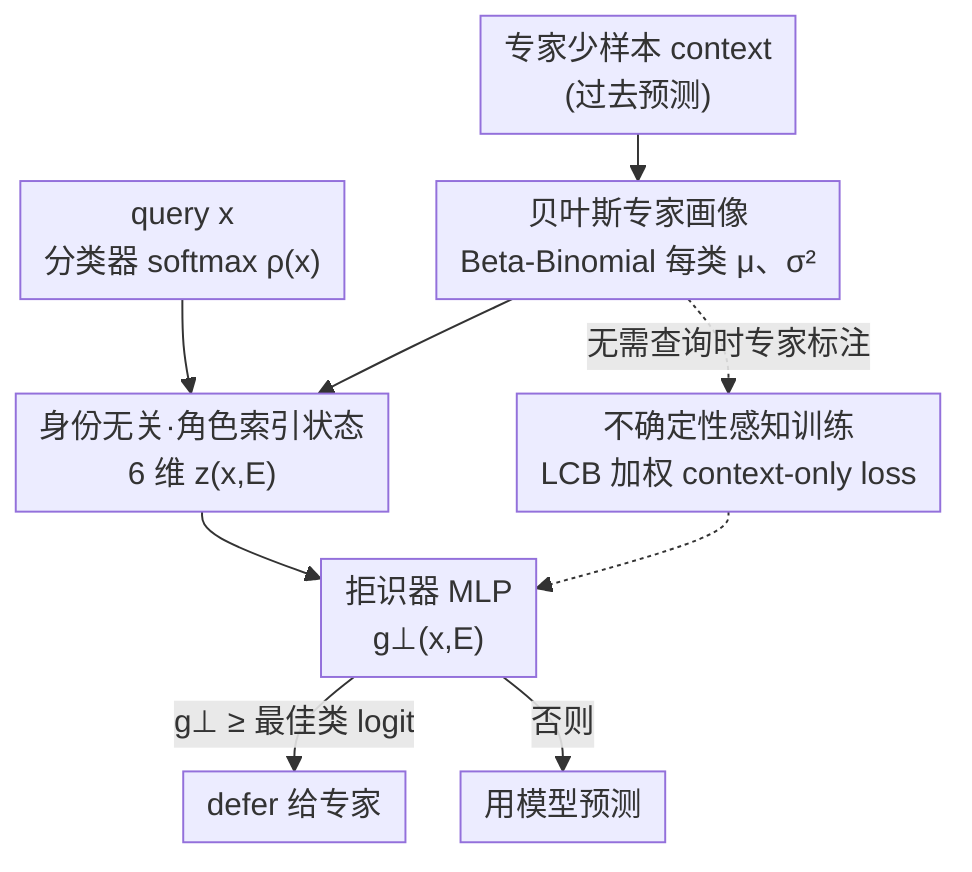

# Identity-Free Deferral For Unseen Experts

**会议**: ICLR 2026  
**OpenReview**: [https://openreview.net/forum?id=4YG9ufFg58](https://openreview.net/forum?id=4YG9ufFg58)  
**代码**: 无  
**领域**: 人机协作 / Learning to Defer  
**关键词**: 学习拒识, 人机协作, 置换不变性, 贝叶斯专家画像, OOD 泛化

## 一句话总结
本文指出现有「学习拒识」(Learning to Defer) 方法因为在固定坐标里处理按类索引的信号、学到了「认身份」的捷径，从而在面对训练时没见过、且能力分布偏移 (OOD) 的专家时崩掉；作者提出 Identity-Free Deferral (IFD)，用「角色索引」的低维状态从架构上强制置换不变性，再配一个无需查询时专家标注的不确定性感知训练目标，在医学影像与 ImageNet-16H 真人标注上对未见专家、尤其 OOD 专家显著更稳。

## 研究背景与动机
**领域现状**：Learning to Defer (L2D) 让一个 AI 系统不仅学「预测什么」，还学「什么时候该把决定让给人类专家」——同时训练一个分类器 $h$ 和一个拒识器 (rejector) $r$，$r$ 决定用模型自己的预测还是 defer 给专家，端到端优化「人 + AI」协作系统的整体准确率。这在医疗这类高风险场景里很有吸引力。

**现有痛点**：真实部署里测试时遇到的专家往往是**训练时没见过的**——医院换班、实习医生成长、不同站点习惯不同。SOTA 的 L2D-Pop (Tailor et al., 2024) 用元学习从专家过去预测的少量 context 里学一个专家表征来 condition 拒识器，对**同分布 (ID)** 的未见专家能迁移；但当未见专家是 **OOD**（能力画像系统性偏移，比如同样的专长模式但换了类别编号、或不同站点强项不同）时就会失灵。

**核心矛盾**：作者把病根诊断为一个**架构缺陷**——「身份条件化拒识」。L2D-Pop 的高容量编码器在**固定坐标**里处理按类索引的信号（per-class embedding、one-hot），等于把类别身份暴露给了拒识器，于是它能学到「如果第 3 维强就 defer」这种**捷径**。这种捷径在训练时的类别编号下工作良好，但只要把类别重命名/重排 (relabel) 就崩——而 OOD 场景里恰恰常见这种重排。问题的本质是：拒识决策**本应**对类别重排不变（给类别改个名字不该改变 defer/predict 的决定），但现有架构破坏了这个置换对称性。

**本文目标**：设计一个从构造上就尊重「相干重排 (coherent relabelling) 对称性」的拒识架构，让策略只依赖「谁更适合处理这个 case」这种可迁移的**结构信息**，而非记住绝对类别身份；同时去掉昂贵的查询时专家标注。

**切入角度**：作者先在理论上把对称性讲清——种群 Bayes 最优拒识器对相干重排是**不变**的 (Prop. 3.1)，而标准 L2D-Pop 编码器在一般参数下**不**满足这个不变性 (Thm. 3.1)，因此天然容易被 expert-only 重排攻破 (Cor. 3.1)。既然 Bayes 解本身就不变，那就应该把这个归纳偏置直接焊进架构。

**核心 idea**：在拒识器看到任何输入之前，**抹掉所有绝对身份通道**——把每个专家的能力压成一个「按角色读值」(role-indexed) 的低维状态，只保留「模型最强类的置信度」「专家在该角色上的估计能力」这类结构量，从而置换不变。

## 方法详解
### 整体框架
IFD 要解决的是「拒识器别认类别身份、只认结构」。整体管线是：给定某个专家的少样本 context（它过去的若干 (输入, 真值, 专家预测)），先用 Beta–Binomial 共轭为该专家**每个类**算一个显式的贝叶斯能力画像（均值 $\mu^E_y$ + 方差 $(\sigma^E_y)^2$）；然后把这个画像和当前 query 上分类器的 softmax 输出，按「角色」抽取成一个 6 维、与绝对类别 ID 无关的状态向量 $z(x,E)$；再用一个小 MLP 把 $z$ 映成 deferral logit $g_\perp(x,E)$，与模型最佳类 logit 比较决定 defer 还是 predict。训练用一个只依赖 context 画像、不需要查询时专家标注的不确定性感知交叉熵。

### 关键设计

**1. 贝叶斯每类能力画像：把专家压成可迁移、自带不确定性的结构量**

针对「OOD 专家能力偏移、且少样本 context 估计噪声大」这个痛点，IFD 不去学一个不可解释的 latent embedding，而是为专家的每个类**显式**建一个能力后验。用 Beta–Binomial 共轭：对类 $y$ 统计 context 里该类出现次数 $n^E_y$ 和专家答对次数 $t^E_y$，配先验 $\theta^E_y \sim \mathrm{Beta}(\alpha_y,\beta_y)$，后验为 $\theta^E_y \mid \mathcal{D}^E_C \sim \mathrm{Beta}(\alpha_y+t^E_y,\ \beta_y+n^E_y-t^E_y)$，取后验均值 $\mu^E_y$ 和方差 $(\sigma^E_y)^2$，并定出估计的最强类 $\hat k^E_{\text{best}}=\arg\max_y \mu^E_y$。

关键在于这里近似的是 $P(M^E=y\mid Y=y,E)$（类级正确率）而非 instance 级的 $P(M^E=y\mid X=x,Y=y,E)$——作者论证在医学影像这类场景，专家间差异主要来自**类级专长**，类级抽象换来三个好处：闭式后验+不确定性、跨专家可迁移的状态、以及一个自然引入先验知识的接口。论文还给了 Prop. 4.1 保证：只要每类被观测足够多次，估计的最强类几乎必然收敛到真实最强类，量级约 $n \ge \frac{\ln(2K/\delta)}{2}\big(\frac{2}{\Delta_{\text{acc}}}\big)^2$，其中 $\Delta_{\text{acc}}$ 是最强类与次强类的正确率间隔。

**2. 角色索引的身份无关状态：在架构层面焊死置换不变性**

这是全文的核心，直接堵住「认坐标」的捷径。拒识器**永远看不到绝对类别 ID**，只接收一个由两类信息构成的小向量：① 在「角色」处读到的值——角色指的是**由数据而非名字挑出的索引**，本文用两个角色：模型的 top 类 $k_{\text{top}}(x)$ 和专家的估计最强类 $\hat k^E_{\text{best}}$；② 置换不变的聚合量（如熵、order-statistics 间隔）。实例化时取 2 个后验泛函（均值与方差）、按均值排序，得到 6 维状态：

$$z(x,E) = \big(\underbrace{\rho_{k_{\text{top}}}(x),\ \rho_{\hat k^E_{\text{best}}}(x)}_{\text{角色处的模型置信}},\ \underbrace{\mu^E_{k_{\text{top}}},\ (\sigma^E_{k_{\text{top}}})^2}_{\text{模型 top 处的专家画像}},\ \underbrace{\mu^E_{\hat k^E_{\text{best}}},\ (\sigma^E_{\hat k^E_{\text{best}}})^2}_{\text{专家 top 处的专家画像}}\big) \in \mathbb{R}^6$$

为什么这样就不变？当一个置换 $\pi$ 把所有按类索引的量**相干地**重排时，两个角色会跟着一起移动（$k_{\text{top}}$ 移到 $\pi(k_{\text{top}})$，$\hat k^E_{\text{best}}$ 同理），于是「在角色处读到的值」和「对称聚合量」都不变 (Prop. 4.2)，从而 $g_\perp$ 也不变 (Cor. 4.1)。这正好匹配 Bayes 解的不变性，把标准 population encoder 那种「权重绑死在坐标 $j$、但专家最强类已经移到 $\pi(j)$」导致的失配从根上消除。代价是把拒识器的输入降到极低维、有效假设类变小，这也是它在小 context 下方差更低的原因。

**3. 不确定性感知的 context-only 训练：去掉查询时专家标注、抑制过度 defer**

标准 L2D-Pop 训练时需要在每个 query 上拿到专家的标注，是个昂贵瓶颈。IFD 把 deferral 监督完全建立在 context 导出的画像上：对带标签 query $(x,y)$ 和采样专家 $E$，**只在专家估计最强类正好等于 $y$ 时**才监督 defer，且用一个下置信界 (LCB) $L^E_y=[\mu^E_y-\alpha\sigma^E_y]_+$ 加权：

$$\mathcal{L}^{\text{IFD}}_{\text{CE}}(x,y,E) = -\log p(y\mid x,\psi^{\text{IFD}}) - L^E_y\,\mathbb{I}\{\hat k^E_{\text{best}}=y\}\,\log p(\perp\mid x,\psi^{\text{IFD}})$$

其中身份无关状态被直接塞进 embedding 位 $\psi^{\text{IFD}}(x,E)\equiv z(x,E)$。两个新意：一是监督全部来自 context 画像 $(\hat k^E_{\text{best}},\mu^E_y,\sigma^E_y)$，**完全不需要查询时专家标注**（Blood Cells 上 $N{=}11959$ 但 $N^E_C{=}120$，省下大量标注）；二是 LCB 加权会**自动调低不确定画像的监督权重**，防止根据噪声大的专家画像过度 defer。渐近分析 (式 11) 还表明，随着 context 增大，IFD 诱导出的拒识规则收敛到一个**聚焦专家峰值能力**的可解释规则 $r^*_{\text{IFD}}(x,E)=\mathbb{I}\{\max_y P(Y{=}y\mid x)\le P(Y{=}k^E_{\text{best}}\mid x)\bar\theta^E_{k^E_{\text{best}}}\}$，区别于标准 Bayes 规则用「专家跨所有类的期望准确率」做比较。

### 损失函数 / 训练策略
训练目标即上式 $\mathcal{L}^{\text{IFD}}_{\text{CE}}$，复用 $(K{+}1)$-way softmax；minibatch 内对每个采样专家求平均。推理时对每个可用专家 $E_j$ 算 deferral margin $\Delta_j(x)=g_\perp(x,E_j)-\max_k g_k(x)$，取 margin 最大的专家（winner-takes-all 路由），并通过扫描阈值 $\tau$ 对应不同 deferral budget $d$ 来画出整条 budget 曲线。§4.4 还给出一个可选的先验接口：专家可用自评准确率 $a^E_y$、置信 $c^E_y$ 和全局强度 $s$ 写入 Beta 先验超参，context 充分后后验会覆盖可能失准的先验 (Prop. 4.3)。

## 实验关键数据

### 主实验
三个医学数据集（HAM10000 皮肤镜、Blood Cells 显微、Liver tumours 放射）用真实感模拟专家，ImageNet-16H 用真人标注。指标用 budget 扫描下的曲线下面积：**AURSAC**（系统准确率，记 SAC）和 **AURDAC**（被 defer 样本上的专家准确率，记 DAC）。Variable Specialist 专家（准确率随难度剧烈变化）是最难的设定。

| 数据集 | 专家类型 / 分布 | IFD SAC | L2D-Pop(QC) SAC | L2D-Pop(QI) SAC | ΔSAC |
|--------|----------------|---------|------------------|------------------|------|
| HAM10000 | Variable / ID | **.80** | .78 | .78 | +.02 |
| HAM10000 | Variable / OOD | **.77** | .73 | .73 | +.04 |
| Blood Cells | Variable / ID | **.81** | .78 | .77 | +.03 |
| Blood Cells | Variable / OOD | **.80** | .74 | .74 | +.06 |
| ImageNet-16H | Noise 125 / OOD | **.66** | .61 | .63 | +.03 |

Stable Specialist 专家上各方法接近（IFD 持平或微胜）；差距主要出现在 Variable 专家、尤其 OOD，IFD 在 SAC 和 DAC 上同时领先，Blood Cells OOD 上 SAC +.06 是最大增益。

### 消融 / 分析实验
| 配置 / 维度 | 现象 | 说明 |
|------------|------|------|
| 标注开销 | IFD 仅用 $\sum_E N^E_C$ context 标注 vs L2D-Pop 的 $E\times N$ 查询标注 | $N\gg N^E_C$ 时省下大量标注 |
| 输入分布偏移 (ImageNet-16H 噪声 80→125) | IFD 在各噪声级、ID/OOD 专家上均超过 baseline，高噪声差距最大 | L2D-Pop 要重编码被污染的 context 图像、噪声传进拒识器；IFD 用 query-independent 画像，不重编码噪声输入 |
| LCB 不确定性加权 (App. G.2) | 去掉后过度 defer | 验证 LCB 抑制不确定画像监督的作用 |
| context 规模 (RQ3) | IFD 随 context 单调改善 | query-independent 画像在小 context 下方差更低 |

### 关键发现
- **最大增益在 OOD + Variable 专家**：这正是「认身份捷径」最容易翻车、而架构不变性最值钱的地方；Stable 专家上各方法都差不多，说明 IFD 的优势确实来自它声称的对称性而非泛泛提升。
- **鲁棒性源于表征设计**：L2D-Pop 把（可能被污染的）context 图像嵌入成专家表征，噪声会顺着传进拒识器；IFD 用显式、query-independent 的类级画像，避免重编码噪声输入，路由更稳。
- **模拟器本就偏向对手**：作者的专家模拟显式建了 instance 级正确率，理论上利好 query-conditioned 的 L2D-Pop，因此这个对比对 IFD 是**保守**的，IFD 仍胜更有说服力。

## 亮点与洞察
- **把「失败模式」诊断成一个可证明的架构属性**：不是经验性地说「OOD 掉点」，而是用相干重排对称性证明 Bayes 解不变、标准编码器不变性不成立 (Thm. 3.1)，再把架构非不变性和 expert-only 重排的脆弱性挂钩 (Cor. 3.1)——理论诊断直接指明修法。
- **「角色索引」是很可迁移的 trick**：「不要按名字读、按数据挑出的角色读值 + 只保留对称聚合」是一种通用的去身份化手段，凡是「决策本应对某种重排不变、但模型却在固定坐标里学到捷径」的任务（排序、集合输入、多专家/多 agent 路由）都可借鉴。
- **不确定性直接进监督权重**：用 LCB $[\mu-\alpha\sigma]_+$ 当 defer 监督的权重，把「画像有多可信」自然编进训练，而不是事后校准，简洁且能防过度 defer。
- **去掉查询时专家标注**：监督完全来自 context 画像，把 L2D 一个现实部署瓶颈消掉，这对医疗这类标注昂贵场景实用价值很高。

## 局限与展望
- **类级画像丢掉了 instance 级能力变化**：query-independent 的每类正确率画像换来数据效率和对称性，但无法刻画同一类内不同样本上专家能力的波动，对高度 case-sensitive 的专家可能误估某个具体样本上 defer 的收益（作者已在实验里用 instance-dependent 模拟和真人标注做了较强压力测试，IFD 仍胜，但这是结构性限制）。
- **形式化不变性只覆盖相干重排**：证明针对「同一置换一致作用于所有按类对象」，而真实 OOD 偏移可能更弱或更复杂（expert-only 重排、只影响部分类的 partial remapping、专家与模型后验各自漂移的 incoherent shift），这些不在证明覆盖内，只能靠架构诊断 (Cor. 3.1) 解释其实际鲁棒。
- **改进方向**：作者建议两条互补路径——架构侧（权重绑定、置换等变编码器、像 IFD 这样的角色接口）消除绝对坐标通道；训练侧（episode 内随机标签置换、partial-remapping 数据增强、惩罚坐标交换敏感度的正则）。

## 相关工作与启发
- **vs L2D-Pop (Tailor et al., 2024)**：两者都用少样本 context 适配未见专家，但 L2D-Pop 学的是高容量、按固定坐标处理类信息的 latent embedding（QI 用 Conditional Neural Process、QC 用 Attentive Neural Process），暴露类别身份、可学到 index-tied 捷径，对 OOD 脆弱；IFD 改成显式贝叶斯画像 + 角色索引低维状态，**可证明**对相干重排不变，并去掉查询时标注。本文优势是 OOD 鲁棒和标注效率，劣势是放弃了 instance 级建模能力。
- **vs Multi-Expert L2D (Verma et al., 2023)**：是固定专家 baseline（只适用 ID、不处理未见专家），本文用它来量化 population-adaptive 方法相对固定专家的提升；IFD 的多专家推理 (Remark 4.1) 在形式上也与其 $K{+}J$-way 多专家 surrogate 对应。
- **vs 标准单专家 L2D (Mozannar & Sontag, 2021)**：IFD 复用其一致性 softmax surrogate 的形式，但把固定单专家换成从 context 适配任意未见专家，并把 embedding 位替换成身份无关状态。

## 评分
- 新颖性: ⭐⭐⭐⭐⭐ 把 L2D 的 OOD 失败归因为可证明的架构非不变性，再用角色索引从构造上修复，诊断与解法都很干净。
- 实验充分度: ⭐⭐⭐⭐ 覆盖三个医学数据集 + 真人标注、ID/OOD × Stable/Variable × 噪声多维度，且模拟器对自己保守；缺真实多机构临床部署验证。
- 写作质量: ⭐⭐⭐⭐⭐ 理论（对称性/不变性证明）与方法（6 维状态、LCB 损失）衔接紧密，动机层层推导清晰。
- 价值: ⭐⭐⭐⭐ 对人机协作系统中「专家换班/跨站点」这一真实痛点给出可迁移的架构原则，且去掉查询时标注，落地友好。

<!-- RELATED:START -->

## 相关论文

- [\[ICLR 2026\] Prior-Free Tabular Test-Time Adaptation](prior-free_tabular_test-time_adaptation.md)
- [\[ICLR 2026\] Bayesian Influence Functions for Hessian-Free Data Attribution](bayesian_influence_functions_for_hessian-free_data_attribution.md)
- [\[ICLR 2026\] Articulation in Motion: Prior-Free Part Mobility Analysis for Articulated Objects](articulation_in_motion_prior-free_part_mobility_analysis_for_articulated_objects.md)
- [\[NeurIPS 2025\] Brain-Like Processing Pathways Form in Models With Heterogeneous Experts](../../NeurIPS2025/others/brain-like_processing_pathways_form_in_models_with_heterogeneous_experts.md)
- [\[AAAI 2026\] Cost-Free Neutrality for the River Method](../../AAAI2026/others/cost-free_neutrality_for_the_river_method.md)

<!-- RELATED:END -->
