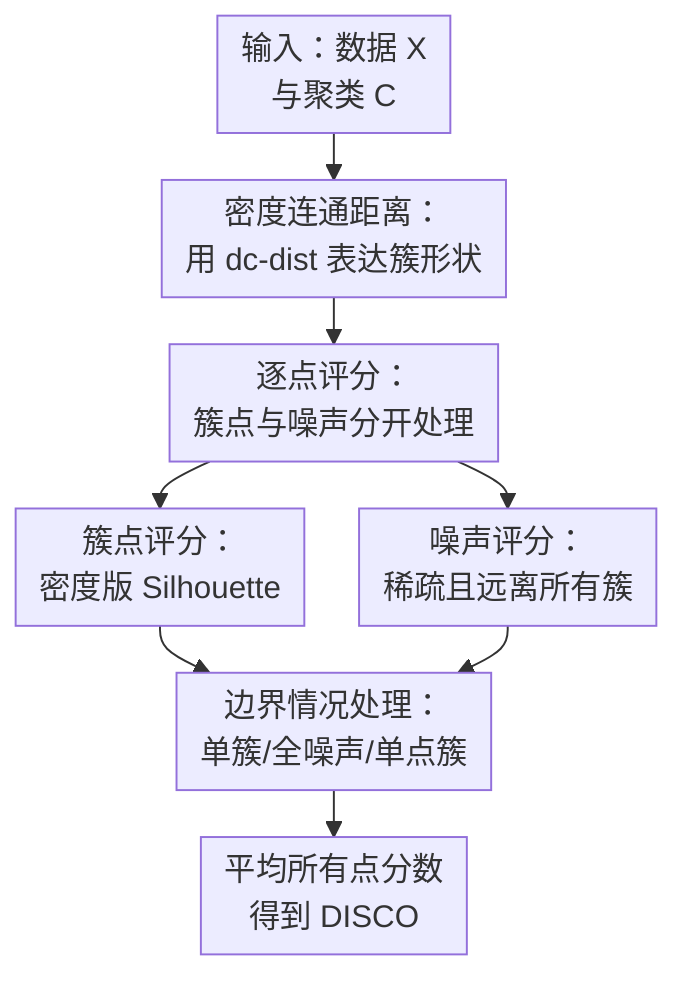

# Internal Evaluation of Density-Based Clusterings with Noise

**会议**: ICLR2026  
**OpenReview**: [https://openreview.net/forum?id=izbBFuHtAX](https://openreview.net/forum?id=izbBFuHtAX)  
**代码**: https://github.com/pasiweber/DISCO  
**领域**: 聚类评估 / 数据挖掘 / 其他  
**关键词**: 密度聚类, 内部聚类评价, 噪声标签, DISCO, density-connectivity  

## 一句话总结

这篇论文提出 DISCO，一个面向带噪声密度聚类结果的内部评价指标，用 density-connectivity 替代欧氏紧致性来评价任意形状簇，并显式判断噪声标签是“真噪声”还是“该进簇却被丢掉的点”。

## 研究背景与动机

**领域现状**：聚类任务里，经常没有真实标签可用，因此研究者需要内部聚类有效性指标（internal cluster validity index, CVI）来比较不同算法、不同超参数或同一算法输出的不同划分。经典指标如 Silhouette Coefficient、Davies-Bouldin、Dunn index 通常围绕“簇内紧致、簇间分离”这个框架展开；如果数据天然是球形簇或中心型簇，这类定义很直观。

**现有痛点**：密度聚类的目标并不是找到几个球形团块，而是找到由高密度区域连接起来、形状可以弯曲甚至成环的簇。DBSCAN、HDBSCAN 这类方法还会把低密度或不属于任何簇的点标成噪声。问题在于，大多数 CVI 要么默认每个点都必须归入某个簇，要么只适合欧氏距离意义下的紧致簇；即使 DBCV 这类密度聚类指标能处理任意形状，它对噪声的处理也只是按噪声比例惩罚总分，而不是判断这个噪声标签本身是否合理。

**核心矛盾**：密度聚类的优势恰恰在于“簇可以任意形状”和“噪声可以不进簇”，但常用评价指标往往把这两个优势当成异常情况处理。一个正确的环形簇可能因为欧氏距离不紧致而被 Silhouette 打低分；一个正确识别了大量背景噪声的聚类也可能被 DBCV 因噪声比例过高而扣分。这样一来，指标会把模型选择引向错误方向：选择更像 k-Means 的切块结果，或选择把噪声硬塞进簇里的结果。

**本文目标**：作者希望构造一个内部指标，它在没有真实标签时也能评价密度聚类输出，并且同时满足四个要求：能识别任意形状簇，能评价噪声标签质量，得分范围有界且可比较，对 DBSCAN/HDBSCAN 可能产生的边界情况也有定义。

**切入角度**：论文没有重新发明一个完全陌生的评价框架，而是沿用 Silhouette 的可解释思想：对每个点比较“它和自己簇的关系”以及“它和外部簇的关系”。关键改动有两个：第一，把距离从欧氏距离换成 density-connectivity distance，让指标看见密度路径而不是直线距离；第二，把噪声点单独建模，要求一个好噪声点既处在低密度区域，又不与任何已有簇密度连通。

**核心 idea**：用基于密度连通的逐点评分统一评价簇点和噪声点，使 CVI 不再只惩罚噪声数量，而是判断每个噪声标签是否符合密度聚类的语义。

## 方法详解

### 整体框架

DISCO 的输入是一组数据点 $X$ 和一个候选聚类结果 $C$，其中一部分点属于普通簇 $C_i$，另一部分点被标记为噪声 $N$。输出是一个范围在 $[-1, 1]$ 的整体分数，分数越高表示聚类越符合密度聚类语义。它的整体思路是先在数据上建立 density-connectivity 视角下的距离，再对每个点分别计算质量分数：簇内点看“本簇密度连通紧致性 vs 最近外部簇分离性”，噪声点看“是否足够稀疏”和“是否足够远离所有簇”。

这个流程可以理解成把 Silhouette 的逐点比较机制搬到密度聚类世界里。普通 Silhouette 问的是：点 $x$ 离自己簇平均有多近、离最近其他簇平均有多远；DISCO 问的是：沿着密度路径看，点 $x$ 是否真的更属于自己的簇，以及被标成噪声的点是否真的不该属于任何簇。

形式上，DISCO 先为每个点定义一个分数 $\rho(x)$，再对所有点取平均：

$$
\rho(X)=\operatorname{avg}_{x\in X}\rho(x).
$$

如果 $x$ 是簇内点，就使用 $\rho_{cluster}(x)$；如果 $x$ 是噪声点，就使用 $\rho_{noise}(x)$。这种点级定义不仅方便合成总分，也让评价结果更可解释：低分点可以直接指出某些簇边界、错误噪声标签或不稳定区域。

### 关键设计

**1. 密度连通距离：让评价指标理解任意形状簇**

普通 CVI 容易被环形、螺旋形或弯曲流形误导，因为它们用欧氏直线距离衡量紧致性。DISCO 的第一步是改用 density-connectivity distance，即 $d_{dc}(x,y)$。这个距离不是问两个点直线相隔多远，而是问从 $x$ 走到 $y$ 的最优密度路径上，需要跨过的最大稀疏缺口有多大。若两个点可以沿高密度区域绕路相连，即使欧氏距离远，$d_{dc}$ 也可以较小；若中间有低密度间隔，即使欧氏距离看起来近，$d_{dc}$ 也会变大。

具体地，论文先定义每个点的 core-distance $\kappa(x)$，也就是到第 $\mu$ 个近邻的欧氏距离。$\kappa(x)$ 越小，说明点周围越密。两个点之间的 mutual reachability distance 为 $d_m(x,y)=\max(\kappa(x),\kappa(y),d_{eucl}(x,y))$。随后在由 $d_m$ 加权的图上找最小生成树，$d_{dc}(x,y)$ 就是连接 $x$ 与 $y$ 的路径上最大边权的最小可能值。这个 minimax 路径距离正好捕捉 DBSCAN/HDBSCAN 依赖的“密度连通”直觉。

**2. 簇点评分：把 Silhouette 改造成密度版逐点比较**

对于已经被分到某个簇 $\hat C_x$ 的点，DISCO 保留 Silhouette 的核心结构：如果点 $x$ 到自己簇的平均距离小于到最近外部簇的平均距离，它应该得高分；反过来，如果它与别的簇更连通或自己的簇内部不紧致，它就应该被扣分。区别在于，这里的距离全部换成 $d_{dc}$，平均距离写作 $\tilde d_{dc}(x,C_i)=\operatorname{avg}_{y\in C_i} d_{dc}(x,y)$。

簇点分数为：

$$
\rho_{cluster}(x)=\min_{C_i\neq \hat C_x}\frac{\tilde d_{dc}(x,C_i)-\tilde d_{dc}(x,\hat C_x)}{\max(\tilde d_{dc}(x,C_i),\tilde d_{dc}(x,\hat C_x))}.
$$

这个定义解决的是“密度簇不一定欧氏紧致”的问题。比如两个同心环，如果用欧氏平均距离，一个环上相隔很远的点会显得不紧致；但沿环形高密度路径看，它们属于同一个密度连通结构。DISCO 因此能给正确环形簇更合理的分数，而不会偏向把环切成扇形的 k-Means 结果。

**3. 噪声评分：同时检查低密度和不连通，区分好噪声与坏噪声**

本文最关键的贡献是把噪声标签作为一等公民来评价。一个点被标成噪声不应该天然扣分，也不应该被简单忽略；它只有在两件事同时成立时才是好噪声：第一，它所在区域确实稀疏，不像一个可形成簇的高密度区域；第二，它不与任何已有簇密度连通，否则就更像是某个簇的边界点或漏标点。

第一项叫 $\rho_{sparse}$，用噪声点的 core-distance 与各个簇的最大 core-distance 比较。簇 $C$ 的 $\kappa(C)=\max_{x\in C}\kappa(x)$ 可以看成保持该簇密度连通所需的最小阈值。若噪声点 $x_n$ 的 $\kappa(x_n)$ 比所有簇都大，说明它处在更稀疏区域；若它与某个簇的密度水平相当，就不应被高分奖励。论文写作：

$$
\rho_{sparse}(x_n)=\min_{C_i\in C}\frac{\kappa(x_n)-\kappa(C_i)}{\max(\kappa(x_n),\kappa(C_i))}.
$$

第二项叫 $\rho_{far}$，用噪声点到每个簇的最近 $d_{dc}$ 与该簇的 $\kappa(C_i)$ 比较。如果 $x_n$ 到某个簇的 density-connectivity 距离不超过该簇内部维持连通的密度阈值，它其实就像是该簇的一部分；把它标成噪声应被惩罚。对应公式为：

$$
\rho_{far}(x_n)=\min_{C_i\in C}\frac{\min_{y\in C_i}d_{dc}(x_n,y)-\kappa(C_i)}{\max(\min_{y\in C_i}d_{dc}(x_n,y),\kappa(C_i))}.
$$

最终噪声分数取二者最小值：$\rho_{noise}(x_n)=\min(\rho_{sparse}(x_n),\rho_{far}(x_n))$。这个最小化很重要，因为噪声点只要违反其中一个条件就不该被高分奖励：一团密集点全被标成噪声是坏噪声，簇内部或簇边界点被标成噪声也是坏噪声。

**4. 边界情况处理：让指标在真实聚类输出上始终有定义**

密度聚类经常产生传统 CVI 不愿面对的输出：全是噪声、只有一个簇、单点簇、一个簇加一些噪声、重复点导致 core-distance 为 0。很多指标在这些情况下要么直接报错，要么数学定义失效，而 DISCO 明确给出处理规则。全噪声聚类没有聚类价值，论文把所有噪声点分数设为 $-1$；单点簇不体现“把相似点组织在一起”，因此单点簇中的点得分设为 $0$；只有一个簇且无噪声时，也给 $0$，表示没有可比较的外部分离性。

更有意思的是“一个簇加噪声”的情况。此时没有第二个簇可作为分离参照，DISCO 就用最近噪声点替代最近外部簇来评价簇点：若簇点到噪声点的密度连通距离远大于簇内平均距离，说明簇与噪声分得开；否则说明簇边界可能不可靠。这个设计让 DISCO 可以覆盖 DBSCAN 参数过大或过小带来的常见异常输出，而不是只在理想的多簇无异常设置下工作。

### 一个完整示例

假设数据里有两个弯曲的月牙形簇和一圈背景点。某个 DBSCAN 设置给出了两个簇，并把背景点标为噪声。DISCO 会先用 $\mu=5$ 计算每个点的 core-distance，再通过 mutual reachability distance 建立密度连通图。对月牙上的点而言，即使月牙两端欧氏距离不近，只要沿着月牙有连续高密度路径，$d_{dc}$ 仍会认为它们属于同一个连通结构。

如果一个月牙上的边界点被正确分到本簇，$\tilde d_{dc}(x,\hat C_x)$ 通常小于它到另一个月牙簇的平均 $d_{dc}$，因此 $\rho_{cluster}(x)$ 为正。若 k-Means 把两个弯曲簇按直线切开，同一个密度连通簇会被拆散，很多点到“自己簇”的密度路径反而不如到原本同一月牙另一部分自然，分数会下降。

再看噪声点。如果某个背景点远离所有月牙且周围稀疏，它的 $\kappa(x_n)$ 会较大，$\min_y d_{dc}(x_n,y)$ 也会大于附近簇的 $\kappa(C_i)$，于是 $\rho_{sparse}$ 和 $\rho_{far}$ 都偏高，它被标为噪声是合理的。相反，如果一小团密集点被整体标成噪声，$\rho_{sparse}$ 会因为这团点密度不低而变差；如果一个月牙边界点被误标为噪声，$\rho_{far}$ 会因为它仍与月牙密度连通而变差。总分正是这些逐点判断的平均。

### 损失函数 / 训练策略

DISCO 不是一个训练模型，因此没有损失函数或反向传播过程。它的“计算策略”主要由三个部分组成：先计算 core-distance 和 mutual reachability distance，再构建最小生成树以获得 $d_{dc}$，最后按点计算 $\rho_{cluster}$ 或 $\rho_{noise}$ 并平均。

论文默认超参数为 $\mu=5$，这个值对应 DBSCAN 文献中常见的 minPts 经验设置。整体复杂度为 $O(n^2)$，运行时间主要随样本数增长，而不是随维度线性爆炸；实验显示它与 DBCV、DCSI、CVNN 等密度相关指标在同一量级，但明显慢于纯中心型指标如 Silhouette。

## 实验关键数据

### 主实验

论文的实验围绕几个问题展开：DISCO 是否真的偏好密度聚类语义，是否能正确处理噪声标签，是否适合用于 DBSCAN 参数选择，以及它与外部指标 ARI 的一致性如何。下面两个主表分别对应最能支撑论文主张的实验：任意形状簇评价和噪声标签评价。

| 场景 | 对比聚类 | DISCO | 关键竞争指标表现 | 结论 |
|------|----------|-------|------------------|------|
| 3-spiral | DBSCAN 真值 vs k-Means | 0.59 vs 0.00 | Silhouette 为 0.00 vs 0.36，偏好 k-Means | DISCO 能识别螺旋形密度簇 |
| complex9 | DBSCAN 真值 vs k-Means | 0.36 vs 0.02 | Silhouette 为 -0.01 vs 0.40，仍偏好 k-Means | DISCO 不被中心型切块误导 |
| cluto-t8-8k | 真值 vs 严重错误噪声划分 | 0.30 vs -0.07 | DBCV 为 -0.05 vs 0.17，反而偏好坏划分 | 显式噪声评价是必要的 |
| 双环加背景噪声 | 真值 vs 把部分噪声并入簇 | 0.50 vs 0.19 | DBCV 为 0.46 vs 0.63，偏好少噪声版本 | DISCO 不把“少标噪声”误当成更好 |

| 数据集 | 评价目标 | DISCO 结果 | 参照结果 | 说明 |
|--------|----------|------------|----------|------|
| Synth high | 用 CVI 选择 DBSCAN 的 $\epsilon$ | 最优分数出现在 $k=10$ | ARI 最高也在 $k=10$ | DISCO 可用于参数选择 |
| 多个 benchmark | 与 ARI 的 Pearson 相关 | complex8: 95.71；COIL20: 95.79；Optdigits: 91.07 | MMJ-SC/LCCV 也较强，DBCV 部分数据不可算或相关性异常 | DISCO 在可计算性与一致性之间更稳 |
| real-world/UCI | HDBSCAN 噪声点质量 | 噪声点通常比“把簇点假装成噪声”得分更高 | Spambase/Wine quality 给出负噪声分 | 能发现 HDBSCAN 过度标噪声的问题 |
| runtime | 与密度 CVI 比较 | cluto-t8-8k: 3.982 秒；htru2: 37.191 秒 | DBCV 分别 1.831 秒、38.432 秒；LCCV/CVDD 常慢得多 | DISCO 代价可接受但不是最快指标 |

### 消融实验

论文的消融不是去掉某个神经网络模块，而是系统改变数据或标签，观察 DISCO 的组成项是否按预期变化。核心包括 $\rho_{cluster}$ 的敏感性、$\rho_{noise}$ 的两个子项，以及超参数 $\mu$ 的鲁棒性。

| 配置 / 扰动 | 观察指标 | DISCO 行为 | 说明 |
|-------------|----------|------------|------|
| 增加错误分配的簇点比例 | $\rho_{cluster}$ 与总分 | 分数平滑下降 | 小错误不会让分数突然崩溃，适合细粒度比较 |
| 拉大两个球形簇之间距离 | $\rho_{cluster}$ | 簇明显密度分离后快速上升 | 能捕捉密度连通到密度分离的转折 |
| 增加 two-moons 边界 fuzziness | $\rho_{cluster}$ | 从高分逐步下降 | 对簇边界模糊度反应符合直觉 |
| 让远处噪声点逐渐变密 | $\rho_{sparse}$ | 噪声团开始像簇时分数下降 | 防止把“漏掉的密集小簇”奖励成好噪声 |
| 把单个噪声点从簇中心向外移动 | $\rho_{far}$ | 离开簇半径并不再密度连通后快速上升 | 区分簇内误标噪声与真正孤立噪声 |
| 改变 $\mu\in[1,30]$ 或 $[1,10]$ | 总 DISCO | 多数数据集稳定，$\mu=5$ 表现合理 | 指标对核心超参数不高度敏感 |

### 关键发现

- DISCO 最清楚地补上了现有 CVI 的空白：它不是简单“允许有噪声”，而是逐点评价噪声标签质量。这个差别在双环加背景噪声实验里非常明显，DBCV 因噪声比例较少而偏好错误版本，DISCO 则偏好真实噪声被保留为噪声的版本。
- 密度连通距离是让 DISCO 能评价任意形状簇的关键。如果只用欧氏距离，环形和螺旋形簇会被看成不紧致；使用 $d_{dc}$ 后，指标关注的是高密度路径是否连贯。
- DBCV 的非确定性是论文里很有价值的实验发现。由于 mutual reachability distance 下 MST 往往不唯一，而 DBCV 又会去掉 MST 叶节点，同一个聚类在不同点顺序或实现下可能得到不同分数。这会直接影响超参数选择的可复现性。
- DISCO 在边界情况上比多数竞争指标完整。表 4 中不少方法遇到单点簇、单簇、全噪声或实现除零问题时无法计算，而 DISCO 始终返回有界分数。

## 亮点与洞察

- 这篇论文最漂亮的地方，是把“噪声”从一个需要过滤或惩罚的副产物，变成了可以被评价的标签类型。密度聚类里，正确发现噪声本来就是任务目标之一；DISCO 让评价指标终于承认这一点。
- 逐点评分带来了很强的可诊断性。总分告诉你哪个聚类更好，点分数还能指出哪些点的标签可疑：低分簇点可能在错误簇边界，低分噪声点可能是漏掉的簇成员或潜在小簇。
- $\rho_{noise}=\min(\rho_{sparse},\rho_{far})$ 这个设计很克制。它没有把噪声质量简化成“离簇远”，因为一团远处密集点也不应该是好噪声；也没有只看“稀疏”，因为簇边界附近的稀疏点可能仍密度连通到簇。
- 对 DBCV 非确定性的分析有独立价值。很多论文默认评价指标是确定的，但这里指出 MST 叶节点删除会让 DBCV 对处理顺序敏感，这对复现实验和聚类算法比较都很重要。
- 这个思路可以迁移到其他“有拒识/背景类”的无监督任务。凡是模型可以把样本标成 unknown、outlier、background 的场景，评价指标都不应只数拒识比例，而应评估拒识标签是否符合局部结构。

## 局限与展望

- DISCO 仍然需要选择超参数 $\mu$，虽然实验显示 $\mu=5$ 在多数数据集上稳定，但不同数据尺度、局部维度或非均匀采样场景下，固定 $\mu$ 可能不总是最优。
- 复杂度为 $O(n^2)$，对中等规模数据可接受，但在百万级数据或需要反复调参的场景中会成为瓶颈。未来可以考虑近似近邻图、稀疏 MST 或采样版 density-connectivity 距离。
- 论文主要讨论的是“额外背景噪声”这一常见模型。如果噪声本身有复杂结构，比如多源异常、局部密度与真实簇相近的异常群，$\rho_{sparse}$ 与 $\rho_{far}$ 的解释可能需要更细的扩展。
- 对高维表示学习后的聚类，距离本身是否可靠仍是前提。DISCO 能更好评价密度连通结构，但如果输入特征空间已经扭曲，指标也会继承这个空间的偏差。
- 实验覆盖了大量传统 benchmark 和 UCI 数据，但还可以进一步验证在现代深度聚类、图聚类或 embedding 聚类管线中，DISCO 作为调参指标是否真的改善下游选择。

## 相关工作与启发

- **vs Silhouette Coefficient**: Silhouette 用点到本簇和最近其他簇的平均距离构造直观分数，优点是点级可解释且范围有界；DISCO 继承这个逐点比较框架，但把欧氏距离换成 density-connectivity distance，并加入噪声点专门评分，因此更适合任意形状密度簇。
- **vs DBCV**: DBCV 是密度聚类评价里最接近本文目标的经典方法，能处理任意形状并考虑噪声比例；但它不评价噪声标签质量，只按非噪声比例缩放总分，而且因为 MST 叶节点处理存在非确定性。DISCO 的优势是逐点、确定、有界，并能判断噪声是否合理。
- **vs DCSI / MMJ-SC / LCCV**: 这些方法也试图摆脱球形簇假设，用连通性、局部核心或 min-max 距离评价任意形状聚类。DISCO 与它们的主要区别在于把噪声作为显式对象建模，并对真实聚类算法可能输出的边界情况给出完整定义。
- **vs CVNN / CVDD / CDbw**: 这些指标通过近邻、密度距离或多代表点扩展传统 CVI，但部分分数无界、实现复杂或在噪声标签上语义不清。DISCO 的启发是：与其给传统紧致性指标打补丁，不如先明确密度聚类的两个语义核心，即密度连通的簇和不连通的低密度噪声。

## 评分

- 新颖性: ⭐⭐⭐⭐⭐ 显式评价噪声标签质量这一点很关键，且与密度连通距离结合得自然。
- 实验充分度: ⭐⭐⭐⭐⭐ 实验覆盖 toy、benchmark、真实数据、参数选择、ARI 相关性、鲁棒性、噪声消融和 runtime，支撑很完整。
- 写作质量: ⭐⭐⭐⭐☆ 论文主线清楚，公式定义严谨；少数表格信息密集，需要读者熟悉多个 CVI 才能快速消化。
- 价值: ⭐⭐⭐⭐⭐ 对密度聚类算法比较、DBSCAN/HDBSCAN 调参和带噪声聚类评测都有直接价值，也指出了 DBCV 非确定性这一容易被忽略的问题。

<!-- RELATED:START -->

## 相关论文

- [\[ICLR 2026\] Noise-Aware Generalization: Robustness to In-Domain Noise and Out-of-Domain Generalization](noise-aware_generalization_robustness_to_in-domain_noise_and_out-of-domain_gener.md)
- [\[CVPR 2026\] Neural Mixture Density Processes](../../CVPR2026/others/neural_mixture_density_processes.md)
- [\[ICLR 2026\] Regulating Internal Alignment Flows for Robust Learning Under Spurious Correlations](regulating_internal_alignment_flows_for_robust_learning_under_spurious_correlati.md)
- [\[ACL 2025\] Entropy-UID: A Method for Optimizing Information Density](../../ACL2025/others/entropy-uid_a_method_for_optimizing_information_density.md)
- [\[CVPR 2026\] FedSDR: Federated Graph Learning with Structural Noise Detection and Reconstruction](../../CVPR2026/others/fedsdr_federated_graph_learning_with_structural_noise_detection_and_reconstructi.md)

<!-- RELATED:END -->
