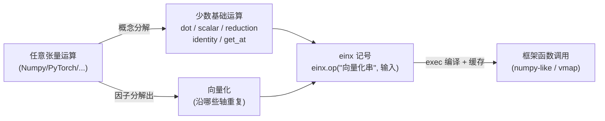

# It's All Just Vectorization: einx, a Universal Notation for Tensor Operations

**会议**: ICLR 2026  
**OpenReview**: [https://openreview.net/forum?id=QqvQ3iAdpC](https://openreview.net/forum?id=QqvQ3iAdpC)  
**代码**: [https://github.com/fferflo/einx](https://github.com/fferflo/einx)  
**领域**: 张量编程 / 科学计算记号系统  
**关键词**: 张量运算, 向量化, einops, einsum, 声明式记号, 形状错误  

## 一句话总结
本文把"向量化"提升为统一的元概念，指出几乎所有 Numpy 风格的张量运算都可拆解为"少数几个基础运算 + 它们各自的向量化"，并据此设计了一套以循环记号为类比的声明式、带括号的通用张量记号 einx，把庞杂且规则不一致的张量 API 压缩为一小撮基础运算。

## 研究背景与动机

**领域现状**：张量运算是现代深度学习与科学计算的基石，主流框架（Numpy、PyTorch、TensorFlow、Jax、MLX）都采用 Numpy 风格的"点无关式"（point-free）记号，例如 `np.sum(x, axis=1)`，运算直接作用于整个张量。为缓解这种记号缺乏索引表达力的问题，框架不得不引入大量补丁式机制：`axis` 参数、纯形状运算、广播、高级索引以及无数函数专属规则。

**现有痛点**：Numpy 风格 API 庞大、规则彼此不一致，导致代码难读难写、"形状错误"频发。已有替代方案 einsum 与 einops 借鉴爱因斯坦求和约定、用 `"a b -> a"` 这类索引串表达运算，虽然流行，但**只能覆盖极少数运算**（einsum 仅点积，einops 加上 reduce/repeat/rearrange），缺乏通用性；而且 einops 大量靠"举例式"（ostensive）定义，没有对 `"a b -> a"` 给出明确解释。

**核心矛盾**：循环记号（loop notation，用显式索引逐元素寻址）天然清晰、通用、可解释，但写起来啰嗦且不是真正的执行方式；Numpy 风格记号简洁、可调用优化后端，却牺牲了清晰性与一致性。两者之间缺一座桥。

**本文目标**：找到一个"更好的范式"——既保留循环记号的清晰可解释，又能像 Numpy/einsum 一样简洁、可声明、可对接现有框架后端，并且对**任意**张量运算都适用同一套规则。

**核心 idea**：**「重新审视向量化」** —— 把向量化看作一个"变换张量运算的函数"，既能把低阶运算**抬升（lift）**为高阶运算，也能把现有高阶运算**反向分解**为"少数基础运算 + 各自的向量化"。一旦把向量化因子分解出来，矩阵乘、各种乘积、reduce、reshape、gather 等看似五花八门的运算，本质上都是同几个基础运算（dot / scalar / reduction / identity / get_at）的不同向量化——"It's all just vectorization"。

## 方法详解

### 整体框架
einx 的设计分两步：先在概念层把向量化讲透（既能 lift 又能 decompose），再据此定义一套与循环记号一一对应的声明式记号，最后给出一个编译到现有框架函数调用的 Python 实现。运算被写成 `输出 = einx.{基础运算}("{向量化}", 输入...)` 的形式：函数名指明"做哪个基础运算"，字符串指明"沿哪些轴向量化"。

### 关键设计

**1. 向量化作为统一变换：lift 与 decompose 双向打通** —— einx 把向量化定义为"把处理单个数据点的运算变成同时处理一批数据点的运算"。正向看，`sin` 作用于标量，向量化后沿某轴对每个标量分别施加；用循环记号即 `for i: y[i] = sin(x[i])`，沿多轴向量化就是多重 for 循环，且只考虑对循环顺序不敏感的运算。反向看，许多高阶运算都能被分解为"基础运算 + 向量化"：矩阵乘是向量化的点积 `z[i,j] = dot(x[i,:], y[:,j])`；outer/Hadamard/Kronecker/Khatri–Rao 都是向量化的标量乘，只是向量化方式不同；`transpose`/`reshape` 是向量化的恒等映射 `identity(a)=a`；广播是沿"只出现在输出端"的轴向量化的恒等映射；`gather/take/index_select` 则是向量化的 `get_at`（在 n 维值张量上按一个长度为 n 的坐标向量取一个值）。这一观察是后续记号设计的全部地基。

**2. 与循环记号同构的声明式带括号记号** —— einx 字符串严格按"把循环记号翻译过来"构造：用 `->` 分隔输入与输出，逗号分隔多张量，空格分隔每个张量的各轴，并把循环记号里代表子张量的冒号 `:` 换成**带方括号的新轴名**。方括号内的轴是"基础运算实际作用的子张量轴（argument sub-tensor axes）"，括号外的轴则是被向量化的轴。例如矩阵乘写作 `einx.dot("a [b], [b] c -> a c", x, y)`——括号清楚标明只沿 `b` 做点积。这套记号是**声明式**的（只说输入输出长什么样，由系统决定如何 reshape/broadcast/transpose），与命令式的 Numpy 写法形成对照：`einx.add("a d e, c b e -> a b c d e", x, y)` 对应一长串 `x[:,None,None] + np.transpose(...)[None,:,:,None]`。由于一切都由循环记号解释，任何运算的语义都"可被逐元素读出"。

**3. 轴组合：flatten、concatenate 与广义省略号** —— 为覆盖 reshape、stack/concatenate/split 等运算，einx 引入轴组合：用圆括号表示**展平轴**（行主序合并多个轴，如 `"a b c -> (a b) c"`）；并新增 einops 没有的**拼接轴**，用 `(b + c)` 表示把多个张量沿一个新轴拼接，从而把 `np.{stack|concatenate}` 也统一成向量化的恒等映射。此外 einx 推广了省略号 `...`：放在某轴之后表示该轴可变重复多次（类比 Java/C++/Swift 的变参），重复次数由输入张量维度推断，如 `einx.add("b... i, b... j -> b... i j", x, y)` 自动按输入维度展开为 `b0 b1 ...`。配合匿名轴（数字直接指定长度）、轴约束（关键字传轴长）、隐式输出（可省略输出端自动推断）等便利特性，记号既紧凑又自描述。

**4. 编译到框架后端，零运行时开销** —— einx 不是新运行时，而是把每个 einx 运算**编译**成目标框架的函数调用：用 Python 的 `exec` 生成一段隔离代码片段，首次调用时编译并缓存，之后相同签名直接复用，除缓存查找外**相对直接调用框架函数无额外开销**；若叠加 `jax.jit` 之类 JIT，einx 的足迹完全消失。同一条 einx 表达式可编译为不同后端记号：`einx.sum("a ([b] c)", x, c=4)` 既能编译成 numpy-like 写法（`reshape` + `jnp.sum(axis=...)`），也能编译成基于 `jax.vmap` 的写法（嵌套 vmap）。借助 vmap，einx 还能把**任意自定义 Python 函数**适配成 einx 运算（`einx.torch.adapt_with_vmap`），真正做到对任何运算通用。

## 实验关键数据

本文是记号/系统设计论文，没有传统的精度 benchmark，"实验"以能力对照表与代码案例研究的形式呈现。

### 运算覆盖能力对照（Tab. 2 摘要）
P=置换, F=展平, R=重复(仅输出端向量化), C=拼接。

| 记号 | Identity | Scalar | Reduction | Dot-product | Indexing | Any other |
|------|----------|--------|-----------|-------------|----------|-----------|
| **einx (本文)** | PFRC | PFR | PFR | PFR | PFR | PFR |
| einsum (2011) | P | P(仅 mul) | P(仅 sum) | P | — | — |
| einops reduce/repeat/rearrange/einsum | PFR | P(仅 mul) | PF | P | — | — |
| einops pack/unpack | (FC)* | — | — | — | — | — |
| eindex (2023) | — | — | — | — | (P)** | — |

einx 在所有运算类别与所有向量化类型上均为全覆盖（PFRC/PFR），而 einsum/einops/eindex 各自只支持极有限的一隅。

### 案例研究：多头注意力（MHA）

| 实现方式 | 关键观察 |
|----------|----------|
| **einx** | 仅需 3 行：`einx.dot` 算 QK、`einx.softmax` 归一、`einx.dot` 加权 V；括号自描述沿 `c`、`k` 求和，softmax 自描述沿 `k` 轴 |
| einsum+einops+Numpy | 需额外多次 `einops.rearrange` 拆头（einsum 不支持轴组合）；softmax/mask 等逐元素运算 einops 不支持，被迫退回 Numpy 的位置式 `axis`/`newaxis`，语义被遮蔽 |

### 关键发现
- **消除"静默失败"**：einsum 把多种运算塞进一个入口，`"ij,ik->ik"` 的笔误会从点积"静默"变成 reduce；einx 因每个基础运算独立入口并检查括号一致性，会**大声报错**（如 `einx.dot("i [j], [i] k -> i k")` 直接因括号不一致失败）。
- **可读性**：`einsum("b q k h, b k h c -> b q h c")` 看不出哪个轴被求和；einx 的 `einx.dot("b q [k] h, b [k] h c -> b q h c")` 用括号一眼标出只沿 `k` 求和。
- **形状随需而变**：改变索引/输出形状时 einx 只需改向量化串、入口不变；Numpy 往往得切换到签名完全不同的另一个入口（如 `index_select → take_along_dim`），甚至无单一入口可表达。
- **API 压缩**：Tab. 1 展示了一大批貌似不同的 Numpy/PyTorch 调用（`take`/`gather`/`index_select`/`gather_nd`、`outer`/`kron`/`khatri_rao`、`matmul`/`dot`/`tensordot`/`inner`、`transpose`/`squeeze`/`broadcast_to`/`reshape`、`concatenate`/`stack`/`meshgrid` 等）如何统一坍缩到 einx 的 `get_at`/`multiply`/`dot`/`id` 等少数入口，仅靠向量化串不同来区分，直观印证了"它都只是向量化"。

## 亮点与洞察
- **概念升维**：论文最大的贡献不是又一个库，而是把"向量化"从编译器 SIMD 的狭义概念，提升为"变换张量运算的通用函数"，并用它统一解释整个 Numpy 生态——"它一直都只是向量化而已"，这是一个有思想密度的视角。
- **括号区分被向量化轴 vs 子张量轴**，是 einx 相对 einsum/einops 的关键记号创新：把"运算沿哪些轴作用"显式写进字符串，既自描述又能在编译期检查一致性。
- **声明式 + 可编译 + 零开销**：通过 `exec` 生成可被用户检视的隔离代码、且能落到 numpy-like 或 vmap 两种后端，兼顾了人类可读性与执行效率，工程上很务实。
- **与 named tensor 互补**：einx 作用于位置式张量、无缝接入现有 Python 生态，又可与符号轴名（named tensor）叠加使用，定位清晰。

## 局限与展望
- **仅限对循环顺序不敏感的运算**：论文明确只考虑对 loop 顺序与每个 loop 内索引顺序不变的运算，对存在顺序依赖（如某些扫描/递归类运算）的表达力边界未充分讨论。
- **学习成本与生态惯性**：带括号、广义省略号、拼接轴等新语法虽更通用，但相对已被广泛接受的 einops 仍是新心智模型，迁移与团队采纳存在阻力。
- **性能等价性依赖后端**："零开销"建立在编译到框架原生调用之上，对于 einx 分解方式与框架优化算子不一致的场景（如某些被高度优化的融合算子），自动生成的代码能否始终匹配手写最优实现，论文主要以"无额外开销"层面论证，缺少大规模真实工作负载的端到端基准。
- **后端能力受限于框架**：当目标框架本身缺少某个基础运算的高效实现时，einx 只能退回到 vmap 或循环式展开，此时性能可能不如专用算子。
- **展望**：把 einx 与 named tensor、JIT 编译器更深地协同，或将这套"基础运算 + 向量化"的分解作为编译器中间表示，是自然的延伸方向。

## 相关工作与启发
- **ein\* 记号谱系**：从爱因斯坦求和约定到 einsum（Wiebe 2011）、einops（Rogozhnikov 2022）及一众互不兼容的变体（einindex、pack/unpack、eindex、eingather、einmesh）。einx 指出这些"ein\*"其实并未真正使用爱因斯坦约定，只是借用了索引串风格，因此自称 einx 而不宣称"Einstein-inspired"。
- **named tensor**（xarray、torchdim、Named Tensor Notation、Haliax 等）：用符号轴名隐式向量化，与 einx 的位置式记号互补而非竞争。
- **其他 pointful 语言**（Tensor Comprehensions、Dex/Paszke 2021 等）：定义自有基础运算与组合记号，但与现有框架集成有限、对"未在记号内定义的运算"向量化支持不足——这恰是 einx 借 `vmap` 适配任意函数所要解决的。
- **启发**：当一个领域 API 膨胀且规则不一致时，往往存在一个被忽视的"元运算"（这里是向量化），把它显式因子分解出来就能极大压缩复杂度——这一思路对设计其他 DSL / 算子库同样有借鉴价值。
- **对深度学习实践的意义**：注意力、MoE、卷积重排等大量含"分头/合头/广播/求和"的算子，用 einx 写出来既更短又自描述，能显著降低"形状错误"这类深度学习工程里最常见的隐性 bug。

## 评分
- **新颖性**: ⭐⭐⭐⭐⭐ 把向量化提升为统一元概念、并据此设计可证明通用的声明式记号，视角新颖且自洽，超出"又一个 einops 变体"的范畴。
- **实验充分度**: ⭐⭐⭐ 作为记号/系统论文，以能力对照表、案例研究、编译产物与开销分析为主，缺少大规模真实工作负载的端到端定量基准。
- **写作质量**: ⭐⭐⭐⭐⭐ 论证层层递进（先讲向量化 lift/decompose，再引出记号），例子丰富、对照清晰，"It's all just vectorization"的叙事极具说服力。
- **价值**: ⭐⭐⭐⭐ 提供了既能用的开源工具又能改变思考方式的"更好模型"，对张量编程的可读性与正确性有实际帮助，长期影响取决于社区采纳。

<!-- RELATED:START -->

## 相关论文

- [\[ICLR 2026\] AnyUp: Universal Feature Upsampling](anyup_universal_feature_upsampling.md)
- [\[ICLR 2026\] Exposing Mixture and Annotating Confusion for Active Universal Test-Time Adaptation](exposing_mixture_and_annotating_confusion_for_active_universal_test-time_adaptat.md)
- [\[AAAI 2026\] OR-R1: Automating Modeling and Solving of Operations Research Optimization Problems](../../AAAI2026/others/or-r1_automating_modeling_and_solving_of_operations_research_optimization_proble.md)
- [\[CVPR 2026\] Clair Obscur: an Illumination-Aware Method for Real-World Image Vectorization](../../CVPR2026/others/clair_obscur_an_illumination-aware_method_for_real-world_image_vectorization.md)
- [\[CVPR 2026\] What Is the Optimal Ranking Score Between Precision and Recall? We Can Always Find It and It Is Rarely F₁](../../CVPR2026/others/what_is_the_optimal_ranking_score_between_precision_and_recall_we_can_always_fin.md)

<!-- RELATED:END -->
