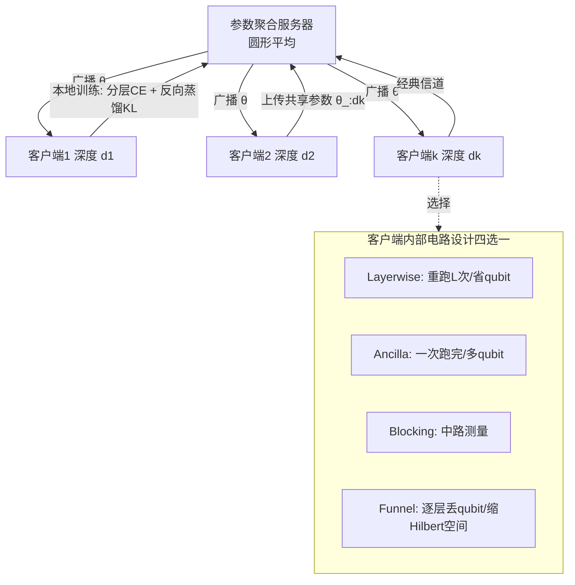

# Layerwise Federated Learning for Heterogeneous Quantum Clients using Quorus

**会议**: ICLR 2026  
**OpenReview**: [https://openreview.net/forum?id=ZwwFuVQv64](https://openreview.net/forum?id=ZwwFuVQv64)  
**代码**: 待确认  
**领域**: 量子机器学习 / 联邦学习  
**关键词**: 量子联邦学习, 异构客户端, 分层损失, 反向蒸馏, 参数化量子电路, 贫瘠高原  

## 一句话总结
针对不同客户端只能跑不同电路深度的量子联邦学习场景，Quorus 用分层损失 + 反向蒸馏让深浅不一的量子模型协同训练，并设计了四种 shot/qubit/中路测量/Hilbert 空间各有取舍的量子分类器，平均比 SOTA 提升 12.4% 测试精度。

## 研究背景与动机
**领域现状**：量子机器学习（QML）有望以更少参数解决经典难题，当数据分散在多个私有客户端时，自然延伸出量子联邦学习（QFL）——各方在不泄露数据的前提下，通过经典信道交换参数协同训练参数化量子电路（PQC）。

**现有痛点**：现有 QFL 几乎都假设所有客户端跑相同架构的电路，但真实世界里不同客户端拥有的量子计算机代际、保真度差异巨大。由于硬件误差与电路深度成正比（退相干随时间损失振幅/相位信息），误差越大的设备只能跑越浅的电路。此外深电路还面临**贫瘠高原**（barren plateau，梯度随深度指数消失）和**shot 成本**（每步训练都要重复执行电路估计可观测量，IBM 机器跑一分钟约 $96）两大约束。

**核心矛盾**：经典异构 FL 方法（HeteroFL、DepthFL、ScaleFL、ReeFL）要么需要训练中间层、要么需要直接访问特征——这些在 PQC 上都不成立：训练中间层恰恰要求客户端把电路跑到那个深度（这正是瓶颈），而量子态的"特征"除非做态层析否则不可直接读取。最关键的是，分层损失需要在每层取出分类器输出，而**量子测量会坍缩叠加态**，测了第一层就破坏了传给后续层的态。

**本文目标**：让每个客户端在自己硬件能达到合理精度的深度上参与训练，且尽量多跑层数以获得更高表达力与精度，同时控制 shot 预算。

**核心 idea**：**【分层损失 + 反向蒸馏】**首次把 DepthFL 式的分层损失搬到量子场景，仅在共享参数的客户端间做参数聚合；**【量子坍缩难题的工程化解法】**针对"测量即坍缩"这一量子独有矛盾，提出 Layerwise/Ancilla/Blocking/Funnel 四种成本互斥的电路设计，让不同资源画像的客户端各取所需。

## 方法详解

### 整体框架
Quorus 沿用中心化 FL 的"本地训练→上传参数→服务器聚合→广播"循环，但做了三处量子化改造：(1) 各客户端按硬件能力训练不同深度 $d_k$ 的 PQC，聚合时只在共享该参数的客户端间进行；(2) 因为参数是 Bloch 球旋转角，聚合用**圆形平均** $\text{angle}(z)=\text{atan2}(\text{imag}(z),\text{real}(z))$ 而非算术平均；(3) 本地损失是分层交叉熵 + 层间 KL 散度。难点全部集中在"如何在不引入线性 shot 开销的前提下取出每层的分类器输出"，由四种电路设计分情况求解。

### 关键设计

**1. 分层损失 + 反向蒸馏：让深浅模型共享同一优化目标。** 客户端 $k$ 的损失为

$$L_k = \sum_{i=1}^{d_k} L_{ce}^i + \frac{1}{d_k-1}\sum_{i=1}^{d_k}\sum_{\substack{j=1\\ j\neq i}}^{d_k} D_{KL}(p_j \,\|\, p_i)$$

第一项是每个深度 $i$ 上分类器的二元交叉熵，第二项是所有层 logits 两两之间的 KL 散度。它沿用 DepthFL 的直觉：因为各客户端局部参数空间不同会产生参数错配，需要一个所有客户端共享的目标来对齐；而 KL 项实现"**反向蒸馏**"——让浅层分类器去帮助深层分类器（而非传统蒸馏的深教浅）。这一项把不同深度客户端的训练目标"同步"起来，使得参数聚合在异构深度下仍然有效。

**2. 坍缩难题与 Layerwise 基线方案。** 经典 DepthFL 默认中间层输出能被"复制"且原样传给下一层（经典开销可忽略），但量子里没有这个操作：一旦测量第一个 qubit 取分类输出，叠加态就坍缩，后续层拿到的就是变了的态。最直接的解法 Layerwise 是"重新制备"——既然知道制备电路，就把同一电路跑 $L$ 次，第 $i$ 次只跑到第 $i$ 层再测量。代价是 **shot 预算随层数线性增长**，对深电路、预算紧张的客户端不可行。它的优点是只需最近邻连接、qubit 数最省，作为与基线同架构的对照方案用于主实验。

**3. Ancilla / Blocking：用辅助比特或中路测量换 shot。** 为让"取每层输出"的 shot 数与层数无关，Ancilla 设计在每层后把第一个 qubit 与一个 $|0\rangle$ 辅助比特纠缠，通过计算辅助比特的边缘分布读出该层输出；电路只跑一次，但每层都要一个 ancilla，且纠缠会"去相位"（dephase）第一个 qubit——作者在 IBM 硬件上验证即使如此模型仍能有效训练。其逻辑等价物 Blocking（附录给出等价性证明）则不用 ancilla，直接对第一个 qubit 做**中路测量**后不重置、继续计算；适合能做快速中路测量的客户端，但现有中路测量耗时且易错。两者本质都是"以更多 qubit 或中路测量能力，换掉 Layerwise 的线性 shot 开销"。

**4. Funnel：为最受限客户端逐层"漏斗式"丢弃 qubit。** 面向既无高 shot 预算、又无 ancilla、也无中路测量能力的客户端，Funnel 让作用在第一个 qubit 上的操作逐层减少——每测一层就丢掉一个 qubit，使所有测量都能放到电路末尾，同时深层 unitary 作用的 qubit 越来越少（故名漏斗）。代价是**要求问题本身能适配在越来越少的 qubit 上运算**，即限制了 Hilbert 空间。这样四种设计（Layerwise/Ancilla/Blocking/Funnel）各自只付出一种成本（↑shot / ↑qubit / 中路测量 / ↓Hilbert 空间），需求互斥，覆盖了客户端的不同资源画像。

此外在 ansatz 选择上，作者对比了 Staircase、V 形、交替三种，均做数据重上传（Ry 门）并只测第一个 qubit（二分类够用），最终 V 形因 CNOT 上下穿梭更利于信息广播而表现最佳，作为默认 ansatz。

## 实验关键数据

设置：MNIST / Fashion-MNIST 二分类，每客户端 128 数据点，PCA 降到 10 维角度编码，每组对比跑 5 次取均值方差。

### 主实验：Quorus-Layerwise vs 基线（V 形 ansatz，测试精度 %）
按客户端容量（2L–6L）与不同类别对比，列出代表性数值：

| 容量 | 技术 | MNIST 0/1 | MNIST 3/4 | MNIST 4/9 | Fashion 裤/靴 |
|------|------|-----------|-----------|-----------|---------------|
| 3L | Q-HeteroFL | 79.6 (↓18.7) | 85.0 (↓11.9) | 68.5 (↓11.9) | 76.9 (↓22.3) |
| 3L | Vanilla QFL(2L) | 98.2 | 96.0 | 80.0 | 98.5 |
| 3L | **Quorus-Layerwise** | 98.0 | **96.9** | **80.4** | **99.2** |
| 6L | Q-HeteroFL | 88.6 (↓10.0) | 85.1 (↓12.7) | 73.9 (↓9.2) | 95.3 (↓4.1) |
| 6L | **Quorus-Layerwise** | **98.6** | **97.8** | **83.1** | **99.4** |

平均比 Q-HeteroFL 高 **12.4%**。深度越大，Quorus 相对 Vanilla QFL（被迫用最浅深度）优势越明显，说明它真正释放了高容量客户端的表达力。

### 消融：Quorus 四种变体对比（V 形）

| 容量 | Layerwise | Ancilla/Blocking | Funnel |
|------|-----------|------------------|--------|
| 4L MNIST 4/9 | 81.9 (↓1.3) | 81.5 (↓1.7) | **83.2** |
| 5L MNIST 4/9 | 82.5 (↓2.1) | 81.9 (↓2.7) | **84.6** |
| 6L MNIST 4/9 | 83.1 (↓2.1) | 82.2 (↓3.0) | **85.2** |

Layerwise 与 Funnel 综合最优，作为后续实验主选；Ancilla/Blocking 精度略低但带来 shot/连接性上的灵活度。

### 关键发现
- **更高梯度范数**：Quorus 提升了高深度客户端的梯度幅值，缓解贫瘠高原效应，使深电路可训练。
- **真机可行**：在 IBM 全系超导 QPU 上实现，精度与理想模拟相差 **3% 以内**。
- **小容量客户端例外**：2L 等最小容量时 Quorus-Layerwise 未必最优，因其损失会同时惩罚第一层参数与深层客户端的 loss 值。

## 亮点与洞察
- **首个结构化、深度异构的 QFL 框架**，把分层损失 + 反向蒸馏引入量子，填补了"异构需求量子客户端"的文献空白。
- **直面量子独有矛盾**：测量即坍缩这个经典 FL 不存在的问题，被转化为四种成本互斥的电路设计，工程上非常干净——每个设计恰好只付一种代价，按客户端真实约束对号入座。
- **既看模拟也看真机**：12.4% 提升、3% 真机差距、更大梯度范数三条证据互相印证，量子论文里少见的扎实硬件验证。

## 局限性 / 可改进方向
- 仅限**二分类**任务（只测第一个 qubit），多分类需重新设计输出读取方式。
- 数据规模小（每客户端 128 点、PCA 到 10 维），离真实 QML 应用尺度尚远。
- 分层损失对**小容量客户端反而不利**，第一层参数被多重惩罚，公平性/个性化仍待解决。
- Ancilla 的去相位与 Blocking 的中路测量在 NISQ 设备上仍是误差源，长程 CNOT 的硬件代价未充分量化。

## 相关工作与启发
- **经典异构 FL**：HeteroFL（共享子模型聚合）、DepthFL（分层 FL，本文损失直接借用其直觉）、ScaleFL/FEDepth（需训中间层，PQC 不适用）、ReeFL（Transformer 融合特征，量子无法直接取特征）。
- **量子 FL**：Chen & Yoo 的同构 QFL 奠基；eSQFL 用层间态内积做分层损失，但需长程连接、真机不可行——Quorus 的电路设计正是为了绕开这类不可实现性。
- **启发**：当把一个经典算法移植到新计算范式时，真正的难点往往不是算法本身，而是范式特有的物理约束（此处是测量坍缩）；把单一抽象问题拆成"成本互斥的多个具体设计"，比追求一个万能方案更贴合异构现实。

## 评分
- 新颖性: ⭐⭐⭐⭐⭐ 首个深度异构 QFL 框架，对量子测量坍缩难题给出原创且互斥的多方案设计
- 实验充分度: ⭐⭐⭐⭐ 多容量×多数据集×5 次重复 + IBM 真机验证，扎实；但仅二分类、数据规模小
- 写作质量: ⭐⭐⭐⭐ 问题动机层层递进，四种设计的取舍用一张表讲清，逻辑清晰
- 价值: ⭐⭐⭐⭐ 推动 QFL 走向真实异构硬件，对 NISQ 时代分布式 QML 有实际意义

<!-- RELATED:START -->

## 相关论文

- [\[ICLR 2026\] Deploying Models to Non-participating Clients in Federated Learning without Fine-tuning: A Hypernetwork-based Approach](deploying_models_to_non-participating_clients_in_federated_learning_without_fine.md)
- [\[ICLR 2026\] Federated ADMM from Bayesian Duality](federated_admm_from_bayesian_duality.md)
- [\[ICLR 2026\] A Federated Generalized Expectation-Maximization Algorithm for Mixture Models with an Unknown Number of Components](a_federated_generalized_expectation-maximization_algorithm_for_mixture_models_wi.md)
- [\[ICML 2026\] Identifiable Equivariant Networks are Layerwise Equivariant](../../ICML2026/others/identifiable_equivariant_networks_are_layerwise_equivariant.md)
- [\[CVPR 2026\] FedSDR: Federated Graph Learning with Structural Noise Detection and Reconstruction](../../CVPR2026/others/fedsdr_federated_graph_learning_with_structural_noise_detection_and_reconstructi.md)

<!-- RELATED:END -->
