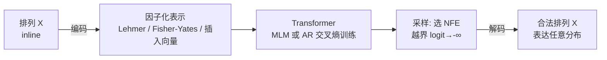

# Learning Distributions over Permutations and Rankings with Factorized Representations

**会议**: ICLR 2026  
**OpenReview**: [https://openreview.net/forum?id=aE1VU6Ui4M](https://openreview.net/forum?id=aE1VU6Ui4M)  
**代码**: 待确认  
**领域**: 概率方法 / 排列分布学习  
**关键词**: 排列分布, Lehmer 码, Fisher-Yates, 插入向量, 掩码语言建模, 排序学习  

## 一句话总结
把排列换成与对称群一一对应的「因子化表示」（Lehmer 码 / Fisher-Yates 抽签 / 插入向量），就能用普通的掩码语言建模或自回归交叉熵训练出能表达**任意**排列分布、且采样时**永远产生合法排列**的模型，并可在不重训的前提下用前向次数换取表达力。

## 研究背景与动机
- **领域现状**：在排列空间上学分布是 ranking、组合优化、结构预测、数据关联的共同基石。经典做法是 Plackett-Luce、Mallows 这类参数分布，或它们的混合；近期则用神经网络配合扩散（SymDiff）或可微松弛（Gumbel-Sinkhorn）来逼近。
- **现有痛点**：参数族表达力受限（如 Plackett-Luce 表达不了 delta 分布），混合模型要靠昂贵的变分推断；神经方法要么依赖复杂的扩散反向过程，要么用连续松弛把离散问题硬掰到连续空间，采样时还不保证输出是合法排列。
- **核心矛盾**：直接在排列的「inline 表示」（即 $X=[x_1,\dots,x_n]$，每个位置取 $[n]$ 中互不相同的值）上做掩码建模时，为了保证合法性必须让不同位置的支撑集互不重叠——这在一次前向（1 NFE）里把模型压成只能表达 delta 分布，**表达力随前向次数骤降**。
- **本文目标**：找到一种排列表示，使得「合法性约束」天然内建、可以用标准语言模型交叉熵训练、并且能在算力（前向次数）和表达力之间自由权衡。
- **核心 idea**：**【表示替换】** 不在 inline 上建模，而在与对称群双射的因子化表示上建模——这些表示的每个分量有各自的取值域，分量之间取值可以「重叠」却仍解码出合法排列，从而摆脱 inline 的表达力坍缩。

## 方法详解

### 整体框架
用 Transformer（掩码语言建模 MLM 或自回归 NTP）在排列的某个**因子化表示** $R(X)$ 上做下一 token / 掩码 token 预测，交叉熵训练。训练时模型只见合法排列，对每个位置把越界 logit 置为 $-\infty$ 即可自动学到取值域；推理时按需选择前向次数 NFE，一次前向可并行采样多个 token（它们条件独立），最后用对应表示的解码算法 $O(n)$ 还原 inline 排列。

### 关键设计

**1. inline 表示的容量天花板：解释「为什么必须换表示」。** 掩码模型写成 $P_X^{(S)}=\prod_i \prod_{j\in S_i} P_{X_j\mid X_{S_{<i}}}$，其中分区 $S=(S_1,\dots,S_k)$ 的块数就是前向次数 $k$（同一块内的 token 并行、条件独立采样）。要保证只输出合法排列，必须让同一步内各位置的支撑集不重叠，由此推出熵上界 $H(P_X^{(S)})\le \sum_i \log(n-|S_{\le i}|+1)$。当 $k=1$（全因子化，$S_1=[n]$）时右端为 $0$，意味着 inline 模型**只能表达 delta 分布**；这正是实验里 inline 在低 NFE 下连合法排列都生成不出来的根因。

**2. 三种因子化表示：合法性内建、可换算力。** Lehmer 码 $L(X)_i$ 统计第 $i$ 个元素左/右侧的逆序数，第 $i$ 个分量的取值域是 $[n-i+1)$，与阶乘进制双射，且 $\sum_i L(X)_i$ 恰为 Kendall's tau 距离；Fisher-Yates 抽签 $FY(X)$ 是「从单位排列出发、每步与右侧某位置交换」的抽签序列，与对称群双射，约束 $FY_i>0$ 就只生成循环排列（Sattolo 算法）；插入向量 $V(X)$ 相对参考排列 $X_{\text{ref}}$ 定义生成过程——逐个把 $X_{\text{ref}}$ 的元素插到槽位 $V_i$。三者的关键共性是分量取值域随位置变化、彼此取值可重叠却必合法，因此即便 1 NFE 全因子化也能表达非平凡分布。

**3. 表示选择 = 表达力/算力旋钮，且子模化经典模型。** MLM 在分区上放分布，等价于混合模型；AR 取 $S_i=\{i\}$（满 NFE）能表达 $\log(n!)$ 的全熵。更妙的是因子化表示让模型**直接子模化经典族**：Lehmer 上当条件取 $P_{L_j\mid L_{<i}}\propto \phi^{\,\omega_j\cdot \ell_j}$ 时，因 $\sum_{j\in S_i}\omega_j\ell_j$ 是加权 Kendall's tau，恰好恢复加权 Mallows 模型（Remark 4.1）；插入向量上当插入概率与已观测元素的顺序无关时恢复 RIM（Remark 4.2）。于是同一框架既能退化成可解释的经典分布，又能在满 NFE 下逼近任意分布。

**4. 插入向量的快速批量编解码。** Lehmer 与 Fisher-Yates 有现成的 $O(n)$ 批量编解码，但插入向量没有显然算法。论文证明（Theorem 4.3）插入向量与逆排列的左 Lehmer 码之间满足 $V(X)_k = k - L(X^{-1})_k$，从而把插入向量的编解码归约到已有的 Lehmer 码批量算法上，使条件排序（GRIM 式、给定子排列预测整排）也能高效批量推理。

## 实验关键数据

### 主实验：CIFAR-10 拼图（delta 目标分布）
所有模型约 3M 参数，与 SymDiff 同设置。指标为正确还原比例（越高越好）。

| 方法 | 2×2 | 3×3 | 4×4 |
|---|---|---|---|
| SymDiff (Zhang 2024) | 高 | — | 43.59 |
| Gumbel-Sinkhorn | 高 | — | 34.69 / 25.31 |
| 本文 (MLM 1 NFE / AR, 各表示) | ~82–94% | 显著更高 | 显著更高且不随尺寸崩 |

要点：本文各表示+各损失全面超越扩散与可微松弛基线；puzzle 越大基线越崩，本文不崩；MLM 仅用 1 NFE 即解（因目标是 delta），且大幅优于 AR。

### 新基准一：循环排列上的均匀分布（n=10，目标非平凡）
用 Sattolo 生成全部 $(n-1)!$ 个循环排列，取 20% 作训练集。指标：唯一/合法/循环占比。

| 表示 (MLM) | 低 NFE 合法率 | 1 NFE 是否表达非平凡 |
|---|---|---|
| Inline | 随 NFE 降而崩，生成不出合法排列 | 否（只能 delta） |
| Lehmer / 插入向量 | 100% 合法 | 是（1 NFE 仍覆盖部分循环排列，>0.1 基线） |
| Fisher-Yates | 100% 合法 | **任意 NFE 都能完美建模目标分布** |

Fisher-Yates 的优势源于 Sattolo：约束 $FY_i>0$ 即充要地生成循环排列。Lehmer 在 5 NFE 时只对 46.1% 的循环排列有非零质量，但这 46.1% 内部是均匀的。

### 新基准二：MovieLens32M 重排序（条件分布）
过滤到被 ≥1000 用户评分的电影，采样 1000 部；n=50 时约 1800 万评分、17.4 万用户。输入长度 $2n$（前 $n$ 为 $X_{\text{ref}}$ 电影 id，后 $n$ 为插入向量标签），按用户 8:2 划分。指标 NDCG@k。

- AR 与 MLM(1 NFE) 表现接近，在所有设置（n=10/20/50，各 k）上**同时超过**两个基线（按观看人数排序、均匀 RIM）。
- 因 GRIM 表示让 $P_{V_i\mid V_{<i},X_{\text{ref}}}$ 的所有条件用一次训练全学到，无需为每个 $r$ 训单独模型；性能随观测子排序长度 $r$ 增大而提升。

### 关键发现
- inline 表示在低算力下的失败是**理论必然**（熵上界为 0），不是工程问题。
- 拼图这类「单解」基准其实测不出分布学习能力（目标是 delta），循环排列与 MovieLens 才暴露各方法在非平凡分布上的差距。
- Fisher-Yates 在循环排列任务上有结构性优势，提示「选哪种表示」应与任务的对称性匹配。

## 亮点与洞察
- 把「排列分布学习」彻底转译成「标准语言建模」：交叉熵 + Transformer，无需变分推断、无需扩散反向过程、无需可微松弛，工程上极简且采样极快。
- 用一条熵上界 $H\le\sum_i\log(n-|S_{\le i}|+1)$ 干净地解释了为什么 inline 在 1 NFE 下只能 delta，把「合法性约束 ⇒ 表达力坍缩」讲成了信息论事实。
- 「前向次数 = 表达力旋钮、且可不重训切换」是很实用的部署性质；同一模型既可退化成可解释的 Mallows/RIM，又能逼近任意分布。
- Theorem 4.3 把插入向量编解码归约到 Lehmer，是一个干净的工程加速点。

## 局限与展望
- 模型不利用任何 user/item 语义特征，MovieLens 上信息仅来自历史排序，因此 AR 已是很强基线，方法的增量主要体现在「能学条件分布且保证合法」而非语义建模。
- 不同表示对不同任务有结构偏好（Fisher-Yates 对循环排列），如何**自动选表示**或混合多表示仍待研究。
- 实验规模偏中小（n≤50、~3M 参数），更大词表/更长排列下的扩展性与训练稳定性未充分验证。
- 低 NFE 下 Lehmer/插入向量虽合法但只覆盖部分目标支撑（如 46.1%），全因子化的表达力损失在更复杂目标上的影响有待量化。

## 相关工作与启发
- **经典排列分布**：Plackett-Luce、Mallows、RIM/GRIM（Doignon 2004；Lu & Boutilier 2014）——本文证明它们是自己框架在特定条件下的子模化特例。
- **神经排列学习**：SymDiff（离散扩散+riffle shuffle，最强基线）、Gumbel-Sinkhorn（连续松弛），以及 NeuralSort/可微排序——本文以「内建合法性+标准交叉熵」与它们区隔。
- **离散扩散与 MLM**：把 MLM 视为掩码态为 delta 的离散扩散特例（Austin 2021 等），为「MLM 即可换算力」提供了视角。
- **启发**：当一个离散结构存在与某代数对象的双射编码（如对称群↔阶乘进制），优先把学习问题搬到该编码上，往往能把硬约束变成自由参数化——这一思路可迁移到树、匹配、图等其他组合结构的生成建模。

## 评分
- **新颖性**: ⭐⭐⭐⭐ — 「用因子化表示把排列分布学习降维成普通语言建模」视角清晰，子模化经典模型 + 熵上界论证 + 插入向量归约 Lehmer 都很扎实，但所用表示本身均为已知算法的重新利用。
- **实验充分度**: ⭐⭐⭐⭐ — 三类任务（delta/均匀循环/条件重排）层层揭示分布学习能力，并主动指出拼图基准的局限、自建两个新基准；规模偏中小是短板。
- **写作质量**: ⭐⭐⭐⭐ — 动机—理论—方法—实验链条紧凑，图示（Fig.2/3）把抽象表示讲得直观，理论与可解释性结合好。
- **价值**: ⭐⭐⭐⭐ — 给排序/推荐/组合优化提供了简单、快、合法性有保证且可换算力的统一建模工具，落地友好。

<!-- RELATED:START -->

## 相关论文

- [\[ICLR 2026\] Learning Survival Distributions with Individually Calibrated Asymmetric Laplace Distribution](learning_survival_distributions_with_individually_calibrated_asymmetric_laplace_.md)
- [\[ICLR 2026\] RADAR: Learning to Route with Asymmetry-aware Distance Representations](radar_learning_to_route_with_asymmetry-aware_distance_representations.md)
- [\[ICLR 2026\] Bayesian Post Training Enhancement of Regression Models with Calibrated Rankings](bayesian_post_training_enhancement_of_regression_models_with_calibrated_rankings.md)
- [\[ICML 2026\] Continual Learning of Domain-Invariant Representations](../../ICML2026/others/continual_learning_of_domain-invariant_representations.md)
- [\[ICLR 2026\] Do We Really Need Permutations? Impact of Model Width on Linear Mode Connectivity](do_we_really_need_permutations_impact_of_model_width_on_linear_mode_connectivity.md)

<!-- RELATED:END -->
