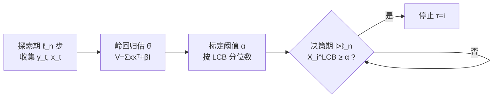

# Learning in Prophet Inequalities with Noisy Observations

**会议**: ICLR 2026  
**OpenReview**: [https://openreview.net/forum?id=TOyf8Z4y22](https://openreview.net/forum?id=TOyf8Z4y22)  
**代码**: [https://github.com/junghunkim7786/LearningProphetInequalityNoisyObservation](https://github.com/junghunkim7786/LearningProphetInequalityNoisyObservation)  
**领域**: 学习理论 / 在线决策 / 最优停止  
**关键词**: prophet inequality, 最优停止, 在线学习, 噪声观测, LCB 阈值, 竞争比  

## 一句话总结
在分布未知、且每步只能看到带噪声观测的「特征线性奖励」prophet 不等式里，作者用"边学边停"的 LCB 阈值策略，无需任何离线样本就在 i.i.d. 情形拿到最优竞争比 $1-1/e$、在非同分布情形拿到 $1/2$。

## 研究背景与动机
**领域现状**：prophet 不等式是最优停止的经典问题——赌徒顺序看到 $n$ 个奖励，每步只能不可撤销地"接受并停止"或"放弃继续",目标是让期望收益逼近"先知"(提前知道全部实现值)的 $E[\max_i X_i]$。在分布已知时,单阈值策略在非同分布下达到最优竞争比 $1/2$ (Samuel-Cahn 1984),在 i.i.d. 下达到 $1-1/e$ (Hill & Kertz 1982)。

**现有痛点**：现实中分布几乎从不已知。已知的负面结果非常硬:分布未知时,单序列在线学习几乎学不到东西——最佳竞争比只有 $1/e\approx0.368$(就是经典秘书算法)。想拿到更高的 $1-1/e$ 或 $1/2$,要么需要额外 $\Theta(n)$ 条离线样本,要么需要把决策问题重复独立地玩很多遍(regret 最小化设定)。这两类资源在真实场景里往往都拿不到。

**核心矛盾**：更糟的是,本文设定里赌徒连真实奖励都看不到,只能看到带噪声的观测 $y_i = X_i + \eta_i$。作者证明(Proposition 4.1):仅靠带噪声观测,即使完全知道分布,也能构造实例让竞争比塌缩到 $0$——这正是为什么前人(Assaf et al. 1998)只能退而对一个更弱的贝叶斯版先知做保证。

**本文目标**：在"分布未知 + 无离线样本 + 单序列 + 只见噪声观测"这个最苛刻组合下,针对经典(而非弱化)先知基准 $E[\max_i X_i]$,恢复出 $1-1/e$ 和 $1/2$ 的最优竞争比。

**核心 idea**：**用结构破局**——假设奖励服从特征线性模型 $X_i = x_i^\top\theta$,赌徒虽看不到 $X_i$、不知道 $\theta$,但每步能看到特征 $x_i$ 并知道其分布 $D_x$。于是"探索"既能积累 $(y_i,x_i)$ 对来估 $\theta$、又能等待更好机会,作者把估计与停止耦合进**下置信界(LCB)阈值**规则,用置信下界主动对冲估计不确定性,从而绕开噪声导致的塌缩。

## 方法详解

### 整体框架
所有算法共享一个"探索期估 $\theta$ → 决策期用 LCB 阈值停"的骨架:先用一段长度 $\ell_n=o(n)$ 的探索收集 $(y_t,x_t)$,岭回归估出 $\hat\theta = V^{-1}\sum_t y_t x_t$(其中 $V=\sum_t x_t x_t^\top + \beta I_d$);进入决策期后,对每个新到的 $x_i$ 算出奖励的下置信界 $X_i^{\mathrm{LCB}}=x_i^\top\hat\theta-\xi(x_i)$,一旦它超过事先标定的阈值 $\alpha$ 就停。关键在于阈值 $\alpha$ 是按 LCB 的分位数标定的(而非按点估计),这把噪声与估计误差显式吸收进决策,从而把竞争比的损失控制在一个随 $\ell_n$ 增大而消失的余项 $\varepsilon_n$ 里。

这一骨架被三处变体复用:ε-Greedy 把探索散到整个时间轴、动态重标阈值;非同分布把阈值换成"半个期望最大值";窗口访问则在探索末尾给一次回看以对齐标准先知。下面逐一展开。

符号速览:
- $X_i = x_i^\top\theta$:第 $i$ 步真实奖励,$\theta$ 未知潜参数,$x_i\sim D_{x,i}$ 为可见特征。
- $y_i = X_i+\eta_i$:唯一可观测量,$\eta_i$ 为 $\sigma$-sub-Gaussian 噪声。
- $\hat\theta=V^{-1}\sum_t y_t x_t$:岭回归估计,$V=\sum_t x_t x_t^\top+\beta I_d$。
- $\xi(x_i)=\sqrt{x_i^\top V^{-1}x_i}\,(\sigma\sqrt{d\log(\cdot)}+\sqrt{S\beta})$:置信半径(椭球范数)。
- $\lambda=\lambda_{\min}(E[xx^\top])$:特征协方差最小特征值,需 $\lambda>0$ 保非退化。
- $\mathrm{OPT}=E[\max_i X_i]$:先知基准,也是竞争比的分母。

### 关键设计
**1. LCB 阈值:把"不确定性惩罚"塞进停止规则。** 不直接用点估计 $x_i^\top\hat\theta$ 做阈值判断,而是减去一个椭球置信半径 $\xi(x_i)=\sqrt{x_i^\top V^{-1}x_i}\,(\sigma\sqrt{d\log(\cdot)}+\sqrt{S\beta})$ 得到 $X_i^{\mathrm{LCB}}=x_i^\top\hat\theta-\xi(x_i)$。这个减法是悲观主义:对估计方差大的方向更保守,避免被噪声"虚高"的奖励骗去过早停止。阈值本身则用 $D_x$ 下 LCB 的分位数标定——i.i.d. 时令 $P_{z\sim D_x}(Z^{\mathrm{LCB}}\le\alpha)=1-\tfrac1n$,即只让约 $1/n$ 概率的样本越过门槛,恰好复刻已知分布下 $1-1/e$ 最优单分位阈值的行为。最终 Theorem 4.2 给出竞争比 $\ge 1-1/e-\varepsilon_n$,而 $\varepsilon_n=O\big(\tfrac{1}{\mathrm{OPT}}\sqrt{L(\sigma^2 d+S)\log(Ln)/(\lambda\ell_n)}\big)$ 随探索量增大而消失。

**2. OPT 非退化条件:让噪声下的学习"够得着"。** Proposition 4.1 已说明无额外假设竞争比可塌缩到 0,根因是当最优值 $\mathrm{OPT}=E[\max_i X_i]$ 太小时,噪声相对奖励的尺度过大、信噪比不足以学出 $\theta$。作者据此引入一个温和的尺度条件:取 $\ell_n=\tfrac{L(\sigma^2 d+S)}{\lambda}f(n)\log(Ln)$,只要 $\mathrm{OPT}=\omega(1/\sqrt{f(n)})$(例如 $f(n)=n^{2/3}$,实践中只需 $\mathrm{OPT}\ge C>0$),余项 $\varepsilon_n\to0$,于是 Corollary 4.3 干净地拿到 $1-1/e$。值得注意的是该框架允许支撑集与方差随 $n$ 发散(如 $L=\sqrt n$),比前人只能处理固定分布域的结果更宽。

**3. ε-Greedy 变体:把探索摊到整个时间轴。** Explore-then-Decide 把探索集中在前段,这在广告/推荐等场景里不自然(决策机会应均匀散布)。ε-Greedy 版每步以 $\varepsilon=\sqrt{\ell_n/n}$ 抛硬币:为 1 则探索并增量更新 $\hat\theta_i,V_i$,为 0 则用**动态阈值** $\alpha_i$(随当前估计实时重标 $P(Z_i^{\mathrm{LCB}}\le\alpha_i)=1-\tfrac1n$)做停止判断。Theorem 4.4 证明它拿到与 Corollary 4.3 完全相同的 $1-1/e$,同时保证决策时刻在时间轴上均匀随机。

**4. 非同分布:松弛基准 + 单次窗口访问拿回最优。** 分布不同分布时,Proposition 5.2 表明即使无噪声也必须牺牲前段来学 $\theta$,对原始先知竞争比会随维度 $d$ 趋零,故先对**松弛先知** $E[\max_{i>\ell_n}X_i]$ 用阈值 $\alpha=\tfrac12 E[\max_s z_s^\top\hat\theta]$ 拿到 $1/2$(Theorem 5.1)。要拿回对**标准先知**的 $1/2$,引入"窗口访问":在 $\ell_n+1$ 时刻给一次大小为 $\ell_n+1$ 的回看窗口,可在 $[\ell_n+1]$ 中任选索引停止——仅需这一次窗口访问,Theorem 5.4 即达到最优 $1/2$,与 Proposition 5.3 给出的上界吻合。等价地,用 $\ell_n$ 条离线样本也能拿到同样结果(Remark 5.5)。

## 实验关键数据
合成数据,高斯噪声方差 $\sigma^2$,$d=2$、$\ell_n=n^{2/3}$、$\beta=1$;因无现成可比方法,以 Gusein-Zade 规则(跳过前 $n/e$ 个、再停在首个超过前缀最大值者,保证 $1/e$)为基线。所有结果在多次独立 Monte Carlo 运行上平均。

### 主实验(i.i.d.,n=100,000)

| 算法 | 竞争比目标 | 表现 |
|------|-----------|------|
| ETD-LCBT(iid) (Alg.1) | $1-1/e$ | 稳定超过 $1-1/e\approx0.632$ |
| ε-Greedy-LCBT (Alg.2) | $1-1/e$ | 稳定超过 $1-1/e$ |
| Gusein-Zade(基线) | $1/e$ | 明显低于上两者 |

### 非同分布(n=30,000)

| 算法 | 竞争比目标 | 表现 |
|------|-----------|------|
| ETD-LCBT-WA (Alg.3,窗口访问) | $1/2$ | 超过 $1/2$,与 Theorem 5.4 一致 |
| ETD-LCBT(non-iid) (Alg.1) | 松弛基准 $1/2$ | 对标准先知经验上也超过 $1/2$ |
| Gusein-Zade(基线) | — | 低于上两者 |

### 关键发现
- 两套实验中本文方法均显著优于 Gusein-Zade 基线,且**随噪声 $\sigma^2$ 增大,性能差距反而拉大**——LCB 的悲观惩罚使方法对观测噪声更鲁棒。
- 窗口访问版 ETD-LCBT-WA 一致优于纯松弛基准版,验证"一次回看"足以把保证从松弛先知提升回标准先知。
- 即便仅针对松弛基准给出理论保证的 ETD-LCBT(non-iid),经验上对**标准**先知也越过了 $1/2$,说明理论是保守界、实际更优。

## 亮点与洞察
- **用结构假设撬动不可能结果**:在分布未知的单序列设定里,$1/e$ 是已知硬上界;本文通过"特征线性 + 可见特征分布"这一结构,把它推到了 $1-1/e$,且无需任何离线奖励样本。
- **悲观主义(LCB)恰好是噪声下停止的正确工具**:减去置信半径既防止被噪声虚高骗停,又能把分位阈值对齐到已知分布下的最优策略,理论与直觉高度统一。
- **把"竞争比塌缩"精确归因到 OPT 尺度**,并给出可操作的温和非退化条件,使负面结果(Prop 4.1)与正面保证(Cor 4.3)形成自洽闭环。
- **"一次窗口访问"这一极简放松**就够拿回非同分布的最优 $1/2$,实践代价极低(对应面试场景"可短暂回看几位候选人")。

## 局限与展望
- **强结构假设**:奖励严格线性 $X_i=x_i^\top\theta$ 且特征分布 $D_x$ 可采样,现实奖励往往非线性、特征分布也未必已知,放松到广义线性/非参数是自然方向。
- **仅合成实验**:$d=2$ 的小规模仿真,缺真实广告/招聘/推荐数据验证,且未给出竞争比的数值表格(只有柱状图)。
- **渐近保证**:核心结论是 $n\to\infty$ 的渐近竞争比,有限 $n$ 下 $\varepsilon_n$ 余项与样本复杂度的实际刻画仍偏理论。
- **OPT 非退化条件**虽温和,但在 $\mathrm{OPT}\to0$ 的退化场景仍无意义保证,是噪声设定的本质难点。

## 相关工作与启发
- **已知分布 prophet**:Samuel-Cahn (1984) 的 $1/2$、Hill & Kertz (1982) 的 $1-1/e$ 是本文要在未知+噪声下复刻的目标基准。
- **未知分布 prophet**:Correa et al. (2019a) 证明单序列只能 $1/e$、要 $1-1/e$ 需 $\Theta(n)$ 离线样本;Rubinstein et al. (2019) 同理给出非同分布的 $\Theta(n)$ 要求——本文用结构信息绕开了这一离线样本需求。
- **重复序列/bandit 设定**:Gatmiry et al. (2024)、Liu et al. (2025) 靠重复独立轮次聚合信息,本文强调自己是更难的单序列。
- **噪声观测**:Assaf et al. (1998) 只能对弱化的贝叶斯先知保证,本文针对经典先知。
- **窗口访问**:沿用 Marshall et al. (2020)、Benomar et al. (2024) 的回看放松。
- **启发**:把"在线学习的置信界(LCB/UCB)"嫁接到"最优停止"上,是连接 bandit 理论与 prophet 不等式的一座桥;对任何"边探索边做不可撤销决策"的问题(动态定价、招聘、实时竞价)都有借鉴价值。

## 评分
- **新颖性**: ⭐⭐⭐⭐⭐ 把"特征线性 + 噪声观测 + 无离线样本 + 单序列"这一全新组合形式化,并用 LCB 阈值绕开 $1/e$ 硬上界,设定与方法都新。
- **实验充分度**: ⭐⭐⭐ 仅 $d=2$ 合成数据、无真实场景、无数值表格,但能清晰验证理论趋势与噪声鲁棒性。
- **写作质量**: ⭐⭐⭐⭐ 负面结果与正面保证层层递进、动机清晰,理论陈述严谨;偏理论读者门槛略高。
- **价值**: ⭐⭐⭐⭐ 理论上把未知分布 prophet 的可达竞争比从 $1/e$ 推到 $1-1/e$,对在线决策/机制设计有扎实贡献,落地仍需放松结构假设。

<!-- RELATED:START -->

## 相关论文

- [\[ICLR 2026\] Noisy-Pair Robust Representation Alignment for Positive-Unlabeled Learning](noisy-pair_robust_representation_alignment_for_positive-unlabeled_learning.md)
- [\[CVPR 2026\] Debiased Sample Selection for Learning with Noisy Labels](../../CVPR2026/others/debiased_sample_selection_for_learning_with_noisy_labels.md)
- [\[CVPR 2026\] Bootstrapping Multi-view Learning for Test-time Noisy Correspondence](../../CVPR2026/others/bootstrapping_multi-view_learning_for_test-time_noisy_correspondence.md)
- [\[ICCV 2025\] Joint Asymmetric Loss for Learning with Noisy Labels](../../ICCV2025/others/joint_asymmetric_loss_for_learning_with_noisy_labels.md)
- [\[ECCV 2024\] Foster Adaptivity and Balance in Learning with Noisy Labels](../../ECCV2024/others/foster_adaptivity_and_balance_in_learning_with_noisy_labels.md)

<!-- RELATED:END -->
