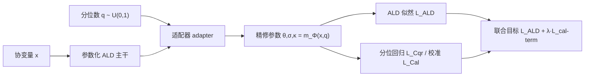

# Learning Survival Distributions with Individually Calibrated Asymmetric Laplace Distribution

**会议**: ICLR 2026  
**OpenReview**: [https://openreview.net/forum?id=frv3s3AtUD](https://openreview.net/forum?id=frv3s3AtUD)  
**代码**: [https://github.com/demingsheng/ICALD](https://github.com/demingsheng/ICALD)  
**领域**: 生存分析 / 概率方法 / 不确定性校准  
**关键词**: 生存分析, 个体校准, 非对称拉普拉斯分布, 分位数回归, pinball loss, PAIC  

## 一句话总结
本文提出 ICALD，把分位数回归的 pinball loss 重新解读为非对称拉普拉斯分布（ALD）的负对数似然，从而在一个参数化框架里同时吃下参数法的平滑性与非参数法的灵活性，并在理论上证明所得生存模型「大概率近似个体校准」（PAIC），在精度、一致性、尤其是细粒度校准三方面同时打过 12 个基线。

## 研究背景与动机
**领域现状**：生存分析建模 time-to-event（病人生存期、设备失效时间等），常按分布假设强弱分为参数法（指数 / Weibull / 对数正态 / ALD）、半参数法（Cox 比例风险）、非参数法（RSF、GBM、DeepHit、CQRNN）。近年神经网络版本（DeepSurv、DeepHit、CQRNN）大幅提升了表达力，但评测重心几乎都压在**预测精度**与**一致性（concordance，能否正确排序风险）**上。

**现有痛点**：校准（calibration，预测的生存概率是否可信）被严重忽视，尤其是**细粒度的个体校准**。校准可分三层——平均校准（整个测试集对得上）、群体校准（每个子群对得上）、个体校准（每个病人 $x$ 自己的预测 CDF 对得上）。个体校准对「这位病人是否够格上高风险干预」这类高风险决策最关键，却最难做、最少人碰。

**核心矛盾**：现有两条 ALD 路线各有死穴。**非参数分位数回归（CQRNN）**：每个头只能估一个分位数 $y_q$，分位网格稀疏会带来逼近误差，加密分位数又要训多个相互独立的模型，既贵又缺全局一致性，还会出现「分位数交叉」（高分位预测反而低于低分位，违反 $\tilde y_{q_1}\ge\tilde y_{q_2}$）。**参数化 ALD**：闭式 PDF/生存函数带来平滑与高效，但用单一 ALD 套整条分布太死板，尾部逼近误差大，甚至发生「分布失配」——估计分布系统性偏离真值，一致地高估或低估。

**本文目标**：在统一框架里既保留参数法的平滑闭式，又拿回非参数法的逐分位灵活性，并给出个体校准的理论保证。

**核心 idea**：**`从 pinball loss 到 ALD 的概率重参数化`** —— 先证明 pinball loss 本质是 ALD 分位数形式的负对数似然，于是分位数回归和参数 ALD 是同一枚硬币两面；再让 ALD 的参数额外依赖随机采样的分位数 $q$，把模型变成「ALD 的连续混合」，用分位回归损失把它逼成个体校准的。

## 方法详解

### 整体框架
ICALD 以一个**参数化 ALD 主干**保证整条分布全局连续平滑，再挂一个把分位数 $q$ 当输入的**适配器（adapter）模块**，输出随 $q$ 精修的 ALD 参数 $\{\theta,\sigma,\kappa\}=m_\Phi(x,q)$。训练时对每个样本随机采 $q\sim U(0,1)$，同时优化「全分布的 ALD 似然」+「该 $q$ 处的分位回归损失」，使模型在保持光滑的同时逐个分位对齐。测试时对 2000 个 $q$ 采样平均，等价于一个 ALD 连续混合分布；该框架进一步支持**预校准 / 后校准**两种部署方式与两种等价损失自由组合。

### 关键设计

**1. pinball loss = ALD 负对数似然：打通参数与非参数：** 这是全文的概率地基。分位数回归用的 pinball 损失 $L_{\text{pinball}}(y;\Phi,q)=(y-m_{\Phi,q}(x))(q-\mathbb{I}[m_{\Phi,q}(x)>y])$ 被证明等于 ALD 分位数形式 $\mathrm{AL}(\theta=\tilde y_q,\sigma=1,q)$ 的负对数似然（差一个常数）。这个等价关系让「逐点估分位数」可以无缝升级成「估整条参数分布」：换用 ALD 的非对称形式 $\mathrm{AL}(\theta,\sigma,\kappa)$（其中 $q=\kappa^2/(1+\kappa^2)$），用 $\{\theta,\sigma,\kappa\}=m_\Phi(\cdot)$ 直接输出位置、尺度、非对称三参数，损失就成了带删失的负对数似然 $L_{\text{ALD}}=-\sum_{D_O}\log f_{\text{ALD}}-\sum_{D_C}\log S_{\text{ALD}}$，删失样本用生存函数 $S_{\text{ALD}}=1-F_{\text{ALD}}$ 计入。正因有了这层概率解读，两条原本割裂的路线被统一进同一个似然框架。

**2. 分位数条件化的 ALD 连续混合：兼得平滑与灵活：** 为了不再被「单个 ALD 太死板」或「多头互相独立」夹击，ICALD 让适配器吃 $q$ 产出 $m_\Phi(x,q)$，训练目标合成两项：$L_{\text{ALD+Cqr}}(y;\Phi)=L_{\text{ALD}}(y;\Phi)+\lambda L_{\text{Cqr}}(y;\Phi,q)$。其中 ALD 似然负责抓住条件分布的整体形状，分位回归项在每个随机 $q$ 上做局部校准微调，$\lambda$ 平衡两者。从概念上看，对 $q$ 边缘化后模型是一个 ALD 的连续混合 $\int dq\,p(q)f_{\text{ALD}}(y;m_\Phi(x,q))$（$p(q)=U(0,1)$）——主干给全局轮廓、适配器做局部纠偏。混合后虽不再是单个 ALD，但其 CDF 仍有闭式表达，可算均值/中位数等标量摘要，还能直接套 SHAP 做个体级因子归因。

**3. 两套等价损失 + PAIC 理论保证：** 除分位回归外，作者给出一个直接定义在预测 CDF 上的等价校准损失 $L_{\text{Cal}}(y;\Phi,q)=|F_\Phi(y|x,q)-q|$，并据此得到第二种训练目标 $L_{\text{ALD+Cal}}=L_{\text{ALD}}+\lambda L_{\text{Cal}}$。关键在于：把 $q$ 当成模型输入后，可评估 $\Pr(y\le F_\Phi^{-1}(q|x,q))$ 跨所有分位的校准，从而把原本难以经验验证的 PAIC 扩展成**单调 PAIC（MPAIC）**——任何连续函数都可按分位排序变单调。作者证明用 $L_{\text{ALD+Cqr}}$ 或 $L_{\text{ALD+Cal}}$ 训练的 ICALD 是 $(\epsilon,\delta)$-MPAIC，再由 Theorem 1「MPAIC 是 PAIC 的充分条件」推出模型也是 $(\epsilon',\delta\frac{1-\epsilon}{\epsilon'-\epsilon})$-PAIC；Theorem 2 进一步说明采样越多 $q$，蒙特卡洛逼近越好、个体校准越强。这给了「为什么这么训能校准」一个干净的理论交代。

**4. 预校准 / 后校准的解耦部署：** 预校准（边训边校）在重尾数据上可能遇到似然损失与校准损失「异步收敛」，作者用 warm-up（先只训似然、后期再加校准项）缓解。更轻量的是**后校准**：把预校准模型拆成基模型 $m_\Phi^{\text{Base}}(x)$ 与后校准适配器 $m_\Phi^{\text{Post}}(x,q)$，关系为 $m_\Phi^{\text{Pre}}(x,q)=\gamma\odot\{\theta_q,\sigma_q,\kappa_q\}$，即适配器对基模型的三个 ALD 参数输出逐元素缩放因子 $\gamma\in\mathbb{R}^3$。后校准是即插即用的后处理，不改原架构、不重训，避免早期训练的梯度冲突。由于适配器对 backbone 不可知、损失只需可算的 CDF，该后校准器还能当**通用校准器**挂到 RSF / DeepSurv / DeepHit 等其他生存模型上（非参数模型需先把离散 CDF 插值成连续、并加非交叉约束）。实现上还用了「加深校准锚点」（每层拼接 $q$）与「加宽校准锚点」（把标量 $q$ 扩成小向量）两个工程技巧增强表达。

## 实验关键数据
评测覆盖 **14 个合成 + 7 个真实数据集**（healthcare/oncology，沿用 Pearce et al. 2022 的套件），7 个指标横跨预测精度、一致性、校准三类，每组跑 5 个随机 split。对比 9 个强基线（含 (半)参数 / 非参数、神经 / 非神经）外加 1 个预校准方法 X-CAL、2 个后校准方法 CSD 与 CiPOT，共 12 个基线。

### 主实验（预校准 ICALD，胜/负/平计数，56 次成对比较）

| 对比 | better | worse | equal | 解读 |
|---|---|---|---|---|
| $L^{\text{Pre}}_{\text{ALD+Cal}}$ vs $L_{\text{ALD}}$ | 22 | 0 | 34 | 校准项从不变差，约 39% 显著更好 |
| $L^{\text{Pre}}_{\text{ALD+Cal}}$ vs $L_{\text{Cqr}}$ | 23 | 1 | 32 | 几乎全面压过纯分位回归 |
| $L^{\text{Pre}}_{\text{ALD+Cal}}$ vs $L^{\text{Pre}}_{\text{ALD+Cqr}}$ | 36 | 0 | 20 | Cal 损失 64.3% 胜、0 负，明显优于 Cqr 损失 |
| $L^{\text{Pre}}_{\text{ALD+Cal}}$ vs $L^{\text{Pre}}_{\text{X-CAL}}$ | 25 | 3 | 28 | 半数显著更好，对预校准基线 X-CAL 占优 |

### 后校准实验（$L^{\text{Post}}_{\text{ALD+Cal}}$ 对比，部分指标）

| 对比 | better | worse | equal | 解读 |
|---|---|---|---|---|
| vs $L^{\text{Post}}_{\text{ALD+Cqr}}$（平均校准） | 16 | 1 | 4 | Cal 损失后校准压过 Cqr |
| vs $L^{\text{Post}}_{\text{ALD+CSD}}$（平均校准） | 14 | 5 | 2 | 优于后校准基线 CSD |
| vs $L^{\text{Post}}_{\text{ALD+CiPOT}}$（平均校准） | 11 | 3 | 7 | 优于后校准基线 CiPOT |

### 关键发现
- **校准损失 $L_{\text{Cal}}$ 普遍优于分位回归损失 $L_{\text{Cqr}}$**：无论预/后校准，直接对 CDF 优化的 Cal 形式胜率更高、负例更少（预校准下 36:0:20）。
- **校准项不损精度/一致性**：加入校准从未显著拉低精度（worse 列常为 0），说明预测精度、concordance、calibration 三类指标可同时改善而非此消彼长。
- **后校准既简单又有效**：作为即插即用后处理，对 X-CAL、CSD、CiPOT 等专门校准方法仍占优，且避免预校准在重尾数据上的异步收敛问题。
- **个体校准是主要受益项**：相对平均/群体校准，ICALD 在个体校准（最难、对病人级决策最关键）上的提升最能体现「让 $q$ 进模型 + 连续混合」设计的价值。
- **两套等价损失实证一致**：理论上 $L_{\text{Cqr}}$ 与 $L_{\text{Cal}}$ 在 $m_\Phi(x,q)$ 假设下等价，实验中两者趋势相符、Cal 形式略优，印证了 MPAIC 双条件的等价性。

## 亮点与洞察
- **一个等价关系撬动整篇文章**：把 pinball loss 认成 ALD 的 NLL，是把「非参数分位回归」与「参数生存分布」统一起来的支点，思路干净且可迁移。
- **MPAIC → PAIC 的桥**：通过把 $q$ 喂进模型并假设单调，将「难以经验验证的个体校准」转成「可采样评估的单调校准」，再用充分条件定理回到 PAIC，理论闭环漂亮。
- **连续混合 ALD 仍保闭式 CDF**：兼顾灵活与可解释，能直接接 SHAP 做个体/群体归因，对临床落地友好。
- **预/后校准 × 两种损失的自由组合**：把「校准策略」和「损失函数」解耦成两个正交维度，使用者可按场景（追求精度还是稳定性、能否重训）独立挑选，框架弹性强。
- **后校准器可通用**：与 backbone 解耦、只依赖可算 CDF，潜在能给 RSF/DeepSurv/DeepHit 当外挂校准模块。

## 局限与展望
- **非参数模型适配有摩擦**：把通用后校准器挂到 RSF/DeepHit 上需先插值出连续 CDF 并加非交叉约束，DeepHit 本身多损失叠加还可能引入训练不稳，通用性带星号。
- **重尾数据的异步收敛**：预校准在重尾数据上需 warm-up 缓解似然与校准损失收敛速度不一致，说明联合优化并非总能稳态。
- **测试期蒙特卡洛成本**：靠对 2000 个 $q$ 采样平均近似连续混合，推理开销与近似质量需权衡（Theorem 2 也指出采样越多越好）。
- **单调性靠假设/排序兜底**：MPAIC 推导依赖 $m_\Phi(x,q)$ 对 $q$ 单调，非单调时需事后排序修正，可能与端到端学习目标产生张力。
- **评测仍偏中小规模表格数据**：数据集来自既有生存分析套件，向图像/文本等高维输入的可扩展性仅在论述层面提出，未充分实证。

## 相关工作与启发
- **参数生存模型**：LogNorm-MLE、DSM（深度生存混合）、以及作者前作的参数 ALD（Sheng & Henao 2025）——本文正是去修复其分布失配问题。
- **非参数 / 神经生存模型**：DeepSurv（半参数 Cox）、DeepHit、CQRNN（分位回归 + Portnoy 删失估计）——本文修复其离散化与分位交叉。
- **校准理论**：Gneiting et al. 2007 的平均/群体/个体校准分层、Zhao et al. 2020 的 PAIC 定义与重参数化思路是本文 MPAIC 的直接来源。
- **后校准基线**：X-CAL（预校准）、CSD、CiPOT（后校准）针对平均校准，本文主打更细粒度的个体校准。
- **评测体系**：预测精度（IBS/Graf 等）、concordance（Harrell's C、Uno's C）、校准（Haider et al. 2020）三类指标共同界定了「好生存模型」的多维标准，本文强调三者可兼得。
- **启发**：「把某个常用 loss 反推成某个分布的 NLL，从而打通参数 vs 非参数」是个可复用的范式，值得迁移到其他带 pinball/分位结构的任务（如概率预测、UQ）。

## 评分
- **新颖性**: ⭐⭐⭐⭐ —— pinball↔ALD 等价 + MPAIC→PAIC 桥接是有分量的概念贡献，虽建立在 Zhao et al. 2020 的 PAIC 框架之上但整合得很扎实。
- **实验充分度**: ⭐⭐⭐⭐ —— 21 个数据集 × 7 指标 × 12 基线 × 5 split，预/后校准与两种损失全交叉对比，覆盖面广；偏中小规模表格数据、缺高维输入实证。
- **写作质量**: ⭐⭐⭐⭐ —— 动机—理论—部署逻辑清晰，定义/定理层层递进；符号与多组损失记号较密集，读者需要一定耐心。
- **价值**: ⭐⭐⭐⭐ —— 个体校准对高风险临床决策意义大，统一框架 + 通用后校准器有实际落地潜力，代码开源。

<!-- RELATED:START -->

## 相关论文

- [\[ICLR 2026\] Learning Distributions over Permutations and Rankings with Factorized Representations](learning_distributions_over_permutations_and_rankings_with_factorized_representa.md)
- [\[ICLR 2026\] Learning Adaptive Distribution Alignment with Neural Characteristic Function for Graph Domain Adaptation](learning_adaptive_distribution_alignment_with_neural_characteristic_function_for.md)
- [\[ICLR 2026\] Bayesian Post Training Enhancement of Regression Models with Calibrated Rankings](bayesian_post_training_enhancement_of_regression_models_with_calibrated_rankings.md)
- [\[ICCV 2025\] Joint Asymmetric Loss for Learning with Noisy Labels](../../ICCV2025/others/joint_asymmetric_loss_for_learning_with_noisy_labels.md)
- [\[ICLR 2026\] DA-AC: Distributions as Actions — A Unified RL Framework for Diverse Action Spaces](distributions_as_actions_a_unified_framework_for_diverse_action_spaces.md)

<!-- RELATED:END -->
