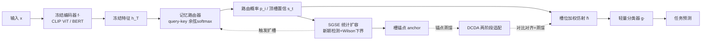

# MaRS: Memory-Adaptive Routing for Reliable Capacity Expansion and Knowledge Retention

**会议**: ICLR 2026  
**OpenReview**: [https://openreview.net/forum?id=GGrLeik2qo](https://openreview.net/forum?id=GGrLeik2qo)  
**代码**: 待确认  
**领域**: 持续学习 / 终身学习, 参数高效适配  
**关键词**: continual learning, frozen pre-trained models, slot routing, statistical expansion, knowledge distillation  

## 一句话总结
MARS 在冻结大模型骨干上挂一个槽位记忆路由器，用统计假设检验决定"何时扩容"（SGSE），用对比+蒸馏两阶段决定"如何融合"（DCDA），在不回放原始数据的前提下兼顾可塑性与稳定性，且扩容与遗忘都有形式化保证。

## 研究背景与动机
- **领域现状**：CLIP、BERT 这类大预训练模型（LPM）已成为视觉/语言任务的通用骨干。持续学习（CL）的主流做法是冻结骨干、只微调轻量任务模块（Adapter、Prompt、LoRA），既省算力又保留泛化能力。
- **现有痛点**：冻结骨干下持续学习的稳定性-可塑性矛盾被放大——适配只发生在浅层模块，可塑性受限，而固定骨干又加剧灾难性遗忘。已有招式各有硬伤：回放法有隐私与存储顾虑；正则法随任务累积纠偏信号衰减；动态扩容法靠启发式触发，容易无节制膨胀；原型法在分布漂移下脆弱。
- **核心矛盾**：现有冻结 LPM 上的持续学习方法证明了可行性，但**扩容与保留都缺乏有原则、有保证的机制**——扩多少、何时扩、怎么不忘，全靠 ad-hoc 规则拍脑袋。
- **本文目标**：给"何时扩容"和"如何融合新容量"两个问题各配一个统计/理论上可证的机制，让槽位路由既可控又能保留旧知识。
- **核心 idea**：**[解耦表示与容量]** 把"稳定表示"（冻结编码器）与"自适应容量"（可扩展槽位）解耦，把持续学习的控制权下放到路由层；**[统计化扩容]** 把扩容建模成带误报率/检测延迟保证的统计决策；**[无回放保留]** 用槽位锚点（anchor）作为旧知识的压缩代理做蒸馏，绕开原始样本回放。

## 方法详解

### 整体框架
MARS 由三件套组成：冻结编码器 $f(\cdot)$ 提供稳定特征 $h_T=f(x)$；基于槽位的记忆路由器把输入动态分配到可扩展的记忆槽，每个槽是一组仿射参数 $(\gamma_i,\beta_i)$ 作为独立适配器（初始化为恒等映射 $\gamma_i=1,\beta_i=0$）；轻量分类器 $g(\cdot)$ 输出预测。在这套架构上叠两个机制：SGSE 管"何时/在哪扩槽"，DCDA 管"怎么把新槽融进来又不忘旧的"。

### 关键设计

**1. 路由器与槽位加权仿射：把持续学习控制权交给路由层。** 给定输入 $x_t$，先算 query $q(x_t)=W_q h_T$，再对归一化槽键 $\hat k_i$ 做余弦-softmax 得到路由概率 $p_i(x_t)=\frac{\exp(\langle\hat q,\hat k_i\rangle/\tau_r)}{\sum_j \exp(\langle\hat q,\hat k_j\rangle/\tau_r)}$（$\tau_r=0.07$）。顶槽置信 $s_t=\max_i p_i(x_t)$ 衡量"路由器对当前输入有多笃定"：被覆盖的输入 $s_t\approx 1$，新颖输入因概率分散而 $s_t$ 偏低。槽位输出按概率加权后做仿射变换 $\tilde h=\big(\sum_i p_i\gamma_i\big)\odot\mathrm{LN}(h_T)+\big(\sum_i p_i\beta_i\big)$。论文还证明了 Prop.1：在竞争相似度固定时 $s_t$ 对最优槽相似度 $c_t$ 严格单调递增，使 $s_t$ 成为一个**经过校准的局部新颖性统计量**，而非启发式阈值。

**2. SGSE：把"何时扩容"做成有误报保证的统计检验。** 直接对 $s_t$ 阈值化不可靠（有噪声、非平稳），SGSE 先用指数平滑追踪近期置信的 $(1-\epsilon)$ 分位数 $Q_t=\beta Q_{t-1}+(1-\beta)q_t$（$\beta=0.9,w=10,\epsilon=0.1$），Thm.1 证明 $Q_t$ 在 $L^2$ 意义下收敛到长期分位数，且检测延迟可预测为 $O((1-\beta)^{-1})$。随后监控伯努利试验 $\{s_t\ge Q_t\}$ 的成功率 $\hat p_t$，当其**单侧 Wilson 置信下界**跌破阈值才扩槽：$\mathrm{LB}(\hat p_t;n,z)$（$n=20,z=1.645$，95% 单侧）。Cor.1 给出每次检验的误扩概率 $\le\alpha$，使扩容是数据驱动而非噪声触发。新槽用近期低 $s_t$ 样本的均值 query 初始化，收敛快约 15%。

**3. DCDA：两阶段对比-蒸馏把新槽融进来又不忘旧的。** 把适配拆成两步。**阶段一（只更新记忆）** 冻结分类器 $g$，只更新 $(W_q,K,\gamma,\beta)$，用监督对比损失 $L_{\text{supcon}}$ 拉开类间、加平滑项 $L_{\text{smooth}}=\frac1N\sum\|\tilde h_i-h_{T,i}\|_2^2$ 抑制特征漂移，目标 $L^{(1)}=L_{\text{supcon}}+\lambda_{\text{smooth}}L_{\text{smooth}}$（$\lambda_{\text{smooth}}=0.3$）。**阶段二（只更新分类头）** 固定记忆，只训 $g$，主损失为交叉熵，外加两个蒸馏项：当前输入上的 LwF 蒸馏 $L_{\text{LwF}}$ 与在槽锚点上的锚点蒸馏 $L_{\text{anchor}}$（$T=3$），目标 $L^{(2)}=L_{\text{CE}}+\lambda_{\text{LwF}}L_{\text{LwF}}+\lambda_{\text{anchor}}L_{\text{anchor}}$。

**4. 锚点机制与保留保证：用压缩代理替代原始回放。** 槽位统计量用路由加权 EMA 维护 $\mu_i,c_i$，锚点定义为 $a_i=\gamma_i\odot\big(\mu_i/\max(c_i,\varsigma)\big)+\beta_i$，作为旧分布的压缩代理。Thm.2 借 Pinsker 不等式与分类器 Lipschitz 连续性证明：若锚点在 $\delta$ 球内逼近旧特征、蒸馏使锚点预测一致性在 $\eta$ 内，则旧类预测偏差被界为 $O(\sqrt\eta+L\delta/T)$，旧类精度掉幅同阶——即**无原始回放也有可证的保留**。Prop.2/Thm.3 进一步证明：当真实新颖数 $N_T$ 次线性增长时，计算与显存也次线性增长（$E[S_T]\le S_0+N_T+\alpha M$），避免启发式扩容的无界膨胀。

## 实验关键数据

### 主实验表格
在 CIFAR-100、Tiny-ImageNet（各 10 任务，class-incremental）与 19 个 ASC 情感分类数据集上评测，视觉用冻结 CLIP ViT-B/16、NLP 用冻结 BERT-base，报告全序列后平均精度 $\bar A_T$（3 个种子）。每个 baseline 都在 standard（骨干可训）与 frozen（骨干冻结）两种设置下比较。

| 算法 | CIFAR-100 (Frozen) | Tiny-ImageNet (Frozen) | ASC (Frozen) |
|------|------|------|------|
| Fine-tune | 30.26 | 28.27 | 61.30 |
| EWC | 47.60 | 36.38 | 70.66 |
| DER++ | 51.72 | 40.87 | 75.91 |
| LDC | 53.95 | 43.41 | 75.49 |
| PASS++ | 52.92 | 42.53 | 75.22 |
| **MARS (ours)** | **57.50** | **49.46** | **79.85** |

MARS 全面领先：CIFAR-100/Tiny-ImageNet 上比回放/正则法约高 3–5%，Tiny-ImageNet 上相对 DER++ 提升尤其明显（约 +20% 相对增益）；ASC 上达 78–79%（baseline 停在 74–75%）。standard 与 frozen 设置差距通常仅 1–2%，说明提升来自"如何分配与保留容量"，而非更新骨干。

### 消融实验表格（Tiny-ImageNet）

| 变体 | 最终精度 | 结论 |
|------|------|------|
| Default | ~高 | 完整 MARS |
| No-SGSE | ~41% | 去掉统计扩容，精度骤降 → 扩容机制是容量充足的关键 |
| No-Anchor | ~42% | 去掉锚点，同样大跌 → 锚点对无回放保留至关重要 |
| No-Stage1 | 下降 | 去对比特征适配，判别性变差 |
| No-Stage2 | 下降 | 去分类头蒸馏，保留变弱 |

超参敏感性：$S_0=32$ 最优（太小可塑性不足、太大如 128 槽冗余反而降点）；$\beta=0.9$ 最稳（$\beta=0.5$ 过早扩容、$\beta=0.99$ 反应太慢）。

### 关键发现
- 统计化扩容（SGSE）与无回放锚点保留（DCDA）是两根支柱，各自移除都让性能塌到 41–42%。
- 收益与骨干是否可训无关（standard vs frozen 仅差 1–2%），印证"容量分配与保留"才是冻结 LPM 持续学习的胜负手。

## 亮点与洞察
- **把"何时扩容"从启发式升级为统计假设检验**：用分位数追踪 + Wilson 单侧下界给出误扩概率 $\le\alpha$、检测延迟 $O((1-\beta)^{-1})$ 的形式化保证，这是相对动态扩容类方法最实质的进步。
- **无原始回放却有可证保留**：锚点作为旧分布压缩代理，配合 Pinsker + Lipschitz 把旧类精度掉幅界为 $O(\sqrt\eta+L\delta/T)$，在隐私敏感场景很有吸引力。
- **复杂度可控**：真实新颖次线性增长时计算/显存也次线性，从理论上回避了启发式扩容的无界膨胀。

## 局限与展望
- 路由层把控制权下放到浅层槽位仿射，骨干始终冻结——表达力上限仍受冻结骨干约束，对与预训练分布差异极大的领域可能力不从心。
- 多个关键超参（$S_0,\beta,\tau_r,\lambda$ 系列、Wilson 的 $n,z$）虽给了推荐值，但理论保证依赖 i.i.d./平稳等假设，真实长流非平稳下的鲁棒性需更多验证。
- 评测规模偏中等（CIFAR-100/Tiny-ImageNet/ASC，各 10–19 任务），更长 horizon、更大类数与更强分布漂移下的扩容行为与显存增长曲线值得进一步实测。

## 相关工作与启发
- **回放/正则**：iCaRL、GEM、DER++ 靠回放，EWC、SI、LwF、MAS 靠约束更新——MARS 用锚点蒸馏替代回放、用统计触发替代固定正则。
- **动态扩容/原型**：Progressive Nets、DEN、CEAT 缺乏"何时扩、扩多少"的原则，PASS++、IPC 等原型法在漂移下脆弱——SGSE 正是补上这个"有保证的扩容准则"。
- **冻结 LPM 持续学习**：L2P、DIKI、CoLeCLIP 证明了冻结骨干 + 参数高效适配的价值，但保留多靠启发式回放或任务专调——MARS 把保留也做成有界保证。
- **启发**：把持续学习中"扩容/保留"这类长期靠经验阈值的决策，重写为带误报率与延迟保证的序贯统计检验，是一条值得推广的范式。

## 评分
- **新颖性**: ⭐⭐⭐⭐ 把槽位扩容建模成带 Wilson 下界的统计检验、用锚点替代回放并给出 Pinsker 型保留界，机制设计有原创性。
- **实验充分度**: ⭐⭐⭐ 覆盖视觉+NLP、standard/frozen 双设置、超参与设计消融较完整，但任务序列规模中等、缺更长 horizon 与更强漂移的压力测试。
- **写作质量**: ⭐⭐⭐⭐ 结构清晰，方法-定理-takeaway 三段呼应，公式与保证陈述严谨。
- **价值**: ⭐⭐⭐⭐ 为冻结大模型上的持续学习提供了一套"可控扩容 + 无回放可证保留"的实用框架，隐私敏感与流式场景有落地潜力。

<!-- RELATED:START -->

## 相关论文

- [\[CVPR 2026\] DREAM: Document Recognition with Explicit Adaptive Memory](../../CVPR2026/others/dream_document_recognition_with_explicit_adaptive_memory.md)
- [\[ICLR 2026\] Adaptive Conformal Guidance for Learning under Uncertainty](adaptive_conformal_guidance_for_learning_under_uncertainty.md)
- [\[ICLR 2026\] Hippoformer: Integrating Hippocampus-inspired Spatial Memory with Transformers](hippoformer_integrating_hippocampus-inspired_spatial_memory_with_transformers.md)
- [\[ICLR 2026\] Forget Forgetting: Continual Learning in a World of Abundant Memory](forget_forgetting_continual_learning_in_a_world_of_abundant_memory.md)
- [\[ACL 2025\] Adaptive Retrieval without Self-Knowledge? Bringing Uncertainty Back Home](../../ACL2025/others/adaptive_retrieval_without_self-knowledge_bringing_uncertainty_back_home.md)

<!-- RELATED:END -->
