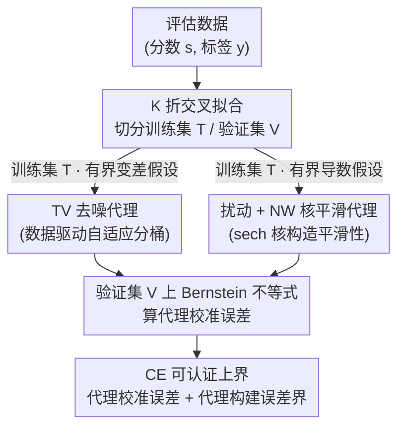

# Measuring Uncertainty Calibration

**会议**: ICLR 2026  
**arXiv**: [2512.13872](https://arxiv.org/abs/2512.13872)  
**代码**: [GitHub](https://github.com/spotify-research/calibration)  
**领域**: 机器学习理论 / 校准  
**关键词**: 校准误差, 有限样本界, 分布无关, 有界变差, 核估计

## 一句话总结

针对二分类器 $L_1$ 校准误差的有限样本估计问题，分别在有界变差和有界导数两种结构假设下，提出了首个非渐近、分布无关的可认证上界方法，其中有界导数假设通过对分类器输出施加微小扰动即可保证，实验表明在 $10^7$ 样本量下可将校准误差上界控制在约 0.02。

## 研究背景与动机

**领域现状**：机器学习模型的输出概率是否与真实事件概率匹配——即校准性（calibration）——对决策任务至关重要。当前最常用的校准度量是 ECE（Expected Calibration Error），通过将模型输出分桶后计算每个桶内的平均误差来估计。然而这种方法对分桶方案的选择高度敏感，不同的桶数和划分方式会给出截然不同的校准误差估计。

**现有痛点**：现有校准测量方法面临一个根本困境。如果将分桶视为分类器的外挂后处理，那么估计值不可靠、完全依赖桶设置（Arrieta-Ibarra et al., 2022 已经证实了这一点）；如果将分桶视为分类器的有机组成部分，则分类性能会受损，因为训练时未考虑分桶操作，梯度无法反向传播通过离散的桶边界。另一类方法（如 KS 检验、Kuiper 检验）将校准问题建模为频率学假设检验，虽然统计功效强，但只能判断"是否完美校准"，无法量化不同模型之间的误校准程度差异，且其理论保证依赖渐近分析。更根本的问题是，Lee et al. (2023) 证明了即使假设校准函数连续都不足以从有限样本一致地估计校准误差。

**核心矛盾**：校准误差估计需要对校准函数 $\eta(s) = \mathbb{E}[Y|S=s]$ 做结构性假设，但假设太强会限制方法的适用范围，假设太弱则样本效率差、界太松。如何在假设强度和估计精度之间取得良好的平衡？

**本文目标** 提供可计算的、有理论保证的校准误差上界，满足三个核心要求：(1) 非渐近——对任意有限样本量都成立，(2) 分布无关——不限制分数分布的形式（可以是离散、连续或混合），(3) 实际可行——在合理的计算和数据量下产出有意义的界。

**切入角度**：作者观察到，虽然无法对任意 $\eta$ 估计校准误差，但可以在两种现实且可验证的结构假设下分别给出保证。第一种是有界变差（弱假设但通用），第二种是有界导数（更强但可通过扰动构造性地保证）。两种方法针对不同应用场景各有所长。

**核心 idea**：通过构造校准函数的代理 $\hat{\eta}$（TV 去噪或 Nadaraya-Watson 核平滑），将校准误差分解为"代理校准误差 + 代理构建误差"，两部分均可从数据中计算并用 Bernstein 不等式建立概率上界。

## 方法详解

### 整体框架

要给校准误差 $\text{CE} = \mathbb{E}_s[|s - \eta(s)|]$ 算一个可认证的上界，根本障碍是校准函数 $\eta(s) = \mathbb{E}[Y|S=s]$ 不可观测、也无法从有限样本一致估计。本文的破局思路是：不直接估 $\eta$，而是构造一个**可计算的代理 $\hat{\eta}$**，再用三角不等式把 CE 拆成两块——一块能从数据算出、一块有理论界：

$$\text{CE} = \mathbb{E}_s[|s - \eta(s)|] \leq \underbrace{\mathbb{E}_s[|\hat{\eta}(s) - s|]}_{\text{代理校准误差}} + \underbrace{\mathbb{E}_s[|\hat{\eta}(s) - \eta(s)|]}_{\text{代理构建误差}}$$

整条流程是：先把评估数据切成训练集 $T$ 和验证集 $V$（实际用 K 折交叉拟合保独立性又不浪费数据）；在 $T$ 上构建代理 $\hat{\eta}$；在 $V$ 上用 Bernstein 不等式算出右边第一项（代理校准误差），再叠加右边第二项的理论上界（代理构建误差），合起来就是 CE 的非渐近、分布无关概率上界。代理 $\hat{\eta}$ 怎么建取决于你愿意接受哪条结构假设，本文给了两条互补的路线：愿意接受弱而通用的**有界变差**就走 TV 去噪，想换更紧的界就主动扰动分类器、构造性地拿到**有界导数**再走 NW 核平滑。

### 关键设计

**1. 有界变差假设下的 TV 去噪方法：用最弱的结构假设换通用性**

第一条路线针对"假设太弱就估不出来"的困境，选了能保证有限样本估计的最弱结构假设之一——校准函数有界变差 $\text{TV}(\eta, [0,1]) \leq V$。在训练集排序之后，方法求解一个 TV 去噪优化问题来构造分段常数代理：

$$\hat{\eta}_T = \arg\min_{v \in [0,1]^{|T|}} \frac{1}{2|T|}\|y_T - v\|_2^2 + \lambda\|Dv\|_1$$

其中 $D$ 是一阶差分矩阵，正则系数 $\lambda$ 由置信度参数 $\delta_1$ 决定，取 $\sqrt{\frac{1}{8|T|}\ln\frac{4(|T|-1)}{\delta_1}}$。解出来的 $\hat{\eta}$ 是分段常数的，本质上是一种数据驱动的自适应分桶——桶的边界和数量完全由数据自己决定，而不是人为指定，这正好绕开了传统 ECE "桶怎么分严重影响结果"的痛点。重建误差 TVB($\delta_1$) 借用 Hütter & Rigollet (2016) 的理论结果给出，再叠加一个总体迁移界 PTB，把只在训练集上成立的保证推广到整个总体。有界变差之所以是合理的默认选择，是因为分类器训练得当时高分数对应高正类概率，$\eta$ 近似单调，而任何单调函数在 $[0,1]$ 上的总变差天然不超过 1，所以直接取 $V=1$ 即可。

**2. 扰动 + 有界导数假设下的 NW 核平滑方法：通过构造让平滑性"免费"成立**

第二条路线想用更强的有界导数假设换更紧的界，但难点在于这种假设通常无法验证。本文最巧妙的一步是不去假设原始分类器有任何好性质，而是主动给它的输出加一层微小随机扰动，让平滑性"被构造出来"。具体做法是对分类器输出 $s_{\text{orig}}$ 按 hyperbolic secant 核采样扰动后的分数 $s \in [0,1]$：

$$k(s\mid s_{\text{orig}}) = \frac{1}{Z}\,\text{sech}\!\left(\frac{s_{\text{orig}} - s}{h}\right)$$

核心引理证明，无论 $\eta_{\text{orig}}$ 原来长什么样，扰动后的校准函数 $\eta$ 一定具有有界一阶导（$\leq \frac{1}{2h}$）和二阶导（$\leq \frac{3}{2h^2}$）。一旦有了导数界，就可以换用更高效的 Nadaraya-Watson 核平滑器构建代理 $\hat{\eta}(s') = \sum_{i \in T} w_i(s') y_i$，其重建误差 $g_T(s')$ 能从数据精确算出、并随样本量衰减。这条路线的收益是双重的：从第一性原理保证了可分析性、避开了不可验证的假设；同时因为有界导数比有界变差更强，理论收敛速率从 $n^{-1/4}$ 提升到 $n^{-1/3}$，样本效率明显改善。选 sech 核而不是截断高斯，则是因为 sech 核在 $[0,1]$ 上的导数界表达式更简洁，让理论结果更干净。

**3. K 折交叉拟合：在不浪费数据的前提下守住训练/验证独立性**

理论上代理 $\hat{\eta}$ 必须在和验证点独立的训练集上拟合，否则浓度不等式的前提不成立；但简单地固定切一刀又会浪费大量数据。本文用 K 折交叉拟合来同时满足这两点：数据分成 $K$ 折，每折轮流当验证集，每个验证点都由没见过它的那部分训练集拟合出的代理来评分，最后聚合各折结果以降低方差。这样既保住了理论所需的训练/验证独立性，又避免了固定划分造成的数据浪费。

### 损失函数 / 训练策略

当使用扰动方法时，需要在训练阶段也考虑扰动的影响。具体做法是修改训练损失函数，使模型在知道推理时会有扰动的前提下优化分类性能。实验表明这一修改的额外训练成本几乎为零。

## 实验关键数据

### 主实验：合成数据上各方法的收敛速率

在四种已知 ground truth 的合成校准函数上评估上界质量与样本量的关系：

| 方法 | 经验收敛速率 | 理论速率 | 所需假设 | 合成数据表现 |
|------|-------------|---------|---------|-------------|
| NW (核平滑) | $[-0.406, -0.213]$ | $-1/3$ | 有界导数 | 所有函数上最紧上界 |
| TV (去噪) | $[-0.423, -0.164]$ | $-1/4$ | 有界变差 | 一致收敛但较松 |
| Lip+Bkt | $[-0.574, -0.346]$ | $-1/3$ | Lipschitz | 速率同 NW 但常数更大 |
| ECE (启发式) | 不一致 | 无保证 | 无 | 第四种函数完全失败 |

NW 方法在所有四种合成函数上均给出最紧的上界。ECE 在前三种函数上表现尚可，但在第四种函数上完全失败——误差不随样本量增大而减小，展示了无保证启发式方法的根本风险。

### 消融实验：扰动带宽对分类性能的影响

| 数据集 | 模型 | $h = 2^{-6}$ AUROC变化 | $h = 2^{-4}$ AUROC变化 | $h = 2^{-6}$ 下校准误差上界 |
|--------|------|----------------------|----------------------|-------------------------|
| IMDB | BERT | $< 0.001$ 下降 | 明显下降 | ~0.02 ($10^7$ 样本) |
| Spam Detection | BERT | $< 0.001$ 下降 | 明显下降 | ~0.02 ($10^7$ 样本) |
| CIFAR | ViT | $< 0.001$ 下降 | 明显下降 | ~0.02 ($10^7$ 样本) |

### 关键发现

- **ECE 不可靠**：在第四种合成校准函数上，ECE 即使样本量无限增长也无法收敛到真实值，说明启发式方法在某些场景下会系统性地给出错误估计
- **NW 的常数优势**：NW 和 Lipschitz 分桶的理论收敛速率相同（$n^{-1/3}$），但 NW 的常数项显著更小，实际上界紧度差异可达数倍
- **扰动几乎无代价**：$h = 2^{-6}$ 的扰动对所有三个真实数据集的 AUROC 影响不到 0.001，但足以保证有界导数从而启用 NW 方法
- **计算高效**：所有方法至多对数线性时间复杂度，NW 的滑动窗口实现为线性时间，约 4 分钟即可完成 64 次重复实验（含样本量至 $10^7$）
- **所有结果统计显著**：64 次重复的置信区间太小以至于图中不可见

## 亮点与洞察

- **扰动保证平滑性**是本文最巧妙的 idea。不需要对原始分类器做任何假设，仅通过一个简单的随机扰动就能构造性地保证校准函数具有有界导数。这种"通过构造获得数学可分析性"的思路可以迁移到其他需要平滑性假设的统计估计问题中
- **TV 去噪 = 自适应分桶**的重新解释赋予了经典的分桶方法全新的理论基础。传统分桶的问题在于桶的选择是人为的，TV 去噪则通过最优化自动确定桶的数量和边界
- **sech 核的选择体现了数学美感与实用性的统一**：相比截断高斯，sech 核在 $[0,1]$ 上的性质更优，导数界的表达式更简洁，这是一个看似细节但影响理论结果优雅程度的关键选择

## 局限与展望

- **仅适用于二分类**：当前理论完全限于二分类器，多分类校准（如 top-1 校准、classwise 校准）的推广是重要的开放问题
- **样本需求依然很高**：需要约 $10^7$ 样本才能将校准误差上界降至 ~0.02，这对于小规模评估集或低频事件预测是不现实的
- **扰动需要重训练**：虽然代价微小，但扰动方法需要在训练损失中加入扰动感知项并重新训练模型，对于已部署的模型只能退而使用更弱的 TV 方法
- **上界为主**：论文主要关注上界，虽然技术上下界也可以给出，但未深入探讨双边界的实用价值

## 相关工作与启发

- **vs ECE 分桶方法**：传统 ECE 是启发式方法，无理论保证且依赖桶设置选择。本文方法提供可认证的概率上界，其中 NW 方法还更紧。但 ECE 胜在计算简单、小样本也能给出一个估计值（尽管不可靠）
- **vs KS/Kuiper 检验方法** (Arrieta-Ibarra et al., 2022)：KS 方法基于累积分数的随机游走性质，统计功效高但只能做"是否完美校准"的二元判断，且依赖渐近理论。本文方法可量化误校准程度、非渐近成立且可解释性更强
- **vs Lipschitz 假设方法** (Vaicenavicius et al., 2019; Futami & Fujisawa, 2024)：之前工作直接假设 Lipschitz 但不证明合理性。本文通过扰动从第一性原理保证有界导数（从而 Lipschitz），且 NW 方法的常数项更优，上界更紧

## 评分

- 新颖性: ⭐⭐⭐⭐ 扰动保证平滑性的 idea 非常新颖优雅，但整体"代理+浓度不等式"框架是标准技巧
- 实验充分度: ⭐⭐⭐⭐ 合成+真实数据覆盖全面，64次重复统计显著，但真实数据无 ground truth 难以全面验证
- 写作质量: ⭐⭐⭐⭐⭐ 数学严谨、逻辑清晰、实用建议部分特别好，是理论+实践兼顾的优秀写作范例
- 价值: ⭐⭐⭐⭐ 解决了校准测量的基础理论问题，对需要可靠校准评估的高风险应用场景有直接实用价值

<!-- RELATED:START -->

## 相关论文

- [\[CVPR 2025\] Uncertainty Weighted Gradients for Model Calibration](../../CVPR2025/others/uncertainty_weighted_gradients_for_model_calibration.md)
- [\[ICLR 2026\] Adaptive Conformal Guidance for Learning under Uncertainty](adaptive_conformal_guidance_for_learning_under_uncertainty.md)
- [\[ICLR 2026\] Consistency-Driven Calibration and Matching for Few-Shot Class Incremental Learning](consistency-driven_calibration_and_matching_for_few-shot_class_incremental_learn.md)
- [\[ICLR 2026\] TabStruct: Measuring Structural Fidelity of Tabular Data](tabstruct_measuring_structural_fidelity_of_tabular_data.md)
- [\[ICLR 2026\] Frozen Priors, Fluid Forecasts: Prequential Uncertainty for Low-Data Deployment with Pretrained Generative Models](frozen_priors_fluid_forecasts_prequential_uncertainty_for_low-data_deployment_wi.md)

<!-- RELATED:END -->
