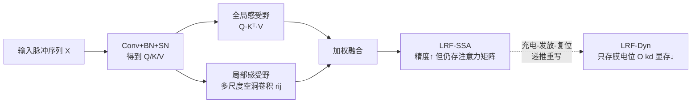

# Neural Dynamics Self-Attention for Spiking Transformers

**会议**: ICLR 2026  
**OpenReview**: [https://openreview.net/forum?id=jJedqisfOt](https://openreview.net/forum?id=jJedqisfOt)  
**代码**: 待确认  
**领域**: 脉冲神经网络 / 高能效视觉 Transformer  
**关键词**: Spiking Neural Network, Spiking Transformer, Self-Attention, Local Receptive Field, Neuronal Dynamics, Energy-Efficient Vision  

## 一句话总结
本文从「局部建模能力缺失」和「注意力矩阵存储开销大」两个角度剖析了脉冲自注意力（SSA）的瓶颈，提出 LRF-Dyn：先用局部感受野把局部偏置塞回 SSA 拉高精度，再借「充电-发放-复位」神经元动力学把注意力计算重写成只需存膜电位的递推形式，从而在显著降低推理显存的同时把脉冲 Transformer 的精度逼近 ANN。

## 研究背景与动机
**领域现状**：把脉冲神经网络（SNN）和 Transformer 结合是兼顾能效与性能的有前景路径，尤其适合边缘视觉。Spikformer、QKFormer、Spike-Driven-V3 等一系列脉冲 Transformer 用「脉冲自注意力」（SSA）替代了标准 softmax 注意力，靠事件驱动的稀疏脉冲避免冗余乘加，能耗很低。

**现有痛点**：相比同规模 ANN，脉冲 Transformer 一直有两个老毛病——(i) 精度仍有可观差距；(ii) 推理时显存开销反而很高。本文通过理论与可视化把两者都归因到 SSA 本身：

- **缺乏局部偏置**：SSA 为了保持脉冲友好删掉了 softmax，导致注意力分数近乎均匀分布。可视化显示 ViT 的 VSA 有 76.8% 的注意力集中在短曼哈顿距离的邻域（低熵、聚焦），而 SSA 的注意力分布几乎均匀（高熵），无法强调关键区域，这正是精度差距的根源。
- **存储大注意力矩阵**：SSA 虽借矩阵结合律把计算复杂度压到 $O(Nd^2)$，但推理时既要存 Q/K/V，还要存 KV 中间结果，额外吃掉 $O(d^2)$ 显存（$d=512$ 时尤其严重），严重妨碍在神经形态芯片等资源受限设备上部署。

**核心矛盾**：低能耗（SNN）、低显存、高精度三者难以同时满足——删 softmax 换来了能效却丢了局部建模，矩阵结合律省了算力却堆高了显存。

**本文目标**：在保住 SNN 事件驱动低能耗的前提下，同时补回局部建模能力并压低推理显存。

**核心 idea**：**生物视觉启发**——借鉴生物视觉神经元的局部感受野（LRF）与膜电位时序动力学，先给 SSA 加局部感受野把局部偏置「装回去」，再把注意力聚合近似成脉冲神经元的充电-发放-复位过程，用递推的膜电位替代显式注意力矩阵存储。

## 方法详解

### 整体框架
方法分两步递进：先得到精度更高的 **LRF-SSA**（在 SSA 上注入局部感受野），再把它重写为显存更省的 **LRF-Dyn**（用神经元动力学递推替代矩阵存储）。两者都能作为即插即用单元嵌入现有脉冲 Transformer，无需改动框架其余部分。

### 关键设计

**1. 局部感受野注入 SSA（LRF-SSA）：把丢掉的局部偏置补回来。** SSA 删掉 softmax 后，对第 $n$ 个 token 的输出只剩全局感受野项 $q_n[t]\times\sum_{j} k_j[t]^\top v_j[t]$，邻域信息被均摊掉。作者在其上并联一个局部感受野项 $\sum_d\sum_{i,j\in\Omega_d} r_{ij}^d V_{\rho k}$，用两个 $3\times3$ 深度可分离卷积（空洞因子 $d=3,5$）以极少参数（每个架构 <0.2M）对邻域重新加权。理论上把融合权重写成 $\alpha_{ij}^{\text{lrf-ssa}}=(1-\lambda)\alpha_{ij}^{\text{ssa}}+\lambda r_{ij}$：Theorem 1 证明其期望感受野 $E[\Delta]=(1-\lambda)\mu_{\text{ssa}}+\lambda\mu_r$ 因 $\mu_r\le\mu_{\text{ssa}}$ 而收缩，恢复了类 VSA 的局部聚焦；Theorem 2 进一步证明其信息熵 $H(p^{\text{lrf-ssa}})\le H(p^{\text{ssa}})$，即把 SSA 的高熵均匀分布拉回 VSA 那种低熵聚焦分布——这正是精度提升的理论依据。

**2. 用神经元动力学重写注意力（LRF-Dyn）：把矩阵存储换成膜电位递推。** LRF-SSA 仍需逐时间步存 Q/K/V 和注意力矩阵（额外 $O(d^2)$）。作者把式 (8) 按因果方式重写为 $\text{sattn}_n[t]'=q_n[t]\times\underbrace{\sum_{j=1}^{n-1}k_j[t]^\top v_j[t]}_{\text{膜电位}}+\underbrace{k_n[t]^\top v_n[t]+\sum_d\sum_{i,j\in\Omega_d}r_{ij}^d v_{\rho k}[t]}_{\text{突触前输入}}$，于是只需累积存一个 $\sum_{j=1}^{n-1}k_j^\top v_j$，把 $O(Nd^2)$ 降到 $O(d^2)$。这个结构恰好对应脉冲神经元的充电-发放-复位：第一项是膜电位记忆、第二项是当前突触前输入。

**3. 树突形式的动力学参数化：让递推可高效训练。** LRF-Dyn 的核心递推写作 $X_n[t]=A\odot X_{n-1}[t]+\Gamma\,\text{Token}_n[t]$，输出 $\text{sattn}_n'[t]=X_n[t]+\sum_d\sum_{i,j\in\Omega_d}r_{ij}^d\cdot X_{\rho k}[t]$。其中衰减因子 $A$ 与膜电容常数 $\Gamma$ 受光感受神经元多时间尺度行为启发，被参数化为带局部感受野的「树突」形式（一个三对角的 $A$ 矩阵刻画相邻 token 间的耦合 $\beta$ 与各自衰减 $1/\tau$）。不同树突分支对同一 token 产生不同响应，再由胞体整合成脉冲序列。由于 $A$ 具时不变性，整体可写成卷积 $K(t)=\Gamma C\sum_{m=1}^{n-m}A$ 并用傅里叶变换 $H=\mathcal{F}^{-1}\{\mathcal{F}(K)*\mathcal{F}(X)\}$ 高效并行训练（论文中树突数 $n=8$）。最终推理时只需存每个位置的膜电位，把存储复杂度降到 $O(kd)$（$k$ 为树突数）。

## 实验关键数据

### 主实验：ImageNet-1K 图像分类
把 SSA 替换为 LRF-SSA / LRF-Dyn，嵌入 Spikformer / QKFormer / SDT-V3 三种主干。SR 为推理存储复杂度。

| 方法 | 架构 | 存储复杂度 SR | 参数(M) | Acc.(%) |
|------|------|------|------|------|
| Spikformer | Spikformer-8-512 | $O(d^2)$ | 29.68 | 73.38 |
| Spikformer + **LRF-SSA** | Spikformer-8-512 | $O(d^2)$ | 29.71 | 74.62 (↑1.24) |
| Spikformer + **LRF-Dyn** | Spikformer-8-512 | $O(kd)$ | 29.71 | 74.51 (↑1.13) |
| QKFormer | HST-10-512 | $O(d^2)$ | 29.08 | 82.04 |
| QKFormer + **LRF-SSA** | HST-10-512 | $O(d^2)$ | 29.18 | 82.52 (↑0.48) |
| QKFormer + **LRF-Dyn** | HST-10-512 | $O(kd)$ | 29.18 | 82.48 (↑0.44) |
| SDT-V3 | Eff-Transformer-S | $O(d^2)$ | 5.11 | 75.30 |
| SDT-V3 + **LRF-SSA** | Eff-Transformer-S | $O(d^2)$ | 5.24 | 76.22 (↑0.92) |
| SDT-V3 + **LRF-Dyn** | Eff-Transformer-S | $O(kd)$ | 5.24 | 76.12 (↑0.82) |

LRF-SSA 主打精度，跨三种主干均稳定提升且几乎不加参数；LRF-Dyn 在保精度的同时把存储复杂度从 $O(d^2)$ 降到 $O(kd)$。

### 语义分割（ADE20K）

| 模型 | 参数(M) | T | MIoU(%) |
|------|------|------|------|
| SDT-V3 | 5.1+1.4 | 4 | 33.6 |
| SDT-V3 + **LRF-SSA** | 5.1+1.4 | 4 | 36.2 (↑2.6) |
| SDT-V3 + **LRF-Dyn** | 5.24+1.4 | 4 | 36.3 (↑2.7) |
| SDT-V3 (19M) + **LRF-SSA** | 10.0+1.4 | 4 | 43.5 (↑2.2) |
| SDT-V3 (19M) + **LRF-Dyn** | 19.25+1.4 | 4 | 43.1 (↑1.8) |

分割任务上增益更明显（2~2.7%），且 LRF-Dyn 在无注意力存储下仍优于无注意力的 ResNet 基线。

### 消融实验（CIFAR-100，Spikformer 主干）

| 方法 | w/o LRF | $\Omega\le1$ | $\Omega\le3$ | $\Omega\le5$ |
|------|------|------|------|------|
| LRF-SSA | 77.86 | 78.26 | 78.52 | 78.64 |
| LRF-Dyn | 77.78 | 78.16 | 78.50 | 78.57 |
| Caused SSA† | 74.30 | 75.30 | 76.20 | 76.50 |

去掉 LRF 模块时 LRF-SSA 退化为原始 SSA；增大局部卷积核覆盖（$\Omega$）能持续涨点，证明局部感受野的贡献。

### 关键发现
- 在 Spikformer-8-512 上，相比 SSA，方法在**涨 1.13% 精度的同时降 49.4% 推理显存**。
- 有效感受野（ERF）可视化显示 LRF-SSA / LRF-Dyn 都恢复了类 ViT 的局部聚焦，注意力分布更稀疏、更聚焦于显著区域。

## 亮点与洞察
- **问题诊断有理论支撑**：把脉冲 Transformer 的两大顽疾干净地归到「删 softmax → 高熵均匀注意力 → 缺局部偏置」和「KV 结合律 → 需存中间矩阵」，并用两条定理（感受野收缩 + 熵序）量化论证，不是拍脑袋。
- **生物启发落到可计算的结构上**：局部感受野和膜电位动力学并非口号，而是分别对应到空洞深度卷积和三对角树突动力学，且时不变 $A$ 让递推能用傅里叶卷积并行训练。
- **一套设计两种取向**：LRF-SSA 偏精度、LRF-Dyn 偏显存，二者即插即用、可任选嵌入主流脉冲 Transformer，工程友好。

## 局限与展望
- **写作与公式呈现较粗糙**：缓存全文中多处公式排版与符号混乱（如 $A$、$\Gamma$ 的定义、傅里叶卷积式 (15)），树突动力学的部分定义需读附录才能补全，复现门槛偏高。
- **实验局限于视觉分类/分割**：未涉及检测、视频或非视觉模态，能效优势主要靠复杂度论证与显存对比间接体现，缺真实神经形态芯片上的能耗实测。
- **超参依赖**：树突数 $n=8$、空洞因子、融合系数 $\lambda$ 等对结果的稳健性讨论有限。
- **展望**：在 Loihi/天机类神经形态硬件上落地实测能耗、扩展到时序与多模态任务，是把「低显存 + 低能耗」优势真正兑现的下一步。

## 相关工作与启发
- **脉冲 Transformer 谱系**：Spikformer 首提 SSA、SpikingResformer 引入 ResNet 降参、Spike-Driven-V3 加入脉冲频率近似（SFA）——本文是在这条线上对「注意力分布质量 + 推理显存」做的针对性手术。
- **softmax-free / 线性注意力**：Linear/Performer 等用核近似把 $O(N^2)$ 降到 $O(N)$，本文借用其矩阵结合律思想，但更进一步把它重写成神经元动力学以彻底免去矩阵存储。
- **启发**：对任何「为效率删 softmax」的注意力变体，本文提示了一个通用视角——删 softmax 往往同时删掉了局部偏置与低熵聚焦，需要显式补回；而把线性注意力的累加重写成 RNN/神经元递推，是换取推理显存的有效手段。

## 评分
- 新颖性: ⭐⭐⭐⭐ 把「局部感受野 + 膜电位动力学」双重生物启发统一进脉冲注意力，并用两条定理把直觉量化，视角新颖。
- 实验充分度: ⭐⭐⭐⭐ 跨三种主干、分类+分割+消融+感受野/显存可视化较完整，但缺真实神经形态硬件能耗实测与更广任务。
- 写作质量: ⭐⭐⭐ 思路清晰、动机扎实，但公式排版与树突动力学表述偏乱，复现门槛较高。
- 价值: ⭐⭐⭐⭐ 同时缩小精度差距并降近半推理显存，对边缘/神经形态部署的高能效视觉 Transformer 有实际意义。

<!-- RELATED:START -->

## 相关论文

- [\[ICLR 2026\] QUEST: A Robust Attention Formulation Using Query-Modulated Spherical Attention](quest_a_robust_attention_formulation_using_query-modulated_spherical_attention.md)
- [\[ICLR 2026\] Hilbert-Guided Sparse Local Attention](hilbert-guided_sparse_local_attention.md)
- [\[ICLR 2026\] Fractional-Order Spiking Neural Network](fractional-order_spiking_neural_network.md)
- [\[ICLR 2026\] The Counting Power of Transformers](the_counting_power_of_transformers.md)
- [\[NeurIPS 2025\] Recurrent Self-Attention Dynamics: An Energy-Agnostic Perspective from Jacobians](../../NeurIPS2025/others/recurrent_self-attention_dynamics_an_energy-agnostic_perspective_from_jacobians.md)

<!-- RELATED:END -->
