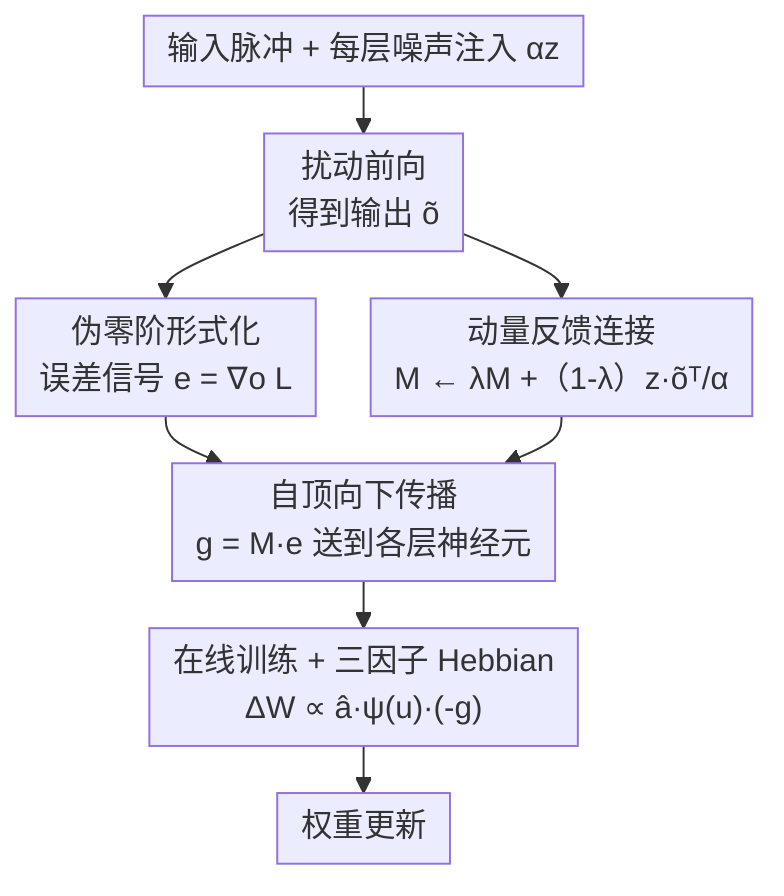

# Online Pseudo-Zeroth-Order Training of Neuromorphic Spiking Neural Networks

**会议**: ICLR 2026  
**OpenReview**: [https://openreview.net/forum?id=6ZietpbPoB](https://openreview.net/forum?id=6ZietpbPoB)  
**代码**: 待确认  
**领域**: 类脑计算 / 脉冲神经网络 / 生物可塑性训练  
**关键词**: 脉冲神经网络, 零阶优化, 空间信用分配, 在线训练, 三因子 Hebbian 学习

## 一句话总结
本文提出 OPZO（在线伪零阶训练），只用一次带噪声注入的前向传播 + 自顶向下的直接反馈，就能在脉冲神经网络中完成空间信用分配，避开了空间反向传播的权重对称与前后向分阶段问题，又通过"伪零阶"与动量反馈连接压住了零阶方法的巨大方差，最终在神经形态与静态数据集上逼近空间 BP 的精度，且估计的片上训练开销更低。

## 研究背景与动机
**领域现状**：用脉冲神经网络（SNN）做类脑计算被视为低功耗的方向，神经形态硬件（Loihi 等）天然支持稀疏事件驱动、片上并行的运算。目前训练深层 SNN 的主流是"代理梯度 + 时空反向传播"：用 surrogate gradient 解决脉冲不可导问题，再沿时间和层级两个维度做 BP 完成信用分配。

**现有痛点**：时空 BP 与神经形态硬件、生物可塑性都不兼容。空间 BP 需要权重转置（weight transport）、需要前向和后向两个分离阶段并伴随 update locking；时间 BP 对带有"在线"特性的脉冲神经元更是不可行。在线训练方法（如 OTTT、e-prop）已经用追踪的资格迹（eligibility trace）解耦了时间维依赖，做到了 forward-in-time 学习，但**空间维**的信用分配仍主要依赖空间 BP，或退而求其次用随机反馈（DFA），后者保证弱、精度差。

**核心矛盾**：要"生物可塑、硬件友好"（单向局部突触、单次前向、直接自顶向下调制），就得放弃空间 BP；可一旦放弃 BP，现有替代品要么像 DFA 用固定随机反馈、缺乏理论保证且掉点严重，要么像零阶（ZO）/前向梯度方法因方差爆炸而根本训不动通用网络。如何在不做空间 BP 的前提下拿到与 BP 相当的性能，是悬而未决的问题。

**本文目标**：设计一个**全局**学习算法，满足三件事——只需单次前向、用直接自顶向下反馈做空间信用分配、性能逼近空间 BP——同时能嫁接到在线训练上，铺向 SNN 的片上训练。

**切入角度**：作者注意到经典零阶方法（SPSA、单点 ZO）只把损失当黑箱标量 $L$，反馈信号是一个标量，落在随机方向 $z$ 上，信息量太少导致方差巨大。但实际中**损失函数**的梯度是有闭式解的（MSE 是 $o-y$，交叉熵是 $\sigma(o)-y$），只有**模型** $f$ 因脉冲不可导/生物可塑性才需要零阶处理。于是可以"解耦模型与损失"，对损失用一阶、对模型保持零阶。

**核心 idea**：提出"伪零阶（pseudo-zeroth-order）"形式化——把损失的一阶梯度作为信息更丰富的向量误差信号，再用动量反馈连接逼近模型 Jacobian 的期望来传播这个误差，从而在保持单次前向的同时大幅降低零阶方差。

## 方法详解

### 整体框架
OPZO 要解决的核心问题是：在不做空间 BP 的前提下，给隐藏层每个神经元一个可靠的误差（梯度）信号。整体上它把"如何拿到误差信号"拆成两半——**对损失用一阶**拿到输出层误差向量 $e=\nabla_o L$，**对模型用零阶**估计一个能把 $e$ 投射回隐藏层的反馈矩阵 $M$。

具体一轮迭代：前向传播时给每层注入随机噪声 $\alpha z$，得到扰动输出 $\tilde{o}$；用 $z$ 和 $\tilde{o}$ 以动量方式更新反馈连接 $M$（它在逼近模型 Jacobian 转置的期望 $\mathbb{E}_x[J_f^\top]$）；用损失闭式梯度算出 $e$；通过 $M$ 把 $e$ 直接送到各层神经元得到每个神经元的误差 $g$；最后把 $g$ 与在线训练追踪的突触前迹 $\hat{a}$ 相乘，形成与三因子 Hebbian 学习同形的权重更新。整个过程只有**一次**带噪前向，且各层的误差传播与 $M$ 更新都可并行。

### 关键设计

**1. 伪零阶形式化：把损失的一阶信息拿回来，只对模型保持零阶**

零阶方法方差爆炸的根源是它把整个 $L\circ f$ 当黑箱，只用一个标量函数值乘到随机方向 $z$ 上，信息太稀薄。本文的观察是：损失 $L(\cdot)$ 的梯度通常有闭式解，真正"不可导/黑箱"的只有模型 $f(\cdot;\theta)$。于是把二者解耦——对输入 $x$，模型先输出 $o=f(x;\theta)$，再算损失 $L(o,y_x)$；保持 $f$ 的零阶形式（脉冲不可导也无妨），但直接用损失梯度 $e=\nabla_o L(o,y_x)$（MSE 下为 $o-y_x$，交叉熵下为 $\sigma(o)-y_x$）作为反馈误差信号。这样反馈从"一个标量"升级为"一个携带类别方向信息的向量"，为后续方差缩减提供了抓手。这正是 OPZO 区别于 MeZO/SPSA 等纯零阶方法的起点：它们只能用 $L$ 的函数值，OPZO 用上了 $L$ 的梯度。

**2. 动量反馈连接：用一次前向估计 Jacobian 期望，把零阶方差压到与 BP 同量级**

有了误差向量 $e$，还需要一条能把它从输出层送回隐藏层的"反馈连接"。从两点估计的方向梯度出发，经泰勒展开可得
$$\nabla_\theta^{ZO} L \approx \frac{\langle \nabla_o L,\ \tilde{o}-o\rangle}{\alpha} z = \frac{z\,\Delta o^\top}{\alpha}\nabla_o L,$$
其中 $\Delta o=\tilde{o}-o$。这说明 $\frac{z\Delta o^\top}{\alpha}$ 就是一条把误差 $\nabla_o L$ 投回去的连接权重，而它可以看作模型 Jacobian 转置期望 $\mathbb{E}_x[J_f^\top]$ 的一个随机估计。单次随机方向 $z$ 的估计方差很大，作者用**跨迭代的动量**把不同方向的估计累积平均：
$$M_k := \lambda M_{k-1} + (1-\lambda)\frac{z\,\tilde{o}^\top}{\alpha},\qquad \nabla_\theta^{PZO} L = M_k\,\nabla_o L,$$
这里用了**单点**形式 $z\tilde{o}^\top/\alpha$（只需一次前向，且与两点估计同期望，也是平滑版 $f_\alpha$ Jacobian 的无偏估计，因此对不可导脉冲也成立）。论文给出 Proposition 4.1：单点零阶方差约为 $\frac{1}{B}\big((d+\beta)V_\theta+\dots+\frac{1}{\alpha^2}V_L+\frac{1}{\alpha^2}S_L\big)$，其中 $d$ 是参数维度（通常巨大）；而伪零阶方差为 $\frac{1}{B}(mV_\epsilon V_o + mV_\epsilon S_o + V_{o,M})$，其中 $m\ll d$ 是输出维度、$V_\epsilon$ 很小。直观结论是零阶比 BP 方差大至少 $d$ 倍，而伪零阶能把方差压回与 BP 相近的量级（实验中也确实如此）。它采用节点扰动（node perturbation，方差小于权重扰动），形式上与 DFA 很像，但反馈权重不是固定随机矩阵，而是被估计出来的 Jacobian，因此比 DFA 多了保证、性能也好得多。代价是 $M$ 取的是 Jacobian 在数据 $x$ 上的期望，会引入一点偏置（Proposition 4.3 给出在 $\big\|\mathbb{E}[J_f^\top e]\big\|>\frac{1}{2}L_J L_e\Delta x+e_\epsilon$ 条件下估计梯度仍是下降方向的保证）。

**3. 嫁接在线训练：把估计梯度塞进三因子 Hebbian 更新，铺向片上训练**

前两个设计解决了空间信用分配，但要真正"神经形态友好"还得解决时间维。OPZO 建立在 OTTT 这类在线训练之上：OTTT 用追踪的突触前迹 $\hat{a}_l[t]=\sum_{\tau\le t}\lambda^{t-\tau}s_l[\tau]$ 做时间信用分配，原本其瞬时梯度仍要逐层空间 BP；OPZO 把这个被反向传播出来的瞬时梯度**替换**为自顶向下直接估计出的 $g$。于是权重更新写成
$$\Delta W_{i,j}\propto \hat{a}_i[t]\,\psi(u_j[t])\,(-g_j^t),$$
其中 $\hat{a}_i[t]$ 是突触前活动迹、$\psi(u_j[t])$ 是局部 surrogate 导数、$g_j^t$ 是全局自顶向下误差调制信号。这恰好就是三因子 Hebbian 学习的形式（突触前 × 突触后局部 × 全局调制），且全局信号是直接自顶向下、没有逐层 BP。它还能容忍误差信号传播的延迟 $\Delta t$（在收敛输入与合适 surrogate 下梯度仍有效），各层的误差传播与反馈连接更新都可并行——这些性质共同让 OPZO 比逐层空间 BP 更契合异步、并行的神经形态硬件，向片上训练迈进一步。

### 损失函数 / 训练策略
训练目标仍是普通的监督损失（MSE 或交叉熵），关键在反馈机制而非损失本身。噪声 $z$ 默认采样自高斯分布，也支持 Rademacher（±1 各 0.5）与单位球面采样以适配硬件；扰动默认加在神经活动上（节点扰动），也可改为加在膜电位上（神经元前扰动）以减少对稀疏脉冲前向的干扰，并保留局部 surrogate 导数。还可用对偶噪声（每两个时间步用 $z$ 与 $-z$）进一步降方差。此外可叠加局部学习（LL，每层加局部读出层）与中间全局学习（IGL，从中间层向前传播全局信号）来增强深层网络的训练。

## 实验关键数据

### 主实验
在 OTTT 在线训练框架下，固定相同设置比较不同空间信用分配方法（FC 用于 N-MNIST/MNIST，5 层卷积用于其余）：

| 方法 | N-MNIST | DVS-Gesture | DVS-CIFAR10 | CIFAR-10 | CIFAR-100 |
|------|---------|-------------|-------------|----------|-----------|
| 空间 BP | 98.15 | 95.72 | 75.43 | 90.00 | 64.82 |
| DFA | 97.98 | 91.67 | 60.60 | 79.90 | 49.50 |
| DKP | 97.87 | 60.53 | 37.70 | 81.84 | 53.27 |
| ZOsp（单点零阶） | 72.90 | 23.73 | 31.67 | 49.04 | 22.26 |
| **OPZO** | **98.27** | **94.33** | **72.77** | **85.74** | **60.93** |
| **OPZO（w/ LL）** | / | **96.06** | **77.47** | **89.42** | **64.77** |

纯 ZOsp 几乎训不动（CIFAR-100 仅 22%），OPZO 把它从 22% 拉到 61%，逼近 BP；DFA 在卷积网络上与 BP 差距巨大，OPZO 显著超过 DFA。叠加局部学习后，OPZO（w/ LL）与 BP（w/ LL）基本持平，甚至在神经形态数据集（DVS-Gesture 96.06 vs BP 95.72、DVS-CIFAR10 77.47 vs 76.07）上反超 BP。

### 消融 / 鲁棒性实验

| 配置 | 关键指标 | 说明 |
|------|---------|------|
| 不同噪声分布/位置（CIFAR-10） | 84.0–86.0 | 高斯/单位球/Rademacher × 神经元前后扰动，结果接近，证明对噪声设置鲁棒 |
| 9 层深网 OPZO（w/ LL&IGL）| DVS-Gesture 96.88 / CIFAR-100 66.13 | 与/超过空间 BP（94.10 / 65.96），远超 DFA |
| ImageNet 微调 ResNet-34（噪声 0.15）| OPZO 60.96 | DFA 54.59、ZOsp 30.32，OPZO 能在带噪场景成功微调，DFA/ZOsp 失败 |
| 梯度方差（Fig. 2）| 与 BP 同量级 | ZOsp 方差比 BP 大数个数量级，OPZO 压回 BP 级 |

### 关键发现
- **方差缩减是性能的关键**：ZOsp 失败的直接原因就是方差比 BP 大几个数量级；OPZO 把方差压回 BP 量级后精度随之追平 BP，理论（Prop 4.1）与实验一致。
- **OPZO 对噪声分布、注入位置都鲁棒**，给硬件实现留了空间（高斯不便实现时可用 Rademacher/单位球）。
- **深层网络更依赖辅助技术与残差结构**：纯 OPZO 对网络结构（残差连接）的依赖比 BP 更强，叠加 LL/IGL 后才能稳定扩展到 9 层/ImageNet。
- **片上开销估计更低**：自顶向下反馈的内存与运算量为 $O(Nmn)$（$m\ll n$）且可并行，远低于空间 BP 的 $O((N-1)n^2+mn)$ 反向逐层连接；且只需单次前向，操作开销与 DFA 相当。

## 亮点与洞察
- **"解耦模型与损失"这一刀切得很巧**：它精准识别出零阶方法浪费了损失梯度这一免费午餐——损失梯度本就有闭式解，没必要也当黑箱。把反馈从标量升级成向量，是后续一切方差缩减的前提。
- **动量反馈连接 = 在线学出来的 Jacobian 反馈**：DFA 用固定随机矩阵，OPZO 用单点零阶 + 动量去逼近真实 Jacobian 期望，等于把 DFA 的"瞎传"换成"学着传"，既保留单次前向与直接反馈的硬件友好性，又拿回理论保证，是 DFA 与 ZO 之间一个聪明的折中。
- **与三因子 Hebbian 同形**这一点很有迁移价值：它把一个看似纯算法的梯度估计，落到了"突触前迹 × 局部 surrogate × 全局调制"的生物可塑规则上，意味着该思路有望直接映射到支持局部更新的神经形态芯片，而不只是 GPU 上的数值技巧。

## 局限与展望
- 作者承认动量连接取 Jacobian 在数据上的期望会引入偏置（数据依赖的非线性导致 Jacobian 随样本变化），只在一定条件下保证是下降方向，这是所有"无逐层 BP 的直接反馈"方法的共性问题。
- 纯 OPZO 对网络深度的可扩展性弱于 BP，需借助残差连接 + 局部学习/中间全局学习才能撑起深网与 ImageNet，说明它尚未完全替代 BP 的可扩展性。
- 低开销目前只是**在潜在神经形态硬件上的估计**；论文也坦言这类硬件仍在发展中，GPU 上 OPZO 并不省（GPU 不遵循神经形态特性）。真正的能效优势有待在实际芯片上验证。
- ImageNet 仅做了"带噪微调"而非从头训练，大规模从头训练的能力未被证明。

## 相关工作与启发
- **vs 空间 BP**：BP 逐层用对称权重反传、需前后向分阶段，生物不可塑且硬件不友好；OPZO 单次前向 + 直接自顶向下反馈，精度逼近 BP，但开销更低、可并行、可上片。
- **vs DFA / DKP（随机反馈）**：DFA 用固定随机矩阵直接把误差从顶层送到隐藏层，OPZO 形式相似，但反馈权重是估计出的 Jacobian 而非随机矩阵，因此保证更强、卷积网络上掉点远小于 DFA；DKP 虽学习 DFA 的反馈连接，但在神经形态数据集上表现差。
- **vs MeZO / SPSA 等零阶方法**：它们把 $L\circ f$ 当黑箱、只用标量函数值、且常需两次前向，方差大到训不动通用网络；OPZO 解耦损失梯度 + 动量逼近 Jacobian，把方差压回 BP 量级，单次前向即可。
- **vs 前向梯度（forward gradient）方法**：后者需要额外的异质信号传播阶段、开销更高、生物可塑性存疑；OPZO 不需额外阶段，只在普通前向里加噪声注入。

## 评分
- 新颖性: ⭐⭐⭐⭐⭐ "解耦损失/模型 + 动量逼近 Jacobian"把零阶方差问题解得干净，是 DFA 与 ZO 之间一个有理论支撑的新点。
- 实验充分度: ⭐⭐⭐⭐ 覆盖神经形态/静态数据集、FC/卷积/9 层/ResNet-34，含方差与开销分析；但仅在带噪场景做 ImageNet 微调而非从头训练。
- 写作质量: ⭐⭐⭐⭐ 动机层层递进，理论命题与图示清晰，符号偏密但自洽。
- 价值: ⭐⭐⭐⭐⭐ 给 SNN 片上训练提供了一条生物可塑、硬件友好且性能逼近 BP 的现实路径。

<!-- RELATED:START -->

## 相关论文

- [\[ICLR 2026\] Fractional-Order Spiking Neural Network](fractional-order_spiking_neural_network.md)
- [\[ICLR 2026\] A Brain-Inspired Gating Mechanism Unlocks Robust Computation in Spiking Neural Networks](a_brain-inspired_gating_mechanism_unlocks_robust_computation_in_spiking_neural_n.md)
- [\[ICLR 2026\] Training Deep Normalization-Free Spiking Neural Networks with Lateral Inhibition](training_deep_normalization-free_spiking_neural_networks_with_lateral_inhibition.md)
- [\[ICML 2026\] Bullet Trains: Parallelizing Training of Temporally Precise Spiking Neural Networks](../../ICML2026/others/bullet_trains_parallelizing_training_of_temporally_precise_spiking_neural_networ.md)
- [\[ICLR 2026\] Breaking Gradient Temporal Collinearity for Robust Spiking Neural Networks](breaking_gradient_temporal_collinearity_for_robust_spiking_neural_networks.md)

<!-- RELATED:END -->
