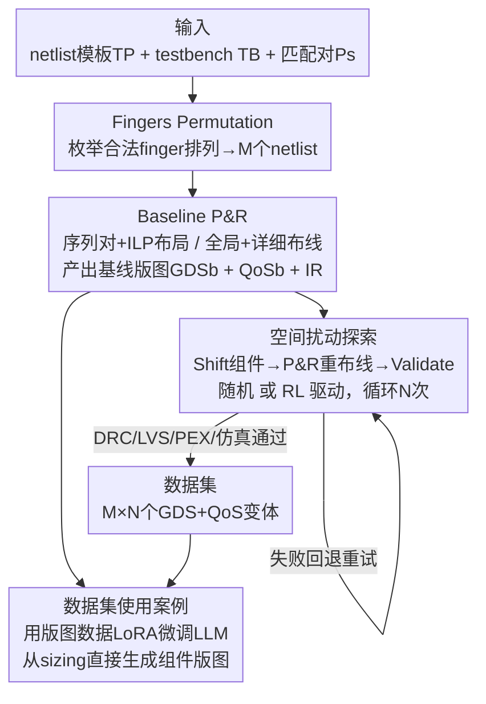

# OSIRIS: Bridging Analog Circuit Design and Machine Learning with Scalable Dataset Generation

**会议**: ICLR 2026  
**OpenReview**: [https://openreview.net/forum?id=TIDaHgj0Yj](https://openreview.net/forum?id=TIDaHgj0Yj)  
**代码**: https://huggingface.co/datasets/hardware-fab/osiris  
**领域**: 数据集与基准 / ML for EDA  
**关键词**: 模拟电路、版图自动化、寄生效应、数据集生成、强化学习

## 一句话总结
OSIRIS 是一个面向模拟集成电路**后端版图**的可扩展数据集生成流水线，它通过系统性地枚举晶体管 finger 排列与组件位置扰动，自动产出大量 DRC 干净、LVS 验证通过且带寄生感知性能标注的版图，并公开了 87,100 个版图变体的数据集，同时给出一个基于强化学习的版图优化基线。

## 研究背景与动机

**领域现状**：数字 IC 设计早已高度自动化、并越来越多地由 ML 驱动，而模拟 IC 设计至今仍以人工为主。模拟设计流程分为前端（schematic 层的拓扑选择与器件 sizing）与后端（把验证过的 schematic 翻译成可制造的物理版图，含布局、布线、DRC/LVS/PEX 验证）两个阶段。目前 ML-for-EDA 的研究主要集中在**前端**：用 GNN（CktGNN）、LLM（AnalogCoder、LaMAGIC、AnalogGenie）、RL（AutoCircuit-RL）等做拓扑生成与 sizing。

**现有痛点**：后端版图阶段被严重忽视。原因是后端对寄生效应极度敏感——微小的几何改动就会改变匹配、引入寄生电容/电阻、破坏关键对称性，且它与具体工艺节点（PDK）强绑定、受复杂可制造性约束。现有后端框架（BAG、ALIGN、MAGICAL）大多是**单趟（single-pass）自动化**：给定 netlist 一次性产出一个版图，没有"迭代探索—评估—再优化"的闭环能力。

**核心矛盾**：要让 ML 真正进入模拟后端，必须有大规模、寄生感知、物理有效的版图数据集来训练和 benchmark。但现有开放数据集（CktGNN 6 万、AnalogGenie 3350、AMSNet 824、ALIGN 23）几乎全是**前端 netlist**，没有寄生信息、没有物理有效性检验，后端版图数据极度匮乏。没有数据，ML 方法既无法训练也无法横向比较。

**本文目标**：构建一个可扩展的后端版图数据集生成基础设施，能批量产出物理有效、寄生感知的版图，并支持迭代式设计空间探索（而非单趟自动化）。

**切入角度**：作者观察到，在固定电路逻辑功能（宽长比、连接关系不变）的前提下，版图层面仍有两个可系统性探索的"自由度"：① 每个晶体管的 **finger 数**（影响版图拓扑与寄生电容/匹配）；② 每个组件在其"halo"边界框内的**空间位置**。固定功能、只动这两个维度，就能在不改变电路语义的前提下生成海量物理变体并测出它们的寄生差异。

**核心 idea**：用"finger 排列 + 组件位置扰动"两层自由度，配上完整的 P&R + DRC/LVS/PEX/仿真验证链路，把模拟后端版图的设计空间转成一个可枚举、可标注、可优化的数据生成问题。

## 方法详解

### 整体框架

OSIRIS 的输入是用户提供的三样东西：电路 netlist 模板 `TP`（描述连接关系与器件 sizing）、仿真 testbench `TB`（AC 小信号仿真，1 kHz–1 GHz）、匹配晶体管对 `Ps`（指明哪些晶体管要保持一致，如电流镜、差分对）。输出是一个数据集，每个版图变体由物理版图文件 `GDS` 和质量报告 `QoS` 构成。

流水线分两个阶段串行：**Fingers Permutation**（外层，枚举 finger 排列产出 M 个 netlist）→ **Variants Generation**（内层，对每个 netlist 先做 Baseline P&R 得到基线版图，再做 N 次随机/RL 空间扰动产出变体）。对每个模板，最终生成 M×N 个版图变体。每个变体都跑完整的经典模拟设计验证链（DRC 在 P&R 中按构造保证，LVS 用 Netgen、PEX 用 Magic、仿真用 Ngspice），只有验证通过的版图才计入数据集。

### 关键设计

**1. 两维设计空间：finger 排列 + halo 内组件位移**

OSIRIS 把模拟版图的探索空间收敛成两个正交、且都"不改变电路逻辑功能"的自由度，这是整个数据集能批量、合法生成的前提。第一维是**晶体管 finger 数**：finger 是共享源/漏区的栅段，一个晶体管可拆成多个并联段以提升紧凑度、降低寄生、改善匹配；在保持宽长比固定的前提下，每个晶体管可取多个合法 finger 值。一个 finger 排列**合法**需同时满足两条约束——匹配要求（电流镜、差分对等匹配晶体管必须 finger 数相同）和 PDK 规定的最小栅尺寸。第二维是**组件位置**：每个组件（晶体管、电阻、电容）外包一个称为 **halo** 的边界框，组件可在 halo 内自由移动。固定功能、只动这两维，保证了生成的每个变体在电学上仍等价于原 netlist，却在寄生与面积上各不相同——这正是 ML 需要的"同功能、不同物理实现"的监督信号。

**2. Fingers Permutation + Baseline P&R：枚举合法 netlist 并合成基线版图**

Fingers Permutation 阶段接收 `TP` 和 `Ps`，**穷举所有合法 finger 组合**，每个组合标注到模板上生成一个 netlist $NL_i$（$i=0,\dots,M$），由此得到 M 个结构不同但功能相同的 netlist。对每个 $NL_i$，Baseline P&R 跑一遍完整的布局布线：布局用**序列对（sequence-pair）**编码电路、导出约束并用几何 ILP 求解，外层用**模拟退火**这一元启发式扰动序列对、以最小化半周长线长（HPWL）为目标探索布局；布线分两级——全局布线用 Dijkstra、详细布线用 A\* 解决局部拥塞。这一步产出三个对象：基线版图 $GDS_i^b$、对应质量报告 $QoS_i^b$、以及记录每个组件坐标（左下/右上角）与类型（nmos/pmos/cap/res）的内部表示 $IR_i^b$。基线本身既作为数据集中的一个变体（未扰动的 post-P&R 实例），又是后续所有空间扰动的起点。

**3. 空间扰动探索：随机 + RL 两套策略迭代生成变体**

在 $IR_i^b$ 基础上做 N 次增量扰动，第 j 次的结果作为第 j+1 次的基线（$IR_i^0 = IR_i^b$）。随机版（Random Exploration）每轮三步循环：**Shift**（掷两个骰子，一个选移动哪个组件、一个选上下左右方向，并更新 IR）→ **P&R**（按新坐标重新布线以恢复电连接）→ **Validate**（跑 DRC/LVS/PEX/仿真，确认逻辑等价并估计行为）；若某轮验证失败则回退并重试该轮，直到凑满 N 次成功迭代。RL 版（RL Variants Generation）把这个探索升级为**两级强化学习闭环**，对应两个自由度各一层：外层 **FinPerm Search** 用一个全连接 agent 接收"每个晶体管 finger 数"向量、输出各 finger 值的概率并映射为离散动作，用 REINFORCE（model-free 策略梯度）训练，若选到非法 finger 配置则给负 reward 重选；内层 **RL Place** 用 actor-critic agent（共享前段后分叉为 actor/critic 两支）在"组件类型+坐标"向量上决定移动哪个组件、并输出当前状态价值，用 PPO 训练（适合离散动作空间）。外层 reward 取内层所有迭代中的最优值：

$$R_i = \max_{j=1,\dots,N}\ \alpha\cdot(pscore_i^j - pscore_i^b) + \beta\cdot(area_i^j - area_i^b)$$

内层单步 reward 为 $r_j = \alpha\cdot(pscore_i^j - pscore_i^b) + \beta\cdot(area_i^j - area_i^b)$，其中 $\alpha,\beta$ 为权衡系数。与随机版不同，RL 版一旦某轮失败就**不重试**、直接结束 episode 并给内层 agent 一个惩罚 reward，迫使 agent 学会避开会导致非法版图的动作，从而比纯随机更快收敛到高质量解。

**4. 寄生感知的质量度量：pex score 与 area**

数据集的"标签"由两个 QoS 指标定义，且都是**越低越好**。第一个是 **pex score（pscore）**，量化版图引入的寄生对性能的退化程度，定义为 pre-layout（schematic 级）与 post-layout 仿真轨迹之间的均方根误差：

$$pscore = \sqrt{\frac{1}{K}\sum_{i=1}^{K}(pre_i - post_i)^2}$$

其中 K 是每条仿真轨迹的采样点数。pscore 直接刻画寄生对增益、带宽、噪声、稳定性等关键模拟指标的影响，是衡量"版图做得好不好"的核心电学信号。第二个是 **area**，即所有组件包围矩形面积之和 $area = \sum_{t=0}^{T} W_t\cdot H_t$（$W_t,H_t$ 为组件 t 包围框的宽高，单位 µm），作为制造成本与集成密度的代理。pscore 与 area 通常此消彼长（拉开组件距离能降寄生但增面积），这个 trade-off 正是 RL reward 里 $\alpha,\beta$ 要平衡的对象。

### 一个完整示例

以放大器电路为例走一遍：用户给定一个 Miller 放大器的 netlist 模板（5 nmos + 4 pmos + 1 cap + 1 res）、testbench 和匹配对。Fingers Permutation 枚举出 146 个合法 finger 排列（即 146 个 netlist）。对每个 netlist，Baseline P&R 合成一个基线版图，再做 100 次空间扰动 → 每个 netlist 产出 100 个变体，单电路共 14,600 个版图。每个版图都测出 pscore 和 area 并跑完 DRC/LVS/PEX/仿真。整条 Miller 电路探索耗时约 195 小时（单版图平均 48 秒）。五个电路（Miller、Ahuja、Feed Forward、5-Transistors、LPF）累计 871 个 finger 排列、87,100 个版图变体，数据集约 5 GB、总采集约 37 天，全程仅用 CPU（Intel Xeon 32 核）无 GPU。

## 实验关键数据

### 数据集规模与对比

数据集覆盖五个常见模拟电路（四个放大器 + 一个低通滤波器），全部用开源 Skywater 130nm PDK 实现。

| 电路 | 探索 netlist 数 | 每 netlist 变体 | 总版图数 | 平均 pscore (V) | 单版图生成 (s) |
|------|------|------|------|------|------|
| Miller | 146 | 100 | 14,600 | 0.0794 | 48 |
| Ahuja | 143 | 100 | 14,300 | 0.1693 | 48 |
| Feed Forward | 224 | 100 | 22,400 | 0.1044 | 25 |
| 5-Transistors | 129 | 100 | 12,900 | 0.0674 | 45 |
| LPF | 229 | 100 | 22,900 | 0.3201 | 29 |

与现有模拟数据集横向对比，OSIRIS 是首个面向**后端版图**、同时具备物理有效性检验与寄生感知的大规模数据集：

| 数据集 | 设计阶段 | 数据类型 | 规模 | 物理有效性 | 寄生感知 |
|------|------|------|------|------|------|
| CktGNN | 前端 | Netlist | 60,000 | N.A. | ✗ |
| AnalogGenie | 前端 | Netlist | 3,350 | N.A. | ✗ |
| AMSNet | 前端 | Netlist | 824 | N.A. | ✗ |
| ALIGN | 后端 | Netlist | 23 | ✓ | ✗ |
| **OSIRIS** | **后端** | **版图(Layout)** | **87,100** | **✓** | **✓** |

### RL 基线 vs 单趟基线（pscore / area / 时间）

把 RL 探索与单趟生成器 MAGICAL、ALIGN 以及 OSIRIS 自带的随机探索对比（pscore 与 area 越低越好）：

| 电路 | MAGICAL pscore | ALIGN pscore | Random pscore | RL pscore | RL area (µm²) |
|------|------|------|------|------|------|
| Miller | 0.2739 | 0.142 | 0.0012 | **0.00069** | 1,733 |
| Ahuja | 0.5184 | 0.315 | 0.120 | **0.120** | 1,797 |
| Feed Forward | 0.2087 | 0.210 | 0.037 | **0.024** | 768.5 |
| 5-Transistors | 0.2554 | 0.093 | 0.050 | **0.047** | 444.5 |
| LPF | – | 0.501 | 0.102 | **0.064** | 6,635 |

### 数据集使用案例：微调 LLM 生成组件版图

作者用 OSIRIS 数据集中的电容版图样本（约 10,000 个）对 **Qwen3-14B** 做 LoRA 微调，让它从 sizing 目标直接生成 SkyWater 130nm 下 DRC-free、LVS 验证的电容版图。结果：微调后模型产出 **100% 合法输出、尺寸完全准确**；而原版 Qwen3-14B 完全没有几何能力、生成不出有效版图。微调用一块 H100（96 GB）完成。

### 关键发现

- **RL 在所有 benchmark 上 pscore 最低**：Miller 和 Feed Forward 上 RL 的 pscore 比 ALIGN/MAGICAL 低一个数量级以上，说明学习引导的布局能更好地抑制寄生。
- **面积通常持平或更小，但有 trade-off**：5-Transistors OTA 上 RL 面积（444.5 µm²）反而比基线大，但 pscore 更低——RL 选择了牺牲面积换电学性能。
- **RL 比随机探索更快收敛**：Miller、Ahuja 上运行时间比 Random 减少近 50%，所有 benchmark 上 RL 采集时间最短，因为它更高效地探索解空间。
- **覆盖面广**：LPF 上 RL 同时拿到最小面积和最低 pscore，而 MAGICAL 在 LPF 上根本生成不出有效版图。

## 亮点与洞察

- **把"后端版图探索"转成可枚举的数据生成问题**：通过锁定"功能不变、只动 finger 与位置"两个自由度，作者巧妙地让海量合法变体可以自动批量产生——这是后端数据稀缺问题的根因解法，而非又一个单趟生成器。
- **pscore 这个 pre/post 仿真 RMSE 指标设计得很实用**：它把抽象的"寄生退化"变成一个可微比较、可做 RL reward 的标量，且直接关联增益/带宽/噪声等真实模拟指标。
- **数据集结构是为 ML 量身定制的**：成对的 pre/post 仿真、细粒度寄生退化、空间移动元数据，天然支持寄生预测、ML 引导布局、组件级版图合成等多种下游任务。
- **LLM 微调 use case 给出了一个可迁移范式**：用结构化版图数据微调通用 LLM，就能赋予它原本完全不具备的"几何/版图"能力，这个思路可推广到其他 PDK 相关的版图生成任务。

## 局限与展望

- **作者承认的局限**：当前发布只覆盖五个电路、单一工艺节点（Skywater 130nm）；正在开发对更多电路族、更丰富扰动算子、以及跨 PDK 迁移学习的支持。
- **生成成本高**：单电路探索需 156–195 小时，全数据集采集约 37 天，主要瓶颈在每个变体都要跑完整 DRC/LVS/PEX/仿真验证链；扩展到更大电路或更多节点时成本会进一步上升。
- **RL 基线相对朴素**：外层 REINFORCE、内层 PPO 的两级结构是"够用的基线"而非强方法；reward 只考虑 pscore 与 area 的线性组合，未纳入更多电学约束，且 $\alpha,\beta$ 需人工调。
- **扰动算子简单**：目前只有"掷骰子选组件+方向"的离散平移，缺乏旋转、镜像、对称组放置等更贴近专家经验的操作，可能限制了能探索到的版图质量上界。

## 相关工作与启发

- **vs 单趟后端框架（BAG / ALIGN / MAGICAL）**：它们把版图生成当作"给定 netlist 一次性出版图"的优化问题，依赖预定义模板与大量专家调参；OSIRIS 的根本区别是支持**迭代式、性能驱动的设计空间探索**，并把过程中的所有合法变体沉淀为可学习的数据集。
- **vs 前端数据集（CktGNN / AnalogGenie / AMSNet）**：它们提供的是 netlist 级别、无寄生信息的前端数据，无法支撑后端版图 ML；OSIRIS 填的是后端版图数据这个空白，且自带物理有效性与寄生标注。
- **vs 闭环 sizing 方法（DNN-Opt / Bayesian + MAGICAL）**：那些方法把确定性 layouter 当黑盒、调的是晶体管 sizing；OSIRIS 与之正交——它直接优化**版图本身**，可作为这类闭环方法的版图生成与数据来源。

## 评分
- 新颖性: ⭐⭐⭐⭐☆ 首个面向模拟后端、寄生感知、物理有效的大规模版图数据集 + 可迭代探索的生成流水线，填补明确空白
- 实验充分度: ⭐⭐⭐⭐☆ 五电路 87,100 变体、与两个 SOTA 单趟生成器及随机基线全面对比，还给了 LLM 微调 use case；但电路与工艺节点数仍有限
- 写作质量: ⭐⭐⭐⭐☆ 流水线、数据集结构、指标定义讲得清楚，图表完整
- 价值: ⭐⭐⭐⭐⭐ 为 ML-for-EDA 后端方向提供了稀缺的开源数据基础设施，对社区基准与可复现性意义大

<!-- RELATED:START -->

## 相关论文

- [\[ICLR 2026\] CircuitNet 3.0: A Multi-Modal Dataset with Task-Oriented Augmentation for AI-Driven Circuit Design](circuitnet_30_a_multi-modal_dataset_with_task-oriented_augmentation_for_ai-drive.md)
- [\[ICLR 2026\] An Information-Theoretic Framework For Optimizing Experimental Design To Distinguish Probabilistic Neural Codes](an_information-theoretic_framework_for_optimizing_experimental_design_to_disting.md)
- [\[ICLR 2026\] A Scalable Inter-edge Correlation Modeling in CopulaGNN for Link Sign Prediction](a_scalable_inter-edge_correlation_modeling_in_copulagnn_for_link_sign_prediction.md)
- [\[ICLR 2026\] Stable and Scalable Deep Predictive Coding Networks with Meta-Prediction Errors](stable_and_scalable_deep_predictive_coding_networks_with_meta-prediction_errors.md)
- [\[ICLR 2026\] Oversmoothing, Oversquashing, Heterophily, Long-Range, and More: Demystifying Common Beliefs in Graph Machine Learning](oversmoothing_oversquashing_heterophily_long-range_and_more_demystifying_common_.md)

<!-- RELATED:END -->
