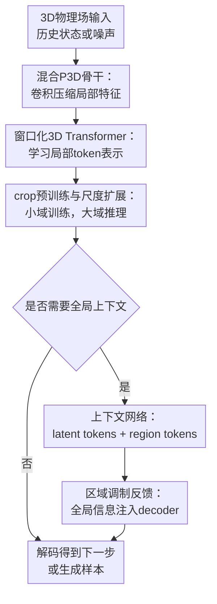

# P3D: Highly Scalable 3D Neural Surrogates for Physics Simulations with Global Context

**会议**: ICLR 2026  
**OpenReview**: [https://openreview.net/forum?id=8UdCE5nhFl](https://openreview.net/forum?id=8UdCE5nhFl)  
**代码**: https://github.com/tum-pbs/P3D  
**领域**: 科学机器学习 / 物理仿真代理  
**关键词**: 3D物理仿真, PDE代理模型, 湍流建模, 全局上下文, CNN-Transformer  

## 一句话总结
P3D 用卷积-Transformer 混合骨干、crop 预训练和可选的全局上下文网络，把 3D PDE 与湍流仿真的神经代理模型扩展到 $512^3$ 级别，并在确定性预测和概率生成两类任务上同时取得更好的精度、速度和显存效率。

## 研究背景与动机
**领域现状**：科学机器学习里常见的 neural surrogate 会用 CNN、Fourier Neural Operator 或 Transformer 替代昂贵的数值 PDE 求解器，在低维、二维或相对平滑的系统上已经能做出不错的短期预测。对于流体、气候、能源和生物医学这类场景，真正有用的代理模型往往要处理高分辨率三维场，比如速度、压力、浓度等物理量随时间演化的体数据。

**现有痛点**：三维仿真的代价不是二维的线性放大，而是随空间分辨率立方增长。若直接把 $128^3$、$512^3$ 的体数据喂给全局注意力，token 数量和显存会迅速爆炸；若只用局部卷积或把大域切成小块独立处理，又容易丢掉长程依赖和全局边界信息，尤其在壁面湍流、非均匀网格或需要绝对位置的场景中会生成结构错误的结果。

**核心矛盾**：高分辨率 3D surrogate 需要同时满足三件事：局部细节要足够准，长程上下文不能丢，训练和推理成本还要低到可用。传统 CNN 更擅长局部特征和等变性，但深层表示能力有限；Transformer 擅长 token 表示与依赖建模，但全局注意力在 3D 上太贵；纯 crop 训练节省显存，却把 crop 外的动态边界条件变成了未知变量。

**本文目标**：作者希望构建一个能在小 crop 上高效训练、又能扩展到大 3D 域推理的通用骨干；它既要支持多 PDE 同时监督学习，也要支持湍流速度/压力场的概率生成；同时还要提供一套可控的 finetuning 策略，让全局上下文能够以更省显存的方式进入 decoder。

**切入角度**：本文的观察是，3D 物理场里很多短程动力学具有平移等变性，可以先由卷积和局部窗口注意力在 crop 内学习；真正难的是把各个 crop 的信息聚合起来，并把“我在全局域的哪里”这类上下文反馈给每个区域。因此，P3D 把局部骨干和一个可选的序列上下文模型拆开：前者负责可扩展的局部表示，后者只在瓶颈 token 层处理全局通信。

**核心 idea**：用“卷积局部编码 + 3D 窗口注意力 + crop 级上下文 token”的分层架构，把高分辨率 3D PDE 仿真拆成局部可学习、全局可协调的代理建模问题。

## 方法详解

### 整体框架
P3D 的输入可以是一段过去状态 $u_{in}=[u_{t-P\Delta t},\ldots,u_{t-\Delta t}]$ 和条件向量 $c$，输出下一时刻物理场 $u_t$；在概率生成任务里，输入状态可以为空，模型通过 flow matching 从噪声生成满足条件的速度/压力场。整体上，P3D 先用卷积 encoder 把三维体数据压缩成多尺度局部特征，再用 3D 窗口 Transformer 学习 token 表示；当任务需要全局信息时，瓶颈层 token 会送入 context network，与 region tokens 一起做序列建模，最后将全局信息通过 skip connection 和 adaptive instance normalization 注入 decoder。

这张图对应三个真正的贡献层：混合 P3D 骨干负责把 3D 数据变成可计算的局部表示，crop 预训练与尺度扩展负责降低训练成本并让模型迁移到更大域，上下文网络与区域调制负责补上长程依赖和绝对位置信息。输入、输出和普通解码只是流程脚手架，不单独作为关键设计。

### 关键设计
**1. 混合P3D骨干：用卷积降低3D token压力，用窗口注意力增强表示能力**

直接把 $p\times p\times p$ 的三维 patch 展平成 token 会让单个 token 承载的信息密度过高，而全局 self-attention 的复杂度又会随 token 数平方增长。P3D 因此没有照搬 2D ViT 的 patchification，而是先用 3D 卷积 encoder 对局部场做可学习压缩，保留类似 U-Net 的 skip connection，再在压缩后的空间上使用窗口化多头自注意力。这样一来，卷积负责便宜且稳定的局部特征提取，Transformer 负责在局部窗口内形成更深的 token 表示。

这个设计背后的取舍很清楚：物理仿真中的局部相互作用很强，卷积的平移等变性是有用归纳偏置；但单纯卷积在长距离依赖和条件化表达上不够灵活。P3D 继承了 PDE-Transformer、Swin Transformer、DiT 和 U-Net 的几类优点，但为 3D 做了关键改造：用大卷积 encoder/decoder 替代线性 patch tokenizer，用 log-spaced relative position 做窗口内位置编码，并移除了窗口平移，因为在该任务中 window shifting 没有带来显著收益。

**2. crop预训练与尺度扩展：把高分辨率训练问题变成可复用的小域学习**

高分辨率三维仿真最难的不是单次前向，而是训练时显存和计算量过高。P3D 的策略是先在较小 crop 上训练，例如在 $128^3$ 的局部块上学习 3D PDE 动力学，然后在推理时把同一个模型扩展到更大的输入域。论文用记号 $\langle x|y\rangle$ 表示“训练 crop 分辨率为 $x^3$，内部推理分辨率为 $y^3$”：例如 $\langle128|512\rangle$ 表示模型在 $128^3$ crop 上训练，但在 $512^3$ 全域上运行。

这种做法利用了 P3D 骨干不依赖绝对位置编码的性质。对于各向同性、周期性或近似平移等变的仿真，模型在小 crop 上学到的局部动力学可以自然扩展到大域；相比把 $512^3$ 域切成 64 个 $128^3$ 小块独立处理，直接在全域运行能减少 crop 边界的不确定性和不连续。论文在强迫各向同性湍流中展示了这一点：$\langle128|512\rangle$ 不需要在 $512^3$ 上 finetune，也能比独立 crop 推理更稳定。

**3. 上下文网络与区域调制：在瓶颈层做全局通信，再把信息送回每个区域**

只靠平移等变的局部骨干并不总够。壁面湍流就是典型例子：同样大小的局部 crop，如果靠近墙面和位于通道中心，其统计结构完全不同；没有绝对位置和全局信息时，模型会把各区域当成可互换的小块，生成的整体流场会错。P3D 为此引入 context network：先把 Transformer encoder 的瓶颈表示映射成 latent tokens，并加入基于频率的三维绝对位置编码；同时为每个空间 region 加入一个可学习的 region token，让它像 messenger 一样在序列模型中收集该区域的全局上下文。

序列模型处理完 latent tokens 与 region tokens 后，latent tokens 通过 skip connection 加回 Transformer decoder，region tokens 则通过线性层变成区域 embedding，叠加到 decoder 中 adaptive instance normalization 的 scale/shift 条件上。换句话说，P3D 不是在原始 $512^3$ 网格上做昂贵全局注意力，而是在压缩后的瓶颈 token 空间里通信，再让每个 region 的 decoder 根据自己的 token 采用不同调制。这一机制既能保留 crop 级训练的可扩展性，又能告诉模型“这个局部块在全局结构中的位置和角色”。

**4. 分层finetuning策略：用可控反传换取全局协调能力**

加入 context network 后，如果对所有 crop 的 encoder、context 和 decoder 全量反传，显存仍然很重。论文因此比较了几种训练/推理设置：全域训练、crop 训练、带 context 的全量 finetuning、随机关闭部分 encoder/decoder 梯度，以及 decoder-only finetuning。最激进的 decoder-only 设置会冻结或预计算 encoder 的瓶颈表示，只训练 context network 和 decoder，并且只对一部分 decoder block 反传。

这种训练策略的意义在于，它把“学习局部物理”和“学习全局协调”拆成两个阶段。第一阶段在小 crop 上便宜地学通用 3D 表示；第二阶段只用少量 epoch 或较小显存把 region 间关系补上。实验中，湍流通道流的 decoder-only finetuning 虽然需要更多 epoch，但显存从全量 finetuning 的 15.8 GB 降到 6.0 GB，并在训练 500 epoch 后接近甚至优于 full-domain P3D 的统计误差。

### 损失函数 / 训练策略
对于确定性 surrogate，P3D 使用监督 MSE 直接回归下一步状态：

$$
L_S=\mathbb{E}\left[\|M_\Theta(u_{in},c)-u_{out}\|_2^2\right].
$$

在多 PDE 和各向同性湍流实验里，模型通过 autoregressive prediction 反复把预测结果作为下一步输入，从而评估长 rollout 稳定性。多 PDE 实验中，输入 crop 的外部边界条件对模型不可见，因此 crop 训练并不是严格确定性的；模型实际学的是在给定 crop 内状态时，对所有可能外部状态条件下下一步 crop 的均方误差最优预测。

对于概率生成任务，论文采用 flow matching。给定真实样本 $u_{out}$ 和噪声 $\epsilon\sim\mathcal{N}(0,I)$，构造从噪声到数据的插值：

$$
x_t=t u_{out}+[1-(1-\sigma_{min})t]\epsilon,
$$

然后训练模型回归把 $x_t$ 推向数据分布的速度场：

$$
L_{FM}=\mathbb{E}\left[\|M_\Theta(u_{in},x_t,c,t)-u_{out}+(1-\sigma_{min})\epsilon\|_2^2\right].
$$

推理时从高斯噪声出发，用显式 Euler 步积分 ODE，得到满足 Reynolds 数等条件的速度和压力场样本。论文中 $\sigma_{min}=10^{-4}$，湍流通道流生成采用 100 个 inference steps。

## 实验关键数据

### 主实验
论文做了三组实验：多 PDE 联合学习、$512^3$ 各向同性湍流尺度扩展，以及湍流通道流概率生成。下面先列多 PDE 联合学习中的主结果，指标是所有 PDE 平均 nRMSE，数值越低越好。

| 方法 | crop $32^3$ | crop $64^3$ | crop $128^3$ | 结论 |
|------|------------|-------------|--------------|------|
| TFNO | 8.46 | 8.37 | - | Fourier 方法在小 crop 上可用，但没有扩到最大 crop |
| FactFormer | 6.24 | 4.62 | - | 低于多数 CNN/FNO，但仍落后 P3D |
| UNetGenCFD | 7.61 | 8.04 | 8.27 | 纯卷积生成式骨干在该设置下不稳定 |
| Swin3D | 7.92 | 7.04 | 5.03 | 3D Transformer baseline 随 crop 变大改善 |
| AFNO | 9.95 | 4.98 | 4.79 | 中等 crop 表现较好，但大 crop 仍弱于 P3D |
| P3D-S | 6.27 | 3.76 | 3.33 | 小模型已明显领先多数 baseline |
| P3D-B | 4.69 | 3.03 | 2.52 | 扩大模型带来稳定收益 |
| P3D-L | 4.13 | 2.49 | 2.08 | 三个 crop 尺度上都是最佳 |

在各向同性湍流上，P3D 还展示了真正的大域扩展能力。模型只在 $128^3$ crop 上训练，但可以直接用于 $512^3$ 全域。

| 设置 | 训练 crop | 推理域 | 测试 RMSE $(\times10^{-2})$ | 说明 |
|------|-----------|--------|-----------------------------|------|
| P3D-S $\langle128|128\rangle$ | $128^3$ | 独立 $128^3$ blocks | 1.90 | 各块独立处理，边界不连续更明显 |
| P3D-S $\langle128|256\rangle$ | $128^3$ | $256^3$ | 1.68 | 域变大后边界相对体积下降 |
| P3D-S $\langle128|512\rangle$ | $128^3$ | $512^3$ | 1.60 | 不 finetune 即可扩到全域 |
| P3D-B $\langle128|128\rangle$ | $128^3$ | 独立 $128^3$ blocks | 1.38 | 更大模型更准 |
| P3D-B $\langle128|256\rangle$ | $128^3$ | $256^3$ | 1.24 | 论文未报告 $512^3$ 的 B 配置 |

### 消融实验
网络结构消融说明，P3D 的优势并不是单一组件偶然带来的，而是卷积压缩、Transformer 表示、条件化与合适窗口大小共同作用的结果。

| 配置 | crop $32^3$ MSE $(\times10^{-3})$ | crop $64^3$ MSE $(\times10^{-3})$ | crop $128^3$ MSE $(\times10^{-3})$ | 说明 |
|------|----------------------------------|-----------------------------------|------------------------------------|------|
| P3D-S-conv | 8.33 | 5.40 | 3.25 | 去掉 Transformer 后明显变差，说明纯局部卷积不够 |
| P3D-S-patch | 6.48 | 3.78 | 2.16 | 线性 patch tokenizer 的 3D PDE-Transformer 变体 |
| P3D-S-no-c | 5.69 | 2.94 | 1.41 | 去掉 PDE 类型条件后仍可学，但弱于完整模型 |
| P3D-S-shift | 5.41 | 2.84 | 1.37 | window shifting 只带来很小差异 |
| P3D-S | 5.44 | 2.77 | 1.35 | 默认窗口 $w=4$ 的完整配置最佳或接近最佳 |
| P3D-S $w=2$ | 5.68 | 2.96 | 1.49 | 窗口过小会损失表示能力 |
| P3D-S $w=8$ | 5.44 | 2.90 | 1.32 | 更大窗口没有稳定收益 |

湍流通道流实验进一步检验了 context network 和 region tokens 的作用，指标是速度剖面均值和方差的 $L_2$ 误差，越低越好。

| 模型 | Mean $L_2$ $(\times10^{-5})$ | Variance $L_2$ $(\times10^{-5})$ | VRAM | 训练轮数 | 说明 |
|------|------------------------------|----------------------------------|------|----------|------|
| UNetGenCFD full domain | 132.38 | 17.66 | 17.4 GB | 400 | 均值统计明显弱于 P3D |
| AFNO full domain | 28.73 | 1849.3 | 3.4 GB | 400 | 显存低，但方差统计失败 |
| P3D-L full domain | 3.02 | 13.20 | 14.9 GB | 400 | 全域训练效果强，但成本高 |
| P3D-L $\langle48|192\rangle$ | 5862.81 | 233.77 | 2.8 GB | 2000 | 只靠 crop 扩展，缺绝对位置导致结构错误 |
| finetune w/o region tokens | 4541 ± 495 | 2026 ± 267 | 15.8 GB | 20 | 没有 region tokens 时上下文难以反馈到区域 |
| finetune | 23.6 ± 21.4 | 40.4 ± 49.4 | 15.8 GB | 20 | 少量全量 finetune 已能恢复统计结构 |
| finetune, decoder only | 16.8 ± 5.0 | 24.1 ± 17.2 | 6.0 GB | 500 | 更省显存，训练更久后统计误差很低 |

### 关键发现
- P3D-L 在 14 类 PDE 联合学习中三个 crop 尺度都最佳，且随着 crop 变大，平均 nRMSE 从 4.13 降到 2.08，说明更大可见区域能降低未知边界带来的不确定性。
- 在各向同性湍流中，P3D-S $\langle128|512\rangle$ 的 50 步 autoregressive rollout 能长期保持较低 enstrophy spectrum error，而独立 crop 推理 $\langle128|128\rangle$ 很快在 crop 边界处出现不连续。
- 对湍流通道流，单纯把 crop 预训练模型扩到全域会失败；加入 context network 和 region token 后，模型才知道各个 crop 相对墙面的位置，生成的速度剖面统计才接近 DNS 参考。
- 结构消融里 P3D-S 相对 3D PDE-Transformer patch 变体在 $32^3$、$64^3$、$128^3$ 上分别有 16.0%、26.7%、37.5% 的相对改进，说明“卷积压缩 + 窗口注意力”的组合对大 3D crop 尤其重要。

## 亮点与洞察
- P3D 最巧妙的地方是没有试图在原始 3D 网格上硬做全局 Transformer，而是把全局通信推迟到瓶颈 token 层。这样既绕开了 $512^3$ 体数据的注意力爆炸，又保留了必要的长程协调。
- crop 预训练与全域推理的组合很实用。许多物理仿真具有局部平移等变规律，用小域学局部动力学，再按任务需要加全局上下文，比从一开始就全域训练更像工程上可落地的路线。
- region token 的角色很像“给每个 crop 一个身份牌”。它不只是让 context model 读到区域信息，还通过 adaptive instance normalization 直接改变对应 decoder 的 scale/shift，因此全局信息能影响最终生成的局部纹理和统计结构。
- 论文把确定性 surrogate 和概率生成放在同一骨干下验证，这一点很有价值。它说明 P3D 不是只针对某个 benchmark 的特化网络，而是可以作为 3D 物理场建模的通用 backbone。
- 对其他任务的启发是：如果高分辨率数据局部规律强、全局约束少量但关键，可以考虑“局部 backbone + 瓶颈上下文模型 + 区域调制”的分解，而不是在最高分辨率上直接建模所有依赖。

## 局限与展望
- P3D 目前强依赖规则网格。对于非结构化网格、复杂几何边界、移动边界或任意 mesh，卷积、窗口划分、PixelShuffle3D 和区域 token 的定义都需要重新设计。
- context network 的 finetuning 仍然可能在 crop 边界产生不连续。论文也承认，湍流通道流中即使统计量接近参考，生成样本的 region 边界仍有可见 discontinuity。
- 多 PDE 实验的数据虽然类型多，但主要仍是规则周期域上的 PDE，和真实工程 CFD 中的复杂边界、障碍物、控制输入还有距离。
- 概率生成实验主要验证统计剖面和若干可视化，若要用于科学发现或工程设计，还需要更严格的不确定性校准、守恒律检验和长时间稳定性评估。
- 未来可以把 P3D 与几何深度学习、神经算子或自适应网格结合，让局部 crop 不再局限于规则方块；也可以探索在 context network 中加入物理约束或 conservation-aware token，减少区域拼接伪影。

## 相关工作与启发
- **vs PDE-Transformer**: PDE-Transformer 证明了 Transformer 可用于物理仿真代理，但其 3D 扩展若直接依赖 patch tokenization，会遇到 token 信息密度和计算成本问题。P3D 用卷积 encoder/decoder 替代线性 patch 化，并引入 crop-scale context，因而更适合高分辨率三维体数据。
- **vs Swin3D**: Swin3D 同样使用窗口注意力，但更像通用视觉 Transformer 的 3D 版本。P3D 把窗口注意力嵌入 U-shaped surrogate 架构，并通过条件化、物理参数 embedding 和全局 context 面向 PDE 演化任务做了更直接的适配。
- **vs FNO/AFNO/TFNO**: Fourier neural operator 系列在规则网格 PDE 上很自然，推理也高效，但在本文的多 PDE 与湍流实验中，频域 token mixer 没有稳定胜过 P3D。P3D 的优势在于同时保留局部空间结构和更强的层级表示。
- **vs 3D UNet/GenCFD**: 纯卷积 UNet 在生成式流体建模中常见，局部建模能力强，但缺少 Transformer token 表示和显式全局上下文。P3D 的实验表明，在高分辨率 3D surrogate 中，卷积本身不是问题，问题是需要给它补上更可扩展的表示和上下文通道。
- **vs full-domain training**: 全域训练最直接，也能在湍流通道流上取得很强统计结果，但成本高且不易扩展。P3D 的 crop pretraining + context finetuning 提供了一个折中：先低成本学习局部规律，再用少量全局训练校准区域关系。

## 评分
- 新颖性: ⭐⭐⭐⭐☆ 把 CNN-Transformer、crop 扩展和 region-token 上下文组合到 3D 物理 surrogate 中，单个组件不全新，但系统设计很到位。
- 实验充分度: ⭐⭐⭐⭐⭐ 覆盖 14 类 PDE、$512^3$ 湍流、概率生成和多组消融，且同时报告精度、显存、GFLOPs、吞吐和统计指标。
- 写作质量: ⭐⭐⭐⭐☆ 主文结构清晰，图表支撑充分；部分训练细节和附录表格较多，需要读者在主文和附录之间来回对照。
- 价值: ⭐⭐⭐⭐⭐ 对高分辨率 3D scientific ML 很有参考价值，尤其适合需要把局部学习扩到大域仿真的 surrogate modeling 场景。

<!-- RELATED:START -->

## 相关论文

- [\[CVPR 2026\] Global Underwater Geolocation from Time-Lapse Polarization Imagery](../../CVPR2026/others/global_underwater_geolocation_from_time-lapse_polarization_imagery.md)
- [\[NeurIPS 2025\] Scalable Inference of Functional Neural Connectivity at Submillisecond Timescales](../../NeurIPS2025/others/scalable_inference_of_functional_neural_connectivity_at_submillisecond_timescale.md)
- [\[NeurIPS 2025\] Learning to Condition: A Neural Heuristic for Scalable MPE Inference](../../NeurIPS2025/others/learning_to_condition_a_neural_heuristic_for_scalable_mpe_inference.md)
- [\[ICLR 2026\] A Scalable Inter-edge Correlation Modeling in CopulaGNN for Link Sign Prediction](a_scalable_inter-edge_correlation_modeling_in_copulagnn_for_link_sign_prediction.md)
- [\[ICLR 2026\] Stable and Scalable Deep Predictive Coding Networks with Meta-Prediction Errors](stable_and_scalable_deep_predictive_coding_networks_with_meta-prediction_errors.md)

<!-- RELATED:END -->
