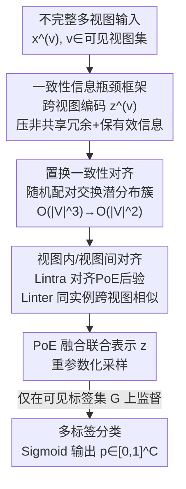

# Permutation-Consistent Variational Encoding for Incomplete Multi-View Multi-Label Classification

**会议**: ICLR2026  
**OpenReview**: [https://openreview.net/forum?id=y4LyiOIOUn](https://openreview.net/forum?id=y4LyiOIOUn)  
**代码**: 待确认  
**领域**: 多视图多标签学习  
**关键词**: 不完整多视图、缺失多标签、信息瓶颈、变分编码、置换一致性

## 一句话总结
针对视图与标签"双缺失"的多视图多标签分类（iM3C），本文提出 PCVE 框架——在信息瓶颈目标下用跨视图变分编码器学习每个视图的共享语义分布，再用一种"置换一致性"正则把不同视图编码出来的同一目标语义对齐，从而在 50% 视图、50% 标签缺失下稳定超越 9 个强基线。

## 研究背景与动机
**领域现状**：多视图多标签学习把同一对象的多种异构来源（图像-文本、多传感器、多模态病历）联合建模，借助视图间的互补与冗余提升语义覆盖、降低歧义。当面对视图缺失时主流做法是低秩矩阵/张量补全、共享-私有分解、对比/一致性学习；当面对标签缺失时则用标签依赖建模 + 自训练去外推未观测标签。但同时处理"视图缺失 + 标签缺失"两种不完整的工作才刚刚出现（DICNet、AIMNet、NAIM3L 等）。

**现有痛点**：多视图学习的核心目标是表示的**充分性（sufficiency）**——联合嵌入应尽量保留视图间共享的任务相关信息、丢弃各视图私有的噪声。非概率深度方法（对比/InfoMax）依赖架构和估计器，给不出充分性保证；而现有的信息论方法大多只做"单变量一致性"——在共享潜空间里最大化成对依赖或对齐原始数据与跨视图表示。这类标量约束太粗，既不保证充分性，也挡不住"没训好/低质量视图"的污染。

**核心矛盾**：当某些视图训练不充分时，传统 PoE/MoE 融合会被强势视图主导、淹没弱视图，导致联合表示里混进信息冗余甚至学习坍缩。问题根子在于：跨视图一致性约束被放在了**融合阶段**（晚了），而且用单一变量 $z$ 表征整个联合编码，隐含假设"$z$ 中归因于视图 $v$ 的分量只来自 $x^{(v)}$"，这种一对一映射在视图失衡时很脆弱。

**本文目标**：在视图与标签任意缺失模式下，学到既紧凑又充分的共享表示，并且无需显式插补就能预测缺失视图。拆成两个子问题：(1) 如何把跨视图对齐**提前**到编码阶段，压掉非共享冗余又不至于坍缩；(2) 如何让一致性约束的复杂度可扩展。

**切入角度**：作者从一个"语义一致性假设"出发——同一样本的不同视图描述的是同一对象，任务相关语义应当一致，即 $I(x^{(1)};y)=I(x^{(2)};y)=\cdots=I(x^{(m)};y)$。由此引出命题：若联合表示 $z$ 恰好包含且只包含所有视图的共享信息，则 $z$ 对预测 $y$ 是充分的。

**核心 idea**：把联合表示显式分解为各视图分量 $\{z^{(v)}\}$，在信息瓶颈框架下"早对齐"——既最大化 $I(z^{(v)};x^{(v)})$ 保留有效信息，又最小化 $I(x^{(u)};z^{(v)}\mid x^{(v)})$ 压掉非共享冗余，并用一个**置换一致性**正则把"编码同一目标语义的不同视图分布"对齐起来。

## 方法详解

### 整体框架
PCVE 的输入是一组可能缺失的视图 $x=\{x^{(v)}\}_{v\in\mathcal{V}}$ 与部分可见的标签集 $\mathcal{G}$，输出是多标签预测概率 $p\in[0,1]^C$。整条流水线分两段：上半段做"多视图共享信息学习 + 重建"，下半段做"跨视图融合 + 多标签分类"。

具体地，每个视图 $x^{(v)}$ 并不是只编码出自己的潜变量，而是通过一组随机编码器 $\{r^n_v(z^{(n)}\mid x^{(v)})\}_{n=1}^m$ 编码出"从源视图 $v$ 到每个目标视图 $n$"的潜分布簇 $\mathcal{C}_v$。这些跨视图分布经 PoE 融合得到视图级后验 $r_v(z^{(v)}\mid x^{(v)})$ 去近似 $p(z^{(v)}\mid x^{(v)})$。信息瓶颈目标（重建项 + 置换一致项）在这一层把各视图的共享语义对齐；随后所有可见视图的后验再经一次 PoE 融合成联合后验 $q(z\mid\{x^{(v)}\})$，重参数化采样出 $\bar z$ 送入小型 MLP + Sigmoid 得到多标签概率，仅在可见标签集 $\mathcal{G}$ 上累计监督。

### 关键设计

**1. 一致性信息瓶颈框架：把跨视图对齐提前到编码阶段**

针对"融合阶段才对齐、易被强势视图主导"的痛点，PCVE 把约束搬到视图级分布建模这一步。它从条件互信息的链式分解出发：对任意视图对 $u\ne v$，有 $I(x^{(u)};z\mid x^{(v)})=\big[I(z;x^{(u)})-I(x^{(v)};x^{(u)})\big]+I(x^{(v)};x^{(u)}\mid z)$，前者是"最小性"、后者是"充分性"。若 $z$ 恰含且只含共享信息，两项均为 0，即达到最小充分性（Corollary 3.1）。把目标落到各视图分量上，得到带 Lagrange 系数 $\beta$ 的无约束目标：

$$\max\ \frac{1}{|\mathcal{V}|}\sum_{v\in\mathcal{V}}I\big(z^{(v)};x^{(v)}\big)\ -\ \beta\cdot\frac{1}{|\mathcal{V}|}\sum_{u\ne v}I\big(x^{(u)};z^{(v)}\mid x^{(v)}\big)$$

第一项最大化 $I(z^{(v)};x^{(v)})$ 保住视图有效信息、防止过压缩坍缩；第二项最小化条件互信息逼出跨视图一致性。两项分别经变分推导得到可优化的下界/上界：$I(z^{(v)};x^{(v)})$ 用变分解码器 $q_v(x^{(v)}\mid z^{(v)})$ 转成重建项 $\mathcal{L}_{re}$；条件互信息项放缩成 KL 散度 $D_{KL}\big(p(z^{(v)}\mid x^{(v)})\,\|\,r_v(z^{(v)}\mid x^{(u)})\big)$，构成置换一致项 $\mathcal{L}_{pc}$。这就把抽象的"充分且最小"目标变成了可训练的 $\mathcal{L}_{ib}=\mathcal{L}_{re}+\beta\mathcal{L}_{pc}$。

**2. 跨视图分布簇分解 + PoE 近似：解耦每视图后验，松开一对一假设**

传统做法用单一 MLP 直接建 $p(z^{(v)}\mid x^{(v)})$，把视图与潜分量绑成一对一。PCVE 改为给每个源视图 $v$ 学一整簇随机编码器 $\{r^1_v,\dots,r^m_v\}$，分别建模"$v\to n$"的方向，再用 PoE 把它们乘起来近似视图后验：

$$p(z^{(v)}\mid x^{(v)})\approx r_v(z^{(v)}\mid x^{(v)}):=r(z^{(v)})\prod_{n=1}^m r^n_v(z^{(v)}\mid x^{(n)})$$

其中先验 $r(z^{(v)}):=\mathcal{N}(0,I)$。这样每个视图的潜表示不再只承载自己，而是被要求承载"它能解释的所有目标视图语义"，因此即便某个视图缺失，其他视图的方向编码器仍能补出对应分量，从而支持无显式插补的缺失视图推断。

**3. 随机置换的先验对齐：把一致性正则的复杂度从立方降到平方**

$\mathcal{L}_{pc}$ 要求视图 $v$ 的潜后验逼近由另一视图 $u$ 构造的后验，朴素实现要遍历所有有序对 $(u,v)$，每个 batch 复杂度 $O(|\mathcal{V}|^3)$。PCVE 引入置换一致性：每次迭代为每个视图 $v$ **随机匹配唯一一个** $u\ne v$，复杂度降到 $O(|\mathcal{V}|^2)$ 又保留正则意图。形式上，定义视图 $v$ 的潜分布簇 $\mathcal{C}_v=\{z^{(v\to n)}\sim r^n_v(z^{(n)}\mid x^{(v)})\}_{n=1}^m$；命题 3.3（置换一致性）指出：随机交换不同簇中对应子变量后，分布应保持一致，即 $D_{KL}\big(z^{(v\to n)}\,\|\,z^{(\pi_n\to n)}\big)=0$。这里 $\pi$ 是长度 $m$ 的随机视图索引序列，且约束 $|\{\pi_i\}|=|\mathcal{V}|$（在可见视图集内无放回采样，例如 $\mathcal{V}=\{1,2,4,6\}$ 时 $\pi$ 可为 $\{4,1,6,2\}$）。这一设计强制网络从所有可见视图编码出一致语义，既保证跨视图对齐又提升了并行度。

**4. 视图内/视图间双对齐：在分量级与实例级再加两道一致性**

为进一步增强语义一致性与鲁棒性，PCVE 补了两项互补对齐。**视图内对齐** $\mathcal{L}_{intra}$ 让每个源编码器 $r^n_v$ 的输出向 PoE 融合后验 $r_v$ 靠拢：$\mathcal{L}_{intra}=\frac{1}{|\mathcal{V}|}\sum_n\sum_v D_{KL}\big(r^n_v(z^{(v)}\mid x^{(v)})\,\|\,r_v(z^{(v)}\mid x^{(v)})\big)$，防止视图特定漂移、在分量级强化分布一致。**视图间对齐** $\mathcal{L}_{inter}$ 用 softmax 加权的余弦相似在同实例跨视图间做对比：对 $\ell_2$ 归一化均值 $\tilde\mu^{(v)}_i$ 定义温度缩放相似度 $s^{(v,u)}_{i,j}=\langle\tilde\mu^{(v)}_i,\tilde\mu^{(u)}_j\rangle/\tau$，目标是把同实例跨视图对的概率质量拉高、不同实例的压低，且只在可见视图集上求和以自然兼容缺失。

### 损失函数 / 训练策略
总目标聚合任务项与各正则项：

$$\mathcal{L}=\mathcal{L}_{ce}+\alpha\,\mathcal{L}_{ib}+\gamma\,\mathcal{L}_{inter}+\lambda\,\mathcal{L}_{intra}$$

其中 $\mathcal{L}_{ce}$ 是仅在可见标签集 $\mathcal{G}$ 上累计的多标签交叉熵（未知标签排除在监督外），$\mathcal{L}_{ib}=\mathcal{L}_{re}+\beta\mathcal{L}_{pc}$ 由 $\beta$ 平衡跨视图的信息压缩与保留，$\alpha$ 控制 IB 策略占比；为方便起见 $\gamma,\lambda$ 都设为 0.1。实现上潜维度 512、batch 128、SGD 初始学习率 0.001，每个 mini-batch 对潜变量采样 10 次取均值作为稳健估计。

## 实验关键数据

### 主实验
在 Corel5k、Pascal07、ESPGame、IAPRTC12、MIRFLICKR 五个标准多视图多标签基准上，统一设置 50% 视图缺失 + 50% 标签缺失，每样本 6 个视图（GIST/HSV/DenseHue/DenseSift/RGB/LAB），数据切分 70%/15%/15%。对比 9 个强基线（CDMM、DM2L、LVSL、iMVWL、NAIM3L、DICNet、DIMC、MSLPP、SIP）。六个指标统一为越高越好（AP、AUC、1-RL、1-HL、1-OE、1-Cov）。

| 数据集 | 指标 | PCVE | 次优 SIP | 提升 |
|--------|------|------|----------|------|
| Corel5k | AP | **0.421** | 0.418 | +0.003 |
| Corel5k | 1-RL | 0.910 | **0.911** | 持平 |
| Corel5k | 1-OE | **0.493** | 0.489 | +0.004 |
| Corel5k | 1-Cov | **0.790** | 0.787 | +0.003 |
| Pascal07 | AP | **0.559** | 0.555 | +0.004 |
| Pascal07 | 1-HL | **0.934** | 0.931 | +0.003 |
| Pascal07 | 1-RL | **0.834** | 0.830 | +0.004 |
| Pascal07 | AUC | **0.857** | 0.850 | +0.007 |

PCVE 在所有数据集的六个指标上"匹配或超越"最优基线，相对此前最强基线（SIP）有统计上一致的提升，尤其在排序类指标（AUC、1-RL）与覆盖类指标（1-Cov）上更稳。

### 消融实验
论文正文称完整消融见附录。从总目标可拆解出各组件的角色：

| 配置 | 作用 | 说明 |
|------|------|------|
| Full（$\mathcal{L}_{ce}+\alpha\mathcal{L}_{ib}+\gamma\mathcal{L}_{inter}+\lambda\mathcal{L}_{intra}$） | 完整模型 | 双缺失下 SOTA |
| w/o $\mathcal{L}_{pc}$（置换一致项） | 跨视图早对齐失效 | 退回单变量一致性，易受弱视图污染 |
| w/o $\mathcal{L}_{re}$（重建项） | 视图有效信息丢失 | $z^{(v)}$ 易坍缩为非信息表示 |
| w/o $\mathcal{L}_{intra}/\mathcal{L}_{inter}$ | 去掉双对齐 | 分量级/实例级一致性减弱 |

> ⚠️ 具体消融数值原文置于附录、本缓存未含，上表为按损失结构推断的组件作用，**以原文为准**。

### 关键发现
- 置换一致性 $\mathcal{L}_{pc}$ 是把一致性约束"早化"的关键，既避免了 PoE 融合被强势视图主导，又用随机配对把复杂度从 $O(|\mathcal{V}|^3)$ 降到 $O(|\mathcal{V}|^2)$。
- 重建项不可少：只压不保会导致 $z^{(v)}$ 信息坍缩，这也是 IB 目标必须同时含"充分"与"最小"两端的原因。
- 无需显式插补即可推断缺失视图——靠的是每视图编码一整簇跨视图方向分布，缺失视图的分量可由其他视图补出。

## 亮点与洞察
- **"早对齐"思路**：把跨视图一致性从融合阶段挪到编码阶段，是对 PoE/MoE 视图失衡问题的对症下药，比在 $z$ 上做事后约束更彻底。
- **置换一致性是个聪明的工程-理论双赢**：用随机无放回置换近似"所有有序对"的正则，既给出 $D_{KL}=0$ 的理想刻画，又顺手把立方复杂度砍成平方、提升并行度——这种"正则等价 + 复杂度降阶"的 trick 可迁移到其他需要成对一致性约束的多视图/多模态场景。
- **分布簇分解**：让每个视图编码"到所有目标视图"的方向分布，把缺失视图推断和表示对齐统一进同一套编码器，是无插补缺失处理的优雅写法。

## 局限与展望
- 主实验只在 50%/50% 的固定缺失率、五个图像多视图基准上验证，更高缺失率、文本/多模态病历等异构场景的泛化性需进一步看（摘要提及"diverse missing ratios"但缓存正文主要给了 50% 设置）。
- 完整消融与缺失率扫描放在附录、本缓存未含，单看正文难以判断各正则项的精确贡献量级。
- 置换的随机性可能带来训练方差，论文用每 batch 采样 10 次取均值缓解，但置换策略本身（是否需要更结构化的配对）仍有探索空间。
- $\gamma,\lambda$ 直接固定为 0.1"图方便"，缺少对这两个对齐项权重的敏感性分析。

## 相关工作与启发
- **vs DICNet（多视图对比 + iM3C）**: DICNet 首次把多视图对比学习引入 iM3C 并显著提升；PCVE 改走信息论变分路线，用 IB 目标给出充分性刻画，并把一致性提前到编码阶段，而非在表示空间做对比。
- **vs NAIM3L（双索引缺失处理）**: NAIM3L 用双索引信息缓解视图/标签缺失的负面影响；PCVE 则用跨视图分布簇 + PoE 实现无显式插补的缺失视图推断。
- **vs SIP / 单变量信息论方法**: 现有信息论方法多只做单变量一致性（最大化成对依赖），约束粗、无充分性保证；PCVE 把目标分解到各视图分量并加置换一致正则，既保最小充分又抗弱视图污染，在五基准上一致优于 SIP。

## 评分
- 新颖性: ⭐⭐⭐⭐ 把信息瓶颈"早对齐" + 置换一致性降复杂度组合用于双缺失 iM3C，角度清晰
- 实验充分度: ⭐⭐⭐⭐ 五基准九基线全指标对比扎实，但正文缺失率设置较单一、消融在附录
- 写作质量: ⭐⭐⭐⭐ 变分推导完整、动机层层递进，部分符号偏密
- 价值: ⭐⭐⭐⭐ 无插补缺失推断 + 复杂度降阶对多视图多标签实际部署有参考价值

<!-- RELATED:START -->

## 相关论文

- [\[CVPR 2026\] EXOTIC: External Vision-driven Incomplete Multi-view Classification](../../CVPR2026/others/exotic_external_vision-driven_incomplete_multi-view_classification.md)
- [\[CVPR 2026\] DF²-VB: Dual-level Fuzzy Fusion with View-specific Boosting for Multi-view Multi-label Classification](../../CVPR2026/others/df2-vb_dual-level_fuzzy_fusion_with_view-specific_boosting_for_multi-view_multi-.md)
- [\[ICLR 2026\] Aligning Collaborative View Recovery and Tensorial Subspace Learning via Latent Representation for Incomplete Multi-View Clustering](aligning_collaborative_view_recovery_and_tensorial_subspace_learning_via_latent_.md)
- [\[CVPR 2026\] Prototype-based Causal Intervention for Multi-Label Image Classification](../../CVPR2026/others/prototype-based_causal_intervention_for_multi-label_image_classification.md)
- [\[AAAI 2026\] Deep Incomplete Multi-View Clustering via Hierarchical Imputation and Alignment](../../AAAI2026/others/deep_incomplete_multi-view_clustering_via_hierarchical_imputation_and_alignment.md)

<!-- RELATED:END -->
