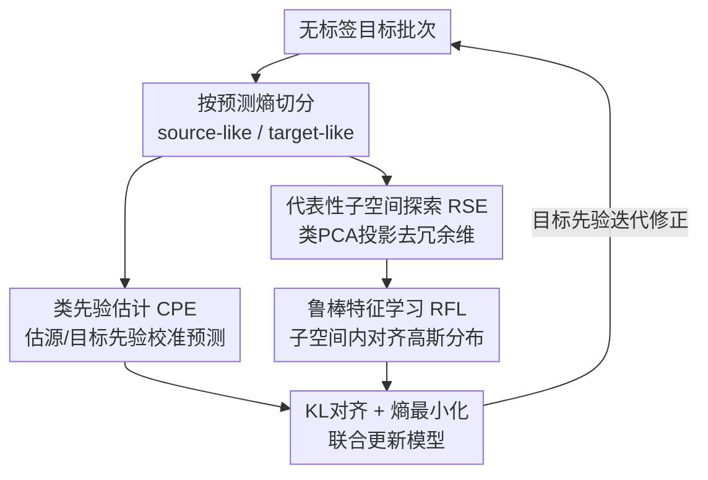

# Prior-Free Tabular Test-Time Adaptation

**会议**: ICLR 2026  
**OpenReview**: [https://openreview.net/forum?id=BgSDPE24pa](https://openreview.net/forum?id=BgSDPE24pa)  
**代码**: https://github.com/rundohe/PFT3A  
**领域**: 表格数据 / 测试时自适应 / 分布偏移  
**关键词**: 表格数据、测试时自适应、标签偏移、特征偏移、prior-free

## 一句话总结
PFT3A 针对表格数据的测试时自适应，在**既不能访问源数据、也不知道任何源域先验**的严苛设定下，用三个模块（类先验估计、鲁棒特征学习、代表性子空间探索）同时缓解标签偏移和特征偏移，在 5 个 TableShift 数据集、3 种 backbone 上稳定超过现有 SOTA。

## 研究背景与动机
**领域现状**：深度模型在欺诈检测、医疗诊断等表格任务上已是主力，但部署时常遇到训练（源）与测试（目标）分布不一致——时间漂移、地域差异、采样偏差都会让精度大幅下滑。测试时自适应（TTA）用无标签的测试数据在推理阶段更新模型，是应对分布偏移的热门方案，代表方法如 Tent、EATA。

**现有痛点**：现有 TTA 几乎都为视觉模态设计，直接搬到表格上往往**还不如不做自适应**——论文 Fig. 2(a) 显示 TENT 平均精度 58%、ODS 57.56%，都低于 Non-Adaptation 的 60.77%。而专为表格设计的方法又各有依赖：AdapTable、TabLog 需要访问源训练数据；FTAT 虽然不要源数据，但仍依赖从源分布得到的**类先验**，一旦拿不到先验，FTAT 在 HELOC、Health Ins.、ASSIST 上精度明显跳水。

**核心矛盾**：真实场景常常**既没有源数据、也没有任何域先验**，但表格偏移又同时包含两种类型——TableShift 把它们分成特征偏移（feature shift，输入分布变了）和标签偏移（label shift，类别分布变了）。已有方法要么只治标签偏移、要么靠"过滤低置信样本"绕开特征偏移，而过滤会把携带目标域特性的样本一并丢掉，反而把模型拉回源域、损害泛化。

**本文目标**：定义并解决一个新问题——prior-free 表格 TTA：在不访问源数据、不使用任何先验、也不靠过滤测试数据的前提下，同时缓解标签偏移和特征偏移。

**切入角度**：作者的关键观察是，源训练好的模型遇到"像源域"的样本时预测更自信、遇到"像目标域"的样本时更不确定。于是可以**用预测熵把无标签目标批次劈成 source-like 与 target-like 两堆**，用它们当源/目标的代理分布，从而在没有源数据的情况下也能估计先验、对齐特征。

**核心 idea**：用预测熵构造源/目标代理分布 → 估类先验校准预测治标签偏移 → 在代表性子空间里对齐两个代理分布治特征偏移，全程不碰源数据和先验。

## 方法详解

### 整体框架
PFT3A 在每个到达的无标签目标批次 $D_t^j$ 上在线运行，由三个模块串联：先用预测熵把这一批样本切成 source-like 集 $\hat{S}^j$ 和 target-like 集 $\hat{T}^j$；**类先验估计（CPE）**用这两堆数据估出源/目标类先验，按比例缩放校准模型预测、压住标签偏移；**鲁棒特征学习（RFL）**把两堆特征各自拟合成高斯，最小化二者的 KL 散度让特征分布对齐、压住特征偏移；但表格（尤其二分类）特征高度冗余、很多维方差为零，直接全维 KL 会数值不稳，于是 **代表性子空间探索（RSE）**先用类 PCA 找出最有信息的子空间，把特征投影进去再对齐。最后特征对齐损失加熵最小化损失联合优化，更新模型后用于本批预测，并把目标先验迭代修正后带入下一批。

### 关键设计

**1. 类先验估计（CPE）：没有源数据也能估出类先验来治标签偏移**

要校准标签偏移，传统做法需要知道源类先验 $p_S$，可 prior-free 设定下它不可得。CPE 的办法是借模型自身的"自信度"来无监督地区分源/目标代理数据：对第 $j$ 批每个样本算预测概率 $\hat{p}_i = f_{\theta_{j-1}}(x_i)$ 和熵 $H(\hat{p}_i) = -\sum_k \hat{p}_i^{(k)} \log \hat{p}_i^{(k)}$，以阈值 $\epsilon$ 切成 $\hat{S}^j = \{x_i \mid H(\hat{p}_i) < \epsilon\}$（低熵、像源域）和 $\hat{T}^j = \{x_i \mid H(\hat{p}_i) > \epsilon\}$（高熵、像目标域）。源先验只用**第一批**的 source-like 集估计 $\hat{p}_S = \frac{1}{N_{\hat{S}^1}} \sum_{i\in\hat{S}^1} \hat{p}_i$，因为此时模型还没被目标数据"污染"，对源域知识保留最完整。

目标先验初值同理由 $\hat{T}^1$ 得到，但模型没见过目标数据、初估偏差大，于是逐批迭代修正：$\hat{p}_T^j = \mathrm{Norm}(\hat{p}_T^{j-1} - \hat{C}_j^{-1}\tilde{p}_S^j)$，其中 $\hat{C}_j$ 是第 $j$ 批的协方差矩阵、$\tilde{p}_S^j$ 为当前批 source-like 均值，$\hat{C}_j^{-1}\tilde{p}_S^j$ 充当偏差校正项。拿到 $\hat{p}_S, \hat{p}_T^j$ 后按通道比例缩放校准预测：$\tilde{f}_{\theta_{j-1}}(x_i) = f_{\theta_{j-1}}(x_i) \circ \frac{\hat{p}_T^j}{\hat{p}_S}$，把源训练时的类别分布偏置纠回目标域，直接对症标签偏移。消融里去掉 CPE 掉点最狠，说明它是三模块里贡献最大的一个。

**2. 鲁棒特征学习（RFL）：对齐特征分布而非过滤样本来治特征偏移**

特征偏移的根源是源/目标特征分布不一致。已有方法靠"过滤低置信样本"绕开它，但低置信样本恰恰携带目标域特性，丢掉它们会把模型偏回源域。RFL 改成正面对齐：把 $\hat{S}^j$、$\hat{T}^j$ 过特征提取器 $g$ 得到两组特征，假设它们服从高斯，分别算出源代理分布的均值 $\mu_S^j$、方差 $(\sigma^2)_S^j$ 和目标代理分布的 $\mu_T^j$、$(\sigma^2)_T^j$（均值方差按逐元素统计得到），再最小化两高斯之间的 KL 散度

$$\mathcal{L}_{KL} = \mathrm{KL}\big(\mathcal{N}(\mu_S^j,(\sigma^2)_S^j) \,\|\, \mathcal{N}(\mu_T^j,(\sigma^2)_T^j)\big).$$

高斯假设让 KL 有闭式解、计算高效。这样源/目标特征被拉到同一分布，学到的是跨域不变特征，从机制上弥合差距，而不是把目标特有样本删掉，泛化自然更好。

**3. 代表性子空间探索（RSE）：只对齐有信息的子空间，避免冗余维拖累对齐**

TableShift 多是二分类，特征不如多分类丰富，很多维方差为零、信息冗余。直接在全维上算 RFL 的 KL 会有两个麻烦：冗余维的方差项让 KL 数值不稳；大量无效维稀释对齐效果。RSE 借类 PCA 解决：对 source-like 特征算协方差矩阵 $\Sigma_S^j = \frac{1}{N_{\hat{S}^j}} \sum (\hat{z}_i - \hat{\mu}_S^j)(\hat{z}_i - \hat{\mu}_S^j)^T$，取前 $m$ 个最大特征值对应的特征向量构成投影矩阵 $V_S \in \mathbb{R}^{m\times d}$，把特征投到子空间 $z_i^{proj} = V_S g_{\phi_{j-1}}(x_i)$，然后在这个 $m$ 维子空间里重算均值方差、做 KL 对齐（Eq. 14 形式同上）。

这样做不仅去掉了非判别性冗余维、抑制虚假相关，论文还论证子空间内的特征更接近高斯（中心极限定理）、且经 PCA 后各维解耦，让"高斯假设 + KL 闭式解"在子空间里更站得住脚。

### 损失函数 / 训练策略
除子空间内的特征对齐损失 $\mathcal{L}_{KL}$ 外，还按经典 TTA 加熵最小化损失 $\mathcal{L}_{ent} = -\sum_k \hat{p}_i^{(k)} \log \hat{p}_i^{(k)}$ 提升预测确定性。总目标为

$$\mathcal{L}_{all} = \beta_1 \mathcal{L}_{KL} + \beta_2 \mathcal{L}_{ent},$$

其中 $\beta_1, \beta_2$ 平衡两项；$\zeta$（关联熵阈值 $\epsilon$）控制源/目标切分、$m$ 控制子空间维度。数据以批为单位在线到达，逐批更新模型并迭代修正目标先验。

## 实验关键数据

### 主实验
5 个 TableShift 数据集（HELOC、ANES、Health Ins.、ASSIST、Hypertension），样本量 10K–5M、特征 26–365 维；三种 backbone（MLP / TabTransformer / FT-Transformer），指标为 Acc / BAcc / F1。下表为 TabTransformer backbone 的平均结果：

| 方法 | Avg Acc | Avg BAcc | Avg F1 |
|------|---------|----------|--------|
| Non-Adaptation | 60.77 | 63.46 | 59.92 |
| TENT | 58.00 | 61.62 | 52.43 |
| EATA | 59.94 | 62.60 | 62.05 |
| ODS | 57.56 | 61.35 | 57.53 |
| FTAT | 64.25 | 65.57 | 66.38 |
| **PFT3A（本文）** | **68.59** | **67.42** | **72.65** |

PFT3A 比 Non-Adaptation 提升 7.82 / 3.96 / 12.73（Acc/BAcc/F1），比此前最强的表格方法 FTAT 再提升 4.34 / 1.85 / 6.27。多数视觉 TTA 方法（TENT、ODS）甚至低于不自适应，印证直接套用视觉方法在表格上行不通。MLP 与 FT-Transformer backbone 上结论一致（如 MLP backbone 平均 Acc 69.25、FT-Transformer 68.01），体现跨架构泛化性。

### 消融实验
TabTransformer backbone 下逐个去掉模块（Acc）：

| 配置 | HELOC | Health Ins. | ASSIST | 说明 |
|------|-------|-------------|--------|------|
| w/o CPE | 60.46 | 58.29 | 53.14 | 去类先验估计，掉点最严重 |
| w/o RFL | 65.94 | 73.42 | 58.39 | 去鲁棒特征学习 |
| w/o RSE | 65.74 | 73.40 | 58.53 | 去子空间探索 |
| **PFT3A** | **66.17** | **74.13** | **59.29** | 完整模型 |

### 关键发现
- **CPE 贡献最大**：去掉它在 Health Ins. 上从 74.13 掉到 58.29（−15.8 点）、HELOC 从 66.17 到 60.46，说明标签偏移校准是 prior-free 表格 TTA 的主要瓶颈。
- RFL 与 RSE 各自去掉只小幅掉点，但二者配合（先去冗余维再对齐）才能稳定收益，呼应"全维对齐次优"的分析。
- 超参 $\beta_1, \beta_2, \zeta, m$ 均呈先升后降，需适度调参平衡各模块，过大过小都会损害性能。

## 亮点与洞察
- **用预测熵免费造出源/目标代理分布**：在拿不到源数据的情况下，靠"源模型对像源样本更自信"这一性质把无标签批次自切两堆，是整套方法的支点——既给了类先验估计的素材，也给了特征对齐的两端。
- **正面对齐取代过滤**：把"丢掉低置信样本"换成"对齐源/目标特征"，从机制上避免了过滤导致的源域偏置，这一思路可迁移到其他模态的 source-free TTA。
- **针对表格冗余的子空间对齐**：先 PCA 去冗余再做高斯 KL，既解决数值不稳又顺势让高斯假设更成立，是对表格数据特性的针对性利用，而非照搬视觉方法。

## 局限与展望
- 高斯假设、熵阈值切分都建立在"源模型对源域更自信"这一前提上，若源模型本身校准很差（过自信/欠自信），source-like/target-like 切分可能失真。
- 主要在 TableShift 的二分类/低类别多样性数据上验证，多分类、特征更丰富场景下 RSE 去冗余的收益是否仍然显著有待检验。
- 阈值 $\epsilon$、子空间维度 $m$ 等超参需要调，而 prior-free 设定下缺乏验证集，实际部署时如何稳健选参是开放问题。

## 相关工作与启发
- **vs FTAT**：同样 source-free，但 FTAT 仍依赖源类先验、且靠过滤低置信样本应对特征偏移；PFT3A 彻底去掉先验依赖、改用特征对齐，prior-free 设定下平均 Acc 再高出约 4.3 点。
- **vs 视觉 TTA（TENT / EATA / CoTTA / SAR）**：它们更新 BN 层或做样本选择，为视觉设计，未考虑表格特征冗余与高维异质，搬到表格上常不如不自适应；PFT3A 针对表格特性重新设计了对齐与先验估计。
- **vs AdapTable / TabLog**：这些表格方法需访问源训练数据，PFT3A 不需要，更贴近真实部署约束。

## 评分
- 新颖性: ⭐⭐⭐⭐⭐ 首次定义并解决 prior-free 表格 TTA，三模块设计针对性强。
- 实验充分度: ⭐⭐⭐⭐ 5 数据集 × 3 backbone + 消融 + 超参分析，覆盖较全。
- 写作质量: ⭐⭐⭐⭐ 问题分析（三条 limitation）到方法映射清晰。
- 价值: ⭐⭐⭐⭐ 贴合无源数据/无先验的真实表格部署场景，实用性高。

<!-- RELATED:START -->

## 相关论文

- [\[ICLR 2026\] PriorGuide: Test-Time Prior Adaptation for Simulation-Based Inference](priorguide_test-time_prior_adaptation_for_simulation-based_inference.md)
- [\[ICLR 2026\] Articulation in Motion: Prior-Free Part Mobility Analysis for Articulated Objects](articulation_in_motion_prior-free_part_mobility_analysis_for_articulated_objects.md)
- [\[CVPR 2026\] Neural Collapse in Test-Time Adaptation](../../CVPR2026/others/neural_collapse_in_test-time_adaptation.md)
- [\[ICLR 2026\] Exposing Mixture and Annotating Confusion for Active Universal Test-Time Adaptation](exposing_mixture_and_annotating_confusion_for_active_universal_test-time_adaptat.md)
- [\[NeurIPS 2025\] Test-Time Adaptation by Causal Trimming](../../NeurIPS2025/others/test-time_adaptation_by_causal_trimming.md)

<!-- RELATED:END -->
