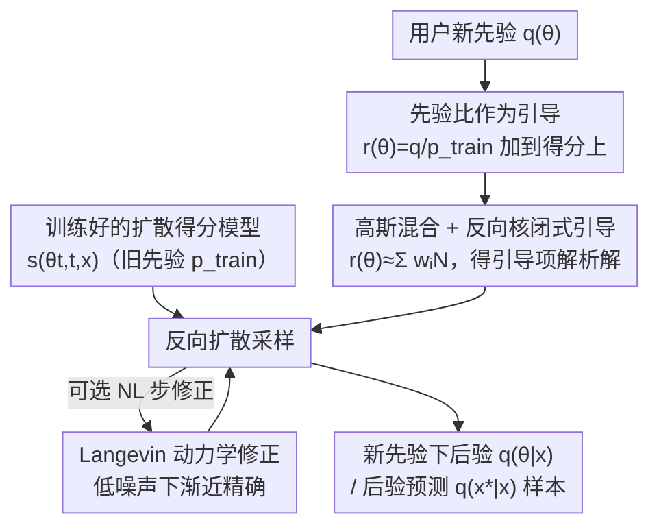

# PriorGuide: Test-Time Prior Adaptation for Simulation-Based Inference

**会议**: ICLR 2026  
**OpenReview**: [https://openreview.net/forum?id=G4I23g5Ugh](https://openreview.net/forum?id=G4I23g5Ugh)  
**代码**: https://github.com/acerbilab/prior-guide  
**领域**: 概率方法 / 仿真推断 / 扩散模型  
**关键词**: 仿真推断(SBI)、摊销贝叶斯推断、扩散引导、先验适配、测试时计算

## 一句话总结
PriorGuide 让一个已经训练好的扩散式摊销仿真推断模型，在**测试时不重训**的前提下换用新的先验分布——它把"换先验"转化为一个加到扩散得分上的引导项，并用高斯混合近似让引导项有闭式解，从而灵活注入专家知识或做先验敏感性分析。

## 研究背景与动机

**领域现状**：仿真推断（Simulation-Based Inference, SBI）面向那些**似然 $p(x\mid\theta)$ 不可解、但能从前向模型采样 $x\sim p(x\mid\theta)$** 的科学问题（工程、神经科学、流行病学等）。近年的主流是**摊销推断**：用扩散模型 / Transformer 在海量仿真的参数-数据对 $(\theta,x)$ 上训练一次，之后对任意新观测 $x$ 都能瞬间给出后验 $p(\theta\mid x)$ 或后验预测 $p(x^\star\mid x)$，无需再调用仿真器。代表作如 Simformer 用 Transformer 建模联合变量 $(\theta_t,x_t)$ 的得分，靠 mask 切换条件即可采各种条件分布。

**现有痛点**：这些方法的后验**被训练时用的先验 $p_{\text{train}}(\theta)$ 死死绑住**。为了覆盖参数空间，训练先验通常取很宽的均匀分布；但实践者往往手里有更具体的领域知识（更窄、更偏、甚至多峰的先验），想用却用不上。更麻烦的是**先验敏感性分析**——验证科学结论对建模假设是否稳健，需要在多组先验下反复推断。换先验在现有范式里代价极高：非摊销方法每换一个先验都要重新仿真，摊销方法则要**整体重训**。重要性采样这类近似在新旧先验差异大时直接失效。

**核心矛盾**：摊销带来的"训一次、到处用"红利，和"先验必须固定"这个约束是绑死的。试图把所有可能的先验都预先摊销进训练（meta-prior 方案，如 ACE 用直方图编码先验、DT 用 GMM 先验）要么只支持特定先验族（如因子化直方图、预定义高斯混合），要么受限于训练时枚举的先验集合——本质上还是"穷举所有任务"，不可扩展。

**本文目标**：在**不碰原得分模型、不重训**的情况下，给扩散式摊销 SBI 模型加上"运行时换任意新先验 $q(\theta)$"的能力，覆盖后验和后验预测两种任务。

**切入角度**：借鉴测试时计算（test-time compute）范式——与其在训练时穷举所有场景，不如把"用户指定的先验"这类特定需求放到**推断时**用专门计算来吸收。作者注意到扩散模型天生支持**引导（guidance）机制**，可以在采样过程中把外部信息加进得分。

**核心 idea**：用"先验比 $r(\theta)=q(\theta)/p_{\text{train}}(\theta)$"把换先验等价转化为给扩散得分加一个**引导项**，再用高斯混合近似让这个引导项有闭式解，从而在采样时一步步把样本从旧先验后验"扳"到新先验后验。

## 方法详解

### 整体框架

PriorGuide 的出发点是一条简洁的恒等式（命题 1）：在新先验 $q(\theta)$ 下采后验 $q(\theta\mid x)\propto q(\theta)p(x\mid\theta)$，等价于对旧后验做**重要性加权**——

$$q(\theta\mid x)\propto \frac{q(\theta)}{p_{\text{train}}(\theta)}\,p_{\text{train}}(\theta)p(x\mid\theta)=r(\theta)\,p(\theta\mid x),\qquad r(\theta)\equiv\frac{q(\theta)}{p_{\text{train}}(\theta)}.$$

也就是说，只要能在采样过程里把先验比 $r(\theta)$ 的作用注进去，就不必重训。把这条关系搬到扩散过程的任意时刻 $t$，新后验在时刻 $t$ 的得分恰好拆成两项：**原得分模型 $s(\theta_t,t,x)$（已有）+ 一个先验引导项**：

$$\nabla_{\theta_t}\log q(\theta_t\mid x)=s(\theta_t,t,x)+\nabla_{\theta_t}\log \mathbb{E}_{p(\theta_0\mid\theta_t,x)}\big[r(\theta_0)\big].$$

整条流程是：给定训练好的扩散得分模型 → 用户提供新先验 $q(\theta)$ → 把先验比 $r(\theta)$ 拟合成高斯混合 → 反向扩散每一步在原得分上叠加闭式引导项（可选地再插 Langevin 步做修正）→ 得到新先验下的后验/后验预测样本。整个过程**不再调用仿真器、不重训网络**，只在测试时增加少量计算。

### 关键设计

**1. 先验比即引导：把"换先验"翻译成扩散得分的加项**

这一设计直接解决"换先验必须重训"的痛点。作者从恒等式 $q(\theta\mid x)\propto r(\theta)p(\theta\mid x)$ 出发，把新先验后验在时刻 $t$ 的边际写成对 $\theta_0$ 的积分 $q(\theta_t\mid x)\propto\int r(\theta_0)p(\theta_0\mid x)p(\theta_t\mid\theta_0)\,d\theta_0$，再对它取对数梯度。关键一步是把联合密度重写为 $p(\theta_0\mid x)p(\theta_t\mid\theta_0,x)=p(\theta_0\mid\theta_t,x)p(\theta_t\mid x)$，从而把"原得分"和"新先验贡献"干净地分离开，得到 $\nabla_{\theta_t}\log q(\theta_t\mid x)=s(\theta_t,t,x)+\nabla_{\theta_t}\log\mathbb{E}_{p(\theta_0\mid\theta_t,x)}[r(\theta_0)]$。这与图像扩散里的 classifier guidance / 逆问题引导是同一套数学，区别在于这里的"引导信号"是**先验比**而非分类器或观测。其代价是要算一个对反向核 $p(\theta_0\mid\theta_t,x)$ 的期望，这个期望不可解，是后两个设计要攻克的对象。

> ⚠️ **先验覆盖前提**：该方法要求新先验 $q(\theta)$ 落在 $p_{\text{train}}(\theta)$ 有非可忽略质量的区域内。否则两件坏事会发生：(a) 在训练样本稀少的区域，学到的得分 $s$ 本身就不准；(b) 先验比 $r(\theta)=q/p_{\text{train}}$ 会变得任意大或病态，引导失稳。作者指出这通常不算苛刻约束，因为摊销模型一般就训在很宽的先验上，并给出 OOD 诊断检查（附录 A.4）。在覆盖范围内，$q$ 可以比 $p_{\text{train}}$ 更集中、多峰或偏移，仍能做有意义的先验适配。

**2. 双高斯近似：让引导项有闭式解，绕开蒙特卡洛的偏差与方差**

设计 1 留下的难题是引导项里那个对反向核的期望无法直接算，朴素做法要模拟反向 SDE 或用蒙特卡洛估期望的得分，既有偏又高方差。作者用两层高斯近似把它做成解析解。其一，把**反向转移核近似为高斯** $p(\theta_0\mid\theta_t,x)\approx\mathcal{N}(\theta_0\mid\mu_{0\mid t},\Sigma_{0\mid t})$，均值由 Tweedie 公式从得分给出 $\mu_{0\mid t}=\theta_t+\sigma(t)^2\nabla_{\theta_t}\log p(\theta_t\mid x)$，协方差取一个随时间缩放的简单形式 $\Sigma_{0\mid t}=\frac{\sigma(t)^2}{1+\sigma(t)^2}I$（$t=1$ 时为单位阵、$t\to0$ 时趋于零，自然地在小噪声处提高先验引导精度）。其二，把**先验比 $r(\theta)$ 表示成广义高斯混合** $r(\theta)\approx\sum_{i=1}^K w_i\mathcal{N}(\theta\mid\mu_i,\Sigma_i)$；注意这是个"比值"不是分布，权重 $w_i$ 不必为正、不必归一，只要 $r(\theta)\ge0$ 即可，因此能表达减性混合等更灵活的形状。当 $p_{\text{train}}$ 是均匀分布时 $r(\theta)\propto q(\theta)$，可以直接把 $q(\theta)$ 指定成高斯混合；非均匀时拟合比值是个标准的函数逼近任务，且因 $p_{\text{train}}$ 与 $q$ 的密度都解析已知，避开了从有限样本做密度比估计的不稳定与高方差。两个高斯一卷积，积分可解析求出，最终对反向核均值的修正写成

$$\mu^{\text{new}}_{0\mid t}=\mu_{0\mid t}+\sigma(t)^2\sum_i \tilde w_i\,(\mu_i-\mu_{0\mid t})^\top\widetilde\Sigma_i^{-1}\nabla_{\theta_t}\mu_{0\mid t},$$

其中 $\widetilde\Sigma_i=\Sigma_i+\Sigma_{0\mid t}$，$\tilde w_i$ 是按各混合分量到当前预测距离重加权后的系数。直觉上它就是把基于旧先验的原始预测 $\mu_{0\mid t}$ 与一组来自新先验的修正项加权相加，修正幅度由噪声调度 $\sigma(t)^2$ 和"混合分量与当前预测的距离"共同控制。论文报告 $K=20$ 已足够表达，且增大 $K$ 几乎不增计算。

**3. Langevin 修正：用渐近精确的 MCMC 步换更高保真**

双高斯近似在高噪声 $t$ 处并不精确，是误差来源。命题 2 指出：当 $t,\sigma(t)\to0$ 时，那个高斯反向核近似会收敛到真实的 $p(\theta_0\mid\theta_t)$，也就是说**引导项在低噪声层是渐近正确的**（误差只剩 GMM 拟合精度）。利用这一点，作者在每个常规扩散步之后插入 $N_L$ 个 **Langevin 动力学步**做 MCMC 修正，把整个采样变成一个退火 MCMC 过程（类似组合式生成和早期无条件扩散里的做法）。这给了用户一个清晰的**测试时计算 vs 推断精度的旋钮**：扩散步数 $N$、Langevin 步数 $N_L\ge0$，总函数评估次数 $\text{NFE}=N\times(N_L+1)$。想要更准就多花算力插更多 Langevin 步，这正是"测试时计算"理念的落地。

**4. 后验预测的无缝推广**

同一套机制几乎零改动地推广到**后验预测**（预测未观测数据 $x^\star$）。从一个训练来生成联合后验预测 $p(x^\star,\theta\mid x)$ 的扩散模型出发，新先验下的联合后验预测同样满足 $q(x^\star,\theta\mid x)\propto r(\theta)\,p(x^\star,\theta\mid x)$，于是得分拆解式 (9) 原封不动变成对 $(x^\star_t,\theta_t)$ 的版本，只是把条件信息从 $\theta_t$ 换成 $\xi^\star_t\equiv(x^\star_t,\theta_t)$。这让 PriorGuide 能直接做时间序列的预报/回溯（forecasting/retrocasting）。

### 损失函数 / 训练策略
PriorGuide **本身不引入任何训练**——它复用一个已用去噪得分匹配（DSM）损失 $\mathcal{L}_{\text{DSM}}=\mathbb{E}_{t,z_0,z_t}[\omega(t)\|s(z_t,t)-\nabla_{z_t}\log p(z_t\mid z_0)\|^2_2]$ 训练好的扩散得分模型（实验用 Simformer），全部工作发生在推断时。唯一的"拟合"是把先验比 $r(\theta)$ 拟合成高斯混合，作者给了一个简单的基于梯度的拟合过程（附录 A.2）。超参数只有两个：扩散步数 $N$ 与 Langevin 步数 $N_L$。

## 实验关键数据

在 6 个 SBI 问题上评测（Two Moons、OUP、Turin 无线电传播、高斯线性 10D/20D、多感觉感知贝叶斯因果推断 BCI），基座为 Simformer。对比 base Simformer（不适配先验）和 ACE（预训练摊销先验适配）。测试时先验分三族：mild（弱信息高斯）、strong（强信息、方差更小）、mixture（双峰高斯混合）。指标：RMSE、C2ST（越接近 0.5 越好）、MMTV（越小越好）。

### 主实验：后验推断（部分代表性结果）

| 问题 / 先验 | 指标 | Simformer | ACE | PriorGuide |
|------|------|------|------|------|
| Two Moons · strong | MMTV | 0.54 | 0.35 | **0.08** |
| Two Moons · strong | C2ST | 0.75 | 0.79 | **0.52** |
| OUP · strong | MMTV | 0.37 | 0.12 | **0.06** |
| Turin · strong | MMTV | 0.56 | 0.47 | **0.08** |
| Turin · mixture | RMSE | 0.23 | 0.19 | **0.13** |
| Gauss Linear 20D · mild | MMTV | 0.29 | 0.11 | **0.05** |
| BCI · strong | MMTV | 0.61 | 0.29 | **0.21** |

PriorGuide 在几乎所有场景下都大幅超过 base Simformer（说明它确实用上了测试时先验），尤其在 strong / mixture 这类强先验下领先最明显；C2ST 普遍被拉回到 ~0.5（后验与真值难以区分）。在高维高斯线性上 RMSE 偶尔略逊 ACE，但 MMTV 始终最优。

### 后验预测（数据预测，OUP / Turin）

| 问题 / 先验 | 指标 | Simformer | ACE | PriorGuide |
|------|------|------|------|------|
| OUP · strong | RMSE | 0.39 | 0.22 | **0.21** |
| OUP · strong | MMDx | 0.54 | 0.30 | **0.29** |
| Turin · strong | RMSE | 0.14 | 0.16 | **0.13** |
| Turin · strong | MMDx | 0.49 | 0.61 | **0.46** |

任务是只观测轨迹的前 30%（或后 30%），预测剩余 70%。PriorGuide 在预报/回溯上与 ACE 持平或更好，且在 Turin 上明显优于把先验信息引偏的 ACE。

### 关键发现
- **强先验场景收益最大**：先验越具体（strong / mixture），PriorGuide 相对 base 的提升越大——这正契合"实践者有领域知识却用不上"的痛点。
- **测试时计算确有用**：在 OUP / Turin 上以 NFE 为横轴扫描 $N$ 与 $N_L$，MMTV 随算力增加沿 Pareto 前沿下降；增加 Langevin 步在固定预算下往往比单纯加扩散步更划算。
- **对 $K$ 稳健**：先验比的高斯混合分量数 $K$ 一旦够表达（如 20）即可，再增大几乎不增计算也不显著改善（附录 D.5）。
- **覆盖是前提**：当新先验偏离训练先验过远（OOD）时引导会失稳，作者专门做了先验距离敏感性分析（附录 D.4）并给出 OOD 诊断。

## 亮点与洞察
- **"换先验=加引导"的视角很优雅**：把贝叶斯里"换先验需重做推断"这件重活，借先验比 $r(\theta)$ 直接映射成扩散引导项，复用了图像扩散里成熟的 guidance 数学，几乎零额外训练成本——这是把两个社区的工具桥接起来的漂亮一手。
- **先验比当混合、权重可负**：因为拟合的是比值不是分布，混合权重不必为正/归一，能表达减性混合等更灵活的形状；而且 $p_{\text{train}}$ 与 $q$ 密度解析已知，避开了密度比估计的高方差陷阱——这个 trick 可迁移到任何"两个已知密度之比"的引导场景。
- **测试时计算旋钮**：$N_L$ 把"要多准"变成"花多少算力"的连续选择，且有 Langevin 在低噪声渐近正确的理论背书，让近似方法有了可控的精度下限。
- **后验预测几乎免费推广**：同一拆解式换个条件变量就同时覆盖参数推断和数据预测，说明该框架的通用性。

## 局限与展望
- **先验覆盖硬约束**：新先验必须落在训练先验的支撑内，对那些训练时压根没覆盖到的"全新区域"无能为力——这本质上限制了"专家知识"能偏离训练假设多远。
- **高维高斯近似的精度**：反向核协方差用了 $\frac{\sigma(t)^2}{1+\sigma(t)^2}I$ 这种各向同性简化，仅在原后验恰为标准正态时对所有 $t$ 精确；高维高斯线性上 RMSE 偶尔逊于 ACE，可能与此近似有关。更精细的协方差近似存在但带来额外计算/实现复杂度。
- **额外推断开销**：要更高保真就得插 Langevin 步，NFE 翻 $N_L+1$ 倍；在仿真器昂贵已被摊销解决的背景下，这把成本部分搬回了采样侧。
- **先验需可写成高斯混合**：虽然 GMM 表达力强，但极端非高斯/重尾先验的拟合质量与 $K$ 的取舍仍需个案验证。

## 相关工作与启发
- **vs Simformer（基座）**：Simformer 学到的条件后验被训练先验 $p_{\text{train}}$ 隐式绑死，换先验要重训；PriorGuide 直接在它之上做推断时引导，不动权重。
- **vs ACE / DT / Sensitivity-aware SBI（meta-prior 路线）**：这些方法靠**预训练在一族先验上**来实现先验适配——ACE 把每个一维先验编码成网格直方图，DT 学"GMM 先验→GMM 后验"的映射，都受限于训练时枚举/参数化的先验族，且常假设因子化先验。PriorGuide 是**纯推断时适配**，无需任何先验相关的预训练，能表达相关的、非因子化的先验，灵活性更高；代价是依赖训练先验的覆盖与高斯近似精度。
- **vs 重要性采样 / 拒绝采样等经典近似**：经典方法在新旧先验差异大时退化严重；PriorGuide 把先验比融进扩散动力学并辅以 Langevin 修正，在强先验下仍稳健。

## 评分
- 新颖性: ⭐⭐⭐⭐⭐ 把"换先验"原理性地转化为扩散引导项，并用先验比高斯混合得闭式解，是真正新的视角
- 实验充分度: ⭐⭐⭐⭐ 6 个 SBI 问题 + 后验/后验预测 + 算力权衡 + 两项消融，覆盖全面；但多为中低维基准
- 写作质量: ⭐⭐⭐⭐⭐ 推导清晰、命题-近似-修正三段递进，动机与图 1 直观
- 价值: ⭐⭐⭐⭐⭐ 直击摊销 SBI"先验固定"的核心痛点，对先验敏感性分析与基础模型化趋势很实用

<!-- RELATED:START -->

## 相关论文

- [\[ICLR 2026\] Prior-Free Tabular Test-Time Adaptation](prior-free_tabular_test-time_adaptation.md)
- [\[ICLR 2026\] Exposing Mixture and Annotating Confusion for Active Universal Test-Time Adaptation](exposing_mixture_and_annotating_confusion_for_active_universal_test-time_adaptat.md)
- [\[CVPR 2026\] Neural Collapse in Test-Time Adaptation](../../CVPR2026/others/neural_collapse_in_test-time_adaptation.md)
- [\[ICML 2026\] TEMPORA: Characterising the Time-Contingent Utility of Online Test-Time Adaptation](../../ICML2026/others/tempora_characterising_the_time-contingent_utility_of_online_test-time_adaptatio.md)
- [\[ICML 2026\] Private and Stable Test-Time Adaptation with Differential Privacy](../../ICML2026/others/private_and_stable_test-time_adaptation_with_differential_privacy.md)

<!-- RELATED:END -->
