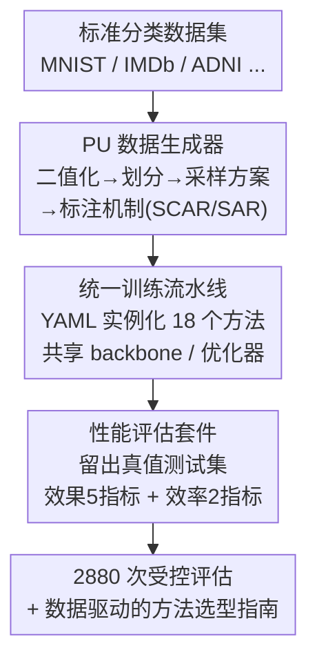

# PU-Bench：面向严谨可复现 PU 学习的统一基准

**会议**: ICLR 2026  
**OpenReview**: [https://openreview.net/forum?id=tb8DabMbMq](https://openreview.net/forum?id=tb8DabMbMq)  
**代码**: https://github.com/XiXiphus/PU-Bench  
**领域**: 表示学习 / 半监督学习 / 基准评测  
**关键词**: PU 学习, 正例-无标注, 基准, 可复现性, 选择偏差

## 一句话总结
PU-Bench 是首个统一的开源 PU（Positive-Unlabeled，正例-无标注）学习基准，用一套可配置的数据生成器 + 统一训练流水线 + 标准化评估套件，把 18 个代表性方法在 8 个数据集、2880 次受控实验下重新跑了一遍，揭示了"没有万能赢家、简单基线 nnPU 仍然能打、效果与效率存在明显 trade-off"等一系列被以往不一致实验设置掩盖的结论。

## 研究背景与动机
**领域现状**：PU 学习要解决的是一个特殊的二分类问题——训练数据里只有一部分正例被标注，剩下的"无标注"集合里混着未被识别的正例和真正的负例。它在推荐系统（只知道用户喜欢什么、不知道讨厌什么）、疾病基因识别、药物相互作用预测、文档检索、医学影像分类等"负例难以或代价高昂去标注"的场景里非常常见。过去几年算法层出不穷，从风险最小化（nnPU、Dist-PU）到伪标注/自训练（Self-PU、P3Mix），再到生成式分布匹配（VAE-PU、PAN）。

**现有痛点**：算法越来越多，却没有一个标准化、统一、全面的基准来做公平比较。这带来两个致命问题。其一，实验设置严重不一致：不同论文用不同数据集、不同的数据采样方案（单训练集 ss vs. 案例-对照 cc）、不同的标注假设（SCAR vs. SAR），导致结果互不可比。其二，PU 方法对经验性因素（标注比例、标注机制）极其敏感，作者的实证发现这些因素的变化足以颠覆 SOTA 方法之间的相对排名——而既然这些因素在以往工作里没被统一控制，很多已发表的对比可能根本没反映方法的真实能力。

**核心矛盾**：PU 方法的"性能"高度依赖于数据生成与标注的隐含设置，但这些设置恰恰是各家论文自行其是、最不透明的部分。于是"谁更强"成了一个被实验配置左右的伪命题。

**本文目标**：把"数据怎么生成、模型怎么训练、指标怎么算"这条完整链路全部标准化，让 PU 方法的比较第一次建立在受控、可复现的同一地基上。

**核心 idea**：不发明新算法，而是造一套统一基准——用一个可配置的 PU 数据生成器固定输入分布、用一条配置驱动的训练流水线消除混杂变量、用一套统一评估套件同时量化效果与效率，然后做一次史上最大规模的实证扫描，把被噪声掩盖的真实性能图景画出来。

## 方法详解

### 整体框架
PU-Bench 不是一个模型，而是一套模块化、配置驱动的评测框架，目标是把 PU 学习实验从输入到输出全程标准化。它由三个可互操作的核心组件串成一条流水线：**阶段一 PU 数据生成器**把标准分类数据集系统地转换成可复现的 PU 场景（二值化 → 划分 → 选采样方案 → 选标注机制）；**阶段二统一训练流水线**用外部 YAML 描述符实例化全部 18 个方法，在同一套 backbone、优化器、调度策略下训练，消除混杂变量；**阶段三性能评估套件**在留出的、带真值的测试集上统一计算 5 个效果指标和 2 个效率指标，并归档配置、随机种子、指标轨迹与硬件信息以保证完全可复现。整套实验覆盖 8 个数据集 × 18 个方法 × 每对 20 种配置，合计 2880 次受控评估。

### 关键设计

**1. PU 数据生成器：用一条可配置流水线消灭"数据生成的不一致"**

以往各家论文构造 PU 数据的方式五花八门——正例集大小、无标注集分布假设、采样设计各不相同，这正是结果不可比的源头。生成器把这一步彻底标准化成一条结构化的多阶段流水线：先用二值化模块把多分类数据集按"塌缩规则"折成正-负（PN）二分类，再划分为训练/验证/测试集，并固定训练集总量 $N$ 与类先验 $\pi = p(Y=1)$；然后选定一个**采样方案**决定标注正例 $L_P$ 从哪来——单训练集（ss）从总体分布 i.i.d. 抽样、只有其中的正例有机会被标注，案例-对照（cc）则让 $L_P$ 从 $p(x\mid Y=1)$ 抽、无标注集从总体 $p(x)$ 抽，两者的关键区别在于无标注集的成分构成；最后由**标注比例** $c$ 控制采样多少 $L_P$、由**标注机制**定义选择策略。机制支持四种：(S1) 标准 SCAR，每个正例被标注概率恒定 $e(x)=c$；(S2)(S3) 两种 SAR 实例相关采样，倾向高后验或边界模糊的正例；(S4) 后验锐化策略，在锐化后验下确定性地挑选最高分正例。一句话，它把"采样方案 × 标注比例 × 标注机制"做成可组合的旋钮，让所有方法吃到完全一致的输入。

**2. 统一训练流水线：用 YAML 描述符把"训练协议的混杂变量"清零**

不同论文的训练协议、超参搜索、指标选择都不一样，让结论无法聚合。这一层用一个完全模块化、配置驱动的框架来解决：全部 18 个算法都从外部 YAML 描述符实例化，描述符指定 backbone、PU 损失函数和共享超参（优化器类型、学习率调度、权重初始化）。框架通过针对文本/图像/表格的专用编码器兼容多模态。训练时先加载配置和 PU 格式数据，实例化对应的 PU 学习准则与学习器，再由统一 trainer 自动完成前向/反向、损失计算、指标记录与 checkpoint。关键在于"改个 YAML 就能换方法/换超参"，从而让所有方法在同一套训练骨架下被公平地跑出来，而不是各自带着私有 trick。

**3. 性能评估套件：用统一协议同时量化"效果与效率"两个被割裂的维度**

文献里的报告口径不一致，既掩盖了跨方法比较的公平性，也遮蔽了不同方案的实际 trade-off。评估套件强制所有指标都在留出的、带真值的测试集上计算。效果维度记录 5 个广泛使用的指标：准确率（Acc）、精确率、召回率、macro-F1、ROC 曲线下面积（AUC）；效率维度记录每个 epoch 的 wall-clock 时间与峰值 GPU 显存。每当验证集 macro-F1 刷新最佳就写一个 checkpoint，并把完整配置、种子、指标轨迹和硬件统计全部归档。这种"效果 + 效率"双焦点正是以往普遍缺失的，它让"某方法显存吃到 7-8 GB 却只换来略高 F1"这类实际权衡第一次被摆到台面上。

### 损失函数 / 训练策略
作为基准，PU-Bench 本身不提出新损失，而是把 18 个方法按算法策略分成三类来组织评测：**风险最小化估计器**（直接在 PU 约束下最小化经验风险或其变体，如 nnPU、PUSB、VPU、Dist-PU 等 8 个）；**消歧引导的监督 ERM**（先用伪标注/选代理负例消解无标注池的歧义，常借助 mixup、一致性正则或师生自训练，再在 $L_P \cup U$ 上做标准监督训练，如 Self-PU、P3Mix、Robust-PU 等 6 个）；**生成式分布匹配**（用生成或对抗建模对齐正例与无标注分布，如 PAN、VAE-PU、CGenPU 共 3 个）。主实验在最常用的"约定俗成"配置下进行：案例-对照采样、SCAR 标注、固定 $c=0.1$；并对每个方法相对 nnPU 做带 Holm–Bonferroni 校正的双边配对 t 检验，确认准确率差异是否稳健。

## 实验关键数据

### 主实验
主表（约定俗成配置：cc 采样 + SCAR + $c=0.1$）给出全部 18 个方法在 8 个数据集上的准确率，并附 PN（全监督 oracle）作为性能上限。下表摘取若干代表性数字（准确率 %）：

| 方法 | 类别 | MNIST | F-MNIST | CIFAR-10 | ADNI |
|------|------|--------|---------|----------|------|
| nnPU | 风险最小化 | 94.85 | 96.67 | 85.30 | 65.75 |
| LBE-PU | 风险最小化 | 97.23 | 98.42 | 83.98 | 65.75 |
| Dist-PU | 风险最小化 | 95.70 | 95.31 | 88.09 | 75.02 |
| P3Mix-C | 消歧 ERM | 95.23 | 96.53 | 87.65 | 67.69 |
| LaGAM-PU | 消歧 ERM | 95.03 | 97.69 | 86.22 | 63.64 |
| VAE-PU | 生成匹配 | 76.56 | 61.29 | 49.24 | 50.38 |
| **PN (oracle)** | 全监督 | 96.54 | 98.94 | 94.88 | 82.01 |

可以看到 LBE-PU 在简单图像（MNIST/F-MNIST）上甚至逼近或超过全监督 PN，但在复杂的 ADNI 上明显退化；生成式方法整体垫底，VAE-PU 在 CIFAR-10 上只有 49.24%（接近随机）。

### 消融实验
本文不是模型论文，没有传统模块消融，而是沿"配置维度"做鲁棒性扫描，等价于揭示各方法对设置的敏感度：

| 扰动维度 | 配置 | 关键发现 |
|---------|------|----------|
| 标注比例 $c$ | $0.01 \to 0.9$ | 风险最小化与消歧 ERM 标注效率高（$c<0.1$ 即快速饱和，如 VPU/P3Mix-C 在 CIFAR-10 上 $c=0.03\sim0.05$ 就接近峰值）；生成式方法曲线紊乱、扩展性差 |
| 标注机制 | SCAR → S2/S3/S4 (SAR) | 切到 SAR 出现普遍退化；专为偏差设计的 PUSB、LBE-PU 在低标注（$c=0.05$）下抗性更强、惩罚更小 |
| 效率 | 时间 / 显存 | nnPU、PUSB 秒级完成 epoch、显存 <1 GB；VAE-PU 显存高达 7-8 GB；PUL-CPBF、Holistic-PU 多阶段架构最耗时 |

### 关键发现
- **没有万能赢家**：最优方法高度依赖数据模态——LBE-PU 在简单图像登顶却在 ADNI 退化，VPU/P3Mix 跨模态更稳但很少夺冠。方法选型必须对齐问题特性。
- **简单基线 nnPU 仍然能打**：尽管结构最简单，nnPU 在各模态保持均衡且常胜过更新的方法，说明该领域进展并非线性、一些早期原理依旧鲁棒。这也直接催生作者的呼吁：新方法必须对标 nnPU/VPU 这类强而高效的基线才能证明novelty。
- **效果-效率 trade-off 清晰**：VPU、Self-PU、Dist-PU 取得"高 F1 + 短训练 + 低显存"的好平衡；而 Holistic-PU、VAE-PU、PUL-CPBF 最耗算力却 F1 更低或更不稳，实用性受限。
- **偏差感知建模的收益主要出现在低标注区**：标签充足（$c=0.5$）时鲁棒的 SCAR 学习器（如 VPU）甚至能反超专门的 SAR 方法，说明标注比例与选择偏差之间存在关键交互。

## 亮点与洞察
- **把"基准"本身当成研究贡献**：作者没有卷新算法，而是认识到 PU 学习真正的瓶颈是"实验地基不统一"，用 2880 次受控评估把被噪声掩盖的真实排名翻出来——这种"打地基"的工作对一个碎片化领域的价值往往高于又一个 +0.5% 的方法。
- **数据生成器的旋钮化设计可复用**：把"采样方案 × 标注比例 × 标注机制（含 4 种 SCAR/SAR）"做成可组合配置，这套思路可迁移到任何"输入分布假设隐含且各家不一致"的弱监督子领域（如带噪学习、半监督）做公平基准。
- **效果与效率联合评估戳中盲点**：很多 PU 论文只报 F1/AUC，PU-Bench 把每 epoch 时间与峰值显存一起摆出来，立刻让"显存 7-8 GB 换来略高 F1"的方法现形——这是可直接复用的评测准则。

## 局限与展望
- 作者承认主实验主要锁定在"约定俗成"配置（cc + SCAR + $c=0.1$）建立可比基线，虽然进一步分析扫了标注比例与机制，但更极端的真实世界胁迫（极端稀疏 + 强选择偏差叠加）仍暴露出多数方法的脆弱，现有算法能力与实际需求间存在显著 gap。
- 收录的 18 个方法以"领域无关 + 有公开实现"为筛选标准，排除了代码不可得或不可复现的方法，因此并非覆盖全部 PU 文献；同时方法集停在 2024 年左右，新方法需后续并入。
- 自己观察：基准目前限于 8 个相对标准的学术数据集与二分类设定，类先验 $\pi$ 被当作已知/固定量，而真实场景里 $\pi$ 估计本身就是 PU 学习的难点之一，这一维度的鲁棒性尚未被系统扫描。
- 未来方向（作者）：一是推动更严谨的标准化评测，让新方法必须对标 nnPU/VPU 这类强基线；二是面向极端有限且有偏监督设计天生鲁棒的方法。

## 相关工作与启发
- **vs 单篇 PU 方法论文（nnPU、Dist-PU、P3Mix 等）**：它们各自提出算法并在自选设置下声称 SOTA，本文把它们放进同一套数据生成 + 训练 + 评估管线统一复现，区别在于"控制变量"——结果表明不少 SOTA 主张在受控比较下站不住，简单基线反而稳健。
- **vs 其他领域的统一基准（如分类/检测的标准 benchmark）**：思路一脉相承（标准化输入与协议以求公平），但 PU 学习的特殊难点在于"输入本身"就由采样方案和标注机制定义，因此本文的核心创新落在可配置的 PU 数据生成器上，而非单纯统一指标。
- **启发**：对任何"评测设置隐含且不一致"的弱监督领域，先造一个把隐含假设旋钮化的数据生成器，往往比再发明一个方法更能推动领域——因为它让后续所有比较第一次变得可信。

## 评分
- 新颖性: ⭐⭐⭐⭐ 不在算法上创新，但"首个统一 PU 基准 + 可配置数据生成器"对碎片化领域是稀缺且高价值的基础设施贡献。
- 实验充分度: ⭐⭐⭐⭐⭐ 18 方法 × 8 数据集 × 20 配置 = 2880 次受控评估，外加 t 检验、效率分析、标注比例与选择偏差双重鲁棒性扫描，规模与严谨度俱佳。
- 写作质量: ⭐⭐⭐⭐ 结构清晰、发现提炼到位（三类方法各自画像 + 实用选型指南），图表信息密度高。
- 价值: ⭐⭐⭐⭐⭐ 开源可复现工具包 + 数据驱动的选型建议，能直接成为 PU 学习社区的公共地基，长期价值显著。

<!-- RELATED:START -->

## 相关论文

- [\[CVPR 2026\] PAI-Bench: A Comprehensive Benchmark For Physical AI](../../CVPR2026/others/pai-bench_a_comprehensive_benchmark_for_physical_ai.md)
- [\[CVPR 2026\] WiTTA-Bench: Benchmarking Test-Time Adaptation for WiFi Sensing](../../CVPR2026/others/witta-bench_benchmarking_test-time_adaptation_for_wifi_sensing.md)
- [\[ICML 2026\] iWorld-Bench: A Benchmark for Interactive World Models with a Unified Action Generation Framework](../../ICML2026/others/iworld-bench_a_benchmark_for_interactive_world_models_with_a_unified_action_gene.md)
- [\[NeurIPS 2025\] RDB2G-Bench: A Comprehensive Benchmark for Automatic Graph Modeling of Relational Databases](../../NeurIPS2025/others/rdb2g-bench_a_comprehensive_benchmark_for_automatic_graph_modeling_of_relational.md)
- [\[ICLR 2026\] Measuring Uncertainty Calibration](measuring_uncertainty_calibration.md)

<!-- RELATED:END -->
