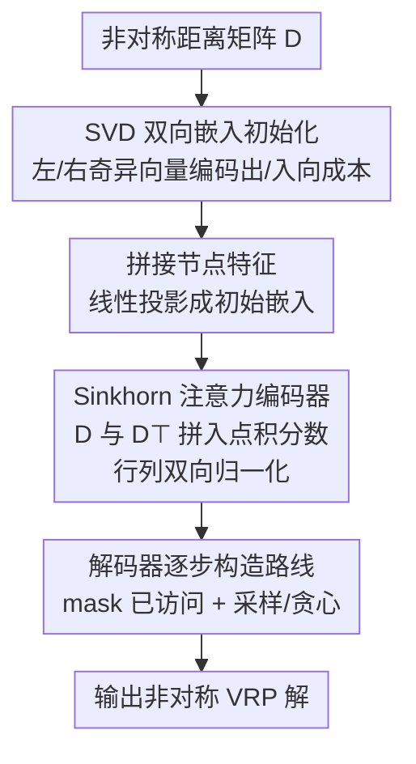

# RADAR: Learning to Route with Asymmetry-aware Distance Representations

**会议**: ICLR 2026  
**OpenReview**: [https://openreview.net/forum?id=lWdxX5s9T1](https://openreview.net/forum?id=lWdxX5s9T1)  
**代码**: https://github.com/yihang0410/RADAR  
**领域**: 神经组合优化 / 车辆路径问题  
**关键词**: 非对称VRP, 神经求解器, SVD初始化, Sinkhorn归一化, 泛化

## 一句话总结
RADAR 给现有神经 VRP 求解器加了一对"非对称感知"的零件——用截断 SVD 把非对称距离矩阵分解成"出发/到达"双向节点嵌入做初始化，再把编码器注意力里的 softmax 换成行列双向归一化的 Sinkhorn——从而让原本只会处理对称欧氏距离的求解器也能在真实世界的单向街道、方向性拥堵这类非对称路网上稳定泛化，在 17 个合成 + 3 个真实 VRP 变体上一致超过 MatNet、ICAM、RRNCO 等强基线。

## 研究背景与动机
**领域现状**：神经组合优化（NCO）近年用深度学习训练数据驱动的 VRP 求解器，其中"构造式"求解器（AM、POMO、MatNet、RouteFinder 等）最主流——它们像人规划路线一样，根据当前部分解逐个挑下一个节点，效率高、optimality gap 小。

**现有痛点**：但绝大多数神经求解器都假设**对称的欧氏距离**，输入是节点坐标。现实里旅行成本受路网拓扑、交通方向性、物理障碍影响，存在单向街道、随时间变化的拥堵这类**非对称**情况，且往往只能拿到两两之间的非对称距离矩阵、根本没有坐标。这让坐标驱动的求解器直接失效，是 NCO 落地的主要瓶颈。

**核心矛盾**：要让求解器吃非对称矩阵，关键是把矩阵里的**关系结构**编码进节点表示，而这天然困难。非对称成本定义在**边**上（$D_{i,j}\neq D_{j,i}$），而主流架构操作的是**节点级**表示；欧氏情形下坐标提供了几何脚手架、能完全恢复距离结构，而非对称矩阵缺乏这种几何先验，方向性模式更难学。此前直接编码矩阵的尝试（如 MatNet 的 one-hot）要么嵌入不紧凑、要么 size 一变就泛化崩掉。

**本文目标**：作者把非对称拆成两个层面分别攻克——**静态非对称**（输入距离矩阵本身的方向性差异，主要体现在初始化）和**动态非对称**（编码器注意力逐层演化出的、$i\!\to\!j$ 与 $j\!\to\!i$ 不相等的交互差异）。

**切入角度**：现有 softmax 注意力是**行归一化**的，$A_{i,j}$ 只聚合了节点 $i$ 邻域的信息，却"看不见" $j$ 自己和图里其他节点的关系——这在对称欧氏设定下不是问题（坐标已隐含全图），但在非对称设定下严重限制了对全局方向依赖的刻画。

**核心 idea**：静态侧用 SVD 把距离矩阵分解出左/右奇异向量，得到同时编码"作为起点 / 作为终点"角色的紧凑节点嵌入；动态侧用 Sinkhorn 双向归一化替代 softmax，强制注意力在行和列上都平衡，让每条注意力既懂 $i$ 的邻域也懂 $j$ 的邻域。

## 方法详解

### 整体框架
RADAR 不是从头造一个求解器，而是给现有构造式神经求解器**打两个补丁**，让它具备处理非对称输入的能力。整条流水线是：输入一个非对称距离矩阵 $D\in\mathbb{R}^{n\times n}$ → 对 $D$ 做截断 SVD 得到双向距离特征 → 与节点特征（如需求）拼接、线性投影成初始嵌入 → 过 5 层编码器（每层多头注意力 + 两次 Add&Norm + 前馈），其中注意力把 $D$ 和 $D^\top$ 拼到点积分数上、再用 Sinkhorn 归一化成双随机注意力 → 解码器逐步 mask 已访问节点、按预测概率采样或贪心选下一个节点直到成环。两个核心补丁正好对应两类非对称：SVD 初始化管**静态非对称**，Sinkhorn 注意力管**动态非对称**。

### 关键设计

**1. SVD 双向嵌入初始化：把边级非对称转成节点级的"出/入"双角色嵌入**

这针对的痛点是：非对称成本定义在边上，但架构吃的是节点嵌入；若所有节点初始嵌入相同，注意力输出就是相同 value 向量的凸组合、永远相同，模型学不出任何东西。作者先给出一个形式化目标——**非对称感知嵌入（Definition 1）**：嵌入矩阵 $X\in\mathbb{R}^{n\times k}$ 若存在两个**不同**的线性变换 $W_1,W_2$ 使得 $\lVert XW_1(XW_2)^\top - D\rVert_F^2\approx 0$，就说它"感知"了 $D$ 的静态非对称。这个双线性形 $XW_1(XW_2)^\top$ 刻意模仿注意力的 $QK^\top$，且 $W_1\neq W_2$ 才能产生非对称交互矩阵。

构造方法是对 $D$ 做截断 SVD：$D\approx U_k\Sigma_k V_k^\top$，其中 $D$ 的**行对应出发节点、列对应到达节点**。于是用左右奇异向量各带半个奇异值，拼成距离特征：

$$X_L = U_k\sqrt{\Sigma_k},\quad X_R = V_k\sqrt{\Sigma_k},\quad X=[X_L \mid X_R]\in\mathbb{R}^{n\times 2k}.$$

取 $W_1=[I_k\mid 0]^\top$、$W_2=[0\mid I_k]^\top$ 即有 $XW_1(XW_2)^\top=U_k\Sigma_k V_k^\top\approx D$，从理论上保证单个嵌入矩阵就捕获了静态非对称。具体实现（Algorithm 1）还先对 $D$ 做标准化 $(D-\mu)/\sigma$ 再低秩 SVD。和此前"取 top-k 最近邻距离当节点特征"（ICAM、RRNCO）相比，后者只是局部邻域的原始距离堆叠、抓不住全局拓扑且嵌入维度被 $n$ 绑死，而 SVD 给出的是紧凑、与 size 解耦、保留全局方向性的表示。作者实测 top-10 奇异值已保留约 85% 矩阵信息（top-20/30 为 93%/97%），但出于"既要 in-distribution 又要大尺寸泛化"的权衡固定取 **top-10**。

**2. Sinkhorn 归一化注意力：让每条注意力同时懂收发双方的全图邻域**

这针对的痛点是：现有做法把距离信号融进相似度后用**行 softmax**，$A_{i,j}$ 只感知 $i$ 的邻域（$D_{i,:}$、$D_{:,i}$），却完全不知道 $j$ 自己和全图的关系（$D_{j,:}$、$D_{:,j}$）——在非对称设定下这会削弱模型对全局方向依赖的刻画。RADAR 把行 softmax 换成 **Sinkhorn 归一化**：先对距离感知的相似度分数取指数，再迭代地交替按列、按行归一化 $T$ 次（主实验 $T=10$，见 Algorithm 2），收敛到一个**双随机矩阵**（行和、列和都为 1）。

$$A_{i,:}=\mathrm{Softmax}\big([\mathrm{Sim}(X_i,X_j,D_{i,j},D_{j,i})]_{j=1}^N\big)\ \Longrightarrow\ A=\mathrm{Sinkhorn}\big(\exp(\mathrm{Sim})\big).$$

双随机约束强制了平衡的双向流动：每条 $A_{i,j}$ 不再只反映 $i$ 的局部上下文，而是同时纳入了 $i$ 和 $j$ 各自完整的距离关系，从而把"$i$ 接收信息"和"$j$ 被接收"两个方向都管起来。这个"动态"二字体现在它作用于编码器每一层、随上下文和深度逐层演化。消融显示 Sinkhorn 的增益甚至比 SVD 更突出，且在 ATSP100 上前 10 / 后 10 个 epoch 的对比表明它**收敛更快**、终值更好。

### 损失函数 / 训练策略
RADAR 沿用构造式神经求解器的标准 REINFORCE 风格训练范式，在 size-100 实例上训练后**零样本泛化**到 size 200/500/1000（无 finetune）。多任务设定下接入 RouteFinder 框架、在 16 个非对称 VRP 变体上联合训练。SVD 步骤用 GPU 加速的随机化截断 SVD、支持 batch，端到端运行时间随规模平滑增长且 SVD 占比在大尺寸下逐渐减小；Sinkhorn 迭代 $T=10$，GPU batched 实现使其开销适中稳定。所有实验在单张 RTX 3090（24GB）上完成。

## 实验关键数据

### 主实验（合成 ATSP / ACVRP，训练于 size-100 零样本泛化）

| 任务 | 方法 | Obj. | Gap |
|------|------|------|-----|
| ATSP100 | RADAR | **1.5756** | **0.72%** |
| ATSP100 | ReLD | 1.5900 | 1.64% |
| ATSP100 | ELG | 1.5982 | 2.17% |
| ATSP1000 | RADAR | **1.6389** | **4.13%** |
| ATSP1000 | ELG | 1.8441 | 17.17% |
| ATSP1000 | ICAM | 2.9069 | 84.69% |
| ACVRP200 | RADAR | **2.1483** | **-0.75%** |
| ACVRP1000 | RADAR | **2.4634** | **0.96%** |

RADAR 在所有学习类方法中取得最低 gap，规模涨到 1000 时仍保持小 gap（ATSP1000 仅 4.13%，而 ICAM 已飙到 84.69%）；ACVRP200 上甚至超过 LKH。真实世界数据集（RRNCO 提出的 ATSP/ACVRP/ACVRPTW）上，RADAR 在 in-distribution 与两类 OOD（city / cluster）全面优于 MatNet、RRNCO，如真实 ATSP in-distribution gap 0.74% vs RRNCO 的 1.80%。多任务 16 变体平均 gap 1.33%，低于 RF-NN（1.99%）、RF（2.47%）。

### 消融实验（ATSP，SVD × Sinkhorn）

| SVD | Sinkhorn | ATSP100 Gap | ATSP1000 Gap |
|-----|----------|-------------|--------------|
| ✗ | ✗ | 2.08% | 38.64% |
| ✓ | ✗ | 1.82% | 22.89% |
| ✗ | ✓ | 1.19% | 7.24% |
| ✓ | ✓ | **0.72%** | **4.13%** |

### 关键发现
- **Sinkhorn 单独贡献比 SVD 更大**：在 ATSP1000 上只加 SVD 把 gap 从 38.64% 降到 22.89%，只加 Sinkhorn 直接降到 7.24%，两者叠加才到 4.13%——动态非对称建模在大尺寸泛化上尤其关键。
- **坐标在非对称任务里几乎没用**：RADAR 即便不用坐标（w/o coords，ATSP100 gap 1.49%）也优于 RRNCO 带坐标增强（1.80%），说明 SVD 距离嵌入已抓住结构信息，坐标的主要价值只是支持数据增强、提升多样性。
- **抗非对称强度衰减**：随非对称强度（$\sigma=0.1/0.2/0.3$）升高所有方法都退化，但 RADAR 退化最缓、各档位均最优；High Asymmetry 100 节点下 MatNet 相对 gap 已达 24.04%，而 RADAR 为基准。
- **$k$ 越大 in-distribution 越好但泛化越差**，RADAR 全程低成本稳定，故固定 top-10；SVD 还胜过 EVD/MDS/QR/RA 等替代分解，因其最贴合距离矩阵的非对称结构。

## 亮点与洞察
- **把"静态 vs 动态非对称"拆成两个正交补丁**，分别落在初始化和注意力两个最该管非对称的位置，思路干净且可即插即用到现有求解器（POMO、RouteFinder 都能挂）。
- **用 SVD 的左右奇异向量天然对应"出发/到达"双角色**，并配上 Definition 1 的双线性可重构判据，把"嵌入是否感知非对称"这件事形式化了——这是个可迁移到其他边特征中心型组合优化问题的 recipe。
- **Sinkhorn 双随机注意力**是个很巧的迁移：把最优传输里的行列平衡约束搬到注意力上，恰好补上 softmax"只看行邻域"的盲点，而且收敛更快。
- "坐标在非对称任务里只剩增强价值"这个反直觉结论对 NCO 社区的输入表示选择有启发。

## 局限与展望
- 方法定位为"给已有构造式求解器加补丁"，本身不是端到端新架构，性能上限仍受底座求解器约束。
- SVD 初始化是确定性的，导致 POMO 式 augmentation 在 w/o coords 下失效（同一实例输出唯一），多样性来源受限。
- 截断 SVD 取 top-10 是 in/out-of-distribution 的折中，对极高维或极端非对称矩阵 85% 的信息保留是否够仍有疑问。
- 作者展望两个方向：把 SVD 初始化推广到更广的边特征中心型组合优化问题（改善冷启动质量）；与改进式启发/搜索式求解器结合，让 RADAR 提供非对称、成本感知的先验来指导邻域选择与移动接受。

## 相关工作与启发
- **vs MatNet / UniCO**：它们用 one-hot / pseudo-one-hot 做"无信息初始化"，给节点强行加可区分信号但缺乏语义、且 one-hot 把节点数绑死在嵌入维度上（N=500/1000 直接泛化崩）；RADAR 用 SVD 做"有信息初始化"，从距离矩阵结构本身导出嵌入。
- **vs ICAM / RRNCO**：它们用 top-k 最近邻或距离采样的"有信息初始化"，但直接堆原始距离抓不住全局拓扑、嵌入与 size 纠缠；RADAR 的 SVD 嵌入紧凑且与 size 解耦，泛化更好，且不依赖坐标。
- **vs 标准距离感知注意力（MatNet 等）**：它们把距离融进相似度后仍用行 softmax，只感知单侧邻域；RADAR 的 Sinkhorn 行列双向归一化让注意力同时懂收发双方全图邻域。

## 评分
- 新颖性: ⭐⭐⭐⭐ 把 SVD 双向嵌入 + Sinkhorn 双随机注意力组合用于非对称 VRP，切入点清晰且有形式化支撑。
- 实验充分度: ⭐⭐⭐⭐⭐ 17 合成 + 3 真实变体、多任务、多种非对称强度、坐标/初始化/分解方式多维消融，覆盖很全。
- 写作质量: ⭐⭐⭐⭐ 静态/动态非对称的二分叙事清晰，Definition 1 与 SVD 推导自洽。
- 价值: ⭐⭐⭐⭐ 即插即用、直指 NCO 落地的非对称瓶颈，实用性强。

<!-- RELATED:START -->

## 相关论文

- [\[ICLR 2026\] Learning Distributions over Permutations and Rankings with Factorized Representations](learning_distributions_over_permutations_and_rankings_with_factorized_representa.md)
- [\[CVPR 2026\] RaUF: Learning the Spatial Uncertainty Field of Radar](../../CVPR2026/others/rauf_learning_the_spatial_uncertainty_field_of_radar.md)
- [\[ICLR 2026\] Mixed-Curvature Tree-Sliced Wasserstein Distance](mixed-curvature_tree-sliced_wasserstein_distance.md)
- [\[ICML 2026\] Continual Learning of Domain-Invariant Representations](../../ICML2026/others/continual_learning_of_domain-invariant_representations.md)
- [\[ICML 2026\] DISCO: Mitigating Bias in Deep Learning with Conditional Distance Correlation](../../ICML2026/others/disco_mitigating_bias_in_deep_learning_with_conditional_distance_correlation.md)

<!-- RELATED:END -->
