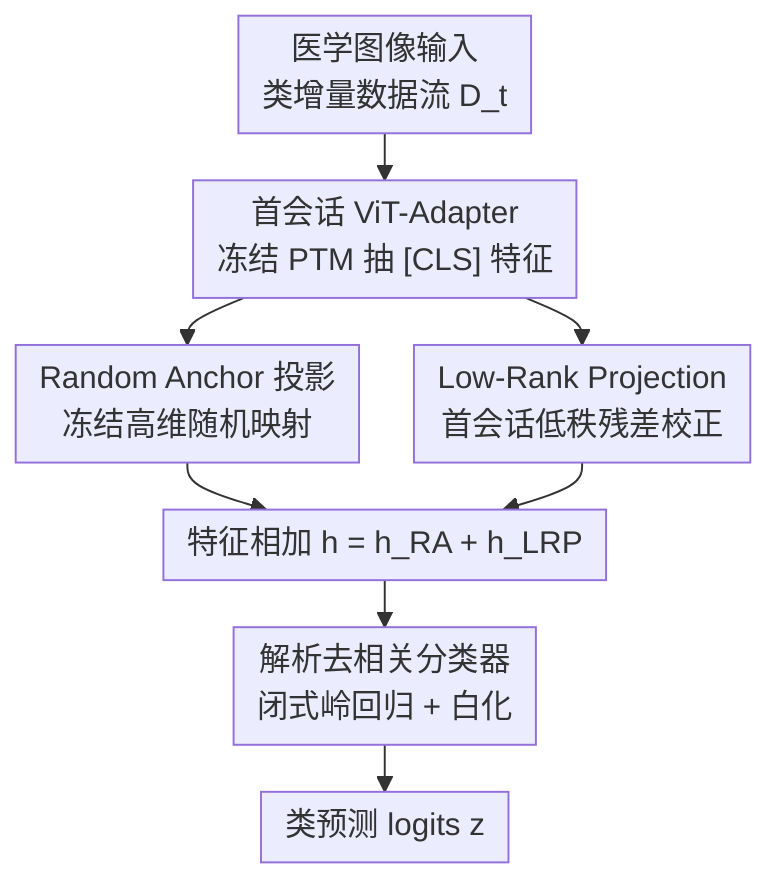

# Random Anchors with Low-rank Decorrelated Learning: A Minimalist Pipeline for Class-Incremental Medical Image Classification

**会议**: ICLR2026  
**OpenReview**: [https://openreview.net/forum?id=mduCc7XKXH](https://openreview.net/forum?id=mduCc7XKXH)  
**代码**: [https://github.com/CUHK-BMEAI/RA-LDL](https://github.com/CUHK-BMEAI/RA-LDL)  
**领域**: 持续学习 / 医学图像 / 类增量学习  
**关键词**: 类增量学习, 预训练模型, 表征校准, 解析分类器, 医学图像

## 一句话总结
针对医学影像类增量学习，本文提出 RA-LDL：用「冻结随机锚点 + 首会话低秩残差」把预训练特征校准得更可分，再用闭式岭回归构造一组「去相关」的解析分类器，全程只在第一个会话需要梯度训练，后续任务只靠递推累积的统计量更新，结构极简却在四个医学数据集上超过一众复杂 SOTA。

## 研究背景与动机
**领域现状**：医学诊断模型需要不断学会新出现的疾病类别，同时保留对旧病种的判别能力，这正是类增量学习（CIL）要解决的问题。近年主流做法是站在预训练模型（PTM，如 ViT-B/16-IN21K）的强泛化特征之上做增量适配，衍生出三类范式：prompt-based（L2P / DualPrompt / CodaPrompt，往冻结骨干里插可学习上下文 token）、representation-based（ADAM / EASE / SSIAT，插任务专属 adapter + 原型分类）、model-mixture-based（LAE / MOS，集成多个模型平衡可塑性与稳定性）。

**现有痛点**：这些方法的共同趋势是「越做越复杂」——prompt 池随任务增长带来选择、路由、兼容性开销；多 adapter 方案推理时要做任务检索，还得维护跨演化特征空间的原型映射；模型混合则要存全部历史模型、占大量内存。更关键的是，作者实验（Table 2）发现：这些在通用 benchmark 上有效的复杂机制，搬到医学影像就频繁失效。

**核心矛盾**：医学影像有两个独有的难点——**类间/类内差异都很低**（不同疾病视觉线索高度相似），以及**域间偏移大**（扫描仪、协议、机构差异）。在这种条件下，prompt 路由、原型重建、adapter 混合这些复杂机制反而容易触发表征坍塌（representation collapse）和域错配。而且「领域专用 PTM」并不一定更强：作者发现 BiomedCLIP 有时比通用 ViT 好，但 UniMedCLIP、RAD-DINO 反而明显更差——域专用化并不保证更好的医学表征。

**本文目标**：能否不靠复杂架构，仅用「极简表征再校准」就把通用 PTM 有效适配到医学 CIL？

**切入角度**：一些在通用域被认为「增益微弱、不值一提」的轻量特征校准策略（把特征映到合适的结构化空间），在医学这种低差异、高偏移的极端条件下反而格外有效。

**核心 idea**：用「随机锚点高维投影 + 低秩残差校正 + 闭式去相关分类器」三步极简流水线代替复杂 adapter/prompt，把表征校准做到位，而非堆架构。

## 方法详解

### 整体框架
RA-LDL 是一个 representation-based 的三步流水线，目标是把冻结 PTM 抽出的特征「校准」得既可分又抗域偏移，再用解析方式构造分类器。输入是类增量数据流 $D_t=\{(x_{i,t},y_{i,t})\}$（会话 $t=1,\dots,T$，各会话类别互不重叠），输出是覆盖已见全部类别的分类器 $f(x)=W^\top\phi(x)$。

整条流水线分三步：(a) 用冻结 PTM 抽 `[CLS]` 特征 $\phi(x)\in\mathbb{R}^{d_0}$，可选地在**第一个会话**训练一个 ViT-Adapter 缩小域差距、之后冻结；(b) 把特征送入两条互补支路——冻结的 Random Anchor (RA) 把它升维以提升线性可分性，首会话训练的 Low-Rank Projection (LRP) 提供残差校正，两者相加得到校准特征 $h(x)$；(c) 用岭回归闭式解构造一组「去相关」的解析分类器，对所有会话递推累积二阶统计量即可更新。整个管线**只有第一个会话需要梯度优化**，后续任务全靠累积的 Gram 矩阵与类累积矩阵做闭式更新，部署友好。

### 关键设计

**1. 首会话 ViT-Adapter：一次性缩小域差距而不破坏泛化**

医学图像与 PTM 预训练分布差异很大，但若每个会话都微调骨干又会遗忘旧知识、破坏泛化。作者的折中是：只在**第一个任务**（$t=1$）插入并训练一个轻量 ViT-Adapter（MLP 下采样 $W_{down}$→激活→上采样 $W_{up}$ 的瓶颈结构），之后所有任务（$t>1$）全部冻结。这样既让骨干特征对医学影像更兼容，又把可训练性约束在单次会话内，避免后续会话的灾难性遗忘。值得注意的是，实验显示这一步是**可选的**——去掉它性能只是小幅波动，真正起决定作用的是后面的 RA+LRP 组合。

**2. Random Anchor：用冻结随机高维投影换取线性可分性，零训练**

PTM 特征在域偏移下往往判别性不足，但直接训练投影又会引入过拟合与训练成本。作者借鉴「非线性变换可提升线性可分性」的结论，定义一个**冻结**的随机矩阵 $B\in\mathbb{R}^{d_0\times d_1}$（高斯 $\mathcal{N}(0,\sigma^2)$ 初始化一次后永不更新），做投影：

$$h_{RA}(x)=\mathrm{ReLU}(B^\top\phi(x))$$

它把 $d_0$ 维特征升到 $d_1=5d_0$ 的随机高维空间。关键在于「冻结 + 升维」：根据 Johnson–Lindenstrauss 引理，这种随机投影能近似保持原始特征的几何与统计结构，同时高维空间天然让类原型更易线性分开——既不引入任何训练参数，又增强了可分性。作者还实测高斯初始化比 Kaiming/Xavier 更稳定，契合「极简」基调。

**3. Low-Rank Projection：低秩残差专补 RA 补不了的域专属畸变**

RA 保住了全局几何并提升可分性，但它是数据无关的随机映射，**不显式建模医学域特有的分布畸变**。为此作者并联一条**首会话训练**的低秩残差支路，与 RA 输出相加得到最终特征：

$$h(x)=h_{RA}(x)+h_{LRP}(x),\quad h_{LRP}(x)=\mathrm{ReLU}\big(\mathrm{GELU}(\phi(x)W_1)\,W_2\big)$$

其中 $W_1\in\mathbb{R}^{d_0\times r}$、$W_2\in\mathbb{R}^{r\times d_1}$，秩 $r\ll\min(d_0,d_1)$。低秩约束让残差校正的参数量 $(d_0+d_1)r$ 远小于满秩层 $d_0d_1$，既省参又抗过拟合。理论分析（附录）进一步证明该残差能**降低类内方差、扩大类间间隔**。直觉上：冻结 RA 负责「保住 PTM 学到的核心结构」，可学 LRP 负责「以紧凑正则的方式纠正域偏移」，二者互补缺一不可。

**4. 解析去相关分类器：闭式岭回归当白化，压住类间相关**

即便特征校准好了，医学 CIL 里的类原型仍常因域偏移而**类间强相关**，导致基于原始特征均值的原型分类器（如 SimpleCIL 的 NCM）发生表征坍塌。作者改用「解析学习」视角，把分类器构造写成岭回归而非迭代反传：

$$\arg\min_{W_{adc}}\ \|Y-HW_{adc}\|_F^2+\beta\|W_{adc}\|_F^2$$

其闭式解只依赖跨会话累积的特征自相关（Gram）矩阵 $G=\sum_t\sum_n h_{t,n}h_{t,n}^\top$ 与类累积矩阵 $C_p=\sum_t\sum_n h_{t,n}y_{t,n}^\top$：

$$\hat{W}_{adc}=(G+\beta I)^{-1}C_p,\qquad z=h\,\hat{W}_{adc}$$

逆 Gram 矩阵 $(G+\beta I)^{-1}$ 会对特征空间各特征方向**重加权**，效果类似白化：压低占主导的冗余共享成分（正是类间相关的来源）、保留类内变化、降低类间相关。由此得到的是一组「解析推导出的去相关原型」，跨任务更具判别性、与测试特征更对齐，对医学场景的低差异/高偏移更鲁棒。而且整条管线由此只需累积二阶统计量，后续会话无需任何梯度训练，还天然只保留聚合统计、利于隐私保护。

### 损失函数 / 训练策略
唯一的梯度训练发生在第一个会话：用 SGD（momentum，余弦退火，初始 lr 0.01，batch 48，首会话 20 epoch、后续会话 15 epoch）训练可选 ViT-Adapter 与 LRP 残差；弱增强用随机翻转+旋转。后续会话不再反传，仅递推更新 $G$ 与 $C_p$ 并重算闭式解 $\hat{W}_{adc}$。岭参数 $\beta$ 由交叉验证选；投影维度 $d_1=5d_0$，低秩 $r=64$ 足够。

## 实验关键数据

### 主实验
四个医学 CIL 数据集（COVID CT&X-ray、Blood、Skin8、MedMNIST-Sub），主指标 AccLast（最终会话精度，最关键）与 AccAvg（全程平均）。下表节选 AccLast（%）：

| 方法 | MedMNIST-Sub | Skin8 | COVID | Blood |
|------|------|------|------|------|
| SimpleCIL | 50.63 | 38.30 | 57.37 | 79.79 |
| EASE | 39.26 | 40.43 | 59.98 | 67.60 |
| SSIAT | 25.79 | 41.99 | 60.17 | 84.63 |
| MOS（前 SOTA） | 51.80 | 51.77 | 80.60 | 90.18 |
| **RA-LDL（Adapted, B&LRP）** | **70.60** | **62.49** | 88.04 | **97.76** |
| Joint-training（上界） | 73.61 | 67.73 | 92.43 | 99.61 |

RA-LDL 在四个数据集上全面大幅超过包括 MOS 在内的所有 PTM-based 与传统（FOSTER/iCaRL/DER 需回放、有隐私顾虑）方法，且逼近联合训练上界。会话级曲线显示随类别增多它的精度下滑明显更平缓，尤其在 Skin8、COVID 上对手急剧掉点。

### 消融实验
Table 2 末四行逐步拆解组件（AccLast，COVID 列）：

| 配置 | COVID AccLast | 说明 |
|------|------|------|
| Original ViT + B (RA-DL) | 86.94 | 仅随机锚点 + 解析分类器 |
| Adapted ViT + B (RA-DL) | 89.55 | 加首会话 adapter |
| Original ViT + B&LRP (RA-LDL) | 90.30 | 加 LRP 残差 |
| Adapted ViT + B&LRP (RA-LDL) | 88.04 | 完整模型 |

### 关键发现
- **首会话 adapter 是可选的**：加不加只带来小幅波动，不同数据集上甚至有正有负，说明它不是核心。
- **RA + LRP 的组合才是本质**：随机锚点提供「保几何 + 提可分」，低秩残差补「域专属畸变」，二者互补、缺一不可，共同平衡泛化与可塑性。
- **域专用 PTM 不一定更强**：BiomedCLIP/UniMedCLIP/RAD-DINO 等医学 PTM 并不稳定优于通用 ViT，但 RA-LDL 在两类骨干上都能带来一致提升，对骨干选择鲁棒。
- 投影维度 $d_1$ 越大通常越可分，但收益不均匀；秩 $r$ 从 64 升到 256 仅边际提升，$r=64$ 即够。

## 亮点与洞察
- **「极简反而更好」的反直觉结论**：在医学这种低类间差异、高域偏移的极端场景，复杂 prompt/adapter/混合机制反而坍塌，轻量表征再校准却能逼近联合训练上界——挑战了「越复杂越强」的隐性假设。
- **冻结随机锚点 + 闭式分类器 = 几乎零训练的增量学习**：除首会话外不需要任何反传，靠递推累积的 Gram 与类累积矩阵更新，部署成本低、且天然只存聚合统计利于隐私，这套「analytic CIL」思路可迁移到任何 PTM 上的增量任务。
- **把分类器构造重新理解为「白化去相关」**：逆 Gram 矩阵重加权压住主导冗余方向的视角，给原型坍塌问题提供了清晰可解释的解法，而非黑箱网络。

## 局限与展望
- 方法的有效性高度依赖「冻结 PTM 特征本身已足够好」这一前提——若骨干在某医学子域表征极差（如部分医学 PTM），RA+LRP 的校准空间也有限。
- 闭式岭回归需维护 $d_1\times d_1$ 的 Gram 矩阵，$d_1=5d_0$ 时维度不小，超大类别/超高维场景下逆矩阵的存储与计算可能成为瓶颈。
- 随机锚点的投影维度、低秩 $r$、岭参数 $\beta$ 等仍需按数据集调，论文强调「极简」但并非完全免调参；且投影维度增益在不同数据集上不一致，缺乏自适应选择机制。
- 评测集中在分类任务与四个医学数据集，对检测/分割等其他医学任务、以及类别数极大的长序列增量的可扩展性尚未验证。

## 相关工作与启发
- **vs SimpleCIL / NCM 原型分类**：二者都用冻结 PTM 特征 + 原型，但 SimpleCIL 直接取类均值、隐含假设各类各向同性且良好分离，域偏移下类间强相关即坍塌；本文用闭式岭回归显式做去相关白化，鲁棒性更强。
- **vs EASE / SSIAT / MOS（复杂 representation/mixture 方法）**：它们靠多任务专属 adapter、原型重建或模型集成来平衡稳定-可塑，推理要任务检索、内存开销大；RA-LDL 只用一条冻结随机支路 + 一条首会话低秩残差 + 闭式分类器，无任务检索、无历史模型存储，却在医学 benchmark 上全面反超。
- **vs prompt-based（L2P/DualPrompt/CodaPrompt）**：prompt 池随任务增长带来路由与兼容开销，且对分布偏移敏感、在跨域医学场景脆弱；本文完全不用 prompt，靠特征空间校准而非输入侧提示。

## 评分
- 新颖性: ⭐⭐⭐⭐ 组件多源自通用域 CIL，但首次系统分析其在医学 CIL 的协同效应，并给出「极简胜复杂」的有力实证。
- 实验充分度: ⭐⭐⭐⭐⭐ 四个医学数据集 + 通用域补充 + 多种 PTM 骨干 + 逐组件消融 + 维度/秩/初始化敏感性，覆盖全面。
- 写作质量: ⭐⭐⭐⭐ 「边推导边构建流水线」的叙述清晰，理论证明放附录、正文有公式与直觉。
- 价值: ⭐⭐⭐⭐ 提供了部署友好、近乎零训练、隐私友好的医学增量学习实用基线，易扩展易复现。

<!-- RELATED:START -->

## 相关论文

- [\[ICLR 2026\] Consistent Low-Rank Approximation](consistent_low-rank_approximation.md)
- [\[ICLR 2026\] Consistency-Driven Calibration and Matching for Few-Shot Class Incremental Learning](consistency-driven_calibration_and_matching_for_few-shot_class_incremental_learn.md)
- [\[ICLR 2026\] From Fields to Random Trees](from_fields_to_random_trees.md)
- [\[ECCV 2024\] Active Generation for Image Classification](../../ECCV2024/others/active_generation_for_image_classification.md)
- [\[CVPR 2026\] Basis-Oriented Low-rank Transfer for Few-Shot and Test-Time Adaptation](../../CVPR2026/others/basis-oriented_low-rank_transfer_for_few-shot_and_test-time_adaptation.md)

<!-- RELATED:END -->
