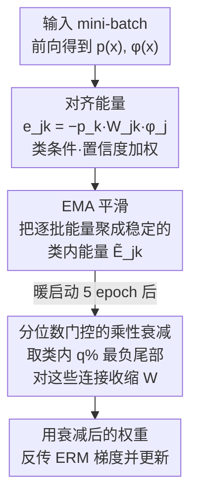

# Regulating Internal Alignment Flows for Robust Learning Under Spurious Correlations

**会议**: ICLR 2026  
**OpenReview**: [https://openreview.net/forum?id=L2L1hi0FGj](https://openreview.net/forum?id=L2L1hi0FGj)  
**代码**: 待确认  
**领域**: 鲁棒学习 / 去偏 / 公平性  
**关键词**: 虚假相关, 最差组准确率, 神经元归因, 无组标签, 即插即用正则

## 一句话总结
本文提出 Alignment-Gated Suppression（AGS）：在训练过程中为每个神经元算一个「类条件、置信度加权」的对齐能量，把那些在分位数尾部、对真实类贡献最强（最可能是走捷径）的连接做乘性衰减，从而在**不需要任何组标签、额外开销 < 5%** 的前提下同时提升平均准确率与最差组准确率。

## 研究背景与动机
**领域现状**：深度模型常常依赖「虚假相关」（spurious correlation）——比如把水鸟和「水的背景」绑定、把女性和「金发」绑定，从而用背景、属性这类捷径特征做预测。这种捷径在多数样本上准确率很高，但在「少数 / 冲突组」（bias-conflicting，背景被换掉的样本）上会灾难性失败，导致最差组准确率（Worst-Group Accuracy, WGA）大幅下降。

**现有痛点**：主流鲁棒学习方法分两类，但都没碰到问题根上。一类是**组感知**方法（GroupDRO、IRM、V-REx、JTT 等），需要高质量的组 / 环境标签来显式约束最差组风险，标注昂贵且在真实部署里往往缺失或不可靠；另一类是**组无关**方法，靠置信度 / 误差等启发式给样本重加权，但这些只是组结构的「代理信号」，间接、不稳定。两类方法都在**网络外部**（数据层）或**损失层**动手，无法直接控制「到底是哪些神经元、哪些连接在向前传播虚假对齐能量」。

**核心矛盾**：捷径依赖是一种**内部**现象——它发生在特定 neuron→class 连接上，但现有手段都在外部调数据或调 loss，对内部的捷径通路缺乏直接抓手；而真正能直接干预内部的手段（剪枝、weight decay）又是全局、输入无关、或者事后（post-hoc）的，无法在训练动态里精准识别并压制捷径路径。

**本文目标**：设计一个**在训练中、网络内部、无需组标签**的机制，直接定位并削弱承载虚假相关的连接，同时几乎不损伤鲁棒特征和平均准确率。

**切入角度**：作者假设——一个神经元如果在「模型很自信」的时候持续地、强烈地支持某个真实类别，那它很可能正是在走捷径。于是只要能量化「每个神经元对每个类的置信度加权贡献」，并把这个量分布里最极端的那一撮连接温和地收缩，就能在源头处抑制捷径，而不必知道任何组结构。

**核心 idea**：定义一个参数空间的「对齐能量」$e_{jk}(x)=-p_k(x)\,W_{jk}\,\phi_j(x)$ 作为训练期归因信号，用 EMA 平滑后做**类内分位数门控的乘性衰减**，把最负尾部（最强捷径）的连接持续收缩——用「调内部对齐流」代替「调数据 / 调损失」来获得鲁棒性。

## 方法详解

### 整体框架
AGS 是一个挂在标准 ERM + 交叉熵训练循环上的即插即用正则器，默认作用于最后一层线性分类器 $W\in\mathbb{R}^{D\times C}$（同样的接口可平移到中间层通道）。它的核心循环是：每一步前向得到类概率 $p(x)$ 和倒数第二层表示 $\phi_\theta(x)$ → 计算每个神经元对真实类的**对齐能量** → 用 EMA 把逐批估计平滑成稳定的类内能量 → 取类内分位数阈值、把落在最负尾部的连接标记出来 → 对这些连接做乘性衰减后再反传 ERM 梯度。整套机制不改架构、不需组标签、所有对齐量都按 stop-gradient 处理（不对门控决策和 EMA 缓冲回传梯度），训练开销 < 5%，只多维护一个 $D\times C$ 的 EMA 缓冲。

### 关键设计

**1. 对齐能量：把「神经元在多自信时支持哪个类」量化成参数空间信号**

要在网络内部找捷径，先得有一个能在训练时实时算、又精准刻画「单个连接对预测贡献多少」的度量。AGS 对神经元 $j$、类别 $k$、输入 $x$ 定义对齐能量
$$e_{jk}(x) \triangleq -\,p_k(x)\,W_{jk}\,\phi_j(x),$$
实践中只在真实类 $k=y$ 上计算。这里有三个精心的设计：其一，$W_{jk}\phi_j(x)$ 是该连接对 $k$-logit 的直接贡献，越大说明该神经元越支持类 $k$；其二，乘上 softmax 概率 $p_k(x)$ 把贡献和**置信度**耦合起来——模型越自信，这个连接的贡献越被放大，而不确定样本被自动淡化；其三，前面的负号统一了方向，使「越负 = 对齐越强」。在同标签样本上取期望得到类能量 $E_{jk}=\mathbb{E}_{x\sim D_k}[e_{jk}(x)]$，$E_{jk}$ 越负代表神经元 $j$ 持续地为类 $k$ 提供高置信度支持——这正是捷径连接的画像。作者特别强调这是**参数空间**统计量（对分类器权重的敏感度），区别于 EvA 的**激活空间**「证据能量」；正是这个参数空间视角，才支撑后面在「同一批权重」上做单阶段、连接级的乘性衰减。

**2. EMA 平滑 + 批内估计：把噪声大的逐批能量稳成可门控的信号**

逐批估计 $\bar E^{(t)}_{jk}=\frac{1}{|B_k|+\epsilon}\sum_{x\in B_k}e_{jk}(x)$ 是 $E_{jk}$ 的有限样本估计，方差受 batch 大小和类别平衡影响很大：批太小，采样噪声会把更多特征推进负尾，在固定分位数下触发过度抑制；批太大则对瞬时捷径不敏感。为了让门控决策稳定，AGS 维护一个指数滑动平均
$$\tilde E^{(t)}_{jk} = (1-\beta)\,\bar E^{(t)}_{jk} + \beta\,\tilde E^{(t-1)}_{jk},\quad \beta=0.75,$$
当某类在当前批缺席时令 $\bar E^{(t)}_{jk}=0$，EMA 自然衰减 $\tilde E^{(t)}_{jk}=\beta\tilde E^{(t-1)}_{jk}$，把历史信息携带到该类再次出现。作者证明 EMA 让步间漂移被界在 $2(1-\beta)R_\phi R_w$，且因为后续门控只看类内排序、对严格单调变换不变，所以不做偏置校正、也无需对绝对尺度归一。$\beta$ 越大惯性越强，对稀有类尤其有帮助——这一步是把「噪声归因」变成「可信门控」的关键稳定器。

**3. 分位数门控的乘性衰减：只收缩最负尾部，预算化、尺度无关地压制捷径**

有了稳定的类内能量，AGS 暖启动 $T_w=5$ 个 epoch 填充 EMA 后，对每个类取类内第 $q$ 分位数（$q\in[10,20]$）作为阈值
$$\tau^{(t)}_k \triangleq \mathrm{Percentile}_q\big(\{\tilde E^{(t)}_{1k},\dots,\tilde E^{(t)}_{Dk}\}\big),$$
把能量低于阈值的连接用二值门 $s^{(t)}_{jk}=\mathbb{I}[\tilde E^{(t)}_{jk}<\tau^{(t)}_k]$ 标记，然后对分类器权重施加**解耦的乘性衰减**
$$W_{jk} \leftarrow (1-\alpha\,s^{(t)}_{jk})\,(1-0.05\,\alpha)\,W_{jk},\quad \alpha\in[0.005,0.15].$$
第一个因子 $1-\alpha s^{(t)}_{jk}$ 实现**选择性**抑制——只衰减被门控的捷径连接；第二个温和的全局因子 $1-0.05\alpha$ 在大量连接同时被门控时抑制尺度震荡。衰减在前向之后、反传之前施加，梯度对衰减后的权重计算，门 $s^{(t)}_{jk}$ 按 stop-gradient 处理。因为门控只依赖类内**排序**（分位数），所以天然尺度无关、且每类恰好抑制 $\lceil q\%\rceil$ 的特征（预算化）；持续被门控的连接以收缩因子 $\rho=(1-\alpha)(1-0.05\alpha)<1$ 几何衰减，从而单调稀疏化。作者还给出一个等价的代理目标，把门控解释成「只对被标记连接施加的自适应类条件二次惩罚」：
$$J(\theta,W)=L_{\mathrm{ERM}}(\theta,W)+\frac{\alpha}{2}\sum_{j,k}(s^{(t)}_{jk}+c)\,W_{jk}^2.$$

### 损失函数 / 训练策略
基础目标就是标准交叉熵 ERM，AGS 不引入新的显式损失项，而是在每一步训练里以「前向算对齐 → EMA 更新 → 暖启动后门控衰减 → 反传 ERM」的方式插入。默认超参 $(q,\beta,\alpha,T_w,\epsilon)=(20,0.75,0.05,5,10^{-8})$，骨干为 ImageNet 预训练的 ResNet-50 + 线性分类器，端到端微调；batch size 默认 32（BAR 因数据量小用 8）。模型选择以验证集 WGA 为准。

## 实验关键数据

### 主实验
在 Waterbirds、CelebA、BAR 三个虚假相关基准上，AGS 同时提升平均准确率和最差组准确率（ResNet-50，均无组标签）：

| 数据集 | 指标 | 本文 AGS | 之前最强 | 说明 |
|--------|------|---------|----------|------|
| CelebA | Unbiased / Conflicting | **95.63 / 93.95** | EvA-E 90.51 / 88.74 | 冲突组各高 5+ 点，冲突误差 11.26%→6.05% |
| BAR | Average Acc. | **76.09** | EvA-E 73.70 | +2.39（vs EvA-E）、+15.58（vs ERM） |
| Waterbirds | Average Acc. | **97.44** | EvA-E 96.95 | 最高平均准确率 |
| Waterbirds | Worst Acc. | 80.93 | JTT 84.98 | 与 EvA-E(81.31) 统计相当，落后 JTT 约 4 点 |

在 COCO Gender/Object Bias 上，AGS 取得最佳平均准确率 84.27（比最强基线 GMBM +0.73、比 Vanilla +14.77），并显著缩小偏置间隙：Sports 的（unbiased−conflicting）gap 从 6.20 降到 0.67，Kitchen 从 5.84 降到 2.15，说明它把内部对齐重新分配到了与上下文无关的信号上。

### 消融实验
在 Waterbirds 上的「合理性消融」（替换核心信号、其余流水线不变）：

| 配置 | 最差组 Acc. (%) | 平均 Acc. (%) | 说明 |
|------|----------------|---------------|------|
| AGS（完整） | 79.4 | 97.1 | 完整模型 |
| w/o 置信度加权（$p_k(x)=1$） | 73.9 | 91.8 | 去掉 softmax 加权掉 5.5 点 |
| w/o EMA（仅批内能量） | 75.2 | 91.7 | 去掉平滑掉 4.2 点 |
| EvA 式激活空间代理（同一循环内） | 70.1 | 90.9 | 换成激活空间信号掉 9.3 点 |

### 关键发现
- 把核心信号从「参数空间对齐能量」换成「EvA 式激活空间代理」后，WGA 从 79.4% 暴跌到 70.1%，证明增益不是单纯来自门控机制，而是**参数空间表述 + 置信度加权 + EMA + 分位数门控**这一整套训练期设计共同作用的结果。
- 置信度加权（$p_k(x)$）和 EMA 各自都贡献 4–5 个点的 WGA，说明「只看自信样本」和「平滑去噪」缺一不可。
- 衰减率 $\alpha$ 和 batch size 是稳定性旋钮：$\alpha$ 增大加强稀疏化，但配合小 batch 或高度纠缠特征时会过度抑制；中等 $\beta=0.75$ 在减少门翻转的同时不钝化适应。Waterbirds 上残留的 WGA 差距正源于稀有冲突背景下尾部估计方差大，用更大或类平衡的 batch 可缓解。

## 亮点与洞察
- **把「捷径」从模糊概念变成可在训练时实时计算的标量**：对齐能量 $e_{jk}=-p_k W_{jk}\phi_j$ 同时编码了「贡献方向 × 置信度」，且是参数空间量，能直接拿来在同一批权重上做干预——这是它能单阶段、连接级地工作的根本原因，比 EvA「事后删通道 + 重训最后一层」优雅得多。
- **分位数门控带来三重免费的好性质**：因为只看类内排序，门控天然**尺度无关**（对 logit 保持的重参数化不变）、**预算化**（每类恰好抑制 $q\%$）、**稳定**（配 EMA 后翻转少）。作者用 Property 1–4 把这些性质和「最差组 margin 增益、path-norm 式容量控制、稳定性/校准改善」严格联系起来，是少见的「机制 + 理论 + 实验」三对齐。
- **可迁移性强**：这套「计算内部归因 → EMA 平滑 → 分位数门控衰减」的范式不局限于最后一层，可平移到卷积通道、注意力头；其「无组标签 + 即插即用」特性也能和 GroupDRO、JTT 等组感知方法叠加，作为对涌现捷径的额外正则。

## 局限与展望
- 作者承认：方法隐含假设「最负的对齐能量主要对应捷径路径」；当鲁棒线索本身主导置信度、或鲁棒与虚假特征共激活时，鲁棒线索可能短暂落入负尾被误伤。
- 很小或类不平衡的 batch 会让阈值 $\tau_k$ 不稳、导致过度抑制；早期校准差会扭曲 $p_k(x)$ 进而污染归因信号 $e_{jk}$——这也是为什么需要暖启动和保守初始设置。
- 当前实现主要门控**最后一层**分类器（或顶层通道），但虚假通路可能更早出现在网络中；过强的 $\alpha$ 或过大的 $q$ 在高度纠缠的特征上会欠拟合。
- 展望：自适应、类感知的门控预算与方差缩减的对齐估计（尤其针对稀有类）、逐层/逐模块门控（通道或注意力头）、以及与组发现 / DRO 结合统一「样本级 + 通路级」鲁棒性；并向结构化预测、多标签、非视觉任务推广。

## 相关工作与启发
- **vs EvA（He et al., 2025）**：EvA 算的是激活空间的「证据能量」，事后硬删整条通道再单独重训最后一层；AGS 推导的是参数空间对齐统计量，作为**训练期、连接级**正则通过 EMA 平滑 + 类内分位数门控 + 乘性衰减**连续收缩**捷径通路。消融显示换成 EvA 式信号 WGA 掉 9 点，是两者机制差异最直接的证据。
- **vs GroupDRO / IRM / V-REx / CVaR-DRO**：这些组感知方法靠组标签显式约束最差组风险，强但脆——需高质量标注、计算开销大，且只调数据或目标。AGS 无需监督、轻量，且作用在「对齐如何在模型内部流动」上，可与之互补叠加。
- **vs JTT / LfF / EIIL 等组无关重加权**：它们用置信度 / 误差等代理来预判虚假特征，间接且不稳定；AGS 直接从模型自身预测算出神经元级、类条件的对齐能量，是有归因依据、高效稳定的信号。在 Waterbirds 上 AGS 的 WGA(80.93) 仍略逊于 JTT(84.98)，反映了平均–最差的经典 Pareto 权衡，但 AGS 在平均准确率上反超且无需组标签。
- **vs weight decay / dropout / 剪枝**：经典惩罚是全局、输入无关的，只改善平均泛化；剪枝多为事后、无法重塑导致捷径的学习动态。AGS 是训练期、类感知的正则，不改架构、不设稀疏目标，精准压制虚假通路。

## 评分
- 新颖性: ⭐⭐⭐⭐ 「参数空间对齐能量 + 分位数门控乘性衰减」是对虚假相关问题一个干净且有理论支撑的新视角，与 EvA 的区分清晰。
- 实验充分度: ⭐⭐⭐⭐ 覆盖 4 个基准 + 合理性消融 + 超参分析，但 Waterbirds 上 WGA 仍逊 JTT，且只在视觉分类上验证。
- 写作质量: ⭐⭐⭐⭐ 机制、理论 Property、实验三者对齐清楚，公式与直觉解释充分。
- 价值: ⭐⭐⭐⭐ 无组标签、即插即用、开销 < 5%，落地友好，是去偏 / 鲁棒学习里实用的一招。

<!-- RELATED:START -->

## 相关论文

- [\[ICLR 2026\] Mitigating Spurious Correlation via Distributionally Robust Learning with Hierarchical Ambiguity Sets](mitigating_spurious_correlation_via_distributionally_robust_learning_with_hierar.md)
- [\[ICLR 2026\] Spurious Correlation-Aware Embedding Regularization for Worst-Group Robustness](spurious_correlation-aware_embedding_regularization_for_worst-group_robustness.md)
- [\[ICLR 2026\] Noisy-Pair Robust Representation Alignment for Positive-Unlabeled Learning](noisy-pair_robust_representation_alignment_for_positive-unlabeled_learning.md)
- [\[NeurIPS 2025\] Aggregation Hides OOD Generalization Failures from Spurious Correlations](../../NeurIPS2025/others/aggregation_hides_out-of-distribution_generalization_failures_from_spurious_corr.md)
- [\[ICLR 2026\] Adaptive Conformal Guidance for Learning under Uncertainty](adaptive_conformal_guidance_for_learning_under_uncertainty.md)

<!-- RELATED:END -->
