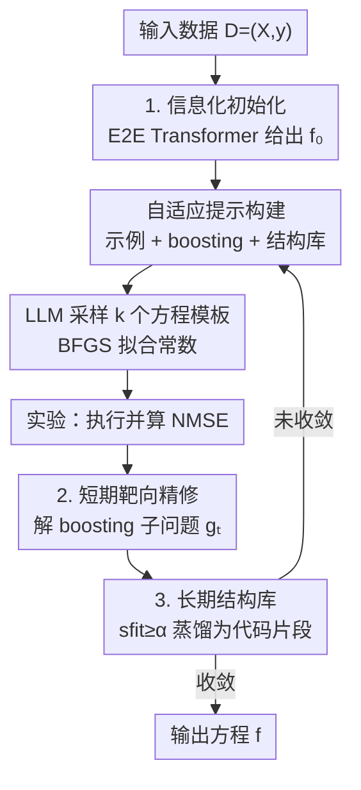

# Robust Equation Structure Learning with Adaptive Refinement (RESTART)

**会议**: ICLR 2026  
**OpenReview**: [https://openreview.net/forum?id=z9TKJhLVKj](https://openreview.net/forum?id=z9TKJhLVKj)  
**代码**: https://github.com/Liyunlun/RESTART  
**领域**: 符号回归 / AI for Science / LLM 科学发现  
**关键词**: 符号回归, 方程发现, Boosting 残差, 结构库, LLM

## 一句话总结
RESTART 把科学发现的「假设—实验—分析」三段闭环完整地搬进符号回归：先用 Transformer 给出强初始方程，再用 boosting 式的"探索函数"显式建模当前方程"没解释清楚"的部分作为短期靶向反馈，并把每次成功的修正蒸馏成可复用的代码片段存进结构库做长期知识，从而在 LLM-SRBench 上以更低误差、更高恢复率超过现有 SOTA，且在 OOD 数据上能逼近真值函数形式。

## 研究背景与动机
**领域现状**：符号回归（Symbolic Regression, SR）的目标是从数据中自动恢复人类可读的数学表达式，是自动化科学发现的核心。现有方法分两大派：搜索派（遗传编程 GP、强化学习 DSR）靠变异/交叉在表达式空间里随机演化；映射派（Transformer，如 E2E）在大规模合成语料上训练，把数值数据直接一步映射成符号表达式。近期则兴起 LLM 派，借助大模型的符号推理与自然语言先验来生成与改写候选方程。

**现有痛点**：搜索派受组合爆炸困扰，要评估几十万个候选、收敛慢且容易给出过于复杂的表达式；映射派单次假设很强但缺乏基于误差模式的修正机制，一旦分布漂移（OOD）就脆弱；而大多数 LLM 派只实现了科学循环的前两步——"提出假设"和"做实验（算 loss）"，却没有一个**有原则的分析阶段**把观测到的误差转化成对下一步假设的明确指导。喂给 LLM 的往往只是一个 loss 数值或粗糙残差，信号太弱。

**核心矛盾**：科学家真正强大的地方在于"分析"——看出当前模型**漏掉了什么结构**（哪个算子、哪个交互项），然后定向补上。现有 SR 把这一环截断了，于是要么盲目搜索、要么一锤子买卖，无法像人一样逐轮逼近真相。

**本文目标**：补上被截断的"分析"环，让 SR 形成完整的「假设—实验—分析」闭环，并把单轮的修正经验沉淀成跨轮可复用的知识。

**切入角度**：作者观察到，当前方程的误差不该被压缩成一个标量，而应被显式建模成一个**子问题**——学一个同时吃当前预测 $f_t(x)$ 和原始特征 $x$ 的探索函数 $g_t$，它的符号形式天然描述了"预测该如何被修正"，这正是定向、可执行的分析信号。

**核心 idea**：用 boosting 式残差子问题给出"短期靶向反馈"，用改进门控的结构库给出"长期累积知识"，两者一起喂进自适应提示，驱动 LLM 在映射派强初始化的基础上迭代精修方程。

## 方法详解

### 整体框架
RESTART 要解决的是"如何让 LLM 在符号回归里像科学家一样逐轮修正方程"。它把整个过程组织成一个三阶段循环：**假设（Hypothesis）→ 实验（Experiment）→ 分析（Analysis）**。

具体地：给定数据集 $D=\{(x_i,y_i)\}$，先用映射派估计器 E2E 一步生成强初始假设 $f_0$（保留了多项式、三角、指数等非线性结构，而不是从一个只会加性叠加的线性模型起步）。随后进入迭代循环——每轮先**自适应构建提示**（融合少样本示例、boosting 残差摘要、结构库片段），让生成器 LLM 自回归采样 $k$ 个方程模板（以 Python 函数形式给出，常数留空），用 BFGS 拟合常数后在数据上算 NMSE（实验阶段）；接着进入分析阶段：求解一个 boosting 子问题得到探索函数 $g_t$，把 $(f_t, g_t)$ 连同各自 loss 存入示例缓冲区，再用一个综合的 fitness 分数 $s_{\text{fit}}$ 给本轮修正打分，若 $s_{\text{fit}}\ge\alpha$ 就让 LLM 把"带来改进的结构"总结成一段命名好的代码片段存进结构库。如此循环，直到收敛或耗尽预算，输出最终方程。

其中"自适应提示构建"是把三种信息源粘合起来的脚手架（任务定义 + $n$ 个示例-boosting 对 + $m$ 个高分结构片段），真正承载本文创新的是下面三个贡献组件。

### 关键设计

**1. 信息化初始化：用 Transformer 给出带非线性结构的强起点**

许多 LLM-SR 方法（如 LLMSR）从一个简单线性模型起步，它只能捕捉输入变量的加性效应，把后续所有非线性结构的负担全压给迭代精修。RESTART 改用映射派估计器 E2E（Kamienny et al., 2022）做初始化：它直接把输入数据映射成一个符号表达式作为先验 $f_0$，里面已经编码了多项式、三角、指数等显著非线性以及多变量交互项。这样起点就站在"已经像样"的假设上，后续精修只需在结构上做局部纠错，而不是从零搭骨架——这是后面短期/长期机制能高效收敛的前提。

**2. 短期靶向精修：把"没解释清楚的信号"显式建成 boosting 子问题**

这是全文最核心的"分析"机制，针对的痛点是——以往只把误差压成一个标量喂给 LLM，信号太弱、无法指出该改哪里。RESTART 在第 $t$ 轮维护当前假设 $f_t$，并定义一个探索函数类 $G$，其中 $g:\mathbb{R}^{d+1}\to\mathbb{R}$ 同时吃当前预测 $f_t(x)$ 和原始特征 $x$，求解

$$g_t \leftarrow \arg\min_{g\in G} L\big(g(f_t(x), x),\, y\big).$$

这个目标让 $g_t$ 成为对 $f_t$ 的一次 boosting 式修正：因为 $g_t$ 同时看到当前预测值和特征，它的符号形式直接描述了"当前预测应随其自身取值和特征如何被调整"才能更贴近 $y$。求解后端是可插拔的（KAN、RL、映射派都行，实验用预训练 Transformer 平衡速度与精度），而后端选择不改变这个公式表述。求得的 $g_t$ 会连同 $f_t$ 一起以摘要形式写进提示——于是 LLM 拿到的不再是"loss=0.03"这种废话，而是"你漏了一个 $\sin$ 项交互"这种可执行的定向线索，这正是它在 OOD 上能补回被基线漏掉的关键算子的原因。

**3. 长期结构库：用改进门控只留"真有用"的修正并蒸馏成可复用代码**

短期信号是逐实例、易过拟合短期噪声的；若不加筛选地把所有"分析洞察"都照单全收，会膨胀复杂度、塞满冗余。RESTART 用一个改进门控（improvement-gated）的准入策略只保留**确实降了任务 loss** 的 boosting 修正。它先用一个综合 fitness 分数 $s_{\text{fit}}$ 给候选打分：对新假设 $f_{\text{new}}$ 与当前提示里 loss 最低的基线 $f_{\text{base}}$，计算相对改进 $R=\frac{l_{\text{base}}-l_{\text{new}}}{l_{\text{base}}}$ 和绝对改进 $\Delta=l_{\text{base}}-l_{\text{new}}$，再归一化为 $s_r=1-e^{-kR}$、$s_a=1-(1+\Delta)^{-1}$，最后加权合成

$$s_{\text{fit}} = 100\cdot(w_r s_r + w_a s_a),\quad w_r+w_a=1.$$

其中 $s_r$ 抓比例收益（$k$ 调灵敏度），$s_a$ 用饱和形式抓绝对收益、防止超大绝对改进霸占分数——这样既认"高误差问题上的大绝对收益"也认"低误差问题上的显著相对收益"。给定阈值 $\alpha$，只有 $s_{\text{fit}}\ge\alpha$ 的修正被判为 high-value，交给 LLM 总结成三元组 $c=(\text{name},\text{desc},h)$：规范名、简述、以及一小段实现该结构的 Python 代码（如 `np.sin(x)`）。结构库 $C$ 插入 $(c,s_{\text{fit}})$ 时若遇同名条目就合并——取代码片段并集、取最高 $s_{\text{fit}}$、保留最早的 desc；并施加容量约束 $|C|\le K$，超了就驱逐最低分条目。把结构存成"可执行代码"而非自然语言概念，是它比同类概念库（如 Grayeli et al.）更直接可用、更高效的关键。

### 一个完整示例
以 Biology 数据集里的难题 BPG12 为例：E2E 初始化给出一个含主要非线性的 $f_0$，但漏掉了一个谐振交互项。短期机制求解 boosting 子问题，$g_t$ 的符号形式暴露出"预测在某区间系统性偏离、需补一个随特征振荡的修正"，这条线索写进提示后，LLM 在下一轮生成的方程里补回了该谐振交互——而基线 LLMSR 始终漏掉它。该修正带来明显 loss 下降、$s_{\text{fit}}$ 超过阈值，于是被蒸馏成一段命名代码存入结构库，供后续相似问题复用。最终 RESTART 在 BPG12 上 ID/OOD 的 $R^2$ 都达到 1.000，而 LLMSR 的 OOD $R^2$ 只有 0.955。

### 损失函数 / 训练策略
方法本身不训练新模型：生成器是冻结的 LLM（默认 Qwen3-8B），初始化与子问题求解用预训练 Transformer（E2E）。每个候选方程的常数用 BFGS 求解器拟合以最小化训练 MSE；评价与门控用 NMSE / fitness 分数。关键超参包括 fitness 的 $k,w_r,w_a$、准入阈值 $\alpha$、结构库容量 $K$、每轮采样数 $k$ 与示例/结构数 $n,m$。

## 实验关键数据

### 主实验
在 LLM-SRBench（含 LSR-Transform 111 题与 LSR-Synth 93 题，覆盖物理/生物/材料）上，LLM 类方法统一用 Qwen3-8B 骨干。训练分布内主结果（NMSE 越低越好、ACC 越高越好）：

| 数据集 | 指标 | LLMSR (SOTA) | RESTART |
|--------|------|--------------|---------|
| LSR-Transform | NMSE / ACC | 0.160 / 74.32 | **0.157 / 74.77** |
| Biology | NMSE / ACC | 0.016 / 70.83 | **0.001 / 77.08** |
| Material Science | NMSE / ACC | 0.003 / 96.00 | **0.001 / 96.00** |
| Physics | NMSE / ACC | **0.002** / 84.09 | 0.003 / **85.23** |

OOD 测试（Table 2，NMSE 截断在 100）上优势更明显：

| 数据集 | 指标 | LLMSR | RESTART |
|--------|------|-------|---------|
| Biology | NMSE / ACC | 6.667 / 45.83 | **5.087 / 52.08** |
| Material Science | NMSE / ACC | 0.084 / 96.00 | **0.075 / 100.00** |
| Physics | NMSE / ACC | 14.808 / 65.91 | **8.167 / 71.59** |

材料科学 OOD 上 RESTART 把准确率拉满到 100%，且在四个挑战题（BPG2/12/18/20）的可视化中，方程在 OOD 区间仍紧贴真值曲线，而基线常因过复杂项在训练区外发散。

### 消融实验
在 BPG12（ID/OOD）上逐项拆解三大组件（图 5b/5c）：

| 配置 | 说明 |
|------|------|
| Full RESTART | 完整三组件，NMSE 最低 |
| w/o Init | 去掉信息化初始化，明显掉点 |
| w/o Short | 去掉短期靶向精修，明显掉点 |
| w/o Long | 去掉长期结构库，明显掉点 |
| Additive | 把 boosting 退化为只拟合经典加性残差 $g(x)=y-f_t(x)$，NMSE 大幅上升 |

### 关键发现
- **三组件缺一不可**：去掉初始化、短期分析或长期保留中任意一个都会显著掉点，验证了完整「假设—实验—分析」闭环的必要性。
- **改进来自"结构精修"而非"填数值残差"**：Additive 变体只让 $g$ 去拟合加性残差 $y-f_t(x)$，NMSE 大幅恶化——说明 RESTART 的增益主要源于让 $g$ 同时吃 $f_t(x)$ 与 $x$ 所揭示的**结构性修正**，而不是简单补上数值缺口。
- **算法增益与骨干无关**：换不同 LLM 骨干虽影响绝对性能（更强模型更准，Table 3），但 RESTART 始终领先其他 LLM 方法，说明优势来自设计而非某个特定模型。
- **更省算力**：搜索轨迹（图 5a）显示 RESTART 在前 100 步 NMSE 就急剧下降并反超 LLMSR；仅用 25% 迭代预算就能超过基线，靶向分析的开销被搜索效率的提升大幅抵消。
- **真实科学任务可用**：在 Bohmian 力学粒子速度发现（含嵌套非线性、跨变量除法交互、巨量级单位换算常数）的 case study 中，RESTART 恢复出的方程 $R^2(\text{equation})$ 达 0.97–0.998。

## 亮点与洞察
- **把"误差"从标量升级成可执行子问题**：让探索函数 $g_t$ 同时吃预测和特征，使"分析阶段"输出的是带符号结构的定向修正，而非一个无信息的 loss——这是整篇最巧妙、也最可迁移的点子，本质是把 boosting 思想符号化。
- **结构存成代码而非自然语言**：相比同类"概念库"用自然语言描述模式，存可执行 Python 片段让知识能被 LLM 直接调用拼装，省去二次解释、更不易跑偏。
- **fitness 双成分设计**：相对收益 $s_r$ + 饱和绝对收益 $s_a$ 的组合，巧妙地让"低误差问题的小相对改进"和"高误差问题的大绝对改进"都能被公平识别，避免门控偏向某一类问题。
- 这套"强初始化 + 残差子问题 + 门控记忆库"的范式可迁移到任意 LLM 驱动的迭代式程序/方程搜索（如程序合成、网络结构搜索）。

## 局限与展望
- 每轮都要额外求解 boosting 子问题并做结构总结，引入了计算开销；作者论证总运行时间不显著增加，但更复杂的求解后端会进一步抬高单步成本（Table 4 显示求解器存在表达力-成本权衡）。
- 子问题求解后端、fitness 的 $k/w_r/w_a$、阈值 $\alpha$、库容量 $K$ 等超参较多，论文主要给经验设置，跨域稳健性与调参代价未充分展开。
- 评测集中在 LLM-SRBench 的物理/生物/材料合成与变换任务，真实世界仅一个 case study；面向高维、强噪声、含隐变量的真实科学数据时的表现仍待检验。
- 方法依赖 LLM 能把"带来改进的结构"正确总结成代码，若总结出错或幻觉，门控只看 loss 未必能完全拦住，可能污染结构库。

## 相关工作与启发
- **vs LLMSR（当前 SOTA LLM-SR）**：LLMSR 用静态/弱误差信号驱动 LLM 改写，从线性模型起步；RESTART 改用映射派强初始化、把误差建成 boosting 子问题给出靶向信号、并加门控结构库——在几乎所有 benchmark（尤其 OOD）上更优且更省迭代。
- **vs 概念库类方法（Grayeli et al. / Wang et al.）**：它们从大量正负假设中抽象出自然语言概念；RESTART 只从高价值修正里蒸馏结构、且存成可执行代码，指导更直接、库更精简。
- **vs 映射派（E2E）**：E2E 单次假设强但 OOD 脆弱；RESTART 把它当初始化器，叠加迭代精修补足其缺乏误差驱动修正的短板。
- **vs 搜索派（PySR / DSR）**：GP/RL 靠随机算子在组合爆炸空间盲搜、慢且易过复杂；RESTART 用定向分析把搜索导向有前景区域，大幅减少无效假设评估。

## 评分
- 新颖性: ⭐⭐⭐⭐⭐ 把 boosting 残差符号化为"分析阶段"的定向信号，补全 SR 长期缺失的科学闭环，立意清晰。
- 实验充分度: ⭐⭐⭐⭐ ID/OOD/消融/骨干/求解器/真实 case 都覆盖，但真实科学数据只有单例。
- 写作质量: ⭐⭐⭐⭐⭐ 三组件与科学循环映射清楚，公式与动机讲得透。
- 价值: ⭐⭐⭐⭐ 为 LLM 驱动的方程发现给出一套可复用、可迁移的范式，OOD 泛化提升实用。

<!-- RELATED:START -->

## 相关论文

- [\[ICLR 2026\] Adaptive Conformal Guidance for Learning under Uncertainty](adaptive_conformal_guidance_for_learning_under_uncertainty.md)
- [\[ICLR 2026\] Learning Structure-Semantic Evolution Trajectories for Graph Domain Adaptation](learning_structure-semantic_evolution_trajectories_for_graph_domain_adaptation.md)
- [\[ICLR 2026\] Noisy-Pair Robust Representation Alignment for Positive-Unlabeled Learning](noisy-pair_robust_representation_alignment_for_positive-unlabeled_learning.md)
- [\[NeurIPS 2025\] Overfitting in Adaptive Robust Optimization](../../NeurIPS2025/others/overfitting_in_adaptive_robust_optimization.md)
- [\[ICLR 2026\] Regulating Internal Alignment Flows for Robust Learning Under Spurious Correlations](regulating_internal_alignment_flows_for_robust_learning_under_spurious_correlati.md)

<!-- RELATED:END -->
